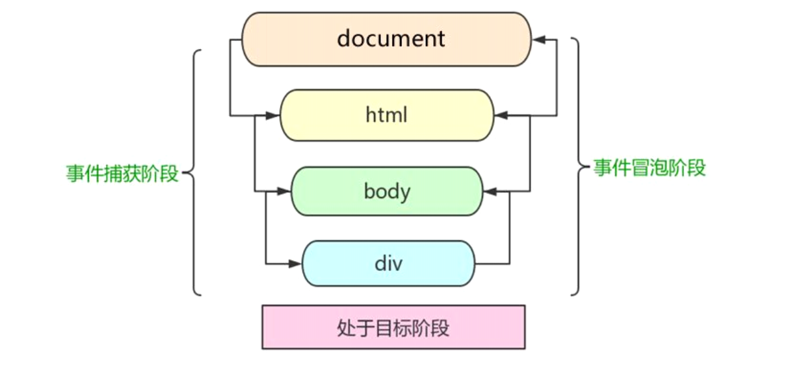
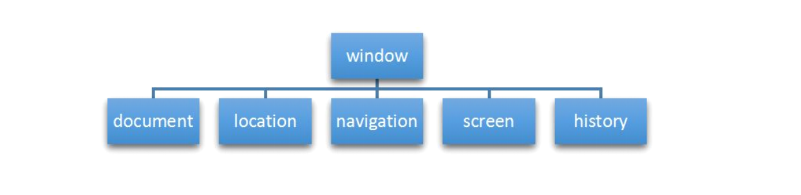
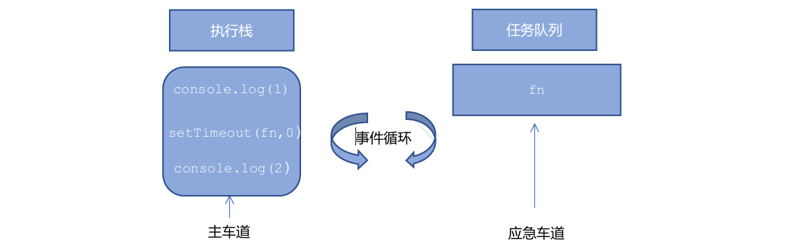
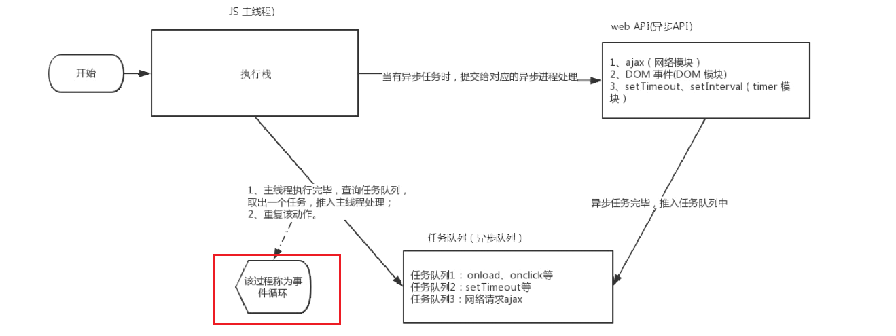
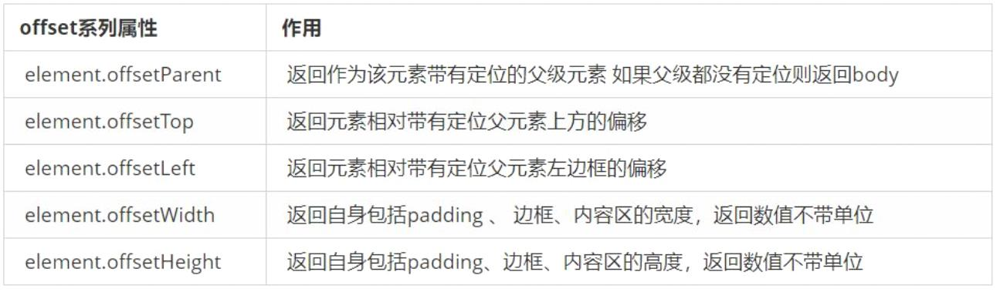
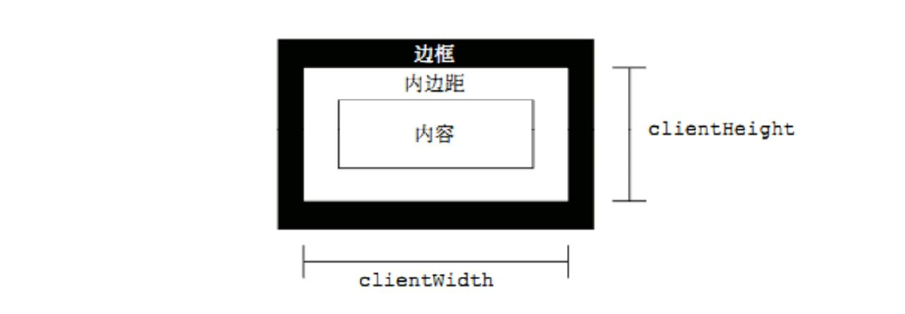
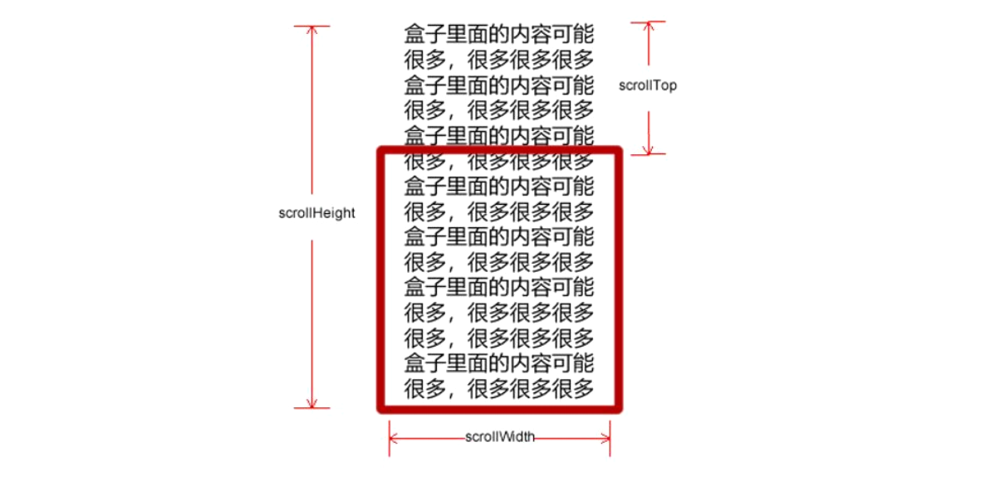

# （一）Web Api 简介

## 1. Web APIs 和 JS 基础关联性

### 1.1 JS 组成

- ECMAScript: JS 语法
- BOM: Web API
- DOM: Web API

## 2. API 和 Web API

### 2.1 API

API：Application Programming Interface，应用程序接口。

### 2.2 Web API 

Web API 是浏览器提供得一套操作浏览器功能和页面元素得 API（BOM 和 DOM）。

# （二）DOM 基础

## 1. DOM 简介

### 1.1 什么是 DOM

文档对象模型（Document Object Model，简称DOM )，是W3C组织推荐的处理可扩展标记语言（HTML或者XML)的标准编程接口。

W3C已经定义了一系列的DOM接口，通过这些DOM接口可以改变网页的内容、结构和样式。

### 1.2 DOM 树

- 文档：一个页面就是一个文档，DOM中使用document表示
- 元素：页面中的所有标签都是元素，DOM中使用element表示
- 节点：网页中的所有内容都是节点（标签、属性、文本、注释等），DOM中使用node表示

以上内容都称之为对象

## 2. 获取元素

### 2.1 如何获取页面元素

DOM 在我们实际开发中主要用来操作元素。我们如何来获取页面中的元素呢?

获取页面中的元素可以使用以下几种方式:

- 根据ID获取
- 根据标签名获取
- 通过HTML5新增的方法获取
- 特殊元素获取

### 2.2 根据 ID 获取

使用 `getElementByld()` 方法可以获取带有 ID 的元素对象，并返回一个 `Element` 对象。

- `console.dir()` 可打印元素的属性和方法

### 2.3 根据标签名获取

使用 `getElementsByTagName()` 方法可以返回带有指定标签名的对象的集合。

- 返回的是 **元素对象的集合，伪数组形式表示**。
- 可以遍历返回的伪数组。
- 得到的元素对象是动态的。
- 若没有元素，则返回空的伪数组 `[]`。

指定父元素，父元素必须是指定的单个元素。

```js
let ol = document.getElementsByTagName('ol');
console.log(ol[0].getElementsByTagName('li'));
```

若给 `ol` 指定了 id: `ol`:

```js
let ol = document.getElementById('ol');
console.log(ol.getElementsByTagName('li');
```

### 2.4 通过 HTML5 新增方法获取

1. 根据类名返回元素对象集合。

   ```js
   document.getElementsByClassName('类名'); 
   ```

2. 根据指定选择器返回第一个元素对象。

   ```js
   document.querySelector('选择器'); 
   ```

3. 返回指定选择器的所有元素集合。

   ```js
   document.querySelectorAll('选择器') 
   ```

> [!TIP]
> 对于这些获取事件，要不就是返回一个元素对象，要不就是返回一个对象集合。对于返回的对象集合，都可以是作为一种伪数组，可以通过 `elems.length` 来获取元素对象个数。

### 2.5 获取特殊元素

1. 获取 `body` 元素

   ```js
   document.body;
   ```

2. 获取 `html` 元素

   ```js
   document.documentElement;
   ```

## 3. 事件基础

### 3.1 事件概述

JavaScript 使我们有能力创建动态页面，而事件是可以被 JavaScript 侦测到的行为。

简单理解︰触发--响应机制。

网页中的每个元素都可以产生某些可以触发 JavaScript 的事件，例如，我们可以在用户点击某按钮时产生一个事件，然后去执行某些操作。

### 3.2 事件三要素

- 事件源：事件被触发的对象（按钮）。
- 事件类型：如何触发、什么事件（点击按钮）。
- 事件处理程序：可通过一个函数赋值的方式实现。

1. 获取事件源

   ```html
   <button id="btn">唐伯虎</button>
   ```

2. 注册事件

   ```js
    let btn = document.getElementById('btn');
   ```

3. 添加事件处理程序

   ```js
   btn.onclick = () => alert('点秋香');
   ```

> [!TIP]
> 执行事件的步骤
>
> 1. 获取事件源
> 2. 注册事件（绑定事件）
> 3. 添加事件处理程序（函数赋值）

### 3.4 常见鼠标事件

|   鼠标事件    |     触发条件     |
| :-----------: | :--------------: |
|   `onclick`   | 鼠标点击左键触发 |
| `onmouseover` |   鼠标经过触发   |
| `onmouseout`  |   鼠标离开触发   |
|   `onfocus`   | 获得鼠标焦点触发 |
|   `onblur`    | 失去鼠标焦点触发 |
| `onmousemove` |   鼠标移动触发   |
|  `onmouseup`  |   鼠标弹起触发   |
| `onmousedown` |   鼠标按下触发   |

## 4. 操作元素

使用 JavaScript DOM 可以改变网页内容、结构和样式。以下是元素的属性。

### 4.1 改变元素内容

从起始位置到终止位置的内容,但它去除html标签，同时空格和换行也会去掉

```js
element.innerText
```

起始位置到终止位置的全部内容，包括html标签，同时保留空格和换行

```js
element.innerHTML
```

### 4.2 innerText 和 innerHTML 的区别

1. `innerText` 不识别 html 标签，`innerHTML` 识别 html 标签。

   ```js
   div.innerHTML = ' <strong>今天是：</strong>2021-3-23';
   ```

2. `innerText` 会取出空格和换行，`innerHTML` 保留换行和空格。

### 4.3 常用元素的属性操作


1. `innerText`、`innerHTML` 改变元素内容
2. `src`、`href`
3. `id`、`alt`、`title`


示例

```js
let vsc = document.getElementById('vsc');
let zh = document.getElementById('zh');
let img = document.querySelector('img');
vsc.onclick = () => {
    img.src = 'images/vscode.jpg';
    img.title = 'vscode';
}
```

### 4.4 表单元素的属性操作

利用 DOM 可以操控以下表单元素的属性。

```
type, value, checked, selected, disabled
```

### 4.5 样式属性操作

我们可以通过JS修改元素的大小、颜色、位置等样式。

1. `element.style`：行内样式操作
2. `element.className`：类名样式操作


> [!tip]
>
> 1. Js 里面的样式采取驼峰命名法比如 `fontSize`、`backgroundColor`

2. JS修改 `style` 样式操作，产生的是行内样式，css 权重比较高
3. 如果样式修改较多，可以采取操作类名方式更改元素样式
4. class 因为是个保留字，因此使用 `className` 来操作元素类名属性
5. `className` 会直接更改元素的类名，会覆盖原先的类名。

### 4.6 排他思想

如果有同一组元素，我们想要某一个元素实现某种样式，需要用到循环的排他思想算法：

1. 所有元素全部清除样式（**干掉其他人**）
2. 给当前元素设置样式（**留下我自己**）
3. 注意顺序不能颠倒，首先干掉其他人，再设置自己。

```js
 const btns = document.getElementsByTagName('button');
    for (let i = 0; i < btns.length; i++) {
        btns[i].onclick = function () {
            for (let j=0;j<btns.length;j++) {
                btns[j].style.backgroundColor = '';
            }
            this.style.backgroundColor = 'pink';
        }
    }
```

> [!TIP]
> 根据这个算法可以用来实现鼠标经过每一行时背景变色。

### 4.7 H5自定义属性

自定义属性目的：是为了保存并使用数据，有些数据可以保存到页面中而不用保存到数据库中。

####  4.7.1 设置H5自定义属性

H5规定自定义属性以 `data-` 开头作为属性名并赋值。

```html
<div data-index="1"></div>
```

####  4.7.2 获取H5自定义属性

1. 兼容性获取 `element.getAttribute('data-index')`
2. H5新增方法 `element.dataset.index` 或 `element.dataset['index']` 获取。（>=ie11）
3. 如果自定义属性里面有多个链接的单词，则使用驼峰命名法获取。

> [!warning]
> 对于 `element.dataset.index` 和 `element.dataset['index']` 方法，注意 `index` 和 `data-index` 中的要对应。

### 4.8 元素属性操作

#### 4.8.1 获取属性值

- `element.属性`;：一般用于获取本身自带属性值。
- `element.getAttribute('属性');`：主要获得自定义的属性（标准）我们程序员自定义的属性。

#### 4.8.2 设置属性值

- `element.属性='值';`：设置内置属性值。
- `element.setAttribute('属性', '值');`：设置自定义属性。

> [!TIP]
> 对于 `element.setAttribute` 方法，若属已存在，则更新该属性值；否则，创建一个新属性。

```js
div.setAttribute('index', 1);
div.setAttribute('class', 'footer');
```

> [!warning]
> 使用 `element.属性` 获取或设置类名时，要用 `className`，而对于 `element.setAttribute()` 方法，直接使用 `class`，即：`div.setAttribute('class', 'footer')`。

#### 4.8.3 移除属性

- `element.removeAttribute(属性);`

## 5. 结点操作

### 5.1为什么学节点操作

获取元素通常使用两种方式:

1. 利用DOM提供的方法获取元素，缺点：逻辑性不强、繁琐
   - `document.getElementByld()`
   - `document.getElementsByTagName()`
   - `document.querySelector()`  

2. 利用 **节点层级关系** 获取元素
   - 利用父子兄节点关系获取元素
   - 优点：逻辑性强
   - 缺点：兼容性稍差

### 5.2 节点概述

网页中的所有内容都是节点(标签、属性、文本、注释等），在DOM中，节点使用 `node` 来表示。

HTML DOM 树中的所有节点均可通过 JavaScript 进行访问，所有 HTML 元素（节点）均可被修改，也可以创建或删除。

一般地，节点至少拥有 `nodeType` (节点类型)、`nodeName` (节点名称）和 `nodeValue` (节点值）这三个基本属性。

**三种基本节点类型：**

- 元素节点 `nodeType` 为 `1`
- 属性节点 `nodeType` 为 `2`
- 文本节点 `nodeType` 为 `3`（文字、空格、换行）

实际开发中，主要操作的还是元素节点。

### 5.3 节点层级

#### 5.3.1 父级节点

获取离元素最近的父节点，若找不到则返回 `null`。

```js
node.parentNode
```

#### 5.3.2 子节点

```js
parentNode.childNodes
```

`parentNode.childNodes` 返回包含指定 **节点的子节点的集合**，该集合为即时更新的集合。


> [!warning]
> 注意：`parentNode.childNodes` 包含了所有的子节点，包括元素节点，文本节点等。
> 如果只想要获得里面的元素节点，则需要专门处理。所以我们一般不提倡使用 `childNodes`。

```js
// 筛选元素节点
for (let i = 0; i < ul.childNodes.length; i++) {
            if (ul.childNodes[i].nodeType === 1) {
                console.log(ul.childNodes[i]);
            }
        }
```

**更加好的方法：获取子元素节点**

```js
parentNode.children;
```

子节点方法：

① 获取 **所有结点** 中的第一个和最后一个：

- `parentNode.firstChild`
- `parentNode.lastChild`

② 获取 **元素节点**中第一个和最后一个

- `parentNode.firstElementChild`
- `parentNode.lastElementChild`

（>=IE9）

③ **实际开发**：

- `parentNode.children[0]`
- `parentNode.children[parentNode.children.length -1]`

#### 5.3.3 兄弟节点

1. 返回下一个兄弟节点：

   ```js
   node.nextSibling
   ```

2. 返回上一个的兄弟节点：

   ```
   node.previousSibling
   ```

   `nextsibling` / `previousSibling` 返回当前元素的下/上一个兄弟节点，找不到则返回 `null`。这个兄弟节点可能是是所有的节点之一（即元素节点、文本节点等）。

3. 返回下一个 **兄弟元素节点**（≥IE9）

   ```js
   node.nextElementSibling
   ```

4. 返回上一个 **兄弟元素节点**（≥IE9）

   ```js
   node.previousElementSibling
   ```

   `nextElementSibling` / `previousElementSibling` 返回当前元素下/上一个兄弟元素节点，找不到则返回 `null`。

> [!warning]
> 这两个方法（`nextElementSibling` / `previousElementSibling`）有兼容性问题，IE9 以上才支持。

解决方法：封装一个函数。 

```js
// 处理 <IE9 兼容性问题
function getNextElementSibling(node) {
    let n = node;
    while (n = n.nextSibling) {
        if (n.nodeType === 1) {
            return n;
        }
    }
    return null;
}
```

#### 5.3.4 创建并添加节点

```js
document.createElement("tagName");
```

`document.createElement()` 方法创建由 `tagName` 指定的 HTML 元素。因为这些元素原先不存在，是根据我们的需求动态生成的，所以我们也称为 **动态创建元素节点**。

在创建了元素节点后，还需要将节点添加到页面中。`appendChild()` 方法可以给元素节点添加子元素节点，若某元素已存在则重复添加，在页面已存在的元素 **后面追加新节点**。

```js
 parentNode.appendChild(chileNode)
```

类似的，也可以使用 `insertBefore()` 方法在指定元素的前面插入节点。

```js
let insertedNode = parentNode.insertBefore(newNode, referenceNode)
```

参数说明：

- `insertedNode`：同 `newNode`，待插入的新节点。
- `parentNode`：被插入的父节点。
- `newNode`：待插入的新节点。
- `referenceNode`：指定元素节点，新节点将插入到该元素节点的前面。

> [!TIP]
> 在一个页面中要添加元素节点，先创建节点，然后添加节点。

#### 5.3.5 删除节点

DOM 提供了 `removeChild(childNode)` 方法，删除一个子节点，并返回删除的节点。其中 `childNode` 为待删除的子节点。

```js
// 方式一
parentNode.removeChild(childNode);
// 方式二
let oldChild = parentNode.removeChild(childNode);
```

#### 5.3.6 复制节点

`node.cloneNode()` 方法返回调用该方法的节点的一个副本。也称为克隆节点/拷贝节点。其中 `node` 为被克隆的元素节点。

```js
node.cloneNode([deep]);
```

或者

```js
let newClone = node.cloneNode([deep]);
```

对于 `deep` 参数，可以为 `true` 或 `false`，或为空的：

| `deep` 参数值 | 含义                                   |
| ------------- | -------------------------------------- |
| `true`        | 深拷贝，同时复制节点本身和里面的子节点 |
| `false`       | 浅拷贝，只复制节点本身，不复制子节点   |
| `空`          | 空，同 `false`                         |

#### 5.3.7 三种动态创建元素的区别

- `document.write()`
- `element.innerHTML`
- `element.createElement()`

区别：

1. `document.write()` 创建元素，是直接将内容写入页面的内容流，但是 **当文档流执行完毕，会导致页面全部重绘**。即覆盖原本的页面。
2. `innerHTML` 是将内容写入某个 DOM 节点，不会导致页面全部重绘。  
3. `innerHTML` 创建多个元素效率更高（**不要拼接字符串，采取数组形式拼接**），结构稍微复杂。  
4. `createElement()` 创建多个元素效率稍低一点点，但是结构更清晰。  

总结：不同浏览器下，`innerHTML` 效率要比 `creatElement`高。

## 6. DOM 学习阶段核心总结

关于 dom 操作，我们主要针对于元素的操作。主要有创（建）、增、删、改、查、属性操作、事件操作。

### 6.1 创

- `document.write`
- `innerHTML`
- `createElement`

### 6.2 增

- `appendChild`
- `insertBefore`

### 6.3 删

- `removeChild`

### 6.4 改

主要修改 dom 的元素属性，dom 元素的内容、属性，表单的值等。

- 修改元素属性：`src`、`href`、`title` 等
- 修改普通元素内容：`innerHTML`、`innerText`
- 修改表单元素：`value`、`type`、`disabled` 等
- 修改元素样式：`style`、`className`

### 6.5 查

主要获取查询dom的元素

- DOM提供的API 方法：`getElementById`、`getElementsByTagName`（**古老用法不太推荐**）
- H5提供的新方法：`querySelector`、`querySelectorAll` 提倡
- 利用节点操作获取元素：父（`parentNode`)、子（`children`）、兄（`previousElementSibling`、
  `nextElementSibling`）提倡

### 6.6 属性操作

主要针对于自定义属性

- `setAttribute`：设置dom的属性值
- `getAttribute`：得到dom的属性值
- `removeAttribute`：移除属性

### 6.7 事件操作

给元素注册事件，格式：`事件源.事件类型 = 事件处理程序`

| 鼠标事件      | 触发条件         |
| ------------- | ---------------- |
| `onclick`     | 鼠标点击左键触发 |
| `onmouseover` | 鼠标经过触发     |
| `onmouseout`  | 鼠标离开触发     |
| `onfocus`     | 获得鼠标焦点触发 |
| `onblur`      | 失去鼠标焦点触发 |
| `onmousemove` | 鼠标移动触发     |
| `onmouseup`   | 鼠标弹起触发     |
| `onmousedown` | 鼠标按下触发     |

# （三）事件高级

## 1. 注册事件（绑定事件）

### 1.1 注册事件概述

给元素添加事件，称为注册事件或者绑定事件。
注册事件有两种方式：**传统方式** 和 **事件监听注册方式**。

#### 1.1.1 传统注册方式

- 利用on 开头的事件onclick
- `<button onclick="alert('hi~')"></button>`
- `btn.onclick = function() {};`
- 特点：注册事件的 **唯一性**
- 同一个元素同一个事件只能设置一个处理函数，最
  后注册的处理函数将会 **覆盖** 前面注册的处理函数。

#### 1.1.2 事件监听注册方式

- w3c 标准推荐方式
- `addEventListener()` 它是一个方法
- IE9 之前的 IE 不支持此方法，可使用 `attachEvent()` 代替
- 特点：**同一个元素同一个事件可以注册多个监听器**
- 按注册顺序依次执行

### 1.2 addEventListener 事件监听方式

```js
eventTarget.addEventListener(type, listener[, useCapture])
```

`eventTarget.addEventListener()` 方法将指定的监听器注册到 `eventTarget`（目标对象）上，当该对
象触发指定的事件时，就会执行事件处理函数。

该方法接收三个参数：

- `type`：事件类型字符串，比如 `click` 、`mouseover`，注意这里不要带 on。
- `listener`：事件处理函数，事件发生时，会调用该监听函数
- `useCapture`：可选参数，是一个布尔值，默认是 `false`。学完 DOM 事件流后，我们再进一步学习。

> [!warning]
> ≥IE9 版本支持

### 1.3 attachEvent 事件监听方式（IE8以及早期版本独有）

```js
eventTarget.attachEvent(eventNameWithOn, callback)
```

`eventTarget.attachEvent()` 方法将指定的监听器注册到 `eventTarget`（目标对象）上，当该对象触
发指定的事件时，指定的回调函数就会被执行。
该方法接收两个参数：

- `eventNameWithOn`：事件类型字符串，比如 `onclick`、`onmouseover`，这里要带 `on`
- `callback`：事件处理函数，当目标触发事件时回调函数被调用

> [!warning]
> IE8 及早期版本独有，在 chrome 不起作用。如要兼容，可自定义兼容新函数。

## 2. 删除事件（解绑事件）

### 2.1 传统注册方式

```js
eventTarget.onclick = null;
```

### 2.2 方法监听注册方式

#### 2.2.1 removeEventListener（≥IE9）

```js
eventTarget.removeEventListener(type, listener[, useCapture]);
```

> [!TIP]
> 一个对象可能绑定了很多事件，对于 `removeEventListener` 方法，需要指定要删除的事件 `listener`。所以在注册事件的时候需要提前将事件函数封装在一个变量里。然后把变量传给 `removeEventListener` 方法。

例如：

```js
let btns = document.querySelectorAll("button");
var func1 = function () {
    console.log("I \'m click(addEventListener)");
    btns[0].removeEventListener("click", func1);
};
btns[0].addEventListener('click', func1);
```

#### 2.2.2 detachEvent（仅适用于IE8及以下）

```js
eventTarget.detachEvent(eventNameWithOn, callback);
```


## 3. DOM 事件流

### 3.1 定义

**事件流** 描述的是从页面中接收事件的顺序。  

**事件** 发生时会在元素节点之间 **按照特定的顺序** 传播，这个传播过程即 **DOM 事件流**。  

比如我们给一个 `div` 注册了点击事件。  
DOM 事件流分为3个阶段：

```
捕获阶段 => 当前目标阶段 => 冒泡阶段
```

- **事件冒泡**：IE 最早提出，事件开始时由最具体的元素接收，然后逐级向上传播到到 DOM 最顶层节点的过程。
- **事件捕获**：网景最早提出，由DOM 最顶层节点开始，然后逐级向下传播到到最具体的元素接收的过程。

我们向水里面扔一块石头，首先它会有一个下降的过程，这个过程就可以理解为从最顶层向事件发生的最具
体元素（目标点）的捕获过程；之后会产生泡泡，会在最低点（最具体元素）之后漂浮到水面上，这个过
程相当于事件冒泡。



### 3.2 注意

1. JS 代码中只能执行捕获或者冒泡其中的一个阶段。
2. `onclick` 和 `attachEvent` 只能得到冒泡阶段。
3. `addEventListener(type, listener[, useCapture])` 第三个参数如果是 `true`，表示在事件捕
   获阶段调用事件处理程序；如果是 `false`（不写默认就是 `false`），表示在事件冒泡阶段调用事件处理
   程序。
4. 实际开发中我们很少使用事件捕获，我们 **更关注事件冒泡**。
5. **有些事件是没有冒泡的**，比如 `onblur`、`onfocus`、`onmouseenter`、`onmouseleave`
6. **事件冒泡有时候会带来麻烦，有时候又会帮助很巧妙的做某些事件，后面了解**。

## 4. 事件对象

### 4.1 什么是事件对象

```js
eventTarget.onclick = function(event) {}
eventTarget.addEventListener('click', function(event) {}）
// 这个event 就是事件对象，我们还喜欢的写成 e 或者evt
```

- 官方解释：`event` 对象代表事件的状态，比如键盘按键的状态、鼠标的位置、鼠标按钮的状态。
- 简单理解：事件发生后，跟 **事件相关的一系列信息数据的集合** 都放到这个对象里面，这个对象就是事件对象 `event`，它有很多属性和方法。  

比如：

1. 谁绑定了这个事件。
2. 鼠标触发事件的话，会得到鼠标的相关信息，如鼠标位置。
3. 键盘触发事件的话，会得到键盘的相关信息，如按了哪个键。

### 4.2 事件对象的使用语法

```js
eventTarget.onclick = function(event) {
// 这个event 就是事件对象，我们还喜欢的写成e 或者evt
}
eventTarget.addEventListener('click', function(event) {
// 这个event 就是事件对象，我们还喜欢的写成e 或者evt
}）
```

这个 `event` 是个形参，系统帮我们设定为事件对象，不需要传递实参过去。  
当我们注册事件时，`event` 对象就会被系统自动创建，并依次传递给事件监听器（事件处理函数）。

### 4.3 事件对象的兼容性方案

事件对象本身的获取存在兼容问题：

1. 标准浏览器中是浏览器给方法传递的参数，只需要定义形参 `e` 就可以获取到。
2. 在IE6~8 中，浏览器不会给方法传递参数，如果需要的话，需要到 `window.event` 中获取查找。

解决方法：

```js
e = e || window.event;
```

### 4.4 事件对象的常见属性和方法

| 事件对象属性方法       | 说明                          |
| ---------------------- | ----------------------------- |
| `e.target`             | 返回触发事件的对象（标准）    |
| `e.srcElement`         | 返回触发事件的对象（非标准）  |
| `e.type`               | 返回事件类型                  |
| `e.preventDefault()`   | 阻止默认事件（标准）          |
| `e.returnValue = true` | 阻止默认事件（非标准，IE678） |
| `e.stopPropagation()`  | 阻止冒泡（标准）              |
| `e.cancelBubble`       | 阻止冒泡（非标准，IE678）     |

> [!warning]
> 非标准（IE678）方案只需要了解。

#### 4.4.1 事件对象属性 `e.target` 和 `this` 的比较

- `e.target`：`e.target` 返回的是触发事件的对象（元素），点击了哪个元素触发了事件，就返回那个元素。
- `this`：事件绑定的元素，这个事件函数的调用者。

> [!TIP]
> 点击了某一个元素节点，这个节点不一定绑定了事件。但是由于 DOM 事件流的冒泡现象，会触发其父节点所绑定的事件。

一个简单的例子：

```html
<body>
    <ul>
        <li>123</li>
        <li>456</li>
        <li>789</li>
    </ul>
    <script>
        let ul = document.querySelector("ul");
        ul.addEventListener('click', function (e) {
            // 点击 li 中的 123
            console.log(e.target); // <li>...</li>
            console.log(this); // <ul>...</ul>
        })
    </script>
</body>
```

#### 4.4.2 阻止事件默认行为

阻止 a 链接跳转:

- 标准

  ```js
  a.addEventListener ('click', function (e) {
      console.log(e);
      e.preventDefault();
  });
  ```

- 兼容IE678

  ```js
  a.onclick = function (e) {
      console.log(e);
      e.returnValue;
      // 或者
      return false;
  }
  ```

## 5. 阻止事件冒泡

### 5.1 阻止事件冒泡的两种方式

事件冒泡：开始时由最具体的元素接收，然后逐级向上传播到到 DOM 最顶层节点。
事件冒泡本身的特性，会带来的坏处，也会带来的好处，需要我们灵活掌握。  

阻止事件冒泡：

- 标准写法：利用事件对象里面的 `stopPropagation()` 方法。

  ```js
  e.stopPropagation();
  ```

- 非标准写法：IE 6-8 利用事件对象 `cancelBubble` 属性

  ```js
  e.cancelBubble = true;
  ```

> [!TIP]
> 给相应的子元素节点设置事件的 `stopPropagation()` 方法，相当于在这个节点阻断了事件冒泡。事件无法继续传递至父节点。

一个例子：点击 son 子盒子，在设置阻断事件冒泡前，点击子盒子也触发了父盒子 fahter 的事件。设置了之后，打印台不再输出 father。

```html
<div class="father">
    <div class="son"></div>
</div>
<script>
    let father = document.querySelector(".father");
    let son = father.firstElementChild;
    father.addEventListener('click', function () {
        console.log("fahter");
    });
    son.addEventListener('click', function (e) {
        e.stopPropagation();
    });
</script>
```

### 5.2 阻止事件冒泡的兼容性解决方案

```js
if(e && e.stopPropagation) {
    e.stopPropagation();
} else {
    window.event.cancelBubble = true;
}
```

## 6. 事件委托（代理、委派）

### 6.1 前言

事件冒泡本身的特性，会带来的坏处，也会带来的好处，需要我们灵活掌握。生活中有如下场景：

- 咱们班有100个学生，快递员有100个快递，如果一个个的送花费时间较长。同时每个学生领取的时候，也需
  要排队领取，也花费时间较长，何如？
- **解决方案**：快递员把100个快递，委托给班主任，班主任把这些快递放到办公室，同学们下课自行领取即可。
- **优势**：快递员省事，委托给班主任就可以走了。同学们领取也方便，因为相信班主任。

事件冒泡本身的特性，**会带来的坏处，也会带来的好处**，需要我们灵活掌握。程序中也有如此场景：

```html
<ul>
    <li>知否知否，应该有弹框在手</li>
    <li>知否知否，应该有弹框在手</li>
    <li>知否知否，应该有弹框在手</li>
    <li>知否知否，应该有弹框在手</li>
    <li>知否知否，应该有弹框在手</li>
</ul>
```

点击每个 `li` 都会弹出对话框，以前需要给每个 `li` 注册事件，是非常辛苦的，而且访问 DOM 的次数越多，这就会延长整个页面的交互就绪时间。

### 6.2 事件委托的原理

- 事件委托：也称为事件代理，在jQuery 里面称为事件委派。

- 原理：**不是每个子节点单独设置事件监听器，而是事件监听器设置在其父节点上，然后利用冒泡原理影响设置每个子节点**。  
  以上案例：给 `ul` 注册点击事件，然后利用事件对象的 `target` 来找到当前点击的 `li`，因为点击 `li`，事件会冒泡到ul 上，`ul` 有注册事件，就会触发事件监听器。

- 作用：我们 **只操作了一次 DOM ，提高了程序的性能。**

## 7. 常用的鼠标事件

### 7.1 常用的鼠标事件

1. 禁止鼠标右键菜单  
   `contextmenu` 主要控制应该何时显示上下文菜单，主要用于程序员取消默认的上下文菜单。

   ```js
   document.addEventListener('contextmenu', function(e) {
       e.preventDefault();
   })
   ```

2. 禁止鼠标选中（`selectstart` 开始选中）

   ```js
   document.addEventListener('selectstart', function(e) {
       e.preventDefault();
   })
   ```

### 7.2 鼠标事件对象

`event` 对象代表事件的状态，跟事件相关的一系列信息的集合。现阶段我们主要是用鼠标事件对象 `MouseEvent` 和键盘事件对象 `KeyboardEvent`。

| 鼠标事件对象 | 说明                                      |
| ------------ | ----------------------------------------- |
| `e.clientX`  | 返回鼠标相对于浏览器窗口可视区的 `X` 坐标 |
| `e.clientY`  | 返回鼠标相对于浏览器窗口可视区的 `Y` 坐标 |
| `e.pageX`    | 返回鼠标相对于文档页面的 `X` 坐标IE9+支持 |
| `e.pageY`    | 返回鼠标相对于文档页面的 `Y` 坐标IE9+支持 |
| `e.screenX`  | 返回鼠标相对于电脑屏幕的 `X` 坐标         |
| `e.screenY`  | 返回鼠标相对于电脑屏幕的 `Y` 坐标         |

## 8. 常用的键盘事件

### 8.1 常用的键盘事件

事件除了使用鼠标触发，还可以使用键盘触发。

| 键盘事件     | 触发事件                                                     |
| ------------ | ------------------------------------------------------------ |
| `onkeyup`    | 某个键盘按键被松开时触发                                     |
| `onkeydown`  | 某个键盘按键被按下时触发                                     |
| `onkeypress` | 某个键盘按键被按下时触发，但是不识别功能键（<kbd>ctrl</kbd>、<kbd>shif</kbd>、箭头等） |

> [!warning]
> `onkeypress` 已废弃。虽然还是有浏览器支持，但是未来可能会停止支持。请使用 `keydown` 代替。

### 8.2 键盘事件对象

| 键盘事件对象属性 | 说明                             |
| ---------------- | -------------------------------- |
| `key`            | 返回物理按键的名称值（推荐使用） |
| `keyCode`        | 返回该键的ASCII值                |

> [!warning]
> `keyCode` 已废弃: 该特性已经从 Web 标准中删除，虽然一些浏览器目前仍然支持它，但也许会在未来的某个时间停止支持，请尽量不要使用该特性。一定要用，请使用 `key` 代替。——MDN

# （四）BOM 基础

## 1. BOM 概述

### 1.1 BOM 概述

BOM（Browser Object Model）即浏览器对象模型，它提供了独立于内容而与浏览器窗口进行交互的对象，其核心对象是 `window`。  

BOM 由一系列相关的对象构成，并且每个对象都提供了很多方法与属性。  

BOM 缺乏标准，JavaScript 语法的标准化组织是ECMA，DOM 的标准化组织是 W3C，BOM 最初是Netscape 浏览器标准的一部分

### 1.2 DOM vs BOM

| DOM                                      | BOM                                              |
| ---------------------------------------- | ------------------------------------------------ |
| 文档对象模型                             | 浏览器对象模型                                   |
| DOM 就是把「文档」当做一个「对象」来看待 | 把「浏览器」当做一个「对象」来看待               |
| DOM 的顶级对象是 `document`              | BOM 的顶级对象是 `window`                        |
| DOM 主要学习的是操作页面元素             | BOM 学习的是浏览器窗口交互的一些对象             |
| DOM 是W3C 标准规范                       | BOM 是浏览器厂商在各自浏览器上定义的，兼容性较差 |

### 1.3 BOM 的构成

BOM 比 DOM 更加强大，包含了 DOM。



**`window` 对象是浏览器的顶级对象**，它具有双重角色。

1. 它是JS 访问浏览器窗口的一个接口。
2. 它是一个全局对象。定义在全局作用域中的变量、函数都会变成 `window` 对象的属性和方法。
   在调用的时候可以省略 `window`，前面学习的对话框都属于 `window` 对象方法，如 `alert()`、`prompt()` 等。

> [!TIP]
> `window` 下的一个特殊属性 `window.name`。


## 2. window 对象的常见事件

### 2.1 窗口加载事件

#### 2.1.1 onload

```js
window.onload = function() {};
```

或者

```js
window.addEventListener("load", function(){});
```

`window.onload` 是窗口（页面）加载事件,当文档内容完全加载完成会触发该事件（**包括图像、脚本文件、CSS文件等**）, 就调用的处理函数。  

注意：

1. 有了 `window.onload` 就可以把 JS 代码写到页面元素的上方，因为onload 是等页面内容全部加载完毕，
   再去执行处理函数。
2. `window.onload` 传统注册事件方式只能写一次，如果有多个，会以最后一个 `window.onload` 为准。
3. 如果使用 `addEventListener` 则没有限制。

#### 2.1.2 DOMContentLoaded

```js
document.addEventListener('DOMContentLoaded', function() {});
```

`DOMContentLoaded` 事件触发时，仅当DOM加载完成，**不包括样式表，图片，flash等等**。（Ie9以上才支持。）

> [!TIP]
> 如果页面的图片很多的话, 从用户访问到 `onload` 触发可能需要较长的时间, 交互效果就不能实现，必然影响用户的体验，此时用 `DOMContentLoaded` 事件比较合适。

## 2.2 调整窗口大小事件

```js
window.onresize = function(){}
window.addEventListener("resize",function(){});
```

`window.onresize` 是调整窗口大小加载事件,  当触发时就调用的处理函数。
注意：

1. 只要窗口大小发生像素变化，就会触发这个事件。
2. 我们经常 **利用这个事件完成响应式布局**。
3. `window.innerWidth` 是当前屏幕的宽度

## 3. 定时器

### 3.1 两种定时器

`window` 对象给我们提供了2 个非常好用的方法——定时器。

- `setTimeout()`
- `setInterval()`

### 3.2 setTimeout() 定时器

```js
window.setTimeout(调用函数 [, 延迟的毫秒数]);
```

`setTimeout()` 方法用于设置一个定时器，该定时器在定时器到期后执行调用函数。  

注意：

1. `window` 可以省略。
2. 这个调用函数可以 **直接写函数，或者写函数名或者采取字符串'函数名()'** 三种形式。第三种不推荐。
3. 延迟的毫秒数省略默认是 `0`，如果写，**必须是毫秒**。
4. 因为定时器可能有很多，所以我们 **经常给定时器赋值一个标识符**。

`setTimeout()` 这个调用函数我们也称为 **回调函数callback**。
普通函数是按照代码顺序直接调用。而这个函数，需要等待时间，时间到了才去调用这个函数，因此称为回调函数。  

简单理解：回调，就是回头调用的意思。上一件事干完，再回头再调用这个函数。  

以前我们讲的 `element.onclick = function(){}` 或者 `element.addEventListener(“click”, fn);` 里面的函数也是回调函数。

### 3.3 停止 setTimeout() 定时器

```js
window.clearTimeout(timeoutID)
```

`clearTimeout()` 方法用于取消先前通过调用 `setTimeout()` 建立的定时器。  

> [!TIP]
>
> 1. `window` 可以省略。
> 2. 里面的 **参数就是定时器的标识符**。

### 3.4 setInterval() 定时器

```js
window.setInterval(回调函数 [, 间隔的毫秒数]);
```

`setInterval()` 方法重复调用一个函数，每隔这个时间，就去调用一次回调函数。  

注意：

1. `window` 可以省略。
2. 这个调用函数可以 **直接写函数，或者写函数名或者采取字符串'函数名()'** 三种形式。
3. 间隔的毫秒数省略默认是 `0`，如果写，必须是毫秒，表示每隔多少毫秒就自动调用这个函数。
   4.因为定时器可能有很多，所以我们经常给定时器赋值一个标识符。
4. **第一次执行也是间隔毫秒数之后执行，之后每隔毫秒数就执行一次**。

### 3.4 倒计时案例分析

> [!TIP]
> 定时器案例分析：三个盒子分别放时、分、秒。
>
> 1. 这个倒计时是不断变化的，因此需要定时器来自动变化（setInterval）
> 2. 三个黑色盒子里面分别存放时分秒
> 3. 三个黑色盒子利用innerHTML 放入计算的小时分钟秒数
> 4. 第一次执行也是间隔毫秒数，因此刚刷新页面会有空白
> 5. 最好采取封装函数的方式，这样可以先调用一次这个函数，防止刚开始刷新页面有空白问题

### 3.5 停止 setInterval() 定时器

```js
window.clearInterval(intervalID);
```

`clearInterval()` 方法取消了先前通过调用 `setInterval()` 建立的定时器。  

注意：

1. `window` 可以省略。
2. 里面的参数就是定时器的标识符。

### 3.6 this 指向问题

`this` 的指向在函数定义的时候是确定不了的，只有函数执行的时候才能确定 `this` 到底指向谁，一般情况下的最终指向的是那个调用它的对象
现阶段，我们先了解一下几个 `this` 指向：

1. 全局作用域或者普通函数中 `this` 指向全局对象 `window`（注意定时器里面的 `this` 指向 `window`）
2. 方法调用中谁调用 `this` 指向谁
3. 构造函数中 `this` 指向构造函数的实例


## 4. JS 执行机制

### 4.1 JS 是单线程

JavaScript 语言的一大特点就是 **单线程**，也就是说，**同一个时间只能做一件事**。这是因为 Javascript 这门脚
本语言诞生的使命所致——JavaScript 是为处理页面中用户的交互，以及操作DOM 而诞生的。比如我们对
某个DOM 元素进行添加和删除操作，不能同时进行。应该先进行添加，之后再删除。  

单线程就意味着，所有任务需要排队，前一个任务结束，才会执行后一个任务。这样所导致的问题是：如果
JS 执行的时间过长，这样就会造成页面的渲染不连贯，导致页面渲染加载阻塞的感觉。

### 4.2 同步和异步概述

先来看一个问题：以下代码执行的结果是什么？

```js
console.log(1);
    setTimeout(function () {
        console.log(3);
    }, 1000);
console.log(2);
```

那么以下代码执行的结果又是什么？

```js
console.log(1);
setTimeout(function () {
    console.log(3);
}, 0);
console.log(2);
```

为了解决这个问题，利用多核 CPU 的计算能力，HTML5 提出 Web Worker 标准，允许 JavaScript 脚本创
建多个线程。于是，JS 中出现了 **同步和异步**。

#### 4.2.1 同步

前一个任务结束后再执行后一个任务，程序的执行顺序与任务的排列顺序是一致的、同步的。比如做饭的同步做
法：我们要烧水煮饭，等水开了（10分钟之后），再去切菜，炒菜。

#### 4.2.2 异步

你在做一件事情时，因为这件事情会花费很长时间，在做这件事的同时，你还可以去处理其他事情。比如做
饭的异步做法，我们在烧水的同时，利用这10分钟，去切菜，炒菜。

**他们的本质区别：这条流水线上各个流程的执行顺序不同**。

### 4.3 同步和异步任务

#### 4.3.1 同步任务

同步任务都在主线程上执行，形成一个 **执行栈**。

#### 4.3.2 异步任务

JS 的异步是通过回调函数实现的。
一般而言，异步任务有以下三种类型：

1. 普通事件，如 `click`、`resize` 等
2. 资源加载，如 `load`、`error` 等
3. 定时器，包括 `setInterval`、`setTimeout` 等异步任务相关回调函数添加到任务队列中（任务队列也称为消息队列）。

### 4.4 JS 执行机制

1. 先执行 **执行栈中的同步任务**。
2. 异步任务（回调函数）放入任务队列中。
3. 一旦执行栈中的所有同步任务执行完毕，系统就会按次序读取 **任务队列** 中的异步任务，于是被读取的异步务结束等待状态，进入执行栈，开始执行。



举例分析：

```js
console.log(1);
document.addEventListener("click", function  () {
    console.log("click");
});
setTimeout(function () {
    console.log(3);
}, 3000);
console.log(2);
```

- 若不触发点击事件，结果将依次输出 `1`、`2`、`3`；
- 若点击事件在 3 秒前触发，则依次输出 `1`、`2`、`click`、`3`
- 若点击事件在 3 秒后触发，则依次输出 `1`、`2`、`3`、`click`

### 4.5 事件循环

由于主线程不断的重复获得任务、执行任务、再获取任务、再执行，所以这种机制被称为 **事件循环（event loop）**。



## 5. location 对象

### 5.1 什么是 location 对象

`window` 对象给我们提供了一个 `location` 属性用于 **获取或设置窗体的URL**，并且可以用于 **解析 URL**。因为这个属性返回的是一个对象，所以我们将这个属性也称为 `location` 对象。

### 5.2 URL

统一资源定位符（Uniform Resource Locator, URL）是互联网上标准资源的地址。互联网上的每个文件都有
一个唯一的 URL，它包含的信息指出文件的位置以及浏览器应该怎么处理它。
URL 的一般语法格式为：

```
格式
protocol://host[:port]/path/[?query]#fragment
举例
http://www.itcast.cn/index.html?name=andy&age=18#link
```

| 组成       | 说明                                                         |
| ---------- | ------------------------------------------------------------ |
| `protocol` | 通信协议（http、ftp）                                        |
| `host`     | 主机（域名）                                                 |
| `port`     | 端口号（可选），省略时使用方案的默认端口，如http默认端口80   |
| `path`     | 路径，由零或多个 `/` 隔开的字符串，一般表示主机上的一个目录或文件地址 |
| `query`    | 参数，以键值对的形式，通过 `&` 符号分隔开                    |
| `fragment` | 片段，`#` 后面内容，常见于链接、锚点                         |

### 5.3 location 对象的属性

| location对象属性    | 返回值                                   |
| ------------------- | ---------------------------------------- |
| `location.href`     | 获取或者设置 整个URL                     |
| `location.host`     | 返回主机（域名）                         |
| `location.port`     | 返回端口号，未写则返回空字符串           |
| `location.pathname` | 返回路径                                 |
| `location.search`   | 返回参数                                 |
| `location.hash`     | 返回片段，`#` 后面内容，常见于链接、锚点 |

> [!TIP]
> 重点记住：`href` 和 `search`

### 5.4 location 对象的方法

| location对象方法     | 返回值                                                       |
| -------------------- | ------------------------------------------------------------ |
| `location.assign()`  | 跟 `href` 一样，可以跳转页面（也称为重定向页面）             |
| `location.replace()` | 替换当前页面，因为不记录历史，所以不能后退页面               |
| `location.reload()`  | 重新加载页面，相当于刷新按钿或者 f5 如果参数为 `true` 强制刷新 ctrl+f5 |

## 6. navigator 对象

`navigator` 对象包含有关浏览器的信息，它有很多属性，我们最常用的是 `userAgent`，该属性可以返回由客户机发送服务器的 `user-agent` 头部的值。
下面前端代码可以判断用户那个终端打开页面，实现跳转：

```js
if((navigator.userAgent.match(/(phone|pad|pod|iPhone|iPod|ios|iPad|Android|Mobile|BlackBerry|IEMobile|MQQBrowser|JUC|Fennec|wOSBrowser|BrowserNG|WebOS|Symbian|Windows Phone)/i))) {
    window.location.href = ""; //手机
} else {
    window.location.href = ""; //电脑
}
```

## 7. history 对象

`window` 对象给我们提供了一个 `history` 对象，与浏览器历史记录进行交互。该对象包含用户（在浏览器窗口中）访问过的URL。

| `history`对象方法 | 作用                                                      |
| ----------------- | --------------------------------------------------------- |
| `back()`          | 网页地址后退功能                                          |
| `forward()`       | 前进功能                                                  |
| `go(参数)`        | 前进后退功能，参数为 `1`，前进一个页面，`-1` 后退一个页面 |

`history` 对象一般在实际开发中比较少用，但是会在一些OA 办公系统中见到。

# （五）PC 端网页特效

> [!TIP]
> 在前面学习了JS基础、DOM 和 BOM 的基本操作后，这部分主要学习这些知识的拓展应用。

## 1. 元素偏移量 offset 系列

### 1.1 offset 概述

`offset` 翻译过来就是偏移量，我们使用 `offset` 系列相关属性可以动态的得到该元素的位置（偏移）、大小等。

- 获得元素距离带有定位父元素的位置
- 获得元素自身的大小（宽度高度）
- 注意：返回的数值都不带单位

`offset` 系列常用属性：


### 1.2 offset 与 style 区别

#### 1.2.1 offset

- `offset` 可以得到任意样式表中的样式值
- `offset` 系列获得的数值是没有单位的
- `offsetWidt`h 包含 `padding+border+width`
- `offsetWidth` 等属性是只读属性，只能获取不能赋值
- **所以，我们想要获取元素大小位置，用 `offset`更合适**

#### 1.2.2 style

- `style` 只能得到行内样式表中的样式值
- `style.width` 获得的是带有单位的字符串
- `style.width` 获得不包含 `padding` 和 `border` 的值
- `style.width` 是可读写属性，可以获取也可以赋值
- **所以，我们想要给元素更改值，则需要用 `style` 改变**

### 1.3 案例1：获取鼠标在盒子内部的坐标

#### 1.3.1 分析

1. 我们在盒子内点击，想要得到鼠标距离盒子左右的距离。
2. 首先得到鼠标在页面中的坐标（e.pageX, e.pageY）
3. 其次得到盒子在页面中的距离( box.offsetLeft, box.offsetTop)
4. 用鼠标距离页面的坐标减去盒子在页面中的距离，得到鼠标在盒子内的坐标
5. 如果想要移动一下鼠标，就要获取最新的坐标，使用鼠标移动事件mousemove

#### 1.3.2 代码

```js
let box = document.querySelector(".box");
box.addEventListener("mousemove", function (e) {
    let x = e.pageX - box.offsetLeft;
    let y = e.pageY - box.offsetTop;
    this.innerHTML =  "鼠标距离盒子坐标是：(" +x + ", " + y + ")";
});
```

### 1.4 案例2：模态框拖拽

弹出框，我们也称为模态框。

1. 点击弹出层，会弹出模态框，并且显示灰色半透明的遮挡层。
2. 点击关闭按钮，可以关闭模态框，并且同时关闭灰色半透明遮挡层。
3. 鼠标放到模态框最上面一行，可以按住鼠标拖拽模态框在页面中移动。
4. 鼠标松开，可以停止拖动模态框移动。

#### 1.4.1 分析

1. 点击弹出层，模态框和遮挡层就会显示出来 display:block;
2. 点击关闭按钮，模态框和遮挡层就会隐藏起来 display:none;
3. 在页面中拖拽的原理：鼠标按下并且移动，之后松开鼠标
4. 触发事件是鼠标按下 mousedown，鼠标移动 mousemove 鼠标松开 mouseup
5. 拖拽过程: 鼠标移动过程中，获得最新的值赋值给模态框的left和top值，这样模态框可以跟着鼠标走了
6. 鼠标按下触发的事件源是最上面一行，就是id 为 title
7. 鼠标的坐标减去鼠标在盒子内的坐标，才是模态框真正的位置。
8. 鼠标按下，我们要得到鼠标在盒子的坐标。
9. 鼠标移动，就让模态框的坐标设置为：鼠标坐标减去盒子坐标即可，注意移动事件写到按下事件里面。
10. 鼠标松开，就停止拖拽，就是可以让鼠标移动事件解除

#### 1.4.2 代码

> [!TIP]
> 我用阿里云盘分享了「模态框拖拽案例」，你可以不限速下载，链接：https://www.aliyundrive.com/s/uQHM8DpTh5F

### 1.5 案例2：京东放大镜

> [!TIP]
> 代码：我用阿里云盘分享了「04-京东放大镜效果」，你可以不限速下载🚀
> 链接：https://www.aliyundrive.com/s/M9eJn6rAR28

## 2. 元素可视区 client 系列

### 2.1 定义

`client` 翻译过来就是客户端，我们使用 `client` 系列的相关属性来获取元素可视区的相关信息。通过`client` 系列的相关属性可以动态的得到该元素的边框大小、元素大小等。

| client系列属性         | 作用                                                         |
| ---------------------- | ------------------------------------------------------------ |
| `element.clientTop`    | 返回元素上边框的大小                                         |
| `element.clientLeft`   | 返回元素左边框大大小                                         |
| `element.clientWidth`  | 返回自身包括 `padding`、内容区的宽度，不含边框，返回数值不带单位 |
| `element.clientHeight` | 返回自身包括 `padding`、内容区的高度，不含边框，返回数值不带单位 |



### 2.2 案例：淘宝 flexible.js 源码分析

flexible 项目地址：https://github.com/amfe/lib-flexible

#### 2.2.1 立即执行函数

立即执行函数是指函数定义好后，不需要调用直接执行。即一引入 JS 文件，则该函数自动执行。  

语法：`(function() {})()` 或者 `(function(){}())`

主要作用：

- 创建一个独立的作用域
- 避免了命名冲突问题

举例：

```js
(function () {console.log('hello');})(); // hello
```

可以传参数：

```js
(function (a) {console.log(a);})(10); // 10
```

#### 2.2.2 pageShow 事件

下面三种情况都会刷新页面都会触发load 事件。

1. a标签的超链接
2. F5或者刷新按钮（强制刷新）
3. 前进后退按钮

但是火狐中，有个特点，有个“往返缓存”，这个缓存中不仅保存着页面数据，还保存了 DOM 和 JavaScript 的状态；实际上是将整个页面都保存在了内存里。  

所以此时后退按钮不能刷新页面。  

此时可以使用 `pageshow` 事件来触发。，这个事件在页面显示时触发，无论页面是否来自缓存。在重新加载页
面中，`pageshow` 会在 `load` 事件触发后触发；根据事件对象中的 `persisted` 来判断是否是缓存中的页面触发的`pageshow` 事件，注意这个事件给 `window` 添加。


> [!warning]
> 多个立即执行函数间要加分号 `;` 隔开。

## 3. 元素滚动 scroll 系列

### 3.1 元素scroll 系列属性

`scroll` 翻译过来就是滚动的，我们使用 `scroll` 系列的相关属性可以动态的得到该元素的大小、滚动距离等。

| scroll系列属性         | 作用                                         |
| ---------------------- | -------------------------------------------- |
| `element.scrollTop`    | 返回被卷上去的上侧距离，返回数值不带单位     |
| `element.scrollLeft`   | 返回被卷上去的左侧距离，返回数值不带单位     |
| `element.scrollWidth`  | 返回自身实际宽度，不含边框，返回数值不带单位 |
| `element.scrollHeight` | 返回自身实际高度，不含边框，返回数值不带单位 |


如下图所示


### 3.2 页面被卷去的头部

如果浏览器的高（或宽）度不足以显示整个页面时，会自动出现滚动条。当滚动条向下滚动时，页面上面被隐藏
掉的高度，我们就称为页面被卷去的头部。滚动条在滚动时会触发 `onscroll` 事件。

**获取页面被卷去的头部**：

- **页面** 被卷去的头部：可以通过 `window.pageYOffset` 获得，如果是被卷去的左侧 `window.pageXOffset`
- 注意，元素被卷去的头部是 `element.scrollTop`，左侧 `element.scrollLeft`

### 3.3 案例：仿淘宝固定右侧侧边栏

> [!TIP]
> 我用阿里云盘分享了「05-仿淘宝侧边栏.html」，你可以不限速下载🚀
> 链接：https://www.aliyundrive.com/s/c1sic4RxuLf

需求（自己动手实践）：

1. 原先侧边栏是绝对定位
2. 当页面滚动到一定位置，侧边栏改为固定定位
3. 页面继续滚动，会让返回顶部显示出来

要点：

1. 需要用到页面滚动事件 `scroll` 因为是页面滚动，所以事件源是 `document`
2. 滚动到某个位置，就是判断页面被卷去的上部值。
3. 页面被卷去的头部：可以通过 `window.pageYOffset` 获得如果是被卷去的左侧 `window.pageXOffset`
4. 注意，元素被卷去的头部是 `element.scrollTop` , 如果是页面被卷去的头部则是 `window.pageYOffset`
5. 其实这个值可以通过盒子的 `offsetTop` 可以得到，如果大于等于这个值，就可以让盒子固定定位了

### 3.4 三大系列总结

#### 3.4.1 对比

| 三大系列大小对比      | 作用                                                         |
| --------------------- | ------------------------------------------------------------ |
| `element.offsetWidth` | 返回自身包括 `padding`、边框、内容区的宽度，返回数值不带单位 |
| `element.clientWidth` | 返回自身包括 `padding`、内容区的宽度，不含边框，返回数值不带单位 |
| `element.scrollWidth` | 返回自身实际的宽度，不含边框，返回数值不带单位               |

#### 3.4.2 主要用法

1. `offset` 系列经常用于获得元素位置 `offsetLeft`、`offsetTop`
2. `client` 经常用于获取元素大小 `clientWidth` 、`clientHeight`
3. `scroll` 经常用于获取滚动距离 `scrollTop`、`scrollLeft`
4. 注意页面滚动的距离通过 `window.pageXOffset` 获得

#### 3.5 mouseenter 和 mouseover 的区别

- 当鼠标移动到元素上时就会触发 `mouseenter` 事件
- 类似 `mouseover`，它们两者之间的差别是
- `mouseover` 鼠标经过自身盒子会触发，经过子盒子还会触发。`mouseenter` 只会经过自身盒子触发
- 之所以这样，就是因为 `mouseenter` 不会冒泡
- 跟 `mouseenter` 搭配鼠标离开 `mouseleave` 同样不会冒泡


## 4. 动画函数封装

### 4.1 动画实现原理

核心原理：通过定时器 `setInterval()` 不断移动盒子位置。
实现步骤：

1. 获得盒子当前位置
2. 让盒子在当前位置加上 1 个移动距离
3. 利用定时器不断重复这个操作
4. 加一个结束定时器的条件
5. 注意此元素需要添加定位（`position: absolute`），才能使用 `element.style.left`

### 4.2 动画函数简单封装

注意函数需要传递 2 个参数，**动画对象和移动到的距离**。 

```js
function animate(obj, target) {
    // 设置定时器
    let timer = setInterval(function () {
        if (obj.offsetLeft <= target) {
            obj.style.left = obj.offsetLeft + 1 + 'px';
        } else {
            // 清除定时器
            clearInterval(timer);
        }
    }, 30);
}
```

### 4.3 动画函数给不同元素记录不同定时器

如果多个元素都使用这个动画函数，每次都要 `var` 声明定时器。我们可以给不同的元素使用不同的定时器（自己专门用自己的定时器）。  

核心原理：利用 JS 是一门动态语言，可以很方便的给当前对象添加属性。  

举例

```js
// 封装动画函数
function animate(obj, target) {
    // 给不同节点对象 obj 设置定时器
    obj.timer = setInterval(function () {
        if (obj.offsetLeft <= target) {
            obj.style.left = obj.offsetLeft + 1 + 'px';
        } else {
            // 清除对象自己的定时器
            clearInterval(obj.timer);
        }
    }, 30);
}
```

### 4.4 缓动效果原理

之前讲的是匀速动画：$$盒子当前位置 = 盒子当前位置 + 固定值$$

缓动动画就是让元素运动速度有所变化，最常见的是让速度慢慢停下来  
思路：

1. 让盒子每次移动的距离慢慢变小，速度就会慢慢落下来。
2. **核心算法**：$$每次移动的距离步长 = (目标值 - 现在的位置) / 10 $$
3. 停止的条件是：让当前盒子位置等于目标位置就停止定时器
4. 注意步长值需要取整

举例：

```js
function animate(obj, target) {
    clearInterval(obj.timer);
    obj.timer = setInterval(function () {
        // 缓冲动画核心算法
        let step = Math.ceil((target - obj.offsetLeft) / 10);
        if (obj.offsetLeft === target) {
            clearInterval(obj.timer);
        }
        obj.style.left = obj.offsetLeft + step + 'px';
    }, 30);
}
```

### 4.5 动画函数多个目标值之间移动

可以让动画函数从 `800` 移动到 `500`。  
当我们点击按钮时候，判断步长是正值还是负值：

1. 如果是正值，则步长往大了取整（`Math.ceil()`）
2. 如果是负值，则步长向小了取整（`Math.floor()`）

举例：

```js
function animate(obj, target) {
    clearInterval(obj.timer);
    obj.timer = setInterval(function () {
        // 缓冲动画核心算法
        let step = target - obj.offsetLeft;
        // 左右移动步值正负处理
        step = step >= 0 ?  Math.ceil(step / 10) :  Math.floor(step / 10);
        if (obj.offsetLeft === target) {
            clearInterval(obj.timer);
        }
        obj.style.left = obj.offsetLeft + step + 'px';
    }, 30);
}
```

### 4.6 动画函数添加回调函数

- **回调函数原理**：函数可以作为一个参数。将这个函数作为参数传到另一个函数里面，当那个函数执行完之后，
  再执行传进去的这个函数，这个过程就叫做 **回调（`callback`）**。

- **回调函数写的位置：定时器结束的位置**。

案例：

```js
// 增加回调函数形参 callback
function animate(obj, target, callback) {
    clearInterval(obj.timer);
    obj.timer = setInterval(function () {
        // 缓冲动画核心算法
        let step = target - obj.offsetLeft;
        // 左右移动步值正负处理
        step = step >= 0 ? Math.ceil(step / 10) : Math.floor(step / 10);
        if (obj.offsetLeft === target) {
            clearInterval(obj.timer);
            // 判断，回调函数 callback 存在则调用
            if (callback) {
                callback();
            }
        }
        obj.style.left = obj.offsetLeft + step + 'px';
    }, 30);
}
// 回调函数作为实参传入
animate(span, 800, function () {
    span.style.backgroundColor = 'pink';
});
```

### 4.7 动画函数封装到单独JS文件里面

因为以后经常使用这个动画函数，可以单独封装到一个JS文件里面，使用的时候引用这个JS文件即可。

1. 单独新建一个 JS 文件。
2. HTML文件引入 JS 文件。


## 5. 常见网页特效案例

### 5.1 案例1：轮播图

> [!TIP]
> 轮播图是JS的一个经典案例，建议自己动手实践一遍，项目源码地址：https://hacker-c.github.io/PinYouGou-Shopping/

轮播图也称为焦点图，是网页中比较常见的网页特效。  

功能需求：

1. 鼠标经过轮播图模块，左右按钮显示，离开隐藏左右按钮。
2. 点击右侧按钮一次，图片往左播放一张，以此类推，左侧按钮同理。
3. 图片播放的同时，下面小圆圈模块跟随一起变化。
4. 点击小圆圈，可以播放相应图片。
5. 鼠标不经过轮播图，轮播图也会自动播放图片。
6. 鼠标经过，轮播图模块，自动播放停止。

<details style="cursor: pointer">
<summary>思路分析点击展开</summary>


#### 5.1.1 总体分析

1. 因为 js 较多，我们单独新建 js 文件夹，再新建 js 文件，引入页面中。
2. 此时需要添加 `load` 事件。
3. 鼠标经过轮播图模块，左右按钮显示，离开隐藏左右按钮。
4. 显示隐藏 `display` 按钮。

#### 5.1.2 动态生成小圆圈

1. 核心思路：小圆圈的个数要跟图片张数一致
2. 所以首先先得到 `ul` 里面图片的张数（图片放入 `li` 里面，所以就是 `li` 的个数）
3. 利用循环动态生成小圆圈（这个小圆圈要放入 `ol` 里面）
4. 创建节点 `createElement('li')`
5. 插入节点 `ol.appendChild(li)`
6. 第一个小圆圈需要添加 `current` 类

#### 5.1.3 小圆圈的排他思想

1. 点击当前小圆圈，就添加 `current` 类
2. 其余的小圆圈就移除这个 `current` 类
3. 注意：我们在刚才生成小圆圈的同时，就可以直接绑定这个点击事件了。

#### 5.1.4 点击小圆圈滚动图片

1. 此时用到 `animate` 动画函数，将 js 文件引入（注意，因为 index.js 依赖 animate.js 所以，animate.js 要写到index.js 上面）
2. 使用动画函数的前提，该元素必须有定位
3. 注意是 `ul` 移动而不是小 `li`
4. 滚动图片的核心算法：点击某个小圆圈，就让图片滚动小圆圈的索引号乘以图片的宽度做为 `ul` 移动距离
5. 此时需要知道小圆圈的索引号，我们可以在生成小圆圈的时候，给它设置一个自定义属性，点击的时候获取这个自定
   义属性即可。

#### 5.1.5 右侧按钮功能

点击右侧按钮一次，就让图片滚动一张。  

1. 声明一个变量 `num`，点击一次，自增 1，让这个变量乘以图片宽度，就是ul 的滚动距离。
2. 图片无缝滚动原理
3. 把 `ul` 第一个 `li` 复制一份，放到 `ul` 的最后面
4. 当图片滚动到克隆的最后一张图片时，让 `ul` 快速的、不做动画的跳到最左侧：`left` 为0
5. 同时 `num` 赋值为0，可以从新开始滚动图片了

#### 5.1.6 克隆第一张图片

1. 克隆 `ul` 第一个 `li.cloneNode()` 加 `true` 深克隆复制里面的子节点（`false`：浅克隆）
2. 添加到 `ul` 最后面 `appendChild`

#### 5.1.7 点击右侧按钮，小圆圈跟随变化

1. 最简单的做法是再声明一个变量 `circle`，每次点击自增1，注意，左侧按钮也需要这个变量，因此要声明全局变量。
2. 但是图片有5张，我们小圆圈只有4个少一个，必须加一个判断条件
3. 如果 `circle == 4` 就从新复原为 0

#### 5.1.8 自动播放功能

1. 添加一个定时器
2. 自动播放轮播图，实际就类似于点击了右侧按钮
3. 此时我们使用手动调用右侧按钮点击事件 `arrow_r.click()`
4. 鼠标经过 `focus` 就停止定时器
5. 鼠标离开 `focus` 就开启定时器

#### 5.1.9 节流阀

- 功能：**防止轮播图按钮连续点击造成播放过快。**
- 原理：当上一个函数动画内容执行完毕，再去执行下一个函数动画，让事件无法连续触发。
- 思路：利用回调函数，添加一个变量来控制，锁住函数和解锁函数。
  1. 开始设置一个变量：`var flag = true;`
  2. `if(flag) {flag = false; do something}`：关闭水龙头
  3. 利用回调函数动画执行完毕：`flag = true` 打开水龙头

</details>

### 5.2 案例2：返回顶部

#### 5.2.1 window.scroll

滚动窗口至文档中的特定位置：

```js
window.scroll(x, y)
```

注意：里面的 `x` 和 `y` 不跟单位，直接写数字。

#### 5.2.2 带有动画的返回顶部

1. 此时可以继续使用我们封装的动画函数
2. 只需要把所有的 `left` 相关的值改为跟页面垂直滚动距离相关就可以了
3. 页面滚动了多少，可以通过 `window.pageYOffset` 得到
4. 最后是页面滚动，使用 `window.scroll(x, y)`

#### 5.2.3 修改后的缓存动画函数

```js
function animate(obj, target, callback) {
    clearInterval(obj.timer);
    obj.timer = setInterval(function () {
        // 缓冲动画核心算法
        let step = target - window.pageYOffset;
        step = step >= 0 ? Math.ceil(step / 10) : Math.floor(step / 10);
        if (window.pageYOffset === target) {
            clearInterval(obj.timer);
            callback && callback();
        }
        window.scroll(0, window.pageYOffset + step);
    }, 30);
}
```

调用：

```js
animate(window, 0);
```

### 5.3 案例3：筋斗云

#### 5.3.1 效果

- 鼠标经过某个小 `li`，筋斗云跟这到当前小 `li` 位置
- 鼠标离开这个小 `li`，筋斗云复原为原来的位置
- 鼠标点击了某个小 `li`，筋斗云就会留在点击这个小 `li` 的位置

#### 5.3.2 实现

1. 利用动画函数做动画效果
2. 原先筋斗云的起始位置是 `0`
3. 鼠标经过某个小 `li`，把当前小 `li` 的 `offsetLeft` 位置做为目标值即可
4. 鼠标离开某个小 `li`，就把目标值设为 `0`
5. 如果点击了某个小 `li`，就把 `li` 当前的位置存储起来，做为筋斗云的起始位置

核心代码：

```js
var current = 0;
for (var i = 0; i < lis.length; i++) {
    // (1) 鼠标经过把当前小li 的位置做为目标值
    lis[i].addEventListener('mouseenter', function() {
        animate(cloud, this.offsetLeft);
    });
    // (2) 鼠标离开就回到起始的位置 
    lis[i].addEventListener('mouseleave', function() {
        animate(cloud, current);
    });
    // (3) 当我们鼠标点击，就把当前位置做为目标值
    lis[i].addEventListener('click', function() {
        current = this.offsetLeft;
    });
}
```

# （六）移动端网页特效

## 1. 触摸事件

### 1.1 触屏事件概述

移动端浏览器兼容性较好，我们不需要考虑以前JS 的兼容性问题，可以放心的使用原生JS 书写效果，但是移动端也有自己独特的地方。比如触屏事件 `touch`（也称触摸事件），Android 和IOS 都有。

`touch` 对象代表一个触摸点。触摸点可能是一根手指，也可能是一根触摸笔。触屏事件可响应用户手指（或触控
笔）对屏幕或者触控板操作。

常见的触屏事件如下：

| 触屏         | touch 事件说明                  |
| ------------ | ------------------------------- |
| `touchstart` | 手指触摸到一个 DOM 元素时触发   |
| `touchmove`  | 手指在一个 DOM 元素上滑动时触发 |
| `touchend`   | 手指从一个 DOM 元素上移开时触发 |

### 1.2 触摸事件对象（`TouchEvent`）

TouchEvent 是一类描述手指在触摸平面（触摸屏、触摸板等）的状态变化的事件。这类事件用于描述一个或多个触点，使开发者可以检测触点的移动，触点的增加和减少，等等

`touchstart`、`touchmove`、`touchend` 三个事件都会各自有事件对象。

触摸事件对象重点我们看三个常见对象列表：

| 触摸列表         | 说明                                             |
| ---------------- | ------------------------------------------------ |
| `touches`        | 正在触摸屏幕的所有手指的一个列表                 |
| `targetTouches`  | 正在触摸当前 DOM 元素上的手指的一个列表          |
| `changedTouches` | 手指状态发生了改变的列表，从无到有，从有到无变化 |

<font color=red>因为平时我们都是给元素注册触摸事件，所以重点记住 targetTocuhes</font>

### 1.3 移动端拖动元素

1. `touchstart、touchmove、touchend` 可以实现拖动元素
2. 但是拖动元素需要当前手指的坐标值我们可以使用 `targetTouches[0]` 里面的 `pageX` 和 `pageY`
3. 移动端拖动的原理：手指移动中，计算出手指移动的距离。然后用盒子原来的位置+ 手指移动的距离
4. 手指移动的距离：手指滑动中的位置减去手指刚开始触摸的位置

拖动元素三步曲：

- （1）触摸元素 `touchstart` ：获取手指初始坐标，同时获得盒子原来的位置
- （2）移动手指 `touchmove` ：计算手指的滑动距离，并且移动盒子
- （3）离开手指 `touchend` :

注意：手指移动也会触发滚动屏幕所以这里要阻止默认的屏幕滚动 `e.preventDefault();`

## 2. 移动端常见特效

案例省略，只记录笔记。

### 2.1 classList

`classList` 属性是 HTML5 新增的一个属性，返回元素的类名。但是 ie10 以上版本支持。
该属性用于在元素中添加，移除及切换 CSS 类。有以下方法

添加类：

```js
focus.classList.add('current');
```

移除类：

```js
focus.classList.remove('current');
```

切换类：

```js
focus.classList.toggle('current');
```

<font color=red>注意以上方法里面，所有类名都不带点</font>

### 2.2 click 延时解决方案

移动端 `click` 事件会有 `300ms` 的延时，原因是移动端屏幕双击会缩放（double tap to zoom）页面。
解决方案：

#### （1）禁用缩放

浏览器禁用默认的双击缩放行为并且去掉300ms 的点击延迟。

```js
<meta name="viewport" content="user-scalable=no">
```


#### （2）利用touch事件自己封装这个事件解决 `300ms` 延迟。

原理就是：

1. 当我们手指触摸屏幕，记录当前触摸时间
2. 当我们手指离开屏幕，用离开的时间减去触摸的时间
3. 如果时间小于 `150ms`，并且没有滑动过屏幕，那么我们就定义为点击

代码实现：

```js
//封装tap，解决click 300ms 延时
function tap(obj, callback) {
  var isMove = false;
  var startTime = 0; // 记录触摸时候的时间变量
  obj.addEventListener('touchstart', function(e) {
    startTime = Date.now(); // 记录触摸时间
  });
  obj.addEventListener('touchmove', function(e) {
    isMove = true; // 看看是否有滑动，有滑动算拖拽，不算点击
  });
  obj.addEventListener('touchend', function(e) {
    // 如果手指触摸和离开时间小于150ms 算点击
    if (!isMove && (Date.now() - startTime) < 150) { 
      callback && callback(); // 执行回调函数
    }
    isMove = false; // 取反重置
    startTime = 0;
  });
}
//调用
tap(div, function() { // 执行代码});
```

#### （3）使用插件 fastclick

使用 fastclick 插件解决300ms 延迟。官网：https://github.com/ftlabs/fastclick

1. 引入
2. 按照文档说明使用

例如，在原生 JS 中：

```js
if ('addEventListener' in document) {
  document.addEventListener('DOMContentLoaded', function() {
    FastClick.attach(document.body);
  }, false);
}
```

# （七）本地存储

## 1. 本地存储概述

### 1.1 背景

随着互联网的快速发展，基于网页的应用越来越普遍，同时也变的越来越复杂，为了满足各种各样的需求，会经
常性在本地存储大量的数据，HTML5 规范提出了相关解决方案。  

### 1.2 本地存储特性

- 数据存储在用户浏览器中
- 设置、读取方便、甚至页面刷新不丢失数据
- 容量较大，`sessionStorage` 约5M、`localStorage` 约20M
- 只能存储字符串，可以将对象 `JSON.stringify()` 编码后存储

## 2. window.sessionStorage

### 2.1 特点

- 生命周期为 **关闭浏览器窗口**
- 在同一个窗口（页面）下数据可以共享
- 以键值对的形式存储使用

### 2.2 相关操作

1. 存储数据：

   ```js
   sessionStorage.setItem(key, value)
   ```

2. 获取数据：

   ```js
   sessionStorage.getItem(key)
   ```

3. 删除数据：

   ```js
   sessionStorage.removeItem(key)
   ```

4. 删除所有数据：

   ```js
   sessionStorage.clear()
   ```

## 3. window.localStorage

### 3.1 特点

- 生命周期 **永久生效**，除非手动删除否则关闭页面也会存在
- 可以多窗口（页面）共享（同一浏览器可以共享）
- 以键值对的形式存储使用


### 3.2 相关操作

1. 存储数据：

   ```js
   localStorage.setItem(key, value)
   ```

2. 获取数据：

   ```js
   localStorage.getItem(key)
   ```

3. 删除数据：

   ```js
   loaclStorage.removeItem(key)
   ```

4. 删除所有数据：

   ```js
   localStorage.clear()
   ```

## 4. 案例：记住用户名

### 4.1 分析

如果勾选记住用户名，下次用户打开浏览器，就在文本框里面自动显示上次登录的用户名。  

- 把数据存起来，用到本地存储
- 关闭页面，也可以显示用户名，所以用到 `localStorage`
- 打开页面，先判断是否有这个用户名，如果有，就在表单里面显示用户名，并且勾选复选框
- 当复选框发生改变的时候 `change` 事件
- 如果勾选，就存储，否则就移除

### 4.2 代码

```js
let nameInput = document.querySelector('#username');
let remember = document.querySelector('#remember');
if (localStorage.getItem('username')) {
    nameInput.value = localStorage.getItem('username');
    remember.checked = true;
}
remember.addEventListener('change', function () {
    if (remember.checked) {
        localStorage.setItem('username', nameInput.value);
    } else {
        localStorage.removeItem('username');
    }
})
```