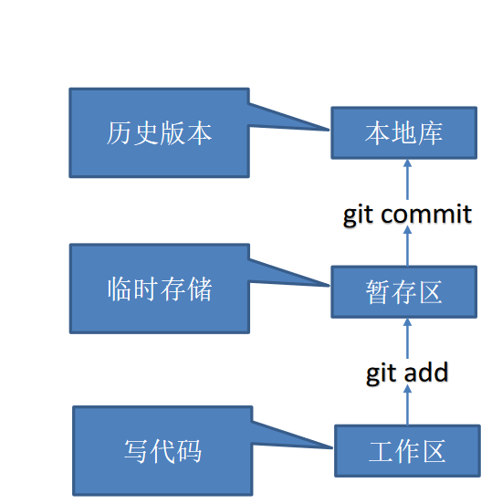

## 一、Git概述

### Git介绍

Git 是一个**免费的、开源的`分布式版本控制系统`**，可以快速高效地处理从小型到大型的各种
项目。
Git 易于学习，占地面积小，性能极快。 它具有廉价的本地库，方便的暂存区域和多个工作
流分支等特性。其性能优于 Subversion、CVS、Perforce 和 ClearCase 等版本控制工具。

**Git简史:**


### 何为版本控制

**版本控制是一种记录文件内容变化，以便将来查阅特定版本修订情况的系统**。

**版本控制其实最重要的是可以记录文件修改历史记录，从而让用户能够查看历史版本，**
**方便版本切换**


> 为什么需要版本控制

从个人开发过渡到团队协作


### 版本控制工具

> 集中式版本控制工具

CVS、**SVN(Subversion**)、VSS.....

**集中化的版本控制系统诸如 CVS、SVN** 等，都有**一个单一的集中管理的服务器**，保存
所有文件的修订版本，而协同工作的人们都通过客户端连到这台服务器，取出最新的文件或
者提交更新。多年以来，这已成为版本控制系统的标准做法。

这种做法带来了许多好处，每个人都可以在一定程度上看到项目中的其他人正在做些什
么。而管理员也可以轻松掌控每个开发者的权限，并且管理一个集中化的版本控制系统，要
远比在各个客户端上维护本地数据库来得轻松容易。

事分两面，有好有坏。这么做显而易见的**缺点是中央服务器的单点故障**。如果服务器宕
机一小时，那么在这一小时内，谁都无法提交更新，也就无法协同工作


> 分布式版本控制工具

`Git`、Mercurial、Bazaar、Darcs......

像 **Git 这种分布式版本控制工具**，**客户端提取的不是最新版本的文件快照，而是把代码**
**仓库完整地镜像下来（本地库）**。这样任何一处协同工作用的文件发生故障，事后都可以用
其他客户端的本地仓库进行恢复。因为每个客户端的每一次文件提取操作，实际上都是一次
对整个文件仓库的完整备份

分布式的版本控制系统出现之后,解决了集中式版本控制系统的缺陷:

1. **服务器断网的情况下也可以进行开发**（因为版本控制是在本地进行的）
2. **每个客户端保存的也都是整个完整的项目**（包含历史记录，更加安全）


### Git 和代码托管中心

> Git的工作机制




**代码托管中心是基于网络服务器的远程代码仓库，一般我们简单称为远程库**

- 局域网
  1. GitLab
-  互联网
  1. GitHub（外网）
  2. Gitee 码云（国内网站）


## 二、Git的安装

下载地址: 

1. 官网下载: 官网地址： https://git-scm.com    (通常比较慢)
2.  从淘宝镜像下载: https://registry.npmmirror.com/binary.html?path=git-for-windows/

安装:  

选择好安装路径后, 可以无脑next, 直至安装完成!

安装完成后, 右击桌面, 在 Git Bash 终端里输入 `git --version` 查看 git 版本，如果出现git版本，说明 Git 安装成功

`PS: 在Git的Bash中可以使用Linux命令!`

## 三、Git的常用命令 

| 命令                                 | 作用               |
| ------------------------------------ | ------------------ |
| git config --global user.name 用户名 | 设置用户名         |
| git config --global user.email 邮箱  | 设置用户邮箱       |
| `git init`                           | **初始化本地库**   |
| `git status`                         | **查看本地库状态** |
| `git add 文件名`                     | **添加到暂存区**   |
| `git commit -m "日志信息" 文件名`    | **提交到本地库**   |
| `git reflog`                         | **查看历史记录**   |
| `git reset --hard 版本号`            | **版本穿梭**       |

### 设置用户签名

**签名的作用是区分不同操作者身份**。用户的签名信息在每一个版本的提交信息中能够看到，以此确认本次提交是谁做的。**Git 首次安装必须设置一下用户签名，否则无法提交代码。**

> 基本语法

设置用户签名:  `git config --global user.name 用户名`
设置邮箱: `git config --global user.email 邮箱`

注意：这里`设置用户签名和将来登录 GitHub（或其他代码托管中心）的账号没有任何关系`

### 初始化本地库

基本语法:  `git init`

案例:  在`D:\MyCode\Git-Study`中初始化本地仓库

1. 进入到这个文件下后, 右击打开 Git Bash
2. 输入命令 `git init` 初始化本地仓库
3. 可以使用linux 命令`ls -ahl`来查看初始化后的目录  .git

### 查看本地仓库状态

语法: `git status`

案例: 在刚才初始化的目录下查看本地仓库状态, 新建文件后, 再次查看本地仓库状态


1. 首次查看,  会发现工作区没有任何文件

2. 新增hello.txt, 并添加内容

3. 再次查看,  发现git检测到了未追踪的文件

   

   

### 将文件添加到暂存区

基本语法: `git add 文件名`

案例:   将刚才新建的文件添加到暂存区, 并查看状态

1. 将hello.txt添加到暂存区 `git add hello.txt`

2. 查看状态  `git status`

3. 检测到暂存区有新文件

   

4. 删除暂存区的文件 `git rm --cached hello.txt `

   注意:  **这里只是删除了暂存区的文件, 而不是真正删除目录下的文件!**

### 提交到本地仓库

> 将暂存区的文件提交到本地库

语法:  `git commit -m "日志信息" 文件名`

案例: 将暂存区的文件提交到本地仓库, 并查看本地仓库状态

1. 提交到本地仓库 `git commit -m "first commit" hello.txt`
2. 查看状态 `git status`
3. 可以使用 `git reflog`命令来查看版本日志信息,  查看详细日志: `git log`


### 历史版本

语法: 

1. 查看版本信息: `git reflog`
2. 查看详细版本信息: `git log`

案例: 

1. 查看版本信息: 

   

2. 查看详细版本信息: 

   

### 版本穿梭

基本语法:   `git reset --hard 版本号 `

案例:  

1. 首先查看当前的历史记录，可以看到当前是在 `75ef984` 这个版本

   

2. 切换到 `6561b9b`版本, 也就是第一次提交的版本!

   `git reset --hard	 6561b9b `

   

3. 此时,使用命令 `git reflog`HEAD(指针) 已经指向了第一次提交的版本! 

   

4. 查看hello.txt文件可以发现内容已经变回初始的内容!

5. 

   

**Git 切换版本，底层其实是移动的 HEAD 指针，具体原理如下图所示**，具体原理如下图所示


## 四、Git分支操作


### 什么是分支

在版本控制过程中，同时推进多个任务，为每个任务，我们就可以创建每个任务的单独分支。使用分支意味着程序员可以把自己的工作从开发主线上分离开来，**开发自己分支的时候，不会影响主线分支的运行。**

对于初学者而言，分支可以简单理解为副本，一个分支就是一个单独的副本。

（**分支底层其实也是指针的引用**）


### 分支的好处

1. 同时并行推进多个功能开发，提高开发效率。
2. 各个分支在开发过程中，**如果某一个分支开发失败，不会对其他分支有任何影响**。失败
   的分支删除重新开始即可

### 分支的操作

| 命令                | 作用                         |
| ------------------- | ---------------------------- |
| git branch -v       | 查看当前所处的分支           |
| git branch 分支名   | 创建分支                     |
| git checkout 分支名 | 切换分支                     |
| git merge 分支名    | 把指定的分支合并到当前分支上 |

> 查看分支

基本语法:   `git branch -v`

案例: 查看自己当前所处的分支  `git branch -v`


> 创建分支
>

基本语法: `git branch 分支名`

案例: 创建hot-fox分支

> 切换分支

基本语法: `git checkout 分支名`

案例: 切换到hot-fox分支


> 修改分支

案例: 修改hot-fox分支, 添加到暂存区并提交到本地仓库

1. 修改hello.txt文件
2. 添加到暂存区 `git add hello.txt`
3. 提交到本地仓库  `git commit -m "hot-fox分支的第一次修改!" hello.txt`

### 合并分支

基本语法: `git merge 分支名`

> 正常合并

案例:  在 master 分支上合并 hot-fox 分支

1. **保证自己当前所处在master分支**
2. 合并hot-fox分支 `git merge hot-fox`


> 合并冲突

冲突产生的原因：

**合并分支时，两个分支在同一个文件有两套完全不同的修改**。Git 无法替我们决定使用哪一个。**必须人为决定新代码内容**

冲突产生的表现：后面状态为 `MERGING`

案例: 

1. 在master分支下修改hello.txt文件, 添加到暂存区并提交

2. 切换到hot-fox分支下, 修改hello.txt文件, 添加到暂存区并提交

3. 在切回到master分支下, 在master分支下合并hot-fox分支, 此时, 会出现 `合并冲突`, 如下图

   ​	

4. 冲突的解决: 打开合并冲突的文件  

   `<<<<<<< HEAD`到 `=======` 的内容表示当前分支的修改内容

   `=======`到 `>>>>>> hot-fox`的内容为hot-fox分支修改的内容

   我们决定保留哪个分支的内容并删除 提示的符号 , 然后添加到暂存区并提交即可解决合并冲突

   注意: **再次提交的命令为  `git commit -m "日志信息"` (不能带有文件名!)**

   

   

## 五、Git团队协作机制

### 团队内协作


### 跨团队协作


## 六、Github操作

github官网: https://github.com

PS: :**全球最大同性交友网站，技术宅男的天堂，新世界的大门，你还在等什么?**

### 创建远程仓库

1. 登录到github
2. 点击又上角的 `+`选择 `New Repository`创建远程仓库
3. 输入仓库名 和 描述后, 点击`Create Repository` 即可创建远程仓库
4. 完成后, 自动进入到远程仓库页面

### 远程仓库操作 

| 命令                                 | 作用                                                     |
| ------------------------------------ | -------------------------------------------------------- |
| git remote -v                        | 查看当前所有远程地址别名                                 |
| git remote add 别名 远程地址         | 起别名                                                   |
| `git push 别名 分支`                 | 推送本地分支上的内容到远程仓库                           |
| `git clone 远程地址`                 | 将远程仓库的内容克隆到本地                               |
| `git pull 远程库地址别名 远程分支名` | 将远程仓库对于分支最新内容拉下来后与当前本地分支直接合并 |


> 远程仓库的别名设置

基本语法

1. 查看当前所有远程地址别名:  `git remote -v `
2. 设置远程仓库别名:  `git remote add 别名 远程地址`

案例: 将刚才建立好的远程仓库设置别名并查看

1. 设置远程仓库别名: 

   ` git remote add git-study https://github.com/xiaoguiyu/Git-Study.git `

2. 查看远程仓库别名

   `git remote -v`

> 将本地分支推送到远程仓库

基本语法:  `git push 远程仓库别名 分支名`

案例:  将本地仓库的master分支推送到远程仓库

1. `git push git-study master`

2. 注意: 第一次推送时, 需要添加凭据

3. 此时,可以在github的远程仓库中可以看到已经push成功的代码!

   


> 克隆远程仓库到本地

基本语法:  `git clone 远程地址`

克隆的结果: 会初始化化本地库

案例: 新建一个目录, 将远程仓库的代码clone到此目录下


注意: **clone下来的代码会自动给远程仓库设置别名为: `origin`**


> 邀请加入到团队

1. 选择邀请合作者

2. 在github的远程仓库的项目下, 选择`settings--collaborator--Add people `

   

3. 填入需要合作的人的github邮箱

   

4. 复制地址并通过微信/钉钉等方式发送给该用户

   

5. 在邀请人的的github账号中的地址栏复制收到的邀请链接, 点击介绍邀1请

   

6. 成功之后就可以在此账号中看到该项目的远程仓库, 同时也可以修改内容并push到远程仓库

   

> 拉取远程仓库内容

基本语法:  `git pull 远程库地址别名 远程分支名`

案例:  将合作伙伴的提交的代买拉取到本地仓库

`git pull orgin master`

注意: **从远程仓库拉取的代码是与本地仓库合并的**


### 跨团队合作

1. 将需要合作的项目打开, 合作人点击fork, 此时合作人的远程仓库会复制一份完整的项目
2. 合作人可以将代码克隆/拉取到本地仓库, 修改完成代码后, 提交到自己的远程仓库
3. 在自己的远程仓库界面下, 点击`Pull request -- New pull request`提交后, 经过项目的的管理人同意后, 就完成跨团队开发

### 通过SSH登录

1. 进入windows当前用户的的目录  `C:\Users\xiaoyu`
2. 检查此目录是否有 `.shh`目录, 如果有就删除, 没有进入到下一步
3. 通过命令生成.shh密匙目录 `ssh-keygen -t rsa -C lin802366@giaml.com`,  连续输入三次回车即生成shh密匙目录
4. 进入到 .ssh 目录下 `cd .ssh`      查看目录下的文件: 
   1. `id_rsa.pub`  公钥
   2. `id_rsa`   为私钥
5. 查看公钥的内容并复制  `cat id_rsa.pub`
6. 登录到github,  点击`用户图像 --> Settings --> SSH and GPG keys`
7. 输入名字, 和赋值的key,  点击Add SSH key, 就完成了
8. 此时再往远程仓库push文件就可以使用SSH连接, 而不用登录了


## 七、IDEA集成Git

### 配置Git忽略文件

> 为什么需要配置忽略文件? 

与项目的实际功能无关，不参与服务器上部署运行。把它们忽略掉能够屏蔽 IDE 工具之
间的差异

> 配置忽略文件

1. 进入到window当前用户的目录下, `C:\Users\xiaoyu`

2. 创建`git.ignore`文件

3. 编辑 git.ignore 文件, 加入以下配置

   ```sh
   # Compiled class file
   *.class
   # Log file
   *.log
   # BlueJ files
   *.ctxt
   # Mobile Tools for Java (J2ME)
   .mtj.tmp/
   # Package Files #
   *.jar
   *.war
   *.nar
   *.ear
   *.zip
   *.tar.gz
   *.rar
   # virtual machine crash logs, see
   http://www.java.com/en/download/help/error_hotspot.xml
   hs_err_pid*
   .classpath
   .project
   .settings
   target
   .idea
   *.iml
   ```

4. 在`C:\Users\xiaoyu/.gitconfig ` 文件中引用忽略配置文件, 加入以下配置

   ```sh
   [core]
   excludesfile = C:/Users/xiaoyu/git.ignore
   ```


### IDEA配置Git

1. 在IDEA中的`Settings -- Version Control -- Git`中选择自己安装git的目录
2. 点击test, 出现git的版本号说明配置成功!

> 初始化本地库

在IDEA上方的选项卡, 选择 `VCS -- Create Git Repository`, 之后在点击Ok, 即可初始化本地库


### 使用IDEA操作Git

> 添加到暂存区

右键点击项目选择` Git -> Add` 将项目添加到暂存区


> 提交到本地仓库

1. 右键点击项目选择` Git -> Commit Directory` 
2. 填写提交的描述信息并点击commit, 即可提交到本地库


> 切换版本

1. 在IDEA的下方选项卡中, 选择`Git -- Log`查看Log版本
2. 右键点击需要切换的版本,选择 `Checkout Revision`即可切换版本


> 创建分支

在IDEA上方的选项卡中选择 `Git -- new branch`, 之后在输入分支名, 点击 `create`即可创建

注意: 在输入分支名时, 可以选择直接切换到新创建的分支


> 切换分支

在IDEA的右下角, 点击 `master -- 点击需要切换的分支 --选择Checkout`, 即可切换分支


> 分支合并 

正常合并

案例: 将fix分支合并到 当前的 master分支

1. 保证当前处于master分支
2. 在IDEA的右下角点击 `master -- 选择并点击fix -- Merge Selected into Current `


冲突合并:  

**合并分支时，两个分支在同一个文件有两套完全不同的修改**。Git 无法替我们决定使用哪一个。**必须人为决定新代码内容**

案例: **如果fix分支和master分支都修改了同一个文件的内容, 就会产生合并冲突!**

1. 保证当前处于master分支

2. 在IDEA的右下角点击 `master -- 选择并点击fix -- Merge Selected into Current `

3. 在弹出的提示框中选择 `Merge`, 手动合并代码

4. 此时会出现代码冲突的部分, 如下图  

   

5. 手动合并完代码以后，点击右下角的 Apply 按钮. 代码冲突解决，自动提交本地库


## 八、IDEA集成Github

### 在IDEA中登录Github

> 方式一: 账号密码登录

1. 在IDEA中的 `Settings -- Version Control -- GitHub`
2. 选择 `Add account`, 输入账号密码即可登录

**(通常因为网络原因不能使用这种方式登录)**

> 方式二: 通过token登录

1. 在GitHub中, 点击 `左上角的图像 -- Settings --Developer settings --Personal access tokens -- tokens -- Generate new token `
2. 将所有的权限都打钩, 授予这个token所有的权限, 点击Generate
3. 将生成的token复制并保存!(**生成的token只会显示一次**!)
4. 在IDEA中选择token登录github, 输入账号, token, 点击login即可完成登录!

### 分享项目到GitHub

1. 在IDEA中选择上方的 `Git -- GitHub -- share Project on GitHub`
2. 输入 远程仓库地址别名 和描述 点击Share即可完成分享


### 拉取远程仓库代码到本地

1. 在IDEA中, 点击左下角的`蓝色向左下的箭头`, 即可拉取远程仓库的代码

注意：pull 是拉取远端仓库代码到本地，如果远程库代码和本地库代码不一致，会自动
合并，如果自动合并失败，还会涉及到手动解决冲突的问题


### push推送本地代码到远程仓库

在IDEA中, 点击右上角的`绿色向右上的箭头`, 即可将代码推送到远程仓库

注意：

1. push 是将本地库代码推送到远程库，**如果本地库代码跟远程库代码版本不一致，**
   **push 的操作是会被拒绝的。**
2. 要想 push 成功，一定要保证本地库的版本要比远程库的版本高！
3. 一个成熟的程序员在动手改本地代码之前，一定会先检查下远程库跟本地
   代码的区别！
4. 如果本地的代码版本已经落后，切记要先 pull 拉取一下远程库的代码，将本地
   代码更新到最新以后，然后再修改，提交，推送！


### 克隆远程仓库的代码

1. 复制远程仓库的 **HTTPS连接 或 SSH**
2. 点击IDEA上方的 `Git -- Clone`, , 选择保存项目的路径
3. 一路 NEXT, 即可完成克隆

## 九、码云Gitee

操作基本与GitHub一致

Gitee可以将GitHub的远程仓库继承


## 十、搭建代码托管平台-GitLab

### GitLab介绍

1. GitLab 是由 GitLabInc.开发，使用 MIT 许可证的基于网络的 Git 仓库管理工具，且具有
   wiki 和 issue 跟踪功能。使用 Git 作为代码管理工具，并在此基础上搭建起来的 web 服务。
2. GitLab 由乌克兰程序员 DmitriyZaporozhets 和 ValerySizov 开发，它使用 Ruby 语言写
   成。后来，一些部分用 Go 语言重写。截止 2018 年 5 月，该公司约有 290 名团队成员，以
   及 2000 多名开源贡献者。G
3. itLab 被 IBM，Sony，JülichResearchCenter，NASA，Alibaba，
   Invincea，O’ReillyMedia，Leibniz-Rechenzentrum(LRZ)，CERN，SpaceX 等组织使用

> GitLab 官网地址
> 官网地址：https://about.gitlab.com/
> 安装说明：https://about.gitlab.com/installatio


### GitLab安装

> 环境准备

1. 准备一个系统为 CentOS7 以上版本的服务器，要求内存 4G，磁盘 50G。
2. 关闭防火墙，并且配置好主机名和 IP，保证服务器可以上网。
   此教程使用虚拟机：主机名：gitlab-server IP 地址：192.168.200.8

> 安装包准备

下载地址：
https://packages.gitlab.com/gitlab/gitlab-ce/packages/el/7/gitlab-ce-13.10.2-ce.0.el7.x86_64.rpm

安装包下载完成后, 需要将安装包放在 `/opt/moudel`目录下

> 编写安装shell脚本

1. `vim gitlab.sh` 将下面的脚本复制到此文件

```sh
rpm -ivh /opt/module/gitlab-ce-13.10.2-ce.0.el7.x86_64.rpm
sudo yum install -y curl policycoreutils-python openssh-server cronie
sudo lokkit -s http -s ssh
sudo yum install -y postfix
sudo service postfix start
sudo chkconfig postfix oncurl https://packages.gitlab.com/install/repositories/gitlab/gitlab-ce/script.rpm.sh | sudo bash
sudo EXTERNAL_URL="http://gitlab.example.com" yum -y install gitlab-ce
```


> 安装GitLab

1. 给脚本增加执行权限  `chmod +x gitlab.sh`

2. 执行该脚本，开始安装 gitlab-ce  `./gitlab-install.sh`

   注意: 一定要保证服务器可以上网

3. 初始化GitLab服务  `tlab-ctl reconfigure`

4. 启动 GitLab 服务  `tlab-ctl start`

    如果需要停止gitlab服务执行  `gitlab-ctl stop`

5. 使用浏览器访问 GitLab
   使用主机名或者 IP 地址即可访问 GitLab 服务。需要提前配一下 windows 的 hosts 文件

   


 