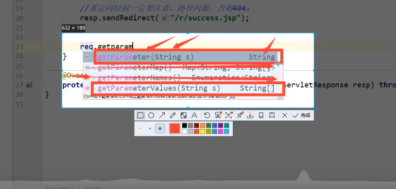

## 一、基本概念

### 1.1前言

web开发：

- web,网页的意思,www.baidu.com
- 静态web
  - html,css,javascript
  - 提供给所有人看的数据
- 动态web
  - 淘宝，几乎是所有的网站都会动态
  - 提供给所有看的数据始终会发生变化，每个人在不同的时间，不同的地点看到的信息不同
  - 技术栈：Servlet/JSP,ASP,PHP

在java中，动态web资源开发的技术统称为javaweb;


### 1.2 web应用程序

web应用程序:可以提供浏览器访问的程序;

- a.html、b.html  .......多个web资源，这些资源可以被外界访问，对外界提供服务
- 能访问到的任一一个页面或资源，都存在于世界上的某一个角落
- URL
- 这些统一的web资源都会被放到同一个文件夹下,web应用程序-->tomcat:服务器
- 一个web应用由多部分组成（静态web,动态web）
  - html,css,js
  - jsp,servlet
  - java程序
  - jar包
  - 配置文件（Properties）

web应用程序编写完毕后，若想提供给外界访问--需要一个服务器统一管理

### 1.3静态web

- *.html,  *.htm,这些都是网页的后缀，如果服务器上一直存在这些东西，就可以直接进行读取。通过网络。

  

  

- 静态web存在的缺点
  - web网页无法动态更新，所有的用户看到的都是一样的
    - 轮播图，点击特效：伪动态
    - javaScript  [实际开发中，应用最多] 
    - VBScript
  - 它无法和数据库交互（数据无法持久化）

### 1.4、动态web

页面会动态展示：“Web的页面展示效果因人而异";


缺点：

- 假如服务器的动态WEB资源出现错误，需要重新编写**后台程序**，并且重新发布；
  - 停机维护

优点：

- web页面可以动态刷新，所有的用户看到的都不是同一个页面
- 他可以与数据库交互（数据持久化：注册）


新手村：---魔鬼训练（分析原理，看源码）---》PK场

## 二 、web服务器

### 2.1技术讲解

ASP,

- 微软：国内最早的就是流行ASP;
- 在HTML中嵌入了VB的脚本，ASP+COM;
- 在ASP开发中，基本一个页面都有几千行的业务代码，页面混乱
- 维护成本高
- C#

```html
<h1>
  	<h1><h1>
      	<h1>
          	<h1>
              	<h1>	
        <h1>
          <%
             
           %>
            <h1>
              	<h1>


  <h1><h1>               
  <h1>
```


JSP/Servlet:

B/S：浏览器和服务器

C/S：客户端和服务器

- sun公司主推的B/S架构
- 基于java语言（所有的 大公司，或者一些开源的组件，都是用java写的）
- 开源承载三高问题带来的影响
- 语法像ASP,ASP-->JSP,加强市场强度

PHP

- PHP开发速度很快，功能很强大，跨平台，代码简单（70%，WP）
- 无法承载大访问量的情况（局限性）


### 2.2、web服务器

服务器是一种被动的操作，用来处理用户的一些请求和给用户一些响应的信息

**IIS**

微软的；ASP....,Windows中自带的

**Tomcat**

面向百度编程;

Tomcat是Apache 软件基金会（Apache Software Foundation）的Jakarta 项目中的一个核心项目，由[Apache](https://baike.baidu.com/item/Apache/6265)、Sun 和其他一些公司及个人共同开发而成。由于有了Sun 的参与和支持，最新的Servlet 和JSP 规范总是能在Tomcat  中得到体现，Tomcat 5支持最新的Servlet 2.4 和JSP 2.0 规范。因为Tomcat  技术先进、性能稳定，而且**免费**，因而深受Java 爱好者的喜爱并得到了部分软件开发商的认可，成为比较流行的Web 应用服务器。

Tomcat 服务器是一个免费的开放源代码的Web 应用服务器，属于轻量级应用[服务器](https://baike.baidu.com/item/服务器)，在中小型系统和并发访问用户不是很多的场合下被普遍使用，是开发和调试JSP 程序的首选。对于一个初学者来说，可以这样认为，当在一台机器上配置好Apache 服务器，可利用它响应[HTML](https://baike.baidu.com/item/HTML)（[标准通用标记语言](https://baike.baidu.com/item/标准通用标记语言/6805073)下的一个应用）页面的访问请求。

诀窍是，当配置正确时，Apache 为HTML页面服务，而Tomcat 实际上运行JSP 页面和Servlet。Tomcat最新版本为**10.0.5**。

.....

**工作3-5年之后，可以尝试手写Tomcat服务器;**

下载tomcat:

1. 安装 or 解压
2. 了解配置文件及目录结构
3. 这个东西的作用


## 三、Tomcat

### 3.1、下载tomcat


### 3.2、Tomcat启动和配置

文件夹作用：


启动和关闭Tomcat


访问：http://localhost:8080/


可能遇到的问题：

1. java环境变量没有配置
2. 闪退问题：需要配置兼容
3. 乱码问题：配置文件中配置

### 3.3、配置


可以配置启动的端口号：

- tomcat的默认端口号：8080
- mysql:3306
- http:80
- https:443

```xml
    <Connector port="8081" protocol="HTTP/1.1"
               connectionTimeout="20000"
               redirectPort="8443" /> 
```


可以配置主机的名称：

-  默认的主机为：localhost->127.0.0.1
- 默认网站应用存放的位置为：webapps

```xml
      <Host name="localhost"  appBase="webapps"
            unpackWARs="true" autoDeploy="true">
```


**高难度面试题**

请你谈谈网站是如何进行访问的？

1. 输入一个域名；回车

2. 检查本机的C:\Windows\System32\drivers\etc\hosts配置文件下有没有这个域名映射

   1. 有，直接返回对应的ip地址,这个地址中，有我们需要访问的的web程序，可以直接访问

      ```java
      127.0.0.1  localhost
      ```

   2. 没有:去DNS服务器找，找到就返回，找不到就返回找不到

   

3. 可以配置一下环境变量（可选性）


### 3.4、发布一个web网站

不会就模仿

- 将自己写的网站，放到服务器(Tomcat)中指定的web应用的文件夹(webapps）下，就可以访问了

网站应该有的结构

```java
--webapps:Tomcat服务器的web目录
  		-root
  		-kuangstudy:网站的目录名
        -WEB-INF
        		-classes:java程序
            -lib:web应用依赖的jar包
        		-web.xml
        - index.html 默认的首页
        - static
             -css
             			-style.css
             -js
             -img
         - ....
```


## 四、Http

### 4.1、什么是Http

超文本传输协议（Hyper Text Transfer Protocol，HTTP）是一个简单的请求-响应协议，它通常运行在[TCP](https://baike.baidu.com/item/TCP/33012)之上。

- 文本：html，字符串，~...
- 超文本：图片，音乐，视频、定位、地图......（本质是一种带超链接的文本）
- 80

Https: 安全的

- 443

### 4.2、两个时代

- http1.0
  - Http/1.0:客户端可以与web服务器连接，只能获得一个web资源，断开连接
- http2.0
  - HTTP/1.1:客户端可以与web服务器连接，可以获得多个web资源。

### 4.3、Http请求

- 客户端---发请求----服务器

百度:

```java
请求 URL: https://www.baidu.com/  			请求地址	
请求方法: GET								get方法/post方法	
状态代码: 200 OK					状态码：200
远程地址: 14.215.177.38:443				
引用站点策略: origin-when-cross-origin
```

````java
Accept:text/html
Accept-Encoding: gzip, deflate, br
Accept-Language: zh-CN,zh;q=0.9,en;q=0.8,en-GB;q=0.7,en-US;q=0.6		语言
Cache-Control: max-age=0
Connection: keep-alive
````

#### 1、请求行

- 请求行中的请求方式：GET
- 请求方式：**GET，POST**，HEAD,DELETE,PUT,TRACT....
  - get:请求能够携带的参数比较少，大小有限制，会在浏览器的URL地址栏显示数据内容，相对不安全，高效
  - post:请求能够携带的参数没有限制，大小没有限制，不会在浏览器的URL地址栏显示数据内容，相对安全，但不高效

#### 2、消息头

```java
Accept:告诉服务器它所支持的数据类型 
Accept-Encoding: 支持哪种编码格式， GBK,UTF-8,GB2312,ISO8859-1
Accept-Language: zh-CN,zh;q=0.9,en;q=0.8,en-GB;q=0.7,en-US;q=0.6		告诉浏览器它的语言环境
Cache-Control: max-age=0		缓存控制
Connection: keep-alive	告诉服务器，请求完成是断开还是保持连接
```


### 4.4、Http响应

- 客户端---发请求----服务器

百度:

````java
Cache-Control: private			缓存控制
Connection: keep-alive			连接
Content-Encoding: gzip			编码
Content-Type: text/html;charset=utf-8		类型
````


#### 1.响应体

```java
Accept:告诉浏览器它所支持的数据类型 
Accept-Encoding: 支持哪种编码格式， GBK,UTF-8,GB2312,ISO8859-1
Accept-Language: zh-CN,zh;q=0.9,en;q=0.8,en-GB;q=0.7,en-US;q=0.6		告诉浏览器它的语言环境
Cache-Control: max-age=0		缓存控制
Connection: keep-alive	告诉；浏览器，请求完成是断开还是保持连接
HOST: 主机...../.。
Refresh:告诉哭护短
```


## 五、Maven

**我为什么要学习这个技术？**

1. 在javaweb开发中，需要使用大量的jar包，需要我们手动导入

2. 如何能够让一个东西自动帮我们导入和配置这个jar包

   由此，Maven诞生

### 5.1、Maven架构管理工具

我们目前用他就是为了方便导入jar包

Maven的核心思想：**约定大于配置**

- 有约束，不要去违反


Maven会规定好你该如何去编写java代码，必须要按照这个规范来


### 5.2、Maven下载和安装

官网：https://maven.apache.org/


下载完成后，解压即可

### 5.3、配置环境环境变量

在我们系统环境变量中

配置如下配置：

- M2_HOME  --- maven目录下的bin 目录
- MAVEN_HOME   -- maven的目录
- 在系统的path中配置 %MAVEN_HOME%\bin


测试MAVEN是否安装成功，必须 保证配置完毕！


### 5.4阿里云镜像

- 镜像：mirrors
  - 作用：加速我们的下载
- 国内建议使用阿里云镜像

```xml
 <mirror>
	  <id>nexus-aliyun</id>  
	  <mirrorOf>*,!jeecg,!jeecg-snapshots</mirrorOf>  
	  <name>Nexus aliyun</name>  
	  <url>http://maven.aliyun.com/nexus/content/groups/public</url> 
</mirror>
```

### 5.5本地仓库

在本地的仓库，远程仓库;


**建立一个本地仓库:**localRepository


```xml
<localRepository>E:\apache-maven-3.8.4\maven_repo</localRepository>
```


### 5.6、在IDEA中使用Maven

1.启动IDEA

2.创建一个Maven项目

	


3.因IDEA版本有差异


4.观察maven仓库多了什么东西

5.IDEA中的maven设置

IDEA项目创建成功后，看一下设置


6.源勾上会影响下载速度


7.选定配置文件


### 5.7创建一个普通的maven项目


### 5.8标记文件功能


### 5.9在IDEA中配置Tomcat


****


报错需要制定Tomcat的本地文件夹


### 5.10、pom文件

pom.xml是Maven的核心配置文件


maven由于他的约定大于配置，我们之后可能会遇到我们写的配置文件，无法被导出或者无法生效的问题。解决方案：

```xml
<build>
    <resources>
        <resource>
            <directory>src/main/resources</directory>
            <includes>
                <include>**/*.properties</include>
                <include>**/*.xml</include>
            </includes>
            <filtering>true</filtering>
        </resource>
        <resource>
            <directory>src/main/java</directory>
            <includes>
                <include>**/*.properties</include>
                <include>**/*.xml</include>
            </includes>
            <filtering>true</filtering>
        </resource>
    </resources>
</build>
```


### 5.11、IDEA的操作

显示目录树


### 5.12、解决遇到的问题

1.IDEA每次都要配置Maven

在IDEA的全局默认设置中去设置

关闭项目之后才能看到


## 六、Servlet

### 6.1、Servlet简介

- Servlet就是Sun公司开发动态web的一门技术
- Sun在这些API中提供了一个接口叫做：Servlet，如果你想要开发一个Servlet程序，只需要完成两个步骤：
  - 编写一个类，实现Servlet接口
  - 把开发好的java类部署到web服务器中

**把实现了Servlet接口的java程序叫做，Servlet**

### 6.2、HelloServlet

Servlet接口在Sun公司有两个默认的实现类：HtppServlet,


1.构建一个Maven项目，删掉里面的无关东西 ，然后在里面在构建新的module

==注意这里存在Tomcat10的版本问题==

参考如下：

https://www.cnblogs.com/sleepyhermit/p/15701302.html

````xml
<!-- https://mvnrepository.com/artifact/jakarta.servlet/jakarta.servlet-api -->
<dependency>
  <groupId>jakarta.servlet</groupId>
  <artifactId>jakarta.servlet-api</artifactId>
  <version>5.0.0</version>
  <scope>provided</scope>
</dependency>
````


2.关于Maven父子工程的理解：

父项目有：

```java
<modules>
    <module>servlet</module>
</modules>
```


==这里有问题，未完善==

关于这个问题的解决，手动添加父亲信息

可以创建一个不由原型创建的模块，

从中得到继承父项目的代码


3.MAVEN环境优化

1.修改web.xml为最新的（去Tomcat里面找）

2.将Maven的结构搭建完善


4.编写一个Servlet程序

1. 编写一个普通类


狂神图

1. 实现Servlet类,这里直接继承HttpServlet

```java
public class HelloServlet extends HttpServlet {
    //由于get或者post只是请求实现的不同方式，可以互相调用，业务逻辑都一样
    @Override
    protected void doGet(HttpServletRequest req, HttpServletResponse resp) throws ServletException, IOException {
        //ServletInputStream inputStream = req.getInputStream();
        //ServletOutputStream outputStream = resp.getOutputStream();
        PrintWriter writer = resp.getWriter();//响应流
        writer.println("Hello,Servlet");
    }

    @Override
    protected void doPost(HttpServletRequest req, HttpServletResponse resp) throws ServletException, IOException {
        super.doPost(req, resp);
    }
}
```


5.编写Servlet的映射

为什么需要映射：我们写的是JAVA程序，但是要通过浏览器访问，而浏览器需要连接web服务器，所以我们需要再web服务器中注册我们写的Servlet,还需要给他一个浏览器能够访问的路径。

```xml
  <!--注册Servlet-->
<servlet>
  <servlet-name>hello</servlet-name>
  <servlet-class>com.zhong.wu.HelloServlet</servlet-class>
</servlet>
  <!--Servlet的请求路径-->
  <servlet-mapping>
    <servlet-name>hello</servlet-name>
    <url-pattern>/hello</url-pattern>
  </servlet-mapping>
```


6.配置Tomcat

注意：配置项目发布的路径


7.启动测试


### 6.3、Servlet原理

Servlet是由Web服务器调用，web服务器接收到浏览器请求之后，通过把请求和响应传送给Servlet里面的Service去调用方法对请求和响应进行处理。


1. 首先浏览器向 Web 服务器发送了一个 HTTP 请求，Web 服务器根据收到的请求，会先 创建一个 HttpServletRequest 和 HttpServletResponse 对象，然后再调用相应的 Servlet 程序。
2. 在 Servlet 程序运行时，它首先会从 HttpServletRequest 对象中读取数据信息，然后通过 service() 方法处理请求消息，并将处理后的响应数据写入到 HttpServletResponse 对象中。最后，Web 服务器会从 HttpServletResponse 对象中读取到响应数据，并发送给浏览器。
3. 需要注意的是，在 Web 服务器运行阶段，每个 Servlet 都只会创建一个实例对象，针对每次 HTTP 请求，Web 服务器都会调用所请求 Servlet 实例的 service（HttpServletRequest request，HttpServletResponse response）方法，并重新创建一个 request 对象和一个 response 对象。
   

### 6.4、Mapping问题

1.一个Servlet可以指定一个路径

```xml
<servlet-mapping>
    <servlet-name>hello</servlet-name>
    <url-pattern>/hello</url-pattern>
</servlet-mapping>
```


2.一个Servlet可以指定多个映射路径

```xml
<servlet-mapping>
    <servlet-name>hello</servlet-name>
    <url-pattern>/hello1</url-pattern>
</servlet-mapping>  <servlet-mapping>
    <servlet-name>hello</servlet-name>
    <url-pattern>/hello2</url-pattern>
</servlet-mapping>  <servlet-mapping>
    <servlet-name>hello</servlet-name>
    <url-pattern>/hello3</url-pattern>
</servlet-mapping>  <servlet-mapping>
    <servlet-name>hello</servlet-name>
    <url-pattern>/hello4</url-pattern>
</servlet-mapping>
```


3.一个Servlet可以指定通用映射路径

```xml
<servlet-mapping>
    <servlet-name>hello</servlet-name>
    <url-pattern>/hello/*</url-pattern>
</servlet-mapping>
```


4.默认请求路径

````xml
<servlet-mapping>
    <servlet-name>hello</servlet-name>
    <url-pattern>/*</url-pattern>
</servlet-mapping>
````


5.指定一些后缀或前缀等

```xml
<servlet-mapping>
    <servlet-name>hello</servlet-name>
    <url-pattern>*.wuduan</url-pattern>
</servlet-mapping>

<!--这个地方表示，只要Url路径是.wuduan，前面无论是什么都能访问到-->
```

6.优先级问题 

固有的映射路径优先级高

**==通配符的优先级低==**

### 6.5、ServletContext

web容器在启动的时候，它会为每个web程序都创建一个对应的ServletContext对象，它代表了当前的web应用;

#### 1.共享数据

我在某一个Servlet中保存的数据，可以在另一个Servlet中拿到

```java
public class HelloServlet extends HttpServlet {
    @Override
    protected void doGet(HttpServletRequest req, HttpServletResponse resp) throws ServletException, IOException {
        System.out.println("HELLO");
        
        //this.getInitParameter()初始化参数
        //this.getServletConfig();Servlet配置
        //this.getServletContext();Servlet上下文
        ServletContext servletContext = this.getServletContext();
        String username="吾褍";
        servletContext.setAttribute("username",username);//将一个数据保存在了ServletContext中，名字为：username--值为username


    }

    @Override
    protected void doPost(HttpServletRequest req, HttpServletResponse resp) throws ServletException, IOException {
        super.doPost(req, resp);
    }
}

```


web.xml配置

```java
public class GetServlet extends HttpServlet {
    @Override
    protected void doGet(HttpServletRequest req, HttpServletResponse resp) throws ServletException, IOException {
        ServletContext servletContext = this.getServletContext();
        String username = servletContext.getAttribute("username").toString();
        resp.setContentType("text/html");
        resp.setCharacterEncoding("utf-8");
        resp.getWriter().print("名字"+username);

    }

    @Override
    protected void doPost(HttpServletRequest req, HttpServletResponse resp) throws ServletException, IOException {
        super.doPost(req, resp);
    }
}

```

```xml
<?xml version="1.0" encoding="UTF-8"?>
<web-app xmlns="http://xmlns.jcp.org/xml/ns/javaee"
         xmlns:xsi="http://www.w3.org/2001/XMLSchema-instance"
         xsi:schemaLocation="http://xmlns.jcp.org/xml/ns/javaee http://xmlns.jcp.org/xml/ns/javaee/web-app_4_0.xsd"
         version="4.0">
  <servlet>
    <servlet-name>hello</servlet-name>
    <servlet-class>com.zhong.wu.HelloServlet</servlet-class>
  </servlet>
  <servlet-mapping>
    <servlet-name>hello</servlet-name>
    <url-pattern>/hello</url-pattern>
  </servlet-mapping>

  <servlet>
    <servlet-name>getc</servlet-name>
    <servlet-class>com.zhong.wu.GetServlet</servlet-class>
  </servlet>
  <servlet-mapping>
    <servlet-name>getc</servlet-name>
    <url-pattern>/get</url-pattern>
  </servlet-mapping>
</web-app>
```


如上设置，如果不访问hello,直接访问get(使用的环境版本和我一样的话),将会得到如下


这里有一个问题，在于某些版本的Tomcat或者是IDEA的一些问题（目前不探究）或者使用的浏览器的问题，反正有很多种可能，将会有如下


#### 2.获得初始化数据

```xml
  <!--配置一些web应用的初始化参数-->
  <context-param>
    <param-name>url</param-name>
    <param-value>jdbc:mysql://localhost:3306/mybatis</param-value>
  </context-param>
  <servlet>
    <servlet-name>gp</servlet-name>
    <servlet-class>com.zhong.wu.ServletDemo03</servlet-class>
  </servlet>
  <servlet-mapping>
    <servlet-name>gp</servlet-name>
    <url-pattern>/gp</url-pattern>
  </servlet-mapping>
```


```java
package com.zhong.wu;

import javax.servlet.ServletContext;
import javax.servlet.ServletException;
import javax.servlet.http.HttpServlet;
import javax.servlet.http.HttpServletRequest;
import javax.servlet.http.HttpServletResponse;
import java.io.IOException;

/**
 * @author wuduan
 * @version 1.8
 * @date 2022/1/18 20:52
 */
public class ServletDemo03 extends HttpServlet {
    @Override
    protected void doGet(HttpServletRequest req, HttpServletResponse resp) throws ServletException, IOException {
        ServletContext servletContext = this.getServletContext();

        String url = servletContext.getInitParameter("url");
        resp.getWriter().print(url);
    }

    @Override
    protected void doPost(HttpServletRequest req, HttpServletResponse resp) throws ServletException, IOException {
        super.doPost(req, resp);
    }
}

```

测试实例：

```java
package com.zhong.wu;

import javax.servlet.ServletContext;
import javax.servlet.ServletException;
import javax.servlet.http.HttpServlet;
import javax.servlet.http.HttpServletRequest;
import javax.servlet.http.HttpServletResponse;
import java.io.IOException;

/**
 * @author wuduan
 * @version 1.8
 * @date 2022/1/18 20:52
 */
public class ServletDemo03 extends HttpServlet {
    @Override
    protected void doGet(HttpServletRequest req, HttpServletResponse resp) throws ServletException, IOException {
        ServletContext servletContext = this.getServletContext();

        String url = servletContext.getInitParameter("url");
        resp.getWriter().print(url);
    }

    @Override
    protected void doPost(HttpServletRequest req, HttpServletResponse resp) throws ServletException, IOException {
        super.doPost(req, resp);
    }
}

```


#### 3.请求转发

```xml
  <servlet>
    <servlet-name>gp</servlet-name>
    <servlet-class>com.zhong.wu.ServletDemo03</servlet-class>
  </servlet>
  <servlet-mapping>
    <servlet-name>gp</servlet-name>
    <url-pattern>/gp</url-pattern>
  </servlet-mapping>

  <servlet>
    <servlet-name>sd4</servlet-name>
    <servlet-class>com.zhong.wu.ServletDemo04</servlet-class>
  </servlet>
  <servlet-mapping>
    <servlet-name>sd4</servlet-name>
    <url-pattern>/sd4</url-pattern>
  </servlet-mapping>
```


```java
public class ServletDemo04 extends HttpServlet {
    @Override
    protected void doGet(HttpServletRequest req, HttpServletResponse resp) throws ServletException, IOException {
        ServletContext servletContext = this.getServletContext();
        System.out.println("进入了ServletDemo04");
        //RequestDispatcher requestDispatcher = servletContext.getRequestDispatcher("/gp");//转发的请求路径
       // requestDispatcher.forward(req,resp);//调用forward实现请求转发
        servletContext.getRequestDispatcher("/gp").forward(req,resp);
    }

    @Override
    protected void doPost(HttpServletRequest req, HttpServletResponse resp) throws ServletException, IOException {
        super.doPost(req, resp);
    }

}

```

```java
public class ServletDemo03 extends HttpServlet {
    @Override
    protected void doGet(HttpServletRequest req, HttpServletResponse resp) throws ServletException, IOException {
        ServletContext servletContext = this.getServletContext();

        String url = servletContext.getInitParameter("url");
        resp.getWriter().print(url);
    }

    @Override
    protected void doPost(HttpServletRequest req, HttpServletResponse resp) throws ServletException, IOException {
        super.doPost(req, resp);
    }
}

```


转发是如图上半部分的关系，重定向是如图下半部分的关系。

A需要的资源由B去找C拿，再由B给A，这是转发。（即页面A的需要的资源由后台B去找另一个页面C获取，后台B在把这个资源交给页面A）

A需要的资源去找B要，B跟A说要去找C要，A找到C拿到资源，这是重定向。（即页面A需要的资源去询问后台B，后台B告诉页面A资源在页面C那里，然后页面A去找页面C要资源）


如果是转发，实际访问的页面路径还是原来的路径。


而重定向，访问的路径会改变。


#### 4.读取资源文件

Properties

- 在JAVA目录下新建Properties(需要在pom.xml下面进行配置，参考MAVEN5.10)
- 在Resources目录下新建properties


发现：都被打包在了同一目录下--classes


```java
public class ServletDemo05 extends HttpServlet {
    @Override
    protected void doGet(HttpServletRequest req, HttpServletResponse resp) throws ServletException, IOException {
        InputStream resourceAsStream = this.getServletContext().getResourceAsStream("/WEB-INF/classes/db.properties");
        Properties properties = new Properties();
        properties.load(resourceAsStream);
        String username = properties.getProperty("username");
        String password = properties.getProperty("password");
        System.out.println(username);
        System.out.println(password);
        resp.getWriter().print(username+"----"+password);

    }

    @Override
    protected void doPost(HttpServletRequest req, HttpServletResponse resp) throws ServletException, IOException {
        super.doPost(req, resp);
    }
}

```

```xml
  <servlet>
    <servlet-name>sd5</servlet-name>
    <servlet-class>com.zhong.wu.ServletDemo05</servlet-class>
  </servlet>
  <servlet-mapping>
    <servlet-name>sd5</servlet-name>
    <url-pattern>/sd5</url-pattern>
  </servlet-mapping>
```

```properties
username=root
password=123456
```


### 6.6、HttpServletResponse

web服务器接收到客户端的http请求，针对这个请求，分别创建一个代表请求的HttpServletRequest对象，代表响应的一个HttpServletResponse;

- 如果要获取客户端请求过来的参数，找HttpServletRequest
- 如果要给客户端响应一些信息，找HttpServletResponse


#### 1.简单分类

负责向浏览器发送数据的方法

```java
public ServletOutputStream getOutputStream() throws IOException;
public PrintWriter getWriter() throws IOException;
```

负责向浏览器发送响应头的方法

```java
public void setCharacterEncoding(String charset);
public void setContentLength(int len);
public void setContentLengthLong(long len);
 public void setContentType(String type);

 public void setDateHeader(String name, long date);
public void addDateHeader(String name, long date);
public void setHeader(String name, String value);
public void addHeader(String name, String value);
public void setIntHeader(String name, int value);

仅挑选了一部分
```


响应的状态码

```java
...
```


#### 2.常见应用

1.向浏览器输出消息

2.下载文件

1. 要获取下载的文件路径
2. 下载的文件名
3. 设置想办法让浏览器支持下载我们需要的东西
4. 获取下载文件的输入流
5. 创建缓冲区
6. 获取OutputStream对象
7. 将FileOutputStream流写入到buffer缓冲区
8. 使用OutputStream将缓冲区中的数据输出到客户端


```java
public class FileDown extends HttpServlet {

    @Override
    protected void doGet(HttpServletRequest req, HttpServletResponse resp) throws  IOException {
        //获取下载的文件路径
        String path = this.getServletContext().getRealPath("/WEB-INF/classes/vs.png");
        System.out.println( "下载的路径" + path);

        //使用截取字符串来获取 下载的文件名
        String fileName = path.substring(path.indexOf("\\") + 1);

        //让浏览器支持下载
        resp.setHeader("Content-disposition","attachment;filename=" + fileName);

        //获取输入流
        FileInputStream fileInputStream = new FileInputStream(path);
        //设置缓冲
        int len;
        byte[] buf = new byte[1024];
        //获取响应输入流
        ServletOutputStream outputStream = resp.getOutputStream();
        while ((len = fileInputStream.read(buf)) != -1) {
            outputStream.write(buf,0, len);

        }
        outputStream.flush();

        //关闭流
        fileInputStream.close();
        outputStream.close();
    }
```

#### 3.验证码功能

验证码怎么来？

- 前端实现
- 后端实现，需要用到JAVA的图片类，产生一个图片

```java
public class ImgServlet extends HttpServlet {

    @Override
    protected void doGet(HttpServletRequest req, HttpServletResponse resp) throws ServletException, IOException {

        // 2s后自动刷新页面
        resp.setHeader("refresh", "2");
        //创建一个图片
        BufferedImage image = new BufferedImage(80, 20, BufferedImage.TYPE_INT_RGB);

        //获取画笔
        Graphics g = (Graphics2D) image.getGraphics();
        g.setColor(Color.WHITE);  //背景颜色
        g.fillRect(0, 0, 80, 20);  //矩形

        //给图片写入数据
        g.setColor(Color.cyan);
        g.setFont(new Font(null, Font.BOLD, 20));
        g.drawString(makeNum(),10, 20);

        resp.setContentType("image/jpg");

        //将图片显示在浏览器上
        ImageIO.write(image,"jpg",resp.getOutputStream());
        
    }
    private String makeNum() {
        Random random = new Random();
        return random.nextInt(999999) + "";
    }
}
```

#### 4.请求的重定向

...

测试：

```java
public class RedirectServlet extends HttpServlet {
    @Override
    protected void doGet(HttpServletRequest req, HttpServletResponse resp) throws ServletException, IOException {
      /*
        resp.setHeader("Location","/response_war/is");
      resp.setStatus(302);
      对应sendRedirect的行为
       */
       resp.sendRedirect("/response_war/is");
    }

    @Override
    protected void doPost(HttpServletRequest req, HttpServletResponse resp) throws ServletException, IOException {
        super.doPost(req, resp);
    }
}

```

```xml
    <servlet>
        <servlet-name>is</servlet-name>
        <servlet-class>com.zhong.wu.ImageServlet</servlet-class>
    </servlet>
    <servlet-mapping>
        <servlet-name>is</servlet-name>
        <url-pattern>/is</url-pattern>
    </servlet-mapping>
    <servlet>
        <servlet-name>rs</servlet-name>
        <servlet-class>com.zhong.wu.RedirectServlet</servlet-class>
    </servlet>
    <servlet-mapping>
        <servlet-name>rs</servlet-name>
        <url-pattern>/rs</url-pattern>
    </servlet-mapping>
```


测试2：

```jsp
<%@ page contentType="text/html;charset=UTF-8" language="java" %>
<html>

<body>
<h2>Hello World!</h2>
<%--这里提交的路径，需要寻找到项目的路径 --%>
<%-- ${pageContext.request.contextPath}代表项目的路径--%>

<from action="${pageContext.request.contextPath}/rt" method="get">

    用户名:<input type="text" name="username">
    密码:<input type="text" name="password">
    <input type="submit">
</from>
</body>
</html>

```

```jsp
<%--
  Created by IntelliJ IDEA.
  User: zhongwuduan
  Date: 2022/1/22
  Time: 23:16
  To change this template use File | Settings | File Templates.
--%>
<%@ page contentType="text/html;charset=UTF-8" language="java" %>
<html>
<head>
    <title>Title</title>
</head>
<body>

</body>
</html>

```

```java
package com.zhong.wu;

import javax.servlet.ServletException;
import javax.servlet.http.HttpServlet;
import javax.servlet.http.HttpServletRequest;
import javax.servlet.http.HttpServletResponse;
import java.io.IOException;

/**
 * @author wuduan
 * @version 1.8
 * @date 2022/1/22 22:33
 */
public class RequestTest extends HttpServlet {
    @Override
    protected void doGet(HttpServletRequest req, HttpServletResponse resp) throws ServletException, IOException {

        System.out.println("進入get");
        String username = req.getParameter("username");
        String password = req.getParameter("password");
        //重定向时候一定要注意路径问题
        resp.sendRedirect("/response_war/success.jsp");
    }

    @Override
    protected void doPost(HttpServletRequest req, HttpServletResponse resp) throws ServletException, IOException {
        super.doPost(req, resp);
    }
}

```

```xml
    <servlet>
        <servlet-name>rt</servlet-name>
        <servlet-class>com.zhong.wu.RequestTest</servlet-class>
    </servlet>
    <servlet-mapping>
        <servlet-name>rt</servlet-name>
        <url-pattern>/rt</url-pattern>
    </servlet-mapping>
```


### 6.7、HttpServletRequest

HttpServletRequest代表客户端的请求，用户通过Http协议访问服务器，HTTP请求中的所有信息会被封装到HttpServletRequest,通过这个HttpServletRequest的方法，获得客户端的所有信息。


#### 1.获取前端传来的数据




```java
package com.xiaoyu.request;

import javax.servlet.ServletException;
import javax.servlet.http.HttpServlet;
import javax.servlet.http.HttpServletRequest;
import javax.servlet.http.HttpServletResponse;
import java.io.IOException;
import java.util.Arrays;

/**
 * @author 小鱼
 * @version 1.0
 */
public class LoginServlet extends HttpServlet {

    @Override
    protected void doGet(HttpServletRequest req, HttpServletResponse resp) throws ServletException, IOException {
        //设置请求和响应的编码
        req.setCharacterEncoding("utf8");
        resp.setCharacterEncoding("utf8");

        String username = req.getParameter("username");
        String password = req.getParameter("password");
        String[] hobbies = req.getParameterValues("hobbies");

        System.out.println(username);
        System.out.println(password);
        System.out.println(Arrays.toString(hobbies));

        //请求转发
        req.getRequestDispatcher( "/success.jsp").forward(req, resp);

    }
    @Override
    protected void doPost(HttpServletRequest req, HttpServletResponse resp) throws ServletException, IOException {
        doGet(req, resp);
    }
}
```

```jsp
<%--
  Created by IntelliJ IDEA.
  User: zhongwuduan
  Date: 2022/1/22
  Time: 23:31
  To change this template use File | Settings | File Templates.
--%>
<%@ page contentType="text/html;charset=UTF-8" language="java" %>
<html>
<head>
    <title>登录</title>
</head>
<body>
<h1>登录</h1>
<div style="text-align: center">
    <%-- 这里以表单表示的意思是，以post的方式提交表单，提交到我们的Login请求--%>
    <form action="${pageContext.request.contextPath}/login" method="post">
        用户:<input type="text" name="username"><br>
        密码:<input type="password" name="password"><br>
        爱好:
        <input type="checkbox" name="hobby" value="女孩">女孩
        <input type="checkbox" name="hobby" value="代码">代码
        <input type="checkbox" name="hobby" value="Terraria">Terraria
        <input type="checkbox" name="hobby" value="电影">电影

        <br>
        <input type="submit">
    </form>
</div>
</body>
</html>

```

如出现控制台获取前端数据输出乱码问题，致谢参考如下

https://blog.csdn.net/a16310320524/article/details/104617520


## 七、Cookie、Session

### 7.1会话

==会话==:用户打开了一个浏览器，点击了许多个超链接，访问了多个web资源，关闭浏览器。这一整个过程可以称之为会话。

==有状态会话==：如果某个客户端访问过了一次，那么下一次他在访问的时候，服务器端鞥知道，这个客户曾经访问过


### 7.2保存会话的两种技术

**cookie**

- 客户端技术（响应，请求）

**session**

- 服务器技术，利用这个技术可以保存用户的会话信息


### 7.3、Cookie


1.从请求拿到cookie信息

2.服务器响应给客户端cookie

```java
package com.xiaoyu.cookie;

import javax.servlet.ServletException;
import javax.servlet.http.Cookie;
import javax.servlet.http.HttpServlet;
import javax.servlet.http.HttpServletRequest;
import javax.servlet.http.HttpServletResponse;
import java.io.IOException;
import java.util.Date;

/**
 * @author 小鱼
 * @version 1.0
 * cookie的基本使用
 */
public class CookDemo01 extends HttpServlet {
    @Override
    protected void doGet(HttpServletRequest req, HttpServletResponse resp) throws ServletException, IOException {

        req.setCharacterEncoding("utf8");
        resp.setCharacterEncoding("utf8");
        resp.setContentType("text/html;charset=utf8");

        //从客户端(浏览器)获取cookie(返回一个数组, 可能含有多个)
        Cookie[] cookies = req.getCookies();

        for (Cookie cookie : cookies) {
            if (cookie.getName().equals("lastLoginTime")) {
                //获取cookie中的值(value)
                String value = cookie.getValue();
                long l = Long.parseLong(value);
                Date date = new Date(l);
                resp.getWriter().println(date.toLocaleString());
            }
        }

        Cookie cookie = new Cookie("lastLoginTime", System.currentTimeMillis() + "");
        //服务器响应一个Cookie
        resp.addCookie(cookie);

        //设置cookie的有效期(1天)
        cookie.setMaxAge(24 * 60 * 60);

    }
    @Override
    protected void doPost(HttpServletRequest req, HttpServletResponse resp) throws ServletException, IOException {
        doGet(req, resp);
    }
}
```


cookie一般会保存在本地的用户目录下的Appdata

一个网站的cookie存在上限！

- 一个cookie只能保存一个信息
- 一个web服务器站点可以给浏览器发送多个cookie,最多存放20个cookie
- Cookie大小有限制4kb;
- 浏览器cookie上限: 300个

删除cookie

- 不设置有效期，关闭浏览器自动失效
- 设置有效期时间为0

可以用URLEncode解决乱码问题

```java
package com.zhong.wu.servlet;

import javax.servlet.ServletException;
import javax.servlet.http.Cookie;
import javax.servlet.http.HttpServlet;
import javax.servlet.http.HttpServletRequest;
import javax.servlet.http.HttpServletResponse;
import java.io.IOException;

/**
 * @author wuduan
 * @version 1.8
 * @date 2022/1/25 20:50
 */
public class CookieDemo02 extends HttpServlet {
    @Override
    protected void doGet(HttpServletRequest req, HttpServletResponse resp) throws ServletException, IOException {
        //创建一个Cookie,名字必须与被删除的一致
        Cookie cookie = new Cookie("lastLoginTime", System.currentTimeMillis() + "");

        //将cookie有效期设置为0
        cookie.setMaxAge(0);
        
        resp.addCookie(cookie);
    }

    @Override
    protected void doPost(HttpServletRequest req, HttpServletResponse resp) throws ServletException, IOException {
        super.doPost(req, resp);
    }
}

```


```java
package com.zhong.wu.servlet;

import javax.servlet.ServletException;
import javax.servlet.http.Cookie;
import javax.servlet.http.HttpServlet;
import javax.servlet.http.HttpServletRequest;
import javax.servlet.http.HttpServletResponse;
import java.io.IOException;
import java.io.PrintWriter;
import java.net.URLEncoder;
import java.util.Date;

/**
 * @author wuduan
 * @version 1.8
 * @date 2022/1/25 20:55
 */
//中文数据传递
public class CookieDemo03 extends HttpServlet {
    @Override
    protected void doGet(HttpServletRequest req, HttpServletResponse resp) throws ServletException, IOException {
        req.setCharacterEncoding("utf-8");
        resp.setCharacterEncoding("utf-8");
        resp.setContentType("text/html;charset=UTF-8");

        PrintWriter writer = resp.getWriter();
        //Cookie，服务器端从客户端获取
        Cookie[] cookies = req.getCookies();//这里返回数组，说明cookie可能存在多个
        writer.write("你上一次访问的时间是");
        for (Cookie cookie : cookies) {
            //获得cookie的名字
            if (cookie.getName().equals("name")) {
                //获取cookie中的值

                String value = cookie.getValue();
                System.out.println(value);
                writer.write(value);
            }

        }

        //服务端给客户端响应一个cookie
        Cookie cookie = new Cookie("name", "吾褍");
        resp.addCookie(cookie);
    }

    @Override
    protected void doPost(HttpServletRequest req, HttpServletResponse resp) throws ServletException, IOException {
        super.doPost(req, resp);
    }
}
```


### 7.4、Session

什么是session:

- 服务器会给每一个用户创建一个Session对象
- 一个Session独占一个浏览器，只要浏览器没有关闭，这个Session就存在
- 用户登陆之后，整个网站它都可以访问


Session和Cookie

- 打开浏览器的时候Session就存在了，而普通的Cookie需要访问指定页面创建
- Session基于Cookie会话创建，但只存在在服务器，即服务器关闭则消失。而Cookie会保存在电脑。
- Session跨Servlet共享数据
- Session把用户的数据写到用户独占的Session,服务器端保存。（保存重要的信息，减少服务器资源的浪费）
- Session对象由服务器创建


使用场景：

- 保存一个用户的登录信息 
- 购物车信息
- 在整个网站中经常会使用的数据


```java
package com.zhong.wu.servlet;

import com.zhong.wu.pojo.Person;

import javax.servlet.ServletException;
import javax.servlet.http.*;
import java.io.IOException;

/**
 * @author wuduan
 * @version 1.8
 * @date 2022/1/26 21:57
 */
public class SessionDemo01 extends HttpServlet {
    @Override
    protected void doGet(HttpServletRequest req, HttpServletResponse resp) throws ServletException, IOException {
        //解决乱码
        req.setCharacterEncoding("utf-8");
        resp.setCharacterEncoding("utf-8");
        resp.setContentType("text/html;charset=UTF-8");
        //得到Session
        HttpSession session = req.getSession();

        //给Session中存东西
        session.setAttribute("name",new Person("吾褍",19));

        //获取Session的ID
        String id = session.getId();

        //判断Session是否是新创建的
        if(session.isNew()){
            resp.getWriter().write("session创建成功，ID："+id);
        }else{
            resp.getWriter().write("session已经在服务器存在，ID："+id);
        }

        //Session创建的时候做了什么
        //Cookie jsessionid = new Cookie("JSESSIONID", id);
       // resp.addCookie(jsessionid);

    }

    @Override
    protected void doPost(HttpServletRequest req, HttpServletResponse resp) throws ServletException, IOException {
        super.doPost(req, resp);
    }
}

```


```java
package com.zhong.wu.servlet;

import com.zhong.wu.pojo.Person;

import javax.servlet.ServletException;
import javax.servlet.http.HttpServlet;
import javax.servlet.http.HttpServletRequest;
import javax.servlet.http.HttpServletResponse;
import javax.servlet.http.HttpSession;
import java.io.IOException;

/**
 * @author wuduan
 * @version 1.8
 * @date 2022/1/27 20:56
 */
public class SessionDemo02 extends HttpServlet {
    @Override
    protected void doGet(HttpServletRequest req, HttpServletResponse resp) throws ServletException, IOException {
        //解决乱码
        req.setCharacterEncoding("utf-8");
        resp.setCharacterEncoding("utf-8");
        resp.setContentType("text/html;charset=UTF-8");
        //得到Session
        HttpSession session = req.getSession();

        Person person = (Person) session.getAttribute("name");
        System.out.println(person.toString());
    }

    @Override
    protected void doPost(HttpServletRequest req, HttpServletResponse resp) throws ServletException, IOException {
        super.doPost(req, resp);
    }
}

```


手动注销


```java
package com.zhong.wu.servlet;

import javax.servlet.ServletException;
import javax.servlet.http.HttpServlet;
import javax.servlet.http.HttpServletRequest;
import javax.servlet.http.HttpServletResponse;
import javax.servlet.http.HttpSession;
import java.io.IOException;

/**
 * @author wuduan
 * @version 1.8
 * @date 2022/1/29 0:42
 */
public class SessionDemo03 extends HttpServlet {
    @Override
    protected void doGet(HttpServletRequest req, HttpServletResponse resp) throws ServletException, IOException {
        //注销Session
        HttpSession session = req.getSession();
        session.removeAttribute("name");
        session.invalidate();
    }

    @Override
    protected void doPost(HttpServletRequest req, HttpServletResponse resp) throws ServletException, IOException {
        doGet(req, resp);
    }
}

```


会话自动过期：配置xml


```xml
    <!--设置Session失效时间 -->
    <session-config>
        <!-- 设置1分钟后Session失效 -->
        <session-timeout>1</session-timeout>

    </session-config>
```


## 八、JSP

### 8.1、什么是JSP

`Java Server Pages`:    java服务器端页面，也和Servlet一样，用于动态Web技术

最大的特点：

- 写JSP像是在写html
- 区别：
  - HTML只给用户提供静态的资源
  - JSP页面中可以嵌入JAVA代码，为用户提供动态数据


### 8.2、JSP原理

思路:JSP是怎样运行的

- 代码层面没有问题

- 服务器内部工作

  - tomcat中有一个work目录
  - IDEA中使用Tomcat的会在IDEA对应的tomcat产生一个work

  


我电脑上的地址

```java
C:\Users\zhongwuduan\AppData\Local\JetBrains\IntelliJIdea2021.2\tomcat\de5dd0a5-7862-4069-98c4-83d86783b2c2\work\Catalina\localhost\session_cookie_war\org\apache\jsp
```


发现页面变成了Java程序


**浏览器向服务器发送请求，不管访问什么资源，其实都是在访问Servlet!**

JSP最终也会被转换JAVA程序

**JSP本质上就是一个Servlet**

```java
  //初始化
public void _jspInit() 
  
//销毁
public void _jspDestroy()

  //JSPServic
public void _jspService(final javax.servlet.http.HttpServletRequest request, final javax.servlet.http.HttpServletResponse response)
```


1.判断请求

2.内置一些对象

```java
    final javax.servlet.jsp.PageContext pageContext;	//页面上下文
    javax.servlet.http.HttpSession session = null;	//Session
    final javax.servlet.ServletContext application;	//applicationContext
    final javax.servlet.ServletConfig config;		//config
    javax.servlet.jsp.JspWriter out = null;		//out
    final java.lang.Object page = this;			//page:当前
    javax.servlet.jsp.JspWriter _jspx_out = null;		//请求
    javax.servlet.jsp.PageContext _jspx_page_context = null;  //响应
```

3.输出页面前增加的代码

```java
  response.setContentType("text/html");		//设置响应的页面
      pageContext = _jspxFactory.getPageContext(this, request, response,
      			null, true, 8192, true);	
      _jspx_page_context = pageContext;
      application = pageContext.getServletContext();
      config = pageContext.getServletConfig();
      session = pageContext.getSession();
      out = pageContext.getOut();
      _jspx_out = out;
```


4.以上的这些个对象我们可以在JSP页面中直接使用


在JSP页面中，只要是JAVA代码就会原封不动的输出

如果是html代码，就会被转换成为,类似``` out.write("\r\n");```的格式被输出到前端。


```jsp

<%@ page contentType="text/html;charset=UTF-8" language="java" %>
<html>
<head>
    <title>Title</title>
</head>
<body>
hello
<%
String name="吾褍";

%>
name:<%=name%>


</body>
</html>

```

#### jsp依赖

```xml
<!-- https://mvnrepository.com/artifact/javax.servlet/jstl
 JSTL表达式的依赖
 -->
<dependency>
  <groupId>javax.servlet</groupId>
  <artifactId>jstl</artifactId>
  <version>1.2</version>
</dependency>
<!-- https://mvnrepository.com/artifact/taglibs/standard
standard标签库
-->
<dependency>
  <groupId>taglibs</groupId>
  <artifactId>standard</artifactId>
  <version>1.1.2</version>
</dependency>
```
### 8.3、JSP基础语法

任何语言都有自己的基础语法。JSP作为java技术的一种应用，它拥有一些自己扩充的语法（了解，知道即可）也支持JAVA语法。

```jsp
<%@ page import="java.util.Date" %>
<%@ page contentType="text/html;charset=UTF-8" language="java" %>

<html>
<head>
    <title>Title</title>
</head>
<body>

<%--  jsp语法的基本使用 --%>
<%-- 说明: jsp的注释不会在前端页面显示, 而HTML注释可以--%>

<%-- 1. jsp表达式: 将程序输出到浏览器 --%>
<%= new Date()%>

<%-- 2. jsp脚本片段 --%>
<%
    int sum = 1;
    for (int i = 0; i < 100; i++) {
        sum += i;
    }
    out.println("<h4>\nsum=" + sum  + "</h4>");
    out.println(name);

%>

<%-- 3. 脚本片段的在实现 --%>
<p>这是一个jsp文档</p>
<%--在jsp中嵌入HTML元素--%>
<%
    for (int i = 0; i < 10; i++) {
%>
<h2>hello, world  <%=i%> </h2>
<%
    }
%>


<%-- 4. El表达式--%>
${}

<%-- 5. jsp声明 全局作用域 --%>
<%!
    public static String name = "lin";
    static  {
        System.out.println("loading Servlet");
    }
    public void hello() {
        System.out.println(name);
    }

%>

</body>
</html>

```

JSP声明:会被编译到JSP生成的java类中，其他的，就会被生成到jspService方法中

在JSP中嵌入JAVA代码即可

==在JSP页面中，JSP的注释不会在客户端源码中出现，但是HTML的注释会在客户端源码中出现==


### 8.4、JSP指令

```jsp
<%@ page contentType="text/html;charset=UTF-8" language="java" %>

<%-- jsp指令 --%>
<%-- @include 本质是将多个页面合为一个页面 --%>
<%@ include file="common/header.jsp"%>
<h2>我是内容</h2>
<%@ include file="common/footer.jsp"%>

<hr>

<%-- JSP标签--%>
<%--在底层Servlet会将两个页面的代码写入当前JSP页面对应的Servlet页面 --%>
<%-- 这种写法本质还是三个页面--%>
<%-- 要注意变量的重复定义问题
在单独的一个页面内定义的变量是局部变量，而在总页面处定义的变量是全局变量--%>
<jsp:include page="/common/header.jsp" />
<h2>我是内容</h2>
<jsp:include page="/common/footer.jsp" />


```


### 8.5、九大内置对象


- PageContext    存东西
- Request    存东西
- Response
- Session    存东西
- Application    [ServletContext]    存东西
- config       [SerlvetConfig ]
- out
- page  几乎不用
- excepetion


```jsp

<%@ page contentType="text/html;charset=UTF-8" language="java" %>
<html>
<head>
    <title>Title</title>
</head>
<body>
<%
    pageContext.setAttribute("name1","wudaun1");//保存的数据仅在一个页面有效
    request.setAttribute("name2","wudaun2");//保存的数据只在一次请求中有效，请求转发可以携带这个数据
    session.setAttribute("name3","wudaun3");//保存的数据只在一次会话中有效，从打开浏览器到关闭浏览器
    application.setAttribute("name4","wuduan4");//保存的数据只在服务器中有效，从打开服务器到关闭服务器

%>
<%--
脚本片段里的代码，会被原封不动地生成到  **.jsp.java
要求：这里面的代码必须要争java语法的正确性
--%>
<%
    //从pageContext中取出，我们通过寻找的方式来实现
    //从底层到该高层（作用域）:page->request->session->application，即从小范围到大范围
    //JVM:双亲委派机制
    String name1 = (String)pageContext.findAttribute("name1");
    String name2 = (String)pageContext.findAttribute("name2");
    String name3 = (String)pageContext.findAttribute("name3");
    String name4 = (String)pageContext.findAttribute("name4");
    String name5 = (String)pageContext.findAttribute("name5");


%>

<%-- 使用EL表达式输出--%>
<h1>取出的值</h1>
    <h3>${name1}</h3>
    <h3>${name2}</h3>
    <h3>${name3}</h3>
    <h3>${name4}</h3>
    <h3>${name5}</h3>
<%--EL表达式会过滤空值 --%>
<h3><%=name5%></h3>
</body>
</html>

```


```jsp
>
<%@ page contentType="text/html;charset=UTF-8" language="java" %>
<html>
<head>
    <title>Title</title>
</head>
<body>
<%
  //从pageContext中取出，我们通过寻找的方式来实现
  String name1 = (String)pageContext.findAttribute("name1");
  String name2 = (String)pageContext.findAttribute("name2");
  String name3 = (String)pageContext.findAttribute("name3");
  String name4 = (String)pageContext.findAttribute("name4");
  String name5 = (String)pageContext.findAttribute("name5");
%>

<%-- 使用EL表达式输出--%>
<h1>取出的值</h1>
<h3>${name1}</h3>
<h3>${name2}</h3>
<h3>${name3}</h3>
<h3>${name4}</h3>
<h3>${name5}</h3>
<%--EL表达式会过滤空值 --%>
<h3><%=name5%></h3>
</body>
</html>

```


```java
    pageContext.setAttribute("name1","wudaun1");//保存的数据仅在一个页面有效
    request.setAttribute("name2","wudaun2");//保存的数据只在一次请求中有效，请求转发可以携带这个数据
    session.setAttribute("name3","wudaun3");//保存的数据只在一次会话中有效，从打开浏览器到关闭浏览器
    application.setAttribute("name4","wuduan4");//保存的数据只在服务器中有效，从打开服务器到关闭服务器
```


request:客户端向服务器发送请求，产生的数据，用户看完就没了。如看新闻

session:客户端向服务器发送请求，产生的数据可能等下用户还会再次使用。如购物车

applicaiton:客户断向服务器发送请求，产生的数据，一个用户用完了，可以让另一个用户使用，如聊天信息


增加了转发到pageDemo02

```jsp

<%@ page contentType="text/html;charset=UTF-8" language="java" %>
<html>
<head>
    <title>Title</title>
</head>
<body>
<%
    pageContext.setAttribute("name1","wudaun1");//保存的数据仅在一个页面有效
    request.setAttribute("name2","wudaun2");//保存的数据只在一次请求中有效，请求转发可以携带这个数据
    session.setAttribute("name3","wudaun3");//保存的数据只在一次会话中有效，从打开浏览器到关闭浏览器
    application.setAttribute("name4","wuduan4");//保存的数据只在服务器中有效，从打开服务器到关闭服务器

%>
<%--
脚本片段里的代码，会被原封不动地生成到  **.jsp.java
要求：这里面的代码必须要争java语法的正确性
--%>
<%
    //从pageContext中取出，我们通过寻找的方式来实现
    //从底层到该高层（作用域）:page->request->session->application，即从小范围到大范围
    //JVM:双亲委派机制
    String name1 = (String)pageContext.findAttribute("name1");
    String name2 = (String)pageContext.findAttribute("name2");
    String name3 = (String)pageContext.findAttribute("name3");
    String name4 = (String)pageContext.findAttribute("name4");
    String name5 = (String)pageContext.findAttribute("name5");

pageContext.forward("/pageDemo02.jsp");
%>

<%-- 使用EL表达式输出--%>
<h1>取出的值</h1>
    <h3>${name1}</h3>
    <h3>${name2}</h3>
    <h3>${name3}</h3>
    <h3>${name4}</h3>
    <h3>${name5}</h3>
<%--EL表达式会过滤空值 --%>
<h3><%=name5%></h3>
</body>
</html>

```


### 8.6、JSP标签、JSTL标签、EL表达式

**EL表达式： ${}**

- 获取数据
- 执行运算、
- 获取web开发的常用对象


**JSP标签**

```jsp
<%-- jsp:clude--%>
<jsp:forward page="/jsptag2.jsp">
    <jsp:param name="value1" value="value1"/>
    <jsp:param name="value2" value="value2"/>
```


**JSTL标签**

JSTL标签库的使用是为了弥补HTML标签的不足；它自定义了许多标签供用户使用，标签的 5功能和JAVA代码功能相同。


- 核心标签（掌握部分）


```jsp
<%-- 引入JSTL标签库的核心标签--%>
<%@ taglib prefix="c" uri="http://java.sun.com/jsp/jstl/core"%>
```


**JSTL标签库的使用步骤**

1. 引入对应的taglib
2. 使用其中的方法

jsp if标签

```jsp
<%@ page contentType="text/html;charset=UTF-8" language="java" %>
<%-- 引入JSTL标签库的核心标签--%>
<%@ taglib prefix="c" uri="http://java.sun.com/jsp/jstl/core"%>
<html>
<head>
    <title>Title</title>
</head>
<body>
<h4>if测试</h4>
<hr>
<form action="coreif.jsp" method="get">
    <%-- EL表达式获取表单中的数据
    ${param.参数名}
    --%>
    <input type="text" name="username" value="${param.username}">
    <input type="submit" value="登录">
</form>
<%--判断如果提交的用户是管理员，则登陆成功
 --%>
<c:if test="${param.username=='admin'}" var="isAdimin">
    <c:out value="管理员欢迎您!"/>
</c:if>
<%--自闭合标签 --%>
<c:out value="${isAdimin}"/>
</body>
</html>

```


```jsp
<%@ taglib prefix="c" uri="http://java.sun.com/jsp/jstl/core" %>

<%@ page contentType="text/html;charset=UTF-8" language="java" %>
<html>
<head>
    <title>Title</title>
</head>
<body>
<%--定义一个变量score,值为85 --%>
<c:set var="score" value="85"/>

<c:choose>
    <c:when test="${score>=90}">
        你的成绩为优秀
    </c:when>
    <c:when test="${score>=80}">
        你的成绩为良好
    </c:when>
    <c:when test="${score>=70}">
        你的成绩为一般
    </c:when>
    <c:when test="${score>=60}">
        你的成绩为及格
    </c:when>
</c:choose>
</body>
</html>

```

jsp forEach标签

```jsp
<%@ taglib prefix="c" uri="http://java.sun.com/jsp/jstl/core" %>
<%@ page contentType="text/html;charset=UTF-8" language="java" %>
<html>
<head>
    <title>Title</title>
</head>
<body>
<%
    ArrayList<String> strings = new ArrayList<>();
    strings.add("张三");
    strings.add("李四");
    strings.add("王五");
    strings.add("赵六");
    strings.add("田七");
    request.setAttribute("list",strings);
%>

<c:forEach var="people" items="${list}">
    <c:out value="${people}"/>
    <br>
</c:forEach>
<hr>
<c:forEach var="people" items="${list}" begin="1" end="3"  step="2">
    <c:out value="${people}"/>
</c:forEach>
</body>
</html>

```

- 格式化标签


- SQL标签


- XML标签


## 九、JavaBean


实体类

JavaBean有特定的写法

- 必须有一个无参构造
- 属性必须私有化
- 必须有对应的get/set方法


一般用来和数据的字段作映射  ORM；

ORM：对象关系映射

- 表-->类
- 字段-->属性
- 行记录--->对象


**person表**

| i    | name    | age  | adress |
| ---- | ------- | ---- | ------ |
| 1    | wuduan1 | 3    | 福建   |
| 2    | wudaun2 | 18   | 福建   |
| 3    | wuduan3 | 100  | 福建   |


```java
class person{
  private int id;
  private String name;
  private int age;
  private String adress; 
}

```


## 十、MVC三层架构


什么是MVC:   Model  view Controller 	模型	视图	控制器


### 10.1早些年的开发模式


用户直接访问控制层，控制层直接操作数据库


```java
servlet--CRUD--->数据库
  弊端：程序十分臃肿，不利于维护
  servlet代码中：处理请求、响应、视图跳转、处理JDBC、处理逻辑代码、处理业务代码
  
```

架构：没有什么是加一个解决不了的


调用

|

|

JDBC

|

|

Mysql Oracle  Sqlserver

### 10.2、MVC三层架构

Model:

- 业务处理：业务逻辑（Service）
- 数据持久层：CRUD (DAO)

View:

- 展示数据
- 提供链接发起Servlet请求（a,form,img...）

Controller(Servlet):

- 接受用户的请求：（req:请求参数、Session信息...）
- 交给业务层处理对应的代码
- 控制视图的跳转


## 十一、Filter(过滤器)--重点

Filter:过滤器，用来过滤网站的数据。


Filter开发步骤：

1.导包

2.编写过滤器

```java
package com.zhong.wuduan.filter;


import javax.servlet.*;
import java.io.IOException;

/**
 * @author wuduan
 * @version 1.8
 * @date 2022/2/14 23:29
 */
public class CharacterEncodingFilter implements Filter {

    //Chain:链
    /*
    1.过滤中的所有代码，在过滤特定的请求时执行
    2.
     */
    @Override
    public void doFilter(ServletRequest request, ServletResponse response, FilterChain chain) throws IOException, ServletException {
    request.setCharacterEncoding("utf-8");
    response.setCharacterEncoding("utf-8");
    response.setContentType("text/html;charset=UTF-8");

        System.out.println("CharacterEncodingFilter执行前");
        chain.doFilter(request,response);//让请求继续走，如果不写，程序在这里就被拦截了，不会接着去走其他拦截器
        System.out.println("CharacterEncodingFilter执行后");
    }
    //初始化
    //在web服务器启动的时候就已经完成初始化
    @Override
    public void init(FilterConfig filterConfig) throws ServletException {
        Filter.super.init(filterConfig);
        System.out.println("CharacterEncodingFilter已初始化");
    }
    //销毁
    //在web服务器关闭的时候，过滤器会销毁
    @Override
    public void destroy() {
        Filter.super.destroy();
        System.out.println("CharacterEncodingFilter已销毁");
    }
}

```


3.在web.xml中配置Filter

```xml
   <filter>
        <filter-name>CharacterEncodingFilter</filter-name>
        <filter-class>com.zhong.wuduan.filter.CharacterEncodingFilter</filter-class>
    </filter>
    <filter-mapping>
        <filter-name>CharacterEncodingFilter</filter-name>
        <!-- 只要是/servlet的任何请求，都会经过这个过滤器-->
        <url-pattern>/servlet/*</url-pattern>
    </filter-mapping>
```

## 十二、监听器


实现一个监听器的接口;(有N种)

1.编写一个监听器

实现监听器的接口

```java
package com.zhong.wuduan.listener;

import javax.servlet.ServletContext;
import javax.servlet.http.HttpSessionEvent;
import javax.servlet.http.HttpSessionListener;

/**
 * @author wuduan
 * @version 1.8
 * @date 2022/2/15 0:41
 */
//统计网站在线人数： 即统计session
public class OnlineCountListener implements HttpSessionListener {
    //创建Session监听
    //一旦创建Session就会触发这个时间
    @Override
    public void sessionCreated(HttpSessionEvent se) {
        ServletContext sc = se.getSession().getServletContext();
        Integer onlineCount = (Integer) sc.getAttribute("OnlineCount");
        if(onlineCount==null){
            onlineCount=new Integer(1);
        }else{
            int count=onlineCount.intValue();
            onlineCount=new Integer(count+1);
        }

        sc.setAttribute("OnlineCount",onlineCount);
    }
    //销毁Session监听
    @Override
    public void sessionDestroyed(HttpSessionEvent se) {
        HttpSessionListener.super.sessionDestroyed(se);
    }
}

```


2.配置监听器

```xml
  <listener>
        <listener-class>com.zhong.wuduan.listener.OnlineCountListener</listener-class>
    </listener>
```


## 十三、过滤器和监听器的常见应用


用户登录后才能进入主页！用户注销后就不能进入主页

1.用户登录之后，向Session中放入用户的数据

2.进入主页的时候要判断用户是否已经登录，要求，在过滤器中实现

```java
package com.zhong.wuduan.filter;

import javax.servlet.*;
import javax.servlet.http.HttpServlet;
import javax.servlet.http.HttpServletRequest;
import javax.servlet.http.HttpServletResponse;
import java.io.IOException;

/**
 * @author wuduan
 * @version 1.8
 * @date 2022/2/16 21:55
 */
public class SysFilter implements Filter {
    @Override
    public void doFilter(ServletRequest request, ServletResponse response, FilterChain chain) throws IOException, ServletException {
        //
        HttpServletRequest request1 = (HttpServletRequest) request;
        HttpServletResponse response1 = (HttpServletResponse) response;
        Object user_session = request1.getSession().getAttribute("USER_SESSION");
        if(user_session==null){
            response1.sendRedirect("/error.jsp");
        }


        chain.doFilter(request,response);
    }

    @Override
    public void init(FilterConfig filterConfig) throws ServletException {
        Filter.super.init(filterConfig);
    }

    @Override
    public void destroy() {
        Filter.super.destroy();
    }
}

```

```xml
<filter>
    <filter-name>SysFilter</filter-name>
    <filter-class>com.zhong.wuduan.filter.SysFilter</filter-class>
</filter>
    <filter-mapping>
        <filter-name>SysFilter</filter-name>
        <url-pattern>/sys/*</url-pattern>
    </filter-mapping>
```


## 十四、JDBC


javaweb 从前端获取数据 乱码问题的解决

```java
System.out.println( "乱码前"  + userName);
System.out.println("乱码前"  + address);
byte[] userNameBytes = userName.getBytes(StandardCharsets.ISO_8859_1);
byte[] addressBytes = address.getBytes(StandardCharsets.ISO_8859_1);

userName = new String(userNameBytes, StandardCharsets.UTF_8);
address = new String(addressBytes, StandardCharsets.UTF_8);

System.out.println("解决乱码后"  + userName);
System.out.println("解决乱码后"  + address);
```


## 十五、SMBMS


数据库：


### 15.1项目搭建

1.搭建一个Maven web项目

2.配置Tomcat

3.测试项目是否能运行

4.导入项目中所需要的包

jsp,servlet,mysql驱动，jstl,stand

5.创建项目包结构

6.编写实体类

ORM映射；表--类映射


7.编写基础公共类	

1. 数据库配置文件

   ```properties
   driver=com.mysql.jdbc.Driver
   url=jdbc:mysql://localhost:3306?useUnicode=true&characterEncoding=tuf-8
   username=root
   password=123456
   ```

2. 编写数据库的公共类

   ```java
   package com.zhong.wuduan.dao;
   
   import java.io.IOException;
   import java.io.InputStream;
   import java.sql.*;
   import java.util.Properties;
   
   /**
    * @author wuduan
    * @version 1.8
    * @date 2022/2/20 20:12
    */
   //操作数据库的公共类
   public class BaseDao {
   private static String driver;
   private static String url;
   private static String username;
   private static String password;
   
   //静态代码块，类加载的时候即初始化
       static {
       Properties properties = new Properties();
       //通过类加载器读取对应的资源
       InputStream is = BaseDao.class.getClassLoader().getResourceAsStream("db.properties");
   
       try {
           properties.load(is);
   
   
       } catch (IOException e) {
           e.printStackTrace();
       }
        driver = properties.getProperty("driver");
       url=properties.getProperty("url");
       username=properties.getProperty("username");
       password=properties.getProperty("password");
   
       //获取数据库的连接
   
   
   }
       public static   Connection getConnection(){
           Connection connection=null;
           try {
               Class.forName(driver);
              connection= DriverManager.getConnection(url,username,password);
           } catch (Exception e) {
               e.printStackTrace();
           } finally {
           }
   return  connection;
       }
       //编写查询公共类
       public  static ResultSet execute(Connection connection,PreparedStatement preparedStatement,ResultSet resultSet,String sql,Object[] params) throws SQLException {
           //预编译的SQL
            preparedStatement = connection.prepareStatement(sql);
           for (int i = 0; i < params.length; i++) {
               //setObject占位符从1开始，但是数组是从0开始
               preparedStatement.setObject(i+1,params[i]);
           }
            resultSet = preparedStatement.executeQuery();
   
           return  resultSet;
       }
       //编写CURD
       //更新
       public  static int execute(Connection connection,PreparedStatement preparedStatement,String sql,Object[] params) throws SQLException {
           preparedStatement = connection.prepareStatement(sql);
           for (int i = 0; i < params.length; i++) {
               //setObject占位符从1开始，但是数组是从0开始
               preparedStatement.setObject(i+1,params[i]);
           }
           int i = preparedStatement.executeUpdate();
   
           return i;
       }
   
       //释放资源
       public static boolean closeResource(Connection connection,ResultSet resultSet,PreparedStatement preparedStatement){
           boolean flag=true;
           if(resultSet!=null){
               try {
                   resultSet.close();
                   //GC回收
                   resultSet=null;
               } catch (SQLException e) {
                   e.printStackTrace();
                   flag=false;
               }
           }
           if(connection!=null){
               try {
                   connection.close();
                   //GC回收
                   connection=null;
               } catch (SQLException e) {
                   e.printStackTrace();
                   flag=false;
               }
           }
           if(preparedStatement!=null){
               try {
                   preparedStatement.close();
                   //GC回收
                   preparedStatement=null;
               } catch (SQLException e) {
                   e.printStackTrace();
                   flag=false;
               }
           }
           return flag;
       }
   }
   
   ```

3. 编写字符编码过滤器

```java
package com.zhong.wuduan.filter;

import javax.servlet.*;
import java.io.IOException;

/**
 * @author wuduan
 * @version 1.8
 * @date 2022/2/20 21:58
 */
public class CharacterEncodingFilter implements Filter {

    @Override
    public void doFilter(ServletRequest request, ServletResponse response, FilterChain chain) throws IOException, ServletException {
        request.setCharacterEncoding("utf-8");
        response.setCharacterEncoding("utf-8");

        chain.doFilter(request,response );
    }

    @Override
    public void init(FilterConfig filterConfig) throws ServletException {
        Filter.super.init(filterConfig);
    }

    @Override
    public void destroy() {
        Filter.super.destroy();
    }
}

```

```xml
    <!-- 字符编码过滤器-->
    <filter>
        <filter-name>CharacterEncodingFilter</filter-name>
        <filter-class>com.zhong.wuduan.filter.CharacterEncodingFilter</filter-class>
    </filter>
    <filter-mapping>
        <filter-name>CharacterEncodingFilter</filter-name>
        <url-pattern>/*</url-pattern>
    </filter-mapping>
```


8.导入静态资源


### 15.2登录功能实现


1.编写前端页面


2.设置主页

```xml
    <!--设置欢迎页面 -->
    <welcome-file-list>
        <welcome-file>login.jsp</welcome-file>
    </welcome-file-list>
```


3.编写dao层登录用户登录的接口

```java
package com.zhong.wuduan.dao.user;

import com.zhong.wuduan.pojo.User;

import java.sql.Connection;
import java.sql.SQLException;

/**
 * @author wuduan
 * @version 1.8
 * @date 2022/2/20 22:47
 */
public interface UserDao {
    //得到要登录的用户
    public User getLoginUser(Connection connection,String userCode) throws SQLException;
}

```

4.编写dao接口的实现类

```java
package com.zhong.wuduan.dao.user;

import com.zhong.wuduan.dao.BaseDao;
import com.zhong.wuduan.pojo.User;

import java.sql.Connection;
import java.sql.PreparedStatement;
import java.sql.ResultSet;
import java.sql.SQLException;

/**
 * @author wuduan
 * @version 1.8
 * @date 2022/2/21 0:30
 */
public class UserDaoImp implements UserDao{
    @Override
    public User getLoginUser(Connection connection, String userCode) throws SQLException {
        PreparedStatement pstm=null;
        ResultSet rs=null;
        User user=null;
        String sql="select * from smbms_user where userCode=?";
        Object[] params={userCode};
        if(connection!=null) {

            rs = BaseDao.execute(connection, pstm, rs, sql, params);
            if (rs.next()) {
                user = new User();
                user.setId(rs.getInt("id"));
                user.setUserCode(rs.getString("userCode"));
                user.setUserName(rs.getString("userName"));
                user.setUserPassword(rs.getString("userPassword"));
                user.setGender(rs.getInt("gender"));
                user.setBirthday(rs.getDate("birthday"));
                user.setPhone(rs.getString("phone"));
                user.setAddress(rs.getString("address"));
                user.setUserRole(rs.getInt("userRole"));
                user.setCreatedBy(rs.getInt("createBy"));
                user.setCreationDate(rs.getDate("creationDate"));
                user.setModifyBy(rs.getInt("modifyBy"));
                user.setModifyDate(rs.getDate("modifyDate"));
            }
            BaseDao.closeResource(null, rs, pstm);
        }

        return user;

    }
}

```


5.业务层接口

```java
package com.zhong.wuduan.service;

import com.zhong.wuduan.pojo.User;

/**
 * @author wuduan
 * @version 1.8
 * @date 2022/2/21 20:34
 */
public interface UserService {
    //用户登录
    public User login(String userCode,String password);
}

```


6.业务层实现

```java
package com.zhong.wuduan.service;

import com.zhong.wuduan.dao.BaseDao;
import com.zhong.wuduan.dao.user.UserDao;
import com.zhong.wuduan.dao.user.UserDaoImp;
import com.zhong.wuduan.pojo.User;
import org.junit.Test;

import java.sql.Connection;
import java.sql.SQLException;

/**
 * @author wuduan
 * @version 1.8
 * @date 2022/2/21 20:33
 */
public class UserServiceImpl implements UserService{
//业务层都会调用Dao层，所以我们要引入Dao
    private UserDao userDao;
public UserServiceImpl(){
    userDao=new UserDaoImp();
}

    @Override
    public User login(String userCode, String password) {
        Connection connection=null;
        User user=null;
        try {
            connection=BaseDao.getConnection();
            //通过业务层调用对应的具体数据库操作
            user=userDao.getLoginUser(connection,userCode);
        } catch (SQLException e) {
            e.printStackTrace();
        }finally {
            BaseDao.closeResource(connection,null,null);
        }
        return user;
    }
    /*
    测试
    @Test
    public void test(){
        UserServiceImpl userService = new UserServiceImpl();
        User admin = userService.login("admin", "1234567");
        System.out.println(admin.getUserPassword());
    }

     */
}

```


7.编写Servlet

```java
package com.zhong.wuduan.servlet;

import com.zhong.wuduan.pojo.User;
import com.zhong.wuduan.service.UserServiceImpl;
import com.zhong.wuduan.util.Constants;

import javax.servlet.ServletException;
import javax.servlet.http.HttpServlet;
import javax.servlet.http.HttpServletRequest;
import javax.servlet.http.HttpServletResponse;
import java.io.IOException;

/**
 * @author wuduan
 * @version 1.8
 * @date 2022/2/21 21:22
 */
public class LoginServlet extends HttpServlet {
    //Servlet:控制层调用业务层代码

    @Override
    protected void doGet(HttpServletRequest req, HttpServletResponse resp) throws ServletException, IOException {
        System.out.println("LoginServlet--start---");
        //获取用户名和密码
        String usercode = req.getParameter("userCode");
        String userPassword = req.getParameter("userPassword");

        //和数据库中的密码进行对比,调用业务层代码
        UserServiceImpl userService = new UserServiceImpl();
        User user = userService.login(usercode, userPassword);//这里已经把登录的人查出来了
        if(user!=null){
            //查有此人，可以登录
            //将用户的信息放到Session中
            req.getSession().setAttribute(Constants.USER_SESSION,user);
            //跳转到内部主页
            resp.sendRedirect("jsp/frame.jsp");
        }else{
            //查无此人
            //转发会登录页面,顺带提示提示用户名或者密码错误
            req.setAttribute("error","用户名或者密码不正确");
            req.getRequestDispatcher("login.jsp").forward(req,resp);
        }

    }

    @Override
    protected void doPost(HttpServletRequest req, HttpServletResponse resp) throws ServletException, IOException {
       doGet(req, resp);
    }
}

```


JSP的功能不多介绍，传入一个数值，这个数值被JSP页面中的如图语句接收

8.注册Servlet

```xml
    <!--登录的注册 -->
<servlet>
    <servlet-name>LoginServlet</servlet-name>
    <servlet-class>com.zhong.wuduan.servlet.LoginServlet</servlet-class>
</servlet>
    <servlet-mapping>
        <servlet-name>LoginServlet</servlet-name>
        <url-pattern>/login.do</url-pattern>
    </servlet-mapping>
```


9.测试访问


### 15.3登录功能优化

注销功能：

思路：移除Session,返回登录页面

```java
package com.zhong.wuduan.servlet;

import com.zhong.wuduan.util.Constants;

import javax.servlet.ServletException;
import javax.servlet.http.HttpServlet;
import javax.servlet.http.HttpServletRequest;
import javax.servlet.http.HttpServletResponse;
import java.io.IOException;

/**
 * @author wuduan
 * @version 1.8
 * @date 2022/2/22 19:40
 */
public class LogoutServlet extends HttpServlet {
    @Override
    protected void doGet(HttpServletRequest req, HttpServletResponse resp) throws ServletException, IOException {
        //移除用户的Constants.USER_SESSION
        req.getSession().removeAttribute(Constants.USER_SESSION);
        resp.sendRedirect("/login.jsp");

    }

    @Override
    protected void doPost(HttpServletRequest req, HttpServletResponse resp) throws ServletException, IOException {
       doGet(req, resp);
    }
}
```


注册xml

```xml
   <servlet>
        <servlet-name>LogoutServlet</servlet-name>
        <servlet-class>com.zhong.wuduan.servlet.LogoutServlet</servlet-class>
    </servlet>
    <servlet-mapping>
        <servlet-name>LogoutServlet</servlet-name>
        <url-pattern>/jsp/login.do</url-pattern>
    </servlet-mapping>
```


**登录拦截优化**

拦截器


```java

```


注册xml


```xml
 <!--用户登录过滤器-->
    <filter>
        <filter-name>SysFilter</filter-name>
        <filter-class>com.zhong.wuduan.filter.SysFilter</filter-class>
    </filter>
    <filter-mapping>
        <filter-name>SysFilter</filter-name>
        <url-pattern>/jsp/*</url-pattern>
    </filter-mapping>
```


### 15.4密码修改

1.导入前端页面


2.UserDao接口

```java
package com.zhong.wuduan.dao.user;

import com.zhong.wuduan.pojo.User;

import java.sql.Connection;
import java.sql.SQLException;

/**
 * @author wuduan
 * @version 1.8
 * @date 2022/2/20 22:47
 */
public interface UserDao {
    //得到要登录的用户
    public User getLoginUser(Connection connection,String userCode) throws SQLException;

    //修改当前用户密码
    public int updatePwd(Connection connection,int id,int password)throws  SQLException;
}
```


3.UserDaoImp

```java
package com.zhong.wuduan.dao.user;

import com.zhong.wuduan.dao.BaseDao;
import com.zhong.wuduan.pojo.User;

import java.sql.Connection;
import java.sql.PreparedStatement;
import java.sql.ResultSet;
import java.sql.SQLException;

/**
 * @author wuduan
 * @version 1.8
 * @date 2022/2/21 0:30
 */
public class UserDaoImp implements UserDao{

    @Override
    public int updatePwd(Connection connection, int id, int password) throws SQLException {
        PreparedStatement pstm=null;
        int execute=0;
        if (connection!=null) {
            String sql="update smbms_user set userPassword=? where id=?";
            Object[] params={password,id};
            execute = BaseDao.execute(connection, pstm, sql, params);
            BaseDao.closeResource(null, null, pstm);
        } 
        return execute;

    }

    @Override
    public User getLoginUser(Connection connection, String userCode) throws SQLException {
        PreparedStatement pstm=null;
        ResultSet rs=null;
        User user=null;
        String sql="select * from smbms_user where userCode=?";
        Object[] params={userCode};
        if(connection!=null) {

            rs = BaseDao.execute(connection, pstm, rs, sql, params);
            if (rs.next()) {
                user = new User();
                user.setId(rs.getInt("id"));
                user.setUserCode(rs.getString("userCode"));
                user.setUserName(rs.getString("userName"));
                user.setUserPassword(rs.getString("userPassword"));
                user.setGender(rs.getInt("gender"));
                user.setBirthday(rs.getDate("birthday"));
                user.setPhone(rs.getString("phone"));
                user.setAddress(rs.getString("address"));
                user.setUserRole(rs.getInt("userRole"));
                user.setCreatedBy(rs.getInt("createBy"));
                user.setCreationDate(rs.getDate("creationDate"));
                user.setModifyBy(rs.getInt("modifyBy"));
                user.setModifyDate(rs.getDate("modifyDate"));
            }
            BaseDao.closeResource(null, rs, pstm);
        }

        return user;

    }
}

```


5.User服务接口


6.User服务层实现类

```java
package com.zhong.wuduan.service;

import com.zhong.wuduan.dao.BaseDao;
import com.zhong.wuduan.dao.user.UserDao;
import com.zhong.wuduan.dao.user.UserDaoImp;
import com.zhong.wuduan.pojo.User;
import org.junit.Test;

import java.sql.Connection;
import java.sql.SQLException;

/**
 * @author wuduan
 * @version 1.8
 * @date 2022/2/21 20:33
 */
public class UserServiceImpl implements UserService{
//业务层都会调用Dao层，所以我们要引入Dao
    private UserDao userDao;

    @Override
    public boolean updatePwd(int id, int pwd) {
        Connection connection=null;
        connection=BaseDao.getConnection();
        boolean flag=false;
        //修改密码
        try {
            if(userDao.updatePwd(connection,id,pwd)>0){
    flag=true;
            }
        } catch (SQLException e) {
            e.printStackTrace();
        }finally {
            BaseDao.closeResource(connection,null,null);
        }

        return flag;
    }

    public UserServiceImpl(){
    userDao=new UserDaoImp();
}

    @Override
    public User login(String userCode, String password) {
        Connection connection=null;
        User user=null;
        try {
            connection=BaseDao.getConnection();
            //通过业务层调用对应的具体数据库操作
            user=userDao.getLoginUser(connection,userCode);
        } catch (SQLException e) {
            e.printStackTrace();
        }finally {
            BaseDao.closeResource(connection,null,null);
        }
        return user;
    }
    /*
    测试
    @Test
    public void test(){
        UserServiceImpl userService = new UserServiceImpl();
        User admin = userService.login("admin", "1234567");
        System.out.println(admin.getUserPassword());
    }

     */
}

```


7.通过提出方法实现Servlet复用

```java
package com.zhong.wuduan.servlet;

import com.mysql.jdbc.StringUtils;
import com.zhong.wuduan.pojo.User;
import com.zhong.wuduan.service.UserServiceImpl;
import com.zhong.wuduan.util.Constants;

import javax.servlet.ServletException;
import javax.servlet.http.HttpServlet;
import javax.servlet.http.HttpServletRequest;
import javax.servlet.http.HttpServletResponse;
import java.io.IOException;
import java.nio.charset.StandardCharsets;
import java.util.Arrays;

/**
 * @author wuduan
 * @version 1.8
 * @date 2022/2/22 23:30
 */
//实现Servlet复用
public class UserServlet extends HttpServlet {
    @Override
    protected void doGet(HttpServletRequest req, HttpServletResponse resp) throws ServletException, IOException {
        String method = req.getParameter("method");
        if(method.equals("savepwd")&&method!=null){
            this.updatePwd(req,resp);
        }else{


        }
    }

    @Override
    protected void doPost(HttpServletRequest req, HttpServletResponse resp) throws ServletException, IOException {
    doGet(req,resp);
    }

    public void updatePwd(HttpServletRequest req,HttpServletResponse resp) throws ServletException, IOException {
        //从Session里面拿ID
        Object attribute = req.getSession().getAttribute(Constants.USER_SESSION);
        String newpassword = req.getParameter("newpassword");

        boolean flag=false;
        if(attribute!=null&& !StringUtils.isNullOrEmpty(newpassword)){
            UserServiceImpl userService = new UserServiceImpl();
            flag = userService.updatePwd(((User) attribute).getId(), newpassword);
            if(flag){
                req.setAttribute("message","修改密码成功，请退出，请使用新密码登录");
                //密码修改成功,移除当前Session
                req.getSession().removeAttribute(Constants.USER_SESSION);
            }else{
                req.setAttribute("message","修改密码失败");
                //密码修改失败，
            }
        }else{
            if(attribute==null){
                System.out.println("attribute");
            }
            if(!StringUtils.isNullOrEmpty(newpassword)){
                System.out.println("newpassword");
            }
            req.setAttribute("message","新密码有问题");
            //新密码有问题
        }
        req.getRequestDispatcher("pwdmodify.jsp").forward(req,resp);

    }
}

```


8.测试


**优化密码修改使用Ajax**

1.阿里巴巴的fastjson

```xml
<!-- https://mvnrepository.com/artifact/com.alibaba/fastjson -->
<dependency>
    <groupId>com.alibaba</groupId>
    <artifactId>fastjson</artifactId>
    <version>1.2.75</version>
</dependency>

```


2.后台代码修改

```java
package com.zhong.wuduan.servlet;

import com.alibaba.fastjson.JSONArray;
import com.mysql.jdbc.StringUtils;
import com.zhong.wuduan.pojo.User;
import com.zhong.wuduan.service.UserServiceImpl;
import com.zhong.wuduan.util.Constants;

import javax.servlet.ServletException;
import javax.servlet.http.HttpServlet;
import javax.servlet.http.HttpServletRequest;
import javax.servlet.http.HttpServletResponse;
import java.io.IOException;
import java.io.PrintWriter;
import java.nio.charset.StandardCharsets;
import java.util.Arrays;
import java.util.HashMap;
import java.util.Map;

/**
 * @author wuduan
 * @version 1.8
 * @date 2022/2/22 23:30
 */
//实现Servlet复用
public class UserServlet extends HttpServlet {
    @Override
    protected void doGet(HttpServletRequest req, HttpServletResponse resp) throws ServletException, IOException {
        String method = req.getParameter("method");
        Object attribute = req.getSession().getAttribute(Constants.USER_SESSION);
        User user = (User) attribute;
        System.out.println(user.getUserPassword());
        if(method.equals("savepwd")&&method!=null){
            this.updatePwd(req,resp);
        }else if(method.equals("pwdmodify")&&method!=null){
        this.pwdModify(req, resp);

        }
    }

    @Override
    protected void doPost(HttpServletRequest req, HttpServletResponse resp) throws ServletException, IOException {
    doGet(req,resp);
    }

    public void updatePwd(HttpServletRequest req,HttpServletResponse resp) throws ServletException, IOException {
        //从Session里面拿ID
        Object attribute = req.getSession().getAttribute(Constants.USER_SESSION);
        String newpassword = req.getParameter("newpassword");

        boolean flag=false;
        if(attribute!=null&& !StringUtils.isNullOrEmpty(newpassword)){
            UserServiceImpl userService = new UserServiceImpl();
            flag = userService.updatePwd(((User) attribute).getId(), newpassword);
            if(flag){
                req.setAttribute("message","修改密码成功，请退出，请使用新密码登录");
                //密码修改成功,移除当前Session
                req.getSession().removeAttribute(Constants.USER_SESSION);
            }else{
                req.setAttribute("message","修改密码失败");
                //密码修改失败，
            }
        }else{
            if(attribute==null){
                System.out.println("attribute");
            }
            if(!StringUtils.isNullOrEmpty(newpassword)){
                System.out.println("newpassword");
            }
            req.setAttribute("message","新密码有问题");
            //新密码有问题
        }
        req.getRequestDispatcher("pwdmodify.jsp").forward(req,resp);

    }

    //验证旧密码
    public void pwdModify(HttpServletRequest req,HttpServletResponse resp){
        //从Session里面拿ID
        Object attribute = req.getSession().getAttribute(Constants.USER_SESSION);
        String oldpassword = req.getParameter("oldpassword");
        //万能的Map:结果集
        HashMap<String, String> resultMap = new HashMap<>();

        if(attribute==null){
            //Session失效了,Session过期了
            resultMap.put("result","sessionerror");

            System.out.println("sessionerror");
        }else if(StringUtils.isNullOrEmpty(oldpassword)){
            //输入的密码为空
            resultMap.put("result","error");
            System.out.println("error");
        }else{
            String userPassword = ((User) attribute).getUserPassword();//Session中用户的密码
            System.out.println(userPassword);
            if(oldpassword.equals(userPassword)){
                System.out.println("true");
                resultMap.put("result","true");
            }else {
                resultMap.put("result","false");
                System.out.println("false");
            }

        }
        try {
            resp.setContentType("application/json");
            PrintWriter writer = resp.getWriter();
            //JSONArray  阿里巴巴的工具类，转换格式
        /*
        resultMap=["result","sessionerror"]
         */
            writer.write(JSONArray.toJSONString(resultMap));
            writer.flush();
            writer.close();
        } catch (IOException e) {
            e.printStackTrace();
        }
    }
}

```


### 15.5用户管理实现

思路：


1.导入支持分页的工具类


2.用户列表页面导入

userlist.jsp


#### 1、获取用户数量

1.UserDao

```java
package com.zhong.wuduan.dao.user;

import com.zhong.wuduan.pojo.User;

import java.sql.Connection;
import java.sql.SQLException;

/**
 * @author wuduan
 * @version 1.8
 * @date 2022/2/20 22:47
 */
public interface UserDao {
    //得到要登录的用户
    public User getLoginUser(Connection connection,String userCode) throws SQLException;

    //修改当前用户密码
    public int updatePwd(Connection connection,int id,String password)throws  SQLException;
    
    //查询用户总数
    public int getUserCount(Connection connection,String username,int userRole) throws SQLException;
}

```


2.UserDaoImpl

```java
package com.zhong.wuduan.dao.user;

import com.mysql.jdbc.StringUtils;
import com.zhong.wuduan.dao.BaseDao;
import com.zhong.wuduan.pojo.User;

import javax.swing.plaf.basic.BasicOptionPaneUI;
import java.sql.Connection;
import java.sql.PreparedStatement;
import java.sql.ResultSet;
import java.sql.SQLException;
import java.util.ArrayList;

/**
 * @author wuduan
 * @version 1.8
 * @date 2022/2/21 0:30
 */
public class UserDaoImp implements UserDao{
    //根据用户名或者角色查询
    @Override
    public int getUserCount(Connection connection, String username, int userRole) throws SQLException {

        PreparedStatement pstm=null;
        ResultSet rs=null;

        int count=0;
        if(connection!=null){
            StringBuffer sql = new StringBuffer();
            sql.append("select count(1) as count from smbms_user u,smbms_role r where u.userRole=r.id");
            ArrayList<Object> list = new ArrayList<>();//存放我们的参数

            if(!StringUtils.isNullOrEmpty(username)){
                sql.append(" and u.userName list ?");
                list.add("%"+username+"%");//index:0
            }
            if(userRole>0){
                sql.append(" and u.userRole = ?");
                list.add(userRole);//index:1

            }
            //怎么把list转换为数组
            Object[] params = list.toArray();

            System.out.println("UserDaoImpl-->getUserCount:"+sql.toString());


            rs = BaseDao.execute(connection, pstm, rs, sql.toString(), params);

         if(rs.next()){
              count = rs.getInt("count");//从结果集中获取最终的数据

         }
         BaseDao.closeResource(null,rs,pstm);
        }
        return count;
    }

    @Override
    public int updatePwd(Connection connection, int id, String password) throws SQLException {
        PreparedStatement pstm=null;
        int execute=0;
        if (connection!=null) {
            String sql="update smbms_user set userPassword=? where id=?";
            Object[] params={password,id};
            execute = BaseDao.execute(connection, pstm, sql, params);
            BaseDao.closeResource(null, null, pstm);
        } 
        return execute;

    }

    @Override
    public User getLoginUser(Connection connection, String userCode) throws SQLException {
        PreparedStatement pstm=null;
        ResultSet rs=null;
        User user=null;
        String sql="select * from smbms_user where userCode=?";
        Object[] params={userCode};
        if(connection!=null) {

            rs = BaseDao.execute(connection, pstm, rs, sql, params);
            if (rs.next()) {
                user = new User();
                user.setId(rs.getInt("id"));
                user.setUserCode(rs.getString("userCode"));
                user.setUserName(rs.getString("userName"));
                user.setUserPassword(rs.getString("userPassword"));
                user.setGender(rs.getInt("gender"));
                user.setBirthday(rs.getDate("birthday"));
                user.setPhone(rs.getString("phone"));
                user.setAddress(rs.getString("address"));
                user.setUserRole(rs.getInt("userRole"));
                user.setCreatedBy(rs.getInt("createBy"));
                user.setCreationDate(rs.getDate("creationDate"));
                user.setModifyBy(rs.getInt("modifyBy"));
                user.setModifyDate(rs.getDate("modifyDate"));
            }
            BaseDao.closeResource(null, rs, pstm);
        }

        return user;

    }
}

```


3.UserService

```java
package com.zhong.wuduan.service;

import com.zhong.wuduan.pojo.User;

/**
 * @author wuduan
 * @version 1.8
 * @date 2022/2/21 20:34
 */
public interface UserService {
    //用户登录
    public User login(String userCode,String password);
    
    //根据用户ID修改密码
    public boolean updatePwd(int id,String pwd);

    //查询记录数
    public int getUserCount(String username,int userRole);
}

```


4.UserServiceImpl

```java
package com.zhong.wuduan.service;

import com.zhong.wuduan.dao.BaseDao;
import com.zhong.wuduan.dao.user.UserDao;
import com.zhong.wuduan.dao.user.UserDaoImp;
import com.zhong.wuduan.pojo.User;
import org.junit.Test;

import java.sql.Connection;
import java.sql.SQLException;

/**
 * @author wuduan
 * @version 1.8
 * @date 2022/2/21 20:33
 */
public class UserServiceImpl implements UserService{

//业务层都会调用Dao层，所以我们要引入Dao
    private UserDao userDao;

    @Override
    public int getUserCount(String username, int userRole) {
        Connection connection=null;
        int userCount=0;
        try {
             connection = BaseDao.getConnection();
             userCount = userDao.getUserCount(connection, username, userRole);
        } catch (SQLException e) {
            e.printStackTrace();
        } finally {
            BaseDao.closeResource(connection,null,null);
        }
        return userCount;
    }
    @Test
    public void test1(){
        UserServiceImpl userService = new UserServiceImpl();
        int userCount = userService.getUserCount(null, 1);
        System.out.println(userCount);
    }
    @Override
    public boolean updatePwd(int id, String pwd) {
        Connection connection=null;
        connection=BaseDao.getConnection();
        boolean flag=false;
        //修改密码
        try {
            if(userDao.updatePwd(connection,id,pwd)>0){
    flag=true;
            }
        } catch (SQLException e) {
            e.printStackTrace();
        }finally {
            BaseDao.closeResource(connection,null,null);
        }

        return flag;
    }

    public UserServiceImpl(){
    userDao=new UserDaoImp();
}

    @Override
    public User login(String userCode, String password) {
        Connection connection=null;
        User user=null;
        try {
            connection=BaseDao.getConnection();
            //通过业务层调用对应的具体数据库操作
            user=userDao.getLoginUser(connection,userCode);
        } catch (SQLException e) {
            e.printStackTrace();
        }finally {
            BaseDao.closeResource(connection,null,null);
        }
        return user;
    }
    /*
    测试
    @Test
    public void test(){
        UserServiceImpl userService = new UserServiceImpl();
        User admin = userService.login("admin", "1234567");
        System.out.println(admin.getUserPassword());
    }

     */
}

```

#### 2.获取用户列表


1.userdao

```java
//获取用户列表
    public List<User> getUserlist(Connection connection,String userName,int userRole,int currentPageNo,int pageSize) throws SQLException;
```


2.userdaoimpl

```java
 @Override
    public List<User> getUserlist(Connection connection, String userName, int userRole, int currentPageNo, int pageSize) throws SQLException {
        PreparedStatement pstm = null;
        ResultSet rs = null;
        List<User> userList = null;

        if (connection != null) {
            // ==================这一部分与获取用户总数一致==================
            StringBuffer sql = new StringBuffer();
            ArrayList<Object> paramsList = new ArrayList<Object>();
            sql.append("SELECT * FROM smbms_user u, smbms_role r WHERE u.userRole=r.id");

            if (!StringUtils.isNullOrEmpty(userName)) {
                sql.append(" AND u.userName=?");
                paramsList.add("%" + userName + "%");
            }

            if (userRole > 0) {
                sql.append(" AND r.id=?");
                paramsList.add(userRole);
            }
            // ==================这一部分与获取用户总数一致==================
            // 实现分页功能 -- LIMIT startIndex, pageSize 比如第1页就是0,5 第2页就是5,5 第3页就是10,5
            //在数据库中，分页使用  limit startIndex,pageSize;

            sql.append(" ORDER BY u.creationDate DESC LIMIT ?,?");

            // startIndex 应当等于(第i页 - 1) * pageSize
            int startIndex = (currentPageNo - 1) * pageSize;

            // 把 startIndex 和 pageSize 加入到参数列表中
            paramsList.add(startIndex);
            paramsList.add(pageSize);

            // 把参数列表转成数组
            Object[] params = paramsList.toArray();
            System.out.println("SQL: UserDaoImpl.getUserList --> " + sql);
            rs =  BaseDao.execute(connection, pstm,rs,sql.toString(),params);

            // 遍历查询到的用户列表，加入到结果列表中
            userList = new ArrayList<User>();
            while (rs.next()) {
                // 实例化一个 User 对象，并给相关属性赋值
                User _user = new User();
                _user.setId(rs.getInt("id"));
                _user.setUserCode(rs.getString("userCode"));
                _user.setUserName(rs.getString("userName"));
                _user.setUserPassword(rs.getString("userPassword"));
                _user.setGender(rs.getInt("gender"));
                _user.setBirthday(rs.getDate("birthday"));
                _user.setPhone(rs.getString("phone"));
                _user.setAddress(rs.getString("address"));
                _user.setUserRole(rs.getInt("userRole"));
                _user.setCreatedBy(rs.getInt("createdBy"));
                _user.setCreationDate(rs.getTimestamp("creationDate"));
                _user.setModifyBy(rs.getInt("modifyBy"));
                _user.setModifyDate(rs.getTimestamp("modifyDate"));
                // 加入到结果列表中
                userList.add(_user);
            }
            BaseDao.closeResource(null, rs, pstm);
        }

        return userList;
    }
```


3.userService


```java
  /**
     * 通过条件查询用户列表
     *
     * @param userName      用户名
     * @param userRole      角色 id
     * @param currentPageNo 当前分页的页号
     * @param pageSize      分页的每页大小
     * @return 返回符合条件的用户列表
     */
    List<User> getUserList(String userName, int userRole, int currentPageNo, int pageSize);

```


4.userServeice

```java
  @Override
    public List<User> getUserList(String userName, int userRole, int currentPageNo, int pageSize) {
        Connection connection = BaseDao.getConnection();
        List<User> userList = null;

        try {
            userList = userDao.getUserlist(connection, userName, userRole, currentPageNo, pageSize);
        } catch (SQLException throwables) {
            throwables.printStackTrace();
        } finally {
            BaseDao.closeResource(connection, null, null);
        }

        return userList;
    }

```


#### 3.获取角色操作

1.RoleDao

```java
package com.zhong.wuduan.dao.role;

import com.zhong.wuduan.pojo.Role;

import java.sql.Connection;
import java.sql.SQLException;
import java.util.List;

public interface RoleDao {

    /**
     * 获取用户角色列表
     *
     * @param connection 数据库连接对象
     * @return 返回用户角色列表
     * @throws SQLException SQL 执行出错时会抛出异常
     */
    List<Role> getUserRoleList(Connection connection) throws SQLException;
}

```

2.RoleDaolmpl

```java
package com.zhong.wuduan.dao.role;


import com.zhong.wuduan.dao.BaseDao;
import com.zhong.wuduan.pojo.Role;

import java.sql.Connection;
import java.sql.PreparedStatement;
import java.sql.ResultSet;
import java.sql.SQLException;
import java.util.ArrayList;
import java.util.List;

public class RoleDaoImpl implements RoleDao {

    // 获取用户角色列表
    public List<Role> getUserRoleList(Connection connection) throws SQLException {

        ResultSet rs = null;
        PreparedStatement pstm = null;
        ArrayList<Role> roleList = new ArrayList<Role>();

        if (connection != null) {
            String sql = "SELECT * FROM smbms_role";
            Object[] params = {};
            rs = (ResultSet) BaseDao.execute(connection,pstm,rs,sql,params);

            // 遍历查询到的结果集
            while (rs.next()) {
                Role _role = new Role();
                _role.setId(rs.getInt("id"));
                _role.setRoleCode(rs.getString("roleCode"));
                _role.setRoleName(rs.getString("roleName"));

                roleList.add(_role);
            }
            BaseDao.closeResource(null, rs, pstm);
        }

        return roleList;
    }
}

```

3.RoleService

```java
package com.zhong.wuduan.service.role;


import com.zhong.wuduan.pojo.Role;

import java.util.List;

public interface RoleService {

    /**
     * 获取用户角色列表
     */
    List<Role> getUserRoleList();
}

```


4.RoleServiceImpl

```java
package com.zhong.wuduan.service.role;


import com.zhong.wuduan.dao.BaseDao;
import com.zhong.wuduan.dao.role.RoleDaoImpl;
import com.zhong.wuduan.pojo.Role;
import org.junit.Test;

import java.sql.Connection;
import java.sql.SQLException;
import java.util.List;

public class RoleServiceImpl implements RoleService {

    private RoleDaoImpl roleDao;

    public RoleServiceImpl() {
        roleDao = new RoleDaoImpl();
    }

    // 获取用户角色列表
    public List<Role> getUserRoleList() {
        Connection connection = BaseDao.getConnection();
        List<Role> userRoleList = null;

        try {
            userRoleList = roleDao.getUserRoleList(connection);
        } catch (SQLException throwables) {
            throwables.printStackTrace();
        } finally {
            BaseDao.closeResource(connection, null, null);
        }

        return userRoleList;
    }

    /**
     * 测试获取用户角色列表api
     */
    @Test
    public void testGetUserRoleList() {
        List<Role> userRoleList = getUserRoleList();
        for (Role role : userRoleList) {
            System.out.println(role.getRoleName());
        }
    }
}

```


#### 4.用户显示的Servlet

1.获取用户前端的数据（查询）

2.判断请求是否执行，看参数的判断

3.为了实现分页，需要计算出当前页面和总页面，页面代销

4.用户列表展示

5.返回前端

```java
 //重点，难点
    public void query(HttpServletRequest req,HttpServletResponse resp){

        //从前端获取数据
        String queryUserName=req.getParameter("queryName");
        String temp = req.getParameter("queryUserRole");
        String pageIndex = req.getParameter("pageIndex");
        int queryUserRole=0;
        System.out.println(temp);
        //获取用户列表
        UserServiceImpl userService = new UserServiceImpl();


        //第一次走这个请求，一定是第一页，且页面大小固定
        int pageSize=2;//可以把这个写到配置文件内，方便后期修改
        int currenPageNo=1;//默认从第1页开始
        if(pageIndex!=null){
            currenPageNo=Integer.parseInt(pageIndex);
        }
        if(queryUserName==null){
            queryUserName="";
            //这里不手动赋空值会导致空指针异常
        }
        if(temp!=null&&!temp.equals("")){
            queryUserRole=Integer.parseInt(temp);//前端传过来的数值是对应角色对应的Id
        }

        //获取用户总数量（分页： 上一页，下一页的情况）
        int userCount = userService.getUserCount(queryUserName, queryUserRole);

        //总页数支持
        PageSupport pageSupport = new PageSupport();
        pageSupport.setCurrentPageNo(currenPageNo);
        pageSupport.setPageSize(pageSize);
        pageSupport.setTotalCount(userCount);

        //控制首页和尾页
        int totalPageCount = pageSupport.getTotalPageCount();//总共有几页
        //如果页面<1了，就显示第一页的东西
        if(totalPageCount<1){
            currenPageNo=1;
        }else if(currenPageNo>totalPageCount){
            //当前页面页数大于最后一页
            currenPageNo=totalPageCount;
        }

        //获取用户列表展示
        List<User> userList = userService.getUserList(queryUserName, queryUserRole, currenPageNo, pageSize);

        req.setAttribute("userList",userList);

        RoleServiceImpl roleService = new RoleServiceImpl();
        List<Role> userRoleList = roleService.getUserRoleList();
        req.setAttribute("roleList",userRoleList);

        req.setAttribute("totalCount",userCount);
        req.setAttribute("currentPageNo",currenPageNo);
        req.setAttribute("totalPageCount",totalPageCount);
        req.setAttribute("queryUserName",queryUserName);
        req.setAttribute("queryUserRole",queryUserRole);

        //返回前端
        try {
            req.getRequestDispatcher("userlist.jsp").forward(req,resp);
        } catch (ServletException e) {
            e.printStackTrace();
        } catch (IOException e) {
            e.printStackTrace();
        }

    }
```


## 十六、文件上传


## 十七、邮件发送

																																																																																																																																																																																												

​																																																		

​																																																						

​														


带附件邮件逻辑：


