## 一、Linux介绍

### 概述

1. linux 怎么读， 不下 10 种
2. linux 是一个开源、免费的操作系统，其稳定性、安全性、处理多并发已经得到业界的认可，目前很多企业级的项目(c/c++/php/python/java/go)都会部署到 Linux/unix 系统上。
3. 常见的操作系统(windows、IOS、Android、MacOS, Linux, Unix)
4. Linux 之父: Linus Torvalds(同时也是Git 创作者)
5. Linux 主要的发行版:
   1. Ubuntu(乌班图)
   2. RedHat(红帽)
   3. CentOS
   4. Debain[蝶变]
   5. Fedora
   6. SuSE
   7. OpenSUSE 

### Linux 和 Unix 的关系

#### Linux的由来


#### Unix和Linux关系图

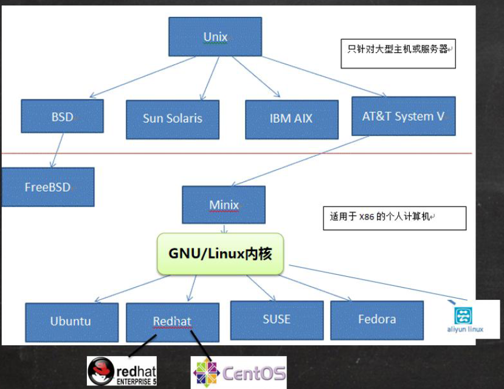

## 二、Linux安装

### 安装 vm 和 Centos

#### VMware下载

官方地址：https://www.vmware.com/cn.html

#### VM 安装的步骤

1. 在 BIOS 里修改设置开启虚拟化设备支持, 可以在任务管理器中查看是否开启, 开启则无视此步.  虚拟化开启步骤: https://jingyan.baidu.com/article/ab0b56305f2882c15afa7dda.html 
2. 安装虚拟机软件（VMware16.0)

#### Centos的下载和安装

Centos7.6下载地址: 

1. https://mirrors.aliyun.com/centos/7/isos/x86_64/CentOS-7-x86_64-DVD-2009.iso
2. http://mirrors.aliyun.com/centos/7/isos/x86_64/

Centos8 下载地址: 

1. https://mirrors.aliyun.com/centos/8.1.1911/isos/x86_64/CentOS-8.1.1911-x86_64-dvd1.iso

#### CentOS 安装的步骤

1. 在VMware中创建虚拟机
2. 开始安装系统(CentOS7.6)


Linux网络连接的三种方式

1. 桥接模式:虚拟系统可以和外部系统通讯, 但是容易造成IP冲突
2. NAT模式: 网络地址转换模式, 虚拟系统可以和外部系统通讯, 不会造成IP冲突
3. 主机模式: 独立的系统


## 三、✅虚拟机的操作

### 虚拟机克隆

如果你已经安装了一台 linux 操作系统，你还想再更多的相同版本的系统, 可以使用虚拟机克隆

1. 直接拷贝一份安装好的虚拟机文件
2. 使用 vmware 的克隆操作，注意， 克隆时，需要先关闭 linux 系统

### 虚拟机快照

如果你在使用虚拟机系统的时候(比如 linux)，你想回到原先的某一个状态，也就是说你担心可能有些误操作造成系统异常，需要回到原先某个正常运行的状态，vmware 也提供了这样的功能，就叫快照管理.  可以将**快照简单的理解为`游戏存档`**


### 虚拟机迁移和删除

#### 迁移

虚拟系统的迁移很方便，你可以把安装好的虚拟系统这个**文件夹整体拷贝或者剪切**到另外位置使用

#### 删除

用 vmware 进行移除，再点击菜单->从磁盘删除即可，或者直接**手动删除虚拟系统对应的文件夹**即可。


### 安装 vmtools

vmtools 安装后，可以让我们在 windows 下更好的管理 vm 虚拟机, 如可以设置 windows 和 centos 的共享文件夹

`注意：安装 vmtools 需要有 gcc `, 可以使用 `ggc -v ` 来查看gcc是否安装

步骤: 

1. 进入 centos
2. 点击 vm 菜单的->install vmware tools
3. centos 会出现一个 vm 的安装包, xx.tar.gz
4. 将此文件拷贝到  /opt
5. 使用解压命令 tar, `tar -zxvf xx.tar.gz` 得到一个安装文件, `cd /opt` [进入到 opt 目录]
6. 进入该 vm 解压的目录 , /opt 目录下
   `cd vmware...`
7. 安装 ./vmware-install.pl
8. 全部使用默认设置即可(一路回车), 就可以安装成功


### 设置共享文件夹

共享文件夹可以使Linux访问到

具体步骤: 

1. 菜单->vm->setting--> 选项(上面) --> 共享文件夹--> 添加--> 选中需要共享的文件夹即可
2. windows 和 centos 共享了 d:/OS/Share 目录可以读写文件了
3. 共享文件夹在 centos 的 /mnt/hgfs/ 下

## 四、🌈Linux的目录结构

### 基本介绍

1. linux 的文件系统是采用级层式的**树状目录结构**，在此结构中的最上层是**根目录“/”**，然后在此目录下再创建其他的目录。
2. `在 Linux 世界里，一切皆文件!!`

### 目录结构介绍

1. `/bin` [常用] (/usr/bin 、 /usr/local/bin)
   是 Binary 的缩写, 这个目录存放着最经常使用的命令
2. `/sbin` (/usr/sbin 、 /usr/local/sbin)
   s 就是 Super User 的意思，这里存放的是系统管理员使用的系统管理程序
3. `/home` [常用]
   存放普通用户的主目录，在 Linux 中每个用户都有一个自己的目录，一般该目录名是以用户的账号命名
4. `/root` [常用]
   该目录为系统管理员，也称作超级权限者的用户主目录
5. `/lib` 系统开机所需要最基本的动态连接共享库，其作用类似于 Windows 里的 DLL 文件。几乎所有的应用程序都需要用到这些共享库
6. `/lost+found` 这个目录一般情况下是空的，当系统非法关机后，这里就存放了一些文件
7. `/etc` [常用]
   所有的系统管理所需要的配置文件和子目录, 比如安装 mysql 数据库 my.conf
8. `/usr` [常用]
   这是一个非常重要的目录，用户的很多应用程序和文件都放在这个目录下，类似与 windows 下的 program files 目录。
9. `/boot` [常用] 存放的是启动 Linux 时使用的一些核心文件，包括一些连接文件以及镜像文件
10. `/proc`[不能动] 这个目录是一个虚拟的目录，它是系统内存的映射，访问这个目录来获取系统信息
11. `/srv` [不能动] service 缩写，该目录存放一些服务启动之后需要提取的数据
12. `/sys` [不能动] 这是 linux2.6 内核的一个很大的变化。该目录下安装了 2.6 内核中新出现的一个文件系统 
13. `/tmp` 这个目录是用来存放一些临时文件的
14. `/dev`   类似于 windows 的设备管理器，把所有的硬件用文件的形式存储
15. `/media` [常用] linux 系统会自动识别一些设备，例如 U 盘、光驱等等，当识别后，linux 会把识别的设备挂载到这个目录下
16. `/mnt` [常用]
    系统提供该目录是为了让用户临时挂载别的文件系统的，我们可以将外部的存储挂载在/mnt/上，然后进入该目录就可以查看里的内容了。 d:/myshare
17. `/opt`这是给主机额外安装软件所存放的目录。如安装 ORACLE 数据库就可放到该目录下。默认为空
18. `/usr/local` [常用]
    这是另一个给主机额外安装软件所安装的目录。一般是通过编译源码方式安装的程
19. `/var` [常用]
    这个目录中存放着在不断扩充着的东西，习惯将经常被修改的目录放在这个目录下。包括各种日志文件
20. `/selinux`    [security-enhanced linux]
    SELinux 是一种安全子系统,它能控制程序只能访问特定文件, 有三种工作模式，可以自行设置.


## 五、⭐远程连接到Linux

### 为什么需要远程登录 Linux

1. linux 服务器是开发小组共享
2. 正式上线的项目是运行在公网
3. 因此程序员需要远程登录到 Linux 进行项目管理或者开发


### Xshell和Xftp的下载和安装

 Xshell 是目前最好的远程登录到 Linux 操作的软件，流畅的速度并且完美解决了中文乱码的问题

Xftp是一个基于 windows 平台的功能强大的 SFTP、FTP 文件传输软件, 使用了 Xftp 以后，windows 用户能安全地在 UNIX/Linux 和 Windows PC 之间传输文件

Xshell下载地址: https://www.xshell.com/zh/downloading/?token=R19wRTZ3aUxZVEJUbGFfUzFMZFhQd0BtdUNJQTZvYjJ3Ni1HWWZITDZLc1hn

Xftp下载地址: https://www.xshell.com/zh/downloading/?token=X05XWGJmblNZUi1oZkl0Qk8tWm9Yd0BtdUNJQTZvYjJ3Ni1HWWZITDZLc1hn

### ⭐使用Xshell连接到Linux

1. 打开Xshell
2. 创建一个新的连接(新的会话)
3. 将需要连接Linux系统的ip输入到主机名一栏, 协议选择SSH, 其他默认, 点击连接
4. 以此输入Linux的账号和密码即可连接

## 六、Vi和Vim编辑器

### vi 和 vim 的基本介绍

Vim 具有程序编辑的能力，可以看做是 Vi 的增强版本，可以主动的以字体颜色辨别语法的正确性，方便程序设计。代码补完、编译及错误跳转等方便编程的功能特别丰富. **Linux 系统会内置 vi 文本编辑器**

### vi 和 vim 常用的三种模式

#### 正常模式

以 vim 打开一个档案就直接进入一般模式了(这是默认的模式)。在这个模式中， 你可以使用『上下左右』按键来移动光标，你可以使用『删除字符』或『删除整行』来处理档案内容， 也可以使用『复制、粘贴』来处理你的文件数据

#### 插入模式

**按下任何一个字母**之后才会进入编辑模式 一般来说按 i 即可

#### 命令行模式

**输入 esc 再输入：**在这个模式当中， 可以提供你相关指令，完成读取、存盘、替换、离开 vim 、显
示行号等的动作则是在此模式中达成的


### 🌈Vi和Vim模式的切换

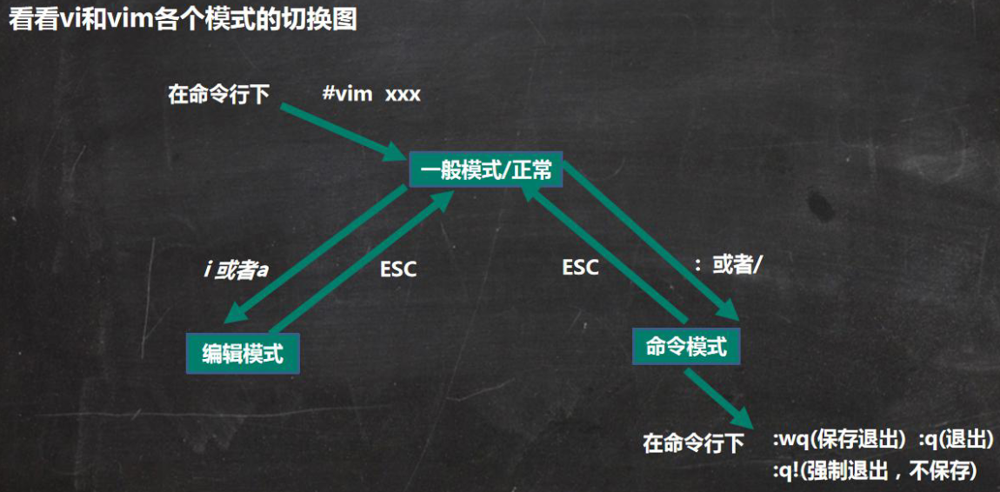


### 🌈Vi和Vim的快捷键

#### 常用的快捷键

1. **拷贝当前行**  `一般模式下, yy `拷贝当前行向下的 5 行 5yy，并`粘贴（输入 p）`
2. **删除当前行**  `dd` , 删除当前行向下的 5 行 5dd
3. **撤销输入**  在一般模式下,  `按u为撤销`
4. **查找某个单词**    [`命令行下 /关键字` ， 回车 查找 , 输入 n 就是查找下一个 ]
5. **设置文件的行号** 取消文件的行号.[`命令行下 : set nu 和 :set nonu`]
6. **定位首/末行**   在一般模式下, 使用快捷键到该文档的`最末行[G]和最首行[gg]`
7. **定位到行**    在一般模式下 , `输入行数,再输入 shift+g`


## 七、Linux的基本命令

### 关机&重启

#### 关机

以下的几种命令都可以关机, 选择一种即可.

 **注意: 关机前需要执行`sync`命令, 让内存中的数据写入到磁盘中**

```sh
sync   #把内存的数据写入到磁盘
shutdown –h now  #立该进行关机
shudown -h 1   # 1分钟后会关机
halt  #关机
```


#### 重启

 **注意: 重启前需要执行`sync`命令, 让内存中的数据写入到磁盘中**

```sh
sync  #把内存的数据写入到磁盘
shutdown –r now  #现在重新启动计算机
reboot  #现在重新启动计算机
```


### 用户登录和注销

#### 注意事项

1. 登录时尽量少用 root 帐号登录，因为它是系统管理员，最大的权限，避免操作失误。可以利用普通用户登录，登录后再用 `su - 用户名`命令来切换成系统管理员身份.
2. 在提示符下输入`logout` 即可注销用户(**此命令无法在linux系统内执行**)


## 八、用户管理

### 添加用户

基本语法:

```shell
useradd 用户名
```


指定目录来创建用户(将创建的用户文件夹放在指定目录下)

```sh
useradd -d 指定目录 新用户名
```


### 修改用户密码

基本语法:

```sh
passwd 用户名
```


### 删除用户

保留用户文件夹:

```sh
userdel 用户名
```


删除该用户的所有:

```sh
userdel -r 用户名
```


### 查询用户信息

```sh
id 用户名
```

当用户不存在时，返回无此用户


**查看当前用户/登录用户:**

```sh
whoami/ who am I
```


### 切换用户

```sh
su - 切换用户名
```

在操作 Linux 中，如果当前用户的权限不够，可以通过`su - 指令`，切换到高权限用户，比如 root

当需要返回到原来用户时，使用 exit/logout 指令

注意: **从权限高的用户切换到权限低的用户，不需要输入密码，反之需要。**

### 用户组

#### 介绍

类似于角色，**系统可以对有共性/权限的多个用户进行统一的管理**

#### 新增组

```sh
groupadd 组名
```


#### 删除组

```sh
groupdel 组名
```


#### 修改用户的组

```sh
usermod –g 用户组 用户名
```


在新建用户时指定组:

```sh
useradd –g 用户组 用户名
```


#### 用户和组相关文件

1. `/etc/passwd文件`: 用户（user）的配置文件，记录用户的各种信息
   每行的含义：**用户名:口令:用户标识号:组标识号:注释性描述:主目录:登录 Shell**
2. `/etc/shadow文件`    口令的配置文件
   每行的含义：**登录名:加密口令:最后一次修改时间:最小时间间隔:最大时间间隔:警告时间:不活动时间:失效时间:标志**
3. `/etc/group文件`  组(group)的配置文件，记录 Linux 包含的组的信息
   每行含义：**组名:口令:组标识号:组内用户列表**
4. 

## 九、实用命令

### 指定运行级别

**运行级别说明:** 

1. 0 ：关机
2. 1 ：单用户【可以找回丢失密码】
3. 2：多用户状态没有网络服务
4. **3：多用户状态有网络服务(命令行界面)**
5. 4：系统未使用保留给用户
6. **5：图形界面**
7. 6：系统重启

```sh
#切换运行级别
init [0123456]
```

**常用运行级别是 3 和 5** ，也可以指定默认运行级别


**CentOS7 后运行级别说明**

在 centos7 以后， `/etc/inittab` 文件中, 进行了简化 ，如下

```sh
# 运行级别3 命令行界面
multi-user.target
# 运行级别5 图形界面
graphical.target
```

获取当前运行级别:

```sh
systemctl get-default
```

centOS7后设置运行级别

```sh
systemctl set-default [TARGET].target
```


### 🌈找回root密码

**假设 root 密码忘记了，请问如何找回密码(面试题)**

找回root密码步骤:

1. 启动或重启系统，进入开机界面，在下面的界面中按“e”进入编辑界面

   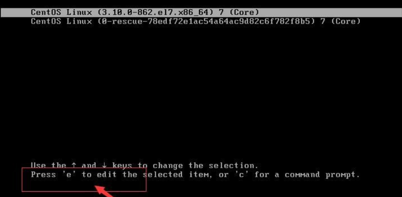

2. 进入编辑界面，使用键盘上的上下键把光标往下移动，找到**以“Linux16”开头**内容所在的行数”，在行的最后面(UTF-8)输入：`init=/bin/sh`

3. 输入完成后，直接按快捷键：**Ctrl+x 进入单用户模式**

4. 在光标闪烁的位置中输入：`mount -o remount,rw /`

5. `在新的一行最后面输入：passwd`， 完成后按键盘的回车键（Enter）。输入密码，**然后再次确认密码即**可(**密码长度最好8位以上,但不是必须**)

6. 接着，在鼠标闪烁的位置中（最后一行中）输入：`touch /.autorelabel`  完成后按回车键（Enter）

7. 继续在光标闪烁的位置中，输入：`exec /sbin/init`, 完成后按键盘的回车键（Enter）,等待系统自动修改密码, 完成后，系统会自动重启, 新的密码就会生效了

8. 

### 帮助命令

小知识: `在 linux 下，隐藏文件是以 .开头`

1. **help 命令**

   基本语法：help 命令 （功能描述：获得 shell 内置命令的帮助信息）

2. **man 获得帮助信息**

   基本语法：man [命令或配置文件]（功能描述：获得帮助信息）

   

### ⭐文件操作命令

1. **显示当前目录的绝对路径**：`pwd`

2. **查看当前目录的所有内容信息**：`ls` 

   -a ：显示当前目录所有的文件和目录，包括隐藏的。
   -l ：以列表的方式显示信息

3.  **切换到指定目录**: `cd [参数]` 

    特殊用法: `cd ~` 或者 `cd`   **回到自己的家目录**

    `cd ..`    **回到当前目录的上一级目录**

4. **创建目录:** `mkdir`

   基本语法：mkdir [选项] 要创建的目录

   -p ：创建多级目录

   创建多级目录的案例: `mkdir -p /home/animal/`

5. **删除空目录**: `rmdir`

   基本语法:  rmdir [选项] 要删除的空目录

   **注意: 如果需要删除非空目录，需要使用 `rm -rf` 删除目录**, 如 `rm -rf /home/animal`

6. **创建空文件**: `touch`

   基本语法: `touch 文件名称`,  如  `touch  hello.txt`

7. **拷贝文件到指定目录**  `cp 源文件  目的文件夹`  

   -r ：递归复制整个文件夹

   案例: 

   - 将 /home/hello.txt 拷贝到 /home/bbb 目录下   `cp hello.txt  /home/bbb`
   - 递归复制整个文件夹，比如将 /home/bbb 整个目录， 拷贝到 /opt  `cp -r /home/bbb /opt `
   - 强制覆盖不提示的方法：\cp    `\cp -r /home/bbb /op`

8. **移动文件与目录或重命名**   `mv`

   基本语法: 

   - mv oldNameFile newNameFile (**重命名**)
   - mv /temp/movefile /targetFolder (**移动文件**)

   案例: 

   - 将 /home/cat.txt 文件 重新命名为 pig.txt
   - 将 /home/pig.txt 文件 移动到 /root 目录下
   - 移动整个目录 , 比如将 /opt/bbb 移动到 /home 下 `mv /opt/bbb /hom`

9. **查看文件内容**(相比于vim更加安全, 因cat命令不能编辑)   `cat`

   -n ：显示行号

   案例: /etc/profile 文件内容，并显示行号  `cat -n /etc/profile`

10. `more`

    more 指令是一个基于 VI 编辑器的文本过滤器，它以全屏幕的方式按页显示文本文件的内容。more 指令中内置了若干快捷键(交互的指令)

    基本语法:   `more 要查看的文件`

    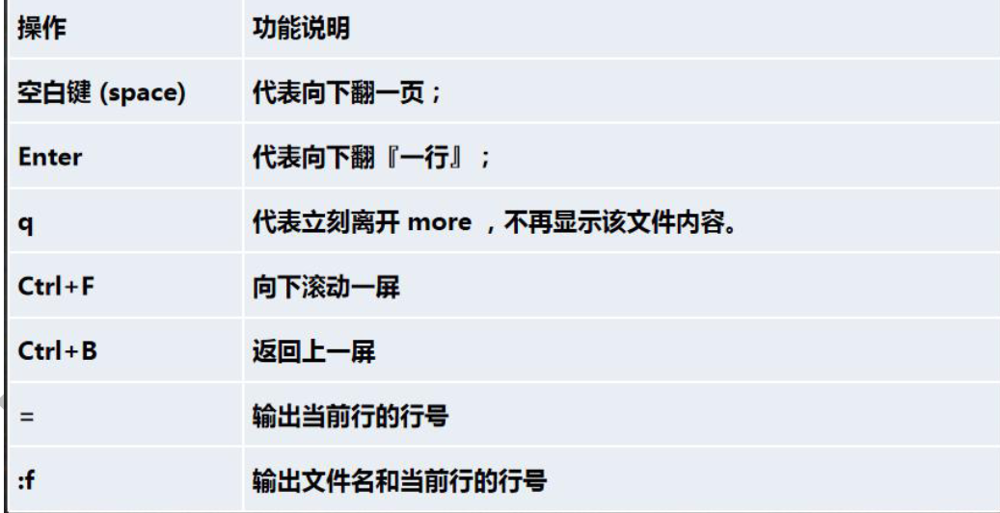

    可以和cat命令组合使用:   如`cat -n /etc/profile | more `[进行交互]

11. `less`

    less指令在显示文件内容时，并不是一次将整个文件加载之后才显示，而是根**据显示需要加载内容**，对于显示大型文件具有较高的效率

    基本语法:  `less 要查看的文件名`

    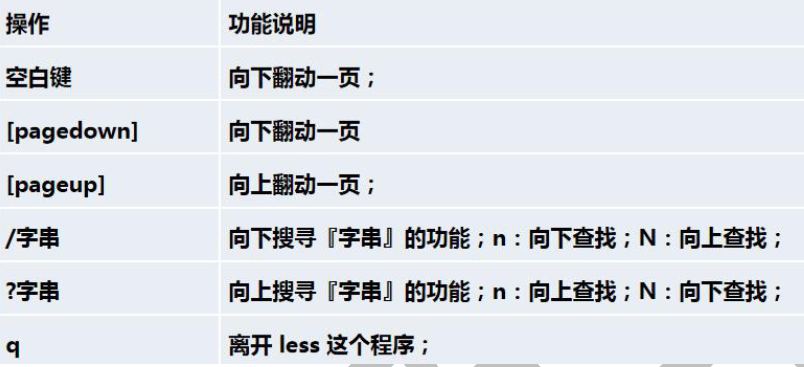

    案例: 采用 less 查看一个大文件文件 /opt/杂文.txt   `less /opt/杂文.txt`

12. **输出内容到控制台**  `echo`

    基本语法: `echo [选项] [输出内容]`

    案例: 使用 echo 指令输出环境变量, 比如输出 `$PATH $HOSTNAME`   `echo $HOSTNAME`

13. **显示文件的开头部分内容**:   `head`

    **默认情况下 head 指令显示文件的前 10 行内容**

    基本语法: 

    - `head 文件` (功能描述：查看文件头 10 行内容)
    - `head -n  文件` (功能描述：查看文件头 n行内容，n是任意行数)

14. **输出文件中尾部的内容**  `tail`

    语法: 

    -  tail 文件 （查看文件尾 10 行内容）
    -  tail -n 5 文件 （查看文件尾 5 行内容，5 可以是任意行数）
    -  tail 的特殊用法:  `tail -f 文件` （**实时追踪该文档的所有更新**）

15. `>` `>>`

    **\> 输出重定向       >> 追加**

    基本语法: 

    -  `ls -l >文件` （功能描述：列表的内容写入文件 a.txt 中（覆盖写））
    -  `ls -al >>文件` （功能描述：列表的内容追加到文件 aa.txt 的末尾）
    -  `cat 文件 1 > 文件 2` （功能描述：将文件 1 的内容覆盖到文件 2）
    -  `echo "内容">> 文件` (追加)

16. **软链接[符号链接]**  `ln`  **类似于 windows 里的快捷方式，主要存放了链接其他文件的路径**

    基本语法: `ln -s [原文件或目录] [软链接名]` （给原文件创建一个软链接）

     注意: **当我们使用 pwd 指令查看目录时，仍然看到的是软链接所在目录**

    使用: 

    - 建立软连接: `ln -s /root   /home/myroot`

    - 删除软连接: `rm /home/myroot`

17. 查看已经执行过历史命令,也可以执行历史指令  `history`

    - 显示所有的历史命令  `history`
    - 显示最近使用过的 10 个指令   `history 10` 
    - 执行历史编号为 5 的指令  `!5`

### 时间日期类命令

1. 显示当前日期  `date`

   -  `date` （功能描述：显示当前时间）
   -  `date +%Y` （功能描述：显示当前年份）
   -  `date +%m`（功能描述：显示当前月份）
   -  `date +%d` （功能描述：显示当前是哪一天）
   -  `date "+%Y-%m-%d %H:%M:%S"`（功能描述：显示年月日时分秒）

2. 设置日期

   设置系统当前时间: `date -s “2020-11-03 01:01:01"`

3. 查看日历 `cal`

   - 显示当前日历 `cal`
   - 显示 2020 年日历 : `cal 20`

### 搜索查找类命令

1. find 指令

   **find 指令将从指定目录向下递归地遍历其各个子目录，将满足条件的文件或者目录显示在终端**

   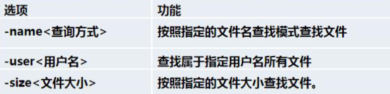

   - 根据名称查找/home 目录下的 hello.txt 文件  `find /home -name hello`

   - 按拥有者：查找/opt 目录下，用户名称为 nobody 的文件  `find /opt -user nobody`

   - 查找整个 linux 系统下大于 200M 的文件（+n 大于 -n 小于n 等于, 单位有 k,M,G, T）

     `find / -size +200M`

2. locate 指令

   locate 指令可以快速定位文件路径。locate 指令利用事先建立的系统中所有文件名称及路径的 locate 数据库实现快速定位给定的文件。Locate 指令无需遍历整个文件系统，查询速度较快。为了保证查询结果的准确度，管理员必须定期更新 locate 时刻

   - 注意: l**ocate 指令基于数据库进行查询，所以第一次运行前，必须使用 `updatedb` 指令创建 locate 数据库**
   - 使用  `locate 搜索文件名`

3. which 指令

   查看某个指令在哪个目录下, 如 `which ls`  ls 指令在哪个目录

### grep 指令和管道符号 `|`

- **grep 过滤查找**

- 管道符`|`表示**将前一个命令的处理结果输出传递给后面的命令处理**

基本语法: `grep [选项] 查找内容 源文件`


案例: 在 hello.txt 文件中，查找 "yes" 所在行，并且显示行号

1. `cat /home/hello.txt | grep "yes"`
2. `grep -n "yes" /home/hell`

### 压缩和解压

1. gzip/gunzip 指令  **gzip 用于压缩文件， gunzip 用于解压文件**

   案例: 将 /home 下的 hello.txt 文件进行压缩和压缩

   - 压缩: `gzip /home/hello.txt`
   - 解压: `gunzip /home/hello.txt.gz`

2. zip/unzip 指令   **zip 用于压缩文件， unzip 用于解压文件，这个在项目打包发布中比较重要!**

   -r   递归压缩，即压缩整个目录

   -d  <目录> ：指定解压后文件的存放目录

   - 将 /home 下的 所有文件/文件夹进行压缩成 myhome.zip  `zip -r myhome.zip /home/`

   - 将 myhome.zip 解压到 /opt/tmp 目录下  `unzip -d /opt/tmp /home/myhome`

3. tar指令

   `tar [选项] XXX.tar.gz` 打包的内容 (功能描述：打包目录，压缩后的文件格式.tar.gz)

   

   - 压缩多个文件，将 /home/pig.txt 和 /home/cat.txt 压缩成 pc.tar.gz

     `tar -zcvf pc.tar.gz /home/pig.txt /home/cat.txt`

   - 将/home 的文件夹 压缩成 myhome.tar.gz   `tar -zcvf myhome.tar.gz /home/`

   - 将 pc.tar.gz 解压到当前目录   `tar -zxvf pc.tar.gz`

   - 将 myhome.tar.gz 解压到 /opt/tmp2 目录下   

     `tar -zxvf /home/myhome.tar.gz -C /opt/tmp`


## 十、组管理和权限管理

### 组的基本介绍

在 linux 中的每个用户必须属于一个组，不能独立于组外。在 linux 中每个文件
有**所有者、所在组、其它组**的概念。

1. 所有者
2. 所在组
3. 其他组

### 文件/目录 所有者

一般为文件的创建者,谁创建了该文件/目录，就自然的成为该文件/目录的所有者

1. 查看文件的所有者:

   ```sh
   ls -ahl
   ```

   

2. 修改文件所有者

   ```sh
   chown 用户名 文件名
   ```

案例: 

使用 root 创建一个文件 apple.txt ，然后将其所有者修改成 tom

```sh
chown tom apple.txt
```

### 组的创建

基本命令: `groupadd 组名`


### 文件/目录 所在组

**当某个用户创建了一个文件后**，这个**文件的所在组就是该用户所在的组**(默认)


1. 查看文件/目录所在组  `ls - ahl`

   

2. 修改文件/目录所在的组  `chgrp 组名 文件名`

案例: 

- 使用 root 用户创建文件 orange.txt ,看看当前这个文件属于哪个组，然后将这个文件所在组，修改到 fruit 组

### 改变用户所在的组

在添加用户时，可以指定将该用户添加到哪个组中，同样的用 root 的管理权限可以改变某个用户所在的组

1. 改变用户所在的组:  `usermod –g 新组名 用户名`

2. 改变该用户登陆的初始目录: `usermod –d 目录名 用户名`

   注意: **用户需要有进入到新目录的权限**


### 权限管理的介绍

`ls -l` 的显示如下: 

 

> 0-9位的含义说明: 

1. **第 0 位确定文件类型**(`d  -  l  c  b`)
   - `-`  表示普通文件
   - `l` 是链接(软链接)，相当于 windows 的快捷方式
   - `d` 是目录，相当于 windows 的文件夹
   - `c` 是字符设备文件，如鼠标，键盘
   - `b` 是块设备，如硬盘
2. **第 1-3 位确定所有者（该文件的所有者）拥有该文件的权限**    --user
3. **第 4-6 位确定所属组（同用户组的）拥有该文件的权限**  ---Group
4. 第 **7-9 位确定其他用户拥有该文件的权限** ---Other

>  `rwx 权限详解:` 

- 作用到文件: 
  1. [ r ]代表可读(read): 可以读取,查看
  2. [ w ]代表可写(write): 可以修改,**但是不代表可以删除该文件,删除一个文件的前提条件是对该文件所在的目录有写权限**，才能删除该文件.
  3. [ x ]代表可执行(execute):可以被执行
- **作用到目录**
  1. [ r ]代表可读(read): 可以读取，ls 查看目录内容
  2. [ w ]代表可写(write): 可以修改, **对目录内创建+删除+重命名目录**
  3. [ x ]代表可执行(execute):可以进入该目录

### 文件及目录权限实际案例

以  **`-rwxrw-r-- 1 root root 1213 Feb 2 09:39 abc`**  为例

10 个字符确定不同用户能对文件的权限: 

1. 第一个字符代表文件类型： `- l d c b`
2. 其余字符每 3 个一组(rwx) 读(r) 写(w) 执行(x)
3. 第一组 rwx : 文件拥有者的权限是读、写和执行
4. 第二组 rw- : **与文件拥有者同一组的用户的权限**是读、写但不能执行
5. 第三组 r-- : 不与文件拥有者同组的其他用户的权限是读不能写和执行
6. **可用数字表示为: r=4,w=2,x=1 因此 rwx=4+2+1=7 , 数字可以进行组合**

> 其他说明

| 1                                  | root | root | 1219           | 2月  11 11:30 | abc.txt |
| ---------------------------------- | ---- | ---- | -------------- | ------------- | ------- |
| 文件：硬连接数      目录：子目录数 | 用户 | 组   | 文件大小(字节) | 最后修改日期  | 文件名  |


### 修改权限

**可以通过 `chmod` 命令，可以修改文件或者目录的权限**

> 方式一: 通过   `+   -   =` 变更权限

说明: **u: 所有者      g: 所在组     o: 其他组    a: 所有人(u、g、o 的总和)**

案例:

1. 给 abc 文件 的所有者读写执行的权限，给所在组读执行权限，给其它组读执行权限。

2. 给 abc 文件的所有者除去执行的权限，增加组写的权限
   `chmod u-x,g+w abc.txt`
3. 给 abc 文件的所有用户添加读的权限
   `chmod a+r abc.txt`


> 方式二: **通过数字变更权限**

说明:    **r=4    w=2 x=1      rwx=7**

案例: 将 /home/abc.txt 文件的权限修改成 rwxr-xr-x, 使用给数字的方式实现

`chmod 755 /home/abc.txt`


### 修改文件/目录的所有者/所在组

> 修改文件/目录所在组

`chgrp newgroup 文件/目录`

注意: 如果为目录则需要加上 -R  **(使其下所有子文件或目录递归生效)**

- 案例: 将 /home/test 目录下所有的文件和目录的所在组都修改成 shaolin(少林)

  `chgrp -R shaolin /home/test`


> 修改文件/目录所有者

`chown newowner 文件/目录 `

注意: 如果为目录则需要加上 -R  **(使其下所有子文件或目录递归生效)**

- 案例: 请将 /home/test 目录下所有的文件和目录的所有者都修改成 tom
  `chown -R tom /home/t`


### 综合案例

> 警匪游戏

police ， bandit
jack, jerry: 警察
xh, xq: 土匪

1. 创建组 `groupadd police ; groupadd bandit`
2. 创建用户
   `useradd -g police jack`      `useradd -g police jerry`
   `useradd -g bandit xh`          `useradd -g bandit xq`
3. jack 创建一个文件，自己可以读 r 写 w，本组人可以读，其它组没人任何权限
   首先 jack 登录 ； `vim jack.txt`         `chmod 640 jack.txt`
4. jack 修改该文件，让其它组人可以读, 本组人可以读写
   `chmod o=r,g=r jack.txt`
5. xh 投靠 警察，看看是否可以读写.
   `usermod -g police xh`
6. 测试，看看 xh 是否可以读写，xq 是否可以, 小结论，就是如果要对目录内的文件进行操作，需要要有对该目录的相应权限


> 练习1

1. 建立两个组（神仙(sx),妖怪(yg)）
2. 建立四个用户(唐僧,悟空，八戒，沙僧)
3. 设置密码
4. 把悟空，八戒放入妖怪 唐僧 沙僧 在神仙
5. 用悟空建立一个文件 （monkey.java 该文件要输出 i am monkey）
6. 给八戒一个可以 r w 的权限
7. 八戒修改 monkey.java 加入一句话( i am pig)
8. 唐僧 沙僧 对该文件没有权限
9. 把 沙僧 放入妖怪组
10. 让沙僧 修改 该文件 monkey, 加入一句话 ("我是沙僧，我是妖怪!"); 
11. 对文件夹 rwx 的细节讨论和测试!!!
    **x: 表示可以进入到该目录, 比如 cd**
    **r: 表示可以 ls , 将目录的内容显示**
    **w: 表示可以在该目录，删除或者创建文件**


> 练习2


1. 用 root 登录，建立用户 mycentos,自己设定密码
2. 用 mycentos 登录，在主目录下建立目录 test/t11/t1
3. 在 t1 中建立一个文本文件 aa,用 vi 编辑其内容为 ls –al
4. 改变 aa 的权限为可执行文件[可以将当前日期追加到一个文件],运行该文件./aa
5. 删除新建立的目录 test/t11/t1
6. 删除用户 mycentos 及其主目录中的内容
7. 将 linux 设置成进入到图形界面的
8. 重新启动 linux 或关机


## 十一、定时任务调度

### crond 任务调度概述

**crontab命令用于 进行 定时任务的设置**

任务调度：是指**系统在某个时间执行的特定的命令或程序**

任务调度的分类:

1. 系统工作：有些重要的工作必须周而复始地执行。如病毒扫描等
2. 个别用户工作：个别用户可能希望执行某些程序，比如对 mysql 数据库的备份。

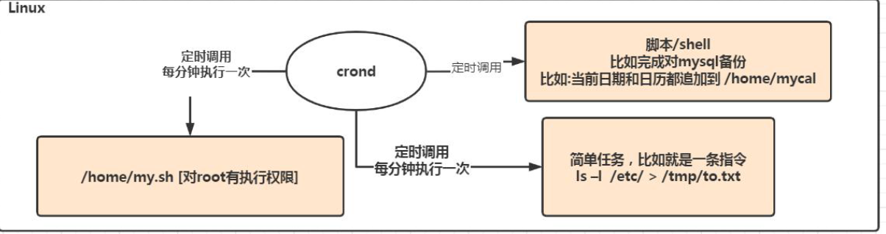

### 基本使用

基本语法:   `crontab [选项]`

常用的选项:

1. `-e`   编辑crontab定时任务
2. `-l`    查询crontab任务
3. `-r`    删除当前用户所有的crontab任务

其他使用: 

`conrtab –r`：终止任务调度。
`crontab –l`：列出当前有那些任务调度
`service crond restart` 重启任务调度

### 参数说明

1. 设置个人任务调度,  执行 `crontab –e` 命令
2. 输入任务到调度文件,  如`*/1 * * * * ls –l /home > /heom/temp/abc.txt`

具体的参数说明: 


特殊符号说明: 

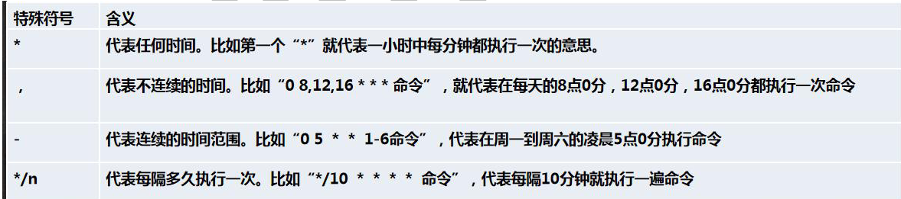

> 常用的时间案例 : 

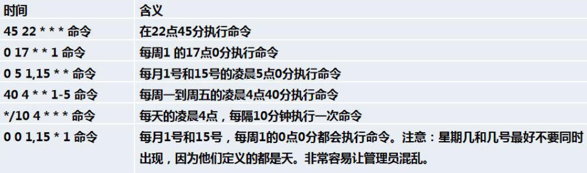

### 应用实例

1. 案例 1：每隔 1 分钟，就将当前的日期信息，追加到 /tmp/mydate 文件中
   `*/1 * * * * date >> /tmp/mydate`

2.  案例 2：每隔 1 分钟， 将当前日期和日历都追加到 /home/mycal 文件中
    步骤:
    (1) vim /home/my.sh 写入内容 `date >> /home/mycal`   `cal >> /home/mycal`
    (2) 给 my.sh 增加执行权限，`chmod u+x /home/my.sh`
    (3) crontab -e 增加 *`/1 * * * * /home/my.sh`

3.  案例 3: 每天凌晨 2:00 将 mysql 数据库 testdb ，备份到文件中。

    提示: 指令为mysqldump -u root -p 密码 数据库 > /home/db.bak
    步骤(1) `crontab -e`
    步骤(2) `0 2 * * * mysqldump -u root -p123456 testdb > /home/db.bak`


### at定时任务

> 基本介绍


1. at 命令是一次性定时计划任务，at 的守护进程 atd 会以后台模式运行，检查作业队列来运行。
2. 默认情况下，atd 守护进程每 60 秒检查作业队列，有作业时，会检查作业运行时间，如果时间与当前时间匹配，则运行此作业。
3. at 命令是一次性定时计划任务，执行完一个任务后不再执行此任务了
4. 在使用 at 命令的时候，一定要保证 atd 进程的启动 , 可以使用相关指令来查看
   `ps -ef | grep atd`   可以检测 atd 是否在运行


> 使用

`at [选项] [时间]`

atq 命令可以来查看系统中没有执行的工作任务

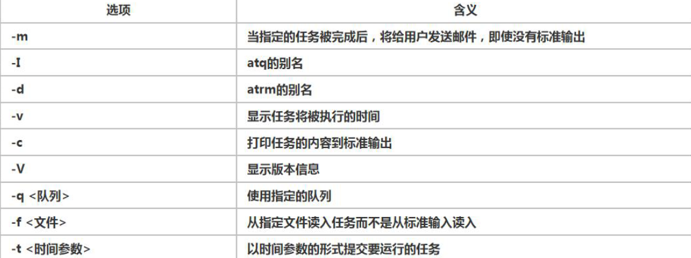

at 指定时间的方法: 

1. 接受在当天的 hh:mm（小时:分钟）式的时间指定。假如该时间已过去，那么就放在第二天执行。 例如：04:00
2. 使用 midnight（深夜），noon（中午），teatime（饮茶时间，一般是下午 4 点）等比较模糊的词语来指定时间。
3. 采用 12 小时计时制，即在时间后面加上 AM（上午）或 PM（下午）来说明是上午还是下午。 例如：12pm
4. 指定命令执行的具体日期，指定格式为 month day（月 日）或 mm/dd/yy（月/日/年）或 dd.mm.yy（日.月.年），指定的日期必须跟在指定时间的后面。 例如：04:00 2021-03-1
5. 使用相对计时法。指定格式为：now + count time-units ，now 就是当前时间，time-units 是时间单位，这里能够是 minutes（分钟）、hours（小时）、days（天）、weeks（星期）。count 是时间的数量，几天，几小时。 例如：now + 5 minutes
6. 直接使用 today（今天）、tomorrow（明天）来指定完成命令的时间


> 应用实例

1. 2 天后的下午 5 点执行 /bin/ls /home

   输入命令 `at 5pm + 2 days` 之后在输入命令 `/bin/ls /home` 最后按**两次Ctrl + d**

2. 明天 17 点钟，输出时间到指定文件内 比如 /root/date100

   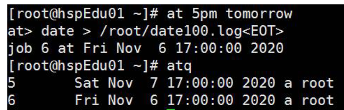

3. 2 分钟后，输出时间到指定文件内 比如 /root/date200

   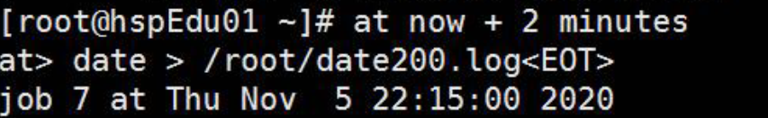

4. 删除已经设置的任务 , atrm 编号

   `atrm 4`   表示将 job 队列，编号为 4 的 job 删除.

## 十二、磁盘分区、挂载

###  Linux 分区

> 原理

1. Linux 来说无论有几个分区，分给哪一目录使用，它归根结底就只有一个根目录，一个独立且唯一的文件结构 , **Linux中每个分区都是用来组成整个文件系统的一部分**
2. Linux 采用了一种叫“载入”的处理方法，它的整个文件系统中包含了一整套的文件和目录，**且将一个分区和一个目录联系起来。这时要载入的一个分区将使它的存储空间在一个目录下获得**

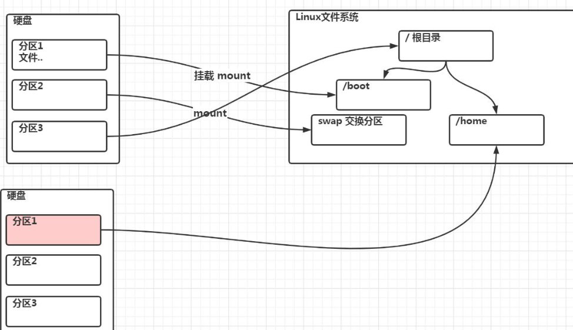

### 硬盘说明

1. Linux 硬盘分 I**DE 硬盘**和 **SCSI 硬盘**，目前基本上是 **SCSI 硬盘**

2. 对于 IDE 硬盘，驱动器标识符为“hdx~”,其中“hd”表明分区所在设备的类型, 是指 IDE 硬盘

3. 对于 SCSI 硬盘则标识为“sdx~”，SCSI 硬盘是用“sd”来表示分区所在设备的类型的，

   - **“x”为盘号（a 为基本盘，b 为基本从属盘，c 为辅助主盘，d 为辅助从属盘**）  
   - “~”代表分区, 前四个分区用数字 1 到 4 表示，它们是主分区或扩展分区, 从 5 开始就是逻辑分区。
   - 例，hda3 表示为第一个 IDE 硬盘上的第三个主分区或扩展分区,hdb2表示为第二个 IDE 硬盘上的第二个主分区或扩展分区。

   

> 查看所有设备的挂载情况

命令 ：`lsblk`  或  `lsblk -f`

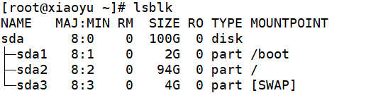

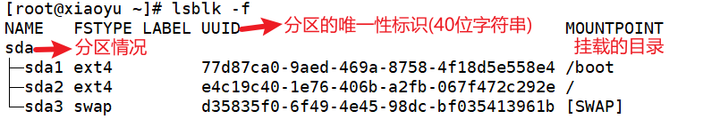


> 挂载的案例

我们以增加一块硬盘为例来熟悉下磁盘的相关指令和深入理解磁盘分区、挂载、卸载的概念

虚拟机添加一块硬盘的步骤

1. 在【虚拟机】菜单中，选择【设置】，然后设备列表里添加硬盘，然后一路【下一步】，中间只有选择磁盘大小的地方需要修改，至到完成。然后重启系统（才能识别)

2. 对新添加的硬盘进行分区, 分区命令 `fdisk /dev/sdb`   /dev/sdb 是新添加硬盘对应的目录

   - m 显示命令列表
   - p 显示磁盘分区 同 fdisk –l
   - n 新增分区
   - d 删除分区
   - w 写入并退出

   输入n 新增分区,  之后在依次输入p(表示此分区为主分区), 在输入1(表示增加一个分区), 在一路回车即可完成.  此时可以使用 `lsblk -f` 命令来查看分区情况

3. 格式化新增的分区  `mkfs -t ext4 /dev/sdb`   **ext4是分区类型**

4. **挂载 : 将一个分区与一个目录联系起来**

   将分区挂载到需要的目录  `mount 设备名称 挂载目录`  如   `mount /dev/sdb1 /newdisk`

   卸载   `umount 设备名称 或者 挂载目录`  如： `umount /dev/sdb1` 或 `umount /newdis`

5. **将分区永久挂载对对应目录**

   永久挂载: 通过修改/etc/fstab 实现挂载

   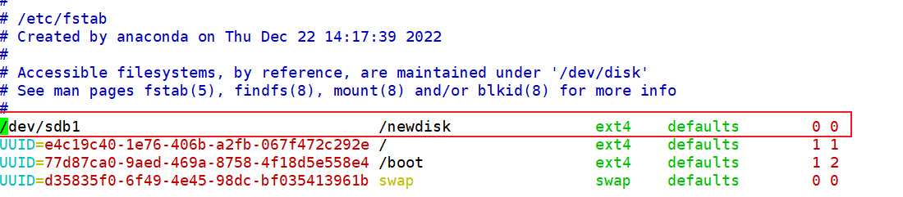

   

### 磁盘情况查询


> 查询**系统整体磁盘使用情况**

基本语法:  `df -h`


> 查询**指定目录的磁盘使用情况**

基本语法: `du -h`    默认为当前目录

可加参数以及说明: 

- `-s`  指定目录占用大小汇总
- `-h`  带计量单位
- `-a`  含文件
- `--max-depth=1`  子目录深度(1说明深度为1)
- `-c`  列出明细的同时，增加汇总值

案例:  查询 /opt 目录的磁盘占用情况，深度为1    `du -hac --max-depth=1 /opt`


### 磁盘情况-工作实用指令

1. 统计/opt 文件夹下文件的个数

   `ls -l /opt | grep "^-" | wc -l`

2. 统计/opt 文件夹下目录的个数
   `ls -l /opt | grep "^d" | wc -l`

3.  统计/opt 文件夹下文件的个数，包括子文件夹里的
    `ls -lR /opt | grep "^-" | wc -l`

4. 统计/opt 文件夹下目录的个数，包括子文件夹里的
   `ls -lR /opt | grep "^d" | wc -l`

5. 以树状显示目录结构 tree 目录 ， 注意，如果没有 tree ,**可以使用 `yum install tree` 安装**


## 十三、网络配置

###  Linux 网络配置原理图

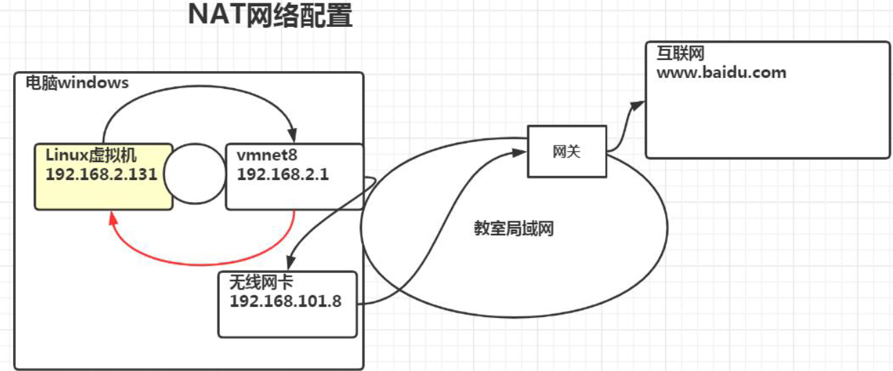


### 查看Linux虚拟机网络基本信息

> 查看网络 IP 和网关

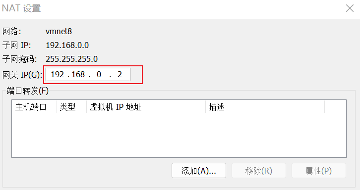

> 查看 windows 环境的中 VMnet8 网络配置

使用 `ipconfig` 可以查看windows环境中的网络配置


> 查看 linux 的网络配置 `ifconfig`


> 测试主机之间网络连通性

使用`ping`命令可以查看网络的连通性,  如 `ping qq.com`


### Linux网络环境配置

> 方式一: 自动获取ip

登陆后，通过界面的来设置自动获取 ip

特点：linux 启动后会自动获取 IP,缺点是每次自动获取的 ip 地址可能不一样


> 方式二: 指定 ip

通过直接**修改配置文件**来指定 IP,并可以连接到外网

打开`vim /etc/sysconfig/network-scripts/ifcfg-ens33` 配置文件,并修改

**ifcfg-ens33配置文件说明**

1. DEVICE=eth0   #接口名（设备,网卡）

2. HWADDR=00:0C:2x:6x:0x:xx     #MAC 地址

3. TYPE=Ethernet       #网络类型（通常是 Ethemet）

4. UUID=926a57ba-92c6-4231-bacb-f27e5e6a9f44      #随机 id

5. ONBOOT=yes     #系统启动的时候网络接口是否有效（yes/no）

6. BOOTPROTO=static 

   IP 的配置方法 none 引导时不使用协议  static  静态分配 IP  bootp   BOOTP 协议  dhcp  DHCP 协议

7. IPADDR=192.168.200.130    #IP 地址  

8. GATEWAY=192.168.200.2    #网关     

9. DNS1=192.168.200.2    #域名解析器

修改完成配置文件后, **要重启网络服务或重启linux系统, 否则配置不会立即生效**


### 设置主机名和 hosts 映射

> 设置主机名

1. 为了方便记忆，可以给 linux 系统设置主机名, 也可以根据需要修改主机名
2. 指令 `hostname` ： 查看主机名
3. 修改文件在 `/etc/hostname` 指定
4. 修改后，重启生效


> 设置 hosts 映射

- windows

  在 `C:\Windows\System32\drivers\etc\hosts` 文件中指定

  例: `192.168.200.8   xiaoyu-linux`

- linux

  在 `/etc/hosts` 文件中指定,  如`192.168.200.1   xiaoyu`


## ⭐十四、进程管理

### 基本介绍

> 什么是进程?

1. 在 LINUX 中，**每个执行的程序都称为一个进程**(**程序运行后**)。每一个进程都分配一个 ID 号(pid,进程号)
2. 每个进程都可能以两种方式存在的。前台与后台，所谓前台进程就是用户目前的屏幕上可以进行操作的。后台进程则是实际在操作，但由于屏幕上无法看到的进程，通常使用后台方式执行。
3. 一般系统的服务都是以后台进程的方式存在，而且都会常驻在系统中。直到关机才才结束


### 系统执行的进程

`ps` 命令是用来查看目前系统中，有哪些正在执行，以及它们执行的状况。可以不加任何参数

ps命令参数说明

- `-a`  显示当前终端的的所有进程信息
- `-u`  以用户的格式显示进程信息
- `-x`   显示后台进程运行的参数

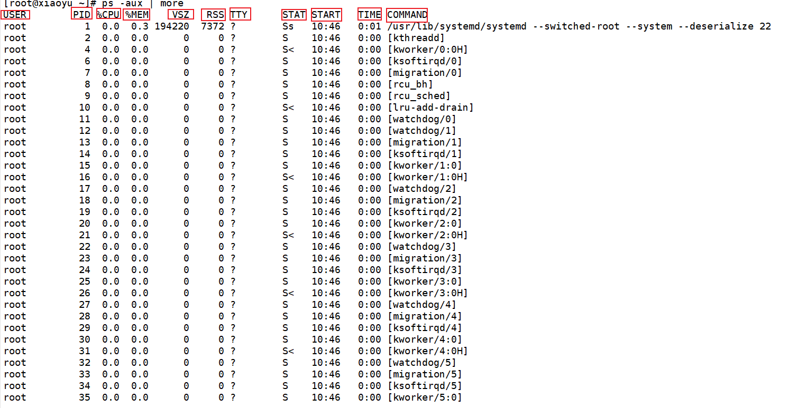

> `ps -aux`详解

1. **USER**：进程执行用户名称
2. **PID**：进程号
3. **%CPU**：进程占用 CPU 的百分比
4. **%MEM**：进程占用物理内存的百分比
5. **VSZ**：进程占用的虚拟内存大小（单位：KB）
6. **RSS**：进程占用的物理内存大小（单位：KB）
7. **TTY**：完整的终端名称
8. **STAT**：进程状态，其中 **S-睡眠**，s-表示该进程是会话的先导进程，N-表示进程拥有比普通优先级更低的优先级，**R-正在运行**，**D-短期等待**，**Z-僵死进程**，**T-被跟踪或者被停止**等等
9. **STARTED**：进程的启动时间
10. **TIME**：CPU 时间，即进程使用 CPU 的总时间
11. **COMMAND**：启动进程所用的命令和参数，如果过长会被截断显示

可以和 grep命令配合使用, 来查看该进程是否被执行, 如查看sshd服务

`ps -aux | grep "sshd"`


> 查看进程的父进程

`ps -ef` 是以全格式显示当前所有的进程     `-e` 显示所有进程   `-f` 全格式

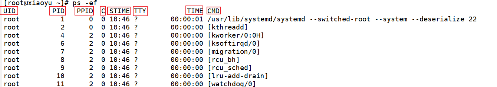

字段说明 

1. **UID**：用户 ID
2. **PID**：进程 ID
3. **PPID**：父进程 ID
4. **C**：CPU 用于计算执行优先级的因子。**数值越大，表明进程是 CPU 密集型运算，执行优先级会降低       数值越小，表明进程是 I/O 密集型运算，执行优先级会提高**
5. **STIME**：进程启动的时间 
6. **TTY**：完整的终端名称
7. **TIME**：CPU 时间
8. **CMD**：启动进程所用的命令和参数


案例: 查看 sshd 的父进程信息   `ps -ef | grep "sshd"`

### 终止/杀死进程

若是某个进程执行一半需要停止时，或是已消了很大的系统资源时，此时可以考虑停止该进程。使用 `kill` 命令来终止此进程

> 基本语法

1. `kill [选项] 进程号`

   通过进程号终止进程

2. `killall 进程名称`

   通过进程名称杀死进程，也支持通配符，在系统因负载过大而变得很慢时很有用

> 常用选项

`-9`   表示强迫进程立即停止


> 实用案例

1. 踢掉某个非法登录用户   `kill 3929`
2. 终止远程登录服务 sshd, 在适当时候再次重启 sshd 服务
   kill sshd 对应的进程号; /bin/systemctl start sshd.service
3. 终止多个 gedit , 演示 `killall gedit`
4. 强制杀掉一个终端, 指令 kill -9 bash对应的进程号


### 查看进程树

> 基本语法

`pstree [选项]` ,可以更加直观的来看进程信息

常用的选项

- `-p`  显示进程的 PID
- `-u`  显示进程的所属用户


### 服务管理

> 基本介绍

**服务(service)** **本质就是进程**，但是是运行在后台的，通常都会监听某个端口，等待其它程序的请求，比如(mysqld , sshd, 防火墙等)，因此我们又称为**守护进程**，是 Linux 中非常重要的知识点

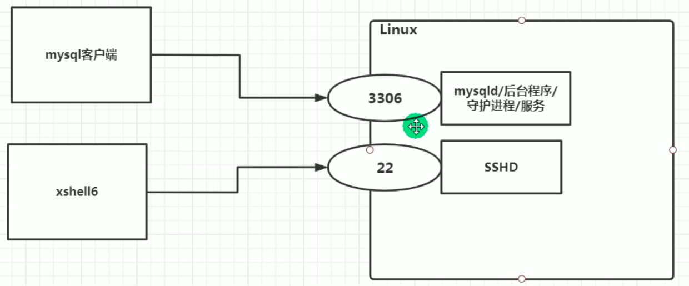

> 服务(service)管理命令

1. `service 服务名 [ start | stop | restart | reload | stauts ]`  

   如  `service network restart` 重启网络服务   

2. 在 CentOS7.0 后 很多服务不再使用 service ,而是 `systemct`

   可以使用 `ls -l /etc/init.d`  命令来查看使用service 命令管理的服务(显示为绿色)

   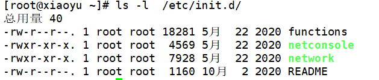

> 查看服务名

- 方式一:  使用 `setup` 命令-> 系统服务 就可以看到全部
- 方式二:  使用`ls -l /etc/init.d`可以看到 service 指令管理的服


> 服务的运行级别

Linux 系统有 7 种运行级别(**runlevel**)：**常用的是级别 3 和 5**

1. 运行级别 0：系统停机状态，系统默认运行级别不能设为 0，否则不能正常启动
2. 运行级别 1：单用户工作状态，root 权限，用于系统维护，禁止远程登陆
3. 运行级别 2：多用户状态(没有 NFS)，不支持网络
4. **运行级别 3：完全的多用户状态(有 NFS)，无界面，登陆后进入控制台命令行模式**
5. 运行级别 4：系统未使用，保留
6. **运行级别 5：X11 控制台，登陆后进入图形 GUI 模式**
7. 运行级别 6：系统正常关闭并重启，默认运行级别不能设为 6，否则不能正常启动 

Linux系统启动流程: 


> CentOS7 后运行级别说明

查询当前运行级别: `systemctl get-default`

1. 设置运行级别: `systemctl set-default TARGET.target` 

2. TARGET可选择: `graphical`[图形用户界面]     `multi-user`[命令行模式]

   

> chkconfig 命令

**通过 chkconfig 命令可以给服务的各个运行级别设置 启动/关闭**

`chkconfig` 基本语法

1. 查看服务 `chkconfig --list `
2. `chkconfig 服务名 --list`
3. 设置服务在某个运行级别的启动和关闭  `chkconfig --level 5 服务名 on/of`

 案例演示 : 对 network 服务进行各种操作, 把 network 在 3 运行级别,关闭自启动
`chkconfig --level 3 network off`  在运行级别为3将network服务设置为关闭

`chkconfig --level 3 network on`   在运行级别为3将network服务设置为开启

**注意: 设置后需要重启(reboot)才能生效**


> systemctl 管理命令

`systemctl` 指令管理的服务可使用 `ls -l /usr/lib/systemd/system` 查看

基本语法:   `systemctl [start | stop | restart | status] 服务名`  

start: 开启  stop关闭   restart重启   status 服务信息

- systemctl 应用案例

  查看当前防火墙的状况    `systemctl status firewalld`

  关闭防火墙   `systemctl stop firewalld`

  重启防火墙   `systemc start firewalld`

**注意: 这种方式关闭或开启的服务, 知识临时生效, 重启系统后, 会回归原来的服务设置**


> systemctl 设置服务的自启动状态

1. 查看服务开机启动状态, (可以使用grep 可以进行过滤)   `systemctl list-unit-files `
2. 设置服务开机启动  `systemctl enable 服务名` 
3. 关闭服务开机启动  `systemctl disable 服务名` 
4. 查询某个服务是否是自启动的  `systemctl is-enabled 服务名` 

**如果希望设置某个服务自启动或关闭永久生效，要使用 `systemctl [enable|disable] 服务名`**


### ⭐打开或者关闭指定端口

1. 打开端口: `firewall-cmd --permanent --add-port=端口号/协议`
2. 关闭端口: `firewall-cmd --permanent --remove-port=端口号/协议`
3. 注意: **打开或关闭端口, 必须重新载入**,才能生效 : `firewall-cmd --reload`
4. 查询端口是否开放: `firewall-cmd --query-port=端口/协议`

**可以使用 `netstat -anp` 命令来查看该端口所使用的的协议**

> 应用案例

1. 启用防火墙， 使用windows cmd 测试 111 端口是否能 telnet , 不能联通
   开放 111 端口  `firewall-cmd --permanent --add-port=111/tcp`  需要 firewall-cmd --reload
2. 再次关闭 111 端口
   `firewall-cmd --permanent --remove-port=111/tcp` ; 需要 `firewall-cmd --reload`


### 动态监控进程

top 与 ps 命令很相似。它们都用来显示正在执行的进程。Top 与 ps 最大的不同之处，在于 t**op 在执行一段时间可以更新正在运行的的进程**

> 基本语法

**可用选项以及说明:**

- `-d 秒速`   指定top命令间隔的更新秒速, 默认为3s
- `-i`   使top指令不显示僵尸(僵死)进程
- `-p`  通过监控进程ip来监控某个进程的状态

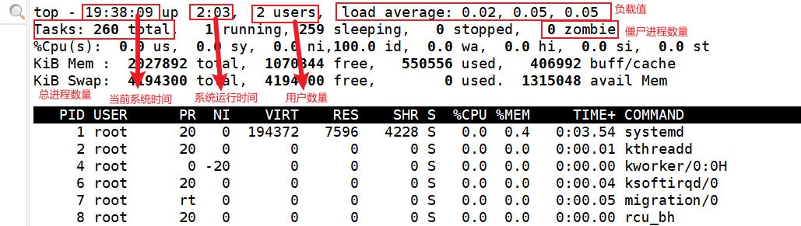


> 交互操作说明

- P  以CPU使用率排序, 默认为此项
- M  以内存使用率排序
- N  以PID排序
- Q  退出top监控


> 应用实例

1. 监视特定用户, 比如我们监控 tom 用户
   top：输入此命令，按回车键，查看执行的进程。
   u：然后输入“u”回车，再输入用户名，即可,
2. 终止指定的进程, 比如我们要结束 tom 登录
   top：输入此命令，按回车键，查看执行的进程。
   k：然后输入“k”回车，再输入要结束的进程 ID 号
3. 指定系统状态更新的时间(每隔 10 秒自动更新), 默认是 3 秒
   `top -d 10`

### 监控网络状态

**查看系统网络情况使用 `netstat [选项]`命令**

**可用选项以及说明**

- `-an` 按一定顺序排列输出
- `-p`   显示哪个进程在调用

> 应用实例

请查看服务名为 sshd 的服务的信息  `netstat -anp | grep sshd`

netstat的字段说明

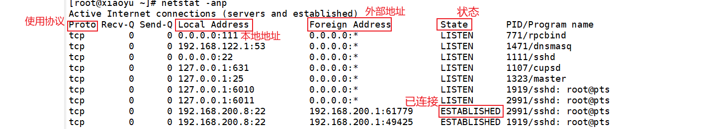

**本地地址和外部地址的联系**

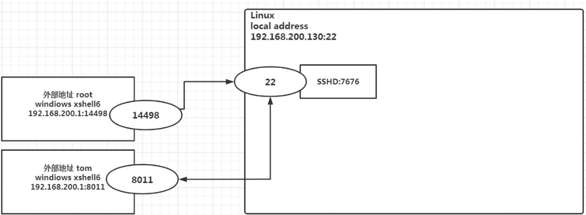

## 十五、RPM和YUM

###  rpm 包的管理

> 介绍

**rpm 是用于互联网下载包的打包及安装工具**，它包含在某些 Linux 分发版中。它**生成具有.RPM 扩展名的文件**。**RPM是 RedHat Package Manager（RedHat 软件包管理工具）**的缩写，类似 windows 的 setup.exe，这一文件格式名称虽然打上了 RedHat 的标志，但理念是通用的

Linux 的分发版本都有采用（suse,redhat, centos 等等），可以算是公认的行业标准了


> rpm 包的简单查询指令

查询已安装的 rpm 列表 `rpm –qa|grep xx`
举例： 看看当前系统，是否安装了 firefox    `rpm -qa | grep firefox`

> rpm 包名基本格式

一火狐的安装包为例:    **firefox-60.2.2-1.el7.centos.x86_64**

1. 名称:firefox
2. 版本号：60.2.2-1
3. 适用操作系统: el7.centos.x86_64   表示 centos7.x 的 64 位系统
   如果是 i686、i386 表示 32 位系统，noarch 表示通用


> rpm 包的其它查询指令

1. 查询所安装的所有 rpm 软件包: `rpm -qa`  `rpm -qa | grep X` 
2. 查询软件包是否安装:  `rpm -q 软件包名` 
   案例：`rpm -q firefox`
3. 查询软件包信息: `rpm -qi 软件包名`
   案例: `rpm -qi firefox`
4. 查询软件包中的文件   `rpm -ql 软件包名` 
   比如： rpm -ql firefox
5. 查询文件所属的软件包:  `rpm -qf 文件全路径名` 
   案例:  `rpm -qf /etc/passwd`     `rpm -qf /root/insta`


> 卸载 rpm 包

基本语法:  `rpm -e RPM包的名称`

案例: 删除 firefox 软件包   `rpm -e firefox`

使用细节: 

1. 如果其它软件包依赖于您要卸载的软件包，卸载时则会产生错误信息
2. 如果还需要删除,  可以增加参数 `--nodeps` ,就可以强制删除，但是一般不推荐这样做，因为依
   赖于该软件包的程序可能无法运行    `rpm -e --nodeps firefox` 

> 安装 rpm 包

基本语法: `rpm -ivh RPM包全路径名称`

参数说明: 

- i=install 安装
- v=verbose 提示
- h=hash 进度条

### YUM

**yum 是一个 Shell 前端软件包管理器**。基于 RPM 包管理，能够从指定的服务器自动
下载 RPM 包并且安装，可**以自动处理依赖性关系，并且一次安装所有依赖的软件包**

> yum基本命令

1. 查询yum服务器是否有需要安装的软件`yum list|grep xx 软件列表`
2. 安装指定的软件  `yum install xxx`

案例：请使用 yum 的方式来安装 firefox

1. `rpm -e firefox`
2. `yum list | grep firefox`
3. `yum install firefox`

## 十六、搭建JavaEE环境

### 安装配置JDK1.8

1. 将JDK安装包通过XFTP上传到LInux服务器

2. 解压安装包  `tar -zxvf jdk-8u261-linux-x64.tar.gz`

3. 创建JDK安装路径  `mkdir /usr/local/java`

4. 将解压的文件夹移动到 刚创建的安装路径  

   `mv /opt/jdk1.8.0_261 /usr/local/java`

5. 配置环境变量到配置文件 `vim /etc/profile`

   在配置文件加入以下配置: 

   - `export  JAVA_HOME=/usr/local/java/jdk1.8.0_261`
   - `export PATH=$JAVA_HOME/bin:$PATH`

    让新的环境变量生效  `source /etc/profile` 

### Tomcat环境搭建

1. 上传安装文件，并解压缩到/opt/tomcat

2. 进入到解压目录/bin  启动tomcat   `./startup.sh`

3. 开发linux8080端口, 在windows 浏览器上测试

   

### MySQL环境搭建

1.  新建文件夹/opt/mysql，并cd进去

2. 下载mysql安装包

   `wget http://dev.mysql.com/get/mysql-5.7.26-1.el7.x86_64.rpm-bundle.tar`，

3.  运行`tar -xvf mysql-5.7.26-1.el7.x86_64.rpm-bundle.tar` 

4.  **注意：centos7.6自带的类mysql数据库是mariadb，会跟mysql冲突，要先删除。**

    运行`rpm -qa|grep mari`，查询mariadb相关安装包

    **卸载与mysql冲突的mariadb:** 

    - `rpm -e --nodeps mariadb-libs`，

    - `rpm -e --nodeps marisa` 

5.  然后开始真正安装mysql，依次运行以下几条 

    `rpm -ivh mysql-community-common-5.7.26-1.el7.x86_64.rpm`

    `rpm -ivh mysql-community-libs-5.7.26-1.el7.x86_64.rpm`

    `rpm -ivh mysql-community-client-5.7.26-1.el7.x86_64.rpm`

    `rpm -ivh mysql-community-server-5.7.26-1.el7.x86_64.rpm`

6. 运行`systemctl start mysqld.service`，启动mysql服务

7.  然后开始设置root用户密码Mysql自动给root用户设置随机密码，

    运行`grep "password" /var/log/mysqld.log`可看到当前密码

    

8. 运行`mysql -u root -p`，用root用户登录，提示输入密码可用上述的，可以成功登陆进入mysql命令行

9. 设置root密码，对于个人开发环境，如果要设比较简单的密码（**生产环境服务器要设复杂密码**）

   将密码策略设置为0(简单)   `set global validate_password_policy=0;` 

   设置自己的mysql密码   `set password for 'root'@'localhost' =password('123456');`

   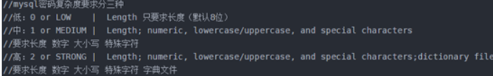

10. 运行`flush privileges;`   使密码设置生效

**PS: linux虚拟机的mysql密码为:  12345678**


## 十七、Centos8.1安装使用


## 十八、日志管理

### 基本介绍

1. **日志文件是重要的系统信息文件**，其中记录了许多重要的系统事件，包括用户的**登录信息、系统的启动信息、系统的安全信息、邮件相关信息、各种服务相关信息**等。
2. 日志对于安全来说也很重要，它记录了系统每天发生的各种事情，通过日志来检查错误发生的原因，或者受到攻击时攻击者留下的痕迹。
3. 可以这样理解 **日志是用来记录重大事件的工具**

> 日志的保存目录

`/var/log/` 目录就是系统日志文件的保存位置

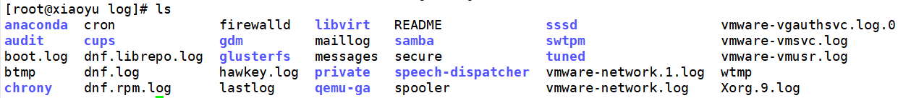

> 系统常用的日志

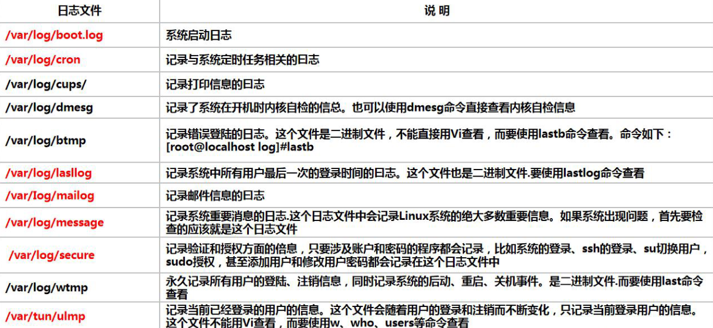

> 应用案例

使用 root 用户通过 xshell6 登陆, 第一次使用错误的密码，第二次使用正确的密码登录成功看看在日志文件`/var/log/secure` 里有没有记录相关信息

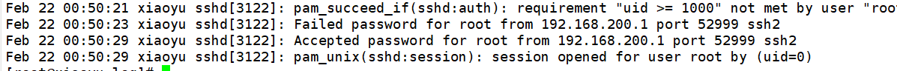

### 日志管理服务

CentOS7.6 日志服务是 `rsyslogd` ， CentOS6.x 日志服务是 syslogd 。rsyslogd 功能更强大。rsyslogd 的使用、日志文件的格式，和 syslogd 服务兼容的。原理示意图如下

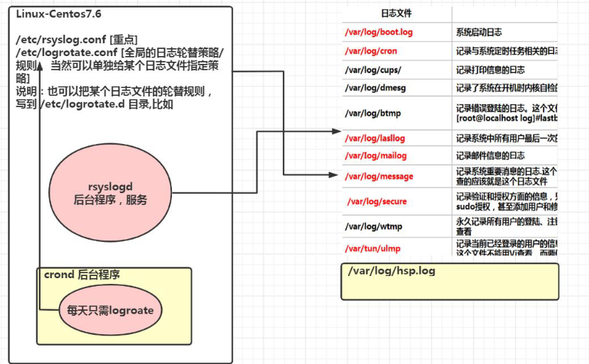


- 查询 Linux 中的 rsyslogd 服务是否启动
  `ps aux | grep "rsyslog" | grep -v "grep"`

- 查询 rsyslogd 服务的自启动状态
  `systemctl list-unit-files | grep rsyslog`

  

### 日志管理文件

- 配置文件：`/etc/rsyslog.conf`

编辑文件时的格式为：  `*.*`    `存放日志文件的目录`

- 第一个 `*` 代表**日志类型**
- 第二个 `*` 代表**日志级别**

> 日志类型的划分: 

1. auth     ## pam 产生的日志
2. authpriv   ## ssh、ftp 等登录信息的验证信息
3. corn   ## 时间任务相关
4. kern   ## 内核
5. lpr   ## 打印
6. mail   ## 邮件
7. mark(syslog)-rsyslog    ## 服务内部的信息，时间标识
8. news    ## 新闻组
9. user    ## 用户程序产生的相关信息
10. uucp     ## unix to nuix copy 主机之间相关的通信
11. local 1-7    ## 自定义的日志设备

> 日志级别分为：

1. debug     ## 有调试信息的，日志通信最多
2. info    ## 一般信息日志，最常用
3. notice    ## 最具有重要性的普通条件的信息
4. warning    ## 警告级别
5. err     ## 错误级别，阻止某个功能或者模块不能正常工作的信息
6. crit     ## 严重级别，阻止整个系统或者整个软件不能正常工作的信息
7. alert     ## 需要立刻修改的信息
8. emerg     ## 内核崩溃等重要信息
9. none    ## 什么都不记录

**注意：从上到下，级别从低到高，记录信息越来越少**


> 日志信息字段说明

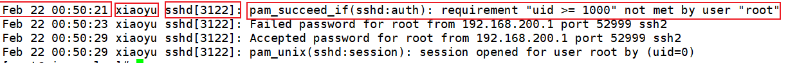

从左到右依次表示:

1. 事件产生的时间
2. 产生事件的服务器的主机名
3. 产生事件的服务名或程序名
4. 事件的具体信息

> 日志管理服务应用实例

在`/etc/rsyslog.conf` 中添加一个日志文件`/var/log/xiaoyu.log`,当有事件发送时(比如 sshd 服务相关事件)，该文件会接收到信息并保存. 重启系统看看是否有日志保存

### 日志轮替

日志轮替就是把旧的**日志文件移动并改名，同时建立新的空日志文件，当旧日志文件超出保存的范围之后，就会进行删除**


> 日志轮替文件命名

centos7 使用 `logrotate` 进行日志轮替管理，要想改变日志轮替文件名字，通过 /etc/logrotate.conf 配置文件中“dateext”参数

1. 如果**配置文件中有“dateext”参数，那么日志会用日期来作为日志文件的后缀**，例如 “secure-20201010”。这样日志文件名不会重叠，也就不需要日志文件的改名， 只需要指定保存日志个数，删除多余的日志文件即可。
2. 如果配置文件中**没有“dateext”参数，日志文件就需要进行改名了。当第一次进行日志轮替时，当前的“secure”日志会自动改名为“secure.1”**，然后新建“secure”日志， 用来保存新的日志。当第二次进行日志轮替时，“secure.1”会自动改名为“secure.2”， 当前的“secure”日志会自动改名为“secure.1”，然后也会新建“secure”日志，用来保存新的日志，以此类推。


> logrotate 日志轮替配置文件

`/etc/logrotate.conf` **为 logrotate 的全局配置文件**

配置文件信息解读: 

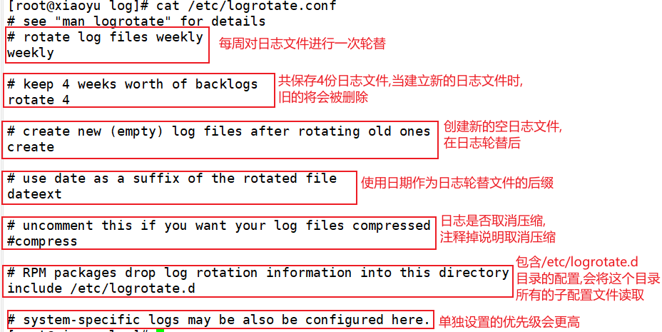

**日志轮替配置文件参数说明**

1. `daily` 日志的轮替周期是每天

   `weekly` 日志的轮替周期是每周

   `monthly` 日志的轮替周期是每月

2. `rotate 数字`   保留的日志文件的个数。0 指没有备份

3. `compress` 日志轮替时，旧的日志进行压缩

4. `create mode owner group` 建立新日志，同时指定新日志的权限与所有者和所属组。

5. `mail address` 当日志轮替时，输出内容通过邮件发送到指定的邮件地址。

6. `missingok` 如果日志不存在，则忽略该日志的警告信息

7. `notifempty` 如果日志为空文件，则不进行日志轮替

8. `minsize 大小` 日志轮替的最小值。也就是日志一定要达到这个最小值才会轮替，否则就算时间达到也不轮替

9. `size 大小` 日志只有大于指定大小才进行日志轮替，而不是按照时间轮替。

10. `dateext` 使用日期作为日志轮替文件的后缀。

11. `sharedscripts` 在此关键字之后的脚本只执行一次。

12. `prerotate/endscript`  在日志轮替之前执行脚本命令。

13. `postrotate/endscript` 在日志轮替之后执行脚本命令。


> 为日志指定**特定的日志轮替规则**

1. 方式一:   **直接在`/etc/logrotate.conf` 配置文件中写入该日志的轮替策略**
2. **方式二:** 在`/etc/logrotate.d/`目录中新建立该日志的轮替文件，在该轮替文件中写入正确的轮替策略，因为**该目录中的文件都会被“include”到主配置文件(/etc/logrotate.conf)中**，所以也可以把日志加入轮替

推荐使用方式二，因为系统中需要轮替的日志非常多，**如果全都直接写 入/etc/logrotate.conf 配置文件，那么这个文件的可管理性就会非常差，不利于此文件的维护**。


> 日志轮替的机制

日志轮替之所以可以在指定的时间备份日志，是**依赖系统定时任务**。在 `/etc/cron.daily/`目录，就会发现这个目录中是有 **logrotate 文件(可执行)**，logrotate 通过这个文件依赖定时任务执行的

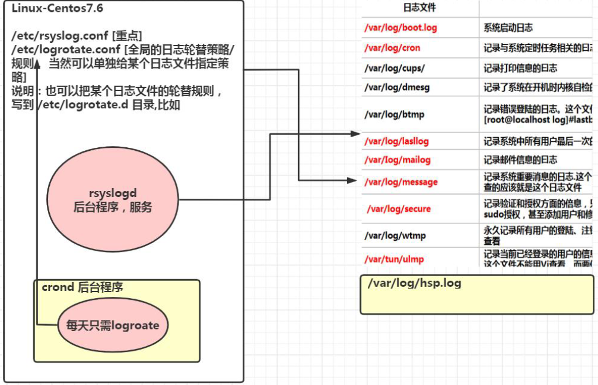

### 内存日志

> 内存日志的查看

1. 查看全部的内存日志 `journalctl` 
2. 查看最新 3 条: `journalctl -n 3`   
3. 查看起始时间到结束时间的日志可加日期: `journalctl --since 19:00 --until 19:10:10` 
4. 查看报错日志 `journalctl -p err` 
5. 日志详细内容 `journalctl -o verbose` 
6. 查看包含这些参数的日志（在详细日志查看）: `journalctl _PID=1245 _COMM=sshd`  
   或者 `journalctl | grep sshd`
7. 注意: **journalctl 查看的是内存日志, 重启系统会清空所有内存日志**

演示案例:
使用 `journalctl | grep sshd` 来看看用户登录清空, 重启系统，再次查询，看看日志有什么变化没有


## 十九、定制自己的Linux系统

### Linux系统启动流程

1. 首先 Linux 要通过自检，检查硬件设备有没有故障
2. 如果有多块启动盘的话，需要在 BIOS 中选择启动磁盘
3. 启动 MBR 中的 bootloader 引导程序
4. 加载内核文件
5. 执行所有进程的父进程、老祖宗 systemd
6. 欢迎界面在 Linux 的启动流程中，加载内核文件时关键文件：
   - kernel 文件: vmlinuz-3.10.0-957.el7.x86_64
   - initrd 文件: initramfs-3.10.0-957.el7.x86_64.img


### 制作思路分析

1. 在现有的 Linux 系统(centos7.6)上加一块硬盘/dev/sdb，在硬盘上分两个分区，一个是/boot，一个是/，并将其格式化。
   需要明确的是，现在加的这个硬盘在现有的 Linux 系统中是/dev/sdb，但是，当我们把东西全部设置好时，要把这个硬盘拔除，放在新系统上，此时，就是/dev/sda
2. 在/dev/sdb 硬盘上，将其打造成独立的 Linux 系统，里面的所有文件是需要拷贝进去的
3. 作为能独立运行的 Linux 系统，内核是一定不能少，要**把内核文件和 initramfs 文件也一起拷到/`dev/sdb` 上**
4. 以上步骤完成，我们的自制 Linux 就完成, 创建一个新的 linux 虚拟机，将其硬盘指向我们创建的硬盘，启动即可

### 制作过程

1. 使用VMware添加一块新的硬盘, 注意: 

   1. **选择SCSI类型**
   2. **选择将虚拟磁盘存储为单个文件**
   3. 将文件名特殊命名

2. 将新添加的硬盘进行分区, **将sdb分为两个区,分别为500M 和 19.5G **

   `fdisk /dev/sdb`

   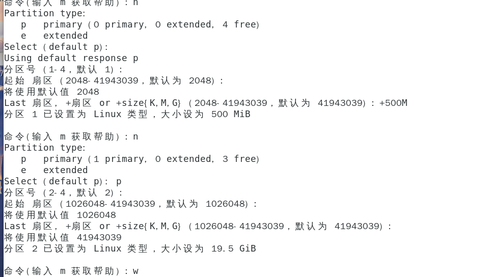

3. 对`/dev/sdb`的分区进行格式化

   1. `mkfs.ext4 /dev/sdb1`
   2. `mkfs.ext4 /dev/sdb2`

4. 创建目录，并将分区挂载到目录上

   1. 创建目录`mkdir -p /mnt/boot /mnt/sysroot`
   2. 将sdb的分区1挂载到/mnt/boot目录 `mount /dev/sdb1 /mnt/boot`
   3. 将sdb的分区2挂载到/mnt/sysroot目录 `mount /dev/sdb2 /mnt/sysroot/`

5. 安装grub, 内核文件拷贝至目标磁盘

   1. `grub2-install --root-directory=/mnt /dev/sdb`
   2. 查看grub是否安装完成:  `hexdump -C -n 512 /dev/sdb`
   3. `cp -rf /boot/* /mnt/boot/`

6. 修改 `grub2/grub.cfg` 文件

   1. 使用 `lsblk -f`命令查看分区的UUID

   2. 将下图的**红色部分用sdb1 的UUID替换, 蓝色部分用sdb2的UUID替换, 并添加紫色部分**(设定一下init，告诉内核不要再去找这个程序了)

      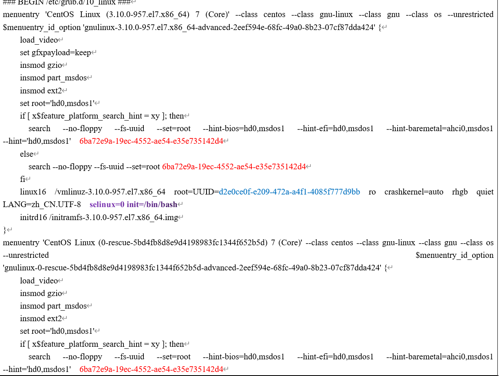

      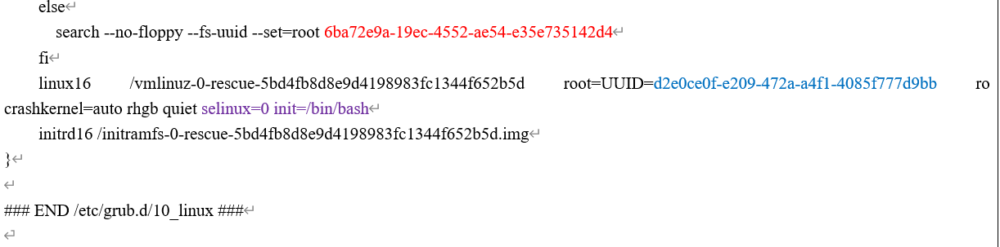

7. 创建目标主机根文件系统

   `mkdir -pv /mnt/sysroot/`

   `{etc/rc.d,usr,var,proc,sys,dev,lib,lib64,bin,sbin,boot,srv,mnt,media,home,root}`

8.  拷贝需要的bash(也可以拷贝你需要的指令)和库文件给新的系统使用

    `cp /lib64/*.* /mnt/sysroot/lib64/` 

    `cp /bin/bash /mnt/sysroot/bin/`

9. 创建一个新的虚拟机，然后将默认分配的硬盘移除掉，指向我们刚刚创建的磁盘即可

10. 这时，启动min系统发现很多指令都不能使用，比如 ls , reboot 等，可以将需要的指令拷贝到对应的目录即可

    1. **重新进入到原来的 linux系统拷贝相应的指令**
    2. 先将sdb2分区挂载`mount /dev/sdb2 /mnt/sysroot/`
    3. 拷贝reboot命令 `cp /sbin/reboot /mnt/sysroot/sbin/`
    4. 拷贝ls命令 `cp /bin/ls /mnt/sysroot/bin/`

11. 这是在启动新的min系统,  就可以使用ls, reboot命令了


## 二十、Linux源码解读&内核升级


## 二十一、备份与恢复

### 基本介绍

实体机无法做快照，如果系统出现异常或者数据损坏，后果严重， 要重做系统，还会造成数据丢失。所以我们可以使用备份和恢复技术
linux 的备份和恢复很简单 ， 有以下两种方式: 

1. 把需要的文件(或者分区)用 TAR 打包就行，下次需要恢复的时候，再解压开覆盖即可
2. **使用 dump 和 restore 命令**


> 安装dump 和 restore

如果 linux 上没有 dump 和 restore 指令，需要先按照

- `yum -y install dump`
- `yum -y install restore`

### 使用dump完成备份

dump 支持分卷和**增量备份**（**增量备份是指备份上次备份后 修改/增加过的文件，也称差异备份**）

> dump 语法说明


语法: `dump [ -cu] [-123456789] [ -f <备份后文件名>] [-T <日期>] [ 目录或文件系统]`
示需要备份的文件及其最后一次备份的层级，时间 ，日期 `dump -W`  

参数说明: 

1. `-c` ： 创建新的归档文件，并将由一个或多个文件参数所指定的内容写入归档文件的开头。
2. `-0123456789`： 备份的层级**。0 为最完整备份，会备份所有文件**。若指定 0 以上的层级，则备份至上一次备份以来修改或新增的文件, 到 9 后，可以再次轮替.
3. `-f <备份后文件名>`： 指定备份后文件名
4. `-j` : 调用 bzlib 库压缩备份文件，也就是将备份后的文件压缩成 bz2 格式，让文件更小
5. `-T` <日期>： 指定开始备份的时间与日期
6. `-u` ： 备份完毕后，在`/etc/dumpdares` 中记录备份的文件系统，层级，日期与时间等。
7. `-t` ： 指定文件名，若该文件已存在备份文件中，则列出名称
8. `-W` ：显示需要备份的文件及其最后一次备份的层级，时间 ，日期。
9. `-w` ：与-W 类似，但仅显示需要备份的文件。

**通过 dump 命令在配合 crontab 可以实现无人值守备份**

> 应用案例

1. 将/boot 分区所有内容备份到/opt/boot.bak0.bz2 文件中，备份层级为“0”

   `dump -0uj -f /opt/boot.bak0.bz2 /boot`

2. 在/boot 目录下增加新文件，备份层级为“1”(只备份上次使用层次“0”备份后发生过改变的数据), 注意比较看看这次生成的备份文件 boot1.bak 有多大
   `dump -1uj -f /opt/boot.bak1.bz2 /boot`

3. 查看备份时间文件
   `cat /etc/tc/dumpdates`


> dump备份注意事项

1. 我们在备份分区时，是可以支持增量备份的
2. 如果**备份文件或者目录，不再支持增量备份, 即只能使用 0 级别**
   
   

### 使用 restore 完成恢复

**restore 命令用来恢复已备份的文件**，可以从 dump 生成的备份文件中恢复原文件

> restore基本语法

`restore [模式选项] [选项]`

模式说明: 

- `-C` ：使用对比模式，将备份的文件与已存在的文件相互对比。
- `-i`：使用交互模式，在进行还原操作时，restors 指令将依序询问用户
- `-r`：进行还原模式
- `-t` : 查看模式，看备份文件有哪些文件

选项说明: 

- `-f <备份设备>`：从指定的文件中读取备份数据，进行还原操作

> 应用案例

1. restore 命令比较模式，比较备份文件和原文件的区别

   `mv /boot/hello.java /boot/hello100.java`
   `restore -C -f boot.bak1.bz2` 注意和 最新的文件比较

   `mv /boot/hello100.java /boot/hello.java`
   `restore -C -f boot.bak1`

2. restore 命令查看模式，看备份文件有哪些数据/文件

   `restore -t -f boot.bak0.bz2`

3. restore 命令还原模式, 注意细节： 如果你有增量备份，需要把增量备份文件也进行恢复， 有几个增量备份文件，就要恢复几个，按顺序来恢复即可

   `mkdir /opt/boottmp`
   `cd /opt/boottmp`
   `restore -r -f /opt/boot.bak0.bz2` 	恢复到第 1 次完全备份状态
   `restore -r -f /opt/boot.bak1.bz2` 	恢复到第 2 次增量备份状态

4. estore 命令恢复备份的文件，或者整个目录的文件
   基本语法： restore -r -f 备份好的文件

   `mkdir etctmp`
    `cd etctmp/`
    `restore -r -f /opt/etc.bak0.`\# 


## 二十二、Linux可视化管理


### Webmin

**Webmin 是功能强大的基于 Web 的 Unix/linux 系统管理工具**。管理员**通过浏览器访问 Webmin 的各种管理功能并完成相应的管理操作**。除了各版本的 linux 以外还可用于：AIX、HPUX、Solaris、Unixware、Irix 和 FreeBSD 等系统

> webmin安装和配置

1. 下载地址 : http://download.webmin.com/download/

2. 安装webmin:  切换到下载包的目录下, 执行命令\

   `rpm -ivh webmin-1.700-1.noarch.rpm`

3. 重置webmin的密码 `/usr/libexec/webmin/changepass.pl /etc/webmin root 123456`

   注意: r**oot 是 webmin 的用户名，不是 OS 的 , 这里就是把 webmin 的 root 用户密码改成了 123456**

4. 修改 webmin 服务的端口号（默认是 10000 出于安全目的）
   在`vim /etc/webmin/miniserv.conf` 配置文件修改端口

5. 将 port=10000 修改为其他端口号，如**port=7777**

6. webmin的启动和停止
   重启  `/etc/webmin/restart` 
   启动  `/etc/webmin/start` 
   停止 `/etc/webmin/stop` 
   
7. 在linux系统中开放修改的端口

   - 配置防火墙开放 7777 端口

      `firewall-cmd --zone=public --add-port=7777/tcp --permanent` 

   - 更新防火墙配置 `firewall-cmd --reload `

   - 查看已经开放的端口号 `firewall-cmd --zone=public --list-ports` 

8. 登录 webmin
   http://ip:7777 可以访问了
   **账号: root  密码: 123456**

**可以在webmin -- Configtration 中的Language中将语言切换修改为中文**

### 宝塔

**bt 宝塔 Linux 面板是提升运维效率的服务器管理软件**，支持一键 LAMP/LNMP/集群/监控/网站/FTP/数据库/JAVA 等多项服务器管理功能

> 宝塔的安装和配置
>

1. 安装 : 执行下面的命令即可

    `yum install -y wget && wget -O install.sh http://download.bt.cn/install/install_6.0.sh && sh install.sh`

2. 安装成功后控制台会显示登录地址，账户密码，复制浏览器打开登录

   **如果忘记账号密码可以使用命令 `bt default`来查看**

3. 使用介绍: 

    **可以登录终端, 配置，快捷安装运行环境和系统工具, 添加计划任务脚本**


## 二十三、面试题


