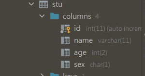
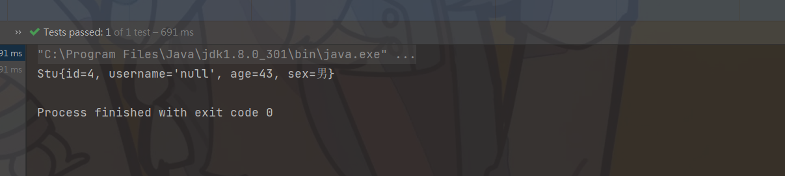

## 一、什么是Mybatis?

### 基本介绍


MyBatis 是一款优秀的**持久层框架**，它支持自定义 SQL、存储过程以及高级映射。MyBatis  免除了几乎所有的 JDBC 代码以及设置参数和获取结果集的工作。MyBatis可以通过简单的 XML 或注解来配置和映射原始类型、接口和 Java POJO（Plain Old Java Objects，普通老式 Java 对象）为数据库中的记录。

`Mybatis官方文档`: https://mybatis.org/mybatis-3/zh/index.html

## ⭐二、Mybatis快速开始

#### 一:  环境搭建

**导入Mybatis 、Mysql、Junit依赖**

```xml
<dependencies>
        <!-- mysql 驱动-->
        <dependency>
            <groupId>mysql</groupId>
            <artifactId>mysql-connector-java</artifactId>
            <version>5.1.47</version>
        </dependency>
        <!--mybatis -->
        <dependency>
            <groupId>org.mybatis</groupId>
            <artifactId>mybatis</artifactId>
            <version>3.5.2</version>
        </dependency>
        <!-- junit -->
        <dependency>
            <groupId>junit</groupId>
            <artifactId>junit</artifactId>
            <version>4.12</version>
        </dependency>
    </dependencies>
```

注意: 为了解决recourse 文件下资源加载不到的问题, 需要在pom.xml添加如下配置: 

```xml
<build>
    <resources>
        <resource>
            <directory>src/main/resources</directory>
            <includes>
                <include>**/*.properties</include>
                <include>**/*.xml</include>
            </includes>
            <filtering>true</filtering>
        </resource>
        <resource>
            <directory>src/main/java</directory>
            <includes>
                <include>**/*.properties</include>
                <include>**/*.xml</include>
            </includes>
            <filtering>true</filtering>
        </resource>
    </resources>
</build>
```


#### 二: 配置Mybatis核心配置文件

XML 配置文件中包含了对 MyBatis 系统的核心设置，包括获取数据库连接实例的数据源（DataSource）以及决定事务作用域和控制方式的事务管理器（TransactionManager）

文件名一般为: **mybatis-config.xml**

```xml
<?xml version="1.0" encoding="UTF-8" ?>
<!DOCTYPE configuration
        PUBLIC "-//mybatis.org//DTD Config 3.0//EN"
        "http://mybatis.org/dtd/mybatis-3-config.dtd">

<!-- mybatis 核心配置文件-->
<configuration>
    <environments default="development">
        <environment id="development">
            <transactionManager type="JDBC"/>
            <dataSource type="POOLED">
                <property name="driver" value="com.mysql.jdbc.Driver"/>
                <!-- 注意: 在xml中 &需要替换为 &amp; -->
                <property name="url" value="jdbc:mysql://localhost:3306/exercise?useUnicode=true&amp;characterEncoding=UTF-8"/>
                <property name="username" value="root"/>
                <property name="password" value="123456"/>
            </dataSource>
        </environment>
    </environments>

    <!-- 注册mapper 每一个mapper.xml都需要在mybatis核心配置文件中注册!-->
    <mappers>
        <mapper resource="com/xiaoyu/dao/EmpMapper.xml" />
    </mappers>
</configuration>
```

注意:  在xml中 & 需要替换为`&amp;`

#### 三: 编写MybatisUtils工具类

 目的: 获取SqlSession

Sqlsession: **`SqlSession` 提供了在数据库执行 SQL 命令所需的所有方法**

```java
/**
 * @author 小鱼
 * @version 1.0
 * Mybatis的工具类: 获取SqlSession
 */
public class MybatisUtils {
   
    private static SqlSessionFactory sqlSessionFactory;
    
    static {
        try {
            String resource = "mybatis-config.xml";
            //使用类加载器来加载 mybatis核心配置文件
            InputStream inputStream = MybatisUtils.class.getClassLoader().getResourceAsStream(resource);

            // SqlSessionFactoryBuilder 则可以从 XML 配置文件来构建出 SqlSessionFactory 实例。
            sqlSessionFactory = new SqlSessionFactoryBuilder().build(inputStream);
        } catch (Exception e) {
            e.printStackTrace();
        }
    }
    //获取sqlSession
    //SqlSession 提供了在数据库执行 SQL 命令所需的所有方法。
    public static SqlSession getSqlSession() {
        return sqlSessionFactory.openSession();
    }
}
```

#### 四: 定义数据库对应的实体类 

​                        

#### 五: 定义dao接口

```java
public interface StuMapper {

    //查询多行记录
    List<Stu> getStuList();
}
```


#### 六: 接口实现类

```xml
<?xml version="1.0" encoding="UTF-8" ?>
<!DOCTYPE mapper
        PUBLIC "-//mybatis.org//DTD Mapper 3.0//EN"
        "http://mybatis.org/dtd/mybatis-3-mapper.dtd">

<!-- 命名空间: 绑定的mapper接口 -->
<mapper namespace="com.xiaoyu.dao.StuMapper">

    <!--select 查询语句id: 为查询的方法名, resultType 查询返回的类型 -->
    <select id="getStuList" resultType="com.xiaoyu.pojo.Stu">
        select  * from stu
    </select>
</mapper>
```

注意:

 ```一定要在 mybatis-config.xml中去配置,每一个mapper.xml都需要在mybatis核心配置文件中注册!```

#### 七: 使用junit测试结果

```java
public class EmpMapperTest {

    //查询多行记录
    @Test
    public void testQueryAll() {

        SqlSession sqlSession = MybatisUtils.getSqlSession();
        //这里使用了动态代理 去实现了EmpMapper接口
        StuMapper mapper = sqlSession.getMapper(StuMapper.class);
        List<Stu> stuList = mapper.getStuList();

        for (Stu stu : stuList) {
            System.out.println(stu);
        }
        sqlSession.close();
    }
}
```

## 三、使用Mybatis进行对数据库的增删改查

### 定义接口

```java
public interface StuMapper {

    //查询多行记录
    List<Stu> getStuList();

    //查询单行记录
    Stu getStu(int id);

    //更新
    int update(Stu stu);

    //插入
    int insertStu(Stu stu);

    //删除
    int delStu(int id);
}
```
### 使用mapper.xml实现接口

```xml
<?xml version="1.0" encoding="UTF-8" ?>
<!DOCTYPE mapper
        PUBLIC "-//mybatis.org//DTD Mapper 3.0//EN"
        "http://mybatis.org/dtd/mybatis-3-mapper.dtd">

<!-- 命名空间: 绑定的mapper接口 -->
<mapper namespace="com.xiaoyu.dao.StuMapper">

    <!--select 查询语句id: 为查询的方法名, resultType 查询返回的类型 -->
    <select id="getStuList" resultType="com.xiaoyu.pojo.Stu">
        select  * from stu;
    </select>

    <!-- id:接口对应的方法名, parameterType: 参数的类型 -->
    <select id="getStu" resultType="com.xiaoyu.pojo.Stu" parameterType="int" >
        select * from stu where id = #{id}
    </select>

    <!-- 更新语句 -->
    <update id="update" parameterType="com.xiaoyu.pojo.Stu" >
        update stu set age = #{age} where id = #{id}
    </update>

    <!-- 添加数据 -->
    <insert id="insertStu" parameterType="com.xiaoyu.pojo.Stu" >
        insert into stu(id, name, age, sex) values(#{id}, #{name}, #{age}, #{sex})
    </insert>

    <!-- 删除语句 -->
    <delete id="delStu" parameterType="int" >
        delete from stu where id = #{id}
    </delete>
</mapper>
```


### 测试结果

```java
public class EmpMapperTest {

    //查询多行记录
    @Test
    public void testQueryAll() {

        SqlSession sqlSession = MybatisUtils.getSqlSession();
        //这里使用了动态代理 去实现了EmpMapper接口
        StuMapper mapper = sqlSession.getMapper(StuMapper.class);
        List<Stu> stuList = mapper.getStuList();

        for (Stu stu : stuList) {
            System.out.println(stu);
        }
        sqlSession.close();
    }

    //查询单行记录
    @Test
    public void testQuerySingle() {
        SqlSession sqlSession = MybatisUtils.getSqlSession();
        StuMapper mapper = sqlSession.getMapper(StuMapper.class);

        Stu stu = mapper.getStu(1);
        System.out.println(stu);
        sqlSession.close();
    }

    //更新
    @Test
    public void testUpdate() {

        SqlSession sqlSession = MybatisUtils.getSqlSession();
        StuMapper mapper = sqlSession.getMapper(StuMapper.class);

        Stu stu = new Stu();
        stu.setAge(99);
        stu.setId(1);
        int update = mapper.update(stu);

        // 注意: mybatis 默认是开启事务的, 要提交事务 才能保证更新数据成功
        System.out.println(update > 0 ? "执行成功!" : "执行失败");
        sqlSession.commit();
        sqlSession.close();
    }

    //插入
    @Test
    public void testInsert() {

        SqlSession sqlSession = MybatisUtils.getSqlSession();
        StuMapper mapper = sqlSession.getMapper(StuMapper.class);

        int row = mapper.insertStu(new Stu(4, "李华", 33, "男" ));
        System.out.println(row > 0 ? "执行成功!" : "执行失败");
        // 注意: mybatis 默认是开启事务的, 要提交事务 才能保证插入数据成功
        sqlSession.commit();
        sqlSession.close();
    }

    //删除
    @Test
    public void testDel() {

        SqlSession sqlSession = MybatisUtils.getSqlSession();
        StuMapper mapper = sqlSession.getMapper(StuMapper.class);

        int row = mapper.delStu(4);
        sqlSession.commit();
        System.out.println(row > 0 ? "执行成功!" : "失败");
        sqlSession.close();
    }
}
```


### 万能的map

#### 使用map来向数据库中添加数据

优点: 传递的参数不必与数据库中的 字段名相同, 只需在传参时key对应即可

```xml
<!-- 插入语句使用万能的map 传递参数 -->
<insert id="insert" parameterType="map">
    insert into exercise.stu(id, name, age, sex) values (#{stuid}, #{stuname}, #{stuage}, 	  # {stusex})
</insert>
```


```java
@Test
public void insertStu() {

    SqlSession sqlSession = MybatisUtils.getSqlSession();

    StuMapper mapper = sqlSession.getMapper(StuMapper.class);

    Map<String, Object> map = new HashMap<String, Object>();
    map.put("stuid", 5);
    map.put("stuname", "小鱼");
    map.put("stuage", 24);
    map.put("stusex", 'm');

    int insert = mapper.insert(map);

    if (insert > 0) {
        System.out.println("插入成功!");
    }
    sqlSession.commit();
    sqlSession.close();
}
```


#### 使用map来查询

```xml
<select id="query" parameterType="map" resultType="com.xiaoyu.pojo.Stu">
        select * from stu where id = #{value}
</select>
```


```java
@Test
public void query() {

    SqlSession sqlSession = MybatisUtils.getSqlSession();
    StuMapper mapper = sqlSession.getMapper(StuMapper.class);

    HashMap<String, Object> map = new HashMap<String, Object>();
    map.put("value", 2);

    Stu stu = mapper.query(map);
    System.out.println(stu);

    sqlSession.close();
}
```


### 模糊查询的实现

1. 在java代码执行时, 传递通配符 `% %`

   ```java
   @Test
   public void queryLike() {
   
       SqlSession sqlSession = MybatisUtils.getSqlSession();
       StuMapper mapper = sqlSession.getMapper(StuMapper.class);
   
       HashMap<String, Object> map = new HashMap<String, Object>();
       map.put("value", "%李%");
   
       List<Stu> stuList = mapper.queryLike(map);
       for (Stu stu : stuList) {
           System.out.println(stu);
       }
       sqlSession.close();
   }
   ```

   

2. 在SQL语句中使用通配符

   ```sql
   select * from stu where name like "%" # {value} "%"
   ```

   `这种方式可能存在sql注入问题!!!`


## 四、 配置解析

### 1. 核心配置文件

- 一般以mybatis-config.xml 命名
- **MyBatis 的配置文件包含了会深深影响 MyBatis 行为的设置和属性信息**
- config配置
  - properties（属性）
  - settings（设置）
  - typeAliases（类型别名）
  - typeHandlers（类型处理器）
  - objectFactory（对象工厂）
  - plugins（插件）
  - environments（环境配置）
    -  environment（环境变量）                  
      - transactionManager（事务管理器）
      - dataSource（数据源）
  - databaseIdProvider（数据库厂商标识）
  - mappers（映射器）


### 2. 环境配置 (environments)

- MyBatis 可以配置成适应多种环境, **不过要记住：尽管可以配置多个环境，但每个 SqlSessionFactory          实例只能选择一种环境**
- MyBatis  默认的事务管理机制是JDBC, 使用了POOLED (连接池)

配置多个环境

```xml
<environments default="development">
    <environment id="development">
        <transactionManager type="JDBC"/>
        <dataSource type="POOLED">
            <property name="driver" value="${driver}"/>
            <property name="url" value="${url}"/>
            <property name="username" value="${username}"/>
            <property name="password" value="${password}"/>
        </dataSource>
    </environment>

    <!-- 可以有多个环境, 如果想切换环境, 只需要修改默认的环境即可-->
    <environment id="test">
        <transactionManager type="JDBC"/>
        <dataSource type="POOLED">
            <property name="driver" value="${driver}"/>
            <property name="url" value="${url}"/>
            <property name="username" value="${username}"/>
            <property name="password" value="${password}"/>
        </dataSource>
    </environment>
</environments>
```

注意: **如果想切换环境, 只需要修改environments 标签中的default值即可**

### 3. 属性 (properties)

我们可以通过properties属性来引用外部的配置文件

 这些属性可以在外部进行配置，并可以进行动态替换。你既可以在典型的 Java 属性文件中配置这些属性，也可以在 properties 元素的子元素中设置。

编写一个配置文件 【mysql.properties】

```properties
driver=com.mysql.jdbc.Driver
url=jdbc:mysql://localhost:3306/exercise?useUnicode=true&characterEncoding=UTF-8
username=root
password=123456
```

注意: **xml可以规定属性标签的顺序**, 因此properties 标签可能存在顺序的错误!


引入外部配置环境 

```xml
<?xml version="1.0" encoding="UTF-8" ?>
<!DOCTYPE configuration
        PUBLIC "-//mybatis.org//DTD Config 3.0//EN"
        "http://mybatis.org/dtd/mybatis-3-config.dtd">

<!-- mybatis 核心配置文件-->
<configuration>

    <!-- 引入外部的配置文件 可以在下面的环境配置中使用外部的配置参数-->
    <properties resource="mysql.properties" >
        <!--在此处可以通过标签来配置外部的配置文件 如果有重名的属性, 则优先使用外部的配置文件-->
        <property name="username" value="root"/>
        <property name="password" value="1111"/>
    </properties>

    <environments default="development">
        <environment id="development">
            <transactionManager type="JDBC"/>
            <dataSource type="POOLED">
                <property name="driver" value="${driver}"/>
                <property name="url" value="${url}"/>
                <property name="username" value="${username}"/>
                <property name="password" value="${password}"/>
            </dataSource>
        </environment>

    <!-- 注册mapper 每一个mapper.xml都需要在mybatis核心配置文件中注册!-->
    <mappers>
        <mapper resource="com/xiaoyu/dao/StuMapper.xml" />
    </mappers>
</configuration>
```

注意: 

1. 引入外部的配置文件, 可以通过properties 标签来引入
2. 可以通过property标签来配置外部的配置文件 **如果有重名的属性, 则优先使用外部的配置文件!!!**


### ⭐4. 类型别名(typeAliases)

- 类型别名可为 Java 类型设置一个缩写名字
- 意在降低冗余的全限定类名书写

类型别名的两种设置方法

- ```xml
    <!--设置别名-->
      <typeAliases>
          <!--第一种方式-->
        	<typeAlias type="com.xiaoyu.pojo.Stu" alias="student"  /> 
    </typeAliases>
    ```
    
- 也可以指定一个包名，MyBatis 会在包名下面搜索需要的 Java Bean

  扫描实体类的包, 它的默认别名就为这个类的类名(首字母小写User --> user)

  ```xml
    <!--设置别名-->
      <typeAliases>
          <!-- 第二种方式, 导入实体类包, -->
          <package name="com.xiaoyu.pojo"/>
      </typeAliases>
  ```

使用区别

- 在实体类少的时候, 使用第一种.   可以自定义别名, 

- 如果实体类比较多,  建议使用第二种.   也可以在实体类上声明注解来设置别名

  ```java
  @Alias("student")
  public class Stu {}
  ```

  

### 5. 设置（settings）

这是 MyBatis 中极为重要的调整设置，它们会改变 MyBatis 的运行时行为。

|          设置名          | 描述                                                         | 有效值                                                       | 默认值 |
| :----------------------: | ------------------------------------------------------------ | ------------------------------------------------------------ | ------ |
|       cacheEnabled       | 全局性地开启或关闭所有映射器配置文件中已配置的任何缓存。     | true \| false                                                | true   |
| mapUnderscoreToCamelCase | 是否开启驼峰命名自动映射，即从经典数据库列名                A_COLUMN 映射到经典 Java 属性名 aColumn。 | true \| false                                                | False  |
|         logImpl          | 指定 MyBatis 所用日志的具体实现，未指定时将自动查找。        | SLF4J \| LOG4J（3.5.9 起废弃） \| LOG4J2 \| JDK_LOGGING \| COMMONS_LOGGING \| STDOUT_LOGGING \| NO_LOGGING | 未设置 |

一些常用的设置

```xml
<settings>
  <setting name="cacheEnabled" value="true"/>
  <setting name="mapUnderscoreToCamelCase" value="false"/>
  <setting name="logImpl" value="STDOUT_LOGGING"/>
</settings>
```


### ❌6.  其他配置

- typeHandlers（类型处理器）
- objectFactory（对象工厂）
- plugins (插件)
  - mybatis-puls
  - 通用mapper


### 7.  映射器

#### 注册mapper文件的三种方式

方式一：使用相对于类路径的资源引用 **【推荐使用】**

```xml
 <mappers>
        <mapper resource="com/xiaoyu/dao/StuMapper.xml" />
</mappers>
```


方式二:  使用Class文件绑定映射

```xml
<mappers>
    <!-- 使用Class文件绑定映射 -->
    <mapper class="com.xiaoyu.dao.StuMapper" />
</mappers>
```

注意点: 

- 接口和它的Mapper配置文件必须相同!

- 接口和他的Mapper文件必须在同一个包下

  

方式三: 将包内的映射器接口实现全部注册为映射器

```xml
<mappers>
    <!-- 将包内的映射器接口实现全部注册为映射器 -->
    <package name="com.xiaoyu.dao"/>
</mappers>
```

注意点: 

- 接口和它的Mapper配置文件必须相同!

- 接口和他的Mapper文件必须在同一个包下

  

### 8. 生命周期和作用域

不同作用域和生命周期类别是至关重要的，因为错误的使用会导致非常严重的并发问题。


#### SqlSessionFactoryBuilder

- 这个类可以被实例化、使用和丢弃，一旦创建了 SqlSessionFactory，就不再需要它了
- 局部变量


#### SqlSessionFactory

- 简单的说就是: 数据库连接池
- SqlSessionFactory 一旦被创建就应该在应用的运行期间一直存在，**没有任何理由丢弃它或重新创建另一个实例。**
- SqlSessionFactory 的最佳作用域是应用作用域。    
- 使用**单例模式**或者静态单例模式。      


#### SqlSession

- 简单的说就是: 连接到连接池的一个请求!
- 使用完毕后, 需要关闭, 否则会造成资源浪费!
- SqlSession的实例不是线程安全的，因此是不能被共享的，所以它的最佳的作用域是**请求或方法作用域**。


这里的每一个mapper就代表一个业务!

## 五、解决属性名和字段名不一致的问题

### 问题



pojo包中的实体类 中的属性和 数据库表的字段不一致的情况

测试结果出现问题: 实体类与数据库的字段不对应与出现查询结果为空



### resultMap 结果集映射

数据库的字段 id name age sex

实体类中的属性 id username age sex

使用resultMpa进行简单的结果集映射

```xml
<?xml version="1.0" encoding="UTF-8" ?>
<!DOCTYPE mapper
        PUBLIC "-//mybatis.org//DTD Mapper 3.0//EN"
        "http://mybatis.org/dtd/mybatis-3-mapper.dtd">

<!-- 命名空间: 绑定的mapper接口 -->
<mapper namespace="com.xiaoyu.dao.StuMapper">

    <!-- 结果集映射 -->
    <resultMap id="stuMap" type="stu" >
        <!--column 为数据库的字段   property 为实体类中的属性-->
        <result column="id" property="id" />
        <result column="name" property="username" />
        <result column="age" property="age"/>
        <result column="sex" property="sex"/>
    </resultMap>
    
    <!-- resultMap 使用结果集映射  -->
    <select id="getStu" resultMap="stuMap" parameterType="int" >
        select * from stu where id = #{id}
    </select>
</mapper>
```


- `resultMap` 元素是 MyBatis 中最重要最强大的元素
- `ResultMap ` 的设计思想是，对简单的语句做到零配置，对于复杂一点的语句，只需要描述语句之间的关系就行了。
- `ResultMap`  的优秀之处在于 你完全可以不用显式地配置它们。

- **如果这个世界总是这么简单就好了。(复杂映射!)** 


## 六、日志

### 日志工厂

如果一个数据库操作, 出现了异常, 我们需要排除错误, 日志就是最好用的帮手!

曾经我们使用debug sout来排除错误, 现在可以使用日志工厂 

Mybatis支持的日志: 

- SLF4J 
-  LOG4J  【掌握】
- LOG4J2 
- JDK_LOGGING 
- COMMONS_LOGGING 
- **STDOUT_LOGGING  标准日志输出** 【掌握】
-  NO_LOGGING  没有日志             

在Mybatis核心配置文件中, 配置我们的日志!

```xml
<settings>
    <!-- 标准的日志实现-->
    <setting name="logImpl" value="STDOUT_LOGGING" />
</settings>
```


### ⭐LOG4J

使用前应导入LOG4J的jar包

#### 什么是log4j?

- Log4j是Apache的一个开源项目，通过使用Log4j，我们可以控制日志信息输送的目的地是控制台、文件、GUI组件
- 我们也可以控制每一条日志的输出格式
- 通过定义每一条日志信息的级别，我们能够更加细致地控制日志的生成过程
- 通过一个配置文件来灵活地进行配置，而不需要修改应用的代码。

#### log4j.properties

```properties
#将等级为DEBUG的日志信息输出到console和file这两个目的地，console和file的定义在下面的代码
log4j.rootLogger=DEBUG,console,file

#控制台输出的相关设置
log4j.appender.console = org.apache.log4j.ConsoleAppender
log4j.appender.console.Target = System.out
log4j.appender.console.Threshold=DEBUG
log4j.appender.console.layout = org.apache.log4j.PatternLayout
log4j.appender.console.layout.ConversionPattern=[%c]-%m%n

#文件输出的相关设置
log4j.appender.file = org.apache.log4j.RollingFileAppender
log4j.appender.file.File=./log/xiaoyu.log
log4j.appender.file.MaxFileSize=10mb
log4j.appender.file.Threshold=DEBUG
log4j.appender.file.layout=org.apache.log4j.PatternLayout
log4j.appender.file.layout.ConversionPattern=[%p][%d{yy-MM-dd}][%c]%m%n

#日志输出级别
log4j.logger.org.mybatis=DEBUG
log4j.logger.java.sql=DEBUG
log4j.logger.java.sql.Statement=DEBUG
log4j.logger.java.sql.ResultSet=DEBUG
log4j.logger.java.sql.PreparedStatement=DEBUG
```

#### log4j日志实现

```xml
<settings>
    <!--log4j日志实现-->
    <setting name="logImpl" value="LOG4J"/>
</settings>
```

#### log4j的使用

1. 导入包`import org.apache.log4j.Logger;`

2. 日志对象:  参数为使用类的 class对象

   ```java
   ogger logger = Logger.getLogger(EmpMapperTest.class);
   ```

3. 日志级别

   ```java
   logger.info("info: 进入了testLog4j() 方法 ");
   logger.debug("debug: 进入了testLog4j() 方法 ");
   logger.error("error: 进入了testLog4j() 方法 ");
   ```

   

## 七、分页

### 为什么需要分页

- 减少数据的处理量

  


### limit实现分页

**核心为sql语句**

语法: 

```sql
select * from stu limit startIndex, pageSize;
select * from stu limit 0, 4;
```

#### 使用Mybatis实现分页

1. 接口

   ```java
   //分页
   List<Stu> getStuList(Map<String, Object> map);
   ```

   

2. mapper.xml

   ```xml
   <!-- 分页 -->
   <select id="getStuList" resultMap="stuMap" parameterType="map">
       select * from stu limit #{startIndex}, #{pageSize}
   </select>
   ```

   

3. 测试

   ```java
   @Test
   public void testGetStuList() {
   
       SqlSession sqlSession = MybatisUtils.getSqlSession();
       StuMapper mapper = sqlSession.getMapper(StuMapper.class);
   
       HashMap<String, Object> map = new HashMap<>();
       map.put("startIndex", 0);
       map.put("pageSize", 5);
   
       List<Stu> stuList = mapper.getStuList(map);
       for (Stu stu : stuList) {
           System.out.println(stu);
       }
       sqlSession.close();
   }
   ```


### RowBounds实现分页

基于java代码层面实现分页

不推荐使用, 了解或跳过

### 分页插件 PageHelper


## 八、使用注解开发

### 使用注解开发

注解在接口上实现

```java
@Select("select * from stu")
List<Stu> getStu();
```

在核心配置文件中绑定接口

```xml
<mappers>
    <mapper class="com.xiaoyu.dao.StuMapper" />
</mappers>
```

本质: 反射机制实现

底层: 动态代理

### Mybatis详细执行流程


### 通过注解进行增删改查

接口

```java
@Select("select * from stu where id = #{id}")
Stu getStuById(@Param("id") int id);


@Delete("delete from stu where id = #{id}")
int delStu(@Param("id") int id);

@Update("update stu set sex = #{sex} where id = #{id}")
int updateStu(Stu stu);


@Insert("insert into stu(id, name, age, sex) values(#{id}, null, #{age}, #{sex})")
int insetStu(Stu str);
```

绑定接口

```xml
<mappers>
    <mapper class="com.xiaoyu.dao.StuMapper" />
</mappers>
```

测试

#### 关于`@Param()` 注解

- 基本类型的参数或者String, 需要加上`@Param()`
- 引用类型不需要添加
- 如果只有一个基本类型, 可以忽略, 但是建议添加
- 我们在SQL语句中引用的就是`@Param()`中设定的属性名!


## 九、Lombok

### 什么是lombok

- Lombok是一个Java库，能自动插入编辑器并构建工具，简化Java开发。
- 通过添加注解的方式，不需要为类编写getter或eques方法，同时可以自动化日志变量。

### 使用

在idea中下载插件 lombok 图标为红辣椒

在maven中引入依赖

```xml
<!-- lombok-->
<dependency>
    <groupId>org.projectlombok</groupId>
    <artifactId>lombok</artifactId>
    <version>1.18.10</version>
</dependency>
```

#### lombok的常用注解

- `@Data` 注解在类，生成setter/getter、equals、canEqual、hashCode、toString方法，如为final属性，则不会为该属性生成setter方法。
- `@NoArgsConstructor` 注解在类，生成**无参构造器**。
- `@AllArgsConstructor` 注解在类，生成类中所有字段的**有参构造器**。
- `@Setter` 注解在类或字段，注解在类时为所有字段生成setter方法，注解在字段上时只为该字段生成setter方法。
- `@Getter` 使用方法同上，区别在于生成的是getter方法。
- `@ToString` 注解在类，添加toString方法。
- `@EqualsAndHashCode` 注解在类，生成hashCode和equals方法。
- `@RequiredArgsConstructor` 注解在类，为类中需要特殊处理的字段生成构造方法，比如final和被@NonNull注解的字段。
- `@Slf4j `注解在类，生成log变量，严格意义来说是常量。private static final Logger log = LoggerFactory.getLogger(UserController.class);

#### 使用方法

```java
@Data
@AllArgsConstructor
@NoArgsConstructor

public class Stu {
    private int id;
    private String username;
    private int age;
    private Character sex;
}
```


## 十、⭐复杂映射

### 多对一处理

**问题: 查询出所有学生的上课老师**

代码案场为: `mybatis-06-resultmap-senior`

多对一简单的案例:

- 多个学生, 对应一个老师
- 对于学生而言,  **关联**  多个学生,  关联一个老师【多对一】

建立复杂映射案例使用的表

```sql
CREATE TABLE `teacher` (
    `id` INT(10) NOT NULL,
    `name` VARCHAR(30) DEFAULT NULL,
    PRIMARY KEY (`id`)
) ENGINE=INNODB DEFAULT CHARSET=utf8;

INSERT INTO teacher(`id`, `name`) VALUES (1, '秦老师');

CREATE TABLE `student` (
    `id` INT(10) NOT NULL,
    `name` VARCHAR(30) DEFAULT NULL,
    `tid` INT(10) DEFAULT NULL,
    PRIMARY KEY (`id`),
    KEY `fktid` (`tid`),
    CONSTRAINT `fktid` FOREIGN KEY (`tid`) REFERENCES `teacher` (`id`)
) ENGINE=INNODB DEFAULT CHARSET=utf8;
INSERT INTO `student` (`id`, `name`, `tid`) VALUES ('1', '小明', '1');
INSERT INTO `student` (`id`, `name`, `tid`) VALUES ('2', '小红', '1');
INSERT INTO `student` (`id`, `name`, `tid`) VALUES ('3', '小张', '1');
INSERT INTO `student` (`id`, `name`, `tid`) VALUES ('4', '小李', '1');
INSERT INTO `student` (`id`, `name`, `tid`) VALUES ('5', '小王', '1');
```

#### 多对一实体类的处理

```java
@Data
@AllArgsConstructor
@NoArgsConstructor
@Alias("student")
public class Student {

    private int id;
    private String name;
    private Teacher teacher;
}
```

```java
@Data
@AllArgsConstructor
@NoArgsConstructor
@Alias("teacher")
public class Teacher {

    private int id;
    private String name;

}
```


#### 按照查询嵌套处理

 思路:  

1. 查询所有学生的信息
2. 根据查询出来学生的 tid, 寻找对应的老师   **子查询** 
3. 复杂的属性, 我们需要单独处理, `对象 association  集合 collection`

```xml
<resultMap id="StudentAndTeacher2" type="student" >
    <result column="id" property="id" />
    <result column="name" property="name" />
    <association property="teacher" column="tid" javaType="Teacher" select="queryTeacher"  />
</resultMap>

<select id="getStudentList2" resultMap="StudentAndTeacher2" >
    select * from student
</select>

<select id="queryTeacher" resultType="teacher" >
    select * from teacher where id = #{id}
</select>
```


#### 按照结果嵌套处理

```xml
<!-- 按照结果嵌套处理 -->
<resultMap id="StudentAndTeacher" type="student">
    <result column="sid" property="id" />
    <result column="sname" property="name" />

    <association  javaType="Teacher" property="teacher" >
        <result column="tid" property="id"/>
        <result column="tname" property="name" />
    </association>
</resultMap>

<select id="getStudentList" resultMap="StudentAndTeacher"  >
    select
   	 	s.id sid, s.name sname, t.id tid, t.name tname
    from
    	student s
    join
    	teacher t
    on
    	s.tid = t.id
</select>
```


### 一对多处理

代码案例为: `mybatis-07-resultmap-senior`

一对多简单的案例

- 一个老师拥有多个学生
- 对于老师而言,  **集合**,  一个老师, 有很多学生【一对多】

#### 一对多实体类的处理

```java
@Data
@AllArgsConstructor
@NoArgsConstructor
@Alias("teacher")
public class Teacher {

    private int id;
    private String name;
    
    private List<Student> students;

}
```

```java
@Data
@AllArgsConstructor
@NoArgsConstructor
@Alias("student")
public class Student {

    private int id;
    private String name;
    private int tid;
}
```


#### 按照查询嵌套处理

```xml
<resultMap id="TeacherAndStudent2" type="teacher" >
    <result column="id" property="id" />
    <result column="name" property="name" />
    <collection property="students" select="getStudent" 
                javaType="ArrayList" column="id"/>

</resultMap>

<select id="getTeacherList2" resultMap="TeacherAndStudent2" >
    select * from  teacher where id = #{id}
</select>

<select id="getStudent" resultType="student" >
    select * from student;
</select>
```


#### 按照结果嵌套处理

```xml
<!-- ======== 按照结果嵌套处理 ============ -->
<resultMap id="TeacherAndStudent" type="teacher" >
    <result column="tid" property="id"/>
    <result column="tname" property="name"/>
    <!-- 注意: 这里实体类使用的是List集合 因此使用 ofType -->
    <collection property="students" ofType="Student" >
        <result column="sid" property="id" />
        <result column="sname" property="name" />
        <result column="stid" property="tid" />
    </collection>
</resultMap>


<select id="getTeacherList" resultMap="TeacherAndStudent" parameterType="int">
    select
    	t.id tid, t.name tname, s.id sid, s.name sname, s.tid stid
    from
    	teacher t
    join
    	student s
    on
    	t.id = s.tid and t.id = #{id}
</select>
```


### 总结

1. 关联- association 【多对一】
2. 集合- collection【一对多】
3. `javaType`  和  `ofType`
   1. javaType 用来指定实体类中属性的类型
   2. ofType 用来指定映射到List或者集合中的pojo类型,   也就是泛型中的类型!

#### 注意点

- 保证SQL的可读性, 尽量保持通俗易通
- 注意一对多和多对一中, 属性名和字段名的问题
- **如果问题不好排除, 可以使用log4j日志来排除**


## 十一、⭐动态SQL

### 什么是动态SQL

**动态SQL就是根据不同的条件生成不同的SQL语句**


### 搭建环境

建设动态SQL环境所需的表

```sql
CREATE TABLE `blog`(
`id` VARCHAR(50) NOT NULL COMMENT '博客id',
`title` VARCHAR(100) NOT NULL COMMENT '博客标题',
`author` VARCHAR(30) NOT NULL COMMENT '博客作者',
`create_time` DATETIME NOT NULL COMMENT '创建时间',
`views` INT(30) NOT NULL COMMENT '浏览量'
)ENGINE=INNODB DEFAULT CHARSET=utf8;
```


### 动态SQL常用标签

#### IF标签

```xml
<select id="queryBlog" parameterType="map" resultType="blog" >
    select * from blog where 1 = 1
    <if test="title != null">
        and title = #{title}
    </if>
    <if test="author != null">
        and author = #{author}
    </if>
</select>
```


#### where标签

> 作用:  可以智能的添加或去掉 SQL语句中的  and | or

```xml
<!-- where 标签的使用-->
<select id="queryBlog2" parameterType="map" resultType="blog" >
    select * from blog
    <where>
        <if test="title != null">
            and title = #{title}
        </if>
        <if test="author != null">
            and author = #{author}
        </if>
    </where>
</select>
```

#### choose、when、otherwise标签

> 类似样式java的switch case语句

- choose --->  switch
- when  ---> case
- otherwise ---> default

#### set标签

> *set* 元素会动态地在行首插入 SET 关键字，并会删掉额外的逗号

```xml
<update id="updateBlog" parameterType="map" >
    update blog
    <set>
        <if test="title != null"> title = #{title},</if>
        <if test="author != null"> author = #{author},</if>
        <if test="createTime != null"> createTime = #{createTime},</if>
        <if test="views != null"> views = #{views},</if>
    </set>
    where id = #{id}
</update>
```


#### ForEach 标签

foreach 标签说明

- collection  需要遍历的集合
- item  集合中的每个元素
- open  开始拼接的字符
- close  结束时拼接的字符
- separator    分隔符

```java
<select id="queryForEach" parameterType="map" resultType="blog" >
    select * from blog
    <where>
        <foreach collection="ids" item="id" open=" and (" close=")" separator="or" >
       	 	id = #{id}
    	</foreach>
    </where>
</select>
```

拼接完成的sql语句

`select * from blog where 1 = 1 and ( id = 1 or id = 2 or id = 3 or id = 4 )`


#### 小结

> 所谓的动态SQL, 本质还是SQL语句, 只是我们可以在SQL层面, 去执行一个逻辑代码


### SQL片段

有的时候, 我们可能会将一些功能的部分抽取出来, 方便复用

1. 使用sql标签抽取出公共的部分

   ```xml
   <sql id="if-title-author" >
       <if test="title != null">
           and title = #{title}
       </if>
       <if test="author != null">
           and author = #{author}
       </if>
   </sql>
   ```

   

2. 在需要使用的地方使用 `include` 标签即可

   ```xml
   <select id="queryBlog2" parameterType="map" resultType="blog" >
       select * from blog
       <where>
           <include refid="if-title-author" />
       </where>
   </select>
   ```


注意事项: 

- 最好基于单表来定义SQL片段
- SQL片段中不要存在where 标签


## 十二、缓存 [Cache]

### 简介

#### 什么是缓存 [Cache]

- 存在内存中的临时数据
- 将用户经常查询的数据放在缓存(内存)中, 用户查询数据就不用从磁盘上(关系型数据库数据文件) 查询, 从缓存中查询, 从而提高查询效率, **解决了高并发系统的性能问题**


#### 为什么使用缓存

- 减少和数据库的交互次数, 减少系统开销, 提高系统效率


#### 什么样的数据能使用缓存

- 经常查询并且不经常改变的数据


### Mybatis缓存

Mybatis 包含一个非常强大的查询缓存特性, 他可以非常方便地定制和配置缓存. 缓存可以极大的提升查询效率 

Mybatis系统中默认定义了两级缓存: **一级缓存**和**二级缓存**

- 默认情况下, 只有一级缓存开启 ( **SqlSession级别的缓存**, 也成为了本地缓存)
- 二级缓存需要手动开启和配置, 他是基于**namespace 级别的缓存**
- 为了提高拓展性, Mybatis定义了缓存接口Cache.  我们可以通过实现Cache 接口来自定义二级缓存


### 一级缓存

- 一级缓存也叫本地缓存: SqlSession
  - 与数据库同义词回话期间查询到的数据会放在本地缓存中
  - 以后如果需要获取相同的数据, 直接从缓存中拿, 没有必要再去查询数据库

#### 测试

1. 开始日志
2. 测试在一个Session中查询两次相同的记录
3. 查看日志输出

```java
@Test
public void queryStuById(){

    SqlSession sqlSession = MybatisUtils.getSqlSession();
    StuMapper mapper = sqlSession.getMapper(StuMapper.class);

    Stu stu = mapper.queryStu(2);
    System.out.println(stu);
    System.out.println("=========================================================");

    //更新数据时, 缓存会刷新
    //        mapper.update(new Stu(6, "小红", 33, "女"));
    //        sqlSession.clearCache();  //手动刷新缓存

    Stu stu1 = mapper.queryStu(2);
    System.out.println(stu == stu1);

    sqlSession.commit();
    sqlSession.close();
}
```


缓存失效的情况

1. 查询不同的记录

2. 增删改操作, 可能会改变原来的数据, 所以必定会刷新缓存!

   

3. 查询不同的Mapper.xml

4. 手动清理缓存

   ```java
   sqlSession.clearCache();  //手动清理缓存
   ```

   

#### 小结

> 一级缓存默认开启, 只在一次SqlSession中有效, 也就是拿到连接到关闭连接这个区间段

> 一级缓存相当于一个Map

### 二级缓存

- 二级缓存也叫全局缓存, 一级缓存作用域太低, 所以诞生了二级缓存
- 基于namespace 级别的缓存, 一个名称空间, 对应一个二级缓存
- 工作机制
  - 一个回话查询一条数据, 这个数据就会被放在当前回话的一级缓存中
  - 如果当前会话关闭了, 这个回话对应的一级缓存也就没有了; 当回话关闭了, 一级缓存中的数据就会被保存到二级缓存中
  - 新的会话查询信息, 就可以从二级缓存中获取内容
  - 不同的mapper查出的数据会放在自己对应的缓存(map)中

#### 二级缓存的使用

1. 显示的开启全局缓存, 默认的是开启, 显示的开启使可读性强

   ```xml
   <!-- 显示的开启缓存 -->
   <setting name="cacheEnabled" value="true"/>
   ```

   

2. 在要使用二级缓存的mapper.xml文件开启

   ```xml
   <cache/>
   ```

   也可以自定义一些参数

   ```xml
   <cache
   	eviction="FIFO"
       flushInterval="60000"
       size="512"
       readOnly="true"/>
   ```

   

#### 测试

问题: 如果在cache标签中没有定义参数, 则会有如下异常

`Cause: java.io.NotSerializableException: com.xiaoyu.pojo.Stu`

解决方法: 将实体类序列化, 实现`Serializable` 接口

```java
@Test
public void testQuery(){
    SqlSession sqlSession = MybatisUtils.getSqlSession();
    StuMapper mapper = sqlSession.getMapper(StuMapper.class);

    Stu stu = mapper.queryStu(1);
    System.out.println(stu);
    sqlSession.close();

    SqlSession sqlSession2 = MybatisUtils.getSqlSession();
    StuMapper mapper2 = sqlSession2.getMapper(StuMapper.class);
    Stu stu2 = mapper2.queryStu(1);
    System.out.println(stu2);
    
    System.out.println(stu == stu2);
}
```


#### 小结

- 只要开启了二级缓存, 在同一个mapper.xml就下有效
- 所有的数据都会先放在一级缓存中
- 只有当回话提交, 或者关闭时, 才会提交到二级缓存中!


### 缓存原理

