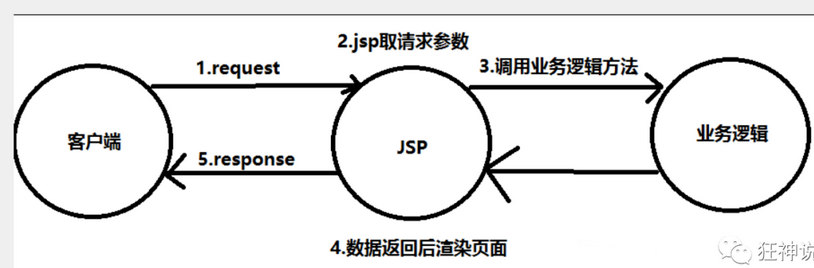
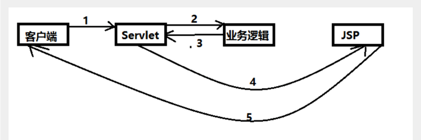
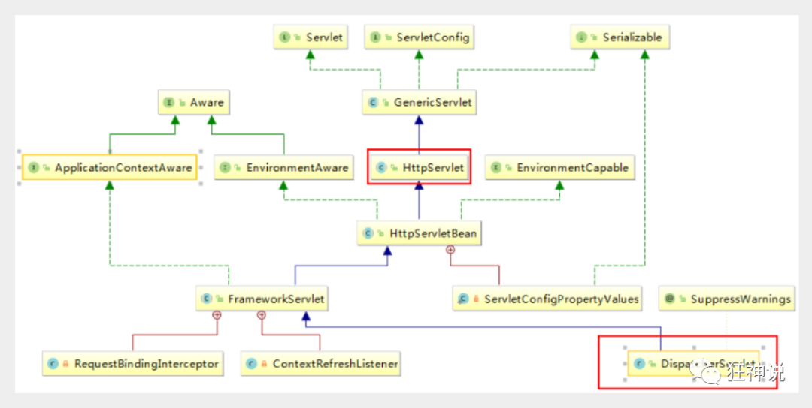

## 一、MVC三层架构

### 1. 什么是MVC

- MVC是**模型(Model)、视图(View)、控制器(Controller)**的简写，是一种软件设计规范。
- 是将业务逻辑、数据、显示分离的方法来组织代码。
- MVC主要作用是**降低了视图与业务逻辑间的双向偶合**。
- MVC不是一种设计模式，**MVC是一种架构模式**。当然不同的MVC存在差异。

**Model（模型）：**数据模型，提供要展示的数据，因此包含数据和行为，可以认为是领域模型或JavaBean组件（包含数据和行为），不过现在一般都分离开来：Value Object（数据Dao） 和 服务层（行为Service）。也就是模型提供了模型数据查询和模型数据的状态更新等功能，包括数据和业务。

**View（视图）：**负责进行模型的展示，一般就是我们见到的用户界面，客户想看到的东西。

**Controller（控制器）：**接收用户请求，委托给模型进行处理（状态改变），处理完毕后把返回的模型数据返回给视图，由视图负责展示。也就是说控制器做了个调度员的工作。

**最典型的MVC就是JSP + servlet + javabean的模式。**


### 2. Model1时代

- 在web早期的开发中，通常采用的都是Model1。
- Model1中，主要分为两层，视图层和模型层。



Model1优点：架构简单，比较适合小型项目开发；

Model1缺点：JSP职责不单一，职责过重，不便于维护；

### 3. Model2时代

Model2把一个项目分成三部分，包括**视图、控制、模型。**



1. 用户发请求
2. Servlet接收请求数据，并调用对应的业务逻辑方法
3. 业务处理完毕，返回更新后的数据给servlet
4. servlet转向到JSP，由JSP来渲染页面
5. 响应给前端更新后的页面

**职责分析：**

**Controller：控制器**

1. 取得表单数据
2. 调用业务逻辑
3. 转向指定的页面

**Model：模型**

1. 业务逻辑
2. 保存数据的状态

**View：视图**

1. 显示页面

Model2这样不仅提高的代码的复用率与项目的扩展性，且大大降低了项目的维护成本。Model 1模式的实现比较简单，适用于快速开发小规模项目，Model1中JSP页面身兼View和Controller两种角色，将控制逻辑和表现逻辑混杂在一起，从而导致代码的重用性非常低，增加了应用的扩展性和维护的难度。Model2消除了Model1的缺点。


### 4. Servlet的回顾

#### 简单的servlet案例

1. 导入项目所需要的依赖

   ```xml
   <dependencies>
       <dependency>
           <groupId>junit</groupId>
           <artifactId>junit</artifactId>
           <version>4.12</version>
       </dependency>
       <dependency>
           <groupId>org.springframework</groupId>
           <artifactId>spring-webmvc</artifactId>
           <version>5.1.9.RELEASE</version>
       </dependency>
       <dependency>
           <groupId>javax.servlet</groupId>
           <artifactId>servlet-api</artifactId>
           <version>2.5</version>
       </dependency>
       <dependency>
           <groupId>javax.servlet.jsp</groupId>
           <artifactId>jsp-api</artifactId>
           <version>2.2</version>
       </dependency>
       <dependency>
           <groupId>javax.servlet</groupId>
           <artifactId>jstl</artifactId>
           <version>1.2</version>
       </dependency>
   </dependencies>
   ```

   

2. 编写一个servlet类来处理用户的请求

   ```java
   public class HelloServlet extends HttpServlet {
   
       @Override
       protected void doGet(HttpServletRequest req, HttpServletResponse resp) throws ServletException, IOException {
   
           //获取参数
           String method = req.getParameter("method");
           if (method.equals("add")) {
               req.getSession().setAttribute("msg", "执行了add方法");
           } else if (method.equals("delete")) {
               req.getSession().setAttribute("msg", "执行了delete方法");
           }
   
           //视图跳转
           req.getRequestDispatcher("WEB-INF/jsp/hello.jsp").forward(req, resp);
       }
   
       @Override
       protected void doPost(HttpServletRequest req, HttpServletResponse resp) throws ServletException, IOException {
           doGet(req, resp);
       }
   }
   ```
   
   

3. 编写hello.jsp  在WEB-INF目录下新建一个jsp的文件夹，新建hello.jsp

   ```jsp
   <%@ page contentType="text/html;charset=UTF-8" language="java" %>
   <html>
   <head>
       <title>Title</title>
   </head>
   <body>
   
       ${msg}
   
   </body>
   </html>
   ```

   

4. 在web.xml中注册servlet

   ```xml
   <?xml version="1.0" encoding="UTF-8"?>
   <web-app xmlns="http://xmlns.jcp.org/xml/ns/javaee"
            xmlns:xsi="http://www.w3.org/2001/XMLSchema-instance"
            xsi:schemaLocation="http://xmlns.jcp.org/xml/ns/javaee http://xmlns.jcp.org/xml/ns/javaee/web-app_4_0.xsd"
            version="4.0">
   
   
       <!-- 注册servlet -->
       <servlet>
           <servlet-name>hello</servlet-name>
           <servlet-class>com.xiaoyu.controller.HelloServlet</servlet-class>
       </servlet>
       <servlet-mapping>
           <servlet-name>hello</servlet-name>
           <url-pattern>/hello</url-pattern>
       </servlet-mapping>
   
   </web-app>
   ```

   

5. 配置Tomcat, 测试

   ```java
   localhost:8080/user?method=add
   localhost:8080/user?method=delete
   ```

   

**说明：**

​	常见的服务器端MVC框架有：Struts、Spring MVC、ASP.NET MVC、Zend Framework、JSF；常见前端MVC框架：vue、angularjs、react、backbone；由MVC演化出了另外一些模式如：MVP、MVVM 等等....


## 二、什么是SpringMVC

### 概述

Spring MVC是Spring Framework的一部分，是基于**Java实现MVC的轻量级Web框架**。

查看官方文档：https://docs.spring.io/spring/docs/5.2.0.RELEASE/spring-framework-reference/web.html#spring-web

**我们为什么要学习SpringMVC呢?**

 Spring MVC的特点：

1. 轻量级，简单易学
2. 高效 , 基于请求响应的MVC框架
3. 与Spring兼容性好，无缝结合
4. 约定优于配置
5. 功能强大：RESTful、数据验证、格式化、本地化、主题等
6. 简洁灵活

Spring的web框架围绕`DispatcherServlet `[ 调度Servlet ] 设计。

DispatcherServlet的作用是将请求分发到不同的处理器。从Spring 2.5开始，使用Java 5或者以上版本的用户可以采用基于注解形式进行开发，十分简洁；

正因为SpringMVC好 , 简单 , 便捷 , 易学 , 天生和Spring无缝集成(使用SpringIoC和Aop) , 使用约定优于配置 . 能够进行简单的junit测试 . 支持Restful风格 .异常处理 , 本地化 , 国际化 , 数据验证 , 类型转换 , 拦截器 等等......所以我们要学习 .

**最重要的一点还是用的人多 , 使用的公司多 .** 

### 中心控制器

​	Spring的web框架围绕`DispatcherServlet`设计。DispatcherServlet的作用是将**请求分发到不同的处理器**。从Spring 2.5开始，使用Java 5或者以上版本的用户可以采用基于注解的controller声明方式。

​	SpringMVC框架像许多其他MVC框架一样, **以请求为驱动** , **围绕一个中心Servlet分派请求及提供其他功能**，**DispatcherServlet是一个实际的Servlet (它继承自HttpServlet 基类)**。



SpringMVC的原理如下图所示：

​	当发起请求时被前置的控制器拦截到请求，根据请求参数生成代理请求，找到请求对应的实际控制器，控制器处理请求，创建数据模型，访问数据库，将模型响应给中心控制器，控制器使用模型与视图渲染视图结果，将结果返回给中心控制器，再将结果返回给请求者。


### ⭐SpringMVC执行原理


图为SpringMVC的一个较完整的流程图，实线表示SpringMVC框架提供的技术，不需要开发者实现，虚线表示需要开发者实现。

**简要分析执行流程**

1. DispatcherServlet表示前端控制器，是整个SpringMVC的控制中心。用户发出请求，DispatcherServlet接收请求并拦截请求。

   我们假设请求的url为 : http://localhost:8080/SpringMVC/hello

   **如上url拆分成三部分：**

   - http://localhost:8080服务器域名

   - SpringMVC部署在服务器上的web站点

   - hello表示控制器

   通过分析，如上url表示为：**请求位于服务器localhost:8080上的SpringMVC站点的hello控制器。**

2. HandlerMapping为处理器映射。DispatcherServlet调用HandlerMapping,  HandlerMapping根据请求url查找Handler。

3. HandlerExecution表示具体的Handler,其主要作用是根据url查找控制器，如上url被查找控制器为：  hello

4. HandlerExecution将解析后的信息传递给DispatcherServlet,如解析控制器映射等。

5. HandlerAdapter表示处理器适配器，其按照特定的规则去执行Handler。

6. Handler让具体的Controller执行。

7. Controller将具体的执行信息返回给HandlerAdapter,如**ModelAndView**

8. HandlerAdapter将视图逻辑名或模型传递给DispatcherServlet。

9. DispatcherServlet调用视图解析器(ViewResolver)来解析HandlerAdapter传递的逻辑视图名。

10. 视图解析器将解析的逻辑视图名传给DispatcherServlet。

11. DispatcherServlet根据视图解析器解析的视图结果，调用具体的视图。

12. 最终视图呈现给用户。


## 三、第一个SpringMVC程序

### 快速入门-- 实现Controller接口完成

1. 配置web.xml , 注册DispatcherServlet

   ```xml
   <?xml version="1.0" encoding="UTF-8"?>
   <web-app xmlns="http://xmlns.jcp.org/xml/ns/javaee"
            xmlns:xsi="http://www.w3.org/2001/XMLSchema-instance"
            xsi:schemaLocation="http://xmlns.jcp.org/xml/ns/javaee
            http://xmlns.jcp.org/xml/ns/javaee/web-app_4_0.xsd"
            version="4.0">
   
       <servlet>
           <servlet-name>springmvc</servlet-name>
           <servlet-class>org.springframework.web.servlet.DispatcherServlet</servlet-class>
           <!-- 关联SpringMVC的配置文件 -->
           <init-param>
               <param-name>contextConfigLocation</param-name>
               <param-value>classpath:springmvc-servlet.xml</param-value>
           </init-param>
       </servlet>
       <servlet-mapping>
           <servlet-name>springmvc</servlet-name>
           <url-pattern>/</url-pattern>
       </servlet-mapping>
   
   </web-app>
   ```

   

2. 配置springmvc-servlet.xml文件 并添加**处理器映射器、处理器适配器 和 视图解析器**

   ```xml
   <?xml version="1.0" encoding="UTF-8"?>
   <beans xmlns="http://www.springframework.org/schema/beans"
          xmlns:xsi="http://www.w3.org/2001/XMLSchema-instance"
          xsi:schemaLocation="http://www.springframework.org/schema/beans
          http://www.springframework.org/schema/beans/spring-beans.xsd">
   
   
       <!-- 处理器映射 -->
       <bean class="org.springframework.web.servlet.handler.BeanNameUrlHandlerMapping"/>
   
   
       <!--  处理器适配器 -->
       <bean class="org.springframework.web.servlet.mvc.SimpleControllerHandlerAdapter"/>
   
   
       <!-- 视图解析器 -->
       <bean id="internalResourceViewResolver" class="org.springframework.web.servlet.view.InternalResourceViewResolver" >
           <!-- 前缀 -->
           <property name="prefix" value="/WEB-INF/jsp/"/>
           <!-- 后缀 -->
           <property name="suffix" value=".jsp"/>
       </bean>
   
       <!-- handler-->
       <bean id="/hello" class="com.xiaoyu.controller.HelloController"/>
   
   
   </beans>
   ```

   

3. 编写 HelloController 控制器, 并在spring配置文件中注册bean

   ```java
   public class HelloController  implements Controller {
       public ModelAndView handleRequest(HttpServletRequest request, HttpServletResponse response) throws Exception {
   
           ModelAndView modelAndView = new ModelAndView();
   
           modelAndView.addObject("msg", "hello, SpringMVC!");
           modelAndView.setViewName("hello");
   
           return  modelAndView;
   
       }
   }
   ```
   
   

4. 编写要跳转的jsp页面

   ```jsp
   
   <%@ page contentType="text/html;charset=UTF-8" language="java" %>
   <html>
   <head>
       <title>Title</title>
   </head>
   <body>
   
     ${msg}
   
   </body>
   </html>
   ```

   

5. 配置Tomcat并测试

**可能遇到的问题：访问出现404，排查步骤：**

1. 查看控制台输出，看一下是不是缺少了什么jar包。
2. 如果jar包存在，显示无法输出，就在IDEA的项目发布中，添加lib依赖！
3. 重启Tomcat 即可解决！


### ⭐使用注解开发完成

1. 配置web.xml, 注册DispatcherServlet

   ```xml
   <?xml version="1.0" encoding="UTF-8"?>
   <web-app xmlns="http://xmlns.jcp.org/xml/ns/javaee"
            xmlns:xsi="http://www.w3.org/2001/XMLSchema-instance"
            xsi:schemaLocation="http://xmlns.jcp.org/xml/ns/javaee http://xmlns.jcp.org/xml/ns/javaee/web-app_4_0.xsd"
            version="4.0">
    
       <!--1.注册servlet-->
       <servlet>
           <servlet-name>SpringMVC</servlet-name>
           <servlet-class>org.springframework.web.servlet.DispatcherServlet</servlet-class>
           <!--通过初始化参数指定SpringMVC配置文件的位置，进行关联-->
           <init-param>
               <param-name>contextConfigLocation</param-name>
               <param-value>classpath:springmvc-servlet.xml</param-value>
           </init-param>
           <!-- 启动顺序，数字越小，启动越早 -->
           <load-on-startup>1</load-on-startup>
       </servlet>
   
       <!--所有请求都会被springmvc拦截 -->
       <servlet-mapping>
           <servlet-name>SpringMVC</servlet-name>
           <url-pattern>/</url-pattern>
       </servlet-mapping>
   
   </web-app>
   ```

   

2. 配置springmvc-servlet文件

   ```xml
   <?xml version="1.0" encoding="UTF-8"?>
   <beans xmlns="http://www.springframework.org/schema/beans"
          xmlns:xsi="http://www.w3.org/2001/XMLSchema-instance"
          xmlns:context="http://www.springframework.org/schema/context"
          xmlns:mvc="http://www.springframework.org/schema/mvc"
          xsi:schemaLocation="http://www.springframework.org/schema/beans
          http://www.springframework.org/schema/beans/spring-beans.xsd
          http://www.springframework.org/schema/context
          https://www.springframework.org/schema/context/spring-context.xsd
          http://www.springframework.org/schema/mvc
          https://www.springframework.org/schema/mvc/spring-mvc.xsd">
   
       <!-- 自动扫描包，让指定包下的注解生效,由IOC容器统一管理 -->
       <context:component-scan base-package="com.xiaoyu.controller"/>
       <!-- 让Spring MVC不处理静态资源 -->
       <mvc:default-servlet-handler />
       <!-- 注册处理器映射器  处理器适配器 -->
       <mvc:annotation-driven/>
       
       <!-- 视图解析器 -->
       <bean class="org.springframework.web.servlet.view.InternalResourceViewResolver"
             id="internalResourceViewResolver">
           <!-- 前缀 -->
           <property name="prefix" value="/WEB-INF/jsp/" />
           <!-- 后缀 -->
           <property name="suffix" value=".jsp" />
       </bean>
   
   </beans>
   ```

   

3. 编写Controller, 并使用注解

   ```java
   @Controller  //在spring容器中注册bean, 声明此类为 控制器
   //声明为 控制器的类中返回值为String 类型的方法, 都会去让视图解析器去解析 视图名
   //@RequestMapping("hi") // 如果类也声明了@RequestMapping 则请求的url 会变为 localhost:8080/项目名/hi/hello
   public class HelloController {
   
       @RequestMapping("/hello")
       public String hello(Model model) {
   
           model.addAttribute("msg", "Hello, SpringMVC!");
           return "hello";  //返回的 "hello" 会被视图解析器处理 为 : /WEB-INF/jsp/hello.jsp
       }
   
   }
   ```

   

4. 配置Tomcat并测试 


### 总结

使用springMVC必须配置的三大件：

**处理器映射器、处理器适配器、视图解析器**

通常，我们只需要**手动配置视图解析器**，而**处理器映射器**和**处理器适配器**只需要开启**注解驱动**即可，而省去了大段的xml配置

#### 控制器Controller

- 控制器复杂提供访问应用程序的行为，通常通过接口定义或注解定义两种方法实现。

- 控制器负责解析用户的请求并将其转换为一个模型。

- 在Spring MVC中一个控制器类可以包含多个方法

- 在Spring MVC中，对于Controller的配置方式有很多种


#### 注解说明

**`@Controller`** 注解说明

- @Controller注解类型用于声明Spring类的实例是一个控制器（在讲IOC时还提到了另外3个注解）；

- Spring可以使用扫描机制来找到应用程序中所有基于注解的控制器类，为了保证Spring能找到你的控制器，需要在配置文件中声明组件扫描。

  ```xml
  <!-- 自动扫描指定的包，下面所有注解类交给IOC容器管理 -->
  <context:component-scan base-package="com.kuang.controller"/>
  ```

  


**`@RequestMapping`**注解说明

- @RequestMapping注解用于映射url到控制器类或一个特定的处理程序方法。可用于类或方法上。用于类上，表示类中的所有响应请求的方法都是以该地址作为父路径。

- 只注解在方法上面:  访问路径 http://localhost:8080 / 项目名 / h1

  ```java
  @Controller
  public class TestController {
     @RequestMapping("/h1")
     public String test(){
         return "test";
    }
  }
  ```

- 注解在类和方法上, 访问路径: http://localhost:8080 / 项目名/ admin /h1 

  ```java
  @Controller
  @RequestMapping("/admin")
  public class TestController {
     @RequestMapping("/h1")
     public String test(){
         return "test";
    }
  }
  ```

  


## 四、RestFul 风格

### 基本介绍

#### 概念

Restful就是一个资源定位及资源操作的风格。不是标准也不是协议，只是一种风格。基于这个风格设计的软件可以更简洁，更有层次，更易于实现缓存等机制。

#### 功能

资源：互联网所有的事物都可以被抽象为资源

资源操作：使用POST、DELETE、PUT、GET，使用不同方法对资源进行操作。

分别对应 添加、 删除、修改、查询。

**传统方式操作资源**  ：通过不同的参数来实现不同的效果！方法单一，post 和 get

​	http://127.0.0.1/item/queryItem.action?id=1 查询,GET

​	http://127.0.0.1/item/saveItem.action 新增,POST

​	http://127.0.0.1/item/updateItem.action 更新,POST

​	http://127.0.0.1/item/deleteItem.action?id=1 删除,GET或POST

**使用RESTful操作资源** ：可以通过不同的请求方式来实现不同的效果！如下：请求地址一样，但是功能可以不同！

​	http://127.0.0.1/item/1 查询,GET

​	http://127.0.0.1/item 新增,POST

​	http://127.0.0.1/item 更新,PUT

​	http://127.0.0.1/item/1 删除,DELETE


### 使用方法

1. 编写类类 RestFulController

   ```java
   @RequestMapping( name = "/add/{a}/{b}", method = RequestMethod.GET)
       //上面的方式等同与 @GetMapping("/add/{a}/{b}")
       public String test(@PathVariable int a, @PathVariable int b, Model model){
   
           int res = a + b;
           model.addAttribute("msg", "结果为" + res);
           return "test";
       }
   
       @PostMapping("/add/{a}/{b}")
       public String test02(Model model, @PathVariable int a, @PathVariable int b){
   
           int res = a + b;
           model.addAttribute("msg", "结果是" + res);
           return "test";
       }
   ```

   **@PathVariable 注解，让方法参数的值对应绑定到一个URI模板变量上。**

2. 编写一个a.jsp文件 测试Post请求

   ```jsp
   <%@ page contentType="text/html;charset=UTF-8" language="java" %>
   <html>
   <head>
       <title>Title</title>
   </head>
   <body>
   
   <form action="/springmvc_04/add/2/3" method="post">
       <input type="submit">
   </form>
   
   </body>
   </html>
   ```

   

3. 启动tomcat测试


路径变量


使用路径变量的好处？

- 使路径变得更加简洁；
- 获得参数更加方便，框架会自动进行类型转换。
- 通过路径变量的类型可以约束访问参数，如果类型不一样，则访问不到对应的请求方法，如这里访问是的路径是/add/1/a，则路径与方法不匹配，而不会是参数转换失败。


### 总结

Spring MVC 的 @RequestMapping 注解能够处理 HTTP 请求的方法, 比如 GET, PUT, POST, DELETE 以及 PATCH。**所有的地址栏请求默认都会是 HTTP GET 类型的**

#### @RequestMapping

@RequestMapping注解的变体: 

- @GetMapping
- @PostMapping
- @PutMapping
- @DeleteMapping
- @PatchMapping

`@RequestMapping( name = "/add/{a}/{b}", method = RequestMethod.GET)`
   方式等同与 `@GetMapping("/add/{a}/{b}")`


## 五、结果跳转方式

### ModelAndView

设置ModelAndView对象 , 根据view的名称 , 和视图解析器跳到指定的页面 .

页面 : `{视图解析器前缀} + viewName +{视图解析器后缀}`

```xml
<!-- 视图解析器 -->
<bean class="org.springframework.web.servlet.view.InternalResourceViewResolver"
      id="internalResourceViewResolver">
    <!-- 前缀 -->
    <property name="prefix" value="/WEB-INF/jsp/" />
    <!-- 后缀 -->
    <property name="suffix" value=".jsp" />
</bean>
```

对应的controller类

```java
public class ControllerTest1 implements Controller {

    public ModelAndView handleRequest(HttpServletRequest httpServletRequest, HttpServletResponse httpServletResponse) throws Exception {
        //返回一个模型视图对象
        ModelAndView mv = new ModelAndView();
        mv.addObject("msg","ControllerTest1");
        mv.setViewName("test");
        return mv;
    }
}
```


### ServletAPI

通过设置ServletAPI , 不需要视图解析器 .

1、通过HttpServletResponse进行输出

2、通过HttpServletResponse实现重定向

3、通过HttpServletResponse实现转发

```java
@Controller
public class ResultGo {

    @RequestMapping("/result/t1")
    public void test1(HttpServletRequest req, HttpServletResponse rsp) throws IOException {
        rsp.getWriter().println("Hello,Spring BY servlet API");
    }

    @RequestMapping("/result/t2")
    public void test2(HttpServletRequest req, HttpServletResponse rsp) throws IOException {
        //重定向
        rsp.sendRedirect("/index.jsp");
    }

    @RequestMapping("/result/t3")
    public void test3(HttpServletRequest req, HttpServletResponse rsp) throws Exception {
        //转发
        req.setAttribute("msg","/result/t3");
        req.getRequestDispatcher("/WEB-INF/jsp/test.jsp").forward(req,rsp);
    }
}
```


### 使用SpringMVC实现转发和重定向

#### 不使用视图解析器

测试前，需要将视图解析器注释掉

```java
@Controller
public class ResultSpringMVC {
    @RequestMapping("/rsm/t1")
    public String test1(){
        //转发
        return "/index.jsp";
    }

    @RequestMapping("/rsm/t2")
    public String test2(){
        //转发二
        return "forward:/index.jsp";
    }

    @RequestMapping("/rsm/t3")
    public String test3(){
        //重定向
        return "redirect:/index.jsp";
    }
}
```


#### 使用视图解析器

重定向 , 不需要视图解析器 , 本质就是重新请求一个新地方 , 所以注意路径问题.

可以重定向到另外一个请求实现 .

```java
/**
 * 使用视图解析器来完成 请求的转发和重定向
 */
@Controller
public class ForwardAndRedirect {

    //SpringMVC 请求默认为 转发
    @RequestMapping("/test")
    public String test(Model model){

        model.addAttribute("msg", "你好!");
        return "test";
    }

    // 重定向
    @RequestMapping("/test001")
    public String test02(Model model){

        return "redirect:/index.jsp";  //重定向 到index.jsp页面
    }
}
```


## 六、数据处理

### 处理提交数据

**1、提交的域名称和处理方法的参数名一致**

提交数据 : http://localhost:8080/springmvc_04/user/t1?name=小鱼

```java
@GetMapping("/t1")
public String test(String name, Model model){

    System.out.println("传送的数据为" + name );
    model.addAttribute("msg", name);

    return "test";
}
```


**2、提交的域名称和处理方法的参数名不一致**

提交数据 :http://localhost:8080/springmvc_04/user/t1?username=小鱼

```java
@GetMapping("/t1")
// 当提交的域名称和处理方法的参数名不一致 可以使用 @RequestParam("username")来解决
public String test(@RequestParam("username") String name, Model model){

    System.out.println("传送的数据为" + name );
    model.addAttribute("msg", name);

    return "test";
}
```


**3、提交的是一个对象**

1. 建立一个 实体类 和 提交的对象 字段类型保持一致

   ```java
   @Data
   @AllArgsConstructor
   @NoArgsConstructor
   public class User {
   
       private int id;
       private String name;
       private int age;
   }
   ```

   

2. 提交数据: http://localhost:8080/springmvc_04/user/t2?id=1&name=小鱼&age=18

3. 后端输出数据: User(id=1, name=小鱼, age=18)

说明：如果使用对象的话，前端传递的参数名和对象的字段名必须一致，否则就是null。

### 数据显示到前端

将数据显示到前端可以使用下面三种方式

- **通过ModelAndView**
- **通过ModelMap**
- **通过Model**

#### 三种方式的区别

就对于新手而言简单来说使用区别就是：

- Model 只有寥寥几个方法只适合用于储存数据，简化了新手对于Model对象的操作和理解；


- ModelMap 继承了 **LinkedMap** ，除了实现了自身的一些方法，同样的继承 LinkedMap 的方法和特性；


- ModelAndView 可以在储存数据的同时，可以进行设置返回的逻辑视图，进行控制展示层的跳转。

当然更多的以后开发考虑的更多的是性能和优化，就不能单单仅限于此的了解。

**请使用80%的时间打好扎实的基础，剩下18%的时间研究框架，2%的时间去学点英文，框架的官方文档永远是最好的教程。**


## 七、乱码问题的解决

#### 修改Tomcat的配置文件

在tomcat的 `conf/service.xml`中设置Tomcat的编码

```xml
<Connector URIEncoding="utf-8" port="8080" protocol="HTTP/1.1"
          connectionTimeout="20000"
          redirectPort="8443" />
```


#### 在web.xml中配置SpringMVC的编码过滤器

```xml
  <filter>
        <filter-name>encodingFilter</filter-name>
        <filter-class>org.springframework.web.filter.CharacterEncodingFilter</filter-class>
        <!--指定项目的编码格式-->
        <init-param>
            <param-name>encoding</param-name>
            <param-value>UTF-8</param-value>
        </init-param>
        <!--强制请求对象的编码格式 使用字符集encoding-->
        <init-param>
            <param-name>forceRequestEncoding</param-name>
            <param-value>true</param-value>
        </init-param>
        <!--强制响应对象使用encoding的字符集编码-->
        <init-param>
            <param-name>forceResponseEncoding</param-name>
            <param-value>true</param-value>
        </init-param>
    </filter>
    <filter-mapping>
        <filter-name>encodingFilter</filter-name>
        <url-pattern>/*</url-pattern>
    </filter-mapping>
```


### 终极解决乱码问题

- 在IDEA 上方的菜单中的help - Edit Custom VM Options.. 配置  **-Dfile.encoding=UTF-8**

- 在IDEA中 配置Tomcat 界面中 VM Options 配置   **-Dfile.encoding=UTF-8**


#### 自定义过滤器

自定义一个过滤器, 并在web.xml中配置此过滤器

```java
import javax.servlet.*;
import javax.servlet.http.HttpServletRequest;
import javax.servlet.http.HttpServletRequestWrapper;
import javax.servlet.http.HttpServletResponse;
import java.io.IOException;
import java.io.UnsupportedEncodingException;
import java.util.Map;

/**
 * 解决get和post请求 全部乱码的过滤器
 */
@SuppressWarnings("all")
public class CharacterEncodingFilter implements Filter {

    @Override
    public void destroy() {
    }

    @Override
    public void doFilter(ServletRequest request, ServletResponse response, FilterChain chain) throws IOException, ServletException {
        //处理response的字符编码
        HttpServletResponse myResponse=(HttpServletResponse) response;
        myResponse.setContentType("text/html;charset=UTF-8");

        // 转型为与协议相关对象
        HttpServletRequest httpServletRequest = (HttpServletRequest) request;
        // 对request包装增强
        HttpServletRequest myrequest = new MyRequest(httpServletRequest);
        chain.doFilter(myrequest, response);
    }

    @Override
    public void init(FilterConfig filterConfig) throws ServletException {
    }

}
@SuppressWarnings("all")
//自定义request对象，HttpServletRequest的包装类
class MyRequest extends HttpServletRequestWrapper {

    private HttpServletRequest request;
    //是否编码的标记
    private boolean hasEncode;
    //定义一个可以传入HttpServletRequest对象的构造函数，以便对其进行装饰
    public MyRequest(HttpServletRequest request) {
        super(request);// super必须写
        this.request = request;
    }
    // 对需要增强方法 进行覆盖
    @Override
    public Map getParameterMap() {
        // 先获得请求方式
        String method = request.getMethod();
        if (method.equalsIgnoreCase("post")) {
            // post请求
            try {
                // 处理post乱码
                request.setCharacterEncoding("utf-8");
                return request.getParameterMap();
            } catch (UnsupportedEncodingException e) {
                e.printStackTrace();
            }
        } else if (method.equalsIgnoreCase("get")) {
            // get请求
            Map<String, String[]> parameterMap = request.getParameterMap();
            if (!hasEncode) { // 确保get手动编码逻辑只运行一次
                for (String parameterName : parameterMap.keySet()) {
                    String[] values = parameterMap.get(parameterName);
                    if (values != null) {
                        for (int i = 0; i < values.length; i++) {
                            try {
                                // 处理get乱码
                                values[i] = new String(values[i]
                                        .getBytes("ISO-8859-1"), "utf-8");
                            } catch (UnsupportedEncodingException e) {
                                e.printStackTrace();
                            }
                        }
                    }
                }
                hasEncode = true;
            }
            return parameterMap;
        }
        return super.getParameterMap();
    }
    //取一个值
    @Override
    public String getParameter(String name) {
        Map<String, String[]> parameterMap = getParameterMap();
        String[] values = parameterMap.get(name);
        if (values == null) {
            return null;
        }
        return values[0]; // 取回参数的第一个值
    }

    //取所有值
    @Override
    public String[] getParameterValues(String name) {
        Map<String, String[]> parameterMap = getParameterMap();
        String[] values = parameterMap.get(name);
        return values;
    }
}
```


## 八、JSON

### 基本介绍

> 什么是JSON？

- JSON(JavaScript Object Notation, JS 对象标记) 是一种轻量级的数据交换格式，目前使用特别广泛。
- 采用完全独立于编程语言的**文本格式**来存储和表示数据。
- 简洁和清晰的层次结构使得 JSON 成为理想的数据交换语言。
- 易于人阅读和编写，同时也易于机器解析和生成，并有效地提升网络传输效率。

在 JavaScript 语言中，一切都是对象。因此，任何JavaScript 支持的类型都可以通过 JSON 来表示，例如字符串、数字、对象、数组等。看看他的要求和语法格式：

- 对象表示为键值对，数据由逗号分隔
- 花括号保存对象
- 方括号保存数组

**JSON 键值对**是用来保存 JavaScript 对象的一种方式，和 JavaScript 对象的写法也大同小异，键/值对组合中的键名写在前面并用双引号 "" 包裹，使用冒号 : 分隔，然后紧接着值：

```javascript
{"name": "QinJiang"}
{"age": "3"}
{"sex": "男"}
```

 JSON 和 JavaScript 对象的关系的理解：

**JSON 是 JavaScript 对象的字符串表示法**，它使用文本表示一个 JS 对象的信息，本质是一个字符串。

```javascript
var obj = {a: 'Hello', b: 'World'}; //这是一个对象，注意键名也是可以使用引号包裹的
var json = '{"a": "Hello", "b": "World"}'; //这是一个 JSON 字符串，本质是一个字符串
```


**JSON 和 JavaScript 对象互转**

要实现从JSON字符串转换为JavaScript 对象，使用 JSON.parse() 方法：

```javascript
var obj = JSON.parse('{"a": "Hello", "b": "World"}');
//结果是 {a: 'Hello', b: 'World'}
```

要实现从JavaScript 对象转换为JSON字符串，使用 JSON.stringify() 方法：

```javascript
var json = JSON.stringify({a: 'Hello', b: 'World'});
//结果是 '{"a": "Hello", "b": "World"}'
```


### 使用Controller 返回JSON数据

#### 使用jackson返回Json字符串

**1、环境准备**

Jackson是目前比较好的json解析工具, 因此我们使用jackson 

使用maven导入jackson依赖

```xml
<dependency>
   <groupId>com.fasterxml.jackson.core</groupId>
   <artifactId>jackson-databind</artifactId>
   <version>2.9.8</version>
</dependency>
```


**2、编写实体类**

```java
@Data
@NoArgsConstructor
@AllArgsConstructor
public class User {

    private int id;
    private String name;
    private int age;
}
```


**3、 编写Controller类 测试结果**

这里使用用了 下面的JSON工具类

```java
//@Controller
@RestController //使用 @RestController 的含义为 代替 @Controller +  @ResponseBody
//声明 @RestController 的类 的所有方法的返回值都不会 再由视图解析器去 处理
public class JsonController {

    @RequestMapping("/j1")
    //@ResponseBody  //让返回的值不在由视图解析器去处理
    public String json01(){

        User user = new User(1, "小鱼", 20);
        return user.toString();
    }

    @RequestMapping("/j2")
    public String json02() throws JsonProcessingException {

        //使用jackson来 处理普通字符串 变为 json字符串
        ObjectMapper objectMapper = new ObjectMapper();

        User user = new User(1, "小鱼", 20);

        return objectMapper.writeValueAsString(user);
    }

    //使用jackson来 处理时间
    @RequestMapping("/j3")
    public String json03() throws JsonProcessingException {

        Date date = new Date();

        return JsonUtils.getJson(date, "yyyy-MM-dd HH:mm:ss");
    }

    @RequestMapping("/j4")
    public String json04() throws JsonProcessingException {

        User user1 = new User(1, "小鱼", 20);
        User user2 = new User(1, "小鱼", 20);
        User user3 = new User(1, "小鱼", 20);

        ArrayList<User> users = new ArrayList<>();
        users.add(user1);
        users.add(user2);
        users.add(user3);

        return JsonUtils.getJson(users);

    }
}
```


**@RestController**注解说明

在类上直接使用 **@RestController** ，这样子，里面所有的方法都只会返回 json 字符串了，不用再每一个都添加@ResponseBody ！我们在前后端分离开发中，一般都使用 @RestController ，十分便捷！


### 编写JSON工具类

```java

/**
 * @author 小鱼
 * @version 1.0
 * 转换为json字符串的工具类(基于jackson)
 */
public class JsonUtils {

    public static String getJson(Object obj, String dateFormat) throws JsonProcessingException {
        SimpleDateFormat sdf = new SimpleDateFormat(dateFormat);
        return new ObjectMapper().writeValueAsString(sdf.format(obj));
    }

    public static String getJson(Object obj) throws JsonProcessingException {
        return new ObjectMapper().writeValueAsString(obj);
    }
}
```


#### 使用FastJson返回JSON字符串

fastjson.jar是阿里开发的一款专门用于Java开发的包，可以方便的实现json对象与JavaBean对象的转换，实现JavaBean对象与json字符串的转换，实现json对象与json字符串的转换。实现json的转换方法很多，最后的实现结果都是一样的。

**fastjson 三个主要的类：**

- **JSONObject  代表 json 对象** 
  - JSONObject实现了Map接口, 猜想 JSONObject底层操作是由Map实现的。
  - JSONObject对应json对象，通过各种形式的get()方法可以获取json对象中的数据，也可利用诸如size()，isEmpty()等方法获取"键：值"对的个数和判断是否为空。其本质是通过实现Map接口并调用接口中的方法完成的。

- **JSONArray  代表 json 对象数组**
  - 内部是有List接口中的方法来完成操作的。

- **JSON代表 JSONObject和JSONArray的转化**
  - JSON类源码分析与使用
  - 仔细观察这些方法，主要是实现json对象，json对象数组，javabean对象，json字符串之间的相互转化。

**1、导入FastJson  依赖**

```xml
<dependency>
   <groupId>com.alibaba</groupId>
   <artifactId>fastjson</artifactId>
   <version>1.2.60</version>
</dependency>
```

**2、测试使用**

```java
@RequestMapping("/j5")
public String json05(){
    User user1 = new User(1, "小鱼", 20);
    User user2 = new User(1, "小鱼", 20);
    ArrayList<User> users = new ArrayList<>();
    users.add(user1);
    users.add(user2);

    System.out.println("*******Java对象 转 JSON字符串*******");
    String str1 = JSON.toJSONString(users);
    System.out.println("JSON.toJSONString(list)==>"+str1);
    String str2 = JSON.toJSONString(user1);
    System.out.println("JSON.toJSONString(user1)==>"+str2);

    System.out.println("\n****** JSON字符串 转 Java对象*******");
    User jp_user1=JSON.parseObject(str2,User.class);
    System.out.println("JSON.parseObject(str2,User.class)==>"+jp_user1);
    
    return JSON.toJSONString(users);

}
```


### json乱码问题

使用json时, 会出现json字符串中文乱码, 解决办法如下:  

 在`springmvc-servlet`中配置: 

```xml
<!-- 解决json乱码问题 -->
<mvc:annotation-driven>
    <mvc:message-converters register-defaults="true">
        <bean class="org.springframework.http.converter.StringHttpMessageConverter">
            <constructor-arg value="UTF-8"/>
        </bean>
        <bean class="org.springframework.http.converter.json.MappingJackson2HttpMessageConverter">
            <property name="objectMapper">
                <bean class="org.springframework.http.converter.json.Jackson2ObjectMapperFactoryBean">
                    <property name="failOnEmptyBeans" value="false"/>
                </bean>
            </property>
        </bean>
    </mvc:message-converters>
</mvc:annotation-driven>
```


## 九、⭐整合SSM

### 1. 导入项目所需依赖

```xml
<dependencies>
    <!--Junit-->
    <dependency>
        <groupId>junit</groupId>
        <artifactId>junit</artifactId>
        <version>4.12</version>
    </dependency>

    <!--数据库驱动-->
    <dependency>
        <groupId>mysql</groupId>
        <artifactId>mysql-connector-java</artifactId>
        <version>5.1.47</version>
    </dependency>

    <!--Servlet - JSP -->
    <dependency>
        <groupId>javax.servlet</groupId>
        <artifactId>servlet-api</artifactId>
        <version>2.5</version>
    </dependency>
    <dependency>
        <groupId>javax.servlet.jsp</groupId>
        <artifactId>jsp-api</artifactId>
        <version>2.2</version>
    </dependency>
    <dependency>
        <groupId>javax.servlet</groupId>
        <artifactId>jstl</artifactId>
        <version>1.2</version>
    </dependency>

    <!--Mybatis-->
    <dependency>
        <groupId>org.mybatis</groupId>
        <artifactId>mybatis</artifactId>
        <version>3.5.2</version>
    </dependency>
    <dependency>
        <groupId>org.mybatis</groupId>
        <artifactId>mybatis-spring</artifactId>
        <version>2.0.2</version>
    </dependency>

    <!--Spring-->
    <dependency>
        <groupId>org.springframework</groupId>
        <artifactId>spring-webmvc</artifactId>
        <version>5.1.9.RELEASE</version>
    </dependency>
    <dependency>
        <groupId>org.springframework</groupId>
        <artifactId>spring-jdbc</artifactId>
        <version>5.1.9.RELEASE</version>
    </dependency>

    <!-- druid -->
    <dependency>
        <groupId>com.alibaba</groupId>
        <artifactId>druid</artifactId>
        <version>1.2.9</version>
    </dependency>

    <!-- lombok-->
    <dependency>
        <groupId>org.projectlombok</groupId>
        <artifactId>lombok</artifactId>
        <version>1.18.10</version>
    </dependency>
</dependencies>
```


注意: 解决resources 下资源加载不到的问题

```xml
<build>
    <resources>
        <resource>
            <directory>src/main/resources</directory>
            <includes>
                <include>**/*.properties</include>
                <include>**/*.xml</include>
            </includes>
            <filtering>true</filtering>
        </resource>
        <resource>
            <directory>src/main/java</directory>
            <includes>
                <include>**/*.properties</include>
                <include>**/*.xml</include>
            </includes>
            <filtering>true</filtering>
        </resource>
    </resources>
</build>
```


### 2.  注册DispatcherServlet

在web.xml中注册DispatcherServlet,  并使用springmvc的过滤器解决乱码

```xml
<?xml version="1.0" encoding="UTF-8"?>
<web-app xmlns="http://xmlns.jcp.org/xml/ns/javaee"
         xmlns:xsi="http://www.w3.org/2001/XMLSchema-instance"
         xsi:schemaLocation="http://xmlns.jcp.org/xml/ns/javaee http://xmlns.jcp.org/xml/ns/javaee/web-app_4_0.xsd"
         version="4.0">

    <!-- 注册spring的 servlet: DispatcherServlet-->
    <!--1.注册servlet-->
    <servlet>
        <servlet-name>SpringMVC</servlet-name>
        <servlet-class>org.springframework.web.servlet.DispatcherServlet</servlet-class>
        <!--通过初始化参数指定SpringMVC配置文件的位置，进行关联-->
        <init-param>
            <param-name>contextConfigLocation</param-name>
            <param-value>classpath:applicationContext.xml</param-value>
        </init-param>
        <!-- 启动顺序，数字越小，启动越早 -->
        <load-on-startup>1</load-on-startup>
    </servlet>
    <!--所有请求都会被springmvc拦截 -->
    <servlet-mapping>
        <servlet-name>SpringMVC</servlet-name>
        <url-pattern>/</url-pattern>
    </servlet-mapping>

    <!-- 乱码解决的SpringMVC过滤器 -->
    <filter>
        <filter-name>encoding</filter-name>
        <filter-class>org.springframework.web.filter.CharacterEncodingFilter</filter-class>
        <init-param>
            <param-name>encoding</param-name>
            <param-value>UTF-8</param-value>
        </init-param>
    </filter>
    <filter-mapping>
        <filter-name>encoding</filter-name>
        <url-pattern>/*</url-pattern>
    </filter-mapping>

</web-app>
```


### 3.  编写spring-mvc.xml

```xml
<?xml version="1.0" encoding="UTF-8" ?>
<beans xmlns="http://www.springframework.org/schema/beans"
       xmlns:xsi="http://www.w3.org/2001/XMLSchema-instance"
       xmlns:context="http://www.springframework.org/schema/context"
       xmlns:mvc="http://www.springframework.org/schema/mvc"
       xsi:schemaLocation="http://www.springframework.org/schema/beans
        https://www.springframework.org/schema/beans/spring-beans.xsd
        http://www.springframework.org/schema/context
        https://www.springframework.org/schema/context/spring-context.xsd
        http://www.springframework.org/schema/mvc
        https://www.springframework.org/schema/mvc/spring-mvc.xsd">

    <!-- 自动扫描包，让指定包下的注解生效,由IOC容器统一管理 -->
    <context:component-scan base-package="com.xiaoyu.controller"/>
    <!-- 让Spring MVC不处理静态资源 -->
    <mvc:default-servlet-handler />
    <!-- 注册处理器映射器  处理器适配器 -->
    <mvc:annotation-driven/>

    <!-- 视图解析器 -->
    <bean class="org.springframework.web.servlet.view.InternalResourceViewResolver"
          id="internalResourceViewResolver">
        <!-- 前缀 -->
        <property name="prefix" value="/WEB-INF/jsp/" />
        <!-- 后缀 -->
        <property name="suffix" value=".jsp" />
    </bean>
</beans>
```


### 4. 配置数据持久化层 

1. 配置数据库的连接信息 druid.properties

   ```properties
   driverClassName=com.mysql.jdbc.Driver
   url=jdbc:mysql://localhost:3306/ssmbuild?useUnicode=true&characterEncoding=UTF-8
   user=root
   password=123456
   ```

   

2. spring-dao.xml的配置, 数据源使用druid

   ```xml
   <?xml version="1.0" encoding="UTF-8"?>
   <beans xmlns="http://www.springframework.org/schema/beans"
          xmlns:xsi="http://www.w3.org/2001/XMLSchema-instance"
          xmlns:context="http://www.springframework.org/schema/context"
          xsi:schemaLocation="http://www.springframework.org/schema/beans
          http://www.springframework.org/schema/beans/spring-beans.xsd
          http://www.springframework.org/schema/context
          https://www.springframework.org/schema/context/spring-context.xsd">
   
       <!-- 引入外部的配置文件 关联数据库文件-->
       <context:property-placeholder location="classpath:mysql.properties"/>
   
       <!-- 数据库连接池 使用druid -->
       <bean id="dataSource" class="com.alibaba.druid.pool.DruidDataSource">
           <!-- 连接数据库的基本属性 -->
           <property name="driverClassName" value="${driverClassName}"/>
           <property name="url" value="${url}"/>
           <property name="username" value="${user}"/>
           <property name="password" value="${password}"/>
   
           <!-- 配置初始化大小、最小、最大 连接数 -->
           <property name="maxActive" value="20" />
           <property name="initialSize" value="1" />
           <property name="minIdle" value="1" />
   
           <!-- 配置获取连接等待超时的时间 -->
           <property name="maxWait" value="60000" />
       </bean>
   
       <!-- 配置SqlSessionFactory对象 -->
       <bean class="org.mybatis.spring.SqlSessionFactoryBean" id="sqlSessionFactory">
           <!-- 注入数据库连接池 -->
           <property name="dataSource" ref="dataSource"/>
           <!-- 绑定mybatis 配置文件 -->
           <property name="configLocation" value="classpath:mybatis-config.xml"/>
       </bean>
   
       <!-- 配置扫描Dao接口包，动态实现Dao接口注入到spring容器中, 不需要去显示实现dao层的mapper接口, 配置后spring去完成实现 -->
       <bean class="org.mybatis.spring.mapper.MapperScannerConfigurer">
           <!-- 注入sqlSessionFactory -->
           <property name="sqlSessionFactoryBeanName" value="sqlSessionFactory"/>
           <!-- 给出需要扫描Dao接口包 -->
           <property name="basePackage" value="com.xiaoyu.dao"/>
       </bean>
   
   </beans>
   ```

   

3. 配置mybatis-config.xml

   ```xml
   <?xml version="1.0" encoding="UTF-8" ?>
   <!DOCTYPE configuration
           PUBLIC "-//mybatis.org//DTD Config 3.0//EN"
           "http://mybatis.org/dtd/mybatis-3-config.dtd">
   <configuration>
   
       <!-- 数据源配置交给Spring 去完成 -->
   
       <settings>
          <!-- 日志 --> 
           <setting name="logImpl" value="STDOUT_LOGGING"/>
       </settings>
   
       <!-- 别名 -->
       <typeAliases>
           
       </typeAliases>
   
       <!-- 注册mapper -->
       <mappers>
           
       </mappers>
       
   </configuration>
   ```


### 5. service层  spring-service.xml

```xml
<?xml version="1.0" encoding="UTF-8" ?>
<beans xmlns="http://www.springframework.org/schema/beans"
       xmlns:xsi="http://www.w3.org/2001/XMLSchema-instance"
       xmlns:context="http://www.springframework.org/schema/context"
       xsi:schemaLocation="http://www.springframework.org/schema/beans
        https://www.springframework.org/schema/beans/spring-beans.xsd
        http://www.springframework.org/schema/context
        https://www.springframework.org/schema/context/spring-context.xsd">

    <!-- 扫描service相关的bean 以支持注解 -->
    <context:component-scan base-package="com.xiaoyu.service" />


    <!-- 将BookServiceImpl注入到IOC容器中 -->
    <bean id="bookService" class="com.xiaoyu.service.BookServiceImpl">
        <property name="booksMapper" ref="booksMapper"/>
    </bean>

    <!-- 通常,我们在service层去使用事务, 因此需要在这里配置事务管理器 -->
    <!-- 配置事务管理器 -->
    <bean class="org.springframework.jdbc.datasource.DataSourceTransactionManager" id="transactionManager">
        <!-- 注入数据库连接池 -->
        <property name="dataSource" ref="dataSource"/>
    </bean>

</beans>
```


### 6. 导入到applicationContext.xml中

```xml
<?xml version="1.0" encoding="UTF-8" ?>
<beans xmlns="http://www.springframework.org/schema/beans"
       xmlns:xsi="http://www.w3.org/2001/XMLSchema-instance"
       xsi:schemaLocation="http://www.springframework.org/schema/beans
        https://www.springframework.org/schema/beans/spring-beans.xsd">

    <import resource="spring-dao.xml"/>
    <import resource="spring-service.xml"/>
    <import resource="spring-mvc.xml"/>

</beans>
```


### 7. 使用Junit测试


## 十、⭐Ajax


### 基本介绍

- **AJAX = Asynchronous JavaScript and XML（异步的 JavaScript 和 XML）。**
- AJAX 是一种在无需重新加载整个网页的情况下，能够更新部分网页的技术。
- **Ajax 不是一种新的编程语言，而是一种用于创建更好更快以及交互性更强的Web应用程序的技术。**
- 在 2005 年，Google 通过其 Google Suggest 使 AJAX 变得流行起来。Google Suggest能够自动帮你完成搜索单词。
- Google Suggest 使用 AJAX 创造出动态性极强的 web 界面：当您在谷歌的搜索框输入关键字时，JavaScript 会把这些字符发送到服务器，然后服务器会返回一个搜索建议的列表。
- 就和国内百度的搜索框一样!

- 传统的网页(即不用ajax技术的网页)，想要更新内容或者提交一个表单，都需要重新加载整个网页。
- 使用ajax技术的网页，通**过在后台服务器进行少量的数据交换，就可以实现异步局部更新。**
- 使用Ajax，用户可以创建接近本地桌面应用的直接、高可用、更丰富、更动态的Web用户界面。


### Ajax的作用

- 注册时，输入用户名自动检测用户是否已经存在。
- 登陆时，提示用户名密码错误
- 删除数据行时，将行ID发送到后台，后台在数据库中删除，数据库删除成功后，在页面DOM中将数据行也删除。
- ....等等


### jQuery.ajax 

纯JS原生实现Ajax我们不去讲解这里，直接使用jquery提供的，方便学习和使用，避免重复造轮子，有兴趣的同学可以去了解下JS原生XMLHttpRequest ！

- **Ajax的核心是XMLHttpRequest对象(XHR)。XHR为向服务器发送请求和解析服务器响应提供了接口。能够以异步方式从服务器获取新数据。**

- jQuery 提供多个与 AJAX 有关的方法。

- 通过 jQuery AJAX 方法，能够使用 HTTP Get 和 HTTP Post 从远程服务器上请求文本、HTML、XML 或 JSON – 同时您能够把这些外部数据直接载入网页的被选元素中。

- jQuery 不是生产者，而是大自然搬运工。

- jQuery Ajax本质就是 XMLHttpRequest，对他进行了封装，方便调用！

jquery中 ajax的参数

```javascript
jQuery.ajax(...)
      部分参数：
            url：请求地址
            type：请求方式，GET、POST（1.9.0之后用method）
        headers：请求头
            data：要发送的数据
    contentType：即将发送信息至服务器的内容编码类型(默认: "application/x-www-form-urlencoded; charset=UTF-8")
          async：是否异步
        timeout：设置请求超时时间（毫秒）
      beforeSend：发送请求前执行的函数(全局)
        complete：完成之后执行的回调函数(全局)
        success：成功之后执行的回调函数(全局)
          error：失败之后执行的回调函数(全局)
        accepts：通过请求头发送给服务器，告诉服务器当前客户端可接受的数据类型
        dataType：将服务器端返回的数据转换成指定类型
          "xml": 将服务器端返回的内容转换成xml格式
          "text": 将服务器端返回的内容转换成普通文本格式
          "html": 将服务器端返回的内容转换成普通文本格式，在插入DOM中时，如果包含JavaScript标签，则会尝试去执行。
        "script": 尝试将返回值当作JavaScript去执行，然后再将服务器端返回的内容转换成普通文本格式
          "json": 将服务器端返回的内容转换成相应的JavaScript对象
        "jsonp": JSONP 格式使用 JSONP 形式调用函数时，如 "myurl?callback=?" jQuery 将自动替换 ? 为正确的函数名，以执行回调函数
```


#### 基本使用

注意: 使用前应应在每个jsp页面导入 jquery.js的包

1、编写一个简单的controller

```java
 @RequestMapping("/h2")
public void ajax(String name,HttpServletResponse response) throws IOException {

    if (name.equals("xiaoyu")) {
        response.getWriter().println("成功了");
    } else {
        response.getWriter().println("false");
    }
}
```


2、 编写jsp页面和 ajax方法

```jsp
<%@ page contentType="text/html;charset=UTF-8" language="java" %>
<html>
<head>
    <title>$Title$</title>
</head>
<script src="${pageContext.request.contextPath}/static/js/jquery-3.6.0.js"></script>
<body>
<form>
    <input type="text" class="username">
</form>

</body>

<script>
    $(() => {
        // 绑定一个失去焦点的事件
        $(".username").blur(function () {
            //ajax异步请求
            $.ajax({
                //请求类型
                type: "GET",
                //请求的url
                url: "${pageContext.request.contextPath}/h2",
                //传送前端的数据
                data: {"name": $(".username").val()},  //从表单从拿到数据传递给 后端
                //成功时的回调函数
                success: function (data) {  //函数中的data数据就是 
                    console.log(data)
                }
            })
        })
    })
</script>
</html>
```


3、启动tomcat测试, 打开浏览器的调试窗口, 当鼠标移出输入框时, 可以查看到xhr的异步请求

#### 使用ajax 验证用户名和密码

1、编写一个控制器

```java
 @RequestMapping("/h4")
    public String ajax3(String username, String pwd) {

        String msg = "";
        if (username != null) {
            //这里模拟 从数据查到的用户为 admin 
            if (username.equals("admin")) {
                msg = "OK";
            } else {
                msg = "用户名错误";
            }
        }
        if (pwd != null) {
            if (pwd.equals("123456")) {
                msg = "OK";
            } else {
                msg = "密码错误";
            }
        }
        return msg;
    }
```


2、编写jsp页面

```jsp
<%@ page contentType="text/html;charset=UTF-8" language="java" %>
<html>
<head>
    <title>Title</title>
</head>
<script src="${pageContext.request.contextPath}/static/js/jquery-3.6.0.js"></script>
<body>
<p>
    用户名: <input type="text" class="username">
    <span class="userInfo"></span>
</p>
<p>
    密码: <input type="password" class="pwd">
    <span class="pwdInfo"></span>
</p>

</body>
<script>

    $(() => {
        $(".username").blur(function () {
            $.ajax({
                type: "GET",
                url: "${pageContext.request.contextPath}/h4",
                data: {"username" : $(".username").val()},
                success: function (data) {
                    if (data === "OK") {
                        $(".userInfo").css({"color":"green"}).html(data)
                    } else {
                        $(".userInfo").css({"color":"red"}).html("用户名错误")
                    }
                }
            })
        })

        $(".pwd").blur(function () {
            $.ajax({
                type: "GET",
                url:"${pageContext.request.contextPath}/h4",
                data: {"pwd" : $(".pwd").val()},
                success: function (data) {
                    if (data === "OK") {
                        $(".pwdInfo").html(data).css({"color":"green"})
                    } else {
                        $(".pwdInfo").html("密码错误").css({"color":"red"})
                    }
                }
            })
        })
    })
</script>
</html>
```

3、测试结果


## 十一、拦截器

### 基本介绍

SpringMVC的处理器拦截器类似于Servlet开发中的过滤器Filter,用于对处理器进行预处理和后处理。开发者可以自己定义一些拦截器来实现特定的功能。

**过滤器与拦截器的区别：拦截器是AOP思想的具体应用**。

**过滤器**

- servlet规范中的一部分，任何java web工程都可以使用
- 在url-pattern中配置了/*之后，可以对所有要访问的资源进行拦截

**拦截器** 

- 拦截器是SpringMVC框架自己的，只有使用了SpringMVC框架的工程才能使用
- 拦截器只会拦截访问的控制器方法， 如果访问的是jsp/html/css/image/js是不会进行拦截的


### 自定义拦截器

1、编写一个拦截器

```java
public class HelloInterceptor implements HandlerInterceptor {

    //在每个请求执行前 执行这个方法
    // 返回为false 则代表不执行下一个 拦截器
    @Override
    public boolean preHandle(HttpServletRequest request, HttpServletResponse response, Object handler) throws Exception {

        System.out.println("========执行前========");

        return true;
    }

    // 在请求处理方法执行之后执行
    @Override
    public void postHandle(HttpServletRequest request, HttpServletResponse response, Object handler, ModelAndView modelAndView) throws Exception {

        System.out.println("========执行后========");

    }

    //清理
    @Override
    public void afterCompletion(HttpServletRequest request, HttpServletResponse response, Object handler, Exception ex) throws Exception {

    }
}
```

2、在spring-mvc.xml中配置拦截器

```xml
<!-- 拦截器的配置 -->
<mvc:interceptors>
    <!-- 可以配置多个拦截器 -->
    <mvc:interceptor>
        <!-- /** 包括路径及其子路径-->
        <!--/admin/* 拦截的是/admin/add等等这种 , /admin/add/user不会被拦截-->
        <!--/admin/** 拦截的是/admin/下的所有-->
        <mvc:mapping path="/**"/>
        <!-- 绑定到哪个拦截器上 -->
        <bean class="com.xiaoyu.interceptor.HelloInterceptor"/>
    </mvc:interceptor>

</mvc:interceptors>
```

3、编译一个controller来测试

```java
/**
 * @author 小鱼
 * @version 1.0
 */
@RestController
public class TestController {

    @RequestMapping("/test")
    public String test() {

        System.err.println("执行了 =>  /test 请求");
        return "hello";
    }

}
```

4、启动tomcat 并测试

### 使用拦截器来验证用户登录


## 十二、文件上传及下载

### 准备工作

文件上传是项目开发中最常见的功能之一 ,springMVC 可以很好的支持文件上传，但是SpringMVC上下文中默认没有装配MultipartResolver，因此默认情况下其不能处理文件上传工作。如果想使用Spring的文件上传功能，则需要在上下文中配置MultipartResolver。

前端表单要求：为了能上传文件，必须将表单的method设置为POST，并将enctype设置为multipart/form-data。只有在这样的情况下，浏览器才会把用户选择的文件以二进制数据发送给服务器；

**对表单中的 enctype 属性做个详细的说明：**

- application/x-www=form-urlencoded：默认方式，只处理表单域中的 value 属性值，采用这种编码方式的表单会将表单域中的值处理成 URL 编码方式。
- multipart/form-data：这种编码方式会以二进制流的方式来处理表单数据，这种编码方式会把文件域指定文件的内容也封装到请求参数中，不会对字符编码。
- text/plain：除了把空格转换为 "+" 号外，其他字符都不做编码处理，这种方式适用直接通过表单发送邮件。

```html
<form action="" enctype="multipart/form-data" method="post">
    <input type="file" name="file"/>
    <input type="submit">
</form>
```

一旦设置了enctype为multipart/form-data，浏览器即会采用二进制流的方式来处理表单数据，而对于文件上传的处理则涉及在服务器端解析原始的HTTP响应。在2003年，Apache Software Foundation发布了开源的Commons FileUpload组件，其很快成为Servlet/JSP程序员上传文件的最佳选择。

- Servlet3.0规范已经提供方法来处理文件上传，但这种上传需要在Servlet中完成。
- 而Spring MVC则提供了更简单的封装。
- Spring MVC为文件上传提供了直接的支持，这种支持是用即插即用的MultipartResolver实现的。
- Spring MVC使用Apache Commons FileUpload技术实现了一个MultipartResolver实现类：
- CommonsMultipartResolver。因此，SpringMVC的文件上传还需要依赖Apache Commons FileUpload的组件。


### 文件上传

1、导入文件上传的jar包，commons-fileupload ， Maven会自动帮我们导入他的依赖包 commons-io包；

```xml
<!--文件上传-->
<dependency>
    <groupId>commons-fileupload</groupId>
    <artifactId>commons-fileupload</artifactId>
    <version>1.3.3</version>
</dependency>
<!--servlet-api导入高版本的-->
<dependency>
    <groupId>javax.servlet</groupId>
    <artifactId>javax.servlet-api</artifactId>
    <version>4.0.1</version>
</dependency>
```

2、配置bean：multipartResolver

【**注意！！！这个bena的id必须为：multipartResolver ， 否则上传文件会报400的错误！在这里栽过坑,教训！**】

```xml
<!--文件上传配置-->
<bean id="multipartResolver"  class="org.springframework.web.multipart.commons.CommonsMultipartResolver">
    <!-- 请求的编码格式，必须和jSP的pageEncoding属性一致，以便正确读取表单的内容，默认为ISO-8859-1 -->
    <property name="defaultEncoding" value="utf-8"/>
    <!-- 上传文件大小上限，单位为字节（10485760=10M） -->
    <property name="maxUploadSize" value="10485760"/>
    <property name="maxInMemorySize" value="40960"/>
</bean>
```

CommonsMultipartFile 的 常用方法：

- **String getOriginalFilename()：获取上传文件的原名**
- **InputStream getInputStream()：获取文件流**
- **void transferTo(File dest)：将上传文件保存到一个目录文件中**

 我们去实际测试一下

3、编写前端页面

```html
<form action="/upload" enctype="multipart/form-data" method="post">
  <input type="file" name="file"/>
  <input type="submit" value="upload">
</form>
```

4、**Controller**

```java
package com.kuang.controller;

import org.springframework.stereotype.Controller;
import org.springframework.web.bind.annotation.RequestMapping;
import org.springframework.web.bind.annotation.RequestParam;
import org.springframework.web.multipart.commons.CommonsMultipartFile;

import javax.servlet.http.HttpServletRequest;
import java.io.*;

@Controller
public class FileController {
    //@RequestParam("file") 将name=file控件得到的文件封装成CommonsMultipartFile 对象
    //批量上传CommonsMultipartFile则为数组即可
    @RequestMapping("/upload")
    public String fileUpload(@RequestParam("file") CommonsMultipartFile file , HttpServletRequest request) throws IOException {

        //获取文件名 : file.getOriginalFilename();
        String uploadFileName = file.getOriginalFilename();

        //如果文件名为空，直接回到首页！
        if ("".equals(uploadFileName)){
            return "redirect:/index.jsp";
        }
        System.out.println("上传文件名 : "+uploadFileName);

        //上传路径保存设置
        String path = request.getServletContext().getRealPath("/upload");
        //如果路径不存在，创建一个
        File realPath = new File(path);
        if (!realPath.exists()){
            realPath.mkdir();
        }
        System.out.println("上传文件保存地址："+realPath);

        InputStream is = file.getInputStream(); //文件输入流
        OutputStream os = new FileOutputStream(new File(realPath,uploadFileName)); //文件输出流

        //读取写出
        int len=0;
        byte[] buffer = new byte[1024];
        while ((len=is.read(buffer))!=-1){
            os.write(buffer,0,len);
            os.flush();
        }
        os.close();
        is.close();
        return "redirect:/index.jsp";
    }
}
```

5、测试上传文件，OK！


**采用file.Transto 来保存上传的文件**

1、编写Controller

```java
/*
 * 采用file.Transto 来保存上传的文件
 */
@RequestMapping("/upload2")
public String  fileUpload2(@RequestParam("file") CommonsMultipartFile file, HttpServletRequest request) throws IOException {

    //上传路径保存设置
    String path = request.getServletContext().getRealPath("/upload");
    File realPath = new File(path);
    if (!realPath.exists()){
        realPath.mkdir();
    }
    //上传文件地址
    System.out.println("上传文件保存地址："+realPath);

    //通过CommonsMultipartFile的方法直接写文件（注意这个时候）
    file.transferTo(new File(realPath +"/"+ file.getOriginalFilename()));

    return "redirect:/index.jsp";
}
```

2、前端表单提交地址修改

3、访问提交测试，OK！


### 文件下载

**文件下载步骤：**

1、设置 response 响应头

2、读取文件 -- InputStream

3、写出文件 -- OutputStream

4、执行操作

5、关闭流 （先开后关）

**代码实现：**

```java
@RequestMapping(value="/download")
public String downloads(HttpServletResponse response ,HttpServletRequest request) throws Exception{
    //要下载的图片地址
    String  path = request.getServletContext().getRealPath("/upload");
    String  fileName = "基础语法.jpg";

    //1、设置response 响应头
    response.reset(); //设置页面不缓存,清空buffer
    response.setCharacterEncoding("UTF-8"); //字符编码
    response.setContentType("multipart/form-data"); //二进制传输数据
    //设置响应头
    response.setHeader("Content-Disposition",
            "attachment;fileName="+URLEncoder.encode(fileName, "UTF-8"));

    File file = new File(path,fileName);
    //2、 读取文件--输入流
    InputStream input=new FileInputStream(file);
    //3、 写出文件--输出流
    OutputStream out = response.getOutputStream();

    byte[] buff =new byte[1024];
    int index=0;
    //4、执行 写出操作
    while((index= input.read(buff))!= -1){
        out.write(buff, 0, index);
        out.flush();
    }
    out.close();
    input.close();
    return null;
}
```

前端

```
<a href="/download">点击下载</a>
```

测试，文件下载OK，大家可以和我们之前学习的JavaWeb原生的方式对比一下，就可以知道这个便捷多了!