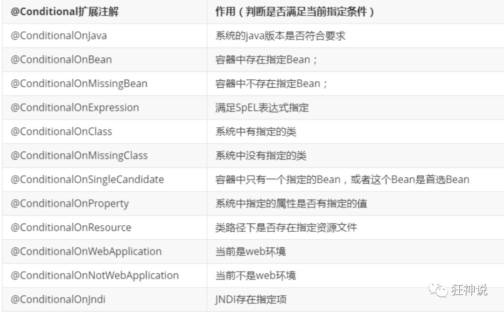

## 一、Springboot简介

### 什么是SpringBoot

什么是SpringBoot呢，就是一个javaweb的开发框架，和SpringMVC类似，对比其他javaweb框架的好处，官方说是简化开发，约定大于配置，  **you can "just run"**，能迅速的开发web应用，几行代码开发一个http接口。

所有的技术框架的发展似乎都遵循了一条主线规律：从一个复杂应用场景 衍生 一种规范框架，人们只需要进行各种配置而不需要自己去实现它，这时候强大的配置功能成了优点；发展到一定程度之后，人们根据实际生产应用情况，选取其中实用功能和设计精华，重构出一些轻量级的框架；之后为了提高开发效率，嫌弃原先的各类配置过于麻烦，于是开始提倡“约定大于配置”，进而衍生出一些一站式的解决方案。

是的这就是Java企业级应用->J2EE->spring->springboot的过程。

随着 Spring 不断的发展，涉及的领域越来越多，项目整合开发需要配合各种各样的文件，慢慢变得不那么易用简单，违背了最初的理念，甚至人称配置地狱。Spring Boot 正是在这样的一个背景下被抽象出来的开发框架，目的为了让大家更容易的使用 Spring 、更容易的集成各种常用的中间件、开源软件；

Spring Boot 基于 Spring 开发，Spirng Boot 本身并不提供 Spring 框架的核心特性以及扩展功能，只是用于快速、敏捷地开发新一代基于 Spring 框架的应用程序。也就是说，它并不是用来替代 Spring 的解决方案，而是和 Spring 框架紧密结合用于提升 Spring 开发者体验的工具。Spring Boot 以**约定大于配置的核心思想**，默认帮我们进行了很多设置，多数 Spring Boot 应用只需要很少的 Spring 配置。同时它集成了大量常用的第三方库配置（例如 Redis、MongoDB、Jpa、RabbitMQ、Quartz 等等），Spring Boot 应用中这些第三方库几乎可以零配置的开箱即用。

简单来说就是SpringBoot其实不是什么新的框架，它默认配置了很多框架的使用方式，就像maven整合了所有的jar包，spring boot整合了所有的框架 。

Spring Boot 出生名门，从一开始就站在一个比较高的起点，又经过这几年的发展，生态足够完善，Spring Boot 已经当之无愧成为 Java 领域最热门的技术。

### SpringBoot的优点

**Spring Boot的主要优点：**

- 为所有Spring开发者更快的入门
- **开箱即用**，提供各种默认配置来简化项目配置
- 内嵌式容器简化Web项目
- 没有冗余代码生成和XML配置的要求

## 二、第一个SpringBoot程序

### 环境准备

- java version 1.8.
- Maven-3.6.1
- SpringBoot 2.7.3 最新版
- 开发工具：IDEA

### 项目创建的两种方式

#### 使用Spring Initializr 的Web页面创建项目

1、打开  https://start.spring.io/

2、填写项目信息

3、点击”Generate Project“按钮生成项目；下载此项目

4、解压项目包，并用IDEA以Maven项目导入，一路下一步即可，直到项目导入完毕。

5、如果是第一次使用，可能速度会比较慢，包比较多、需要耐心等待一切就绪。

#### 使用 IDEA 直接创建项目

1、创建一个新项目

2、选择spring initalizr ， 可以看到默认就是去官网的快速构建工具那里实现

3、填写项目信息

4、选择初始化的组件（初学勾选 Web 即可）

5、填写项目路径

6、等待项目构建成功, 项目构建成功后, 可以删除多余的文件

### 项目结构说明

通过上面步骤完成了基础项目的创建。就会自动生成以下文件。

1、程序的主启动类

2、一个 application.properties 配置文件

3、一个 测试类

4、一个 pom.xml

### 编写Http接口

1、在主程序的同级目录下，新建一个controller包，**一定要在同级目录下**，否则识别不到

2、在包中新建一个HelloController类

```java
@Controller
@RequestMapping("/hello")
public class HelloController {

    @RequestMapping("/h1")
    @ResponseBody
    public String hello() {
        return "hello, world!";
    }
}
```

3、从主程序启动项目, 并在浏览器中发起请求测试(这里也可以使用maven 的package命令来将项目打成jar包, 在控制台使用 `java -jar 项目名`  来部署项目)


### 彩蛋

**SpringBoot启动程序时, 图案**

如何更改启动时显示的字符拼成的字母，SpringBoot呢？也就是 banner 图案；

只需一步：到项目下的 resources 目录下新建一个banner.txt 即可。

图案可以到：https://www.bootschool.net/ascii 这个网站生成，然后拷贝到文件中即可！


## 三、⭐SpringBoot源码分析

### pom.xml

#### 父依赖

Springboot的pom.xml会依赖一个父项目, 主要是管理项目的资源过滤及插件！

```xml
<parent>
    <groupId>org.springframework.boot</groupId>
    <artifactId>spring-boot-starter-parent</artifactId>
    <version>2.7.3</version>
    <relativePath/> <!-- lookup parent from repository -->
</parent>
```

从这个父依赖点进去后, 会发现还有一个父依赖

```xml
<parent>
    <groupId>org.springframework.boot</groupId>
    <artifactId>spring-boot-dependencies</artifactId>
    <version>2.7.3</version>
</parent>
```

这里才是真正**管理SpringBoot应用里面所有依赖版本**的地方，S**pringBoot的版本控制中心**；

**以后我们导入依赖默认是不需要写版本；但是如果导入的包没有在依赖中管理着就需要手动配置版本了；**


### 启动器spring-boot-starter

```xml
<dependency>    
	<groupId>org.springframework.boot</groupId>   
    <artifactId>spring-boot-starter-web</artifactId>
</dependency>
```

**springboot-boot-starter-xxx**：就是spring-boot的场景启动器

**spring-boot-starter-web**：帮我们导入了web模块正常运行所依赖的组件；

SpringBoot将所有的功能场景都抽取出来，做成一个个的starter （启动器），只需要在项目中引入这些starter即可，所有相关的依赖都会导入进来 ， 我们要用什么功能就导入什么样的场景启动器即可 ；我们未来也可以自己自定义 starter；


### 主启动类

#### 默认的主启动类

```java
package com.xiaoyu;

import org.springframework.boot.SpringApplication;
import org.springframework.boot.autoconfigure.SpringBootApplication;

//@SpringBootApplication 来标注一个主程序类
//说明这是一个Spring Boot应用
@SpringBootApplication
public class Springboot01HelloworldApplication {

    public static void main(String[] args) {
        SpringApplication.run(Springboot01HelloworldApplication.class, args);
    }
}
```

下面来分析这些注解的作用

### @SpringBootApplication

作用：标注在某个类上说明这个类是SpringBoot的主配置类 ， SpringBoot就应该运行这个类的main方法来启动SpringBoot应用；

进入这个注解：可以看到上面还有很多其他注解！

```java
@SpringBootConfiguration
@EnableAutoConfiguration
@ComponentScan(
    excludeFilters = {@Filter(
    type = FilterType.CUSTOM,
    classes = {TypeExcludeFilter.class}
), @Filter(
    type = FilterType.CUSTOM,
    classes = {AutoConfigurationExcludeFilter.class}
)}
)
public @interface SpringBootApplication {
    // ......
}
```

#### @ComponentScan

这个注解在Spring中很重要 ,它对`应XML配置中的元素。

作用：自动扫描并加载符合条件的组件或者bean ， 将这个bean定义加载到IOC容器中


#### @SpringBootConfiguration

作用：SpringBoot的配置类 ，标注在某个类上 ， 表示这是一个SpringBoot的配置类；

我们继续进去这个注解查看

```java
// 点进去得到下面的 @Component
@Configuration
public @interface SpringBootConfiguration {}

@Component
public @interface Configuration {}
```

这里的 @Configuration，说明这是一个配置类 ，配置类就是Spring中对应的xml 配置文件；

里面的 @Component 这就说明，启动类本身也是Spring中的一个组件而已，负责启动应用！

我们回到 SpringBootApplication 注解中继续看。

### @EnableAutoConfiguration

**@EnableAutoConfiguration ：开启自动配置功能**

以前我们需要自己手动配置的东西，而现在SpringBoot可以自动帮我们配置 ；`@EnableAutoConfiguration`告诉SpringBoot开启自动配置功能，这样自动配置才能生效；

点进注解接续查看：

**@AutoConfigurationPackage ：自动配置包**

```java
@Import({Registrar.class})
public @interface AutoConfigurationPackage {
}
```

**@import** ：Spring底层注解@import ， 给容器中导入一个组件

Registrar.class 作用：将主启动类的所在包及包下面所有子包里面的所有组件扫描到Spring容器 ；

这个分析完了，退到上一步，继续看

**@Import({AutoConfigurationImportSelector.class}) ：给容器导入组件 ；**

AutoConfigurationImportSelector ：自动配置导入选择器，那么它会导入哪些组件的选择器呢？我们点击去这个类看源码：

1、这个类中有一个这样的方法

```java
// 获得候选的配置
protected List<String> getCandidateConfigurations(AnnotationMetadata metadata, AnnotationAttributes attributes) {
    //这里的getSpringFactoriesLoaderFactoryClass（）方法
    //返回的就是我们最开始看的启动自动导入配置文件的注解类；EnableAutoConfiguration
    List<String> configurations = SpringFactoriesLoader.loadFactoryNames(this.getSpringFactoriesLoaderFactoryClass(), this.getBeanClassLoader());
    Assert.notEmpty(configurations, "No auto configuration classes found in META-INF/spring.factories. If you are using a custom packaging, make sure that file is correct.");
    return configurations;
}
```

2、这个方法又调用了  SpringFactoriesLoader 类的静态方法！我们进入SpringFactoriesLoader类loadFactoryNames() 方法

```java
public static List<String> loadFactoryNames(Class<?> factoryClass, @Nullable ClassLoader classLoader) {
    String factoryClassName = factoryClass.getName();
    //这里它又调用了 loadSpringFactories 方法
    return (List)loadSpringFactories(classLoader).getOrDefault(factoryClassName, Collections.emptyList());
}
```

3、我们继续点击查看 loadSpringFactories 方法

```java
private static Map<String, List<String>> loadSpringFactories(@Nullable ClassLoader classLoader) {
    //获得classLoader ， 我们返回可以看到这里得到的就是EnableAutoConfiguration标注的类本身
    MultiValueMap<String, String> result = (MultiValueMap)cache.get(classLoader);
    if (result != null) {
        return result;
    } else {
        try {
            //去获取一个资源 "META-INF/spring.factories"
            Enumeration<URL> urls = classLoader != null ? classLoader.getResources("META-INF/spring.factories") : ClassLoader.getSystemResources("META-INF/spring.factories");
            LinkedMultiValueMap result = new LinkedMultiValueMap();

            //将读取到的资源遍历，封装成为一个Properties
            while(urls.hasMoreElements()) {
                URL url = (URL)urls.nextElement();
                UrlResource resource = new UrlResource(url);
                Properties properties = PropertiesLoaderUtils.loadProperties(resource);
                Iterator var6 = properties.entrySet().iterator();

                while(var6.hasNext()) {
                    Entry<?, ?> entry = (Entry)var6.next();
                    String factoryClassName = ((String)entry.getKey()).trim();
                    String[] var9 = StringUtils.commaDelimitedListToStringArray((String)entry.getValue());
                    int var10 = var9.length;

                    for(int var11 = 0; var11 < var10; ++var11) {
                        String factoryName = var9[var11];
                        result.add(factoryClassName, factoryName.trim());
                    }
                }
            }

            cache.put(classLoader, result);
            return result;
        } catch (IOException var13) {
            throw new IllegalArgumentException("Unable to load factories from location [META-INF/spring.factories]", var13);
        }
    }
}
```


4、发现一个多次出现的文件：spring.factories，全局搜索它

### spring.factories

从Libraries中找到`org.springframework.boot.:spring-boot-autoconfigure2.7.3/spring-boot-autoconfigure-2.7.3.jar/META-INF`中找到`spring.factories` 可以查看到很多自动配置文件, 这就是自动配置根源所在！

我们在上面的自动配置类随便找一个打开看看，比如 ：WebMvcAutoConfiguration


可以看到这些一个个的都是JavaConfig配置类，而且都注入了一些Bean，可以找一些自己认识的类，看着熟悉一下！

所以，自动配置真正实现是**从classpath中搜寻所有的META-INF/spring.factories配置文件** ，并将其中对应的 org.springframework.boot.autoconfigure. 包下的配置项，**通过反射实例化为对应标注了 @Configuration的JavaConfig形式的IOC容器配置类 ， 然后将这些都汇总成为一个实例并加载到IOC容器中**。

**结论：**

1. SpringBoot在启动的时候从类路径下的META-INF/spring.factories中获取EnableAutoConfiguration指定的值
2. 将这些值作为自动配置类导入容器 ， 自动配置类就生效 ， 帮我们进行自动配置工作；
3. 整个J2EE的整体解决方案和自动配置都在springboot-autoconfigure的jar包中；
4. 它会给容器中导入非常多的自动配置类 （xxxAutoConfiguration）, 就是给容器中导入这个场景需要的所有组件 ， 并配置好这些组件 ；
5. 有了自动配置类 ， 免去了我们手动编写配置注入功能组件等的工作；

**现在大家应该大概的了解了下，SpringBoot的运行原理，后面我们还会深化一次！**


### SpringApplication

不简单的方法

**我最初以为就是运行了一个main方法，然而却开启了一个服务!**

#### **SpringApplication.run分析**

分析该方法主要分两部分，一部分是SpringApplication的实例化，二是run方法的执行；

**这个类主要做了以下四件事情：**

1、推断应用的类型是普通的项目还是Web项目

2、查找并加载所有可用初始化器 ， 设置到initializers属性中

3、找出所有的应用程序监听器，设置到listeners属性中

4、推断并设置main方法的定义类，找到运行的主类

查看构造器：

```java
public SpringApplication(ResourceLoader resourceLoader, Class... primarySources) {
    // ......
    this.webApplicationType = WebApplicationType.deduceFromClasspath();
    this.setInitializers(this.getSpringFactoriesInstances();
    this.setListeners(this.getSpringFactoriesInstances(ApplicationListener.class));
    this.mainApplicationClass = this.deduceMainApplicationClass();
}
```

run方法流程分析

## 四、⭐yaml配置注入

配套代码: `SpingBoot/springboot-02-config`


SpringBoot使用一个全局的配置文件, 配置的名称是固定的, 可以使用`properties`和`yaml`格式来配置

- `application.properties`
  
- 语法结构:` key-value`
  
- `application.yaml`

  - 语法结构: `key: 空格 value`

    

**配置文件的作用 ：**修改SpringBoot自动配置的默认值，因为SpringBoot在底层都给我们自动配置好了；

### yaml介绍

YAML是 "YAML Ain't a Markup Language" （YAML不是一种标记语言）的递归缩写。在开发的这种语言时，YAML 的意思其实是："Yet Another Markup Language"（仍是一种标记语言）

**这种语言以数据作为中心，而不是以标记语言为重点！**

以前的配置文件，大多数都是使用xml来配置；比如一个简单的端口配置，我们来对比下yaml和xml

传统xml配置：

```xml
<server>
    <port>8081<port>
</server>
```

yaml配置：

```yaml
server：  
  prot: 8080
```

#### 基本语法

说明：**语法要求严格！**

- 1、空格不能省略
- 2、**以缩进来控制层级关系，只要是左边对齐的一列数据都是同一个层级的。**
- 3、属性和值的大小写都是十分敏感的。


**字面量: 普通的值[数字/布尔值/字符串]**

字面量直接写在后面就可以 ， 字符串默认不用加上双引号或者单引号；

```yaml
k: v
```

注意：

- `“ ”` 双引号，不会转义字符串里面的特殊字符 ， 特殊字符会作为本身想表示的意思；

  比如 ：name: "xiaoyu \n yu"  输出 ：kuang  换行  shen

- '' 单引号，会转义特殊字符 ， **特殊字符最终会变成和普通字符一样输出**

  比如 ：name: ‘xiaoyu\n yu’   输出 ：xiayu \n  yu

  

对象/数组的用法如下: 

```yaml
#字面量
key: value

#对象/Map格式
#对象、Map格式
k: 
    v1:
    v2:

#对象用法
student:
  name: xiaoyu
  age: 3

#对象的行内写法
student: {name: smith, age: 3}

#数组
pets:
  - cat
  - dog
  - pig

#数组的行内写法
pets: [cat, dog, pig]

```


### 使用yaml注入配置文件

**yaml文件更强大的地方在于，他可以给我们的实体类直接注入匹配值！**


1、在springboot项目中的resources目录下新建一个文件 application.yml

2、编写一个实体类 Dog；先使用`@Component`注册到容器中, 并使用`@Value()`来给属性注入值

```java
import org.springframework.beans.factory.annotation.Value;
import org.springframework.stereotype.Component;

@Component  
public class Dog {

    @Value("小白")
    private String name;

    @Value("4")
    private int age;
    
    //有参无参构造、get、set方法、toString()方法  
}
```

3、在Springboot的测试中测试输出

```java
import org.junit.jupiter.api.Test;
import org.springframework.beans.factory.annotation.Autowired;
import org.springframework.boot.test.context.SpringBootTest;

@SpringBootTest
class Springboot02ConfigApplicationTests {

    @Autowired   //将注册的对象 自动注入进来
    private Dog dog; 
    
    @Test
    void contextLoads() {
        System.out.println(dog);
    }

}
```

4、 测试会发现狗对象的信息成功输入


#### ⭐使用yaml来注入对象属性

1、编写一个实体类 Person

```java
package com.xiaoyu.pojo;

import org.springframework.boot.context.properties.ConfigurationProperties;
import org.springframework.stereotype.Component;

import java.util.Date;
import java.util.List;
import java.util.Map;

/*
@ConfigurationProperties作用：
    将配置文件中配置的每一个属性的值，映射到这个组件中；
    告诉SpringBoot将本类中的所有属性和配置文件中相关的配置进行绑定
    参数 prefix = “person” : 将配置文件中的person下面的所有属性一一对应
*/
@Component
@ConfigurationProperties(prefix = "person")
public class Person {

    private String name;
    private int age;
    private Boolean happy;
    private Date date;
    private List<Object> list;
    private Map<String, Object> map;
}
```


2、使用yaml配置的方式进行注入，注意区别和优势，我们编写一个yaml配置！

```yaml
person:
  name: 小鱼
  age: 22
  happy: true
  date: 2022/9/1
  list:
    - code
    - music
    - girl
  map:
    k1: hello
    k2: 你好
```


3、使用`@ConfigurationProperties(prefix = "person")` 注入到类中, 此时,IDEA 提示，springboot配置注解处理器没有找到，查看文档，找到一个依赖, 并加入到SpringBoot的pom.xml中

```xml
<!-- 导入配置文件处理器，配置文件进行绑定就会有提示，需要重启 -->
<dependency>
  <groupId>org.springframework.boot</groupId>
  <artifactId>spring-boot-configuration-processor</artifactId>
  <optional>true</optional>
</dependency>
```


5、确认以上配置都OK之后，我们去测试类中测试一下：结果是所有的值都注入成功!

```java
package com.xiaoyu;

import com.xiaoyu.pojo.Person;
import org.junit.jupiter.api.Test;
import org.springframework.beans.factory.annotation.Autowired;
import org.springframework.boot.test.context.SpringBootTest;

@SpringBootTest
class Springboot02ConfigApplicationTests {
    
    @Autowired    //将注册的对象 自动注入进来
    private Person person;

    @Test
    void contextLoads() {
        System.out.println(person);
    }
}
```


### 加载指定的配置文件

**@PropertySource ：**加载指定的配置文件；

**@configurationProperties**：默认从全局配置文件中获取值；


1、我们去在resources目录下新建一个**xiaoyu.properties**文件

```properties
name=xiaoyu
```


2、编写实体类Student并在加载 properties文件

```java

@PropertySource(value = "classpath:xiaoyu.properties")
@Component
public class Student {

    @Value("${name}")   // 从引入的properties文件中取出中, 并注入到属性中
    private String name;
}
```


3、测试输出: 指定的文件绑定成功


### 配置文件占位符

配置文件还可以编写占位符生成随机数

```yaml
person:
    name: xiaoyu${random.uuid} # 随机uuid
    age: ${random.int}  # 随机int
    happy: false
    birth: 2000/01/01
    maps: {k1: v1,k2: v2}
    lists:
      - code
      - girl
      - music
    dog:
      name: ${person.hello:other}_旺财
      age: 1
```


### 回顾properties配置

我们上面采用的yaml方法都是最简单的方式，开发中最常用的；也是springboot所推荐的！配置文件除了yml还有我们之前常用的properties 

【注意】

​	**properties配置文件在写中文的时候，会有乱码 ， 我们需要去IDEA中设置编码格式为UTF-8；**

**settings-->FileEncodings 中配置: 将所有的文件格式都设置为 UTF-8**


使用步骤和上面的相同


### 对比小结

@Value这个使用起来并不友好！我们需要为每个属性单独注解赋值，比较麻烦；我们来看个功能对比图


1、@ConfigurationProperties只需要写一次即可 ， @Value则需要每个字段都添加

2、松散绑定：这个什么意思呢? 比如我的yml中写的last-name，这个和lastName是一样的， - 后面跟着的字母默认是大写的。这就是松散绑定。可以测试一下

3、JSR303数据校验 ， 这个就是我们可以在字段是增加一层过滤器验证 ， 可以保证数据的合法性

4、复杂类型封装，yml中可以封装对象 ， 使用value就不支持

#### 结论

- 配置yml和配置properties都可以获取到值 ， 强烈推荐 yml；

- 如果我们在某个业务中，只需要获取配置文件中的某个值，可以使用一下 @value；

- 如果说，我们专门编写了一个JavaBean来和配置文件进行一一映射，就直接@configurationProperties，不要犹豫！

## 五、JSR303数据校验及多环境切换

### JSR303数据校验

#### 基本使用

Springboot中可以用`@validated`来校验数据，如果数据异常则会统一抛出异常，方便异常中心统一处理。我们这里来写个注解让我们的name只能支持Email格式；

```java
@Component //注册bean
@ConfigurationProperties(prefix = "person")
@Validated  //数据校验
public class Person {
    @Email(message="邮箱格式错误") //name必须是邮箱格式
    private String name;
}
```


#### 常见的参数

**使用数据校验，可以保证数据的正确性；**

处理`@Email`格式类型, SpringBoot还提供了许多其他的参数

```java
@NotNull(message="名字不能为空")
private String userName;
@Max(value=120,message="年龄最大不能查过120")
private int age;
@Email(message="邮箱格式错误")
private String email;

空检查
@Null       验证对象是否为null
@NotNull    验证对象是否不为null, 无法查检长度为0的字符串
@NotBlank   检查约束字符串是不是Null还有被Trim的长度是否大于0,只对字符串,且会去掉前后空格.
@NotEmpty   检查约束元素是否为NULL或者是EMPTY.
    
Booelan检查
@AssertTrue     验证 Boolean 对象是否为 true  
@AssertFalse    验证 Boolean 对象是否为 false  
    
长度检查
@Size(min=, max=) 验证对象（Array,Collection,Map,String）长度是否在给定的范围之内  
@Length(min=, max=) string is between min and max included.

日期检查
@Past       验证 Date 和 Calendar 对象是否在当前时间之前  
@Future     验证 Date 和 Calendar 对象是否在当前时间之后  
@Pattern    验证 String 对象是否符合正则表达式的规则

.......等等
除此以外，我们还可以自定义一些数据校验
```


### 多环境切换

profile是Spring对不同环境提供不同配置功能的支持，可以通过激活不同的环境版本，实现快速切换环境

#### 配置文件加载位置

**外部加载配置文件的方式十分多，我们选择最常用的即可，在开发的资源文件中进行配置！**

springboot 启动会扫描以下位置的`application.properties`或者`application.yml`文件作为Spring boot的默认配置文件：

- 优先级1：项目路径下的config文件夹配置文件

- 优先级2：项目路径下配置文件

- 优先级3：资源路径下的config文件夹配置文件

- 优先级4：资源路径下配置文件

  

优先级由高到底，高优先级的配置会覆盖低优先级的配置；

**SpringBoot会从这四个位置全部加载主配置文件；互补配置；**

我们在最低级的配置文件中设置一个项目访问路径的配置来测试互补问题；

```properties
#配置项目的访问路径
server.servlet.context-path=/xiaoyu 
```


### 多配置文件

我们在主配置文件编写的时候，文件名可以是 application-{profile}.properties/yml , 用来指定多个环境版本；

**例如：**

application-test.properties 代表测试环境配置

application-dev.properties 代表开发环境配置

但是Springboot并不会直接启动这些配置文件，它**默认使用application.properties主配置文件**；

我们需要通过一个配置来选择需要激活的环境：

```properties
#比如在配置文件中指定使用dev环境，我们可以通过设置不同的端口号进行测试；
#我们启动SpringBoot，就可以看到已经切换到dev下的配置了；
spring.profiles.active=dev
```


### yaml的多文档块

和properties配置文件中一样，但是使用yml去实现不需要创建多个配置文件，更加方便了 !

```yaml
server:
  port: 8081
  
#选择要激活那个环境块
spring:
  profiles:
    active: prod

---
server:
  port: 8083
spring:
  profiles: dev #配置环境的名称

---

server:
  port: 8084
spring:
  profiles: prod  #配置环境的名称
```


## 六、SpringBoot自动配置原理

SpringBoot的配置文件能写什么? 怎么去写?

### 自动配置原理的分析

以**HttpEncodingAutoConfiguration（Http编码自动配置）**为例解释自动配置原理；

``` java
//表示这是一个配置类，和以前编写的配置文件一样，也可以给容器中添加组件；
@Configuration 

//启动指定类的ConfigurationProperties功能；
  //进入这个HttpProperties查看，将配置文件中对应的值和HttpProperties绑定起来；
  //并把HttpProperties加入到ioc容器中
@EnableConfigurationProperties({HttpProperties.class}) 

//Spring底层@Conditional注解
  //根据不同的条件判断，如果满足指定的条件，整个配置类里面的配置就会生效；
  //这里的意思就是判断当前应用是否是web应用，如果是，当前配置类生效
@ConditionalOnWebApplication(
    type = Type.SERVLET
)

//判断当前项目有没有这个类CharacterEncodingFilter；SpringMVC中进行乱码解决的过滤器；
@ConditionalOnClass({CharacterEncodingFilter.class})

//判断配置文件中是否存在某个配置：spring.http.encoding.enabled；
  //如果不存在，判断也是成立的
  //即使我们配置文件中不配置pring.http.encoding.enabled=true，也是默认生效的；
@ConditionalOnProperty(
    prefix = "spring.http.encoding",
    value = {"enabled"},
    matchIfMissing = true
)

public class HttpEncodingAutoConfiguration {
    //他已经和SpringBoot的配置文件映射了
    private final Encoding properties;
    //只有一个有参构造器的情况下，参数的值就会从容器中拿
    public HttpEncodingAutoConfiguration(HttpProperties properties) {
        this.properties = properties.getEncoding();
    }
    
    //给容器中添加一个组件，这个组件的某些值需要从properties中获取
    @Bean
    @ConditionalOnMissingBean //判断容器没有这个组件？
    public CharacterEncodingFilter characterEncodingFilter() {
        CharacterEncodingFilter filter = new OrderedCharacterEncodingFilter();
        filter.setEncoding(this.properties.getCharset().name());
        filter.setForceRequestEncoding(this.properties.shouldForce(org.springframework.boot.autoconfigure.http.HttpProperties.Encoding.Type.REQUEST));
        filter.setForceResponseEncoding(this.properties.shouldForce(org.springframework.boot.autoconfigure.http.HttpProperties.Encoding.Type.RESPONSE));
        return filter;
    }
    //。。。。。。。
}
```


**一句话总结 ：根据当前不同的条件判断，决定这个配置类是否生效！**

- 一但这个配置类生效；这个配置类就会给容器中添加各种组件；
- 这些组件的属性是从**对应的properties类**中获取的，这些**类里面的每一个属性又是和配置文件绑定**的；
- 所有在配置文件中能配置的**属性都是在xxxxProperties类中封装**着；
- 配置文件能配置什么就可以参照某个功能对应的这个属性类

```java
//从配置文件中获取指定的值和bean的属性进行绑定
@ConfigurationProperties(prefix = "spring.http") 
public class HttpProperties {
    // .....
}
```

我们去配置文件里面试试前缀，看提示！**yaml的配置全部和xxxProperties对应**

这就是自动装配的原理!


### 自动配置总结

1、SpringBoot启动会加载大量的自动配置类

2、我们看我们需要的功能有没有在SpringBoot默认写好的自动配置类当中；

3、我们再来看这个自动配置类中到底配置了哪些组件；（只要我们要用的组件存在在其中，我们就不需要再手动配置了）

4、给容器中自动配置类添加组件的时候，会从properties类中获取某些属性。我们只需要在配置文件中指定这些属性的值即可；

**xxxxAutoConfigurartion：自动配置类；**给容器中添加组件

**xxxxProperties:封装配置文件中相关属性；**


### 关于@Conditional 注解

了解完自动装配的原理后，我们来关注一个细节问题，**自动配置类必须在一定的条件下才能生效；**

**@Conditional派生注解（Spring注解版原生的@Conditional作用）**

作用：**必须是@Conditional指定的条件成立，才给容器中添加组件，配置配里面的所有内容才生效**；


**那么多的自动配置类，必须在一定的条件下才能生效；也就是说，我们加载了这么多的配置类，但不是所有的都生效了。**

**我们可以通过启用 debug=true属性；来让控制台打印自动配置报告，这样我们就可以很方便的知道哪些自动配置类生效；**

```yaml
#开启springboot的调试类
debug=true
```


- **Positive matches:（自动配置类启用的：正匹配）**
- **Negative matches:（没有启动，没有匹配成功的自动配置类：负匹配）**
- **Unconditional classes: （没有条件的类）**


## 七、Web静态资源处理和首页定制

配套代码: `SpringBoot/springboot-03-web`

### 静态资源

**静态资源映射规则：**

SpringBoot中，SpringMVC的web配置都在 WebMvcAutoConfiguration 这个配置类里面；

进入`WebMvcAutoConfiguration`的源码文件中,查看源码中`addResourceHandlers()`方法

```java
@Override
public void addResourceHandlers(ResourceHandlerRegistry registry) {
    
    //一旦在配置文件中 自定义了spring.mvc.static-path-pattern  下面添加资源方式就会失效!
    if (!this.resourceProperties.isAddMappings()) {
        logger.debug("Default resource handling disabled");
        return;
    }
    
    addResourceHandler(registry, "/webjars/**", "classpath:/META-INF/resources/webjars/");
    addResourceHandler(registry, this.mvcProperties.getStaticPathPattern(), (registration) -> {
        registration.addResourceLocations(this.resourceProperties.getStaticLocations());
        
        
        if (this.servletContext != null) {
            ServletContextResource resource = new ServletContextResource(this.servletContext, SERVLET_LOCATION);
            registration.addResourceLocations(resource);
        }
    });
}
```


#### webjars

Webjars本质就是以jar包的方式引入我们的静态资源 ， 我们以前要导入一个静态资源文件，直接导入即可。

使用SpringBoot需要使用Webjars，我们可以去搜索一下：

网站：https://www.webjars.org 

例如; 使用jQuery，我们只要要引入jQuery对应版本的pom依赖即可！

```xml
<dependency>
    <groupId>org.webjars</groupId>
    <artifactId>jquery</artifactId>
    <version>3.4.1</version>
</dependency>
```


#### 第二种静态资源映射规则

WebProperties 源码

```java
// 进入方法
public String[] getStaticLocations() {
    return this.staticLocations;
}
// 找到对应的值
private String[] staticLocations = CLASSPATH_RESOURCE_LOCATIONS;
// 找到路径
private static final String[] CLASSPATH_RESOURCE_LOCATIONS = { 
    "classpath:/META-INF/resources/",
  "classpath:/resources/", 
    "classpath:/static/", 
    "classpath:/public/" 
};
```


阅读以上的源码可以得到 四种 静态资源的添加方式: 

**添加静态资源的四种方式:**

- webjars     **访问方式:   localhost: 8080/webjars/**
-  resources根目录下   **访问方式:   localhost: 8080/**
  - resources
  - static
  - public
  - 根目录

访问资源的优先级: 

`resources > static > public `

#### 自定义静态资源路径

我们也可以自己通过配置文件来指定一下，哪些文件夹是需要我们放静态资源文件的，在application.properties中配置；

```properties
spring.resources.static-locations=classpath:/xiaoyu/
```

### 首页定制

继续查看`WebMvcAutoConfiguration`的源码文件, 可以看到欢迎页的映射`welcomePageHandlerMapping()`方法, 就是我们首页!

```java
@Bean
public WelcomePageHandlerMapping welcomePageHandlerMapping(ApplicationContext applicationContext,
                                                           FormattingConversionService mvcConversionService, ResourceUrlProvider mvcResourceUrlProvider) {
    WelcomePageHandlerMapping welcomePageHandlerMapping = new WelcomePageHandlerMapping(
        new TemplateAvailabilityProviders(applicationContext), applicationContext, getWelcomePage(),
        this.mvcProperties.getStaticPathPattern());
    welcomePageHandlerMapping.setInterceptors(getInterceptors(mvcConversionService, mvcResourceUrlProvider));
    welcomePageHandlerMapping.setCorsConfigurations(getCorsConfigurations());
    return welcomePageHandlerMapping;
}
```

继续查看`getWelcomePage()` 方法

```java
private Resource getWelcomePage() {
    for (String location : this.resourceProperties.getStaticLocations()) {
        Resource indexHtml = getIndexHtml(location);
        if (indexHtml != null) {
            return indexHtml;
        }
    }
    ServletContext servletContext = getServletContext();
    if (servletContext != null) {
        return getIndexHtml(new ServletContextResource(servletContext, SERVLET_LOCATION));
    }
    return null;
}
```


欢迎页，静态资源文件夹下的所有 index.html 页面；被 /** 映射。

比如我访问  http://localhost:8080/ ，就会找静态资源文件夹下的 index.html

新建一个 index.html ，在我们上面的3个目录中任意一个；然后访问测试  http://localhost:8080/  看结果！


## 八、Thymeleaf模板引擎      

### 模板引擎介绍

前端交给我们的页面，是html页面。如果是我们以前开发，我们需要把他们转成jsp页面，jsp好处就是当我们查出一些数据转发到JSP页面以后，我们可以用jsp轻松实现数据的显示，及交互等。

但是springboot默认是不支持jsp的, 因此使用 模板引擎

**SpringBoot推荐你可以来使用模板引擎：**

模板引擎，我们其实大家听到很多，其实jsp就是一个模板引擎，还有用的比较多的freemarker，包括SpringBoot给我们推荐的Thymeleaf，模板引擎有非常多，但再多的模板引擎，他们的思想都是一样的，什么样一个思想呢我们来看一下这张图：


模板引擎的作用

就是我们来写一个页面模板，比如有些值呢，是动态的，我们写一些表达式。而这些值，从哪来呢，就是我们在后台封装一些数据。然后把这个模板和这个数据交给我们模板引擎，模板引擎按照我们这个数据帮你把这表达式解析、填充到我们指定的位置，然后把这个数据最终生成一个我们想要的内容给我们写出去，这就是我们这个模板引擎，不管是jsp还是其他模板引擎，都是这个思想。只不过呢，就是说不同模板引擎之间，他们可能这个语法有点不一样。其他的我就不介绍了，我主要来介绍一下SpringBoot给我们推荐的Thymeleaf模板引擎，这模板引擎呢，是一个高级语言的模板引擎，他的这个语法更简单。而且呢，功能更强大。

我们呢，就来看一下这个模板引擎，那既然要看这个模板引擎。首先，我们来看SpringBoot里边怎么用。


### 使用Thymeleaf

Thymeleaf 官网：https://www.thymeleaf.org/

Thymeleaf 在Github 的主页：https://github.com/thymeleaf/thymeleaf

#### 引入Thymeleaf依赖

在springboot 项目的pom.xml引入下面的依赖

```xml
<!--thymeleaf-->
<dependency>
    <groupId>org.springframework.boot</groupId>
    <artifactId>spring-boot-starter-thymeleaf</artifactId>
</dependency>
```

#### 使用方法

已经引入了Thymeleaf，那这个要怎么使用呢？

我们首先得按照SpringBoot的自动配置原理看一下我们这个Thymeleaf的自动配置规则，在按照那个规则，我们进行使用。

我们去找一下Thymeleaf的自动配置类：`ThymeleafProperties`

```java
@ConfigurationProperties(
    prefix = "spring.thymeleaf"
)
public class ThymeleafProperties {
    private static final Charset DEFAULT_ENCODING;
    public static final String DEFAULT_PREFIX = "classpath:/templates/";
    public static final String DEFAULT_SUFFIX = ".html";
    private boolean checkTemplate = true;
    private boolean checkTemplateLocation = true;
    private String prefix = "classpath:/templates/";
    private String suffix = ".html";
    private String mode = "HTML";
    private Charset encoding;
}
```

我们可以在其中看到默认的前缀和后缀！

我们只需要把我们的html页面放在类路径下的templates下，thymeleaf就可以帮我们自动渲染了。

使用thymeleaf什么都不需要配置，只需要将他放在指定的文件夹下即可！


测试: 

1、编写 一个简单的请求, 并使用Model增加一个数据

```java
@RequestMapping("/test")
    public String thymeleafTest(Model model) {
        model.addAttribute("msg", "hello, world!");
        return "test";
    }
```


2、编写前端页面,  注意: 我们要使用thymeleaf，需要**在html文件中导入命名空间的约束**

```
xmlns:th="http://www.thymeleaf.org"
```

```html
<!DOCTYPE html>
<html lang="en" xmlns:th="http://www.thymeleaf.org">
<head>
    <meta charset="UTF-8">
    <title>Title</title>
</head>
<body>
    <!-- th:text就是将div中的内容设置为它指定的值，和之前学习的Vue一样 -->
    <div th:text="${msg}"></div>
</body>
</html>
```


3、 启动测试, 从结果中, 可以查看到 增加的数据, 已经被渲染出来


### Thymeleaf基本语法


## 九、❌MVC的拓展原理

### 自定义视图解析器

```java
@Configuration  // 拓展springmvc的配置, 可以使用注解@Configuration
public class MvcConfig implements WebMvcConfigurer {
    
    @Bean
    public ViewResolver myViewResolver() {
        return new MyViewResolver();
    }

    // 自定义一个视图解析器
    //我们写一个静态内部类，视图解析器就需要实现ViewResolver接口
    public static class MyViewResolver implements ViewResolver {

        @Override
        public View resolveViewName(String viewName, Locale locale)  {
            return null;
        }
    }
}
```

可以在`DispatcherServlet` 中的 `doDispatch()`方法 打上断点进行debug来查看 自定义的视图解析器是否生效

**结论:** 

- 如果想要使用自己定制化的东西，我们只需要给容器中添加这个组件就好了！剩下的事情SpringBoot就会帮我们做了！

### 修改SpringBoot的默认配置

这么多的自动配置，原理都是一样的，通过这个WebMVC的自动配置原理分析，我们要学会一种学习方式，通过源码探究，得出结论

> SpringBoot在自动配置很多组件的时候，先看容器中有没有用户自己配置的（如果用户自己配置@bean），如果有就用用户配置的，如果没有就用自动配置的；

如果有些组件可以存在多个，比如我们的视图解析器，就将用户配置的和自己默认的组合起来！

**扩展使用SpringMVC**  官方文档如下：

> If you want to keep Spring Boot MVC features and you want to add additional MVC configuration (interceptors, formatters, view controllers, and other features), you can add your own @Configuration class of type WebMvcConfigurer but without @EnableWebMvc. If you wish to provide custom instances of RequestMappingHandlerMapping, RequestMappingHandlerAdapter, or ExceptionHandlerExceptionResolver, you can declare a WebMvcRegistrationsAdapter instance to provide such components.

我们要做的就是编写一个@Configuration注解类，并且类型要为WebMvcConfigurer，**还不能标注@EnableWebMvc注解**；我们去自己写一个；我们新建一个包叫config，写一个类MyMvcConfig；

```java
//应为类型要求为WebMvcConfigurer，所以我们实现其接口
//可以使用自定义类扩展MVC的功能
@Configuration
// 注意: 如果使用@EnableWebMvc注解,则说明全名接管了springmvc的配置!所有的东西都需要自己手动配置!
//@EnableWebMvc  // 可以查看源码来查看原理!
public class MyMvcConfig implements WebMvcConfigurer {

    // 自定义的视图控制器
    @Override
    public void addViewControllers(ViewControllerRegistry registry) {
        // 浏览器发送/test ， 就会跳转到test页面；
        registry.addViewController("/test").setViewName("test");
    }
}
```


## 十、使用SpringBoot进行WEB开发

### 页面国际化

配套代码: `SpringBoot/springboot-04-webexercise`

有的时候，我们的网站会去涉及中英文甚至多语言的切换，这时候我们就需要学习国际化了！

#### 准备工作

在IDEA中统一设置的编码问题, 将setting中的 File Encoding所有的编码都设置为UTF-8

#### 配置文件

1、在resources资源文件下新建一个**i18n(internationalization)**目录，存放国际化配置文件

2、建立一个login.properties,  login_zh_CN.properties 和login_us_EN.properties, 此时IDEA自动识别了我们要做国际化操作, 文件会有相关的变化

3、使用`Resources Bundle `插件(需安装), 将相关的中英文信息编写在配置文件上 

​		中文

```properties
login.btn=登录
login.password=密码
login.remember=记住我
login.tip=请登录
login.username=用户名
```

​		英文

```properties
login.btn=Sign in
login.password=password
login.remember=remember
login.tip=Please sign in
login.username=username
```

#### 配置页面国际化值

1、在application.properties(或yaml)中 ,将页面国际化的配置文件与springboot 绑定

```properties
#设置页面国际化的 需要绑定的配置文件
spring.messages.basename=i18n/login
```

2、将首页页面的 对应的值使用 thymleaf 模板#{} 变更为配置文件中的值,  

3、并修改前端页面的跳转链接

```html
<form class="form-signin" action="dashboard.html">
    
    <h1 class="h3 mb-3 font-weight-normal"  th:text="#{login.tip}">Please sign in</h1>
    <input type="text" class="form-control" th:placeholder="#{login.username}" required="" autofocus="">
    <input type="password" class="form-control" th:placeholder="#{login.password}" required="">
    <div class="checkbox mb-3">
        <label>
            <input type="checkbox" value="remember-me" > [[ #{login.remember} ]]
        </label>
    </div>
    <button class="btn btn-lg btn-primary btn-block" type="submit" th:text="#{login.btn}">Sign in</button>
    <p class="mt-5 mb-3 text-muted">© 2017-2018</p>
    <a class="btn btn-sm" th:href="@{/index.html(language='zh_CN')}">中文</a>
    <a class="btn btn-sm" th:href="@{/index.html(language='us_EN')}">English</a>
</form>
```

 

#### 相关源码分析

`WebMvcAutoConfiguration`类中有 `EnableWebMvcConfiguration`的静态内部类 ,  这个内部类中存在`localeResolver()`方法,  此方法为  **获取区域信息对象解析器！**

```java
@Override
@Bean
@ConditionalOnMissingBean(name = DispatcherServlet.LOCALE_RESOLVER_BEAN_NAME)
public LocaleResolver localeResolver() {
    // 如果用户自定义了resolveLocale组件, 则使用用户配置的
   if (this.webProperties.getLocaleResolver() == WebProperties.LocaleResolver.FIXED) {
      return new FixedLocaleResolver(this.webProperties.getLocale());
   }
   AcceptHeaderLocaleResolver localeResolver = new AcceptHeaderLocaleResolver();
   localeResolver.setDefaultLocale(this.webProperties.getLocale());
   return localeResolver;
}
```


`AcceptHeaderLocaleResolver` 类有`resolveLocale()` 方法, 此方法为**区域信息对象解析器**, 我们可以根据此方法来 自定义我们自己的 区域信息对象解析器

```java
@Override
public Locale resolveLocale(HttpServletRequest request) {
   Locale defaultLocale = getDefaultLocale();
    // 默认的就是根据请求头带来的区域信息获取Locale进行国际化
   if (defaultLocale != null && request.getHeader("Accept-Language") == null) {
      return defaultLocale;
   }
   Locale requestLocale = request.getLocale();
   List<Locale> supportedLocales = getSupportedLocales();
   if (supportedLocales.isEmpty() || supportedLocales.contains(requestLocale)) {
      return requestLocale;
   }
   Locale supportedLocale = findSupportedLocale(request, supportedLocales);
   if (supportedLocale != null) {
      return supportedLocale;
   }
   return (defaultLocale != null ? defaultLocale : requestLocale);
}
```


#### 自定义区域信息对象解析器

1、根据上面的源码分析, 我们可以自定义一个 区域信息对象解析器

```java
/**
 * @author 小鱼
 * @version 1.0
 * @date 2022/9/5 12:10
 * 自定义的  区域信息对象解析器(LocaleResolver)
 */
public class MyLocaleResolver implements LocaleResolver {

    //解析请求
    @Override
    public Locale resolveLocale(HttpServletRequest request) {

        // 获取请求携带的数据
        String language = request.getParameter("language");
        Locale locale = Locale.getDefault(); // 如果没有获取到就使用系统默认的

        if (StringUtils.hasText(language)) {
            //分割请求参数
            String[] split = language.split("_");
            // 获取 国家  语言
            locale = new Locale(split[0], split[1]);
        }
        return locale;
    }
    @Override
    public void setLocale(HttpServletRequest request, HttpServletResponse response, Locale locale) {

    }
}
```


2、将自定义的 区域信息对象解析器 注册到spring容器中

```java
@Bean
public LocaleResolver localeResolver() {
    return new MyLocaleResolver();
}
```


完成上面的所有操作后, 启动项目后, 我们点击中/英问会发现, 页面已经实现了 语言的切换!


### 登录功能和页面跳转

1、在index.html 中将登录的请求重新编写

```html
<form class="form-signin" th:action="@{/user/login}" method="post">
```


2、编写一个LoginController 来处理登录请求, 

```java
@Controller
public class LoginController {

    @PostMapping("/user/login")
    public String login(@RequestParam("username") String username,
                        @RequestParam("password") String password, Model model) {

//        System.out.println( "[debug] ==> "  + username + " 密码 " + password);

        //验证用户名和密码
        if (!ObjectUtils.isEmpty(username) && password.equals("123")) {
            return "dashboard";
        } else {
            model.addAttribute("msg", "用户名或密码错误");
            return "index";
        }
    }
}
```


3、登录错误时, 在视图上显示错误的信息

```html
<p th:text="${msg}" style="color: red"></p>
```


4、测试

**问题:**  

已经能通过账号和密码登录, 但是可以直接绕过登录页面, 进入首页, 此时, 就需要**登录拦截器**来完成未进行验证的用户


### 登录拦截器

1、 编写一个`LoginHandlerInterceptor`类, 实现`HandlerInterceptor`接口, 并重写 `preHandle()`, 来作为登录的拦截器

```java
public class LoginHandlerInterceptor implements HandlerInterceptor {

    @Override
    public boolean preHandle(HttpServletRequest request, HttpServletResponse response, Object handler) throws Exception {

        // 获取用户的session
        Object user = request.getSession().getAttribute("user");

        if (user == null) {
            request.setAttribute("msg", "没有权限, 无法登录");
            // 将没有登录的用户拦截, 并转发到登录页面
            request.getRequestDispatcher("/index.html").forward(request, response);
        } else {
            return true;
        }
        return false;
    }
}
```


2、在WebMvcConfig  配置类中, 添加登录拦截器

```java
 // 添加拦截器
@Override
public void addInterceptors(InterceptorRegistry registry) {

    InterceptorRegistration interceptor = registry.addInterceptor(new LoginHandlerInterceptor());
    // 将所有的请求都拦截
    interceptor.addPathPatterns("/**");
    // 将登录页面/请求 和静态资源放行
    interceptor.excludePathPatterns("/index.html", "/", "/user/login", "/static");
}
```

 

3、测试结果: 发现没有登录的用户都被拦截在登录页面


### 员工列表展示

#### 提取公共页面

使用thymleaf 模板引擎来 提取公共页面,  提高代码的复用率, 简化开发

1、在templates 文件夹下新建`commons/conmmons.html`文件, 作为公共页面


2、使用`th:fragment="topbar"` 来将list.html和 dashboard.html 页面的顶部导航栏抽取出来

使用`th:fragment="sidebar"`来将list.html和 dashboard.html 页面的侧边栏抽取出来

```html
<!DOCTYPE html>
<html lang="en">

<!-- 顶部导航栏-->
<nav class="navbar navbar-dark sticky-top bg-dark flex-md-nowrap p-0" th:fragment="topbar">
   <!--顶部导航栏的html代码 -->
</nav>

<!-- 侧边栏 -->
<nav class="col-md-2 d-none d-md-block bg-light sidebar" th:fragment="sidebar">
    <!--侧标栏的html代码 -->
</nav>
</html>
```


3、在list.html和 dashboard.html 使用`th:insert="~{commons/commons:: topbar}` 页面将抽取的公共页面 复用

```html
<!-- 顶部导航栏-->
<div th:insert="~{commons/commons:: topbar}"></div>
<!-- 侧边栏-->
<div th:insert="~{commons/commons:: sidebar}"></div>
```

#### 信息展示

使用thymleaf 模板引擎 的`th:each="user: ${userInfo}` 数据循环展示

```html
<table class="table table-striped table-sm">
    <thead>
        <tr>
            <th>id</th>
            <th>姓名</th>
            <th>邮箱</th>
            <th>性别</th>
            <th>部门</th>
            <th>生日</th>
            <th>操作</th>
        </tr>
    </thead>
    <tbody>
        <tr th:each="user: ${userInfo}">
            <td th:text="${user.getId()}"></td>
            <td th:text="${user.getEmployeeName()}"></td>
            <td th:text="${user.getEmail()}"></td>
            <td th:text="${user.getGender() == 0 ? '女' : '男'}"></td>
            <td th:text="${user.getDepartment.getDepartmentName()}"></td>
            <td th:text="${#dates.format(user.getBirth(), 'yyyy-MM-dd HH:mm:ss')}"></td>
            <td class="btn btn-sm btn-primary">编辑</td> 
            <td class="btn btn-sm btn-danger">删除</td>
            <td></td>
        </tr>
    </tbody>
```


### 员工列表的增删改查

#### 员工列表添加

1、处理前端的请求

​	跳转到 添加页面

```html
<h2><a th:href="@{/toAdd}" class="btn btn-sm btn-success">添加员工</a></h2>
```

 	添加员工信息的请求

```html
<form th:action="@{/addUser}" method="post">
```


2、处理跳转到添加页面的请求, 和添加按钮的请求

```java
@GetMapping("/toAdd")
    public String toAdd(Model model) {
        model.addAttribute("deptList", departmentDao.getDepartment());
        return "add";
    }

    @PostMapping("/addUser")
    public String addUser(Employee employee) {

        employeeDao.add(employee);
        // 将页面重定向到 /userList 请求
        return "redirect:/userList";
    }
```


## 十一、整合Druid数据源

### JDBC

#### SpringDate

对于数据访问层，无论是 SQL(关系型数据库) 还是 NOSQL(非关系型数据库)，Spring Boot 底层都是采用 Spring Data 的方式进行统一处理。

Spring Boot 底层都是采用 Spring Data 的方式进行统一处理各种数据库，Spring Data 也是 Spring 中与 Spring Boot、Spring Cloud 等齐名的知名项目。

Sping Data 官网：https://spring.io/projects/spring-data

数据库相关的启动器 ：可以参考官方文档：

https://docs.spring.io/spring-boot/docs/2.2.5.RELEASE/reference/htmlsingle/#using-boot-starter

#### 使用springboot 的默认数据源

1、导入项目的依赖 --> web  JDBC-API  mysql-driver

2、编写yaml配置文件连接数据库；

```yaml
# 数据源配置
spring:
  datasource:
    url: jdbc:mysql://localhost:3306/exercise?useUnicode=true&characterEncoding=UTF-8
    driver-class-name: com.mysql.jdbc.Driver
    username: root
    password: 123456
```

3、 测试数据源的连接,  springboot 默认使用`HikariDataSource`数据源

**HikariDataSource 号称 Java WEB 当前速度最快的数据源，相比于传统的 C3P0 、DBCP、Tomcat jdbc 等连接池更加优秀；**

**可以使用 spring.datasource.type 指定自定义的数据源类型，值为 要使用的连接池实现的完全限定名。**

#### JDBCTemplate

1、有了数据源(com.zaxxer.hikari.HikariDataSource)，然后可以拿到数据库连接(java.sql.Connection)，有了连接，就可以使用原生的 JDBC 语句来操作数据库；

2、即使不使用第三方第数据库操作框架，如 MyBatis等，Spring 本身也对原生的JDBC 做了轻量级的封装，即`JdbcTemplate`

3、数据库操作的所有 CRUD 方法都在 JdbcTemplate 

4、Spring Boot 不仅提供了默认的数据源，同时默认已经配置好了 JdbcTemplate 放在了容器中，程序员只需自己注入即可使用

5、JdbcTemplate 的自动配置是依赖 org.springframework.boot.autoconfigure.jdbc 包下的 JdbcTemplateConfiguration 类

**JdbcTemplate主要提供以下几类方法：**

- execute方法：可以用于执行任何SQL语句，一般用于执行DDL语句；
- update方法及batchUpdate方法：update方法用于执行新增、修改、删除等语句；batchUpdate方法用于执行批处理相关语句；
- query方法及queryForXXX方法：用于执行查询相关语句；
- call方法：用于执行存储过程、函数相关语句。


### 整合Druid

1、配置druid数据源的需要的依赖

```xml
<!-- jdbc-->
<dependency>
    <groupId>org.springframework.boot</groupId>
    <artifactId>spring-boot-starter-jdbc</artifactId>
</dependency>
<!-- web -->
<dependency>
    <groupId>org.springframework.boot</groupId>
    <artifactId>spring-boot-starter-web</artifactId>
</dependency>
<!-- mysql驱动-->
<dependency>
    <groupId>mysql</groupId>
    <artifactId>mysql-connector-java</artifactId>
    <scope>runtime</scope>
</dependency>
<dependency>
    <groupId>com.alibaba</groupId>
    <artifactId>druid-spring-boot-starter</artifactId>
    <version>1.2.5</version>
</dependency>
<!-- log4j -->
<dependency>
    <groupId>log4j</groupId>
    <artifactId>log4j</artifactId>
    <version>1.2.17</version>
</dependency>
```


2、切换数据源， 可以 通过 spring.datasource.type 指定数据源。

```yaml
# 数据源配置
spring:
  datasource:
    url: jdbc:mysql://localhost:3306/exercise?useUnicode=true&characterEncoding=UTF-8
    driver-class-name: com.mysql.jdbc.Driver
    username: root
    password: 123456
    #切换数据源的类型为 druid
    type: com.alibaba.druid.pool.DruidDataSource
    druid:
      #Spring Boot 默认是不注入这些属性值的，需要自己绑定
      #druid 数据源专有配置
      initialSize: 5
      minIdle: 5
      maxActive: 20
      maxWait: 60000
      timeBetweenEvictionRunsMillis: 60000
      minEvictableIdleTimeMillis: 300000
      validationQuery: SELECT 1 FROM DUAL
      testWhileIdle: true
      testOnBorrow: false
      testOnReturn: false
      poolPreparedStatements: true

      #配置监控统计拦截的filters，stat:监控统计、log4j：日志记录、wall：防御sql注入
      #如果允许时报错  java.lang.ClassNotFoundException: org.apache.log4j.Priority
      #则导入 log4j 依赖即可，Maven 地址：https://mvnrepository.com/artifact/log4j/log4j
      filters: stat,wall,log4j
      maxPoolPreparedStatementPerConnectionSize: 20
      useGlobalDataSourceStat: true
      connectionProperties: druid.stat.mergeSql=true;druid.stat.slowSqlMillis=500
```


3、添加 DruidDataSource 组件到容器中，并绑定yaml配置中的属性

```java
@Configuration
public class DruidConfig {

    /* 将自定义的 Druid数据源添加到容器中，不再让 Spring Boot 自动创建
       绑定全局配置文件中的 druid 数据源属性到 com.alibaba.druid.pool.DruidDataSource从而让它们生效
       @ConfigurationProperties(prefix = "spring.datasource")：作用就是将 全局配置文件中
       前缀为 spring.datasource的属性值注入到 com.alibaba.druid.pool.DruidDataSource 的同名参数中
     */
    @Bean
  `
    public DataSource druidDataSource() {
        return new DruidDataSource();
    }
}
```


#### 配置druid数据源监控

Druid 数据源具有监控的功能，并提供了一个 web 界面方便用户查看，类似安装 路由器 时，人家也提供了一个默认的 web 页面。

1、设置 Druid 的后台管理页面，比如 登录账号、密码 等；配置后台管理；

```java
//配置 Druid 监控管理后台的Servlet
//内置 Servlet 容器时没有web.xml文件，所以使用 SpringBoot 的注册 Servlet 方式
@Bean
public ServletRegistrationBean<StatViewServlet> statViewServlet() {
    ServletRegistrationBean<StatViewServlet> bean = new ServletRegistrationBean<>(new StatViewServlet(), "/druid/*");

    // 这些参数可以在 StatViewServlet 的父类 ResourceServlet 中找到
    Map<String, String> initParams = new HashMap<>();
    initParams.put("loginUsername", "admin"); //后台管理界面的登录账号
    initParams.put("loginPassword", "123456"); //后台管理界面的登录密码

    //后台允许谁可以访问
    //initParams.put("allow", "localhost")：表示只有本机可以访问
    // 为空或者为null时，表示允许所有访问
    initParams.put("allow", "");
    //deny：Druid 后台拒绝谁访问
    //initParams.put("xiaoyu", "192.168.1.20");表示禁止此ip访问

    //设置初始化参数
    bean.setInitParameters(initParams);
    return bean;
}
```


2、可以访问http://localhost:8080/druid 来查看druid的监控页面


#### 配置 Druid web 监控 filter 过滤器

```java
// 配置 Druid web监控 filter过滤器
@Bean
public FilterRegistrationBean<Filter> webFilter() {
    FilterRegistrationBean<Filter> bean = new FilterRegistrationBean<>();

    bean.setFilter(new WebStatFilter());

    //exclusions：设置哪些请求进行过滤排除掉，从而不进行统计
    Map<String, String> initParams = new HashMap<>();
    initParams.put("exclusions", "*.js,*.css,/druid/*,/jdbc/*");
    bean.setInitParameters(initParams);

    //  "/*" 表示过滤所有请求
    bean.setUrlPatterns(Arrays.asList("/*"));
    return bean;
}
```


## 十二、整合Mybatis

### 整合前的准别

导入项目所需的依赖

```xml
<dependency>
    <groupId>org.springframework.boot</groupId>
    <artifactId>spring-boot-starter-jdbc</artifactId>
</dependency>
<dependency>
    <groupId>org.springframework.boot</groupId>
    <artifactId>spring-boot-starter-web</artifactId>
</dependency>

<dependency>
    <groupId>mysql</groupId>
    <artifactId>mysql-connector-java</artifactId>
    <scope>runtime</scope>
</dependency>
<!-- mybatis-->
<dependency>
    <groupId>org.mybatis.spring.boot</groupId>
    <artifactId>mybatis-spring-boot-starter</artifactId>
    <version>2.2.2</version>
</dependency>
<dependency>
    <groupId>org.projectlombok</groupId>
    <artifactId>lombok</artifactId>
</dependency> 
<dependency>
    <groupId>org.springframework.boot</groupId>
    <artifactId>spring-boot-starter-test</artifactId>
    <scope>test</scope>
</dependency>
```


### 实现步骤

1、配置数据库连接信息

```yaml
# 数据源配置
spring:
  datasource:
    url: jdbc:mysql://localhost:3306/exercise?useUnicode=true&characterEncoding=UTF-8
    driver-class-name: com.mysql.jdbc.Driver
    username: root
    password: 123456
```


2、编写实体类

```java
@Data
@NoArgsConstructor
@AllArgsConstructor
public class Stu {

    private int id;
    private String name;
    private int age;
    private String sex;
}
```


3、创建mapper目录以及对应的 Mapper 接口

```java
//@Mapper : 表示本类是一个 MyBatis 的 Mapper
@Mapper
public interface StuMapper {

    List<Stu> queryAll();

    int addStu(Stu stu);

    int update(Stu stu);

    int delete(@Param("id") int id);
}
```


4、对应的mapper映射文件, 在resources下 新建mybatis/mapper 来存放ampper.xml文件

```xml
<?xml version="1.0" encoding="UTF-8" ?>
<!DOCTYPE mapper
        PUBLIC "-//mybatis.org//DTD Mapper 3.0//EN"
        "http://mybatis.org/dtd/mybatis-3-mapper.dtd">

<!-- 命名空间: 绑定的mapper接口 -->
<mapper namespace="com.xiaoyu.mapper.StuMapper">

    <select id="queryAll" resultType="stu" >
        select * from stu
    </select>

    <insert id="addStu" parameterType="stu">
        insert into stu(id, name, age, sex) values (#{id}, #{name}, #{age},#{sex})
    </insert>

    <update id="update" parameterT ype="stu">
        update stu set name = #{name} where id = #{id}
    </update>

    <delete id="delete" parameterType="int">
        delete from stu where id = #{id}
    </delete>

</mapper>
```


5、在application.yaml的配置文件中进行mybatis 的配置

```yaml
# mybatis 配置
mybatis:
  # 别名
  type-aliases-package: com.xiaoyu.pojo
  # 注册mapper
  mapper-locations:
    - classpath:mybatis/mapper/*.xml
```


6、编写Controller进行测试

```java
@RestController
public class StuController {

    @Autowired
    StuMapper stuMapper;

    @RequestMapping("/query")
    public List<Stu> queryAll() {
        return stuMapper.queryAll();
    }
}
```


## 十三、SpringSecurity

在 Web 开发中，安全一直是非常重要的一个方面。安全虽然属于应用的非功能性需求，但是应该在应用开发的初期就考虑进来。如果在应用开发的后期才考虑安全的问题，就可能陷入一个两难的境地：一方面，应用存在严重的安全漏洞，无法满足用户的要求，并可能造成用户的隐私数据被攻击者窃取；另一方面，应用的基本架构已经确定，要修复安全漏洞，可能需要对系统的架构做出比较重大的调整，因而需要更多的开发时间，影响应用的发布进程。因此，从应用开发的第一天就应该把安全相关的因素考虑进来，并在整个应用的开发过程中。


### SpringSecurity介绍

- Spring Security是一个功能强大且高度可定制的**身份验证和访问控制框架**。它实际上是保护基于spring的应用程序的标准。
- 侧重于**为Java应用程序提供身份验证和授权**

Spring Security 基于 Spring 框架，提供了一套 Web 应用安全性的完整解决方案。一般来说，Web 应用的安全性包括**用户认证（Authentication）和用户授权（Authorization）**两个部分。用户认证指的是验证某个用户是否为系统中的合法主体，也就是说用户能否访问该系统。用户认证一般要求用户提供用户名和密码。系统通过校验用户名和密码来完成认证过程。用户授权指的是验证某个用户是否有权限执行某个操作。在一个系统中，不同用户所具有的权限是不同的。比如对一个文件来说，有的用户只能进行读取，而有的用户可以进行修改。一般来说，系统会为不同的用户分配不同的角色，而每个角色则对应一系列的权限。


**Spring Security 的理解:**

认识SpringSecurity

Spring Security 是针对Spring项目的安全框架，也是Spring Boot底层安全模块默认的技术选型，他可以实现强大的Web安全控制，对于安全控制，我们仅需要引入 spring-boot-starter-security 模块，进行少量的配置，即可实现强大的安全管理！

**Spring Security相关的类**：

- WebSecurityConfigurerAdapter：自定义Security策略
- AuthenticationManagerBuilder：自定义认证策略
- @EnableWebSecurity：开启WebSecurity模式

Spring Security的两个主要目标是 “认证” 和 “授权”（访问控制）。

**“认证”（Authentication）**

身份验证是关于验证您的凭据，如用户名/用户ID和密码，以验证您的身份。

身份验证通常通过用户名和密码完成，有时与身份验证因素结合使用。

 **“授权” （Authorization）**

授权发生在系统成功验证您的身份后，最终会授予您访问资源（如信息，文件，数据库，资金，位置，几乎任何内容）的完全权限。

这个概念是通用的，而不是只在Spring Security 中存在(shiro)。

### 实战测试

1、环境搭建

1. 新建一个初始的springboot项目

2. 导入项目的依赖

   ```xml
   <dependency>
       <groupId>org.springframework.boot</groupId>
       <artifactId>spring-boot-starter-thymeleaf</artifactId>
   </dependency>
   <dependency>
       <groupId>org.springframework.boot</groupId>
       <artifactId>spring-boot-starter-web</artifactId>
   </dependency>
   <!-- security-->
   <dependency>
       <groupId>org.springframework.boot</groupId>
       <artifactId>spring-boot-starter-security</artifactId>
   </dependency>
   
   <!-- thymeleaf-security-->
   <dependency>
       <groupId>org.thymeleaf.extras</groupId>
       <artifactId>thymeleaf-extras-springsecurity5</artifactId>
       <version>3.0.4.RELEASE</version>
   </dependency>
   ```

3. 导入项目的静态资源(html/css/js文件)

2、controller层, 页面的跳转

```java
@Controller
public class IndexController {

    @RequestMapping({"/", "/index"} )
    public String index() {
        return "index";
    }

    @RequestMapping("/toLogin")
    public String toLogin() {
        return "views/login";
    }

    // 等级1
    @RequestMapping("/level1/{id}")
    public String level1(@PathVariable("id") int id) {
        return "views/level1/" + id;
    }

    // 等级2
    @RequestMapping("/level2/{id}")
    public String level2(@PathVariable("id") int id) {
        return "views/level2/" + id;
    }

    // 等级3
    @RequestMapping("/level3/{id}")
    public String level3(@PathVariable("id") int id) {
        return "views/level3/" + id;
    }
}
```


3、 编写Spring Security 配置类  和定制请求的授权规则的方法

```java
@EnableWebSecurity  // 开启WebSecurity模式
public class SecurityConfig extends WebSecurityConfigurerAdapter {

    // 定制请求的权限规则
    //授权
    @Override
    protected void configure(HttpSecurity http) throws Exception {

        http.authorizeRequests()
                // 让所有人都可以访问首页
                .antMatchers("/").permitAll()
                // 功能页只有 有权限的人才可以访问
                .antMatchers("/level1/**").hasRole("vip1")
                .antMatchers("/level2/**").hasRole("vip2")
                .antMatchers("/level3/**").hasRole("vip3");

        // 开启自动配置的登录功能(Security 的页面)
        http.formLogin();
    }
}
```


4、在springsecurity 类中 定义认证规则

```java
// 认证
@Override
protected void configure(AuthenticationManagerBuilder auth) throws Exception {

    //从内存中读取 用户密码和赋予的权限  此处应该为从数据库中读取
    // passwordEncoder  密码加密
    auth.inMemoryAuthentication().passwordEncoder(new BCryptPasswordEncoder())
        .withUser("xiaoyu").password(new BCryptPasswordEncoder()
                                     .encode("123")).roles("vip1","vip2")
        .and()
        .withUser("admin").password(new BCryptPasswordEncoder()
                                    .encode("123")).roles("vip1", "vip2", "vip3")
        .and()
        .withUser("user").password(new BCryptPasswordEncoder()
                                   .encode("123")).roles("vip1");
}
```


5、在springsecurity 类中定义权限控制和注销, 

```java
// 定制请求的权限规则
//授权
@Override
protected void configure(HttpSecurity http) throws Exception {

    http.authorizeRequests()
        // 让所有人都可以访问首页
        .antMatchers("/").permitAll()
        // 功能页只有 有权限的人才可以访问
        .antMatchers("/level1/**").hasRole("vip1")
        .antMatchers("/level2/**").hasRole("vip2")
        .antMatchers("/level3/**").hasRole("vip3");

    // 开启自动配置的登录功能(Security 的页面)
    http.formLogin();

    // 注销       注销后 回到首页面
    http.logout().logoutSuccessUrl("/");

    // 解决登录和注销 出现的403和404问题
    http.csrf().disable();  // csrf 跨站攻击(跨站请求伪造)

    // 定制自己的登录页面
    // loginPage("/toLogin")是访问到登录页，
    // loginProcessingUrl("/login")是处理登录请求，这里的/login是security的内置请求，提交表单方式为post
    http.formLogin().loginPage("/toLogin")/*.loginProcessingUrl("/login")
                .usernameParameter("username").passwordParameter("password")*/;

    // 记住我 功能的实现
    http.rememberMe().rememberMeParameter("remember");

}
```


6、修改前端对应的页面

7、测试

## 十四、Shiro

### 简介

Shiro 是一个 Apache Incubator 项目，旨在简化**身份验证和授权**。是一个很不错的安全框架。 它能够干净利落地处理**身份认证，授权，企业会话管理和加密**
 **Apache Shiro 的功能**

- 验证用户
  对用户执行访问控制，如：
  - 判断用户是否拥有角色admin。
  - 判断用户是否拥有访问的权限
- 在任何环境下使用 Session API。例如CS程序。
- 可以使用多个用户数据源。例如一个是oracle用户库，另外一个是mysql用户库。
- 单点登录（SSO）功能。
- “Remember Me”服务 ，类似购物车的功能，shiro官方建议开启

**Shiro的4大部分——身份验证，授权，会话管理和加密**

- **Authentication**：身份验证，简称“登录”。
- **Authorization**：授权，给用户分配角色或者权限资源
- **Session Management**：用户session管理器，可以让CS程序也使用session来控制权限
- **Cryptography**：把JDK中复杂的密码加密方式进行封装


**Shiro的认证流程**


**Shiro的三个核心对象介绍**

- `Subject`
  Subject 是与程序进行交互的对象，可以是人也可以是服务或者其他，通常就理解为用户。所有Subject 实例都必须绑定到一个SecurityManager上。我们与一个 Subject 交互，运行时shiro会自动转化为与 SecurityManager交互的特定 subject的交互。
- `SecurityManager`
  SecurityManager 是 Shiro的核心，初始化时协调各个模块运行。然而，一旦 SecurityManager协调完毕，SecurityManager 会被单独留下，且我们只需要去操作Subject即可，无需操作SecurityManager 。 但是我们得知道，当我们正与一个 Subject 进行交互时，实质上是 **SecurityManager在处理 Subject 安全操作。**
- `Realms`
  Realms在 Shiro中作为应用程序和安全数据之间的“桥梁”或“连接器”。他获取安全数据来判断subject是否能够登录，subject拥有什么权限。他有点类似DAO。在配置realms时，需要至少一个realm。而且Shiro提供了一些常用的 Realms来连接数据源，如LDAP数据源的JndiLdapRealm，JDBC数据源的JdbcRealm，ini文件数据源的IniRealm，properties文件数据源的PropertiesRealm，等等。我们也可以插入自己的 Realm实现来代表自定义的数据源。 像其他组件一样，Realms也是由SecurityManager控制。

**shiro的使用环境:** 

1. 登录的验证
2. 对指定角色的验证
3. 对URL的验证


### SpringBoot集成Shiro

#### 环境搭建

1、初始化一个SpringBoot项目, 并导入项目所需要的依赖

```xml
<dependency>
<!-- thymeleaf -->
    <groupId>org.springframework.boot</groupId>
    <artifactId>spring-boot-starter-thymeleaf</artifactId>
</dependency>
<!-- web -->
<dependency>
    <groupId>org.springframework.boot</groupId>
    <artifactId>spring-boot-starter-web</artifactId>
</dependency>
<!-- shiro整合spring包 -->
<dependency>
    <groupId>org.apache.shiro</groupId>
    <artifactId>shiro-spring</artifactId>
    <version>1.9.1</version>
</dependency>

<!-- 数据库连接 -->
<!-- mysql驱动 -->
<dependency>
    <groupId>mysql</groupId>
    <artifactId>mysql-connector-java</artifactId>
    <scope>runtime</scope>
</dependency>
<!-- mybatis-->
<dependency>
    <groupId>org.mybatis.spring.boot</groupId>
    <artifactId>mybatis-spring-boot-starter</artifactId>
    <version>2.2.2</version>
</dependency>
<!-- druid-->
<dependency>
    <groupId>com.alibaba</groupId>
    <artifactId>druid-spring-boot-starter</artifactId>
    <version>1.2.5</version>
</dependency>
<!-- log4j(druid日志监控需要)-->
<dependency>
    <groupId>log4j</groupId>
    <artifactId>log4j</artifactId>
    <version>1.2.17</version>
</dependency>
<!-- lombok-->
<dependency>
    <groupId>org.projectlombok</groupId>
    <artifactId>lombok</artifactId>
</dependency>
```


2、准备项目的静态页面, 可以查看springboot-08-shiro 中templates下的静态页面, 注意应在html中导入thymeleaf约束(**编写thymeleaf指令会提示**)

```html
xmlns:th="http://www.thymeleaf.org"
```


3、创建一个config包编写**ShiroConfig配置类**

```java
package com.xiaoyu.config;

import org.apache.shiro.spring.web.ShiroFilterFactoryBean;
import org.apache.shiro.web.mgt.DefaultWebSecurityManager;
import org.springframework.context.annotation.Bean;
import org.springframework.context.annotation.Configuration;

import java.util.HashMap;
import java.util.LinkedHashMap;

/**
 * @author 小鱼
 * @version 1.0
 * @date 2022/9/18 15:00
 */

@Configuration
public class ShiroConfig {

    // ShiroFilterFactoryBean: 第三步
    @Bean
    public ShiroFilterFactoryBean getShiroFilterFactoryBean() {

        ShiroFilterFactoryBean bean = new ShiroFilterFactoryBean();
        // 设置安全管理器
        bean.setSecurityManager(getDefaultWebSecurityManager());
        return bean;
    }

    //  DefaultWebSecurityManager:第二步
    @Bean
    public DefaultWebSecurityManager getDefaultWebSecurityManager() {

        DefaultWebSecurityManager securityManager = new DefaultWebSecurityManager();
        // 关联realm
        securityManager.setRealm(getUserRealm());
        return securityManager;
    }

    // realm: 创建realm对象,需要自定义:第一步,从后往前配置
    @Bean
    public UserRealm getUserRealm() {
        return new UserRealm();
    }

}
```


4、在config包下创建UserRealm类, 以进行赋予用户权限和认证的操作

```java
public class UserRealm extends AuthorizingRealm {

    @Autowired
    private UserServiceImpl userService;

    // 赋予用户权限
    @Override
    protected AuthorizationInfo doGetAuthorizationInfo(PrincipalCollection principalCollection) {

        System.out.println("调用了授权方法");
        return null;
    }

    // 认证
    @Override
    protected AuthenticationInfo doGetAuthenticationInfo(AuthenticationToken token) throws AuthenticationException {
        
        System.out.println("调用了认证方法");
        return null;
    }
}
```


5、在controller包下, 创建UserController 编写静态页面跳转的controller

```java
@Controller
public class UserController {

    @RequestMapping({"/", "/index"})
    public String test(Model model) {

        model.addAttribute("msg", "hello, world!~");
        return "index";
    }

    @RequestMapping("/user/add")
    public String add() {
        return "user/add";
    }

    @RequestMapping("/user/update")
    public String update() {
        return "user/update";
    }

}
```


#### Shiro实现登录拦截

1、在ShiroConfig添加shiro的内置过滤器,  并添加拦截后登录的页面

```java
@Bean
public ShiroFilterFactoryBean getShiroFilterFactoryBean() {

    ShiroFilterFactoryBean bean = new ShiroFilterFactoryBean();
    // 设置安全管理器
    bean.setSecurityManager(getDefaultWebSecurityManager());

    // 添加shiro的内置过滤器
    /*
        anon:  无需登录即可访问
        authc: 必须认证才能访问
        user: 必须拥有记住我才能使用(不常用)
        perms: 拥有对某个资源的权限才能访问
        role: 拥有某个角色权限才可以使用
     */
    HashMap<String, String> filterMap = new LinkedHashMap<>();

    // 拦截请求, 让该请求需要认证(登录)后,才可以访问
    filterMap.put("/user/*", "authc");  //  /* 表示通配符 所有的
    bean.setFilterChainDefinitionMap(filterMap);

    // 设置登录的请求
    bean.setLoginUrl("/toLogin");
    return bean;
}
```


2、在UserController中添加登录请求

```java
@RequestMapping("/toLogin")
public String toLogin() {
    return "login";
}  
```


3、测试,  点击add 或 update 请求, 会发现跳转到登录页面, 说明此时配置已经生效!

 

#### mybatis数据库连接

在实现用户认证功能之前, 我们要使用数据库中的信息来进行登录, 

因此我们使用mybatis 框架 和druid作为数据源来连接数据库

1、创建application.yaml来配置数据库连接信息 

```yaml
# 数据源配置
spring:
  datasource:
    url: jdbc:mysql://localhost:3306/exercise?useUnicode=true&characterEncoding=UTF-8
    driver-class-name: com.mysql.jdbc.Driver
    username: root
    password: 123456
    #切换数据源的类型为 druid
    type: com.alibaba.druid.pool.DruidDataSource
    druid:
      #Spring Boot 默认是不注入这些属性值的，需要自己绑定
      #druid 数据源专有配置
      initialSize: 5
      minIdle: 5
      maxActive: 20
      maxWait: 60000
      timeBetweenEvictionRunsMillis: 60000
      minEvictableIdleTimeMillis: 300000
      validationQuery: SELECT 1 FROM DUAL
      testWhileIdle: true
      testOnBorrow: false
      testOnReturn: false
      poolPreparedStatements: true

      #配置监控统计拦截的filters，stat:监控统计、log4j：日志记录、wall：防御sql注入
      #如果允许时报错  java.lang.ClassNotFoundException: org.apache.log4j.Priority
      #则导入 log4j 依赖即可，Maven 地址：https://mvnrepository.com/artifact/log4j/log4j
      filters: stat,wall,log4j
      maxPoolPreparedStatementPerConnectionSize: 20
      useGlobalDataSourceStat: true
      connectionProperties: druid.stat.mergeSql=true;druid.stat.slowSqlMillis=500

```


2、在config包编写druid的配置类DruidConfig, 并将DruidDataSource 注入到容器中, 已启用druid数据源

```java
@Configuration
public class DruidConfig {

    /* 将自定义的 Druid数据源添加到容器中，不再让 SpringBoot 自动创建
       绑定全局配置文件中的 druid 数据源属性到 com.alibaba.druid.pool.DruidDataSource从而让它们生效
       @ConfigurationProperties(prefix = "spring.datasource")：作用就是将 全局配置文件中
       前缀为 spring.datasource的属性值注入到 com.alibaba.druid.pool.DruidDataSource 的同名参数中
     */
    @Bean
    @ConfigurationProperties(prefix = "spring.datasource")
    public DataSource druidDataSource() {
        return new DruidDataSource();
    }
}
```


3、创建pojo包, 编写实体类

```java
@Data
@NoArgsConstructor
@AllArgsConstructor
public class Stu {
	private Integer id;
    private String username;
    private String password;
    private String perms;
}
```


4、创建mapper目录以及对应的 Mapper 接口

```java
//@Mapper : 表示本类是一个 MyBatis 的 Mapper
@Mapper
public interface StuMapper {

    User queryUser(@Param("username") String username);
   
}
```


5、对应的mapper映射文件, 在resources下 新建mybatis/mapper 来存放ampper.xml文件

```xml
<?xml version="1.0" encoding="UTF-8" ?>
<!DOCTYPE mapper
        PUBLIC "-//mybatis.org//DTD Mapper 3.0//EN"
        "http://mybatis.org/dtd/mybatis-3-mapper.dtd">

<!-- 命名空间: 绑定的mapper接口 -->
<mapper namespace="com.xiaoyu.mapper.UserMapper">

    <select id="queryUser" resultType="user" parameterType="String">
        select * from user where username = #{username}
    </select>

</mapper>
```


6、在application.yaml的配置文件中进行mybatis 的配置

```yaml
# mybatis 配置
mybatis:
  # 别名
  type-aliases-package: com.xiaoyu.pojo
  # 注册mapper
  mapper-locations:
    - classpath:mapper/*.xml
```


7、创建service包, 并在包下编写UserService接口和实现类

UserService接口

```java
public interface UserService {
    User queryUser( String username);
}
```

实现类

```java
@Service
public class UserServiceImpl implements UserService{

    @Resource
    private UserMapper userMapper;

    @Override
    public User queryUser(String username) {
        return userMapper.queryUser(username);
    }
}
```


8、使用springbootTest来测试能否查询到数据

```java
@SpringBootTest
class ApplicationTests {

    @Autowired
    private UserServiceImpl userService;

    @Test
    void contextLoads() {
        User user = userService.queryUser("xiaoyu");
        System.out.println(user);
    }
}
```


#### shiro实现用户认证

1、在UserController添加login请求

```java
@RequestMapping("/login")
public String login(String username, String password, Model model) {

    //获取当前的用户
    Subject subject = SecurityUtils.getSubject();
    // 封装用户的信息 为一个token
    UsernamePasswordToken token = new UsernamePasswordToken(username, password);

    try {
        // 执行登录的方法
        subject.login(token);
    } catch (UnknownAccountException e ) {  // 如果用户名错误, 则会抛出异常
        model.addAttribute("msg", "用户名错误");
        return "login";
    } catch (IncorrectCredentialsException e) { // 若密码错误, 会抛出异常
        model.addAttribute("msg", "密码错误");
        return "login";
    }
    return "index";
}
```


2、在config包下的UserRealm类中修改认证代码

```java
// 认证
@Override
protected AuthenticationInfo doGetAuthenticationInfo(AuthenticationToken token) throws AuthenticationException {
    
    System.out.println("调用了认证方法...");

    // 此处拿到的数据就是 从表单中用户输入后 封装的数据
    UsernamePasswordToken userToken =  (UsernamePasswordToken) token;

    User user = userService.queryUser(userToken.getUsername());
    // 判断账户 正确性
    if (user == null) {
        return null;  // 如果没有这个用户, 则会抛出异常 UnknownAccountException
    }

    // shiro会进行密码验证  第一个参数为user是将user的数据封装到了subject对象中
    return new SimpleAuthenticationInfo(user, user.getPassword(), "");
}
```


3、启动项目,若发现数据中的信息可以登录成功(表中没有的则会登录失败), 则说明用户认证功能已实现!


#### shiro实现请求授权

1、在config包下的`ShiroConfig`类中 的`getShiroFilterFactoryBean()`方法 **设置请求的权限**

```java
@Bean
public ShiroFilterFactoryBean getShiroFilterFactoryBean() {

    ShiroFilterFactoryBean bean = new ShiroFilterFactoryBean();
    // 设置安全管理器
    bean.setSecurityManager(getDefaultWebSecurityManager());

    // 添加shiro的内置过滤器
    /*
            anon:  无需登录即可访问
            authc: 必须认证才能访问
            user: 必须拥有记住我才能使用(不常用)
            perms: 拥有对某个资源的权限才能访问
            role: 拥有某个角色权限才可以使用
        */
    HashMap<String, String> filterMap = new LinkedHashMap<>();

    // 设置请求需要的权限
    filterMap.put("/user/add", "perms[user:add]");
    filterMap.put("/user/update", "perms[user:update]");


    // 拦截请求, 让该请求需要认证(登录)后,才可以访问
    filterMap.put("/user/*", "authc");  //  /* 表示通配符 所有的
    bean.setFilterChainDefinitionMap(filterMap);

    // 设置登录的请求
    bean.setLoginUrl("/toLogin");
    // 设置未认证的页面
    bean.setUnauthorizedUrl("/noauth");
    return bean;
}
```


2、在UserController中加未认证页面的请求

```java
// 未认证的页面
@RequestMapping("/noauth")
@ResponseBody
public String unauthorized() {
    return "请认证后在访问此页面";
}
```


3、启动项目, 会发现add和update 页面都无法访问, 页面会跳转到未认证的页面


4、添加页面的授权

ShiroConfig中设定了add和update页面需要权限,所以要在**UserRealm添加权限**(使用数据库中字段存储的权限), 因此需要在UserRealm修改下代码

```java
// 赋予用户权限
@Override
protected AuthorizationInfo doGetAuthorizationInfo(PrincipalCollection principalCollection) {

    System.out.println("调用了授权方法");
    SimpleAuthorizationInfo info = new SimpleAuthorizationInfo();

    // info.addStringPermission("user:add");

    Subject subject = SecurityUtils.getSubject();
    // 获取当前登录用户的信息
    User user = (User) subject.getPrincipal();

    // 给此用户赋予 数据库的权限
    if (user.getPerms() != null && user.getPerms().length() != 0) {
        info.addStringPermission(user.getPerms());
    }
    return info;
}
```


5、重启项目, 此时会发现数据库的用户拥有了自己该有的页面访问权限


注: 完整的项目代码可以查看springboot-08-shir  


## 十五、Swagger

官网：https://swagger.io/

### 介绍

Swagger是一个**接口文档生成工具**，同时提供接口测试调用的辅助功能。

Swagger是一个规范和完整的框架，**用于生成、描述、调用和可视化RESTful风格的 Web 服务**。总体目标是使客户端和文件系统作为服务器以同样的速度来更新。文件的方法，参数和模型紧密集成到服务器端的代码，允许API来始终保持同步。Swagger让部署管理和使用功能强大的API变得非常简单。

**Swagger的优点:**

- 号称世界上最流行的API框架 
- Restful Api 文档在线自动生成器 => **API 文档 与API 定义同步更新**
- 直接运行，在线测试API
- 支持多种语言 （如：Java，PHP等）

### SpringBoot继承Swagger

#### 环境搭建

1、导入项目相关的依赖

```xml
<dependency>
    <groupId>org.springframework.boot</groupId>
    <artifactId>spring-boot-starter-web</artifactId>
</dependency>

<!-- swagger3.0后,只需要使用一个依赖, 包含了swagger和swagger-ui  -->
<dependency>
    <groupId>io.springfox</groupId>
    <artifactId>springfox-boot-starter</artifactId>
    <version>3.0.0</version>
</dependency>
```

**swagger3.0说明:**

-  swagger3.0迭代算是重大更新。
  一个是添加了 starter，依赖用springfox-boot-starter这一个就可以了。具体的可以alt+insert自己搜这个。
- ui界面移动到了`/swagger-ui/index.html`，也就是可以只打`/swagger-ui/`  接口看起来也正常了点
  configure的启动标签那边变成了**@EnableOpenApi**

- 使用swagger3出现`Failed to start bean‘documentationPluginsBootstrapper` 错误
  - 可以在application.properties里面加`spring.mvc.pathmatch.matching-strategy= ANT_PATH_MATCHER`，可以解决问题
  - 降低springboot版本为 2.5.6, 也可以解决问题

2、编写一个controller来进行测试

```java
@GetMapping("/hello")
@ResponseBody
public String hello() {
    return "hello, world!";
}
```


3、编写一个配置类 `SwaggerConfig`来配置 Swagger

```java
@Configuration  // 声明为一个配置类
@EnableOpenApi   // 开启swagger 的自动配置
public class SwaggerConfig {
    
}
```


4、输入http://localhost:8080/swagger-ui/测试访问,  访问后可以查看到swagger的页面


#### 配置Swagger

1、、Swagger实例Bean是Docket，所以通过配置Docket实例来配置Swaggger

```java
// 配置swagger 的bean 实例
@Bean
public Docket docket(Environment environment) {
    return new Docket(DocumentationType.SWAGGER_2);
}
```


2、通过编写一个`apiInfo()`方法来配置文档信息

```java
// ApiInfo 配置swagger-ui页面的基本信息
public ApiInfo getApiInfo() {

    // 配置作者的信息(姓名, 作者链接, email)
    Contact contact = new Contact("", "", "1263783605@qq.com");

    return new ApiInfo(
        "小鱼的swagger文档",  //标题
        "加油吧, 少年!",  // 描述
        "v1.0",  // 版本
        "urn:tos",
        contact,
        "Apache 2.0",  // 许可
        "www.apache.org/licenses/LICENSE-2.0",  //许可链接
        new ArrayList<>()
    );
}
```


3、将`Docket` 实例关联上` apiInfo()`

```java
// 配置swagger 的bean 实例
@Bean
public Docket docket(Environment environment) {
    return new Docket(DocumentationType.SWAGGER_2).apiInfo(getApiInfo());
}
```


4、重启项目，访问测试 http://localhost:8080/swagger-ui/  看下效果；


#### 配置扫描接口

配置扫描接口: **简单的来说就是 添加显示在 swagger文档里的接口(请求)**

1、构建Docket时通过`select()`方法配置扫描接口, 将需要的接口(请求) 添加到swagger文档中

```java
// 配置swagger 的bean 实例
@Bean
public Docket docket(Environment environment) {
    return new Docket(DocumentationType.SWAGGER_2)
        .apiInfo(getApiInfo())
        //  通过.select()方法，去配置扫描接口(请求)
        .select()
        // RequestHandlerSelectors配置如何扫描接口 basePackage为通过包去扫描接口(请求)
        .apis(RequestHandlerSelectors.basePackage("com.xiaoyu.controller"))
        .build();
}
```

`select()`方法说明: 

除了通过包路径配置扫描接口外，还可以通过配置其他方式扫描接口，所有的配置方式：

```java
any() // 扫描所有，项目中的所有接口都会被扫描到
none() // 不扫描接口
// 通过方法上的注解扫描，如withMethodAnnotation(GetMapping.class)只扫描get请求
withMethodAnnotation(final Class<? extends Annotation> annotation)
// 通过类上的注解扫描，如.withClassAnnotation(Controller.class)只扫描有controller注解的类中的接口
withClassAnnotation(final Class<? extends Annotation> annotation)
basePackage(final String basePackage) // 根据包路径扫描接口
```


2、还可以配置接口扫描过滤

```java
// 配置swagger 的bean 实例
@Bean
public Docket docket(Environment environment) {
    return new Docket(DocumentationType.SWAGGER_2)
        .apiInfo(getApiInfo())
       
        // 通过.select()方法，去配置扫描接口(请求)
        .select()
        // RequestHandlerSelectors配置如何扫描接口 basePackage为通过包去扫描接口(请求)
        .apis(RequestHandlerSelectors.basePackage("com.xiaoyu.controller"))
        // 配置如何通过path过滤,即这里只扫描请求以/xiaoyu开头的接口
        //.paths(PathSelectors.ant("/xiaoyu/**"))
        .build();
}
```


3、在swagger界面查看 扫描到的接口


#### 配置Swagger开关

当项目发布后, 不需要swagger, 就可以通过`enable()`方法配置是否启用swagger

1、通过`enable()`方法配置是否启用swagger，如果是false，swagger将不能在浏览器中访问了

```java
// 配置swagger 的bean 实例
@Bean
public Docket docket(Environment environment) {
    return new Docket(DocumentationType.SWAGGER_2)
        .apiInfo(getApiInfo())
        .enable(isDev(environment))  //通过enable()来控制swagger的开关, 为false 则表示关闭

        // 通过.select()方法，去配置扫描接口(请求)
        .select()
        // RequestHandlerSelectors配置如何扫描接口 basePackage为通过包去扫描接口(请求)
        .apis(RequestHandlerSelectors.basePackage("com.xiaoyu.controller"))

        // 配置如何通过path过滤,即这里只扫描请求以/xiaoyu开头的接口
        //.paths(PathSelectors.ant("/xiaoyu/**"))
        .build();
}
```

判断是否开启swagger 的方法

```java
// 动态配置 当项目处于test/dev环境时开启swagger
private boolean isDev(Environment environment) {

    // 设置要显示的swagger环境
    Profiles of = Profiles.of("dev", "test");

    // 判断当前是否处于此环境
    return environment.acceptsProfiles(of);
}
```


2、在项目中添加 dev和test环境后, 并进行测试


#### 配置API分组

1、如果没有配置分组，默认是default, 通过`groupName()`方法即可配置分组

```java
@Bean
public Docket docket(Environment environment) {
    return new Docket(DocumentationType.SWAGGER_2)
        .groupName("小鱼");    // 配置分组的命名
        //... 省略其他配置
}
```


2、配置多个分组只需要配置多个docket即可

```java
// 如何配置多个swagger 的API分组: 注入多个swagger的 docket 实例即可
@Bean
public Docket docket2() {
    // groupName()  给分组命名
    return new Docket(DocumentationType.SWAGGER_2).groupName("李华");
}

@Bean
public Docket docket3() {
    // groupName()  给分组命名
    return new Docket(DocumentationType.SWAGGER_2).groupName("Smith");
}
```


3、重启项目查看分组


#### 实体类配置

实体类配置是为了**在swagger 文档中查看 请求中使用到实体类的详细数据**

1、新建一个实体类

```java
@ApiModel("用户实体类")
public class User {

    @ApiModelProperty("用户名")
    private String username;

    @ApiModelProperty("用户的密码")
    private String password;
}
```


2、只要这个实体在**请求接口**的返回值上（即使是泛型），都能映射到实体项中

```java
@ApiOperation( "测试接口")
@GetMapping("/user")
public User user() {
    return new User();
}
```


3、重启查看swagger中的  Models 

#### Swagger常用注解

| Swagger注解                                              | 简单说明                                             |
| -------------------------------------------------------- | ---------------------------------------------------- |
| `@Api(tags = "xxx模块说明")`                             | 作用在模块类上                                       |
| `@ApiOperation("xxx接口说明")`                           | 作用在接口方法上                                     |
| `@ApiModel("xxxPOJO说明")`                               | 作用在模型类上：如VO、BO                             |
| `@ApiModelProperty(value = "xxx属性说明",hidden = true)` | 作用在类方法和属性上，hidden设置为true可以隐藏该属性 |
| `@ApiParam("xxx参数说明")`                               | 作用在参数、方法和字段上，类似@**ApiModelProperty**  |


### 总结

1. 我们可以通过Swagger 给一些难以理解的属性或接口, 增加注释信息
2. 接口文档实时更新
3. 可以在线测试


## 十六 、异步、定时、邮箱任务

代码: `SpringBoot/springboot-10-sync_email_timer`

### 异步任务

异步处理还是非常常用的，比如我们在网站上发送邮件，后台会去发送邮件，此时前台会造成响应不动，直到邮件发送完毕，响应才会成功，所以我们一般会采用多线程的方式去处理这些任务。

**异步任务的案例:** 

1、在service包创建一个AsyncService类, 假装正在处理数据，使用线程设置一些延时，模拟同步等待的情况, 使用了`@Async`注解后, SpringBoot就会自己开一个线程池，进行调用！

```java
@Service
public class AsyncService {

    @Async  // 声明这个方法为一个异步方法
    public void hi() {
        try {
            Thread.sleep(3000);
        } catch (InterruptedException e) {
            e.printStackTrace();
        }
        System.out.println("数据正在处理");
    }
}
```


2、在controller包下创建一个AsyncController类, 并调取 `hi()` 方法

```java
@Controller
public class AsyncController {

    @Autowired
    AsyncService asyncService;

    @GetMapping("/hello")
    @ResponseBody
    public String hello() {

        asyncService.hi();
        return "hello, world!";
    }

}

```


3、在springboot项目的主方法Application类上添加注解`@EnableAsync`以开启异步注解功能, 

```java
@SpringBootApplication
@EnableAsync  // 开启异步功能
public class Application {

    public static void main(String[] args) {
        SpringApplication.run(Application.class, args);
    }
}
```


4、测试, 此时发现网页瞬间响应，后台代码会依旧执行！


### 邮件任务

邮件发送，在我们的日常开发中，也非常的多，Springboot也帮我们做了支持

**邮件任务的案例:** 

1、引入mail 的依赖

```xml
<!-- email -->
<dependency>
    <groupId>org.springframework.boot</groupId>
    <artifactId>spring-boot-starter-mail</artifactId>
</dependency>
```


2、定义MailProperties内容，配置在application.yml中, 

```yaml
# 邮件配置
spring:
  mail:
    # 邮件用户名(邮箱账号)
    username: 1263783605@qq.com
    # 授权码, 使用qq邮箱在qq邮箱的设置中获取
    password: ckwlocjgmhqhghfc
    # 主机
    host: smtp.qq.com
    # 设置ssl加密
    properties:
      mail.smtl.ssl.enable: true
```


3、测试邮件发送

```java
@SpringBootTest
class ApplicationTests {
    
    @Resource
    JavaMailSenderImpl mailSender;

    // 简单邮件的发送
    @Test
    void contextLoads() {
        // 简单的邮件处理对象 处理邮件的信息
        SimpleMailMessage mailMessage = new SimpleMailMessage();

        // 设置邮件主题
        mailMessage.setSubject("测试Springboot的邮件发送");
        // 设置邮件正文
        mailMessage.setText("傻逼余卓!!!");

        mailMessage.setTo("elinorshipp471@gmail.com");  // 发送的邮箱地址
        mailMessage.setFrom("1263783605@qq.com");  // 自己的地址
        mailSender.send(mailMessage);  // 发送邮件
    }

    // 复杂邮件的发送
    @Test
    public void emailTest() throws MessagingException {

        // 创建一个复杂邮件的处理对象
        MimeMessage mimeMessage = mailSender.createMimeMessage();

        // 辅助完成邮件发送的对象  第二个参数true 支持多文件
        MimeMessageHelper helper = new MimeMessageHelper(mimeMessage, true);

        helper.setSubject("测试Springboot复杂邮件的发送");
        // 第二个参数 true 为支持html的解析
        helper.setText("<p style='color: red'>hello, 你好余卓</p>", true);
        // 添加文件
        helper.addAttachment("test.png", new File("src/main/resources/img/123.png"));

        helper.setTo("elinorshipp471@gmail.com");  // 收件人邮箱地址
        helper.setFrom("1263783605@qq.com");  // 自己的地址
        mailSender.send(mimeMessage);  // 发送邮件

    }
}
```


### 定时任务

开发中经常需要执行一些定时任务，比如需要在每天凌晨的时候，分析一次前一天的日志信息，Spring为我们提供了异步执行任务调度的方式，提供了两个接口。

- TaskExecutor接口
- TaskScheduler接口

**两个注解：**

- @EnableScheduling
- @Scheduled

1、在service包下, 创建一个ScheduledService

```java
@Service
public class ScheduledService {

    // cron 表达式
    // 根据cron表达式的内容 定时执行这个方法
    @Scheduled(cron = "0/2 * * * * ?")  // 表示每隔2s执行一次hello() 方法
    public void hello() {
        System.out.println("hello() 方法被执行了");
    }
}
```


2、这里写完定时任务之后，我们需要在主方法上增加@EnableScheduling 开启定时任务功能

```java
@SpringBootApplication
@EnableScheduling // 开启定时任务注解
public class TimerApplication {

    public static void main(String[] args) {
        SpringApplication.run(TimerApplication.class, args);
    }
}
```


常用的cron表达式: 

- `0/2 * * * * ?`   表示每2秒 执行任务
- `0 0/2 * * * ?`    表示每2分钟 执行任务
- `0 0 2 1 * ?`   表示在每月的1日的凌晨2点调整任务
- `0 15 10 ? *` MON-FRI   表示周一到周五每天上午10:15执行作业
- `0 15 10 ? 6L 2002-2006`   表示2002-2006年的每个月的最后一个星期五上午10:15执行作
- `0 0 10,14,16 * * ?`   每天上午10点，下午2点，4点
- `0 0/30 9-17 * * ?`   朝九晚五工作时间内每半小时
- `0 0 12 ? * WED`    表示每个星期三中午12点
- `0 0 12 * * ?`   每天中午12点触发
- `0 15 10 ? * * `   每天上午10:15触发
- `0 15 10 * * ?`     每天上午10:15触发
- `0 15 10 * * ?`    每天上午10:15触发
- `0 15 10 * * ? 2005`    2005年的每天上午10:15触发
- `0 * 14 * * ? `    在每天下午2点到下午2:59期间的每1分钟触发
- `0 0/5 14 * * ?`    在每天下午2点到下午2:55期间的每5分钟触发
- `0 0/5 14,18 * * ?`     在每天下午2点到2:55期间和下午6点到6:55期间的每5分钟触发
- `0 0-5 14 * * ?`    在每天下午2点到下午2:05期间的每1分钟触发
- `0 10,44 14 ? 3 WED`    每年三月的星期三的下午2:10和2:44触发
- `0 15 10 ? * MON-FRI`    周一至周五的上午10:15触发
- `0 15 10 15 * ?`    每月15日上午10:15触发
- `0 15 10 L * ?`    每月最后一日的上午10:15触发
- `0 15 10 ? * 6L`    每月的最后一个星期五上午10:15触发
- `0 15 10 ? * 6L 2002-2005`   2002年至2005年的每月的最后一个星期五上午10:15触发
- `0 15 10 ? * 6#3`   每月的第三个星期五上午10:15触发

**cron表达式:** 

| 字段 | 允许值       | 允许的特殊字符  |
| ---- | ------------ | --------------- |
| 秒   | 0-59         | `, - * /`       |
| 分   | 0-59         | `, - * /`       |
| 小时 | 0-23         | `, - * /`       |
| 日期 | 1-31         | `, - * ? L W C` |
| 月份 | 1-12         | `, - * /`       |
| 星期 | 0-7或SUN-SAT | `, - * ? `      |

特殊字符表示的含义

- `, `   枚举
- `- `    区间
- `*`     任意
- `/`   步长
- `?`   日/星期冲突匹配
- `L`   最后
- `W`   工作日
- `C`   和calendar联系后计算的值
- `#`   星期, `4#2`  第二个星期三


## 十七、分布式系统


