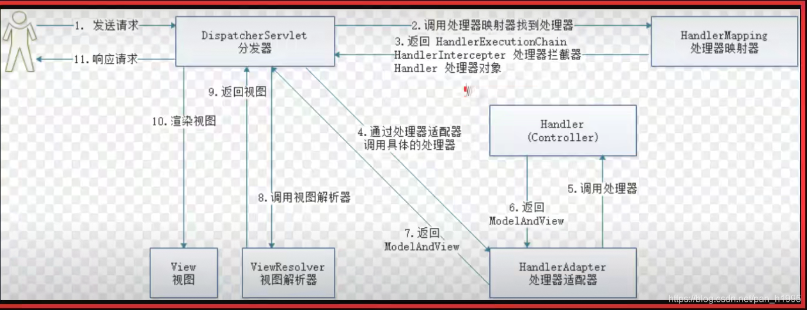
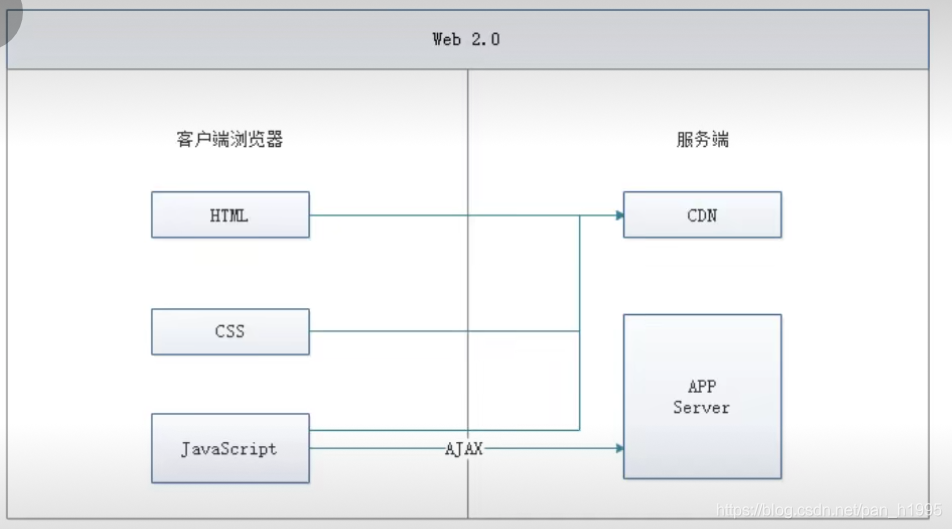
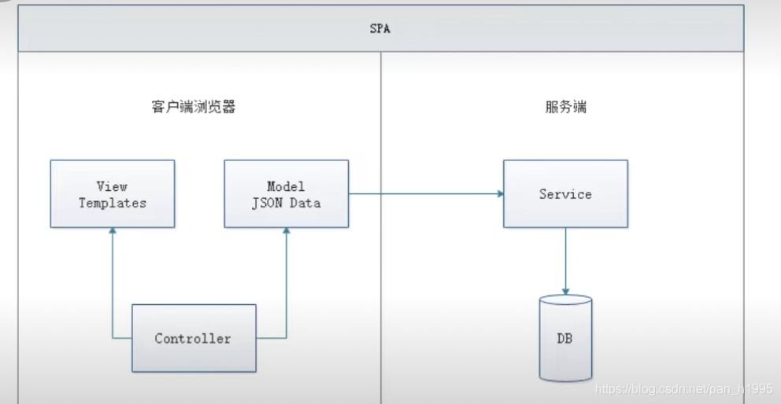
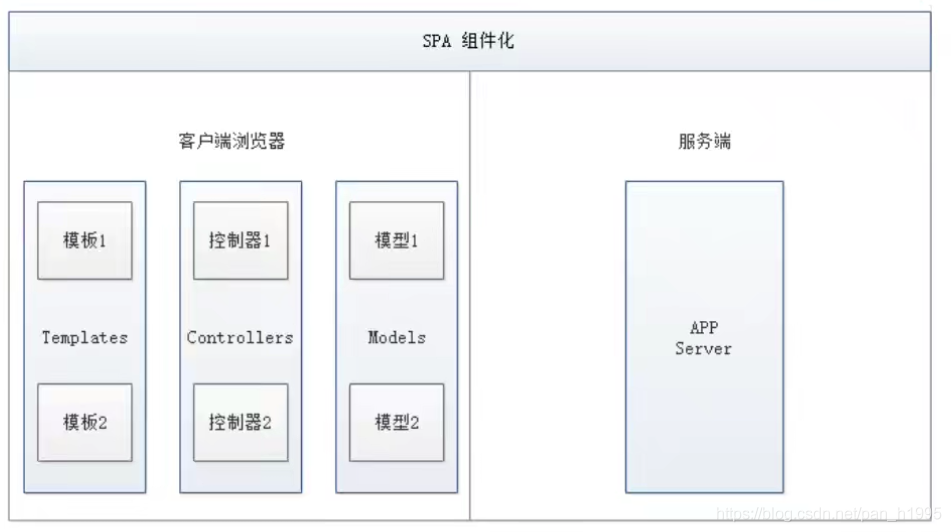
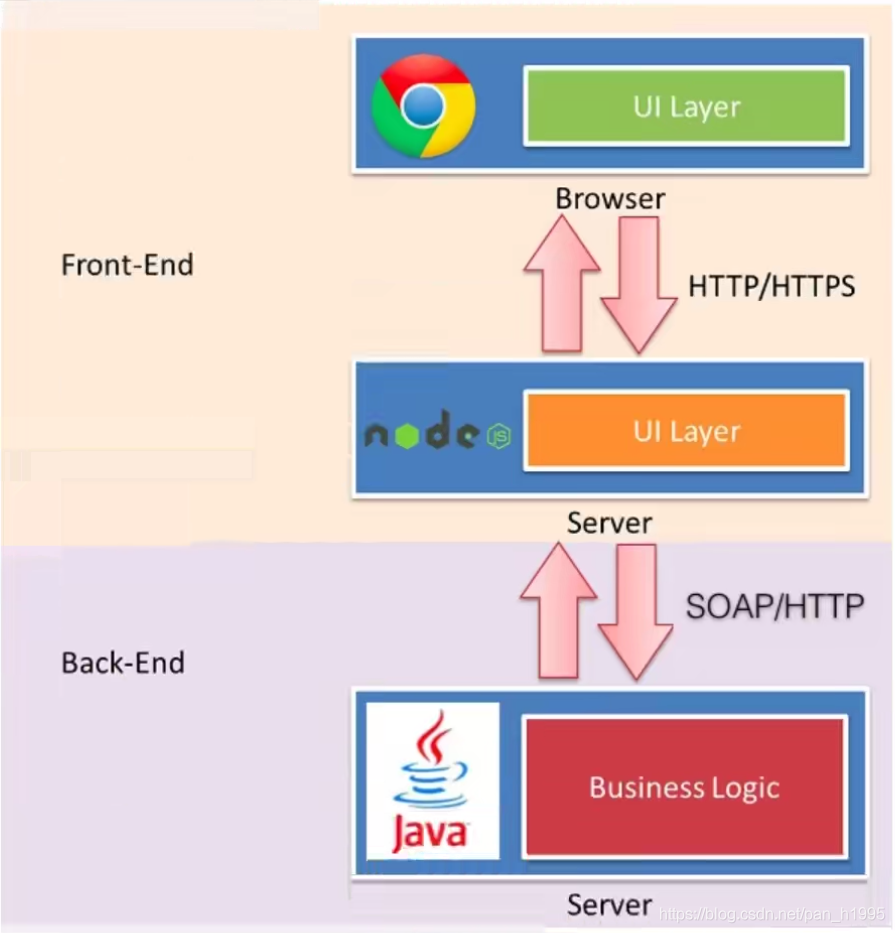
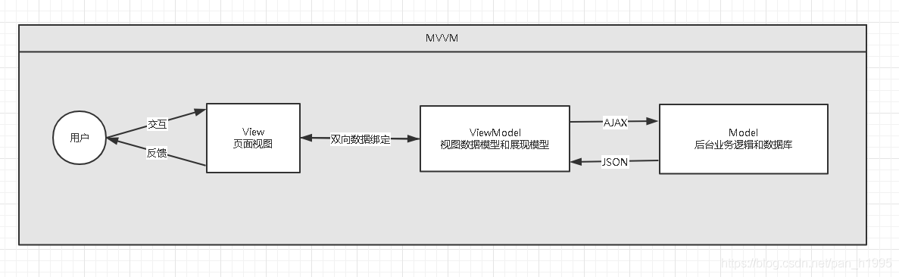
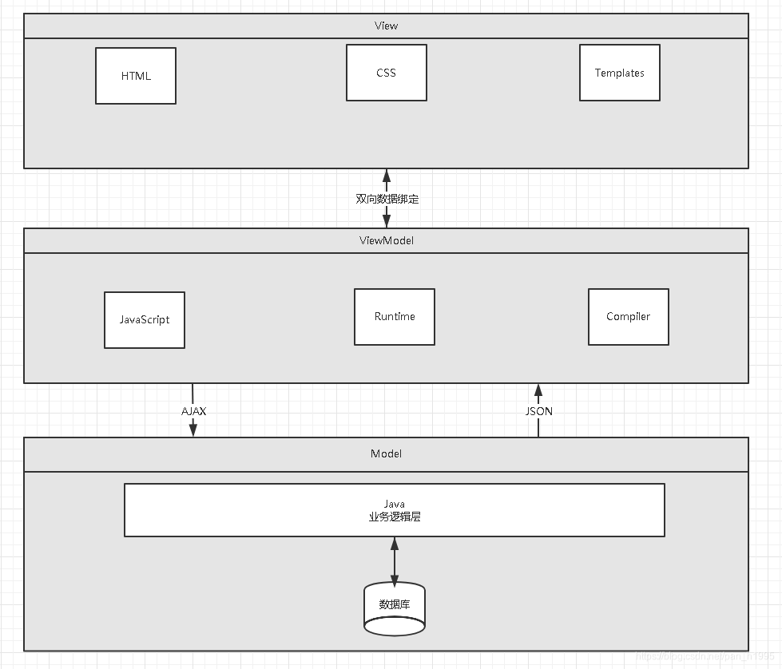
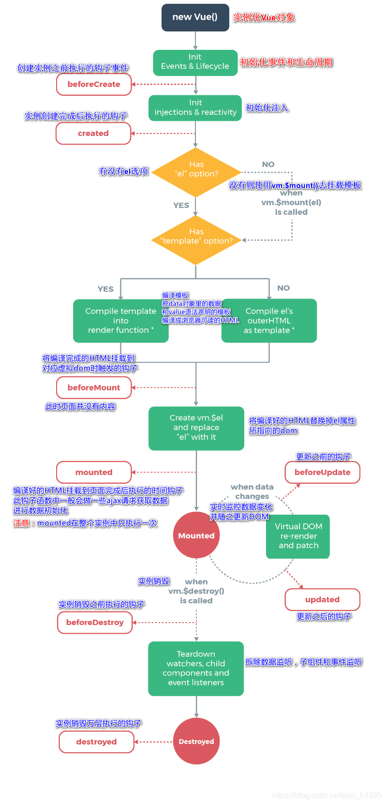

## **一、前端核心分析**

### **1.1、概述**

**SOC原则：关注点分离原则**

Vue 的核心库只关注视图层，方便与第三方库或既有项目整合。

HTML + CSS + JS : 视图 ： 给用户看，刷新后台给的数据

网络通信 ： axios

页面跳转 ： vue-router

状态管理：vuex

Vue-UI : ICE , Element UI

### **1.2、前端三要素**

- HTML（结构）：超文本标记语言（Hyper Text Markup Language），决定网页的结构和内容
- CSS（表现）：层叠样式表（Cascading Style Sheets），设定网页的表现样式。
- JavaScript（行为）：是一种弱类型脚本语言，其源码不需经过编译，而是由浏览器解释运行，用于控制网页的行为

### **1.3、结构层（HTML）**

略

### **1.4、表现层（CSS）**

CSS层叠样式表是一门标记语言，并不是编程语言，因此不可以自定义变量，不可以引用等，换句话说就是不具备任何语法支持，它主要缺陷如下：

- 语法不够强大，比如**无法嵌套书写**，导致模块化开发中需要书写很多重复的选择器；
- **没有变量和合理的样式复用机制**，使得逻辑上相关的属性值必须以字面量的形式重复输出，导致**难以维护**；这就导致了我们在工作中无端增加了许多工作量。为了解决这个问题，前端开发人员会使用一种称之为【CSS预处理器】的工具,提供CSS缺失的样式层复用机制、减少冗余代码，提高样式代码的可维护性。大大的提高了前端在样式上的开发效率。

什么是**CSS预处理器:**

CSS预处理器定义了一种新的语言，其基本思想是，用一种专门的编程语言，为CSS增加了一些编程的特性，将CSS作为目标生成文件，然后开发者就只需要使用这种语言进行CSS的编码工作。转化成通俗易懂的话来说就是“用一种专门的编程语言，进行Web页面样式设计，再通过编译器转化为正常的CSS文件，以供项目使用”。

常用的CSS预处理器有哪些

- SASS：基于Ruby ，通过服务端处理，功能强大。解析效率高。需要学习Ruby语言，上手难度高于LESS。
- LESS：基于NodeJS，通过客户端处理，使用简单。功能比SASS简单，解析效率也低于SASS，但在实际开发中足够了，所以如果我们后台人员如果需要的话，建议使用LESS。

### **1.5、行为层（JavaScript）**

JavaScript**一门弱类型脚本语言，其源代码在发往客户端运行之前不需要经过编译，而是将文本格式的字符代码发送给浏览器，由浏览器解释运行。**

Native 原生JS开发

原生JS开发，也就是让我们按照【ECMAScript】标准的开发方式，简称ES，特点是所有浏览器都支持。截至到当前，ES标准以发布如下版本：

- ES3
- ES4（内部，未正式发布）
- ES5（全浏览器支持）
- ES6（常用，当前主流版本：webpack打包成为ES5支持）
- ES7
- ES8
- ES9（草案阶段）

区别就是逐步增加新特性。

TypeScript 微软的标准

TypeScript是一种由微软开发的自由和开源的编程语言。它是JavaScript的一个超集， 而且本质上向这个语言添加了可选的静态类型和基于类的面向对象编程。由安德斯·海尔斯伯格(C#、Delphi、TypeScript之父；  .NET创立者)  主导。该语言的特点就是除了具备ES的特性之外还纳入了许多不在标准范围内的新特性，所以会导致很多浏览器不能直接支持TypeScript语法，  需要编译后(编译成JS) 才能被浏览器正确执行。

**JavaScript框架**

- JQuery：大家熟知的JavaScript库，优点就是简化了DOM操作，缺点就是DOM操作太频繁，影响前端性能；在前端眼里使用它仅仅是为了兼容IE6，7，8；
- Angular：Google收购的前端框架，由一群Java程序员开发，其特点是将后台的MVC模式搬到了前端并增加了**模块化开发**的理念，与微软合作，采用了TypeScript语法开发；对后台程序员友好，对前端程序员不太友好；最大的缺点是版本迭代不合理（如1代–>2 代，除了名字，基本就是两个东西；截止发表博客时已推出了Angular6）
- React：Facebook 出品，一款高性能的JS前端框架；特点是提出了新概念 【**虚拟DOM**】用于减少真实 DOM 操作，在内存中模拟 DOM操作，有效的提升了前端渲染效率；缺点是使用复杂，因为需要额外学习一门【JSX】语言；
- **Vue**：一款渐进式 JavaScript 框架，所谓渐进式就是逐步实现新特性的意思，如实现模块化开发、路由、状态管理等新特性。其特点是综合了 Angular（模块化）和React(虚拟 DOM) 的优点；
- **Axios**：前端通信框架；因为 Vue 的边界很明确，就是为了处理 DOM，所以并不具备通信能力，此时就需要额外使用一个通信框架与服务器交互；当然也可以直接选择使用jQuery 提供的AJAX 通信功能；

## **二、前端发展史**

### **2.1、UI框架**

- Ant-Design：阿里巴巴出品，基于React的UI框架
- ElementUI、iview、ice：饿了么出品，基于Vue的UI框架
- BootStrap：Teitter推出的一个用于前端开发的开源工具包
- AmazeUI：又叫“妹子UI”，一款HTML5跨屏前端框架

### **2.2、JavaScript构建工具**

- Babel：JS编译工具，主要用于浏览器不支持的ES新特性，比如用于编译TypeScript
- WebPack：模块打包器，主要作用就是打包、压缩、合并及按序加载
- 注：以上知识点已将WebApp开发所需技能全部梳理完毕

### **2.3、三端同一**

混合开发（Hybrid App）

主要目的是实现一套代码三端统一（PC、Android：.apk、iOS：.ipa）并能够调用到设备底层硬件（如：传感器、GPS、摄像头等），打包方式主要有以下两种：

- 云打包：HBuild -> HBuildX，DCloud 出品；API Cloud
- 本地打包： Cordova（前身是 PhoneGap）

微信小程序

详见微信官网，这里就是介绍一个方便微信小程序UI开发的框架：WeUI

- **YARN：NPM的替代方案，类似于Maven和Gradle的关系**

### **2.5、主流前端框架**

#### Vue.js

iView

iview是一个强大的基于Vue的UI库， 有很多实用的基础组件比element ui的组件更丰富，  主要服务于PC界面的中后台产品。使用单文件的Vue组件化开发模式基于npm+webpack+babel开发， 支持ES  2015高质量、功能丰富友好的API， 自由灵活地使用空间。

**备注：属于前端主流框架，选型时可考虑使用，主要特点是移动端支持较多**

#### Element UI

Element是饿了么前端开源维护的Vue UI组件库， 组件齐全， 基本涵盖后台所需的所有组件，文档讲解详细， 例子也很丰富。主要用于开发PC端的页面， 是一个质量比较高的Vue UI组件库。
·官网地址
·Git hub
**·vue-element-admin (必学、必会)**
备注：属于前端主流框架，选型时可考虑使用，主要特点是桌面端支持较多

#### ICE

飞冰是阿里巴巴团队基于React/Angular/Vue的中后台应用解决方案， 在阿里巴巴内部， 已经有270多个来自几乎所有BU的项目在使用。飞冰包含了一条从设计端到开发端的完整链路，帮助用户快速搭建属于自己的中后台应用。

备注：主要组件还是以React为主， 截止2019年02月17日更新博客前对Vue的支持还不太完善，目前尚处于观望阶段

#### VantUI

Vant UI是有赞前端团队基于有赞统一的规范实现的Vue组件库， 提供了-整套UI基础组件和业务组件。通过Vant， 可以快速搭建出风格统一的页面，提升开发效率。

#### AtUI

at-ui是一款基于Vue 2.x的前端UI组件库， 主要用于快速开发PC网站产品。它提供了一套n pm+web pack+babel前端开发工作流程， CSS样式独立， 即使采用不同的框架实现都能保持统一的UI风格。
·官网地址
·Git hub

#### Cube Ul

cube-ui是滴滴团队开发的基于Vue js实现的精致移动端组件库。支持按需引入和后编译， 轻量灵活；扩展性强，可以方便地基于现有组件实现二次开发。

- 官网地址
- Github

混合开发

#### Flutter

Flutter是谷歌的移动端UI框架， 可在极短的时间内构建Android和iOS上高质量的原生级应用。Flutter可与现有代码一起工作， 它被世界各地的开发者和组织使用， 并且Flutter是免费和开源的。

- 官网地址

Github
**备注：Google出品， 主要特点是快速构建原生APP应用程序， 如做混合应用该框架为必选框架**
lonic

lonic既是一个CSS框架也是一个Javascript UI库， lonic是目前最有潜力的一款HTML  5手机应用开发框架。通过SASS构建应用程序， 它提供了很多UI组件来帮助开发者开发强大的应用。它使用JavaScript MV  VM框架和Angular JS/Vue来增强应用。提供数据的双向绑定， 使用它成为Web和移动开发者的共同选择。

#### mpvue

mpvue是美团开发的一个使用Vue.js开发小程序的前端框架，  目前支持微信小程序、百度智能小程序，头条小程序和支付宝小程序。框架基于Vue.js，  修改了的运行时框架runtime和代码编译器compiler实现， 使其可运行在小程序环境中， 从而为小程序开发引入了Vue.js开发体验。
·官网地址
·Git hub
**备注：完备的Vue开发体验， 井且支持多平台的小程序开发， 推荐使用**

#### WeUI

WeUI是一套同微信原生视觉体验一致的基础样式库， 由微信官方设计团队为微信内网页和微信小程序量身设计， 令用户的使用感知更加统一。包含button、cell、dialog、toast、article、icon等各式元素。

## **三、了解前后分离的演变史**

为什么需要前后分离

### **3.1、后端为主的MVC时代**

为了降低开发的复杂度， 以后端为出发点， 比如：Struts、Spring MVC等框架的使用， 就是后端的MVC时代；
以SpringMVC流程为例：

 

 **流程介绍:**

- 发起请求到前端控制器(Dispatcher Servlet)
- 前端控制器请求HandlerMapping查找Handler，可以根据xml配置、注解进行查找
- 处理器映射器HandlerMapping向前端控制器返回Handler
- 前端控制器调用处理器适配器去执行Handler
- 处理器适配器去执行Handler
- Handler执行完成给适配器返回ModelAndView
- 处理器适配器向前端控制器返回ModelAndView，ModelAndView是SpringMvc框架的一个底层对象，包括Model和View
- 前端控制器请求视图解析器去进行视图解析，根据逻辑视图名解析成真正的视图(JSP)
- 视图解析器向前端控制器返回View
- 前端控制器进行视图渲染，视图渲染将模型数据(在ModelAndView对象中)填充到request域
- 前端控制器向用户响应结果

**优点:** 
MVC是一个非常好的协作模式， 能够有效降低代码的耦合度从架构上能够让开发者明白代码应该写在哪里。为了让View更纯粹， 还可以使用Thyme leaf、Frree marker等模板引擎， 使模板里无法写入Java代码， 让前后端分工更加清晰。
缺点

- 前端开发重度依赖开发环境，开发效率低，这种架构下，前后端协作有两种模式：
- 第一种是前端写DEMO， 写好后， 让后端去套模板。好处是DEMO可以本地开发， 很高效。不足是还需要后端套模板，有可能套错，套完后还需要前端确定，来回沟通调整的成本比较大；
- 另一种协作模式是前端负责浏览器端的所有开发和服务器端的View层模板开发。好处是UI相关的代码都是前端去写就好，后端不用太关注，不足就是前端开发重度绑定后端环境，环境成为影响前端开发效率的重要因素。
- 前后端职责纠缠不清：模板引擎功能强大，依旧可以通过拿到的上下文变量来实现各种业务逻辑。这样，只要前端弱势一点，往往就会被后端要求在模板层写出不少业务代码，还有一个很大的灰色地带是Controller， 页面路由等功能本应该是前端最关注的，  但却是由后端来实现。Controller本身与Model往往也会纠缠不清，看了让人咬牙的业务代码经常会出现在Controller层。这些问题不能全归结于程序员的素养， 否则JSP就够了。
- 对前端发挥的局限性：性能优化如果只在前端做空间非常有限，于是我们经常需要后端合作，但由于后端框架限制，我们很难使用[Comet】、【Big Pipe】等技术方案来优化性能。

**注：在这期间(2005年以前) ， 包括早期的JSP、PHP可以称之为Web 1.0时代。在这里想说一句，  如果你是一名Java初学者， 请你不要再把一些陈旧的技术当回事了， 比如JSP，  因为时代在变、技术在变、什么都在变(引用扎克伯格的一句话：唯一不变的是变化本身)；当我们去给大学做实训时，有些同学会认为我们没有讲什么干货，其实不然，只能说是你认知里的干货对于市场来说早就过时了而已**

### **3.2、基于Ajax带来的SPA时代**

时间回到2005年A OAX(Asynchronous JavaScript And XML，  异步JavaScript和XML，老技术新用法)被正式提出并开始使用CDN作为静态资源存储，  于是出现了JavaScript王者归来(在这之前JS都是用来在网页上贴狗皮膏药广告的) 的SPA(Single Page  Application) 单页面应用时代。



**优点**
这种模式下， ***\*前后端的分工非常清晰， 前后端的关键协作点是AJAX接口。\****看起来是如此美妙， 但回过头来看看的话， 这与JSP时代区别不大。复杂度从服务端的JSP里移到了浏览器的JavaScript，浏览器端变得很复杂。类似Spring MVC， 这个时代开始出现**浏览器端的分层架构：**



 

**缺点**

- 前后端接口的约定：如果后端的接口一塌糊涂，如果后端的业务模型不够稳定，那么前端开发会很痛苦；不少团队也有类似尝试，通过接口规则、接口平台等方式来做。有了和后端一起沉淀的接口规则，还可以用来模拟数据，使得前后端可以在约定接口后实现高效并行开发。
- 前端开发的复杂度控制：SPA应用大多以功能交互型为主，JavaScript代码过十万行很正常。大量JS代码的组织，与View层的绑定等，都不是容易的事情。

### **3.3、前端为主的MV\*时代**

此处的MV*模式如下：

- MVC(同步通信为主) ：Model、View、Controller

- MVP(异步通信为主) ：Model、View、Presenter

- **MVVM(异步通信为主)：Model、View、View Model为了降低前端开发复杂度，涌现了大量的前端框架，比如：Angular JS、React、Vue.js、Ember JS等， 这些框架总的原则是先按类型分层， 比如Templates、Controllers、Models， 然后再在层内做切分**，如下图：

  

   

   


**优点**

- 前后端职责很清晰：前端工作在浏览器端，后端工作在服务端。清晰的分工，可以让开发并行，测试数据的模拟不难， 前端可以本地开发。后端则可以专注于业务逻辑的处理， 输出RESTful等接口。
- 前端开发的复杂度可控：前端代码很重，但合理的分层，让前端代码能各司其职。这一块蛮有意思的，简单如模板特性的选择，就有很多很多讲究。并非越强大越好，限制什么，留下哪些自由，代码应该如何组织，所有这一切设计，得花一本书的厚度去说明。
- 部署相对独立：可以快速改进产品体验

**缺点**

- 代码不能复用。比如后端依旧需要对数据做各种校验，校验逻辑无法复用浏览器端的代码。如果可以复用，那么后端的数据校验可以相对简单化。
- 全异步， 对SEO不利。往往还需要服务端做同步渲染的降级方案。
- 性能并非最佳，特别是移动互联网环境下。
- SPA不能满足所有需求， 依旧存在大量多页面应用。URL Design需要后端配合， 前端无法完全掌控。

### **3.4、Node JS带来的全栈时代**

前端为主的MV*模式解决了很多很多问题， 但如上所述， 依旧存在不少不足之处。随着Node JS的兴起， JavaScript开始有能力运行在服务端。这意味着可以有一种新的研发模式：

 

在这种研发模式下，前后端的职责很清晰。对前端来说，两个UI层各司其职：

- Front-end Ul layer处理浏览器层的展现逻辑。通过CSS渲染样式， 通过JavaScript添加交互功能， HTML的生成也可以放在这层， 具体看应用场景。
- Back-end Ul layer处理路由、模板、数据获取、Cookie等。通过路由， 前端终于可以自主把控URL Design，  这样无论是单页面应用还是多页面应用， 前端都可以自由调控。后端也终于可以摆脱对展现的强关注，转而可以专心于业务逻辑层的开发。通过Node，  WebServer层也是JavaScript代码， 这意味着部分代码可前后复用，  需要SEO的场景可以在服务端同步渲染，由于异步请求太多导致的性能问题也可以通过服务端来缓解。前一种模式的不足，通过这种模式几乎都能完美解决掉。与JSP模式相比， 全栈模式看起来是一种回归， 也的确是一种向原始开发模式的回归， 不过是一种螺旋上升式的回归。基于Node JS的全栈模式， 依旧面临很多挑战：
- 需要前端对服务端编程有更进一步的认识。比如TCP/IP等网络知识的掌握。
- Node JS层与Java层的高效通信。Node JS模式下， 都在服务器端， RESTful HTTP通信未必高效， 通过SOAP等方式通信更高效。一切需要在验证中前行。
- 对部著、运维层面的熟练了解，需要更多知识点和实操经验。
- 大量历史遗留问题如何过渡。这可能是最大最大的阻力。
- 注：看到这里，相信很多同学就可以理解，为什么我总在课堂上说：**“前端想学后台很难**，而我们后端程序员学任何东西都很简单”；就是因为我们后端程序员具备相对完善的知识体系。

全栈!So Easy!

### **3.5、总结**

综上所述，模式也好，技术也罢，没有好坏优劣之分，只有适合不适合；前后分离的开发思想主要是基于**SOC(关注度分离原则)**，上面种种模式，都是让前后端的职责更清晰，分工更合理高效。


## 四、⭐MV VM

### **4.1、什么是MVVM**

MVVM（Model-View-ViewModel）是一种软件设计模式，由微软WPF（用于替代WinForm，以前就是用这个技术开发桌面应用程序的）和Silverlight（类似于Java Applet，简单点说就是在浏览器上运行WPF）的架构师Ken Cooper和Ted  Peters开发，是一种简化用户界面的事件驱动编程方式。由John  Gossman（同样也是WPF和Sliverlight的架构师）与2005年在他的博客上发表。

**MVVM源自于经典的MVC（Model-View-Controller）模式**。MVVM的核心是**ViewModel层**，负责转换Model中的数据对象来让数据变得更容易管理和使用。其作用如下：

- **该层向上与视图层进行双向数据绑定**
- **向下与Model层通过接口请求进行数据交互**



MVVM已经相当成熟了，主要运用但不仅仅在网络应用程序开发中。当下流行的MVVM框架有Vue.js，Angular JS

### **4.2、为什么要使用MVVM**

MVVM模式和MVC模式一样，主要目的是分离视图（View）和模型（Model），有几大好处

- 低耦合：视图（View）可以独立于Model变化和修改，一个ViewModel可以绑定到不同的View上，当View变化的时候Model可以不变，当Model变化的时候View也可以不变。

- 可复用：你可以把一些视图逻辑放在一个ViewModel里面，让很多View重用这段视图逻辑。

- 独立开发：开发人员可以专注于业务逻辑和数据的开发（ViewMode），设计人员可以专注于页面设计。

- 可测试：界面素来是比较难以测试的，而现在测试可以针对ViewModel来写。

  

**（1）View**

**View是视图层**， 也就是用户界面。前端主要由HTH L和csS来构建， 为了更方便地展现vi eu to  del或者Hodel层的数据， 已经产生了各种各样的前后端模板语言， 比如FreeMarker，Thyme leaf等等， 各大MV  VM框架如Vue.js.Angular JS， EJS等也都有自己用来构建用户界面的内置模板语言。

**（2）Model**

**Model是指数据模型**， 泛指后端进行的各种业务逻辑处理和数据操控， 主要围绕数据库系统展开。这里的难点主要在于需要和前端约定统一的接口规则

**（3）ViewModel**

**ViewModel**是由前端开发人员组织生成和维护的**视图数据层**。在这一层， 前端开发者对从后端获取的Model数据进行转换处理， 做二次封装， 以生成符合View层使用预期的视图数据模型。
   需要注意的是View Model所封装出来的数据模型包括视图的状态和行为两部分， 而Model层的数据模型是只包含状态的

- 比如页面的这一块展示什么，那一块展示什么这些都属于视图状态(展示)
- 页面加载进来时发生什么，点击这一块发生什么，这一块滚动时发生什么这些都属于视图行为(交互)

视图状态和行为都封装在了View Model里。这样的封装使得View Model可以完整地去描述View层。**由于实现了双向绑定，  View Model的内容会实时展现在View层**， 这是激动人心的， 因为前端开发者再也不必低效又麻烦地通过操纵DOM去更新视图。
   MVVM框架已经把最脏最累的一块做好了， 我们开发者只需要处理和维护View Model， 更新数据视图就会自动得到相应更新，真正实现**事件驱动编程**。
   **View层展现的不是Model层的数据， 而是ViewModel的数据， 由ViewModel负责与Model层交互，获取和更新数据， 这就完全解耦了View层和Model层， 这个解耦是至关重要的， 它是前后端分离方案实施的重要一环。**

### **4.3、Vue**

Vue(读音/vju/， 类似于view) 是一套用于构建用户界面的**渐进式框架**， 发布于2014年2月。与其它大型框架不同的是， Vue被设计为可以自底向上逐层应用。**Vue的核心库只关注视图层**， 不仅易于上手， 还便于与第三方库(如：vue-router，vue-resource，vue x) 或既有项目整合。

#### MVVM模式的实现者

- Model：模型层， 在这里表示JavaScript对象
- View：视图层， 在这里表示DOM(HTML操作的元素)
- ViewModel：连接视图和数据的中间件， **Vue.js就是MVVM中的View Model层的实现者**

在MVVM架构中， 是不允许数据和视图直接通信的， 只能通过ViewModel来通信， 而View Model就是定义了一个Observer观察者

- ViewModel能够观察到数据的变化， 并对视图对应的内容进行更新
- ViewModel能够监听到视图的变化， 并能够通知数据发生改变

至此， 我们就明白了， Vue.js就是一个MV VM的实现者， 他的核心就是实现了DOM监听与数据绑定

#### Vue.js的优点

- 轻量级， 体积小是一个重要指标。Vue.js压缩后有只有20多kb(Angular压缩后56kb+，React压缩后44kb+)
- 移动优先。更适合移动端， 比如移动端的Touch事件
- 易上手，学习曲线平稳，文档齐全
- 吸取了Angular(模块化) 和React(虚拟DOＭ) 的长处， 并拥有自己独特的功能，如：计算属性
- 开源，社区活跃度高

#### 第一个vue程序

编写前应导入 vue 的插件

vue的下载地址

- https：//yuejs.org/js/vue.js
- https：//vuejs.org/js/vue.min.js       【压缩版】

cdn连接

- <script src="https://cdn.jsdelivr.net/npm/vue@2.5.21/dist/vue.js"></script>
  
  <script src="https://cdn.jsdelivr.net/npm/vue@2.5.21/dist/vue.min.js"></script>


1、 创建一个 html文件

```html
<!DOCTYPE html>
<html lang="en">
<head>
    <meta charset="UTF-8">
    <title>Title</title>
</head>

<!-- 导入vue.js 包-->
<script src="https://cdn.jsdelivr.net/npm/vue@2.5.21/dist/vue.min.js"></script>

<body>

    <!-- 视图层-->
    <div class="hello">
        {{message}}
    </div>
</body>
```


2、 导入vue.js

3、 创建一个vue 对象

```javascript
<script>

    let vm =  new Vue({
        el: ".hello",

        // 模型中的数据
        data: {
            message: "hello, Vue!"
        }
    })
</script>
```

4、测试

为了能够更直观的体验Vue带来的数据绑定功能， 我们需要在浏览器测试一番， 操作流程如下：
   1、在浏览器上运行第一个Vue应用程序， 进入开发者工具
   2、在控制台输入vm.message=‘HelloWorld’， 然后回车， 你会发现浏览器中显示的内容会直接变成HelloWorld,   此时就可以在控制台直接输入vm.message来修改值， 中间是可以省略data的， 在这个操作中， **我们并没有主动操作DOM，  就让页面的内容发生了变化， 这就是借助了Vue的数据绑定功能实现的**； MV VM模式中要求View  Model层就是使用观察者模式来实现数据的监听与绑定， 以做到数据与视图的快速响应。


## 五、Vue的基本语法

### v-bind

v-bind: 可以**使用v-bind来绑定元素特性!**

使用方法: 

```html
<!DOCTYPE html>
<html lang="en">
<head>
    <meta charset="UTF-8">
    <title>Title</title>
</head>
<!-- 导入vue.js 包-->
<script src="https://cdn.jsdelivr.net/npm/vue@2.5.21/dist/vue.min.js"></script>
<body>

    <div class="div">
        <!-- v-bind 指令 用于绑定data中的数据 -->
        <span v-bind:title="message">
            鼠标悬停几秒钟查看此处动态绑定的提示信息！
        </span>
    </div>

</body>
<script>
    let vm = new Vue({
        el: ".div",
        data: {
            message: "hello"
        }
    })
</script>
</html>
```


### v-if-else

条件判断

使用方法: 

```html
<!DOCTYPE html>
<html lang="en">
<head>
    <meta charset="UTF-8">
    <title>Title</title>
</head>
<!-- 导入vue.js 包-->
<script src="https://cdn.jsdelivr.net/npm/vue@2.5.21/dist/vue.min.js"></script>
<body>

    <div class="flag">
        <div v-if="type === 'A' "> hello, world!</div>
        <div v-else-if="type === 'B' ">你好, 你好</div>
        <div v-else-if="type === 'C' ">你在干什么呢?</div>
    </div>        
</body>
<script>
    let vm = new Vue({
        el: ".flag",
        data: {
            type: "A"
        }
    })
</script>
</html>
```


### v-for

注意: `items`是数组:[ ]，`item`是数组元素迭代的别名。我们之后学习的Thymeleaf模板引擎的语法和这个十分的相似！

```html
<!DOCTYPE html>
<html lang="en">
<head>
    <meta charset="UTF-8">
    <title>Title</title>
</head>
<!-- 导入vue.js 包-->
<script src="https://cdn.jsdelivr.net/npm/vue@2.5.21/dist/vue.min.js"></script>
<body>

    <div class="div">
        <!--  v-for 中的 items为数组名, item 为每个数组中的元素-->
        <li v-for="(item, index) in items">
            {{item}} - {{index}}
        </li>
    </div>
</body>
<script>
    let vm = new Vue({
        el: ".div",
        data: {
            // 数组使用 []   对象使用 {}
            items: [
                {message: "李华"},
                {message: "小鱼"},
                {message: "韩梅"},
                {message: "smith"}
            ]
        }
    })
</script>
</html>
```


### v-on

`v-on`监听事件: 
事件有Vue的事件、和前端页面本身的一些事件!我们这里的`click`是vue的事件， 可以绑定到Vue中的`methods`中的方法事件!

```html
<!DOCTYPE html>
<html lang="en" xmlns:v-on="http://www.w3.org/1999/xhtml">
<head>
    <meta charset="UTF-8">
    <title>Title</title>
</head>
<!-- 导入vue.js 包-->
<script src="https://cdn.jsdelivr.net/npm/vue@2.5.21/dist/vue.min.js"></script>
<body>

    <div >
        <button class="btn" v-on:click="hello" >点击我</button>
    </div>

</body>
<script>
    let vm = new Vue({
        el: ".btn",
        data: {
            message: "hello",
        },
        methods: {
            hello: function () {
                alert(this.message)
            }
        }
    })
</script>
</html>
```


## 六、表单的双绑和vue组件

### 什么是双向数据绑定

Vue.js是一个MV VM框架， 即数据双向绑定， 即当数据发生变化的时候， 视图也就发生变化， **当视图发生变化的时候，数据也会跟着同步变化**。这也算是Vue.js的精髓之处了。
  值得注意的是，我们所说的数据双向绑定，一定是对于UI控件来说的, 非UI控件不会涉及到数据双向绑定。单向数据绑定是使用状态管理工具的前提。如果我们使用vue x那么数据流也是单项的，这时就会和双向数据绑定有冲突。

**为什么要实现数据的双向绑定**

在Vue.js中，如果使用vuex， 实际上数据还是单向的， 之所以说是数据双向绑定，这是用的UI控件来说， 对于我们处理表单，  Vue.js的双向数据绑定用起来就特别舒服了。即两者并不互斥，在全局性数据流使用单项，方便跟踪；局部性数据流使用双向，简单易操作。


### 在表单中使用双向数据绑定

你可以用`v-model`指令在表单、及元素上创建双向数据绑定。它会根据控件类型自动选取正确的方法来更新元素。尽管有些神奇， 但v-model本质上不过是语法糖。它负责监听用户的输入事件以更新数据，并对一些极端场景进行一些特殊处理。
  注意：**v-model**会忽略所有表单元素的value、checked、selected特性的初始值而总是**将Vue实例的数据作为数据来源**。你应该通过JavaScript在组件的data选项中声明初始值!

#### 单行文本

```html
<!DOCTYPE html>
<html lang="en">
<head>
    <meta charset="UTF-8">
    <title>Title</title>
    <!-- 导入vue.js 包-->
    <script src="https://cdn.jsdelivr.net/npm/vue@2.5.21/dist/vue.min.js"></script>
</head>
<body>

    <!-- 输入框的双向绑定 -->
    <div class="app">
        <input type="text" v-model="message">  {{message}}
    </div>

</body>
<script>
    let vm = new Vue({
        el: ".app",
        data: {
            message: "111"
        }
    })
</script>
</html>
```


#### 单选按钮

```html
<!DOCTYPE html>
<html lang="en">
<head>
    <meta charset="UTF-8">
    <title>Title</title>
    <!-- 导入vue.js 包-->
    <script src="https://cdn.jsdelivr.net/npm/vue@2.5.21/dist/vue.min.js"></script>
</head>
<body>
    <!-- 单选按钮的双向绑定 -->
    <div class="app">
        性别:
        <input type="radio" value="男" name="sex" v-model="message"> 男
        <input type="radio" value="女" name="sex" v-model="message" >  女
        选择的是: {{message}}
    </div>
</body>
<script>

    let vm = new Vue({
        el: ".app",
        data: {
            message: ""
        }
    })
</script>
</html>
```


#### ⭐下拉框

```html
<!DOCTYPE html>
<html lang="en">
<head>
    <meta charset="UTF-8">
    <title>Title</title>
    <!-- 导入vue.js 包-->
    <script src="https://cdn.jsdelivr.net/npm/vue@2.5.21/dist/vue.min.js"></script>
</head>
<body>
    <!-- 下拉框的双向绑定 -->
    <div class="app">
        <label>
            <select v-model="message">
                <option disabled value="">请选择:</option>
                <option>A</option>
                <option>B</option>
                <option>C</option>
            </select>
        </label>
        <span>value: {{message}}</span>
    </div>
</body>
<script>
    let vm = new Vue({
        el: ".app",
        data: {
            message: ""
        }
    })
</script>
</html>
```

注意：`v-model`表达式的初始值未能匹配任何选项，元系将被渲染为“未选中”状态。 在iOS中， 这会使用户无法选择第一个选项，因为这样的情况下，iOS不会触发`change`事件。因此，更推荐像上面这样提供一个值为空的禁用选项。


### ⭐组件

组件的基本使用: 

```html
<!DOCTYPE html>
<html lang="en">
<head>
    <meta charset="UTF-8">
    <title>Title</title>
    <!-- 导入vue.js 包-->
    <script src="https://cdn.jsdelivr.net/npm/vue@2.5.21/dist/vue.min.js"></script>
</head>
<body>
    <div class="app">
        <xiaoyu v-for="item in items" v-bind:a="item"></xiaoyu>
    </div>
</body>
<script>
    //定义一个vue 组件(标签)  xiaoyu 为组件名
    Vue.component("xiaoyu", {
        //接收v-bind 的值
        props: ["a"],
        // template: 为模板
        template: "<li>{{a}}</li>"
    })
  
    let vm = new Vue({
        el: ".app",
        data: {
            items: ["java", "linux", "javascript"]
        }
    })
</script>
</html>
```

说明:  

- `v-for="item in items"`：遍历Vue实例中定义的名为items的数组，并创建同等数量的组件
-  给组件中传值使用组件中的 `props`属性,   并使用`v-bind`来绑定


## 七、Axios 异步通信

### 什么是Axios

**xios是一个开源的可以用在浏览器端和Node JS的异步通信框架**， 主要作用就是实现AJAX异步通信，其功能特点如下：

　　**从浏览器中创建XMLHttpRequests**
　　**从node.js创建http请求**
　　**支持Promise API[JS中链式编程]**
　　**拦截请求和响应**
　　**转换请求数据和响应数据**
　　**取消请求**
　　**自动转换JSON数据**
　　**客户端支持防御XSRF(跨站请求伪造)**

GitHub：https://github.com/axios/axios
中文文档：http://www.axios-js.com/

### 为什么要使用Axios

由于Vue.js是一个视图层框架并且作者(尤雨溪) 严格准守SOC(**关注度分离原则**)所以Vue.js并不包含AJAX的通信功能，  为了解决通信问题， 作者单独开发了一个名为vue-resource的插件，  不过在进入2.0版本以后停止了对该插件的维护并推荐了Axios框架。**少用jQuery， 因为它操作Dom太频繁!**


### Axios的使用

模拟json数据

```json
{
  "name": "小鱼",
  "url": "https://www.baidu.com/",
  "page": 1,
  "isNonProfit": true,
  "address": {
    "street": "人名路",
    "city": "陕西西安",
    "country": "中国"
  },

  "links": [
    {
      "name": "小鱼",
      "url": "https://space.bilibili.com/222572177?spm_id_from=333.788.0.0"
    },
    {
      "name": "百度",
      "url": "https://www.baidu.com/"
    }
  ]
}
```


```html
<!DOCTYPE html>
<html lang="en">
<head>
    <meta charset="UTF-8">
    <title>Title</title>
    <!-- 导入vue.js 包-->
    <script src="https://cdn.jsdelivr.net/npm/vue@2.5.21/dist/vue.min.js"></script>
    <!-- 导入 axios 包-->
    <script src="https://cdn.jsdelivr.net/npm/axios/dist/axios.min.js"></script>
</head>
<body>
    <div class="app">
        <div>{{info.name}}</div> <br/>
        <a v-bind:href="info.url">这是一个链接</a> <br/>
        {{info.address.city}}  
    </div>
</body>
<script>
    let vm = new Vue({
        el: ".app",
        //接收 请求到的数据
        data: {
            // 返回的数据会 被 info 这个属性接收
            info: []
        },
        // 在data ()方法 或者 data属性里面都可以绑定返回来的json数据
   /*
        data() {
            return {
                info: []
            }
        },
    */
        mounted() {  //钩子函数
               // 请求的url                          将响应的数据返回到 data的info里
            axios("../data.json").then(response => (this.info = response.data))
        }
        // 想学剑宗是要有天赋的 令狐冲能学独孤九剑也是气宗基础在那
    })
</script>
</html>
```


### Vue的生命周期

官方文档：https://cn.vuejs.org/v2/guide/instance.html#生命周期图示
  Vue实例有一个完整的生命周期，也就是从开始创建**初始化数据、编译模板、挂载DOM、渲染一更新一渲染、卸载**等一系列过程，我们称这是Vue的生命周期。通俗说就是Vue实例从创建到销毁的过程，就是生命周期。
  在Vue的整个生命周期中，它提供了一系列的事件，可以让我们在事件触发时注册JS方法，可以让我们用自己注册的JS方法控制整个大局，在这些事件响应方法中的this直接指向的是Vue的实例。




## 八、⭐计算属性、内容分发、自定义事件

### 计算属性

#### 什么是计算属性

计算属性的重点突出在`属性`两个字上(属性是名词)，首先它是个`属性`其次这个属性有`计算`的能力(计算是动词)，这里的`计算`就是个函数：简单点说，它就是一个能够将计算结果缓存起来的属性(将行为转化成了静态的属性)，可以想象为缓存!

案例: 

```html
<!DOCTYPE html>
<html lang="en">
<head>
    <meta charset="UTF-8">
    <title>Title</title>
</head>
<!-- 导入vue.js 包-->
<script src="https://cdn.jsdelivr.net/npm/vue@2.5.21/dist/vue.min.js"></script>
<body>
    <div class="app">
        <p>{{getTime()}}</p>
        <p>{{getTime2}}</p>
    </div>
</body>
<script>

    let vm = new Vue( {
        el: ".app",
        data: {
            message: 123,

        },
        // 普通的方法
        methods: {
            getTime: function () {
                return Date.now()
            }
        },
        // 计算属性: 会将 计算得到的值, 放在内存中, 已节约浏览器的开销, 类似于缓存
        computed: {
            getTime2: function () {
                return Date.now()
            }
        }
    })
</script>
</html>
```

说明: 

- **注意：methods和computed里的函数不能重名**
- methods：定义方法， 调用方法使用currentTime1()， 需要带括号
- computed：定义计算属性， 调用属性使用getTime2， 不需要带括号：this.message是为了能够让currentTime2观察到数据变化而变化
- 调用方法时，每次都需要讲行计算，既然有计算过程则必定产生系统开销，那如果这个结果是不经常变化的呢?此时就可以考虑将这个结果缓存起来，采用计算属性可以很方便的做到这点，**计算属性的主要特性就是为了将不经常变化的计算结果进行缓存，以节约我们的系统开销；**


### 内容分发

说明：我们的todo-title和todo-list组件分别被分发到了todo组件的todo-title和todo-items插槽中


```html
<!DOCTYPE html>
<html lang="en">
<head>
    <meta charset="UTF-8">
    <title>Title</title>
</head>
<!-- 导入vue.js 包-->
<script src="https://cdn.jsdelivr.net/npm/vue@2.5.21/dist/vue.min.js"></script>
<body>
    <div class="app">
        <todo>
            <todo-title slot="todo-title" :title="t"></todo-title>
            <todo-list slot="todo-list" v-for="(item, index) in l" :list="item" :index="index"></todo-list>
        </todo>
    </div>
</body>
<script>

    //定义一个组件
    Vue.component("todo", {
        //模板
        //slot 中的name 可以将 插槽与组件 绑定
        template:   "<div> " +
                       " <slot name='todo-title'></slot>" +
                        "<ul>" +
                            "<slot name='todo-list'></slot>" +
                        "</ul>" +
                    "</div>"
    })

    Vue.component("todo-title", {
        //得到绑定的数据
        props: ['title'],
        //模板
        template: "<div>{{title}}</div>"
    })

    Vue.component("todo-list", {
        props: ['list', 'index'],
        template: "<div>{{index}} -- {{list}}</div>",
    })
    new Vue( {
        el: ".app",
        data: {
            t: "数据列表",
            l: ["java", "python", "linux"]
        }
    })
</script>
</html>
```


### 自定义事件


```html
<!DOCTYPE html>
<html lang="en">
<head>
    <meta charset="UTF-8">
    <title>Title</title>
</head>
<!-- 导入vue.js 包-->
<script src="https://cdn.jsdelivr.net/npm/vue@2.5.21/dist/vue.min.js"></script>
<body>
    <div class="app">
        <todo>
            <todo-title slot="todo-title" :title="t"></todo-title>
            <!-- @rem 为事件绑定-->
            <todo-list slot="todo-list" v-for="(item, index) in l" :list="item"
                       :index="index"  @rem="removeItem(index)" ></todo-list>
        </todo>
    </div>
</body>
<script>

    //定义一个组件
    Vue.component("todo", {
        //模板
        //slot 中的name 可以将 插槽与组件 绑定
        template:   "<div> " +
                       " <slot name='todo-title'></slot>" +
                        "<ul>" +
                            "<slot name='todo-list'></slot>" +
                        "</ul>" +
                    "</div>"
    })

    Vue.component("todo-title", {
        //得到绑定的数据
        props: ['title'],
        //模板
        template: "<div>{{title}}</div>"
    })

    Vue.component("todo-list", {
        props: ['list', 'index'],
        template: "<div>{{index}} -- {{list}}  &nbsp; <button @click='remove'>删除</button></div>",
        methods: {
            remove: function (index) {
                // 自定义事件分发, 将rem 绑定的事件分发到这里
                this.$emit("rem", index)
            }
        }
    })
    let vm =  new Vue( {
        el: ".app",
        data: {
            t: "数据列表",
            l: ["java", "python", "linux"]
        },
        methods: {
            removeItem: function (index) {
                console.log("删除第" + index + "个元素成功")
                this.l.splice(index, 1)  //删除从index开始的一个元素,  也就是只删除index 下标的元素
            }
        }
    })
</script>
</html>
```


## 九、🍓Vue入门总结

核心：数据驱动，组件化

优点：借鉴了A**ngularJS的模块化开发**和**React的虚拟Dom**，虚拟Dom就是把Demo操作放到内存中执行；

常用的属性：

　　v-if
　　v-else-if
　　v-else
　　v-for
　　v-on绑定事件，简写 `@`
　　v-model数据双向绑定
　　v-bind给组件绑定参数，简写 `：`

组件化：

- 组合组件slot插槽
- 组件内部绑定事件需要使用到**`this.$emit("事件名",参数);`**
- 计算属性的特色，缓存计算数据

遵循SoC关注度分离原则，Vue是纯粹的视图框架，并不包含，比如Ajax之类的通信功能，为了解决通信问题，我们需要使用Axios框架做异步通信；

### 说明

Vue的开发都是要**基于NodeJS**，实际开发采用**Vue-cli**脚手架开发，vue-router路由，vuex做状态管理；Vue UI，界面我们一般使用ElementUI（饿了么出品），或者ICE（阿里巴巴出品）来快速搭建前端项目~~

官网：

- ElementUI: https://element.eleme.cn/#/zh-CN
- ICE: https://ice.work/

## 十、vue-cli

### 什么是vue-cli

 **vue-cli**官方提供的一个**脚手架**，用于**快速生成一个vue的项目模板**；
  预先定义好的目录结构及基础代码，就好比咱们在创建Maven项目时可以选择创建一个骨架项目，这个骨架项目就是脚手架，我们的开发更加的快速

**项目的功能**

- 统一的目录结构
- 本地调试
- 热部署
- 单元测试
- 集成打包上线

### 需要的环境

vue-cli 基于node.js 因此需要安装 NodeJs

注意:

-  `安装全程使用 管理员cmd 窗口`
- 可能存在点击暂停下载,  因此需要关闭 cmd窗口的 快速编辑模式 

#### 安装NodeJs

这里可以使用 nvm 来安装nodejs

**nvm:  可以控制和使用nodejs 的版本**

详细可以查看: https://www.jb51.net/article/202124.htm

nvm下载地址: 选则https://github.com/coreybutler/nvm-windows/releases/download/1.1.7/nvm-setup.zip 


　　Node.js：http://nodejs.cn/download/
　　安装就是无脑的下一步就好，安装在自己的环境目录下
　　Git：https://git-scm.com/doenloads
　　镜像：https://npm.taobao.org/mirrors/git-for-windows/

确认nodejs安装成功：

　　cmd下输入node -v，查看是否能够正确打印出版本号即可！
　　cmd下输入npm -v，查看是否能够正确打印出版本号即可！

#### 安装 cnpm

　**npm: 就是一个软件包管理工具**，就和linux下的apt软件安装差不多！
**安装Node.js淘宝镜像加速器（cnpm）**这样的话，下载会快很多~

```sh
# -g 就是全局安装
npm install cnpm -g

# 或着使用如下语句解决npm速度慢的问题
npm install --registry=https://registry.npm.taobao.org
```

安装的过程可能有点慢~，耐心等待！虽然安装了cnpm，但是尽量少用！
安装的位置：`C:\Users\联想\AppData\Roaming\npm`


#### 安装 Vue-cli

```sh
cnpm instal1 vue-cli-g  

#上面的命令如果使用不成功, 则可以使用下面的命令
cnpm install -g vue-cli 

#测试是否安装成功,  查看可以基于哪些模板创建vue应用程序，通常我们选择webpack
vue list
```


### 第一个 Vue -cli 程序

我们需要 创建一个基于webpack模板的vue应用程序,  webpack可以进行让程序打包等一系列操作

1. 使用`管理员的cmd窗口`进入到 需要创建 项目的文件目录下, 这里在e盘 下

   ```sh
   e:
   cd E:\StudyProgramming\MyCode\Vue
   ```

   

2. 输入以下命令,  来初始化一个名为 myvue 的webpack项目

   ```sh
   vue init webpack myvue
   ```

   

3. 一路 选择no 即可初始化完成

   

    **说明：**

   - Project name：项目名称，默认回车即可
   - Project description：项目描述，默认回车即可
   - Author：项目作者，默认回车即可
   - Install vue-router：是否安装vue-router，选择n不安装（后期需要再手动添加）
   - Use ESLint to lint your code:是否使用ESLint做代码检查，选择n不安装（后期需要再手动添加)
   - Set up unit tests:单元测试相关，选择n不安装（后期需要再手动添加）
   - Setupe2etests with Nightwatch：单元测试相关，选择n不安装（后期需要再手动添加）
   - Should we run npm install for you after the,project has been created:创建完成后直接初始化，选择n，我们手动执行；运行结果

4. 进入到项目的文件目录下, 安装项目依赖

   ```sh
   cd vue-cli
   npm install  #安装项目的依赖
   ```

   

5. 运行

   ```bash
   npm run dev 
   
   # 若使用vue3.x, 则使用下面的命令 
   npm run serve
   ```

   

 

## 十一、webpack

### 什么是Webpack

本质上， webpack是一个现代JavaScript应用程序的**静态模块打包器**(module  bundler) 。当webpack处理应用程序时， 它会递归地构建一个依赖关系图(dependency graph) ，  其中包含应用程序需要的每个模块， 然后将所有这些模块打包成一个或多个bundle.
  Webpack是当下最热门的前端资源模块化管理和打包工具，  它可以将许多松散耦合的模块按照依赖和规则打包成符合生产环境部署的前端资源。还可以将按需加载的模块进行代码分离，等到实际需要时再异步加载。通过loader转换， 任何形式的资源都可以当做模块， 比如Commons JS、AMD、ES 6、CSS、JSON、Coffee Script、LESS等；
  伴随着移动互联网的大潮， 当今越来越多的网站已经从网页模式进化到了WebApp模式。它们运行在现代浏览器里， 使用HTML 5、CSS 3、ES  6等新的技术来开发丰富的功能， 网页已经不仅仅是完成浏览器的基本需求； WebApp通常是一个SPA(单页面应用) ，  **每一个视图通过异步(ajax、axios)的方式加载**，这导致页面初始化和使用过程中会加载越来越多的JS代码，这给前端的开发流程和资源组织带来了巨大挑战。
  前端开发和其他开发工作的主要区别，首先是前端基于多语言、多层次的编码和组织工作，其次前端产品的交付是基于浏览器的，这些资源是通过增量加载的方式运行到浏览器端，如何在开发环境组织好这些碎片化的代码和资源，并且保证他们在浏览器端快速、优雅的加载和更新，就需要一个模块化系统，这个理想中的模块化系统是前端工程师多年来一直探索的难题。


### ❌模块化的演进

#### Script标签

```html
<script src = "module1.js"></script>
<script src = "module2.js"></script>
<script src = "module3.js"></script>
```

这是最原始的JavaScript文件加载方式，如果把每一个文件看做是一个模块，那么他们的接口通常是暴露在全局作用域下，也就是定义在window对象中，不同模块的调用都是一个作用域。

这种原始的加载方式暴露了一些显而易见的弊端：

- 全局作用域下容易造成变量冲突
- 文件只能按照`<script>`的书写顺序进行加载
- 开发人员必须主观解决模块和代码库的依赖关系
- 在大型项目中各种资源难以管理，长期积累的问题导致代码库混乱不堪

#### CommonsJS

服务器端的NodeJS遵循CommonsJS规范，该规范核心思想是允许模块通过require方法来同步加载所需依赖的其它模块，然后通过exports或module.exports来导出需要暴露的接口。

```javascript
require("module");
require("../module.js");
export.doStuff = function(){};
module.exports = someValue;
```

优点：

- 服务器端模块便于重用
- NPM中已经有超过45万个可以使用的模块包

- 简单易用

缺点：

- 同步的模块加载方式不适合在浏览器环境中，同步意味着阻塞加载，浏览器资源是异步加载的
- 不能非阻塞的并行加载多个模块

实现方式：

- 服务端的NodeJS
- Browserify，浏览器端的CommonsJS实现，可以使用NPM的模块，但是编译打包后的文件体积较大
- modules-webmake，类似Browserify，但不如Browserify灵活
- wreq，Browserify的前身

#### AMD

Asynchronous Module  Definition规范其实主要一个主要接口define(id?,dependencies?,factory);它要在声明模块的时候指定所有的依赖dependencies，并且还要当做形参传到factory中，对于依赖的模块提前执行。

```javascript
define("module",["dep1","dep2"],functian(d1,d2){
    return someExportedValue;
});
require（["module","../file.js"],function(module，file){});
1234
```

优点

- 适合在浏览器环境中异步加载模块
- 可以并行加载多个模块

缺点

- 提高了开发成本，代码的阅读和书写比较困难，模块定义方式的语义不畅
- 不符合通用的模块化思维方式，是一种妥协的实现

实现方式

- RequireJS
- curl

#### CMD

Commons Module Definition规范和AMD很相似，尽保持简单，并与CommonsJS和NodeJS的Modules规范保持了很大的兼容性。

```javascript
define(function(require,exports,module){
    var $=require("jquery");
    var Spinning = require("./spinning");
    exports.doSomething = ...;
    module.exports=...;
});
```

优点：

- 依赖就近，延迟执行
- 可以很容易在NodeJS中运行缺点
- 依赖SPM打包，模块的加载逻辑偏重

实现方式

- Sea.js
- coolie

#### ES6模块

EcmaScript 6标准增加了JavaScript语言层面的模块体系定义。ES 6模块的设计思想， 是尽量静态化， 使编译时就能确定模块的依赖关系， 以及输入和输出的变量。Commons JS和AMD模块，都只能在运行时确定这些东西。

```javascript
import "jquery"
export function doStuff(){}
module "localModule"{}
```

优点

- 容易进行静态分析
- 面向未来的Ecma Script标准

缺点

- 原生浏览器端还没有实现该标准
- 全新的命令，新版的Node JS才支持

实现方式

- Babel

**大家期望的模块**
  系统可以兼容多种模块风格， 尽量可以利用已有的代码， 不仅仅只是JavaScript模块化， 还有CSS、图片、字体等资源也需要模块化。


### ✅webpack安装

WebPack是一款模块加载器兼打包工具， 它能把各种资源， 如JS、JSX、ES 6、SASS、LESS、图片等都作模块来处理和使用。
安装：

```sh
npm install webpack -g   #打包工具
npm install webpack-cli -g  #客户端
```

测试安装是否成功

- `webpack -v`
- `webpack-cli -v`


### ⭐webpack使用

**webpack.config.js配置文件**

配置说明: 

- entry：入口文件， 指定Web Pack用哪个文件作为项目的入口
- output：输出， 指定WebPack把处理完成的文件放置到指定路径
- module：模块， 用于处理各种类型的文件
- plugins：插件， 如：热更新、代码重用等
- resolve：设置路径指向
- watch：监听， 用于设置文件改动后直接打包

```javascript
/**
 * 打包配置信息
 */
//将模块导出
module.exports = {
    entry:"",
    output:{
        path:"",
        filename:""
    },
    module:{
        loaders:[
            {test:/\.js$/,;\loade:""}
        ]
    },
    plugins:{},
    resolve:{},
    watch:true
}
```


#### 使用webpack

1、创建一个名为modules的目录，用于放置JS模块等资源文件

2、在modules下创建模块文件，如hello.js，用于编写JS模块相关代码

```javascript
//暴露一个方法
exports.hello = function () {
    document.writeln("<h2>hello,world!</h2>")
}
```


3、　在modules下创建一个名为main.js的入口文件，用于打包时设置entry属性

```javascript
/**
 * 程序的入口
 */

//将hello.js文件导入  可以理解为: 让名为 hi的的对象接收 hello类, 这样可以使用hello.js中所有暴露的方法
let hi = require("./hello")
hi.hello()
```


4、　在**项目根目录下**创建**webpack.config.js**配置文件, 注意: `路径和文件不能错误!!!`

```javascript
/**
 * 打包配置信息
 */

//将模块导出
module.exports = {
    // 程序的入口
    entry: "./modules/main.js",
    // 打包后, 输出打包文件的位置
    mode: "development" ,
    output: {
        filename: "./js/bundle.js"
    }
}
```


5、使用webpack命令打包

6、在项目根目录下创建index.html文件, 导入打包的文件

```html
<!DOCTYPE html>
<html lang="en">
<head>
    <meta charset="UTF-8">
    <title>Title</title>
</head>
<script src="/dist/js/bundle.js"></script>
<body>

</body>
</html>
```


**说明**： 热部署的打包命令

```sh
# 参数--watch 用于监听变化
webpack --watch
```


#### 使用webpack错误: 

  1、**webpack : 无法加载文件** C:\Users\ASUS\AppData\Roaming\npm\webpack.ps1，因为在此系统上禁止运行   脚本。有关详细信息

以管理员身份打开  Windows PowerShell , 并输入`set-ExecutionPolicy RemoteSigned` 选择A即可

2、`ERROR in Entry module not found: Error: Can‘t resolve ‘./src‘ in ‘E:\fengxun\IDEA\vue\webpack-stud`

解决办法: 

- 检查 entry 配置的路径是否出错
- 检查 webpack.config.js 的路径是否出错，**webpack.config.js 必须是放在根目录下**
- 检查配置文件文件名是否出错，**是 webpack.config.js** 而不是 webpack-config.js
- 如果是 v4.0.0 以上版本的 webpack，可以不使用配置文件配置 webpack ，使用官网推荐的使用 ./src/index.js 作为入口点


## 十二、vue-router

### 什么是router

**Vue Router是Vue.js官方的路由管理器**。它和Vue.js的核心深度集成， 让构建单页面应用变得易如反掌。包含的功能有：

- 嵌套的路由/视图表　
- 模块化的、基于组件的路由配置　
- 路由参数、查询、通配符　　
- 基于Vue js过渡系统的视图过渡效果
- 细粒度的导航控制
- 带有自动激活的CSS class的链接
- HTML5 历史模式或hash模式， 在IE 9中自动降级　
- 自定义的滚动行为


### 安装vue-router

vue-router基于vue-cli搭建的脚手架, 因此使用前面搭建好的 myvue进行

在项目的文件夹下, 使用以下命令来安装vue-router

```sh
npm install vue-router --save-dev

#如果报错, 则可以使用如下命令: 
npm install vue-router@3.1.3 --save-dev
```

### vue-router案例

1、删除myvue项目中 无用的文件

2、在src目录下, 新建components 存放vue组件, 并定义一个content组件和 main组件

Content组件

```vue
<template>
    <h1 class="h">这是一个内容页面</h1>
</template>

<script>
export default {
    name: "Content"
}
</script>

<!-- scoped 作用域, 表示样式只会在这个组件中有效, 其他组件中无效 -->
<style scoped>
    .h{
        color: skyblue;
    }
</style>
```


Main组件

```vue
<template>
    <h1>这是主页面</h1>
</template>

<script>
export default {
    name: "Main"
}
</script>

<style scoped>
</style>
```


3、在src目录下,  新建router文件夹和index.js用来存放路由配置信息,

```javascript
import Vue from "vue";

// 从node_modules 导入 VueRouter
import VueRouter from "vue-router";

import Content from "../components/Content";
import Main from "../components/Main";

/**
 * 路由配置
 */

//显示的声明使用 vue-router
Vue.use(VueRouter)

//配置导出router(路由)
export default new VueRouter({

    //路由可以配置多个, 因此为数组
    routes: [{
            //路由路径
            path: "/content",
            name: "content",  //可以省略
            //跳转的组件
            component: Content
        },
        {
            path: "/main",
            name: "main",      
            component: Main
        }]
})
```


4、在main.js中引入路由配置

```javascript
// 从node_modules 导入vue, 类似于java导包
import Vue from 'vue';

//导入当前目录下的app.vue 文件
import App from './App';

//导入路由所在的包, 自动扫描里面的路由配置
import router from './router';

Vue.config.productionTip = false

/**
 * 程序的入口
 */

//vue实例
new Vue({
    el: '#app',
    router,
    components: {App},
    template: '<App/>'
})
```


5、 在App.vue中使用路由

```vue
<!-- 模板-->
<template>
    <div id="app">
        <h1>Vue-Router</h1>
        <router-link to="/main">首页</router-link>
        <router-link to="/content">内容页面</router-link>

        <!-- 展示跳转页面的视图 -->
        <router-view></router-view>
    </div>
</template>

<script>
 //暴露文件, 以便其他文件可以导入
    export default {
        name: 'App',
    }
</script>

<!-- 样式 -->
<style>
    #app {
        font-family: 'Avenir', Helvetica, Arial, sans-serif;
        -webkit-font-smoothing: antialiased;
        -moz-osx-font-smoothing: grayscale;
        text-align: center;
        color: #2c3e50;
        margin-top: 60px;
    }
</style>
```


6、 使用`npm run dev`运行项目并测试


## 十三、Vue + ElementUI


### npm命令

**Npm命令解释**：

　　**npm install moduleName：**安装模块到项目目录下
　　**npm install -g moduleName：**-g的意思是将模块安装到全局，具体安装到磁盘哪个位置要看npm config prefix的位置
　　**npm install -save moduleName：**–save的意思是将模块安装到项目目录下， 并在package文件的dependencies节点写入依赖，-S为该命令的缩写
　　**npm install -save-dev moduleName:**–save-dev的意思是将模块安装到项目目录下，并在package文件的devDependencies节点写入依赖，-D为该命令的缩写


### 项目案例

1、使用`管理员的cmd窗口`进入到 需要创建 项目的文件目录下

```sh
e:
cd E:\StudyProgramming\MyCode\Vue
```


2、输入以下命令,  来初始化一个名为 vue-elementui的webpack项目

```sh
vue init webpack vue-elementui
#进入项目的目录下
cd vue-elementui

#安装vue-router、element-ui、sass-loader
#安装vue-routern 
npm install --legacy-peer-deps vue-router@3.5.2
#安装element-ui
npm i element-ui -S 
#安装依赖
npm install
# 安装SASS加载器
cnpm install sass-loader node-sass --save-dev  

#启功测试
npm run dev
```


4、将项目中无用的文件删除, 在src中建立文件夹

- assets：用于存放资源文件
- components：用于存放Vue功能组件
- views：用于存放Vue视图组件
- router：用于存放vue-router配置


5、在view 中创建一个 main.vue视图组件

```vue
<template>
    <div>
        首页
    </div>
</template>

<script>
export default {
    name: "Main"
}
</script>
```

在view中创建名为login.vue登录页面组件,   el-*的元素为ElementUI组件；

```vue
<template>
    <div>
        <el-form ref="loginForm" :model="form" :rules="rules" label-width="80px" class="login-box">
            <h3 class="login-title">欢迎登录</h3>
            <el-form-item label="账号" prop="username">
                <el-input type="text" placeholder="请输入账号" v-model="form.username"/>
            </el-form-item>
            <el-form-item label="密码" prop="password">
                <el-input type="password" placeholder="请输入密码" v-model="form.password"/>
            </el-form-item>
            <el-form-item>
                <el-button type="primary" v-on:click="onsubmit('loginForm')">登录</el-button>
            </el-form-item>
        </el-form>

        <el-dialog title="温馨提示" :visible.sync="dialogVisiable" width="30%" :before-close="handleClose">
            <span>请输入账号和密码</span>
            <span slot="footer" class="dialog-footer">
              <el-button type="primary" @click="dialogVisible = false">确定</el-button>
            </span>
        </el-dialog>
    </div>
</template>

<script>
export default {
    name: "Login",
    data(){
        return{
            form:{
                username:'',
                password:''
            },
            //表单验证，需要在 el-form-item 元素中增加prop属性
            rules:{
                username:[
                    {required:true,message:"账号不可为空",trigger:"blur"}
                ],
                password:[
                    {required:true,message:"密码不可为空",tigger:"blur"}
                ]
            },

            //对话框显示和隐藏
            dialogVisible:false
        }
    },
    methods:{
        onSubmit(formName){
            //为表单绑定验证功能
            this.$refs[formName].validate((valid)=>{
                if(valid){
                    //使用vue-router路由到指定界面，该方式称为编程式导航
                    this.$router.push('/main');
                }else{
                    this.dialogVisible=true;
                    return false;
                }
            });
        }
    }
}
</script>

<style  scoped>
.login-box{
    border:1px solid #DCDFE6;
    width: 350px;
    margin:180px auto;
    padding: 35px 35px 15px 35px;
    border-radius: 5px;
    -webkit-border-radius: 5px;
    -moz-border-radius: 5px;
    box-shadow: 0 0 25px #909399;
}
.login-title{
    text-align:center;
    margin: 0 auto 40px auto;
    color: #303133;
}
</style>
```

在router中创建index.js文件为路由配置文件

```javascript
import VueRouter from "vue-router";
import Vue from "vue";
import Login from "../view/Login";
import Main from "../view/Main";


Vue.use(VueRouter)

export default new VueRouter({
    routes: [{
        path: "/login",
        component: Login
    },
    {
        path: "/main",
        component: Main
    }]

})
```

​	

在程序入口main.js 使用路由和 elementui

```javascript 
import App from './App'
import Vue from "vue";

import router from './router'

//导入elementui 和 css , css需要使用sass编辑器
import ElementUI from 'element-ui';
import 'element-ui/lib/theme-chalk/index.css';

Vue.use(ElementUI)

new Vue({
  el: '#app',
  router,
  render: h => h(App)  //ElementUi官方写法
})

```


6、 使用命令`npm run dev`来运行项目


说明： 如果出现错误: 可能是因为sass-loader的版本过高导致的编译错误 ，可以去package.json文件中把sass-loder的版本降低，也有可能是node-sass版本过高，看报错内容修改相应的版本

## 十四、路由嵌套

嵌套路由又称**子路由**，在实际应用中，通常由多层嵌套的组件组合而成。

### 案例

依据vue + elementui案例来完成

1、 在view中新建 user包, 用来存放用户相关的组件

List.vue

```vue
<template>
    <h1>用户列表</h1>
</template>

<script>
export default {
    name: "List"
}
</script>

```

 Profile.vue

```vue
<template>
    <h1>用户信息</h1>
</template>

<script>
export default {
    name: "Profile"
}
</script>
```


2、修改首页main.vue的视图, 使用elementui 来完成

```vue
<template>
    <div>

        <el-container>
            <el-aside width="200px">
                <el-menu :default-openeds="['1']">
                    <el-submenu index="1">
                        <template slot="title"><i class="el-icon-caret-right"></i>用户管理</template>
                        <el-menu-item-group>
                            <el-menu-item index="1-1">
                                <!--插入的地方-->
                                <router-link to="/user/profile">个人信息</router-link>
                            </el-menu-item>
                            <el-menu-item index="1-2">
                                <!--插入的地方-->
                                <router-link to="/user/list">用户列表</router-link>
                            </el-menu-item>
                        </el-menu-item-group>
                    </el-submenu>
                    <el-submenu index="2">
                        <template slot="title"><i class="el-icon-caret-right"></i>内容管理</template>
                        <el-menu-item-group>
                            <el-menu-item index="2-1">分类管理</el-menu-item>
                            <el-menu-item index="2-2">内容列表</el-menu-item>
                        </el-menu-item-group>
                    </el-submenu>
                </el-menu>
            </el-aside>

            <el-container>
                <el-header style="text-align: right; font-size: 12px">
                    <el-dropdown>
                        <i class="el-icon-setting" style="margin-right: 15px"></i>
                        <el-dropdown-menu slot="dropdown">
                            <el-dropdown-item>个人信息</el-dropdown-item>
                            <el-dropdown-item>退出登录</el-dropdown-item>
                        </el-dropdown-menu>
                    </el-dropdown>
                </el-header>


                <el-main>
                    <!--展示视图-->
                    <router-view />
                </el-main>

            </el-container>
        </el-container>
    </div>
</template>
<script>
export default {
    name: "Main"
}
</script>
<style scoped>

.el-header {
    background-color: #345b8e;
    color: #333;
    line-height: 60px;
}
.el-aside {
    color: #333;
}
</style>
```


3、在router中 添加 子路由 

```javascript
import VueRouter from "vue-router";
import Vue from "vue";
import Login from "../view/Login";
import Main from "../view/Main";

//导入子模块
import UserList from "../view/user/List";
import UserProfile from "../view/user/Profile";


Vue.use(VueRouter)

export default new VueRouter({
    routes: [{
        path: "/login",
        component: Login
    },
    {
        path: "/main",
        component: Main,
        // 子路由
        children: [
            {path: "/user/list", component: UserList},
            {path: "/user/profile", component: UserProfile}
        ]
    }]

})
```


4、测试运行


可以查看到 main.vue中 其他的组件如果需要显示在主页上,  只需要 通过`<router-view />`

## 十五、参数传递

我们经常需要把某种模式匹配到的所有路由，全都映射到同个组件。例如，我们有一个 User 组件，对于所有 ID 各不相同的用户，都要使用这个组件来渲染。此时我们就需要传递参数了；

### 组件转发

#### $route方式的参数传递

1. 修改路由配置,

   - 主要是在 path 属性中增加了 :id，:name 这样的占位符

     ```javascript
     {
         path: '/main',
             component: Main,
                 children: [
                     {
                         path: '/user/profile/:id/:name',
                         name: 'UserProfile',
                         component: UserProfile
                     },
                     {
                         path: '/user/list',
                         component: UserList
                     }
                 ]
     }
     ```

2. 传递参数

   - 此时我们将 to 改为了 :to，是为了将这一属性当成对象使用，

   - 注意 router-link 中的 name 属性名称一定要和路由中的name 属性名称 匹配，因为这样 Vue 才能找到对应的路由路径；

     ```vue
     <!--name:传组件名， params：传递参数， 需要对象： v-bind-->
     <router-link :to="{name:'UserProfile',params:{id:1,name:'小鱼'}}">个人信息</router-link>
     ```

3. 接收参数, 在目标组件中

   ```vue
   <div>
       <h1>个人信息</h1>
       {{$route.params.id}}
       {{$route.params.name}}
   </div>
   ```

#### props 的方式的参数传递

1. 修改路由配置 , 主要增加了 props: true 属性

   ```javascript
   routes: [
       {
         path: '/login',
         component: Login
       },
       {
         path: '/main',
         component: Main,
         children: [
           {
             path: '/user/profile/:id/:name',
             name: 'UserProfile',
             component: UserProfile,
             props: true
           },
           {
             path: '/user/list',
             component: UserList
           }
         ]
       }
     ]
   ```

2. 传递参数和之前一样

3. 接收参数为目标组件**增加 props 属性**

   ```vue
   <div>
       <h1>个人信息</h1>
       {{id}}
       {{name}}
   </div>
   ```

### 组件重定向

- 重定向的意思大家都明白，但 Vue 中的重定向是作用在路径不同但组件相同的情况下，比如：

  ```javascript
  {
      path: '/goHome',
      redirect: '/main'
  }
  ```

- 说明：这里定义了两个路径，一个是 /main ，一个是 /goHome

  - 其中 /goHome 重定向到了 /main 路径，由此可以看出重定向不需要定义组件；

- 使用的话，只需要设置对应路径即可；

  ```vue
  <el-menu-item index="1-3">
      <router-link to="/goHome">回到首页</router-link>
  </el-menu-item>
  ```


## 十六、路由模式与 404

### 路由模式

- hash：路径带 # 符号，如 http://localhost/#/login

  - 默认为hash路由模式

    ```javascript
    export default new Router({
      routes: []
    })
    ```

- history：路径不带 # 符号，如 http://localhost/login

  - history路由模式

    ```javascript
    export default new Router({
      mode: 'history',
      routes: []
    })
    ```

### 404

1. 创建一个名为 `NotFound.vue` 的视图组件，代码如下：

   ```vue
   <template>
       <div>
         <h1>404,你的页面走丢了</h1>
       </div>
   </template>
   
   <script>
       export default {
           name: "NotFound"
       }
   </script>
   
   <style scoped>
   
   </style>
   ```

2. 修改路由配置，代码如下：

   ```javascript
   import NotFound from '../views/NotFound'
   
   export default new Router({
     mode: 'history',
     routes: [
   	{
          path: '*',
          component: NotFound
       }
     ]
   })
   ```


## 十七、路由钩子与异步请求

### 路由钩子

- `beforeRouteEnter`：在进入路由前执

- `beforeRouteLeave`：在离开路由前执行

  ```javascript
  export default {
        name: "UserProFile",
        props: ['id','name'],
        beforeRouteEnter: (to,from,next) => {
          console.log('进入路由之前')
          next()
        },
        beforeRouteLeave: (to,from,next) => {
          console.log('进入路由之后')
          next()
        }
      }
  ```

参数说明：

- to：路由将要跳转的路径信息
- from：路径跳转前的路径信息
- next：路由的控制参数
- next() 跳入下一个页面
- next(’/path’) 改变路由的跳转方向，使其跳到另一个路由
- next(false) 返回原来的页面
- next((vm)=>{}) 仅在 beforeRouteEnter 中可用，vm 是组件实例


### 异步请求

1. 安装 Axios `cnpm install --save vue-axios`

2. `main.js`引用 Axios

   ```javascript
   import axios from 'axios'
   import VueAxios from 'vue-axios'
   
   Vue.use(VueAxios, axios)
   ```

3. 准备数据 ： 只有我们的 static 目录下的文件是可以被访问到的，所以我们就把静态文件放入该目录下`static/mock/data.json`。

   ```json
   {
     "name": "狂神说Java",
     "url": "https://blog.kuangstudy.com",
     "page": 1,
     "isNonProfit": true,
     "address": {
       "street": "含光门",
       "city": "陕西西安",
       "country": "中国"
     },
     "links": [
       {
         "name": "bilibili",
         "url": "https://space.bilibili.com/95256449"
       },
       {
         "name": "狂神说Java",
         "url": "https://blog.kuangstudy.com"
       },
       {
         "name": "百度",
         "url": "https://www.baidu.com/"
       }
     ]
   }
   ```

4. 运行项目`npm run dev`看是否正常

   - 因为cnpm可能安装失败，重新安装一下`cnpm install --save vue-axios`

5. 在 beforeRouteEnter 中进行异步请求

   ```javascript
   export default {
       name: "UserProFile",
       props: ['id','name'],
       beforeRouteEnter: (to,from,next) => {
           console.log('进入路由之前');//加载数据
           next(vm => {
               vm.getData();//进入路由之前执行getData()
           })
       },
       beforeRouteLeave: (to,from,next) => {
           console.log('进入路由之后');
           next()
       },
       methods: {
           getData() {
               this.axios({
                   method: 'get',
                   url: 'http://localhost:8080/static/mock/data.json'
               }).then((response) => {
                   console.log(response)
               })
           }
       }
   }
   ```