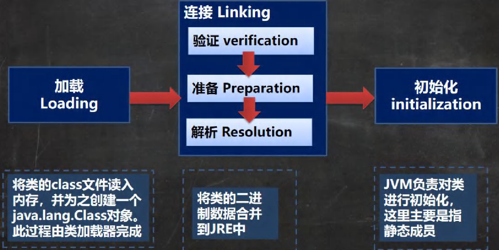

# ⭐第十二章     集合

## 一、集合的理解和好处

###### 介绍

集合主要是两组(单列集合 , 双列集合)
`Collection` 接口有两个重要的子接口 `List, Set` , 他们的实现子类都是**单列集合**
` Map` 接口的实现子类 是**双列集合，存放的 K-V**

### 集合VS数组

#### 数组

1. 长度开始时必须指定, 而且一旦指定, 不能修改
2. 保存的必须为同一类型的元素
3. 使用数组进行增加/删除 -- 比较麻烦

#### 集合

1. 可以动态保存任意多个对象, 使用比较方便
2. 提供了一系类方便的操作对象的方法:` add/remove/set/get`等
3. 使用集合添加/删除新元素的更简洁

### 集合的框架体系

java的集合类主要分为两大类, 如下图: 

Collection接口


Map接口


## 二、接口Collection

### Collection接口实现类的特点

1. collection 实现子类可以存放多个元素, 每个元素可以是Object
2. Collection的实现类,可以存放重复的元素, 有些不可以
3. Collection的实现类,有些是有序的, 有些是无序的
4. Collection接口没有直接实现的子类, 是通过它的子接口Set和List来实现方法

### Collection接口常用的方法

案例

```java
package chapter14.collection;

import java.util.ArrayList;
import java.util.List;

/**
 * @author 小鱼
 * @version 1.0
 * CollectionMethod接口的方法
 */
@SuppressWarnings("all")
public class CollectionMethod {
    public static void main(String[] args) {

        //Collection的实现类,可以存放重复的元素, 有些不可以
        //Collection的实现类,有些是有序的, 有些是无序的
        //Collection接口没有直接实现的子类, 是通过它的子接口Set和List来实现方法的
        List list = new ArrayList();
    //1. add() 添加元素
        list.add("jack");
        list.add("smith");

        list.add(10);  //这里隐藏了自动装箱
        list.add(true);
    //2. remove : 删除指定元素
        list.remove(1); //删除下表为0的元素
        list.remove(true); //删除指定的元素
        System.out.println("list" +list);
    //3. contains: 查找某个元素是否存在 返回boolean值
        System.out.println(list.contains("jack"));
    //4. size: 获取某个元素的个数
        System.out.println(list.size());
        //isEmpty:判断是否为空
        System.out.println(list.isEmpty());//F
    // clear:清空
        list.clear();
        System.out.println("list=" + list);
    // addAll:添加多个元素
        ArrayList list2 = new ArrayList();
        list2.add("红楼梦");
        list2.add("三国演义");
        list.addAll(list2);
        System.out.println("list=" + list);
    // containsAll:查找多个元素是否都存在
        System.out.println(list.containsAll(list2));//T
    // removeAll：删除多个元素
        list.add("聊斋");
        list.removeAll(list2);
        System.out.println("list=" + list);//[聊斋]
    // 说明：以 ArrayList 实现类来演示.

    }
}
```


### Collection接口遍历元素方式一 --使用Iterator迭代器

#### 基本介绍

1. Iterator对象称为迭代器, 主要用于遍历Collection集合中的元素
2. 所有实现了Collection接口的集合类都用一个iterator()方法, 用来返回一个实现了Iterator接口的对象,即可以返回一个迭代器
3. Iterator仅用于遍历集合, Iterator本身不存放对象

#### iterator迭代器的基本方法

1. hasNext(): 判断是否还有下一个元素
2. next():  下移   将下移后集合位置的元素返回

#### 使用案例:

```java
package chapter14.collection;

import java.util.ArrayList;
import java.util.Iterator;

/**
 * @author 小鱼
 * @version 1.0
 * Iterator迭代器的使用
 */
@SuppressWarnings("all")
public class CollectionIterator {
    public static void main(String[] args) {

        ArrayList arrayList = new ArrayList();
        arrayList.add(new Book("白夜行", "东野圭吾", 23));
        arrayList.add(new Book("三体", "大刘", 56));
        arrayList.add(new Book("青年文摘", "出版社", 10));

        //这里ArrayList实现了Collection接口,因此拥有了迭代器Iterator
        Iterator it = arrayList.iterator();
        while (it.hasNext()) {  //使用迭代器遍历集合arrayList
            //迭代器next()方法的作用: 1. 下移 2. 将下移以后集合的位置返回
            System.out.println(it.next());
        }
        //如果需要再次遍历集合, 则需要重置迭代器(没有重置会出现NoSuchElementException的异常)
        it = arrayList.iterator();  //重置迭代器
    }
}
@SuppressWarnings("all")
class Book {
    private String name;
    private String author;
    private double price;

    public Book(String name, String author, double price) {
        this.name = name;
        this.author = author;
        this.price = price;
    }

    @Override
    public String toString() {
        return "Book{" +
                "name='" + name + '\'' +
                ", author='" + author + '\'' +
                ", price=" + price +
                '}';
    }
}
```

### Collection接口遍历元素方式二   -->    增强for循环

#### 基本介绍

增强for循环,可以代替iterator迭代器, 增强for就是简化版的iterator, 本质一样,可以用于遍历数组和集合

#### 语法

增强for的快捷键: **对象名. for**

```java
for(元素类型 元素名: 集合名或数组名) {
    访问元素
}
```

使用案例

```java
package chapter14.collection;

import java.util.ArrayList;

/**
 * @author 小鱼
 * @version 1.0
 * 使用增强for循环遍历集合
 */
@SuppressWarnings("all")
public class CollectionForEach {
    public static void main(String[] args) {

        ArrayList arrayList = new ArrayList();
        arrayList.add(new Book("白夜行", "东野圭吾", 23));
        arrayList.add(new Book("三体", "大刘", 56));
        arrayList.add(new Book("青年文摘", "出版社", 10));
        //增强for循环, 可以代替iterator迭代器
        //增强for就是简化版的iterator, 本质一样,可以用于遍历数组和集合
        for (Object o : arrayList) {
            System.out.println(o);
        }
    }
}
```


## 三、List接口

### list接口基本介绍

List接口是Collection接口的子接口

1. List接口集合类中元素有序的(添加和顺序和取出顺序一致/ 且可重复)
2. List集合中的每个元素多**有其对应的顺序索引**,支持索引,且从0开始

#### 案例

```java
package chapter14.list;

import java.util.ArrayList;
import java.util.List;

/**
 * @author 小鱼
 * @version 1.0
 * List接口基本介绍
 */
@SuppressWarnings("all")
public class List_ {
    public static void main(String[] args) {

        List list = new ArrayList();
        //List接口特点
        //1. List接口集合类中元素有序的(添加和顺序和取出顺序一致/ 且可重复)
        list.add("jack");
        list.add("marry");
        list.add("lin");
        System.out.println("list集合= " + list);

        //2. List集合中的每个元素多有其对应的顺序索引,支持索引,且从0开始
        System.out.println(list.get(2));  //取出index为2的元素

    }
}
```

### ✅List接口的常见方法

```java
package chapter14.list;

import java.util.ArrayList;
import java.util.List;

/**
 * @author 小鱼
 * @version 1.0
 * List接口类的常用方法
 */
@SuppressWarnings("all")
public class ListMethod {
    public static void main(String[] args) {

        List list = new ArrayList();
        list.add("jack");
        list.add("marry");
        //1. 在指定位置添加元素, 在index= 1的位置添加元素
        list.add(1, "lin");
        System.out.println("list" + list);
        //2. addAll(int index, Collection elements)方法:
        // 从index位置开始将elements中的元素全部添加进来, 返回值为boolean值
        List list2 = new ArrayList();
        list2.add("小明");
        list2.add("李华");
        boolean b = list.addAll(1, list2); //将list2元素全部添加到index=1的位置
        System.out.println(b + " " + list);
        //3.获取指定位index的元素 使用get即可
        //4. indexOf(Object o): 返回o在当前集合的首次位置
        System.out.println(list.indexOf("lin"));
        //5. lastIndexOf(Object o): 返回o在当前集合的末尾位置

        //6. remove(int index): 移除index位置的元素,并返回此元素
        list.remove(0);
        //7. set(int index, Object obj): 设置指定index位置的元素为obj, 相当于替换
        list.set(1,"小梅");
        System.out.println("list= " + list);
        //8. subList(int formIndex, int toIndex):
        // 返回从fromIndex到toIndex位置的子集合,即返回一个对象 (注意左闭右开)
        List resList = list.subList(1,4);   //返回的对象值为[1,4)下标的值
        System.out.println("list3=" + resList);

    }
}
```

#### List接口练习

```java
package chapter14.list;

import java.util.ArrayList;
import java.util.Iterator;
import java.util.List;

/**
 * @author 小鱼
 * @version 1.0
 * List接口练习题
 */
@SuppressWarnings("all")
public class ListExercise {
    public static void main(String[] args) {

    /* 添加 10 个以上的元素(比如 String "hello" )，在 2 号位插入一个元素"韩顺平教育"，
    获得第 5 个元素，删除第 6 个元素，修改第 7 个元素，在使用迭代器遍历集合，
    要求:使用 List 的实现类 ArrayList 完成。*/
        List list = new ArrayList();
        for (int i = 0; i < 10; i++) {
           list.add(("hello, 你好!~" + i) );
        }
        list.add(2, "我们要好好学习");
        System.out.println(list.get(5));
        list.remove(6);
        list.set(6, "你好你好~");

        System.out.println("=====使用迭代器遍历======");
        Iterator it = list.iterator();
        while (it.hasNext()) {
            System.out.println(it.next());
        }

    }
}
```

###  实现List接口的ArrayList/LinkedList/Vector的三种遍历方式

1. 方式一: 使用iterator
2. 二: 使用增强for
3. 三: 使用普通for(把集合当做数组来处理)

#### 使用案例

```java
package chapter14.list;

import java.util.*;
/**
 * @author 小鱼
 * @version 1.0
 * 实现List接口的ArrayList/LinkedList/Vector的三种遍历方式
 */
@SuppressWarnings("all")
public class ListFor {
    public static void main(String[] args) {

        //实现了List接口的类都可以用着三中方式遍历集合
      	//List list = new ArrayList();
        //List list = new LinkedList();
        List list = new Vector();
        list.add("鱼香肉丝");
        list.add("回锅肉");
        list.add("酸菜鱼");
        list.add("水煮肉片");

        System.out.println("====使用iterator迭代器遍历=====");
        Iterator it = list.iterator();
        while (it.hasNext()){
            System.out.println(it.next());
        }
        System.out.println("=========使用增强for循环遍历========");
        for (Object o : list) {
            System.out.println(o);
        }
        System.out.println("=========使用普通for循环遍历========");
        for (int i = 0; i < list.size(); i++) {
            System.out.println(list.get(i));
        }

    }
}
```

#### 练习题

```java
package chapter14.list;

import java.util.List;
import java.util.Vector;

/**
 * @author 小鱼
 * @version 1.0
 */
@SuppressWarnings("all")
public class ListExercise02 {
    public static void main(String[] args) {

        List list = new Vector();
        list.add(new Book("三体", 45, "大刘"));
        list.add(new Book("白夜行", 30, "东野圭吾"));
        list.add(new Book("java", 88, "高斯林"));
        sort(list);
        for (Object o : list) {
            System.out.println(o);
        }

    }
    public static void  sort(List list) {
        for (int i = 0; i < list.size() - 1; i++) {
            for (int j = 0; j < list.size() - 1 - i; j++) {
                Book b1 = (Book) list.get(i);
                Book b2 = (Book) list.get(i+1);
                Book temp = null;
                if (b1.getPrice() > b2.getPrice()) {
                    list.set(i,b2);
                    list.set(i+1,b1);
                }

            }
        }

    }
}
class Book {
    private String name;
    private double price;
    private String author;

    public Book(String name, double price, String author) {
        this.name = name;
        this.price = price;
        this.author = author;
    }

    public String getName() {
        return name;
    }

    public void setName(String name) {
        this.name = name;
    }

    public double getPrice() {
        return price;
    }

    public void setPrice(double price) {
        this.price = price;
    }

    public String getAuthor() {
        return author;
    }

    public void setAuthor(String author) {
        this.author = author;
    }

    @Override
    public String toString() {
        return "名称:" + getName() + "\t\t价格: " + getPrice()
                + "\t\t作者: " + getAuthor();
    }
}
```

### ⭐ArrayList底层结构和源码

#### ArrayList的使用注意事项

1. ArrayList可以加入多个null
2. ArrayList是由数组来实现数据的存储的
3. ArrayList基本等同于Vector, 除了ArrayList存在线程安全问题(执行效率高),在多线程情况下, 不建议使用ArrayList

#### ArrayList底层源码分析

1. ArrayList中维护了一个Object类型的数组elementData

   `transient Object[] elementDate;`  transient 表示该属性不会被序列化

2. 当创建ArrayList对象时, 如果使用的是无参构造器, 则初始化elementData容量为0, 第一次添加,

   则扩容elementData为10, 如需要再次扩容, 则扩容elementData 为1.5倍

3. 如果使用的是指定大小的构造器, 则初始化elementData容量为指定大小, 如果需要扩容, 则直接扩容elementData为1.5倍

##### 使用debug实现

代码如下:

```java
package chapter14.list.arraylist;

import java.util.ArrayList;

/**
 * @author 小鱼
 * @version 1.0
 * ArrayList底层结构和源码分析
 */
@SuppressWarnings("all")
public class ArrayListDetails {
    public static void main(String[] args) {

        ArrayList list = new ArrayList();
        for (int i = 0; i < 10; i++) {
            list.add(i);
        }

        for (int i = 0; i < 5; i ++) {
            list.add(i);
        }
        list.add(100);
        list.add(true);
        list.add("hello");
    }
}
```

##### 流程图


### Vector底层结构和源码分析

#### Vector类介绍

1. Vector底层也是一个对象数组, `protected Object[] elementData;`
2. Vector底层是同步的, 即线程安全, 因为Vector类的操作方法用`synchronized`关键字
3. 当需要线程同步安全时, 考虑使用Vector

#### Vector类和ArrayList的比较

|     \     | 底层结构 |  版本  | 线程安全(同步)效率 |                           扩容倍数                           |
| :-------: | :------: | :----: | :----------------: | :----------------------------------------------------------: |
| ArrayList | 可变数组 | jdk1.2 |   不安全, 效率高   | 如果是有参构造,是1.5倍扩容   如果是无参构造器,  第一次为10, 从第二次开始变为1.5倍扩容 |
|  Vector   | 可变数组 | jdk1.0 |   安全, 效率不高   | 如果是无参, 默认扩容10, 以后直接扩容2倍.  如果指定大小, 则每次直接按2倍扩容 |

### LinkedList底层结构

#### 简单的双向链表案例

```java
package chapter14.list.linkedlist;

/**
 * @author 小鱼
 * @version 1.0
 * 简单的双向链表结构
 */
public class LinkedList {
    public static void main(String[] args) {

        //模拟一个简单的双向链表
        Node xiao = new Node("小明");
        Node jack = new Node("jack");
        Node smith = new Node("smith");

        //连接三个节点, 形成双向链表
        //1.  xiao ---> jack ---> smith
        xiao.next = jack;
        jack.next = smith;
        //2. smith --> jack --> xiao
        smith.pre = jack;
        jack.pre = xiao;
        //3. 让first 引用指向xiao, 就是双向链表的头结点
        //3. 让last 引用指向smith, 就是双向链表的尾结点
        Node first = xiao;
        Node last = smith;


        //遍历双向链表
        System.out.println("===从头开始遍历双向链表");
        while (true) {
            if (first != null) {
                System.out.println(first);
                first = first.next;
            } else break;
        }

        System.out.println("===从尾开始遍历双向链表");
        while (true) {
            if (last == null) {
                break;
            }
            System.out.println(last);
            last = last.pre;
        }

        //向双向链表添加数据/对象
        //在  小明 --- jack  之间添加一个数据
        Node liHua = new Node("李华");


        jack.next = liHua;
        liHua.next = smith;
        smith.pre = liHua;
        liHua.pre = jack;

        System.out.println(" ");
        first = xiao;  // 让first归位!!!!! 使first重新指向第一个数据,
        System.out.println("===新链表从头开始遍历====");
        while (true) {
            if (first == null)
               break;
            System.out.println(first);
            first = first.next;
        }

        last = smith;  //让last归位  重新指向最后一个数据
        System.out.println(" ");
        System.out.println("===从尾开始遍历双向链表");
        while (true) {
            if (last == null) {
                break;
            }
            System.out.println(last);
            last = last.pre;
        }


    }
}

class Node {
    public Object item; // 存放数据的属性
    public Node next;   //指向前一个节点
    public Node pre;  //指向后一个节点

    public Node(Object name) {
        this.item = name;
    }

    @Override
    public String toString() {
        return "Node{" +
                "name=" + item +
                '}';
    }
}
```

#### LinkedLIst增删改查案例

```java
package chapter14.list.linkedlist;

import java.util.Iterator;
import java.util.LinkedList;

/**
 * @author 小鱼
 * @version 1.0
 * LinkedList双向链表的增删改查
 */
@SuppressWarnings("all")
public class LinkedListCRUD {
    public static void main(String[] args) {

        LinkedList list = new LinkedList();
        //增
        list.add("hello");
        list.add(123);
        list.add("你好");

        //删除节点
        list.remove(); //这里默认删除第一个节点

        //修改某个节点
        list.set(1,"helloworld");

        //查
        list.get(1); //注意 得到的是第二个对象
        Object o = list.get(1);


        //遍历LinkedList的三种方式
        //1. 使用iterator迭代器遍历
        System.out.println("=====使用迭代器遍历====");
        Iterator it = list.iterator();
        while (it.hasNext()) {
            System.out.println(it.next());
        }

        //2. 使用增强for遍历
        System.out.println("==========使用增强for遍历=========");
        for (Object o1 : list) {
            System.out.println(o1);
        }
		//3.使用普通for遍历
        System.out.println("======使用普通for遍历====");
        for (int i = 0; i < list.size(); i++) {
            System.out.println(list.get(i));
        }

    }
}
```

使用debug来查看源码, 养成好习惯

#### ArrayList和LinkedList的区别

|            | 底层结构 | 增删的效率          | 改查的效率 |
| ---------- | -------- | ------------------- | ---------- |
| ArrayList  | 可变数组 | 较低   数组扩容     | 较高       |
| LinkedList | 双向链表 | 较高   通过链表追加 | 较低       |

##### 如何选择ArrayList和LinkedList:

1. 如果我们改查的操作多, 则使用ArrayList
2. 如果我么增删的操作多, 则使用LinkedList
3. 一般来说, 在程序中, 80-90%都是查询, 因此大部分情况选择ArrayList, 在业务中灵活选择

## 四、Set接口

### Set接口介绍

#### set接口的特点

1. **无序**(添加顺序和取出顺序不一致), **没有索引**
2. **不允许重复元素**, 所以最多含有一个null
3. Set接口常见的实现类有: TreeSet/ HashSet

#### Set接口的遍历方式

1. 使用iterator迭代器遍历
2. 使用增强for

#### Set接口常用的方法

和List接口一样, Set接口也是Collection的子接口, 因此, 常用方法和Collection接口一样

```java
package chapter14.set;

import java.util.HashSet;
import java.util.Iterator;
import java.util.Set;

/**
 * @author 小鱼
 * @version 1.0
 */
@SuppressWarnings("all")
public class Set_ {
    public static void main(String[] args) {

        Set set = new HashSet();
        //增
        set.add("hello");
        set.add(null);
        set.add("你好你好");
        set.add(null);
        set.add("hello"); //重复的数据
        //从输出的结果可以看出 Set接口的实现类 的数据是无序的,但是固定的(无论输出多少次,结果都一致 )
        // 且不允许重复(最多只有一个null)
        System.out.println("set= " + set);

        //删
        set.remove(null);

        //遍历
        System.out.println("=======使用增强for遍历======");
        Iterator iterator = set.iterator();
        while (iterator.hasNext()) {
            Object next =  iterator.next();
            System.out.println(next);
        }

        //使用增强for遍历
        for (Object o : set) {
            System.out.println(o);
        }


    }
}
```

### Set接口实现类 ---HashSet

#### HashSet介绍

- HashSet实现了Set接口
- **HashSet实际上是HashMap,** 在源码中有以下代码:

````java
public HashSet() {
    map = new HashMap<>();
}
````

- 可以存放null, 但只能有一个null
- HashSet不保证元素是有序的, 取决于hash后, 在确定索引的结果(不保证存放元素的顺序和取出顺序一致)
- 不能有重复元素/对象

#### HashSet全面说明

```java
package chapter14.set.hashset;

import java.util.HashSet;
import java.util.Set;

/**
 * @author 小鱼
 * @version 1.0
 * HashSet全面说明
 */
@SuppressWarnings("all")
public class HashSet01 {
    public static void main(String[] args) {

        //在执行add方法后, 会返回一个boolean值
        Set set = new HashSet();
        //HashSet中不能有重复元素/对象
        //注意: 当添加不同的对象时, 是可以的, String对象例外!!!
        System.out.println(set.add(new Dog("tom")));
        System.out.println(set.add(new Dog("tom")));

        System.out.println(set.add(new String("lin"54)));
        System.out.println(set.add(new String("lin")));  //String对象例外!!!
        System.out.println("set= " + set);

    }
}
class Dog {
    String name;

    public Dog(String name) {
        this.name = name;
    }

    @Override
    public String toString() {
        return
                "name='" + name + '\'' ;
    }
}
```


#### ⭐⭐HashSet底层源码解读★★★

- 1. **HashSet底层是HashMap**
  2. **当添加一个元素时,  会先通过Hash()得到hash值 --------> 会转化成索引值(也就是放在table表中的哪个位置)**
  3. **在table表中查看此索引是否有已经存放的元素**
  4. **如果没有, 则直接放入**
  5. **如果有, 调用equals方法进行比较,  若相同, 则放弃添加, 否则,添加到最后**
  6. **在java8中, 如果一条链表的元素个数到达 TREEIFY_THRESHOLD(默认为8), 并且MIN_TREEIFY_CAPACITY(默认64), 就会进行树化(转换成红黑树**)

```java
/**
 * @author 小鱼
 * @version 1.0
 * 使用debug查看hasMap源码
 */
@SuppressWarnings("all")
public class HashSet02 {
    public static void main(String[] args) {

        HashSet set = new HashSet();  //断点处
        set.add("java");
        set.add("javaScript");
        set.add("c++");
        set.add("java"); //添加同一个对象的流程
        
    }
}
```

使用debug查看源码: 流程图

##### 第一次添加数据的流程

- 调用HasMap的构造器

````java
public HashSet() {
    map = new HashMap<>();
}
````

- 执行add() 方法

```java
public boolean add(E e) {  //e为要存储的数据
    return map.put(e, PRESENT)==null;
}
```

- 执行put(), 此方法会执行hash(key) 得到对应的hash值(通过hashcode来计算出), 这个**hash值将用来算出table表中对应的索引**

```java
public V put(K key, V value) {
    return putVal(hash(key), key, value, false, true);
}
```

- 执行putVal() , 参数key为要存储的元素, value为占位的对象

##### 当添加数据为重复时的流程()

**一直到putVal()之前, 和第一次流程相同**     `!(第二次用重黑体标出)`

```java
final V putVal(int hash, K key, V value, boolean onlyIfAbsent,
               boolean evict) {
    Node<K,V>[] tab; Node<K,V> p; int n, i;
    if ((tab = table) == null || (n = tab.length) == 0)
        n = (tab = resize()).length;  //resize的结果是返回一个大小为16的数组
    if ((p = tab[i = (n - 1) & hash]) == null) //此处的(n - 1) & hash]是算出数据应该存储在table表中的位置
        tab[i] = newNode(hash, key, value, null);  //把数据key存放在tab[i]
    else {
        Node<K,V> e; K k;
   /*       如果添加重复的元素会在下面判断(第二次流程)  
             如果准备添加元素的hash值和对应索引第一个Node节点的hash值相同
             并且满足
             两者是同一个对象  或  两者equals()比较后相等    */
        if (p.hash == hash &&
            ((k = p.key) == key || (key != null && key.equals(k))))
            e = p;  //第一个节点的判断
        else if (p instanceof TreeNode) //判断是否树化
            e = ((TreeNode<K,V>)p).putTreeVal(this, tab, hash, key, value);
        else {
            for (int binCount = 0; ; ++binCount) {
                if ((e = p.next) == null) {  
                    p.next = newNode(hash, key, value, null);
                    if (binCount >= TREEIFY_THRESHOLD - 1) //判断是否需要树化
                        . 关于树化(转成红黑树)
            //如果 table 为 null ,或者大小还没有到 64，暂时不树化，而是进行扩容.
            //否则才会真正的树化 -> 剪枝()
                        treeifyBin(tab, hash);
                    break;
                }
                if (e.hash == hash &&  //判断对应索引链表的Node节点
                    ((k = e.key) == key || (key != null && key.equals(k))))
                    break;
                p = e;
            }
        }
        if (e != null) { 
            V oldValue = e.value;
            if (!onlyIfAbsent || oldValue == null)
                e.value = value;
            afterNodeAccess(e);
            return oldValue;
        }
    }
    ++modCount;
    if (++size > threshold)
        resize();
    afterNodeInsertion(evict);
    return null;  //返回null为添加元素成功
}
```

⭐经典面试题: **为什么重写equals后也要重写hashcode**

```java
if (p.hash == hash &&
            ((k = p.key) == key || (key != null && key.equals(k))))
            e = p;
```

### HashSet的子类-------LinkedHashSet

#### LinkedHashSet基本介绍

1. ****

   LinkedHashSet是HashSet的子类

2. LinkedHashSet底层是一个LinkedHashMap,底层为 **数组 + 双向链表链表**

3. LinkedHashSet根据HashCode值来决定元素的存储位置, 同时使用双向链表维护元素的次序, 这样使得元素插入和取出的顺序是一致的

4. *LinkedHashSet*是不允许添加重复元素

#### LinkedHashSet案例及说明

```java
package chapter14.set.hashset.linkedhashset;

import java.util.LinkedHashSet;
import java.util.Set;

/**
 * @author 小鱼
 * @version 1.0
 * LinkedHashSet的底层说明
 */
@SuppressWarnings("all")
public class LinkedHashSet_ {
    public static void main(String[] args) {

        Set set = new LinkedHashSet();
        set.add("hello");
        set.add("你好");
        set.add(new A("李华", 2111));
        set.add(123);
        set.add(456);
        set.add(123);
    }
}

class A {
    String name;
    int no;
    public A(String name, int no) {
        this.name = name;
        this.no = no;
    }
    @Override
    public String toString() {
        return "A{" +
                "name='" + name + '\'' +
                ", no=" + no +
                '}';
    }
}
```

##### 说明:

**debug查看**

1. **在LinkedHashMap中维护了一个hash表(table表)和双向链表(LinkedHashSet中存在head和tail, 用来标记头结点和尾结点)**
2. **每个结点都有befor(上一个节点)和after(下一个节点)属性, 这样可以形成双向链表**
3. **在添加一个元素时, 会先求出hash值, 通过hash值在求出索引, 确定该元素在table表中的位置, 然后将添加的元素加入到双向链表(如果和该位置存在元素, 判断机制和HashSet一致)**
4. **这样使得LinkedHashSet元素插入和取出的顺序是一致的**

## ⭐六、Map接口

Map接口的关系图


### map接口实现类的特点

以下为JDK8中的特点

1. Map 与 Collection 并列存在。用于保存具有映射关系的数据:**Key-Value(双列元素)**
2. **Map 中的 key 和 value 可以是任何引用类型的数据，会封装到 HashMap$Node 对象中**(Node是一个静态内部类)
3.  **Map 中的 key 不允许重复，**原因和 HashSet 一样
4.  Map 中的 value 可以重复
5.  **Map 的 key 可以为 null, value 也可以为 null ，注意 key 为 null,能有一个，value 为 null ,可以多个**
6. 常用 String 类作为 Map 的 key(也可以是其他类)
7. key 和 value 之间存在单向一.对一关系，即通过指定的 key 总能找到对应的 value

```java
package chapter14.map;

import java.util.HashMap;
import java.util.Map;
import java.util.Set;

/**
 * @author 小鱼
 * @version 1.0
 * Map接口的特点
 */
@SuppressWarnings("all")
public class Map01 {
    public static void main(String[] args) {

        Map map = new HashMap();
        //添加元素用put()方法
        map.put("001","李华"); //key - value
        map.put("001","hello"); //key重复后,不会添加元素, 但会覆盖value
        map.put("002",123);
        // Map 的 key 可以为 null, value 也可以为 null ，注意 key 为 null,能有一个，value 为 null ,可以多个
        map.put("003",null);
        map.put("004",null);
        //可以通过get方法, 传入key,会返回对应的value
        System.out.println(map.get("001"));  //hello

        System.out.println(map);

        Set set = map.entrySet();  //entrySet()方法会返回一个对象
    }
}
```

### Map接口常用的方法

```java
package chapter14.map;

import java.util.HashMap;
import java.util.Map;

/**
 * @author 小鱼
 * @version 1.0
 * Map接口的方法
 */
@SuppressWarnings("all")
public class Map02 {
    public static void main(String[] args) {

        Map map = new HashMap();
        map.put("001","李华");
        map.put("002","hello");
        map.put("003",123);
        map.put("004","你好");
        map.put("005","helloworld");
        map.put("006","我们要好好学习");
        //remove:根据键删除映射关系
        map.remove("002");
        //get：根据键获取值
        map.get("002");
        //size:获取元素个数
        map.size();
        //isEmpty:判断个数是否为 0
        map.isEmpty();
        //containsKey:查找键(key)是否存在
        System.out.println(map.containsKey("003"));
        System.out.println(map);
        //clear:清除所有的 k-v
        map.clear();
        System.out.println(map);

    }
}
```

### Map接口的六种遍历方式

```java
package chapter14.map;

import java.util.*;

/**
 * @author 小鱼
 * @version 1.0
 * Map的六大遍历方式
 */
@SuppressWarnings("all")
public class MapFor {
    public static void main(String[] args) {

        Map map = new HashMap();
        map.put("001","李华");
        map.put("002","hello");
        map.put("003",123);
        map.put("004","你好");
        map.put("005","helloWorld");
        map.put("006","我们要好好学习");

        System.out.println("=========第一种使用entrySet 的迭代器==========");
        Set set = map.entrySet();
        Iterator it = set.iterator();
        while (it.hasNext()) {
            Object obj = it.next();
            Map.Entry m = (Map.Entry) obj;
            System.out.println(m.getKey() + "-" + m.getValue());
        }
        System.out.println("\n=========第二种使用entrySet 的增强for==========");
        for (Object o : set) {
            Map.Entry m = (Map.Entry) o;
            System.out.println(m.getKey() + "-" + m.getValue());
        }

        System.out.println("\n=========第三种使用keySet() 的增强for==========");
        Set set1 = map.keySet();
        for (Object o : set1) {
            System.out.println(o + "-" + map.get(o));
        }
        System.out.println("\n=========第四种使用keySet() 的迭代器==========");
        Iterator it1 = set1.iterator();
        while (it1.hasNext()) {
            Object key =  it1.next();
            System.out.println(key + "-" + map.get(key));
        }
        System.out.println("\n=========第五种使用values 的迭代器==========");
        Collection values = map.values();
        Iterator it3 = values.iterator();
        while (it3.hasNext()) {
            Object value =  it3.next();
            System.out.println(value);
        }
        System.out.println("\n=========第六种使用keySet() 的迭代器==========");
        for (Object value : values) {
            System.out.println(value);
        }

    }
}
```

### ⭐Map接口实现类------> HashMap

#### HashMap底层机制及源码

在JDK8.0之后, HashMap底层为数组 + 链表 +红黑树

​		**扩容机制 与HashSet相同**

1. HashMap底层维护了Node类型的数组table,默认为null
2. 当创建对象时, 将加载因子初始化为0.75
3. **当添加k-v时, 会先求出hash值, 通过hash值在求出索引, 确定该元素在table表中的位置, 然后将添加的元素加入到双向链表(如果和该位置存在元素,继续判断该元素的key和准备加入的key是否相等,如果相等则直接替换value,放弃添加;如果不相等, 则需要判断是树结构还是链表结构,并做出相应处理. 如数组容量不足, 还会进行扩容)**
4. 第一次添加时, 会将table扩容为16, 当到达临界值(threshold)12时, 直接扩容为2倍,临界值为(现容量*0.75)
5. **在java8中, 如果一条链表的元素个数到达 TREEIFY_THRESHOLD(默认为8), 并且MIN_TREEIFY_CAPACITY(默认64), 就会进行树化(转换成红黑树**)

使用debug查看以下代码  **源码解析可以查看HashSet源码解析**

```java
package chapter14.map;

import java.util.HashMap;

/**
 * @author 小鱼
 * @version 1.0
 * HashMap 底层结构
 */
@SuppressWarnings("all")
public class HashMap_ {
    public static void main(String[] args) {

        HashMap map = new HashMap();
        map.put("java", 10);//ok
        map.put("php", 10);//ok
        map.put("java", 20);//替换 value
        System.out.println("map=" + map);
    }
}
```

### Map接口实现类------> Hashtable

#### Hashtable基本介绍

1. 存放的是键值对: 即k-v

2. Hashtable的键(key)和值(value)都不能为空,否则会抛出空指针异常

3. hashtable使用方法和hashmap一样

4. hashtable是线程安全的(有synchronized关键字), hashMap是存在线程安全问题

   

#### hashtable底层

1. 底层为数组Hashtable$Entry [] 
2. hashtable初始化table表为11,扩容时为两倍+1

####  HashMap和Hashtable的比较

|          | JDK版本 | 线程安全 | 效率 | 键值允许为null |
| -------- | ------- | -------- | ---- | -------------- |
| HashMap  | 1.2     | 不安全   | 高   | 可以           |
| Hashtabl | 1.0     | 安全     | 较低 | 不可以         |

### Map接口实现类------> Properties

#### 基本介绍

1. Properties类继承了Hashtable并且实现了Map接口, 也是用键值对(k-v)来保存数据
2. 使用特点和hashtable类似
3. Properties还可以从 xxx.properties文件中, 加载数据到Properties类对象,并进行读取和修改
4. 说明:  加载文件看io流

#### Properties的使用

1. Properties 继承 Hashtable
2. 可以通过 k-v 存放数据，当然 key 和 value 不能为 null
3. 如果有相同的 key ， value 被替换

实例

```java
package chapter14.map;

import java.util.Properties;

/**
 * @author 小鱼
 * @version 1.0
 */
public class Properties_ {
    public static void main(String[] args) {

        Properties pro = new Properties();
        //增:
        pro.put(1,"hello");
        pro.put(2,"hello");
        pro.put(3,"hello");
//        pro.put(null,"hello");  //不允许在key和value放null
        pro.put(5,"hello");
        //删:
        pro.remove(1);
        //改:
        pro.put(2,"你好");  //利用相同的key会覆盖value,来改
        //查:
        System.out.println(pro.get(2));
        System.out.println(pro);

    }
}
```

### 如何选择集合的实现类

1. 首先判断存储的类型(单列或一组键值对(双列))
2. 一组对象(单列):  Collection接口
   - 允许重复:  List
     - 增删多: LinkedList(底层维护了一个双向链表)
     - 改查多: ArrayList(底层维护了Object类型的数组)
   - 不允许重复: Set
     - 无序: HashSet (底层是HashMap,维护了一个哈希表, 即数组+链表+红黑树)
     - 有序: TreeSet 
     - 插入顺序和取出顺序一致: LinkedHashSet (底层为数组 +  双向链表)
3. 一组键值对[双列]: Map接口
   - 键无序: HashMap(底层是hash表,  数组+ 链表+ 红黑树 )
   - 键排序: TreeMap
   - 键插入顺序和取出顺序相同: LinkedHashMap (数组+ 双向链表+ 红黑树)
   - 读取文件: Properties

### TreeSet和TreeMap

TreeSet 的底层是TreeMap

#### TreeSet

```java
package chapter14.set;

import java.util.Comparator;
import java.util.TreeSet;

/**
 * @author 小鱼
 * @version 1.0
 * TreeSet基本使用
 */
@SuppressWarnings("all")
public class TreeSet_ {
    public static void main(String[] args) {

        // 使用默认的构造器时,  添加的数据若为String则 会调用CompareTo() 方法
        // CompareTo() 方法: 基于字符串中每个字符的Unicode值。
        // 由该String对象表示的字符序列按字典顺序与由参数字符串表示的字符序列进行比较

//        TreeSet set = new TreeSet();
        TreeSet set = new TreeSet(new Comparator() {   //自定义 比较方法
            @Override
            public int compare(Object o1, Object o2) {
                //看源码可知: 当compare() 方法返回值为0时, 不会添加数据,只会替换value
                //而TreeSet为单列集合, 导致结果为没有添加元素
//                return ((String)o1).length() - ((String)o2).length();  //按长度进行排序
                return ((String)o2).compareTo(((String)o1));
            }
        });

        set.add("def");
        set.add("rst");
        set.add("xyz");
        set.add("abc");
        System.out.println(set);

    }
}
```


#### TreeMap

```java
package chapter14.map;

import java.util.Comparator;
import java.util.TreeMap;

/**
 * @author 小鱼
 * @version 1.0
 * TreeMap的使用
 */
@SuppressWarnings("all")
public class TreeMap_ {
    public static void main(String[] args) {

//        TreeMap map = new TreeMap();  //使用默认的构造器
        TreeMap map = new TreeMap(new Comparator() {
            @Override
            public int compare(Object o1, Object o2) {
                return ((String )o2).length() - ((String)o1).length();
            }
        });
        map.put("ab", 1);
        map.put("def", 1);
        map.put("hijk", 1);
        map.put("lmnop", 1);
        System.out.println(map);

    }
}
```

## 七、Collections 工具类

### 基本介绍

1. Collections是一个提供了一系列静态方法对集合元素进行排序/查询/修改等操作的工具类
2. Collections工具类的方法都是静态的

### 使用案例

```java
package chapter14.collections;

import java.util.ArrayList;
import java.util.Collections;
import java.util.Comparator;

/**
 * @author 小鱼
 * @version 1.0
 * Collections工具类常用方法
 */
@SuppressWarnings("all")
public class Collections_ {
    public static void main(String[] args) {

        //Collections类的方法都是静态的,因此可以通过类名.方法名去使用
        ArrayList list = new ArrayList();
        list.add("jack");
        list.add("marry");
        list.add("helloworld");
        list.add("123");
        list.add("你好");
        list.add("gongbolin");
        list.add("tom");
        list.add("tom");

        //1. reverse(List)：反转 List 中元素的顺序
        Collections.reverse(list);
        System.out.println(list);
        //2. shuffle(List)：对 List 集合元素进行随机排序  shuffle 洗牌
        Collections.shuffle(list);
        System.out.println("shuffle后的list" + list);
        //3. sort(List)：根据元素的自然顺序对指定 List 集合元素按升序排序
        Collections.sort(list);
        System.out.println("sort后的list" + list);

        Collections.sort(list, new Comparator() {
            @Override
            public int compare(Object o1, Object o2) {
                return ((String )o1).length() - ((String )o2).length();  //按长度进行排序
            }
        });
        System.out.println("自定义sort(按长度从小到大)后的list" + list);
        //4. swap(List，int， int)：将指定 list 集合中的 i 处元素和 j 处元素进行交换
        Collections.swap(list, 1, 2);
        System.out.println("swap交换后的list " + list);
        //5. Object max(Collection)：根据元素的自然顺序，返回给定集合中的最大元素
        System.out.println("自然顺序中, 最大的元素为" + Collections.max(list));
        //Object max(Collection，Comparator)：根据 Comparator 指定的顺序，返回给定集合中的最大元素
        System.out.println("自定义顺序中(按长度从小到大), 最大的元素为" + Collections.max(list, new Comparator() {
            @Override
            public int compare(Object o1, Object o2) {
                return ((String) o1).length() - ((String) o2).length();

            }
        }));
        //6. Object min(Collection)
        //Object min(Collection，Comparator)  方法同上

        //7. int frequency(Collection，Object)：返回指定集合中指定元素的出现次数
        System.out.println(Collections.frequency(list, "tom"));
        //8. void copy(List dest,List src)：将 src 中的内容复制到 dest中
        //(1) 首先应创建一个新的集合 来接受copy的数据
        ArrayList dest = new ArrayList();
//        Collections.copy(dest, list);  //不能直接使用此方法, 不然会抛出异常(下标越界)
        //(2)
        for (int i = 0; i < list.size(); i++) {
            dest.add("");
        }
        Collections.copy(dest, list);  //应当先将dest和原集合长度添加到一致 在使用此方法
        System.out.println("dest= " + dest);

        //9. boolean replaceAll(List list，Object oldVal，Object newVal)：使用新值替换 List 对象的所有旧值
        Collections.replaceAll(list, "helloworld", "hello");
        System.out.println("replaceAll替换所有key 后的list" + list);
        

    }
}
```

# ✅第十三章     泛型

### 泛型的好处

1. 遍历时, 减少类型转换的次数, 提高效率

2. 在编译阶段, 会检查元素的类型, 提高安全性

   

### 泛型的基本介绍

1. 泛型又被称为参数化类型(数据类型的数据类型),可以解决数据类型的安全性问题
2. 在类声明或实例化时只要指定好需要的具体的类型即可
3. java泛型可以保证如果程序在编译阶段时没有警告, 运行时就不会异常 . 这样会使代码更简介和健壮
4. 泛型的作用是: 可以在类声明是通过一个标识表示类中某个属性的类型, 或者是某个方法的返回值的类型, 或者是参数类型


```java
package chapter15.generic;

/**
 * @author 小鱼
 * @version 1.0
 * 泛型的基本使用
 */
public class Generic {
    public static void main(String[] args) {

        //注意: T具体的数据类型在定义Student对象时指定, 例如: 下面T的具体类型就为String
        Student<String> hello = new Student<>("hello");

        /*
        String t
        public Student (String t) {
            this.t = t;
        }

        public String getT() {
            return t;
        }
         */
        //下面T的具体类型就为Integer
        Student<Integer> student = new Student<>(12);

    }
}
class Student<T> {
    T t;  //T表示t的数据类型,该数据类型在定义Student对象的时候知道, 在编译阶段, 就会确定T的类型

    public Student(T t) {
        this.t = t;
    }

    public T getT() {
        return t;
    }

    public void setT(T t) {
        this.t = t;
    }
}
```

### 泛型的语法

```java
interface 接口名<T> {
}
```

```java
class 类名<E> {
    E e;
}
```

说明: 

1. T/K/V不代表值, 而是表示类型
2. 泛型可以用任意的大写字母决定. 通常用TKV来代替

#### 泛型的实例化

要在类名后指定类型参数的值(类型) 如

`List<String> list =  newArrayList<String>();`

### 泛型使用注意事项和说明

1. 泛型类/接口的T/V/K只能是引用类型
2. 在给泛型指定具体类型后, 可以传入该类型或者其子类型
3. 如果不写任何泛型的标识符, 则默认给的泛型是Object

### ⭐自定义泛型类

#### 注意细节:

1. 普通成员可以使用泛型(属性/方法)
2. 使用泛型的数组, 不能初始合同
3. 静态方法中不能使用类的泛型
4. 泛型类的类型,实在创建对象时确定的
5. 如果在创先对象时, 没有指定类型, 则默认为Object

```java
package chapter15.generic;

/**
 * @author 小鱼
 * @version 1.0
 * 自定义泛型类
 */
public class GenericClass {
    public static void main(String[] args) {

        Dog<String, Double> dog = new Dog<>("hello", 1.2);
        dog.setE("helloWorld");
    }
}
//自定义的泛型类
class Dog<E,T> {
    E e;
    T t;

    public Dog(E e, T t) {
        this.e = e;
        this.t = t;
    }

    public E getE() {
        return e;
    }

    public void setE(E e) {
        this.e = e;
    }

    public T getT() {
        return t;
    }

    public void setT(T t) {
        this.t = t;
    }
}
```

### 自定义泛型接口

#### 注意细节: 

1. 接口中, 静态成员也不能使用泛型
2. 泛型接口的类型, 在继承或实现接口时确定
3. 没有指定类型, 默认为Object

```java
package chapter15.generic;

/**
 * @author 小鱼
 * @version 1.0
 * 自定义泛型接口
 */
public class GenericInterface implements IA<String, Float>{
    @Override
    public String  hello(String s) {
        return "";
    }

    @Override
    public Float hi(Float aFloat) {
        return 1.2f;
    }
}

interface IA<E, T> {

    E hello(E e );

    T hi(T t);

}
interface IB extends  IA<String, Double> {}
```

### 自定义泛型方法

```java
修饰符 <T, V> 返回类型 方法名(参数列表) {
}
```


1. 泛型方法,可以自定义在普通类中, 也可以定义在泛型类中
2. 当泛型方法被调用是, 类型会确定
3. 注意 `public void eat(E e) {}`不是泛型方法, 而只是使用了泛型

```java
package chapter15.generic;

/**
 * @author 小鱼
 * @version 1.0
 * 自定义泛型方法
 */
public class GenericMethod {
    public static void main(String[] args) {

        Fish fish = new Fish();
        fish.eat("hello", 2.2);
        Bird<String> bird = new Bird<>();
        bird.hello("小明", "你要好好学习");
    }
}
class Fish{

    //泛型方法
    public <T,R> void eat(T t,R r) {
        System.out.println(t + " "  + r);
    }
}
class Bird<E> {

    public<V> void hello(E e, V v) {
        System.out.println("你好" + e + " " + v);
    }
    
    //say()方法并不是泛型方法, 而只是使用了泛型
    public void say(E e ) {
        System.out.println(e);
    }

}
```

### 泛型的继承和通配符

1. 泛型不具备继承性

   `List<Object> list = new ArrayList<String>();`这是错误的

2. `<?>` 表示支持任意泛型类型

3. `<? extends A>` : 表示支持A类和A类的子类

4. `<? super A>` : 表示支持A类和A类的父类

```java
package chapter15.generic;

import java.util.ArrayList;
import java.util.List;

/**
 * @author 小鱼
 * @version 1.0
 * 泛型的继承和通配符
 */
public class GenericExtends {
    public static void main(String[] args) {

        //List<Object> list = new ArrayList<String>();    //泛型没有继承

        ArrayList<String> list1 = new ArrayList<>();
        ArrayList<Object> list2 = new ArrayList<>();
        ArrayList<Integer> list3 = new ArrayList<>();
        ArrayList<AA> list4 = new ArrayList<>();
        ArrayList<BB> list5 = new ArrayList<>();


        //<?> 表示支持任意泛型类型
         printList(list1);
         printList(list2);
         printList(list3);
         printList(list4);
         printList(list5);
         
         //<? extends AA>  表示接收AA和AA的子类
        printList1(list4);   //只有AA的子类可以接收
        printList1(list5);
//        printList1(list1);
        
        //<? super AA>  表示接收AA和AA的父类
        printList3(list2);
        printList3(list4);
//        printList3(list1);       
    }
    public static void printList(List<?> list) {
        for (Object obj: list) {
            System.out.println(obj);
        }
    }
    public static void printList1(List<? extends AA> list) {
        for (Object obj: list) {
            System.out.println(obj);
        }
    }
    public static void printList3(List<? super AA> list) {
        for (Object obj: list) {
            System.out.println(obj);
        }
    }
    
}
class AA {}
class BB extends AA {}
class CC extends BB{}
```

### JUnit

JUnit是一个java语言的单元测试框架

使用 1. 在需要测试的方法上写出@Test  然后alt+enter

# ❌第十三章 绘图工具和事件监听

## 一、java的绘图工具

### 使用java绘图工具绘制简单的圆形

#### 案例

```java
package chapter16.draw;

import javax.swing.*;
import java.awt.*;

/**
 * @author 小鱼
 * @version 1.0
 * 用java绘图工具来出圆形
 */
public class DrawCircle extends  JFrame {   //JFrame 为窗口类
    public static void main(String[] args) {
        new DrawCircle();

    }

    MyPanel m = new MyPanel();  //定义一个画板并初试化面板
    public DrawCircle() {
        this.add(m);   //将面板添加到窗口
        this.setSize(700, 800);  //设置窗口的面板
        this.setVisible(true);  //将窗口可视化
        this.setDefaultCloseOperation(3);  //设置关闭窗口接退出程序的方法

    }
}
class MyPanel extends JPanel {   //JPanel 是一个画板类

    @Override
    public void paint(Graphics g) {  //paint 为画图方法   Graphics g就是画笔 Graphics 提供了许多绘图的方法
        super.paint(g);
        //使用椭圆的方法(width和height相同就为圆)  x,y为圆的外切矩形左顶点
        g.drawOval(20, 20, 400, 400);   //使用椭圆的方法(width和height相同就为圆)
        System.out.println("paint方法~");
    }
}
```

### 绘图常用的方法

#### 案例

```java
package chapter16.draw;

import javax.swing.*;
import java.awt.*;

/**
 * @author 小鱼
 * @version 1.0
 * Graphics类常用的绘图方法
 */
public class DrawMethod extends JFrame{   //窗口
    public static void main(String[] args) {
        new DrawMethod();
    }
    MyselfPanel m = new  MyselfPanel();  //初始化画板
    public DrawMethod() {
        this.add(m);
        this.setSize(1200, 874);
        this.setDefaultCloseOperation(3);
        this.setVisible(true);
    }
}
@SuppressWarnings("all")
class MyselfPanel extends JPanel {   //画板

    @Override
    public void paint(Graphics g) {  //画笔
        super.paint(g);
//        g.drawLine(10, 20, 200 , 300);  //画直线
//        g.fillOval(30, 40, 100, 80);  //画填充的椭圆

//        g.setColor(Color.CYAN);  //设置画笔颜色
//        g.fillRect(10,20, 40, 50); //画一个填充颜色的矩形

//        g.setColor(Color.cyan);
//        //设置字体的参数 分别为 字体规格, 字体粗体, 大小
//        g.setFont(new Font("宋体",Font.HANGING_BASELINE,80));
//        g.drawString("我们要好好学习",100, 200);  //画一个字字符串

        //1. 画一个图片
        //(1)  加载图片资源
        //将需要加载的图片放置在out-production-下对应的包下
        Image image = Toolkit.getDefaultToolkit().getImage(MyselfPanel.class.getResource("微信.jpg")); 
        g.drawImage(image,0,0,1920, 1080,this);
    }
}
```

## 二、java事件的监听

### 简单的事件监听案例

#### 小球移动案例

```java
package chapter16.event;

import javax.swing.*;
import java.awt.*;
import java.awt.event.KeyEvent;
import java.awt.event.KeyListener;

/**
 * @author 小鱼
 * @version 1.0
 * java事件的监听
 */
public class MoveBall  extends JFrame{  //窗口
    public static void main(String[] args) {
        new MoveBall();
    }
    private MyPanel m = new  MyPanel();
    public MoveBall() {
        this.addKeyListener(m);  //添加监听器
        this.add(m);
        this.setSize(400,300);
        this.setDefaultCloseOperation(WindowConstants.EXIT_ON_CLOSE);
        this.setVisible(true);
    }
}
class MyPanel extends JPanel implements KeyListener {  //画板  实现监听器

    int x; //小球的x坐标
    int y; //小球的y坐标

    @Override
    public void paint(Graphics g) {
        super.paint(g);
        g.fillOval(x, y, 20, 20);
    }
  
    @Override
    public void keyTyped(KeyEvent e) {

    }
    //当某个键被按下,触发该方法
    @Override
    public void keyPressed(KeyEvent e) {
        switch (e.getExtendedKeyCode()) {
            case KeyEvent.VK_S:
                y++;
                break;
            case KeyEvent.VK_W:
                y--;
                break;
            case KeyEvent.VK_D:
                x++;
                break;
            case KeyEvent.VK_A:
                x--;
                break;
        }
        repaint();

    }
    //当某个键被(释放)松开,触发该方法
    @Override
    public void keyReleased(KeyEvent e) {

    }
}
```

# ⭐第十四章  多线程基础

### 线程的概念

#### 程序

是为了完成特定的任务、用某种语言编写的一组指令的集合.  简单的说就是我们写的代码

#### 进程

1. 进程是指运行中的程序, 比如我们使用的qq, 就启动了一个进程, 操作系统就会为该进程分配内存空间.

   当我们使用迅雷, 有启动了一个进程,  操作系统会为迅雷分配行的内存空间

2. **进程是程序的一次执行过程**, 或是正在运行的一个程序, 是动态的过程, 有它自身的产生、存在和消亡的过程

#### 什么是线程

1. **线程是有进程创建的**, 是进程的一个实体
2. 一个进程可以拥有多个线程

#### 其他的相关概念

单线程: 同一个时刻,只允许一个线程

多线程: 同一个时刻, 可以允许多个线程, 比如: 一个qq进程, 可以同时打开多个聊天窗口,一个迅雷可以同时下载多个文件

并发: 同时一个时刻, 多个任务交替执行, 简单的说: 单核cpu实现的多任务就是并发

并行: 同一个时刻, 多个任务同时执行. 多核cpu可以实现并行/并发和并行

### 线程的基本使用

#### 创建线程的两种使用方式

1. 继承Thread类, 重写run方法
2. 实现Runnable接口, 重写run方法

线程应用案例--继承Thread类

```java
package chapter17.threaduse;

/**
 * @author 小鱼
 * @version 1.0
 * 线程的基本使用案例:
 * 继承Thread类, 重写run方法
 */
public class Thread01 {
    public static void main(String[] args) throws InterruptedException {   //抛出异常

        Cat cat = new Cat();
        cat.start();  //启动线程 --> 最终会执行cat的run方法
        //说明: 当main线程启动后一个子线程 Thread-0, 此时主线程并不会阻塞, 会继续执行
        //这时, 主线程和子线程会交替执行

        //为什么是start()方法, 而不是直接调用run()
        //1. start方法在底层调用了start0()方法,
        //start0()是一个native(本地方法) 由c/c++实现
        //而真正实现多线程的效果是start0(), 由JVM机调用

        for (int i = 0; i < 50; i++) {
            System.out.println("主线程在执行" + i + " 主线程名:" + Thread.currentThread().getName());
            Thread.sleep(1000);  //让主线程休眠一秒
        }
    }
}

//当一个类继承了Thread类, 该类就可以当做线程使用
//Thread类的run方法由来:   Thread类是实现了runnable接口 重写而来的
class Cat extends Thread{
    int times = 0;  //记时的属性

    //重写run方法,
    @Override
    public void run() {

        while (true) {
            //Thread.currentThread().getName()  获取线程名
            System.out.println("helloWorld " + (++times)  + "线程名: " +Thread.currentThread().getName());

            try {
                Thread.sleep(1000);  //使该线程休眠一秒
            } catch (InterruptedException e) {
                e.printStackTrace();
            }
            if (times == 80) {
                break;
            }
        }
    }
}
```

注意: 

​		为什么是调用start()方法, 而不是直接调用run()方法?

1.  **start()方法在底层调用了start0()方法**

   **start0()是一个native(本地方法) 由c/c++实现**

   **而真正实现多线程的效果是start0(), 由JVM机调用**

2. start()方法调用start0()方法后, 该线程不会立即执行,

    只是将线程转变成了可运行状态, 具体的执行取决于CPU, 由CPU统一调度

#### 线程应用案例 2-实现 Runnable 接口

说明： 

1. java是单继承机制的， 在某些情况下一个类可能已经继承某个父类， 这是使用继承Thread类方法来创建线程就显然不可能了
2. java设计者提供了另一种方式创建线程， 就是通过实现Runnable接口来创建线程

```java
package chapter17.threaduse;

/**
 * @author 小鱼
 * @version 1.0
 * 线程的基本使用案例:
 * 实现Runnable, 重写run方法
 */
public class Thread02 {
    public static void main(String[] args) {  //主线程

        Dog dog = new Dog();
        //dog.start();  注意: 使用实现Runnable接口使用线程, 在这里不能直接调用start方法
        Thread thread = new Thread(dog);  //Thread类使用了代理模式(静态代理)
        thread.start();
    }
}
class Dog implements Runnable{  //实现Runnable接口, 使用多线程

    int count = 0;
    @Override
    public void run() {
        while (true) {
            System.out.println("hi " + (++count) + " 线程名" + Thread.currentThread().getName());
            try {
                Thread.sleep(1000);  //让线程休眠一秒
            } catch (InterruptedException e) {
                e.printStackTrace();
            }
            if (count == 10) {
                break;
            }
        }
    }
}
```

### 如何理解线程

当一个进程开始运行时， 首先会使用main线程， main线程会开始执行多个子线程（可以是多个）， main线程执行完毕后，就会退出，无论子线程是否执行完毕。子线程也可以执行其他的子线程，执行完毕后退出


#### 继承 Thread vs 实现 Runnable 的区别

1. 从java的设计来看， 通过继承Thread和实现Runnable接口来创建线程本质上没有任何区别， 从类图中可以看到Thread类本身就实现Runnable接口
2. 实现Runnable接口方式更加适合多个线程共享一个资源的情况(因为是一个对象), 并且避免了单继承的限制, 建议使用使用实现Runnable接口来创建线程

#### 使用线程模拟售票系统的问题

```java
package chapter17.ticket;

/**
 * @author 小鱼
 * @version 1.0
 * 使用多线程模拟售票
 *
 */
public class SellTicket {
    public static void main(String[] args) {

//        Sell sell1 = new Sell();
//        Sell sell2 = new Sell(); //使用继承来创建线程
//        Sell sell3 = new Sell();
//
//        sell1.start();
//        sell2.start();
//        sell3.start();

        //使用实现Runnable接口来创建线程
        Sell2 sell = new Sell2();
        Thread thread = new Thread(sell);
        Thread thread1 = new Thread(sell);
        Thread thread2 = new Thread(sell);
        thread.start();
        thread1.start();
        thread2.start();

    }
}
class Sell extends Thread {  //使用继承来创建线程

    private  static int sellTicketNum = 100;  //使用静态属性, 让多个对象共享一个属性
    @Override
    public void run() {

        while (true) {
            if (sellTicketNum <= 0){
                System.out.println("售票结束");
                break;
            }
            try {
                Thread.sleep(10);
            } catch (InterruptedException e) {
                e.printStackTrace();
            }
            System.out.println("窗口" + Thread.currentThread().getName() + "卖出一张票,剩余票数" + (--sellTicketNum));
        }
    }
}
@SuppressWarnings({"all"})
class Sell2 implements Runnable { //使用实现Runnable接口来创建线程
    int sellTicketNum = 100;
    @Override
    public void run() {

        while (true) {

            if (sellTicketNum <= 0){
                System.out.println("售票结束");
                break;
            }
            try {
                Thread.sleep(10);
            } catch (InterruptedException e) {
                e.printStackTrace();
            }
            System.out.println("窗口" + Thread.currentThread().getName() + "卖出一张票,剩余票数" + (--sellTicketNum));

        }
    }

}
```


### 线程终止

#### 基本说明

1. 当线程完成任务后, 会自动退出
2. 我们还可以**使用变量**来控制run方法退出的方式来停止线程, 即: **通知方式**

#### 应用案例

```java
package chapter17.exit;

/**
 * @author 小鱼
 * @version 1.0
 * 线程终止的应用案例
 */
public class ThreadExit {
    public static void main(String[] args) throws InterruptedException {

        AThread  a = new AThread();
        a.start();

        for (int i = 0; i < 60; i++) {
            System.out.println("main线程真正运行中..." + i);
            Thread.sleep(100);  //让main线程休眠5s

            if (i == 50) {
                a.setFlag(false);  //中断AThread类的子线程
            }
        }
    }
}
class AThread extends Thread {

    int i = 0;
    private boolean flag = true;
    @Override
    public void run() {
        while (flag) {
            System.out.println("Thread线程正在运行" + ++i);
            try {
                Thread.sleep(100);
            } catch (InterruptedException e) {
                e.printStackTrace();
            }
        }
    }
    public void setFlag(boolean flag) {
        this.flag = flag;
    }
}
```

### ✅线程常用的方法

1. setName  设置线程名称
2. getName  返回该线程的名称
3.  start  开始执行该线程, jvm会在底层调用start0()方法
4.  run() 调用线程对象的run方法  注意: 调用run方法 并不是启动线程
5. setPriority()  更改线程的优先级
6. sleep  在指定的毫秒数内让正在执行的线程休眠(暂停执行)  是静态方法
7. interrupt   中断线程  注意: 中断线程并不是结束线程, 只是中断正在休眠的线程(不能睡觉, 继续干活)

#### 案例

```java
package chapter17.method;

/**
 * @author 小鱼
 * @version 1.0
 * 线程常用的方法
 */
@SuppressWarnings({"all"})
public class ThreadMethod {
    public static void main(String[] args) throws InterruptedException {

        //线程常用的方法
        //1. setName  设置线程名称
        ThreadDemo demo = new ThreadDemo();
        demo.setName("李华");
        //2. getName  返回该线程的名称
        System.out.println(demo.getName());
        //3. start  开始执行该线程, jvm会在底层调用start0()方法
        demo.start();
        //4. run() 调用线程对象的run方法  注意: 调用run方法 并不是启动线程

        //5. setPriority()  更改线程的优先级
        demo.setPriority(Thread.MIN_PRIORITY);  //MIN_PRIORITY低
        System.out.println("默认优先级: " + Thread.currentThread().getPriority());  //获取优先级

        //6. sleep  在指定的毫秒数内让正在执行的线程休眠(暂停执行)  是静态方法

        //7. interrupt   中断线程  注意: 中断线程并不是结束线程, 只是中断正在休眠的线程(不能睡觉, 继续干活)

        Thread.sleep(1000);  //让主线程休眠3s
        demo.interrupt();  //中断线程

        Thread.sleep(5000);  //让主线程休眠3s
        demo.setFlag(false);
    }
}
class ThreadDemo extends Thread {
    boolean flag = true;
    int i = 0;
    @Override
    public void run() {
        while (flag) {
            System.out.println(Thread.currentThread().getName() + "正在吃包子" + ++i);
            try {
                System.out.println("线程" + Thread.currentThread().getName() + " 正在休眠" );
                Thread.sleep(1000 * 10);

            } catch (InterruptedException e) {  //捕获中断异常, 当线程执行到一个interrupt方法时, 就会catch一个异常
                System.out.println("线程名: " + Thread.currentThread().getName() + "被interrupt了");
            }

        }
    }
    public void setFlag(boolean flag) {
        this.flag = flag;
    }
}
```

### 线程的插队和礼让

#### 插队

`join()`: 线程的插队, 插队的线程一旦执行成功, 则肯定会先执行插入线程的所有任务

#### 礼让

`yield()`: 线程的礼让, 让出CPU,让其他线程执行, 但礼让的时间不确定, 所以不一定会礼让成功(由cup统一调度)

#### 案例

```java
package chapter17.method;

/**
 * @author 小鱼
 * @version 1.0
 * 线程插队和礼让
 */
public class ThreadMethod02 {
    public static void main(String[] args) throws InterruptedException {

        A a = new A();
        Thread thread = new Thread(a);
        thread.start(); //启动A线程

        for (int i = 1; i <= 20; i++) {
            System.out.println("main线程正在吃第 "+ i + "个包子");
            Thread.sleep(1000);
            if (i == 5) {
                System.out.println("main线程停止执行, A线程开始插队");
                thread.join(); //让A线程插队, 结果是先会执行完A线程的所有任务后, 在执行main线程
//                Thread.yield(); //礼让, 礼让A线程,但不一定成功(在资源充足时, main线程和A线程还是会交替执行)
                System.out.println("A线程执行完毕,main线程继续执行");
            }

        }
    }
}
class A implements Runnable {

    int count = 0;
    @Override
    public void run() {
        while (true) {

            System.out.println("A线程正在吃第 "+ (++count) + "个包子");
            try {
                Thread.sleep(1000);
            } catch (InterruptedException e) {
                e.printStackTrace();
            }
            if (count == 20) {
                System.out.println("A线程吃完包子, 停止运行");
                break;
            }
        }
    }
}
```

### 守护线程

1. 用户线程: 也叫工作线程, 当线程的任务执行完或通知方式结束
2. 守护线程: 一般是为工作线程服务的, 当所有的用户线程结束, 守护线程自动结束
3. 常见的守护线程: 垃圾回收机制

注意: **设置守护线程应在启动线程前**

案例:

```java
package chapter17.method;

/**
 * @author 小鱼
 * @version 1.0
 * 守护线程的应用
 */
public class DaemonThread {
    public static void main(String[] args) throws InterruptedException {

        B b = new B();
        b.setDaemon(true);  //设置守护线程, 当所有线程执行完毕后, 守护线程也会结束执行
        b.start();

        for (int i = 0; i < 10; i++) {
            System.out.println("main线程正在执行");
            Thread.sleep(1000);
        }
        
    }
}
class B extends Thread{

    @Override
    public void run() {
        for (;;) {  //for循环的死循环
            System.out.println("你好你好~");
            try {
                Thread.sleep(1000);
            } catch (InterruptedException e) {
                e.printStackTrace();
            }
        }
    }
}
```

### ⭐线程的生命周期

#### 线程的七大状态

线程有可能处于以下状态之一:

1. new: 尚未启动的线程处于此状态
2. runnable: 在java虚拟机中**执行的线程**处于此状态
3. blocked: 被阻塞等待监视器锁定的线程处于此状态
4. waiting: 正在等待另一个线程执行特定动作的线程处于此状态
5. time_waiting: 正在等待另一个线程动作到达指定等待时间的线程处于此状态
6. terminated: 已退出的线程处于的状态

查看线程状态可以使用   `对象名.getState()`


### 线程的同步

使用Synchronized 解决售票为负的问题

```java
package chapter17.synchronized_;

/**
 * @author 小鱼
 * @version 1.0
 * 使用同步解决售票 卖出负数票的问题
 *
 */
public class SellTicket {
    public static void main(String[] args) {
        //使用实现Runnable接口来创建线程
        Sell sell = new Sell();
        //开启三个线程
        new Thread(sell).start();
        new Thread(sell).start();
        new Thread(sell).start();
    }
}
@SuppressWarnings({"all"})
class Sell implements Runnable {
    int sellTicketNum = 100;
    private boolean flag = true;

    public synchronized void m() {  //同步方法, 在同一时刻, 只能有一个线程来执行 m 方法
        if (sellTicketNum <= 0){
            System.out.println("票已卖完");
            flag = false;
            return;
        }
        try {
            Thread.sleep(100);
        } catch (InterruptedException e) {
            e.printStackTrace();
        }
        System.out.println("窗口" + Thread.currentThread().getName() + "卖出一张票,剩余票数" + (--sellTicketNum));

    }
    @Override
    public void run() {

        while (flag) {
            m();
        }
    }
}
```

#### ✅线程同步机制

在多线程编程中, 当一些敏感的数据不允许被多个线程同时访问, 此时就可以使用同步访问技术, 保证**数据在任何同一时刻, 最多有一个线程访问,** 以保证数据的完整性

也可以理解为: **线程同步, 即当有一个线程在对内存进行操作时, 其他线程都不可以对这个内存地址进行操作, 直到该线程完成操作, 其他线程才能对该内存地址进行操作**

#### 同步具体方法

###### 语法

1. 同步代码块

   ```java
   synchronized(对象) {   //得到对象的锁,才能操作同步代码
       //需要同步的代码
   }
   ```

   

2. synchronized还可以放在方法中声明, 表示整个方法为同步方法

   ```java
   public synchronized void m() {  //同步方法
       //需要同步的代码
   }
   ```

#### ⭐同步原理


#### 互斥锁

1. java语言中, 引入了对象互斥的锁的概念, 来保证共享数据操作的完整性
2. 每个对象都可以应于一个可称为 "互斥锁" 的标记, 这个标记用来保证在任一时刻, 只能有一个线程访问该对象
3. 关键字synchronized 来表示与对象的 互斥锁联系. 当某个对象用synchronized 修适士, 表明该对象在任一时刻只能由一个线程访问
4. 同步的局限性: 导致程序的执行效率要降低
5. **同步方法(非静态) 的锁可以是this, 也可以是其他对象(要求是同一个对象)**
6. **同步方法(静态的) 的锁为当前类本身**  (类名.class)

```java
package chapter17.synchronized_;

/**
 * @author 小鱼
 * @version 1.0
 * 互斥锁
 */
public class Synchronized_ {
    public static void main(String[] args) {

        A a = new A();
        //开启三个线程
        new Thread(a).start();
        new Thread(a).start();
        new Thread(a).start();

    }

}
class A implements Runnable{

    int count = 20;
    Object obj = new Object();

    @Override
    public void run() {
        while (true) {
            System.out.println( "线程" + Thread.currentThread().getName() + " 正在操作count= " +  --count );
//            m1();
            try {
                Thread.sleep(1000);
            } catch (InterruptedException e) {
                e.printStackTrace();
            }
            if (count == 0) {
                break;
            }
        }

    }

    public void m1() {
        //1.同步代码块, 使用synchronized的代码块,  这时, 锁在this对象
        synchronized (this) {
            System.out.println("helloWorld" + --count);
        }
    }

    //2.同步方法, 使用synchronized来修饰方法
    public synchronized void m2() {}  //m2是一个同步方法, 在同一时刻, 只能有一个线程来执行sell方法, 默认锁对象为this

    //3.静态同步代码块, 在静态方法中, 实现一个静态同步代码块
    public static void m() {
        synchronized (A.class) {  //这时 锁为当前类本身
            System.out.println();

        }
    }

    //4. 静态同步方法 默认锁对象为 当前类.class(类对象)
    public synchronized static void m4() {}


    // 在普通方法中, 使用同步代码块
    public void m3() {
        synchronized (obj) {   //此时,互斥锁在对象obj上, 但要求是同一个对象
            System.out.println("hello");
        }
    }

}

```

#### 互斥锁的注意事项和使用细节

1. 同步方法如果没有使用static关键字修饰, 默认锁对象为this
2. 如果方法使用statci, 默认锁对象为 当前类.class(类对象)

#### ✅线程死锁

##### 基本介绍

> 多个线程都占用了对方的锁资源, 当不肯相让, 导致了死锁, 在编程中是一定要避免死锁的发生
>

##### 应用案例

```java
package chapter17.synchronized_;

/**
 * @author 小鱼
 * @version 1.0
 * 线程死锁
 */
public class DeadLock {
    public static void main(String[] args) {

        Lock A = new Lock(true);
        A.setName("A线程");
        Lock B = new Lock(false);
        B.setName("B线程");
        A.start();
        B.start();
    }
}

@SuppressWarnings("all")
class Lock extends Thread {

    private static  Object o1 =  new Object();  //使用static 就o1/o1设置为 Lock类的共享对象
    private static Object o2 =  new Object();
    boolean flag ;

    public Lock(boolean flag) {
        this.flag = flag;
    }

    @Override
    public void run() {
        if (flag) {

            //当线程A得到o1对象锁后, 会尝试去获取o2对象锁, 如果线程A得不到o2对象锁, 就会进入BLocked状态(阻塞)
            synchronized (o1) {
                System.out.println(Thread.currentThread().getName() + " 进入1");  
                try {
                    Thread.sleep(1000);
                } catch (InterruptedException e) {
                    e.printStackTrace();
                }
                synchronized (o2) {
                    System.out.println(Thread.currentThread().getName() + "进入2");
                }
            }

        } else {
            //当线程B得到o2对象锁后, 会尝试去获取o1对象锁, 如果线程B得不到o1对象锁, 就会进入BLocked状态(阻塞)
            synchronized (o2) {
                System.out.println(Thread.currentThread().getName() + " 进入3");
                try {
                    Thread.sleep(1000);
                } catch (InterruptedException e) {
                    e.printStackTrace();
                }
                synchronized (o1) {
                    System.out.println(Thread.currentThread().getName() + "进入4");
                }
            }

        }

    }
}
```

#### 释放锁

##### ✅会释放锁的操作

1. 当线程的同步方法, 同步代码块**执行结束**
2. 当线程在同步代码块/同步方法中**遇到break/return**
3. 当前线程在同步代码块/同步方法中**出现了未处理的Error或Exception**,导致异常结束
4. 当前线程在同步代码块/同步方法中**执行对象的wait()方法**, 当前线程暂停, 并释放锁

##### 不会释放锁的操作

1. 当前线程在同步代码块/同步方法, 程序调用`Thread.sleep()/  Thread.yield()`方法 **暂停当前线程的执行**, 不会释放锁

2. 当前线程在同步代码块时, 其他线程调用了该线程的`s**uspend()`方法**将**线程挂起**, 该线程不会释放**

   `suspend()和resume()方法`不在推荐使用

# 第十五章 IO流

## 一、文件

### 文件的介绍

文件就是保存数据的地方. 如word文档/txt文件/excel文件

### 文件流

文件在程序中是以流的是醒来操作的


#### 什么是流

数据在数据源(文件)和程序(内存)之间经历的路径

#### 输入流和输出流

输入流: 数据从数据源(文件)到程序(内存)的路径

输出流: 数据从程序(内存) 到数据源(文件)的路径

## 二、常用的文件操作

### 创建文件对象相关构造器和方法

#### 相关方法

1. `new File(Sring pathname)`  根据路径构建一个File对象
2. `new File(File parent, String child)` 根据父目录+ 子路径构建 
3. `new File(String parent, String chile)` 根据父目录 + 子路径构建

使用`createNewFile()` 方法来创建新文件

#### 使用案例

```java
package chapter18.file;

import org.junit.jupiter.api.Test;

import java.io.File;
import java.io.IOException;

/**
 * @author 小鱼
 * @version 1.0
 * 如何创建文件
 */
public class CreateFile {

    //方式一:
    @Test
    public void create01(){
        File file = new File("e:\\news1.txt");
        try {
            file.createNewFile();
            System.out.println("创建成功~");
        } catch (IOException e) {
            e.printStackTrace();
        }
    }
    @Test
    //方式二:
    //new File(File parent, String child) 根据父目录 + 子路径构建
   public void create02() throws IOException {
        File parentFile = new File("e:\\");
        String fileName = "news2.txt";
        File file = new File(parentFile, fileName);
        file.createNewFile();
       System.out.println("成功");
   }

    //方式三:
    //new File(String parent, String chile) 根据父目录 + 子路径构建
    @Test
    public void create03() throws IOException {
        String parent = "e:\\";
        String child = "news3.txt";
        File file = new File(parent, child);
        file.createNewFile();
        System.out.println("创建成功");
    }
}
```

### ❌获取文件的相关信息

#### 案例

```java
package chapter18.file;

import org.junit.jupiter.api.Test;

import java.io.File;
import java.io.IOException;

/**
 * @author 小鱼
 * @version 1.0
 */
public class fileInformation {
    @Test
    public void info() throws IOException {

        File fileParent = new File("d:\\");
        File file = new File(fileParent, "text.txt");
        file.createNewFile();
        System.out.println("创建成功");

        //getName、getAbsolutePath、getParent、length、exists、isFile、isDirectory

        System.out.println("文件名字=" + file.getName());
        System.out.println("文件绝对路径=" + file.getAbsolutePath());
        System.out.println("文件父级目录=" + file.getParent());
        System.out.println("文件大小(字节)=" + file.length());
        System.out.println("文件是否存在=" + file.exists());//T
        System.out.println("是不是一个文件=" + file.isFile());//T
        System.out.println("是不是一个目录=" + file.isDirectory());//F
    }
}
```

### 目录的操作和删除

#### 方操作的方法

1. `mkdir()` : 创建一级目录,
2. `mkdirs()` : 创建多级目录
3. `delete()` : 删除目录或文件

#### 案例

```java
package chapter18.file;

import org.junit.jupiter.api.Test;

import java.io.File;

/**
 * @author 小鱼
 * @version 1.0
 * 文件目录的操作
 */
public class FileDirectory {

    @Test
    public void m1(){

        File file = new File("e:\\news1.txt");
        if (file.exists()) {
            if (file.delete()) {
                System.out.println("删除成功");
            }
            else {
                System.out.println("失败");
            }
        }
        else {
            System.out.println(" 文件不存在");
        }
    }
    @Test
    public void m2(){
        File file = new File("e:\\demo\\a\\b\\c");
        file.mkdirs();
        if (file.exists()) {
            if (file.delete()) {
                System.out.println("删除成功");
            } else  {
                System.out.println("删除失败");
            }
        } else {
            System.out.println("文件不存在");
        }
    }
    @Test
    public void m3(){
        File file = new File("e:\\demo02");
        file.mkdir();
        if (file.exists()) {
            if (file.delete()) {
                System.out.println("删除成功");
            } else  {
                System.out.println("删除失败");
            }
        } else {
            System.out.println("文件不存在");
        }
    }

}
```

## ⭐三、IO流原理及流的分类

### java IO流原理

1. I/O是Input/Output的缩写,   I/O技术非常使实用的技术, 用于处理数据传输. 

   如: 读/写文件, 网络通讯

2. java程序中, 对于数据的输入/输出操作以 "流(Stream)"  的型式进行

3. java.io包下提供了各种 "流" 类和接口, 用以获取不同种类的数据, 并通过方法输入和输出数据

4. 输入 Input : 读取外部数据(如磁盘/光盘等存储设备的数据)  到 程序(内存) 中

5. 输出 Output: 将程序(内存) 数据输出到 磁盘/光盘当存储设备中

### 流的分类

- 按操作数据单位不同分为: 
  1. 字节流(8 bit) 存储二进制文件
  2. 字符流(按字符) 存储文本文件
- 按数据流的流向不同分为: 
  1. 输入流
  2. 输出流
- 按流的角色的不同分为: 
  - 节点流
  - 处理流/包装流

| 抽象基类 | 字节流       | 字符流 |
| -------- | ------------ | ------ |
| 输入流   | InputSteam   | Reader |
| 输出流   | OutputStream | writer |

📚 拓展:

1. java的IO流共设计40多个类, 实际上非常规则, 都是从4个抽象类派生的
2. 有这4个类派生出来的子类名称都是一其父类名作为子类名后缀

## 四、IO流体系图 --- 常用的类

### IO流体系图


### 文件和流的关系


### FIleInputStream

#### 案例

```java
package chapter18.inputstream;

import org.junit.jupiter.api.Test;

import java.io.FileInputStream;
import java.io.IOException;

/**
 * @author 小鱼
 * @version 1.0
 */
public class FileInputStream_ {

    //方式一:
    @Test
    public void readFile01() throws IOException {

        String filePath = "e:\\hello.txt";

        //创建 FileInputStream 对象，用于读取 文件
        FileInputStream fileInputStream = new FileInputStream(filePath);
        int readDate = 0;

        while ((readDate =  fileInputStream.read()) != -1 ) {  //如果返回-1 , 表示读取完毕
            System.out.print((char) readDate);
        }

        //注意: 读取完后, 一定要关闭流!
        fileInputStream.close();  //关闭文件流，释放资源!
    }
    //方式二:
    public void readFile02() throws IOException {
        String filePath = "e:\\hello.txt";
        FileInputStream fileInputStream = new FileInputStream(filePath);

        int  readCount = 0;
        // 一次读取 8 个字节
        byte readDate[]  = new byte[8];
        while (( readCount=  fileInputStream.read(readDate)) != -1) {  //使用byte数组来接收读取的文件
//            System.out.println(readDate.toString()); //使用toString() 方法将数组转换成String
            System.out.print(new String(readDate, 0, readCount));
            fileInputStream.close(); 
        }
    }
}
```

### FileOutputStream

#### 案例

使用 FileOutputStream 在 a.txt 文件，中写入 “hello，world”

```java
package chapter18.outputstream;

import org.junit.jupiter.api.Test;

import java.io.FileOutputStream;
import java.io.IOException;

/**
 * @author 小鱼
 * @version 1.0
 * FileOutputStream 的基本使用
 * 输出流
 */
public class FileOutputStream_ {

    @Test
    public void writeFile01() throws IOException {

        String filePath = "e:\\hello.txt";
        FileOutputStream fileOutputStream = new FileOutputStream(filePath);
		FileOutputStream fileOutputStream = new FileOutputStream(filePath,true);
        //fileOutputStream.write('H');  //写入一个字节
        String str = "hello,world!";
        //fileOutputStream.write(str.getBytes());  //getBytes() 可以把 字符串-> 字节数组
        fileOutputStream.write(str.getBytes(), 0, str.length());

        fileOutputStream.close();

    }
}
```


❗❗注意:

1. ` FileOutputStream fileOutputStream = new FileOutputStream(filePath);`

   使用这种流写入文件会覆盖源文件!

   使用带`true`的参数创建流对象时会追加到文件后	

   `FileOutputStream fileOutputStream = new FileOutputStream(filePath,true);`

2. getBytes() 可以把 字符串-> 字节数组


### 应用案例  -- CopyFile

```java
package chapter18.outputstream;

import org.junit.jupiter.api.Test;

import java.io.FileInputStream;
import java.io.FileOutputStream;
import java.io.IOException;

/**
 * @author 小鱼
 * @version 1.0
 * 文件拷贝
 */
public class CopyFile {
    @Test
    public void copy() throws IOException {

        String srcFilePath = "E:\\音乐\\Uu (刘梦妤) - 自卑感.mp3";  //源文件
        String copyFilePath = "D:\\自卑感.mp3";  //拷贝的路径和文件
        // 新建一个输入流  读
        FileInputStream fileInputStream = new FileInputStream(srcFilePath);
        //新建一个输出流  写
        FileOutputStream fileOutputStream = new FileOutputStream(copyFilePath);
        
        byte buffer[] = new byte[1024];
        int redLen = 0;
        
        //循环完成 边读边写
        while ( (redLen = fileInputStream.read(buffer)) != -1) {
            fileOutputStream.write(buffer, 0, redLen);  //使用此方法, 以保证数据的完全拷贝
        }
        
        fileInputStream.close();
        fileOutputStream.close();
    }

}
```

### FileRead

#### FileRead的常用方法


#### 案例

```java
package chapter18.reader;

import org.junit.jupiter.api.Test;

import java.io.FileReader;
import java.io.IOException;

/**
 * @author 小鱼
 * @version 1.0
 */
public class FileReader_ {

    @Test
    public void read() throws IOException {
        String filePath = "e:\\hello.txt";
        FileReader fileReader = new FileReader(filePath);
        //使用字符读取
//        int  readDate = 0;
//        while ((readDate = fileReader.read())  != -1) {
//            System.out.print((char) readDate);
//        }
        //使用数组读取
        char readDate[] = new char[8];
        int length = 0;
        while ( (length = fileReader.read(readDate)) != -1) {
//            System.out.print(readDate);
            System.out.print(new String(readDate, 0 , length));
        }
        fileReader.close();

    }
}
```


### FileWriter

#### 常用方法


#### 案例

```java
package chapter18.writer;

import java.io.FileWriter;
import java.io.IOException;

/**
 * @author 小鱼
 * @version 1.0
 * FileWrite的使用
 */
public class FileWrite_ {
    public static void main(String[] args) throws IOException {


        String filePath = "d:\\node.txt";
        FileWriter fileWriter = new FileWriter(filePath); //默认覆盖源文件
//        FileWriter fileWriter1 = new FileWriter(filePath, true);  //追加到后面

        //1. 写入字符串
        String str = "hello,world!";
//        fileWriter.write(str);

        //2. 写入char型的数组
//        char text[] = {'a', 'b', 'c', 'e', 'n'};
//        fileWriter.write(text);

        //3. 写入指定截取char型数组 的内容
        char text[] = {'1','你', '好'};
        fileWriter.write(text,0,2);

        //4. 写入字符串的指定部分
        fileWriter.write(str,0, 3);

        fileWriter.flush();
        fileWriter.close();

    }
}
```

## ⭐五、节点流和处理流

### 基本介绍

#### 节点流

节点流可以中一个特定的数据源读写数据, 如`FileReader/FileWrite`


#### 处理流

处理流(包装流)是 "连接" 在已存在的流(节点流和处理流) 之上, 为程序提供了更为强大的读写功能, 也更加灵活, 如`BufferedReader/BufferedWriter`


#### 节点流和处理流一狼图腾


### 节点流和处理流的区别

1. **节点流是底层流/低级流, 直接跟数据源相连**
2. 处理流(包装流)包装节点流, 既可以消除不同节点流的实现差异, 也可以提供跟方便的方法来完成输入和输出
3. 处理流对节点流进行包装, 使用了**修饰器设计模式**, 不会直接与数据源相连

#### 处理流的优点

1. > 性能的提供: 主要以增加缓冲的方式来提供输入输出的效率

2. > 操作的便捷: 处理流可能提供了一系列便捷的的方法来一次输入大批量的数据, 是用更加灵活方便

### ⭐处理流BufferedReader和BufferedWrite

注意: 

1. > BufferedReader和BufferedWrite属于字符流, 是按照字符来读取数据的

2. > 关闭流时, 只需要关闭外层流即可(关闭处理流)

#### BufferedReader

案例: 

```java
package chapter18.reader;

import java.io.BufferedReader;
import java.io.FileReader;

/**
 * @author 小鱼
 * @version 1.0
 * 处理流
 * BufferedReader的使用
 */
public class BufferedReader_ {
    public static void main(String[] args) throws Exception {

        String filePath = "e:\\hello.txt";
        BufferedReader bufferedReader = new BufferedReader(new FileReader(filePath));
        String str = "";

        //readLine() 是按行读取文件
        while (( str =  bufferedReader.readLine()) != null) {  //当返回 null 时，表示文件读取完毕
            System.out.println(str);
        }

        //关闭流, 这里注意，只需要关闭 BufferedReader ，因为底层会自动的去关闭 节点流
        bufferedReader.close();


    }
}
```

#### BufferedWrite

案例:

```java
package chapter18.writer;

import java.io.BufferedWriter;
import java.io.FileWriter;
import java.io.IOException;

/**
 * @author 小鱼
 * @version 1.0
 * 处理流
 * BufferedWrite的使用
 */
public class BufferedWrite_ {
    public static void main(String[] args) throws IOException {

        String filePath = "d:\\abc.txt";

        BufferedWriter bufferedWriter = new BufferedWriter(new FileWriter(filePath,true));

        String str = "helloWorld!";

        bufferedWriter.write(str);
        bufferedWriter.newLine();  //写入后, 换行
        bufferedWriter.write("你好");

        //关闭流
        bufferedWriter.close();

    }
}
```

#### 文件copy案例

```java
package chapter18.writer;

import java.io.*;

/**
 * @author 小鱼
 * @version 1.0
 * 使用BufferedRead和BufferedWrite copy文件
 */
public class CopyFile {
    public static void main(String[] args) throws Exception {

        String srcFilePath = "d:abc.txt";
        String copyFilePath = "d:copyAbc.txt";

        BufferedReader bufferedReader = new BufferedReader(new FileReader(srcFilePath));
        BufferedWriter bufferedWriter = new BufferedWriter(new FileWriter(copyFilePath,true));

        String s =  "";
        while ((s = bufferedReader.readLine()) != null) {
            bufferedWriter.write(s);
            bufferedWriter.newLine();
        }

        bufferedReader.close();
        bufferedWriter.close();

    }
}
```

### 处理流BufferedInputStream 和 BufferedOutputStream

#### BufferedInputStream 

> BufferedInputStream 是字节流, 在创建BufferedInputStream 时,会创建一个内部缓冲数组


#### BufferedOutputStream

> BufferedOutputStream是字节流, 实现缓冲的输入流, 可以将多个字节写入底层输出流中, 而不必对每次字节写入调用底层系

#### 应用案例

使用处理流来完成对音乐/图片的拷贝

```java
package chapter18.inputstream;

import java.io.*;

/**
 * @author 小鱼
 * @version 1.0
 * 使用 BufferedInputStream和 BufferedOutputStream copy文件
 * 使用此方法处理二进制文件
 */
public class CopyFile {
    public static void main(String[] args) throws Exception {


        BufferedInputStream bufferedInputStream = new BufferedInputStream(new FileInputStream("E:\\音乐\\王忻辰 _ 苏星婕 - 清空.flac"));
        BufferedOutputStream bufferedOutputStream = new BufferedOutputStream(new FileOutputStream("d:清空-copy.flac"));

        byte readDate[] = new byte[1024];
        int len = 0;

        while ((len = bufferedInputStream.read(readDate)) != -1) {
            bufferedOutputStream.write(readDate, 0, len);
        }

        bufferedInputStream.close();
        bufferedOutputStream.close();

    }
}
```

### 对象流ObjectInputStream 和 ObjectOutputStream

#### ✅序列化和反序列化

1. 序列化就是在保存数据时,  保存 `数据的值`和`数据类型, `
2. 反序列化就是在恢复数据时, 恢复`数据的值`和`数据类型`
3. 需要让某个对象支持序列化机制, 则必须让其类是可序列化的, 为了让某给是可序列化的, 该类必须实现以下两个接口之一: 
   1. 👉 `Serializable`  这是一个标记接口, 没有方法 (推荐使用)
   2. 👉`Externalizable` 该接口有方法需要实现 ,一般不使用

#### 对象流介绍

> 功能：提供了对`基本类型或对象类型`的序列化和反序列化的方法

1. ObjectOutputStream 提供 序列化功能
2. ObjectInputStream 提供 反序列化功能

#### ObjectOutputStream

使用案例: 将数据序列化存储

```java
package chapter18.outputstream;

import java.io.FileOutputStream;
import java.io.ObjectOutputStream;
import java.io.Serializable;

/**
 * @author 小鱼
 * @version 1.0
 * 序列化的演示
 */
public class ObjectOutputStream_ {
    public static void main(String[] args) throws Exception {

        //序列化后，保存的文件格式, 是按照他的格式来保存
        ObjectOutputStream oos = new ObjectOutputStream(new FileOutputStream("e:\\object.dat"));
        oos.writeInt(100);   //int -> Integer  (底层实现了 Serializable)
        oos.writeUTF("hello");
        oos.writeChar('a');
        oos.writeObject(new Dog("小白", 20));

    }
}

@SuppressWarnings("all")
class Dog  implements Serializable {  //将对象序列化时, 需要实现Serializable接口 或 Externalizable 接口(需要实现方法)
    String name;
    int age;

    public Dog(String name, int age) {
        this.name = name;
        this.age = age;
    }

    @Override
    public String toString() {
        return "Dog{" +
                "name='" + name + '\'' +
                ", age=" + age +
                '}';
    }
}
```

#### ObjectInputStream

案例:  读取数据并反序列化恢复数据

```java
package chapter18.inputstream;

import java.io.FileInputStream;
import java.io.ObjectInputStream;

/**
 * @author 小鱼
 * @version 1.0
 * 反序列化演示
 */
public class ObjectInputStream_ {
    public static void main(String[] args) throws Exception {

        ObjectInputStream ois = new ObjectInputStream(new FileInputStream("e:\\object.dat"));

        //反序列化读取和存入和顺序相同
        System.out.println(ois.readInt());
        System.out.println(ois.readUTF());
        System.out.println(ois.readChar());

        System.out.println(ois.readObject());

        ois.close();

    }
}
```

#### ❗使用对象流的注意事项和细节说明

1. 读写顺序要一致
2. 要求序列化或反序列化对象, 需要实现Serializable接口
3. 序列化的类建议添加`SerialVersionUID`, 为了提供半百的兼容性
4. 序列化对象时, 默认将所有属性都进行序列化, 但除了`stati`或`transient`修饰的成员
5. 序列化对象时, 要求里面的属性的类型也要实现序列化接口
6. 序列化具备可继承性, 也就是如果某类已经实现了序列化, 则它的所有子类也已经默认实现了序列化

### 标准输入流和输出流

#### 基本介绍

|                      | 类型        | 默认设备 |
| -------------------- | ----------- | -------- |
| System.in 标准输入   | InputStream | 键盘     |
| System.out  标准输出 | PrintStream | 显示器   |

### 转换流InputStreamReader 和 OutputStreamWriter

在使用字符流(效率高)操作文本文件时, 可能会出现中文乱码的问题, 而使用字节流,效率较低, 这时使用 InputStreamReader 和 OutputStreamWriter转换流就可以解决这个问题

#### 基本介绍

1. > `InputStreamReader`是Reader的子类, 可以将InputStream(字节流)包装成(转换)为Reader(字符流)

2. ` OutputStreamWriter`是Writer的子类, 实现将OutputStream(字节流)包装成Writer(字符流)

3. 当处理纯文本数据时, 如果使用字符流效率会更高, 并且可以有效解决中文问题,

4. > 可以在使用时指定编码格式(如utf8/gbk/gb2312/iso8859-1等)

#### InputStreamReader

案例:

```java
package chapter18.transformation;

import java.io.BufferedReader;
import java.io.FileInputStream;
import java.io.InputStreamReader;
import java.nio.charset.StandardCharsets;

/**
 * @author 小鱼
 * @version 1.0
 * 将字节输入流转换成字符输入流
 */
public class InputStreamReader_ {
    public static void main(String[] args) throws Exception {

        String filePath = "e:\\hello.txt";  //读取文件的路径

        //将字节输入流转换成字符输入流
        //1. 创建一个转换流对象将 字节流 放入
//        InputStreamReader isr = new InputStreamReader(new FileInputStream(filePath), StandardCharsets.UTF_8);

        //2. new 一个 处理流对象 将 转换流放入
//        BufferedReader br = new BufferedReader(isr);

        //也可以合并一步完成
        BufferedReader br = new BufferedReader(new InputStreamReader(new FileInputStream(filePath), StandardCharsets.UTF_8));


        String str = "";
        while ((str = br.readLine()) != null) {
            System.out.println(str);
        }


    }
}
```

#### OutputStreamWriter

案例: 

```java
package chapter18.transformation;

import java.io.BufferedWriter;
import java.io.FileOutputStream;
import java.io.OutputStreamWriter;

/**
 * @author 小鱼
 * @version 1.0
 * 将字节输出流转换成字符输出流
 */
public class OutputStreamWrite_ {
    public static void main(String[] args) throws Exception {


        BufferedWriter bw = new BufferedWriter(new OutputStreamWriter(new FileOutputStream("e:\\abcCopy.txt"),"UTF-8"));

        String str = "你好, 西安!";
        bw.write(str.toCharArray());

        bw.close();

    }
}
```

### 打印流PrintStream 和 PrintWriter

> 注意: 打印流只有输出流,没有输入流

#### PrintStream 

案例: 

```java
package chapter18.print;

import java.io.PrintStream;

/**
 * @author 小鱼
 * @version 1.0
 * 打印流 -- 字节型
 */
public class PrintStream_ {
    public static void main(String[] args) throws Exception {

        //使用打印流 输出到 文件中
//        PrintStream printStream = new PrintStream(new FileOutputStream("e:\\java.txt"));
//        printStream.println("你好,西安");
//        printStream.close();

        //使用打印流 输出 到屏幕 上
        PrintStream printStream = System.out;
        printStream.println("helloWorld!");
        printStream.write("你好!".getBytes());
        printStream.close();

        //将打印流输出屏幕  修改为  打印到文件
        System.setOut(new PrintStream("e:\\123.txt"));
        System.out.println("你好");
        
    }
}
```

####  PrintWriter

```java
package chapter18.print;

import java.io.FileWriter;
import java.io.IOException;
import java.io.PrintWriter;

/**
 * @author 小鱼
 * @version 1.0
 * 打印流 --- 字符型
 */
public class PrintWrite_ {
    public static void main(String[] args) throws IOException {

        PrintWriter printWriter = new PrintWriter(new FileWriter("e:\\copy.txt"));
        printWriter.println("helloWorld!");
        printWriter.close();


    }
}
```

### Properties 类

#### 基本介绍

1. Properties类时专门用是读写配置文件的集合类
2. 注意: 键值对不需要有空格, 值不需要用引号引起来, 默认类型时`String`

#### Properties类常见的方法

1. load: 加载配置文件的键值对到Properties对象中
2. list: 将数据显示到指定设备
3. getProperties(key): 根据间获取值
4. setProperties(key, value): 设置键值对到Properties对象
5. store: 将Properties对象的键值对存储到配置文件中, 保存信息到配置文件, 如果含有中文, 则会存储为unicode 编码

#### 应用案例

使用Properties完成对 .properties文件的读取

```java
package chapter18.properties;

import java.io.FileReader;
import java.io.IOException;
import java.util.Properties;

/**
 * @author 小鱼
 * @version 1.0
 * 使用Properties完成对 .properties文件的读取
 */
public class Properties01 {
    public static void main(String[] args) throws IOException {

        //1. new 一个properties对象
        Properties properties = new Properties();

        //2. 加载properties文件
        properties.load(new FileReader("src\\mysql.properties"));

        //3. 让 key - values 显示在控制台
//        properties.list(System.out);  //获取Properties文件的所有内容

        //4. 根据key获取values
        String ip =  properties.getProperty("ip");
        System.out.println("ip = " +ip);
        String user  = properties.getProperty("user");
        System.out.println("账号 = " + user);
        String psw = properties.getProperty("psw");
        System.out.println("密码 = " + psw);


    }
}
```


使用Properties添加k-v到新文件中

```java
package chapter18.properties;

import java.io.FileOutputStream;
import java.util.Properties;

/**
 * @author 小鱼
 * @version 1.0
 * 使用Properties添加k-v到新文件中
 */
public class Properties02 {
    public static void main(String[] args) throws Exception {

        //使用Properties添加k-v到新文件中
        //1. new 一个properties对象
        Properties properties = new Properties();

        //2. 添加k-v到properties配置文件中  如果该文件有 key ,就是修改
        properties.setProperty("ip", "192.166.1.1");
        properties.setProperty("user", "root龚"); //注意保存时，如果是中文的,则保存 unicode 码值
        properties.setProperty("psw", "1111");

        //3. 新建并存储
        properties.store(new FileOutputStream("src\\my.properties"),null);  //第二个参数代表对文件的注解


    }
}
```

# ⭐第十六章 反射

## 一、反射的基本介绍

### 反射问题的引入

当我们在通过外部文件配置, 在不修改源码的情况下, 来控制程序时, 就需要使用到反射, 也符合设计模式的OCP原则

> OCP原则: 开闭原则, 不修改源码, 扩容功能

### ✅反射的基本使用

```java
package chapter19.reflection;

import java.io.FileInputStream;
import java.io.IOException;
import java.lang.reflect.InvocationTargetException;
import java.lang.reflect.Method;
import java.util.Properties;

/**
 * @author 小鱼
 * @version 1.0
 * 反射的基本使用
 */
@SuppressWarnings("all")
public class ReflectionBase {
    public static void main(String[] args) throws IOException, ClassNotFoundException,
            InstantiationException, IllegalAccessException,
            NoSuchMethodException, InvocationTargetException {

        Properties properties = new Properties();

        //使用load()加载dog.properties配置文件
        properties.load(new FileInputStream("src\\dog.properties"));


        //根据 key 得到配置文件的 value
        String classfullpath = properties.getProperty("classfullpath");
        String methodName = properties.getProperty("method");
//        System.out.println(classfullpath);
//        System.out.println(method);

        //使用反射来得到 Class类型的对象
        Class cls = Class.forName("chapter19.reflection.Dog");  //加载类 并返回Class类型的对象 cls

        //通过cls对象 得到加载类 chapter19.reflection.Dog 的对象实例
        Object o = cls.newInstance();
        System.out.println(o.getClass());  //运行类型是Dog

        //通过cls对象 得到加载类 得到 Dog 的 方法对象实例
        Method method1 = cls.getMethod("hi");   //在反射中, 把方法视为对象, 万物皆对象!

        System.out.println("=================\n");
        //通过 method1  方法对象  来实现调用方法
        method1.invoke(o);
        

    }
}
```

## 二、反射的机制

### Java Reflection 

1. 反射机制允许在执行期间借助Reflection API取得任何类的内部信息(如成员变量/构造器/成员方法等等), 并能操作对象的属性及方法. `反射在设计模式和框架都会用到`
2. 加载玩类之后,  在堆中就产生了一个 `Class类对象`(一个类只有一个Class对象). 通过这个对象得到类的结构. 这个Class对象就像一个镜子, 通过镜子可以看到类的结构, 因此, 称为反射

### ⭐Java反射机制原理示意图


### 反射机制的作用

1. 在运行时可以判断一个对象所属的类
2. 在运行时构造一个类的对象
3. 在运行时得到一个类所具有的成员变量和方法
4. 在运行时调用任意一个对象的成员变量和方法
5. 生成动态代理

### ⭐反射相关的主要类

1. `java.lang.Class`: 代表一个类, Class对象表示某个类加载后在`堆中的对象`
2. `java.lang.reflect.Method`: 代表类的方法, Method对象表示`某类的方法`
3. `java.lang.reflect.Field`: 代表类的成员变量, Field对象表示`某个类的成员变量`
4. `java.lang.reflect.Constructor`: 代表类的构造方法, Constructor对象表示`构造器`

### 反射的优点和缺点

#### 优点

> 可以**动态的创建和使用对象**(也是框架底层的核心), 使用灵活, 没有房设计值, 框架就失去了底层支撑

#### 缺点

> 使用反射时基本是解释执行, 对执行速度有影响

#### 反射性能的测试和优化

反射调用优化:  关闭访问检查

1. Method和Filed / Constructor 对象都有`setAccessible()` 方法

2. `setAccessible()`的作用是启动和禁用访问安全检查的开关

3. 参数值为`true`表示 反射的对象在使用时取消访问检查, 提高反射的效率. 

   参数值为false则表示反射的对象执行访问检查

```java
package chapter19.reflection;

import java.lang.reflect.InvocationTargetException;
import java.lang.reflect.Method;

/**
 * @author 小鱼
 * @version 1.0
 * 反射性能的测试和优化
 */
public class ReflectionBase03 {
    public static void main(String[] args) throws ClassNotFoundException, InvocationTargetException, InstantiationException, IllegalAccessException, NoSuchMethodException {

        m1();
        m2();
        m3();

    }
    //普通创建对象来调用方法
    public static void m1(){
        Dog dog = new Dog();

        long start = System.currentTimeMillis();  //记录开始时间
        for (int i = 0; i < 900000000; i++) {
            dog.hi();
        }
        long end = System.currentTimeMillis();  //记录结束时间
        System.out.println("普通 花费时间" + (end - start) );

    }

    //使用反射机制来调用方法
    public static void m2() throws ClassNotFoundException, InstantiationException, IllegalAccessException, NoSuchMethodException, InvocationTargetException {
        Class<?> cls = Class.forName("chapter19.reflection.Dog");
        Object o = cls.newInstance();
        Method method = cls.getMethod("hi");

        long start = System.currentTimeMillis();  //记录开始时间
        for (int i = 0; i < 900000000; i++) {
            method.invoke(o);
        }
        long end = System.currentTimeMillis();  //记录结束时间
        System.out.println("反射花费时间" + (end - start) );
    }

    // 优化后, 使用反射来调用方法
    public static void m3() throws ClassNotFoundException, InstantiationException, IllegalAccessException, NoSuchMethodException, InvocationTargetException {
        Class cls = Class.forName("chapter19.reflection.Dog");
        Object o = cls.newInstance();
        Method method = cls.getMethod("hi");
        method.setAccessible(true);
        long start = System.currentTimeMillis();  //记录开始时间

        for (int i = 0; i < 900000000; i++) {
            method.invoke(o);
        }
        long end = System.currentTimeMillis();  //记录结束时间
        System.out.println("优化后 反射花费时间" + (end - start) );
    }
}
```

## 三、Class类

### 基本介绍

1. Class也是类, 也继承了Object类
2. **Class类对象不是new出来的, 而是由系统创建**
3. `对于某个类的Class类对象, 在内存中只有一份, 因为类只加载一次`
4. 每个类的实例都会记得自己是由哪个Class实例所生成
5. 通过Class对象可以完整的得到一个类的完整结构, 使用一系列API
6. Class类对象时存放在堆中的
7. 类的字节码二进制数据(也被称为元数据), 是放在方法区的.

### Class类常用的方法

|           方法名            | 返回类型 |                           功能                           |
| :-------------------------: | :------: | :------------------------------------------------------: |
|  **forName(String name)**   |  Class   |              返回指定类名 name的 Class对象               |
|       `newInstance()`       |  Object  |         调用缺省构造函数,返回Class对象的一个实例         |
|         `getName()`         |  String  | 返回此Class对象表示的**实体(类/接口/数组/基本类型)名称** |
| **getField(String 属性名)** |  Filed   |      返回一个Field对象,通过 此对象可以得到对象属性       |
|        `getMethod()`        |  Method  |                    返回一个Method对象                    |

注意: 得到所有的属性, 可以使用 `getFields()` ,此方法会返回一个数组 

#### 案例

```java
package chapter19.class_;

import chapter19.reflection.Dog;

import java.lang.reflect.Field;

/**
 * @author 小鱼
 * @version 1.0
 * Class类的常用方法
 */
public class ClassMethod {
    public static void main(String[] args) throws ClassNotFoundException, InstantiationException, IllegalAccessException, NoSuchFieldException {

        //1. forName(String 类名)  得到dog类对应的Class对象
        Class<?> cls = Class.forName("chapter19.reflection.Dog");  //<?> 表示不确定的类型

        //2. 直接输出cls, 显示cls对象, 是哪个类的Class对象
        System.out.println(cls);

        System.out.println(cls.getClass());  //得到cls的运行类型

        //3.得到包名
        System.out.println(cls.getPackage().getName());

        //4. 得到类名
        System.out.println(cls.getName());

        //5. 通过cls创建实例化Dog对象
//        Object o = cls.newInstance();
        Dog  dog = (Dog) cls.newInstance();
        System.out.println(dog);  //使用toString

        //6. 通过反射获取属性
        Field field = cls.getField("name");
        System.out.println(field.get(dog));

        //7. 通过属性给属性赋值
        field.set(dog,"黑子");
        System.out.println(field.get(dog));

        //8. 得到所有的属性
        Field[] fields = cls.getFields();
        for (Field f : fields) {
            System.out.println(f.getName());  //得到属性的名称
            System.out.println(f.get(dog));

        }

    }
}
```

## 四、获取Class类对象

### 具有Class类对象的七种类型

1. 外部类/成员内部类/静态内部类/局部内部类/匿名内部类
   `Class<String> cls1 = String.class;`//外部类

2. interface

   `Class<Serializable> cls2 = Serializable.class;`//接口

3. 数组(一维/二维)

   `Class<Integer[]> cls3 = Integer[].class;`//数组
   `Class<float[][]> cls4 = float[][].class;`//二维数组

4. enum:枚举

   `Class<Thread.State> cls6 = Thread.State.class;`

   Class<Void> cls8 = void.class;//void 数据类型
   
5. annotation:注解

   `Class<Deprecated> cls5 = Deprecated.class;`//注解

6. 基本数据类型

   `Class<Long> cls7 = long.class;`//基本数据类型

7. void

   `Class<Void> cls8 = void.class;`//void 数据类型

   

   `Class<Class> cls9 = Class.class;`  //Class类对象也 具有 类对象

### 获取Class类对象的六种方式

#### 1. Class.forName

###### 前提:  

已知一个类的全类名, 且该类在类路径下, 可通过Class类的静态方法`forName()`获取, 可能会抛出`ClassNotFoundException` 

###### 案例:

`Class cls1  = Class.forName(“chapter.reflection.Dog”);`

###### 应用场景:

**多用于配置文件, 读取类全路径, 加载类**

#### 2. 类名.class

###### 前提:

 若已知具体的类, 通过类的class获取, 该方式最为安全可靠, 程序性能最高

###### 案例:

`Class cls2 = Cat.class;`

###### 应用场景:

多用于参数传递, 比如通过反射得到对应构造器对象

#### 3.对象.getClass

###### 前提: 

已知某个类的实例, 调用`getClass()`方法获取Class对象

###### 案例:

`Class cls3 = 对象.getClass();`

###### 应用场景

通过创建好的对象, 获取Class对象

#### 4. 通过类加载器来获取类的Class对象

###### 使用方式:

`ClassLoder c1 = 对象.getClass.getClassLoder();`

`Class clas4 = c1.loadClass(“类的全名”);`

#### 5.基本数据类型得到Class对象

> 基本数据类型**(`int/boolean/float/double/byte/long/short`**)得到Class对象的方式为: 

###### 使用方式:

`Class cls = 基本数据类型.class;`

#### 6.基本数据类型对应的包装类得到Class对象

###### 使用方式: 

`Class cls = 包装类.TYPE;`

### 使用案例

```java
package chapter19.class_;

import chapter19.reflection.Dog;

/**
 * @author 小鱼
 * @version 1.0
 * 获取Class对象的六种方式
 */
public class GetClass {
    public static void main(String[] args) throws ClassNotFoundException {

        //1.  Class.forName
        Class<?> cls1 = Class.forName("chapter19.reflection.Dog");

        //2.  类名.class
        Class<?> cls2 = Dog.class;

        //3. 对象.getClass
        Dog dog = new Dog();
        Class<?> cls3 = dog.getClass(); //<? extends Dog> 表示类型 必须是Dog或Dog的子类

        //4. 通过类加载器 来获取类的Class对象
        //(1) 先得到类加载器
        ClassLoader classLoader = dog.getClass().getClassLoader();
        //(2) 通过类加载器得到Class对象
        Class<?> cls4 = classLoader.loadClass("chapter19.reflection.Dog");

        //5. 基本数据类型得到Class对象
        Class<Integer> integerClass = int.class;
        Class<Double> doubleClass = double.class;
        Class<Character> characterClass = char.class;
        System.out.println(integerClass);

        //6. 基本数据类型对应的包装类  得到Class对象
        Class<Integer> type1 = Integer.TYPE;
        Class<Character> type2 = Character.TYPE;
        
        //注意: 下面的两个hashCode值不相同!!!!
        System.out.println(integerClass.hashCode());
        System.out.println(type2.hashCode());  
    }
}
```

## ⭐五、类加载

### 基本说明

**反射机制是java实现动态语言的关键, 也就是通过反射实现类动态的加载**

#### 静态加载

**`编译时加载相关的类`**, 如果运行时没有会报错, **依赖性太强** 

#### 动态加载

**`运行时加载需要的类`**, 如果运行时没有使用到该类, 即使该类不存在, 也不会报错, 降低依赖性

### 类的加载时机

- 静态加载
  1. 当创建对象时(new) 
  2. 当子类被加载时, 父类也会被加载
  3. 调用类中的静态成员时
- 动态加载
  1. 通过反射

### 类加载的过程


### 类加载各阶段需要完成的任务



#### 加载阶段

JVM在该阶段的主要目的将字节码从不同的数据源(可能是class文件/jar包/网络) 转化为 `二进制字节流加载到内存中`,并生成一个代表该类的 java.lang.Class对象

#### 连接阶段 -- 验证

1. 目的是为了确保Class文件的字节流中包含的信息符合当前虚拟机的要求, 并且不会危害虚拟机自身的安全
2. 验证内容包括: 
   1. 文件格式的验证(是否以魔数  oxcafebabe开头) 
   2. 元数据验证
   3. 字节码验证
   4. 符号引用验证

#### 连接阶段 -- 准备

> JVM会在该阶段对**静态变量,**分配内存并默认初始化(对应数据类型的默认初始化值, 如0/0L/null/false等). 这些变量所使用的的内存都将在方法区中进行分配

注意: 被`final `和`static`修饰的静态变量会直接 初始化为给定的值  

#### 连接阶段 -- 解析

虚拟机将常量池内的符号引用替换为直接引用的过程

#### 初始化(Initialization)

1. 到初始化阶段, 才真正开始执行类中定义的Java程序代码, 此阶段是执行 `<clinit>()`方法的过程
2.  `<clinit>()`方法是由编译器按语句在源文件中出现的顺序,一次自动收集所有的`静态变量`的复制动作和`静态代码块`中的语句,并进行合并
3. 虚拟机会保证一个类的 `<clinit>()`方法在多线程环境中被正确的加载/同步,如果多个线程同时去初始化一个类, 那么只会有一个线程去执行这个类的 `<clinit>()`方法,其他线程都需要阻塞等待,直到活动线程执行 `<clinit>()`方法完毕

## ⭐六、通过反射获取类的结构信息

### 具体使用案例

```java
package chapter19.class_;

import org.junit.jupiter.api.Test;

import java.lang.annotation.Annotation;
import java.lang.reflect.Constructor;
import java.lang.reflect.Field;
import java.lang.reflect.Method;

/**
 * @author 小鱼
 * @version 1.0
 * 通过反射获取类的结构信息
 */
public class ClassMethod02 {

    @Test
    public void api_02() throws ClassNotFoundException, NoSuchMethodException {
        //得到 Class 对象
        Class<?> personCls = Class.forName("chapter19.class_.Person");
        //getDeclaredFields:获取本类中所有属性
        //规定 说明: 默认修饰符 是 0 ， public 是 1 ，private 是 2 ，protected 是 4 , static 是 8 ，final 是 16
        Field[] declaredFields = personCls.getDeclaredFields();
        for (Field declaredField : declaredFields) {
            System.out.println("本类中所有属性=" + declaredField.getName()
                    + " 该属性的修饰符值=" + declaredField.getModifiers()
                    + " 该属性的类型=" + declaredField.getType());
        }
        
        //getDeclaredMethods:获取本类中所有方法
        Method[] declaredMethods = personCls.getDeclaredMethods();
        for (Method declaredMethod : declaredMethods) {
            System.out.println("本类中所有方法=" + declaredMethod.getName()
                    + " 该方法的访问修饰符值=" + declaredMethod.getModifiers()
                    + " 该方法返回类型" + declaredMethod.getReturnType());
            
            //输出当前这个方法的形参数组情况
            Class<?>[] parameterTypes = declaredMethod.getParameterTypes();
            for (Class<?> parameterType : parameterTypes) {
                System.out.println("该方法的形参类型=" + parameterType);
            }
        }
        
        //getDeclaredConstructors:获取本类中所有构造器
        Constructor<?>[] declaredConstructors = personCls.getDeclaredConstructors();
        for (Constructor<?> declaredConstructor : declaredConstructors) {
            System.out.println("====================");
            System.out.println("本类中所有构造器=" + declaredConstructor.getName());
            Class<?>[] parameterTypes = declaredConstructor.getParameterTypes();
            for (Class<?> parameterType : parameterTypes) {

                System.out.println("该构造器的形参类型=" + parameterType);
            }
        }
    }

    //第一组方法 API
    @Test
    public void api_01() throws ClassNotFoundException, NoSuchMethodException {
        //得到 Class 对象
        Class<?> personCls = Class.forName("chapter19.class_.Person");
        //getName:获取全类名
        System.out.println(personCls.getName());//com.hspedu.reflection.Person
        //getSimpleName:获取简单类名
        System.out.println(personCls.getSimpleName());//Person
        //getFields:获取所有 public 修饰的属性，包含本类以及父类的
        Field[] fields = personCls.getFields();
        for (Field field : fields) {//增强 for
            System.out.println("本类以及父类的属性=" + field.getName());
        }
        //getDeclaredFields:获取本类中所有属性
        Field[] declaredFields = personCls.getDeclaredFields();

        for (Field declaredField : declaredFields) {
            System.out.println("本类中所有属性=" + declaredField.getName());
        }
        //getMethods:获取所有 public 修饰的方法，包含本类以及父类的
        Method[] methods = personCls.getMethods();
        for (Method method : methods) {
            System.out.println("本类以及父类的方法=" + method.getName());
        }
        //getDeclaredMethods:获取本类中所有方法
        Method[] declaredMethods = personCls.getDeclaredMethods();
        for (Method declaredMethod : declaredMethods) {
            System.out.println("本类中所有方法=" + declaredMethod.getName());
        }
        //getConstructors: 获取所有 public 修饰的构造器，包含本类
        Constructor<?>[] constructors = personCls.getConstructors();
        for (Constructor<?> constructor : constructors) {
            System.out.println("本类的构造器=" + constructor.getName());
        }
        //getDeclaredConstructors:获取本类中所有构造器
        Constructor<?>[] declaredConstructors = personCls.getDeclaredConstructors();
        for (Constructor<?> declaredConstructor : declaredConstructors) {
            System.out.println("本类中所有构造器=" + declaredConstructor.getName());
        }
        //getPackage:以 Package 形式返回 包信息
        System.out.println(personCls.getPackage());
        //getSuperClass:以 Class 形式返回父类信息

        Class<?> superclass = personCls.getSuperclass();
        System.out.println("父类的 class 对象=" + superclass);//
        //getInterfaces:以 Class[]形式返回接口信息
        Class<?>[] interfaces = personCls.getInterfaces();
        for (Class<?> anInterface : interfaces) {
            System.out.println("接口信息=" + anInterface);
        }
        //getAnnotations:以 Annotation[] 形式返回注解信息
        Annotation[] annotations = personCls.getAnnotations();
        for (Annotation annotation : annotations) {
            System.out.println("注解信息=" + annotation);//注解
        }
    }
}

class A {
    public String hobby;

    public void hi() {
    }

    public A() {
    }

    public A(String name) {
    }
}

interface IA {
}

interface IB {
}


@Deprecated
class Person extends A implements IA, IB {
    //属性
    public String name;
    protected static int age; // 4 + 8 = 12
    String job;
    private double sal;

    //构造器
    public Person() {
    }

    public Person(String name) {
    }

    //私有的
    private Person(String name, int age) {
    }

    //方法
    public void m1(String name, int age, double sal) {
    }

    protected String m2() {
        return null;
    }

    void m3() {
    }

    private void m4() {
    }
}
```

## ⭐七、通过反射来创建对象和访问类中成员

### 创建对象

#### 使用反射创建对象的两种方式

1. 调用类中的`public`修饰的无参构造器
2. 调用类中指定构造器

#### Class类相关方法

1. `new Instance()`: 调用类中的无参构造器, 获取对应类的对象
2. `getConstructor(Class ... cls)`: 根据参数列表,获取对应的public构造器对象
3. `getDecalaredConstructor(Class ... cls)`根据参数列表,获取对应的所有构造器对象

#### Constructor类相关方法

1. `setAccessible()`: 爆破
2. `newInstance(Object ... obj)`: 调用构造器

#### 案例演示

通过反射创建某类的对象，要求该类中必须有 public 的无参构造

通过调用某个特定构造器的方式，实现创建某类的对象

```java
package chapter19.usereflection;

import java.lang.reflect.Constructor;
import java.lang.reflect.InvocationTargetException;

/**
 * @author 小鱼
 * @version 1.0
 * 使用反射来创建对象
 */
public class CreateInstance {
    public static void main(String[] args) throws ClassNotFoundException, NoSuchMethodException, InvocationTargetException, InstantiationException, IllegalAccessException {

        //通过反射创建某类的对象，要求该类中必须有 public 的无参构造
        Class<?> cls = Class.forName("chapter19.usereflection.Person");
        //1. 通过 通过 public 修饰的 无参构造器 来创建对象 
        Object person = cls.newInstance();
        System.out.println(person);

        //2. 通过 public 修饰的构造器来创建对象 
        Constructor<?> clsConstructor = cls.getConstructor(String.class,int.class);
        Object o1 = clsConstructor.newInstance();
        System.out.println(o1);

        //3. 通过private 修饰的构造器来 创建对象
        //获取私有的构造器对象
        Constructor<?> constructor = cls.getDeclaredConstructor(String.class);
        constructor.setAccessible(true);  //暴力破解  使用反射可以访问privat的构造器/方法/属性
        //创建实例
        Object o = constructor.newInstance("李华");
        System.out.println(o);

    }
}
class Person {

    private String name  = "小明";
    private int age = 10;

    private Person(String name){  //私有
        this.name = name;
    }

    public Person(String name, int age) {
        this.name = name;
        this.age = age;
    }
    public Person() {
    }

    @Override
    public String toString() {
        return "Person{" +
                "name='" + name + '\'' +
                ", age=" + age +
                '}';
    }
}
```


### 访问属性

> 注意: 如果是静态属性, 则set和get中的参数可以替换为`null`

```java
package chapter19.usereflection;

import java.lang.reflect.Field;

/**
 * @author 小鱼
 * @version 1.0
 * 通过反射来访问属性
 */
public class AccessFiled {
    public static void main(String[] args) throws ClassNotFoundException, NoSuchFieldException, InstantiationException, IllegalAccessException {

        //得到Student类对应的 Class对象
        Class<?> cls = Class.forName("chapter19.usereflection.Student");
        //使用cls来实例化Student
        Object o = cls.newInstance();

        //使用反射得到 public的 属性 score
        Field score = cls.getField("score");
        System.out.println(score.get(o));

        //通过反射来操作属性
        score.set(o,88);
        System.out.println("设置后的score" + score.get(o));

        //使用反射操作 private权限的属性 name
        Field name = cls.getDeclaredField("name");
        name.setAccessible(true);   //对 private 属性name 进行爆破, 使私有的属性可以被操作
        name.set(o,"小梅");
        System.out.println(name.get(o));
//      name.set(null,"小梅");  //如果属性被static 修饰, 可以用null来代替对象参数
//      System.out.println(name.get(null));
        
    }
}

class Student {
    private static String name = "李华";
    int age  =  20;
    protected int id = 2111;
    public double score  = 99;

}
```

### 访问方法

注意: 如果是静态方法, 则`invoke()`中的参数可以替换为`null`

```java
package chapter19.usereflection;

import java.lang.reflect.InvocationTargetException;
import java.lang.reflect.Method;

/**
 * @author 小鱼
 * @version 1.0
 * 使用反射访问方法
 */
public class AccessMethod {
    public static void main(String[] args) throws ClassNotFoundException, InstantiationException, IllegalAccessException, NoSuchMethodException, InvocationTargetException {

        Class<?> cls = Class.forName("chapter19.usereflection.Kid");
        Object o = cls.newInstance();

        Method hi = cls.getMethod("hi");
        hi.invoke(o);

        //使用反射来调用私有方法
        Method say = cls.getDeclaredMethod("say", String.class, char.class);
        say.setAccessible(true);  //爆破private 权限的方法 say
        say.invoke(o,"李华",'a');

        say.invoke(null,"李华", 'a');  //如果是静态方法, 则invoke()中的参数可以替换为null
        
    }
}
class Kid {

    public int age;
    public String name;

    private static void say(String s, char c){  //静态私有方法
        System.out.println(s + "你好你好" + c);
    }

    public void hi() {
        System.out.println("hello, hi!~");
    }


}
```

# ✅第十七章 网络编程

## 一、网络相关的概念

### 网络通信

#### 概念

> 两台设备之间通过网络实现数据传输

网络通信: 将数据通过网络从一台设备专属到另一个设备

java.net包下提供了一系列的类或接口, 供开发者使用, 完成网络通信

### 网络

1. > 两台或多台设备通过一定物理设备连接起来构成了网络

2. 根据网络的覆盖范围不同, 对网络进行分类:

   1. 局域网: 覆盖范围最小, 仅仅覆盖一个教室或机房
   2. 城域网: 覆盖范围较大, 可以覆盖一个城市
   3. 广域网: 覆盖范围最大, 可以覆盖全国, 甚至全球.  `万维网是广域网的代表`

### IP地址

> 用于唯一标识网络中的每台计算机/主机

1. 查看IP地址: 在dos中使用 `ipconfig`
2. IP地址表示的形式: 点分十进制 xx.xx.xx.xx
3. 每一个十进制的范围: 0~255
4. IP地址的组成 = 网络地址 + 主机地址, 比如: 192.168.16.12
5. Ipv6是互联网工程任务组设计的用于代替IPv4的下一代IP协议, 其地址数量非常之多
6. ipv6解决了ipv4的网络地址资源数量的问题, 也解决了多种接入设备连入互联网的障碍

#### ipv4地址的分类


| 类型 |                 范围                 |
| :--: | :----------------------------------: |
|  A   |  **0**.0.0.0 到 **127**.255.255.255  |
|  B   |  **128**.0.0.0到**191**.255.255.255  |
|  C   | **192**.0.0.0 到 **223**.255.255.255 |
|  D   | **224**.0.0.0 到 **239**.255.255.255 |
|  E   | **240**.0.0.0 到 **247**.255.255.255 |

`127.0.0.1`表示本机地址

### 域名

域名就是将`IP地址映射成域名,`  使用HTTP协议来将域名映射, 解决了 记IP的困难

#### 端口号

端口号 **用于标识计算机上某个特定的网络程序**

1. 表示形式: 以整数的形式,

2. 端口号的范围: 0~65535 (2个字节表示端口号 0 ~ 2 ^ 16 -1)

3. 0 - 1024端口号已被占用  

   如 ssh 22, ftp 21, smtp 25 http 80

4. 常见的端口号 

   1. tomcat: 8080
   2. mysql: 3306
   3. oracle: 1521
   4. sqlserver: 1433

### 网络通信协议


#### 协议(TCP/IP)

TCP: Transmission Control Protoco

IP: Interent Protocol 

TCP/IP 又叫网络通讯协议, 这个协议是Internet最基本的协议  Internet国际互联网的基础 								简单的说,就是由网络层的IP协议和传输层的TCP协议组成的

|                           OSI模型                            |    TCP/IP 模型    | TCP/IP模型各层对应的协议 |
| :----------------------------------------------------------: | :---------------: | :----------------------: |
| 应用层                                    表示层        会话层 |      应用层       | HTTP/ftp/telnet/DNS/...  |
|                            传输层                            |      传输层       |       TCP/UDP/...        |
|                            网络层                            |      网络层       |       IP/ICMP/ARP        |
| 物理层                                                                                                                             数据链路层 | 物理 + 数据链路层 |           Link           |

#### TCP和UDP

###### TCP协议: **传输控制协议**

1. 使用TCP协议前, 需先建立TCP连接, 形成传输数据通道
2. 传输前, 采用"三次握手'方式, 是可靠的
3. TCP协议进行通信的两个应用进程: 客户端/服务端
4. 在连接中**可进行大数据量的传输**
5. 传输完毕, 需释放已建立的连接

###### UDP:  用户数据协议

1. **将数据/源/目的 封装成数据包, 不需要建立连接**
2. 每个数据包的大小限制在64K 内, 不适合传输大量数据
3. 因无需连接, 故**是不可靠**的
4. **发送数据结束时无需释放资源**(因为不是面向连接的) 速度快

## 二、InetAddress类

### 相关的方法

1. 获取本机InetAddress对象: `InetAddress.getLocalHost()`
2. 根据指定**主机名/域名**获取IP地址对象: `InetAddress.getByName()`
3. 获取InetAddress对象的**主机名**: `InetAddress.getHostName()`
4. 获取InetAddress对象的**地址**: `InetAddress.getHostAddress()`

#### 案例

```java
package chapter20.api;

import java.net.InetAddress;
import java.net.UnknownHostException;
import java.util.Arrays;

/**
 * @author 小鱼
 * @version 1.0
 * InetAddress 类的常用方法
 */
public class InetAddress_ {
    public static void main(String[] args) throws UnknownHostException {

        //获取计算机的主机名和IP地址相关的API

        //获取本机的主机名和IP地址   得到本机IP地址对象
        InetAddress localHost = InetAddress.getLocalHost();
        System.out.println(localHost);

        //根据指定主机名/域名 获取IP地址对象 getByName()
        InetAddress host = InetAddress.getByName("www.baidu.com");
        System.out.println(host);

        InetAddress host1 = InetAddress.getByName("DESKTOP-NEJM9CH");
        System.out.println(host1);

        //获取InetAddress 对象的主机名   getHostName()
        System.out.println(localHost.getHostName());

        //获取InetAddress对象 的IP地址  getHostAddress()
        System.out.println(Arrays.toString(host.getAddress()));
    }
}
```

## ⭐三、TCP网络通信编程

### Socket

#### 介绍

1. 套接字(Socket) 开发网络应用编程被广泛采用, 成为事实上的标准
2. 通信的两端(服务端和客户端)都要有Socket, 是两台主机通信的端点
3. 网络通信其实就是Socket间的通信
4. Socket允许程序把网络当成一个流, 数据在两个Socket之间通过IO流传输
5. 一般主动发起通信的应用程序属于客户端, 等待通信请求的为服务端

#### Socket通信的示意图


### ⭐TCP网络通信

#### 基本介绍

1. 基于客户端 -- 服端的网络通信
2. 底层使用的是TCP/IP协议
3. 例如: 客户端发送数据, 服务端接输并输出
4. 基于Socket

#### 应用案例一

**服务器端**

```java
package chapter20.socket;

import java.io.IOException;
import java.io.InputStream;
import java.io.OutputStream;
import java.net.ServerSocket;
import java.net.Socket;

/**
 * @author 小鱼
 * @version 1.0
 * 服务器端
 */
@SuppressWarnings("all")
public class SocketTCPSever02 {
    public static void main(String[] args) throws IOException {

        //1. 在服务器端的 6666端口监听 客户端
        //注意: 一个serverSocket 可以通过 accept() 返回多个Socket对象
        ServerSocket serverSocket = new ServerSocket(6666);
        System.out.println("正在等待客户端连接...");

        //2. 当客户端连接6666端口后, 拿到Socket对象, 否则, 程序会阻塞在这里,一直等待连接
        Socket socket = serverSocket.accept();

        //3. 使用 socket.getInputStream() 得到客户端 需要读取的数据
        InputStream inputStream = socket.getInputStream();  //获取socket相关的输入流

        //4. 通过 字节输入流 读取客户端 传入的数据
        byte buf[] = new byte[1024];  //缓冲
        int len = 0; //读取的长度
        while ((len = inputStream.read(buf)) != -1) {
            String s = new String(buf, 0, len);  //将得到的数据转换为字符串
            System.out.println(s);
        }
        socket.shutdownInput();  //输入的结束标记

        //5. 获取socket 与 相关的输出流
        OutputStream outputStream = socket.getOutputStream();
        outputStream.write("我是服务器端, 我们正在聊天".getBytes());

        socket.shutdownOutput(); // 输出的结束标记

        //6. 关闭流和 SeverSocket/ Socket

        serverSocket.close();
        socket.close();
        outputStream.close();
        inputStream.close();
    }
}

```


**客户端 Client**

```java
package chapter20.socket;

import java.io.IOException;
import java.io.InputStream;
import java.io.OutputStream;
import java.net.InetAddress;
import java.net.Socket;

/**
 * @author 小鱼
 * @version 1.0
 * 客户端
 */
@SuppressWarnings("all")
public class SocketTCPClient02 {
    public static void main(String[] args) throws IOException {

        //使用客户端 发送数据 "hello,world,我是Client"

        //1. 连接服务器,并将本机的IP(InetAddress.getLocalHost() ) 和端口号传入 Socket对象中
        Socket socket = new Socket(InetAddress.getLocalHost(),6666);
//      Socket socket = new Socket("192.168.50.128",6666);  //也可以直接输入IP地址

        //2. 得到与socket对象关联的输出流对象
        OutputStream outputStream = socket.getOutputStream();

        String str = "hello,world,我是Client";
        //3. 将数据写入 数据通道
        outputStream.write(str.getBytes());
        socket.shutdownOutput();  //输出结束的标记

        //4. 获取socket相关的输入流, 并读取服务端的 数据
        InputStream inputStream = socket.getInputStream();
        byte buf[] = new byte[1024];  //缓冲
        int len = 0; //读取的长度
        while ((len = inputStream.read(buf)) != -1) {
            String s = new String(buf, 0, len);  //将得到的数据转换为字符串
            System.out.println(s);
        }

        socket.shutdownInput();  //输入的结束标记

        //5. 关闭流和 socket
        inputStream.close();
        outputStream.close();  //一定要关闭流和socket, 避免资源浪费!!!
        socket.close();
    }
}
```

#### 应用案例二

**服务端**

```java
package chapter20.socket;

import java.io.*;
import java.net.ServerSocket;
import java.net.Socket;

/**
 * @author 小鱼
 * @version 1.0
 * 接受文件的服务端
 */
public class TCPFileUploadServer {
    public static void main(String[] args) throws IOException {

        ServerSocket serverSocket = new ServerSocket(6666);
        System.out.println("等待客户端连接...");
        Socket socket = serverSocket.accept();

        InputStream inputStream = socket.getInputStream();
        OutputStream outputStream = socket.getOutputStream();

        BufferedInputStream bufferedInputStream = new BufferedInputStream(inputStream);
        BufferedOutputStream bufferedOutputStream = new BufferedOutputStream(new FileOutputStream("src\\copyImg.jpg"));


        //读取 二进制 文件
        byte buf[] = new byte[1024];  //缓冲
        while ( bufferedInputStream.read(buf) != -1) {
            bufferedOutputStream.write(buf);  //边读边写
        }
        socket.shutdownInput();
        bufferedOutputStream.flush();  //刷新


        outputStream.write("发送图片成功".getBytes());

        socket.shutdownOutput();
        outputStream.flush();


        //关闭各种流
        bufferedInputStream.close();
        bufferedOutputStream.close();
        outputStream.close();
        socket.close();


    }
}
```

**客户端**

```java
package chapter20.socket;

import java.io.*;
import java.net.InetAddress;
import java.net.Socket;

/**
 * @author 小鱼
 * @version 1.0
 * 发送文件的客户端
 */
@SuppressWarnings("all")
public class TCPFileUploadClient {
    public static void main(String[] args) throws IOException {

        Socket socket = new Socket(InetAddress.getLocalHost(), 6666);
        OutputStream outputStream = socket.getOutputStream();

        BufferedOutputStream bufferedOutputStream = new BufferedOutputStream(outputStream);
        BufferedInputStream bufferedInputStream = new BufferedInputStream(new FileInputStream("d:\\4.jpg"));

        byte[] buf = new byte[1024];
        while (bufferedInputStream.read(buf) != -1) {
            bufferedOutputStream.write(buf);
        }
        bufferedOutputStream.flush();
        socket.shutdownOutput();

        BufferedInputStream is = new BufferedInputStream(socket.getInputStream());
        int len = 0;
        while ((len =  is.read(buf)) != -1) {
            System.out.println(new String(buf, 0, len));
        }

        socket.shutdownInput();

        //关闭流和socket
        bufferedOutputStream.close();
        bufferedInputStream.close();
        is.close();
        socket.close();
    }
}
```

### netstat指令

1. `netstat -an`可以查看主机网络情况, 包括**端口监听情况和网络连接情况**
2. `netstat -an |more`可以分页显示
3. 注意: 必须在dos控制台下才 能执行!

查看界面的说明

1. listening 表示某个端口在监听
2. 如果有一个外部程序(客户端)连接到该端口, 就会显示一条连接信息

#### TCP网络通讯的小细节

> 当客户端连接到服务端后, 实际上客户端也是通过一个端口和服务端进行通讯的, 这个端口是TCP/IP分配的, 是不确定的, 是随机的

## ❌四、UDP网络通信

### 基本介绍

1. DatagramSocket和DatagramPacket(数据包/数据报)实现了基于UDP协议网络程序
2. UDP数据报通过数据报套接字DatagramSocket 发送和接收, 系统**不保证 UDP数据报一定能够安全送到目的地, 也不能确定什么时候可以送达**
3. DatagramPacket对象封装了UDP数据报, 在数据报中包含了发送端的IP地址和端口号以及接收端的IP地址和端口号
4. UDP协议中每个数据报都给出了完整的地址信息, 因此无需建立发送方和接收方的连接

### 基本流程

1. 核心的两个类/对象 DatagramSocket和DatagramPacket
2. 建立发送端,接收端(没有客户端和服务端的概念)
3. 发送数据前, 建立数据包 
4. 调用DatagramSocket 的发送和接收方法
5. 关闭DatagramSocket数据包套接字

#### 案例

**接收端**

```java
package chapter20.udp;

import java.io.IOException;
import java.net.DatagramPacket;
import java.net.DatagramSocket;
import java.net.InetAddress;

/**
 * @author 小鱼
 * @version 1.0
 * 接收端
 */
public class UDPReceiverA {
    public static void main(String[] args) throws IOException {

        DatagramSocket socket = new DatagramSocket(8888);

        byte bytes[] = new byte[1024];
        DatagramPacket packet = new DatagramPacket(bytes, bytes.length);  //将发送过来的数据包 存储到bytes数组

        socket.receive(packet);  //将数据包接收到packet对象

        byte[] buf = packet.getData();  //拆包得到数据
        System.out.println(new String(buf, 0, packet.getLength())); //输出显示

        // ============发送数据=================
        byte data[] = "收到, 明天见!!".getBytes();
        DatagramPacket datagramPacket =
                new DatagramPacket(data, 0, data.length, InetAddress.getLocalHost(), 9998);
        socket.send(datagramPacket);

        socket.close();
    }
}
```

**发送端**

```java
package chapter20.udp;

import java.io.IOException;
import java.net.DatagramPacket;
import java.net.DatagramSocket;
import java.net.InetAddress;

/**
 * @author 小鱼
 * @version 1.0
 * 发送端
 */
public class UDPSendB {
    public static void main(String[] args) throws IOException {

        //1. 创建DatagramSocket 对象, 准备在9998端口, 接收数据
        DatagramSocket socket = new DatagramSocket(9998);
        //发送的内容
        byte data[] = "helloWorld!".getBytes();
        //将需要发送的数据，封装到 DatagramPacket 对象, 参数分别为: 数据, 偏移量, 数据长度, 发送到哪个主机的IP, 端口号
        DatagramPacket packet =
                new DatagramPacket(data, 0, data.length,InetAddress.getLocalHost(), 8888);

        socket.send(packet);

        //==================接收数据==================
        byte bytes[] = new byte[1024];
        packet = new DatagramPacket(bytes, bytes.length);  //将发送过来的数据包 存储到bytes数组

        socket.receive(packet);  //将数据包接收到packet对象

        byte[] buf = packet.getData();  //拆包得到数据
        System.out.println(new String(buf, 0, packet.getLength())); //输出显示

        socket.close();
    }
}
```

# ⭐第十八章 JDBC

## 一、JDBC概述

### 基本介绍

1. JDBC是java提供了一套用于数据库操作的接口API, **Java开发者只需要面向这套接口编程即可**.不同的数据库厂商,需要针对这套接口, 提供不同实现
2. JDBC为访问不同数据库提供了统一的接口, 为使用者屏蔽了细节问题
3. Java开发者使用JDBC, 可以**连接任何提供了JDBC驱动程序的数据库管理系统**, 从而完成对数据库的各种操作

### JDBC的原理


### JDBC的好处

1. 如果直接访问数据库, 会使程序的可移植性大大降低
2. 如果使用JDBC接口规范, 则会大大提高开发效率, 避免了操作不同数据库的繁琐
3. JDBC是java提供了一套用于数据库操作的接口API, **Java开发者只需要面向这套接口编程即可**.不同的数据库厂商,需要针对这套接口, 提供不同实现

### JDBC  API

JDBC  API是一系列的接口, 它统一和规范了应用程序与数据库的连接/ 执行sql语句, 并得到返回结果等各类操作, 相关的接口在 `java.slq` 与`javax.sql`包中

## 二、JDBC的使用

### JDBC  连接数据库的步骤

以mysql数据库为例

1. 注册驱动 -- 加载Driver类
2. 获取连接 -- 得到Connection
3. 执行sql 语句 并发送
4. 释放资源 -- 关闭相关连接

### JDBC案例

❗注意: 在注册驱动前, 需要将驱动包(jar包) 加载到项目中: 

1. 在项目创建一个文件夹 如libs
2. 将mysql.jar 拷贝到该目录下
3. 选中并点击add as lib

```java
package com.chapter21;

import com.mysql.jdbc.Driver;
import java.sql.Connection;
import java.sql.SQLException;
import java.sql.Statement;
import java.util.Properties;

/**
 * @author 小鱼
 * @version 1.0
 * java连接数据库
 * JDBC
 */
public class JDBC01 {
    public static void main(String[] args) throws SQLException {


        //1. 加载驱动
        com.mysql.jdbc.Driver driver = new Driver();  //创建driver对象

        //2. 得到连接
        //(1) jdbc:mysql:// 表示协议, 通过jdbc方式连接mysql
        //(2) localhost  主机, 可以是ip地址
        //(3) :3306  mysql监听的端口 
        //(4) db 需要连接到的 数据库
        String url = "jdbc:mysql://localhost:3306/db";
        
        //将用户名和密码放入到properties 对象中
        Properties properties = new Properties();
        // user 和 password  是规定好的, 后面的是账户和密码
        properties.setProperty("user","root");  //账户
        properties.setProperty("password","root"); //密码
        Connection connect = driver.connect(url, properties);  //得到连接对象
        
        //3. 执行sql
        String sql = "insert into stu values ('小明',null)";  //sql语句
        
        //statement 是用于执行静态sql语句并返回其生成结果的对象
        Statement statement = connect.createStatement();
        int rows = statement.executeUpdate(sql);  //dml 语句返回的是 int型的 影响行数
        System.out.println(rows > 0 ? "成功" : "失败");


        //4. 关闭连接资源
        statement.close();
        connect.close();

    }
}
```

## ⭐三、获取数据库连接的五种方式

### 方式一

> 获取Driver实现类对象

```java
 public void connection01() throws SQLException {
     //1. 获取Driver实现类对象
     Driver driver = new Driver();

     String url = "jdbc:mysql://localhost:3306/db";
     Properties properties = new Properties();
     properties.setProperty("user", "root");
     properties.setProperty("password", "root");

     Connection connect = driver.connect(url, properties);
     System.out.println(connect);
}
```

### 方式二

> 使用反射来动态加载 Driver实现类 ,更加灵活, 减少依懒性

```java
public void connection02() throws ClassNotFoundException, InstantiationException, IllegalAccessException, SQLException {
   //2. 使用反射来动态加载 Driver实现类 ,更加灵活, 减少依懒性
    Class<?> cls = Class.forName("com.mysql.jdbc.Driver");
    Driver driver = (Driver)cls.newInstance();

    String url = "jdbc:mysql://localhost:3306/db";
    Properties info = new Properties();
    info.setProperty("user", "root");
    info.setProperty("password", "root");

    Connection connect = driver.connect(url,info);
    System.out.println(connect);
}
```

### 方式三

> 使用DriverManager替换Driver

```java
public void connection03() throws ClassNotFoundException, InstantiationException, IllegalAccessException, SQLException {
   //3. 使用DriverManager替换Driver

    Class<?> cls = Class.forName("com.mysql.jdbc.Driver");
    Driver driver = (Driver)cls.newInstance();

    String url = "jdbc:mysql://localhost:3306/db";
    String password = "root";
    String user = "root";

    //注册Driver驱动,可以省略, 原因是 底层有一个静态代码块, 里面包含了 下面的语句
    DriverManager.registerDriver(driver);  //注册Driver驱动

    //DriverManager.getConnection()  方法可以使用Properties配置文件来传参, 也可使用String字符串
    Connection connection = DriverManager.getConnection(url, user, password);
    System.out.println(connection);
}
```

### 方式四

> 使用Class.forName 自动完成注册驱动 简化代码

```java
public void connection04() throws ClassNotFoundException, SQLException {
    //4. 使用Class.forName 自动完成注册驱动 简化代码
    Class.forName("com.mysql.jdbc.Driver");

    String url = "jdbc:mysql://localhost:3306/stu";
    String password = "root";
    String user = "root";

    Connection connection = DriverManager.getConnection(url, user, password);
    System.out.println(connection);

}
```

### 方式五

> 在4的基础上改进, 增加配置文件, 使连接更灵活

```java
public void connection05() throws IOException, ClassNotFoundException, SQLException {
   //5. 在4的基础上改进, 增加配置文件, 使连接更灵活

    //通过Properties对象获取配置文件信息
    Properties info = new Properties();
    info.load(new FileInputStream("src\\mysql.properties"));

    String user = info.getProperty("user");
    String driver = info.getProperty("driver");
    String password = info.getProperty("password");
    String url = info.getProperty("url");

    Class.forName(driver);   //可以省略

    Connection connection = DriverManager.getConnection(url, user, password);
    System.out.println(connection);


}
```

## 四、ResultSet 结果集

### 基本介绍

1. `ResultSet表示结果集的数据表`, 通常通过执行查询数据库的语句生成

2. ResultSet对象保持一个光标指向其当前的数据行. **初始时**, **光标位于第一行之前**

3. `next()`方法将光标移动到下一行, 并且当ResultSet对象中没有更多行时,会返回false,

   这使得可以**使用while循环来遍历结果集**

### 应用

```java
package com.chapter21.resultset;

import java.io.FileInputStream;
import java.io.IOException;
import java.sql.*;
import java.util.Properties;

/**
 * @author 小鱼
 * @version 1.0
 */
@SuppressWarnings("all")
public class ResultSet_ {
    public static void main(String[] args) throws IOException, ClassNotFoundException, SQLException {

        Properties info = new Properties();
        info.load(new FileInputStream("src\\mysql.properties"));

        //通过mysql.properties文件获取配置信息
        String driver = info.getProperty("driver");
        String url = info.getProperty("url");
        String user = info.getProperty("user");
        String password = info.getProperty("password");

        // 注册驱动
        Class.forName(driver);

        Connection connection = DriverManager.getConnection(url, user, password);
        Statement statement = connection.createStatement();  //用于执行sql语句的对象

        String sql = "select empno, ename, job, sal from emp;";

        ResultSet resultSet = statement.executeQuery(sql);
        //循环读取 查询的结果集
        while (resultSet.next()) {
            //注意: 要根据每列的数据的类型,来使用不同的获取方法
            int no = resultSet.getInt(1);
            String name = resultSet.getString(2);
            String job = resultSet.getString(3);
            int sal = resultSet.getInt(4);
            System.out.println(no + "\t" + name + "\t" + job + "\t\t\t" + sal);
        }

    }
}
```

## 五、Statement

### 基本介绍

1. Statement对象 `用于执行静态SQL语句并返回其生成的结果的对象`
2. 在连接建立后(获得的connection对象后), 需要对数据库进行访问, 执行命名或是SQL语句, 可以通过
   1. Statement (**存在SQL注入问题**)
   2. PrepareStatement  预处理
   3. CallableStatement  存储过程

### SQL注入

#### 介绍

SQL注入是 利用某些系统没有对用户输入的数据进行充分的检查, 而在用户输入数据中注入非法的SQL语句端或命令, 恶意攻击数据库

`预防SQL注入`:主要用PrepareStatement  (从Statement拓展而来) 取代Statement 就可以了 

#### SQL注入案例

```java
package com.chapter21.statement;

import java.io.FileInputStream;
import java.io.IOException;
import java.sql.*;
import java.util.Properties;

/**
 * @author 小鱼
 * @version 1.0
 */
@SuppressWarnings({"all"})
public class Statement_ {
    public static void main(String[] args) throws IOException, ClassNotFoundException, SQLException {

        Properties info  = new Properties();
        info.load(new FileInputStream("src\\mysql.properties"));

        String driver = info.getProperty("driver");
        String url = info.getProperty("url");
        String user = info.getProperty("user");
        String password = info.getProperty("password");

        Class.forName(driver);
        Connection connection = DriverManager.getConnection(url, user, password);
        Statement statement = connection.createStatement();

        String sql = "select * from admin where name = '1' or' and 'or '1' = '1';";  //SQL注入

        ResultSet resultSet = statement.executeQuery(sql);
        while (resultSet.next()) {
            String name = resultSet.getString(1);
            String pwd = resultSet.getString(2);
            System.out.println(name + "\t" + pwd);
        }
    }
}
```

### 预处理的使用

```java
package com.chapter21_jdbc.preparesstatement;

import java.io.FileInputStream;
import java.sql.Connection;
import java.sql.DriverManager;
import java.sql.PreparedStatement;
import java.sql.ResultSet;
import java.util.Properties;
import java.util.Scanner;

/**
 * @author 小鱼
 * @version 1.0
 * 预处理的使用
 */
@SuppressWarnings({"all"})
public class PrepareStatement {
    public static void main(String[] args) throws Exception {

        //select();
        dml();
    }

    // dql语句 的预处理
    public static void select() throws Exception {
        Connection connection = propertiesInfo();

        Scanner scanner = new Scanner(System.in);
        System.out.println("请输入账户名");
        String account = scanner.nextLine();
        System.out.println("请输入密码");
        String passward = scanner.next();

        //预处理 dql(查询)语句
        String sql = "select * from admin where name = ? and pwd = ?";  //sql语句中的 ? 接相当于占位符
        PreparedStatement preparedStatement = connection.prepareStatement(sql);

        //给 占位符( ? ) 赋值
        preparedStatement.setString(1,account);
        preparedStatement.setString(2,passward);

        //查询的结果集  注意: 这里不在需要在写sql
        ResultSet resultSet = preparedStatement.executeQuery();

        if (resultSet.next()) {
            String name = resultSet.getString(1);
            String pwd = resultSet.getString(2);
            System.out.println(name + "\t"+ pwd);
        } else {
            System.out.println("没有结果");
        }

        //关闭连接
        resultSet.close();
        preparedStatement.close();
        connection.close();
    }
    //dml语句的预处理
    public static void dml() throws Exception {
        Connection connection = propertiesInfo();


        String insert = "insert into admin values(?,?)";
        String update = "update admin set pwd = ? where name = ?";
        String delete = "delete from admin where name = ?";

        PreparedStatement preparedStatement = connection.prepareStatement(delete);

        preparedStatement.setString(1,"tom");
//        preparedStatement.setString(2,"tom");
        int i = preparedStatement.executeUpdate();
        System.out.println(i > 0 ? "执行成功" : "失败");

        preparedStatement.close();
        connection.close();
    }

    public static Connection propertiesInfo() throws Exception{
        Properties info = new Properties();
        info.load(new FileInputStream("src\\mysql.properties"));

        String driver = info.getProperty("driver");
        String url = info.getProperty("url");
        String user = info.getProperty("user");
        String password = info.getProperty("password");

        Class.forName(driver);
        return DriverManager.getConnection(url, user, password);
    }
}
```

## 六、JDBC的API


### JDBC Utils

**JDBC Utils的作用是: 得到Connection连接和关闭资源**

```java
package com.chapter21_jdbc.utils;
import java.io.FileInputStream;
import java.io.IOException;
import java.sql.*;
import java.util.Properties;

/**
 * @author 小鱼
 * @version 1.0
 * JDBC连接工具类
 * 主要完成连接 和 资源的关闭
 */
@SuppressWarnings("all")
public class JDBCUtils {
    private static String driver;
    private static String url;
    private static String user;
    private static String password;

    static {
        try {
            Properties properties = new Properties();
            properties.load(new FileInputStream("src\\mysql.properties"));
            driver = properties.getProperty("driver");
            url = properties.getProperty("url");
            user = properties.getProperty("user");
            password = properties.getProperty("password");
        } catch (IOException  e) {
            throw new RuntimeException(e);
        }
    }
    //得到连接
    public static Connection getConnection(){
        try {
            Class.forName(driver);
            return DriverManager.getConnection(url,user,password);
        } catch (SQLException | ClassNotFoundException e) {
            throw new RuntimeException(e);
        }
    }
    //关闭资源
    public static void close(ResultSet set, Statement statement, Connection connection) {
        try {
            if (set != null){
                set.close();
            }
            if (statement != null) {
                statement.close();
            }
            if (connection != null) {
                connection.close();
            }
        } catch (SQLException e) {
            throw new RuntimeException(e);
        }

    }
}
```

## 七、事务和批处理

### 事务

#### 基本介绍

1. JDBC程序中, 当*一个Connection对象创建时,* **默认情况是自动提交事务的: 每次执行一个SQL语句时, 如果执行成功, 则会向数据库自动提交, 而不能回滚**
2. JDBC程序中为了让多个SQL语句作为一个整体执行, 需要使用事务
3. 调用Connection 的 `setAutoCommit(false)`, 可以取消自动提交事务
4. 在所有的SQL语句都执行成功后, 可以调用`commit()`方法提交事务
5. 在其中某个操作失败或异常时, 调用Connection 的 `rollback()` 回滚事务

#### 案例

```java
package com.chapter21_jdbc.transaction;

import com.chapter21_jdbc.utils.JDBCUtils;

import java.sql.Connection;
import java.sql.PreparedStatement;
import java.sql.SQLException;

/**
 * @author 小鱼
 * @version 1.0
 * jdbc 事务的使用
 */
public class Transaction {
    public static void main(String[] args) {

        Connection connection = null;
        PreparedStatement preparedStatement = null;
        //组织sql语言
        String sql1 = "update account set balance = balance - 100 where id = 1 ";
        String sql2 = "update account set balance = balance + 100 where id = 2 ";
        try {
            connection = JDBCUtils.getConnection();  //得到连接
            connection.setAutoCommit(false);  //开启事务
            preparedStatement = connection.prepareStatement(sql1);
            preparedStatement.executeUpdate();//执行sql1语句

            preparedStatement = connection.prepareStatement(sql2);
            preparedStatement.executeUpdate();//执行sql2语句

            connection.commit(); //提交事务
        } catch (SQLException e) {
            try {
                connection.rollback();   //如果有异常时, 回滚到上一次提交点
            } catch (SQLException ex) {
                ex.printStackTrace();
            }
            throw new RuntimeException(e);
        } finally {
            JDBCUtils.close(null,preparedStatement, connection);
        }
    }

}
```

### 批处理

#### 基本介绍

1. 当需要成批插入或者更新记录时, 可以采用java的批量更新机制, 这一机制允许多条语句一次性提交给数据库批量处理. 通常比单独提交处理更有效率

2. JDBC的批量处理语句包括:

   1. `addBatch()`  : 添加需要批处理的SQL语句或参数
   2. `executeBatch()`: 执行批量处理语句
   3. `clearBatch()` 清空批量处理包的语句

3. JDBC连接MySQL时, 如果需要使用批量处理, 请在url中加入参数: 

   `?rewriteBatchedStatements=true`

4. 批处理往往和PreparedStatement 一起搭配使用, 既可以减少编译次数, 有减少运行次数, 效率大大提高

#### 应用实例

使用批处理和 未使用的 效率对比

```java
package com.chapter21_jdbc.batch;

import com.chapter21_jdbc.utils.JDBCUtils;
import org.junit.jupiter.api.Test;

import java.sql.Connection;
import java.sql.PreparedStatement;
import java.sql.SQLException;

/**
 * @author 小鱼
 * @version 1.0
 * 批处理
 */
public class Batch {
    @Test
    public void noBatch(){  //不使用批处理
        Connection connection = null;
        PreparedStatement preparedStatement = null;
        //组织sql语言
        String sql = "insert into tab values(null,?, ?) ";

        try {
            connection = JDBCUtils.getConnection();  //得到连接
//            connection.setAutoCommit(false);  //开启事务
            preparedStatement = connection.prepareStatement(sql);

            long start = System.currentTimeMillis();
            for (int i = 0; i < 5000; i++) {
                preparedStatement.setString(1,"jack" + i);
                preparedStatement.setString(2,"100");
                preparedStatement.executeUpdate();
            }
//            connection.commit(); //提交事务
            long end = System.currentTimeMillis();
            System.out.println("普通方法 执行的时间为:" + (end - start));
        } catch (SQLException e) {
            try {
                connection.rollback();   //如果有异常时, 回滚到上一次提交点
            } catch (SQLException ex) {
                ex.printStackTrace();
            }
            throw new RuntimeException(e);
        } finally {
            JDBCUtils.close(null,preparedStatement, connection);
        }
    }

    @Test
    public void Batch(){  //使用批处理
        Connection connection = null;
        PreparedStatement preparedStatement = null;
        //组织sql语言
        String sql = "insert into tab values(null,?, ?) ";

        try {
            connection = JDBCUtils.getConnection();  //得到连接
            connection.setAutoCommit(false);  //开启事务
            preparedStatement = connection.prepareStatement(sql);

            long start = System.currentTimeMillis();
            for (int i = 0; i < 5000; i++) {
                preparedStatement.setString(1,"jack" + i);
                preparedStatement.setString(2,"100");
                preparedStatement.addBatch();

                if ((i + 1) % 1000 == 0) {
                    preparedStatement.executeBatch(); //批处理的方法
                    preparedStatement.clearBatch(); // 注意: 批处理完毕后, 一定要清理 批处理包
                }
            }
            connection.commit(); //提交事务
            long end = System.currentTimeMillis();

            System.out.println("普通方法 执行的时间为:" + (end - start));
        } catch (SQLException e) {
            try {
                connection.rollback();   //如果有异常时, 回滚到上一次提交点
            } catch (SQLException ex) {
                ex.printStackTrace();
            }
            throw new RuntimeException(e);
        } finally {
            JDBCUtils.close(null,preparedStatement, connection);
        }
    }
}
```

## ⭐八、数据库连接池

### 传统方法获取Connection存在的问题

1. 传统的JDBC数据库连接使用DriverManager 来获取, 每次向数据库建立连接时都需要将Connection加载到内存中, 在**验证IP地址/用户名和密码**(**需要0.05s~1s时间**).需要数据库连接时, 就想数据库请求一个, 频繁的进行数据库连接操作将占用很多的资源, 容易造成服务器崩溃
2. 每次数据库连接, 使用完后都得断开, 如果程序中出现异常二未能关闭, 将导致数据库`内存泄漏`,最终导致重启数据库
3. 传统获取连接的方式, 不能控制创建的连接数量, 如果连接过多, 也可能导致内存泄漏, MySQL崩溃
4. 解决传统数据库的连接问题, 可以采用 **数据库连接池** (`connection pool`)

### 数据库连接池种类

JDBC的数据库连接池使用`java.sql.DataSource`来表示, DataSource 只是一个接口, 该接口通常有第三方提供实现(提供了jar包)

数据库连接池的种类:

1. `C3P0数据库连接池`: 速度相对较慢, 稳定性好
2. `DBCP数据库连接池`: 速度相对c3p0 较快, 但不稳定
3. `Proxool数据库连接池`: 有监控连接池状态的功能, 稳定性较C3P0 差一点
4. `BoneCP数据库连接池`: 速度快
5. `Druid(德鲁伊)` : 是阿里提供的数据库连接池, 集**DBCP/ C3P0/Proxool优点于一身的数据库连接池**

### C3P0数据库连接池

使用C3P0前需要准备: 

1. c3p0-0-0.9.1.2.jar 文件  

   将文件放入到项目的文件夹下, 并add到项目

2. c3p0-config.xml 配置文件

   将文件放入到src下, 并修改配置

#### 案例: 

```java
package com.chapter21_jdbc.datasource.c3p0;

import com.mchange.v2.c3p0.ComboPooledDataSource;
import org.junit.jupiter.api.Test;
import java.beans.PropertyVetoException;
import java.io.FileInputStream;
import java.io.IOException;
import java.sql.Connection;
import java.sql.SQLException;
import java.util.Properties;

/**
 * @author 小鱼
 * @version 1.0
 * c3p0的两种使用方法
 */
@SuppressWarnings({"all"})
public class UseC3P0 {

    @Test
    //方式一: 使用相关参数, 在程序中执行 url/user/password等
    public void testC3P0_01() throws IOException, PropertyVetoException, SQLException {
        //1. 先创建一个数据源对象
        ComboPooledDataSource comboPooledDataSource = new ComboPooledDataSource();

        //2. 通过配置文件mysql.properties 获取连接信息
        Properties properties = new Properties();
        properties.load(new FileInputStream("src\\mysql.properties"));
        String driver = properties.getProperty("driver");
        String url = properties.getProperty("url");
        String user = properties.getProperty("user");
        String password = properties.getProperty("password");

        //3. 给数据源 comboPooledDataSource 设置相关参数
        comboPooledDataSource.setDriverClass(driver);
        comboPooledDataSource.setJdbcUrl(url);
        comboPooledDataSource.setUser(user);
        comboPooledDataSource.setPassword(password);

        //设置初始化连接数
        comboPooledDataSource.setInitialPoolSize(10);
        //最大连接数
        comboPooledDataSource.setMaxPoolSize(50);

        //4. 得到连接
        Connection connection = comboPooledDataSource.getConnection();
        System.out.println("连接成功!!!");

    }

    @Test
    //方式二: 使用配置文件 comp0-config.xml 模板来完成
    public void testC3P0_02() throws SQLException {

        //1. 创建一个数据源对象, 并将配置文件传入
        ComboPooledDataSource comboPooledDataSource = new ComboPooledDataSource("lin_c3p0");

        Connection connection = comboPooledDataSource.getConnection();
        System.out.println("连接成功!");

    }
}
```

### ⭐Druid(德鲁伊)数据库连接池

**使用Druid前需要准备:** 

1. druid-1.1.10.jar 文件  

   将文件放入到项目的文件夹下, 并add到项目

2. druid.properties 配置文件

   将文件放入到src下, 并修改配置(url/账号/密码/连接数量/...)

#### 使用

```java
package com.chapter21_jdbc.datasource.druid;

import com.alibaba.druid.pool.DruidDataSourceFactory;

import javax.sql.DataSource;
import java.io.FileInputStream;
import java.sql.Connection;
import java.util.Properties;

/**
 * @author 小鱼
 * @version 1.0
 * druid的使用
 */
public class UseDruid {
    public static void main(String[] args) throws Exception {

        //1. 加载 德鲁伊 配置文件 druid.properties
        Properties properties = new Properties();
        properties.load(new FileInputStream("src\\druid.properties"));

        //创建一个指定参数的 数据库连接池, Druid连接池
        DataSource dataSource = DruidDataSourceFactory.createDataSource(properties);

        //得到连接
        Connection connection = dataSource.getConnection();
        System.out.println("连接成功!");

    }
}
```

#### 基于Druid 的JDBCUtils

```java
package com.chapter21_jdbc.datasource.druid;

import com.alibaba.druid.pool.DruidDataSourceFactory;

import javax.sql.DataSource;
import java.io.FileInputStream;
import java.sql.Connection;
import java.sql.ResultSet;
import java.sql.SQLException;
import java.sql.Statement;
import java.util.Properties;

/**
 * @author 小鱼
 * @version 1.0
 * 基于德鲁伊的JDBC工具类
 */
public class JDBCUtilsByDruid {

    private static DataSource druidDataSource;
    //加载德鲁伊的配置文件
    static {
        Properties properties = new Properties();
        try {
            properties.load(new FileInputStream("src\\druid.properties"));
            druidDataSource = DruidDataSourceFactory.createDataSource(properties);
        } catch (Exception e) {
            throw new RuntimeException(e);
        }
    }
    public static Connection getConnection() throws SQLException {
        return druidDataSource.getConnection();
    }

    //关闭连接
    //注意: 使用了数据库连接池后, close并不是关闭连接, 而是将connection连接重新放回连接池
    public static void close(Connection connection, Statement statement, ResultSet set) {
        try {
            if (connection != null){
                connection.close();
            }
            if (statement != null) {
                statement.close();
            }
            if (set != null){
                set.close();
            }
        } catch (SQLException e) {
            e.printStackTrace();
        }
    }
}
```

## 九、Apache-DBUtils

### ResultSet存在的问题

1. 关闭connection 后, resultSet结果集无法使用
2. resultSet 不利于数据的管理
3. 使用方法复杂

### Apache-DBUtils


#### 基本介绍

1. Apache-DBUtils是Apache 组织提供的一个开源的JDBC工具类库, 它是对JDBC的封装, 使用dbutils能极大的简化JDBC编码工作量
2. `QueryRunner`类: 该类封装了SQL的执行, **是线程安全的.** 可以实现增删改查批处理
3. 使用`QueryRunner`类来实现查询 和对表数据的操作(dml语句)
4. ResultSetHandler接口 : 该接口用于处理java.sql.ResultSet, 将数据按要求转换为另一种形式

#### Apache-DBUtils常用的API

1. `ArrayListHandler`: 把结果集中的每一行数据都转成一个数组, 在存放在List集合中
2. `BeanHandler`: 将结果集中的第一行数据封装到一个对应的JavaBean 实例中

#### 应用实例

`**注意: 使用apache-dbutils 前需要准备jar包(commons-dbutils-1.3.jar) 并执行add as libary 操作**`

使用DBUtils + 基于Druid 数据连接池方式, 完成对表的 crud

**查询时, 还应当建立 表对应的 Domain/javabean/pojo 类**

```java
public class DBUtils_Use {
    @Test
    public void testQuery() throws SQLException {  //完成查询操作
        //1. 使用druid 工具类得到连接
        Connection connection = JDBCUtilsByDruid.getConnection();

        //2. 创建QueryRunner
        QueryRunner queryRunner = new QueryRunner();

        //3. queryRunner就可以执行相关的方法,结果返回ArrayList结果集
//        String sql = "select * from account  where id >= ?";
        String sql = "select id,name from account  where id >= ? ";  //也可查询部分列
        /**
         * query() 方法就是执行SQL语句 将得到的 resultSet --封装到---> ArrayList集合中, 此方法将返回一个ArrayList集合
         * connection : 传入连接
         * sql : 需要执行的sql语句
         * new BeanListHandler<>(Account.class) : 底层使用反射机制 去获取 account表的 属性, 然后封装
         * 0 : 给SQL语句中的 ? 赋值, 多个 ? 给后面继续赋值即可  因为是可变参数 Object... params
         */
        List<Account> list = queryRunner.query(connection, sql, new BeanListHandler<>(Account.class), 0);

        //4. 遍历list集合, 取出查询的数据-=
        for (Account accountDomain : list) {
            System.out.println(accountDomain);
        }
        //5. 关闭资源
        JDBCUtilsByDruid.close(connection, null, null);
    }
}
```

## 十、DAO和增删改查通用方法 - BasicDao

### Apache-DBUtils的问题

Apache-DBUtils + Druid简化了开发, 但还有不足:

1. sql语句固定, 不能通过参数来传入, 通用性不好, 需要进行改进, 使之跟方便执行sql语句

### BasicDao


### 说明

12. DAO: data access object 数据访问对象

13. 这样的通用类, 被称为`BasicDao`, 是专门和数据库交互的, 完成对 表的crud操作

14. 在BasicDao 的基础上, 实现一张表对应一个Dao, 更好的完成功能,

    如`account表 ----> Account.java类(javabean/damain/pojo) ----> AccountDao.java` 

### BasicDao应用实例

根据上图, 完成简单的设计

1. `com.chapter21_jdbc.dao.utils`  工具类
2. `com.chapter21_jdbc.dao.domain `: javabean
3. `com.chapter21_jdbc.dao.dao `: 存放XxxDAO和BasicDAO
4. `com.chapter21_jdbc.dao.test ` : 测试类

##### 案例: com.chapter21_jdbc.dao
