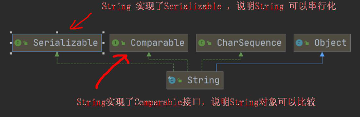

# 第一章	  java概述

## 一、什么是程序

程序：计算机执行某些操作或解决某个问题而**编写的一系列有序指令的集合**

## 二、java的特点

1. java的语言是面向对象的（oop）
2. Java 语言是健壮的。Java 的强类型机制、异常处理、垃圾的自动收集等是Java 程序健壮性的重要保证
3. Java 语言是跨平台性的。[即: 一个编译好的.class 文件可以在多个系统下运行，这种特性称为跨平台]
4. Java 语言是解释型的[了解]
   解释性语言：javascript,PHP, java     编译性语言: c / c++
   区别是：解释性语言，编译后的代码，不能直接被机器执行,需要解释器来执行, 编译性语言, 编译后的代码, 可以直接被机器执行, c /c++

## 三、java的核心机制-JVM虚拟机

JVM：java virtual machine

### 基本介绍

1. JVM 是一个虚拟的计算机，具有指令集并使用不同的存储区域。负责执行指令，管理数据、内存、寄存器，包含在JDK 中.
2. 对于不同的平台，有不同的虚拟机。
3. Java 虚拟机机制屏蔽了底层运行平台的差别，实现了“一次编译，到处运行”

## 四、什么是JDK、JRE

### JDK基本介绍

1. JDK 的全称(Java Development Kit Java 开发工具包)
   JDK = JRE + java 的开发工具 [java, javac,javadoc,javap 等]
2. JDK 是提供给Java 开发人员使用的，其中包含了java 的开发工具，也包括了JRE。所以安装了JDK，就不用在单独安装JRE 了

### JRE基本介绍

1. JRE(Java Runtime Environment **Java 运行环境**)
   JRE = JVM + Java 的核心类库[类]
2. 包括Java 虚拟机(JVM Java Virtual Machine)和Java 程序所需的核心类库等，如果想要运行一个开发好的Java 程序，计算机中只需要安装JRE 即可

### JDK、JRE和JVM的关系

1. **JDK = JRE + 开发工具集**（例如Javac,java 编译工具等)
2. **JRE = JVM + Java SE 标准类库**（java 核心类库）
3. 如果只想运行开发好的 .class 文件 只需要JRE

## 五、下载、安装JDK

https：//www.oracle.com

## 六、配置环境变量path

### 为什么要配置path

没有配置环境变量无法使用java

### 配置环境变量path的步骤

1. 我的电脑-->属性-->高级系统设置-->环境变量
2. 增加JAVA_HOME 环境变量，指向jdk的安装路径 c:\····
3. 编辑path环境变量，增加%JAVA_HOME%\bin
4. 打开DOS命令窗口，任意目录下敲入java/javac。如果出现javac的参数信息，则配置成功

## 七、java开发的注意事项和相关要求

### java执行的流程分析

1. .java文件（源文件）通过指令javac编译形成了.class文件
2. .class文件（字节码文件）通过java指令运行出结果

### java开发注意事项和细节

1. Java源文件以.java为扩展名。源文件的基本组成部分是类(class)

2. Java应用程序的执行入口是main()方法。它有固定的书写格式： 

   ```java 
   public static void main(String［］ args) {
    
   }
   ```

3. Java语言严格区分大写

4. Java方法由一条条语句构成，每个语句以 ```;```结束

5. 大括号都是成对出现的，缺一不可。

6. 一个源文件中最多只能有一个public类。其它类的个数不限。

7. 如果源文件包含一个public类，则文件名必须按该类名命名！

8. 一个源文件中最多只能有 public类。其它类的个数不限，也可以将main方法写在非  public类中.然后指定运行非public类"这样入口方法就是非public的main方法


## 八、java转义字符

### java常用的转义字符

1. ```\t``` ：一个制表位，实现对齐的功能
2. ```\n``` ：换行符
3. ```\\``` ：一个\
4. ```\" ```:一个"
5. ```\'``` ：一个'
6. ```\r``` :一个回车

## 九、java注释

### 介绍

用于注解说明解释程序的文字就是注释，注释提高了代码的阅读性（可读性）；

注释是一个程序员必须要具有的良好编程习惯。将自己的思想通过注释先整理出来，再用代码去体现。 

### java中的注释类型

1. 单行注释	//
2. 多行注释   /*     */
3. 文档注释   ```/**   */```

### 使用细节

1. 被注释的文字，不会被JVM（java 虚拟机）解释执行
2. 多行注释里面不允许有多行注释嵌套

## 十、java代码规范

1. 类、方法的注释.要以javadoc的方式来写。
2. 非java Doc的注释，往往是给代码的维护者看的，着重告述读者为什么这样写, 如何修改.注意什么问题等 
3. 使用tab操作，实现缩进，默认整体向右边移动，时候用shift+tab整体向左移 
4. 运算符和=两边习惯性各加一个空格。
5. 源文件使用utf-8编码 
6. 行宽度不要超过80字符 
7. 代码编写 次行风格 和 行尾风格 

## 十一、DOS命令

### Dos介绍

Dos： Disk Operating System 磁盘操作系统, 简单说一下windows 的目录结构

### 相对路径和绝对路径

**相对路径**：从当前目录开始定位，形成的一个路径

**绝对路径**：从顶级目录（如d：）开始定位，形成的路径

### 常用的dos命令

1. 查看当前目录是有什么内容 dir

   dir		dir d:\abc\test

2. 切换到其他盘下：盘符号 cd : change directory
   切换到 c 盘 cd /D c:

3. 切换到当前盘的其他目录下 (使用相对路径和绝对路径演示),      ..\表示上一级目录
   案例演示： cd d:\abc2\test200 cd ..\..\abc2\test200

4. 切换到上一级：
   案例演示： cd ..

5. 切换到根目录：cd \
   案例演示：cd \

6. 查看指定的目录下所有的子级目录 tree

7. 清屏 cls [苍老师]

8. 退出DOS    exit

9. 不常用

   1. md[创建目录]
   2. rd[删除目录]
   3. copy[拷贝文件]
   4. del[删除文件]
   5. echo[输入内容到文件]
   6. type,move[剪切])

# 第二章      变量

## 一、为什么需要变量

### 一个程序就是一个世界

### 变量是程序的基本组成单位

## 二、变量的介绍

### 概念

变量相当于内存中一个数据存储空间的表示，你可以把变量看做是一个房间的门牌号，通过门牌号我们可以找到房间，而通过变量名可以访问到变量(值)。

### 变量使用的基本步骤

1. 声明变量

   ```int a;```

2. 赋值

   ```a = 60;```

也可以一步到位```int a = 60;```

## 三、变量的快速入门

记录人的信息

```java
public class Var02 {
    public static void main(String[] args) {
        int age = 30;
        double score = 88.9;
        char gender = '男';
        String name = "king";
    }
}
```

### 变量使用注意事项

1. 变量表示内存中的一个存储区域［不同的变量，类型不同，占用的空间大小不同, 比如：int4个字节，double就是8个字节 
2. 该区域有自己的名称［变量名］和类型［数据类型］
3. 变量必须先声明，后使用，即有顺序 
4. 该区域的数据/值可以在同一类型范围内不断变化 
5. 变量在同一个作用域内不能重名 
6. **变量三要素** 变量=变量名+值+数据类型，这一点请大家注意。

## 四、程序中+号的使用

1. 当两边都是数值类型时，做加法运算
2. 当左右两边有一边为字符串时，则做拼接运算
3. 运算顺序：从左到右

## 五、数据类型

每一种数据都定义了明确的数据类型，在内存中分配了不同大小的内存空间(字节)。

#### java中的数据类型

1. 基本数据类型
   1. 数值型
      1. 整数类型，存放整数
         1. byte[1]    short[2]    int[4]   long[8]
      2. 浮点类型（小数）
         1. float[4]    double[8]
   2. 字符型  char[2] ，存放单个字符   ‘a’
   3. 布尔型  boolean[1]，存放true，false
2. 引用数据类型
   1. 类
   2. 接口
   3. 数组

基本数据类型八种：byte  short  int  long  float   double  char  boolean

引用类型： 类  接口   数组

### 整数类型

#### 基本介绍

Java 的整数类型就是用于存放整数值的，比如 12 , 30, 3456 等等

#### 案例

```java
byte n1 = 10;
short n2 = 10;
int n3 = 10;//4 个字节
long n4 = 10; //8 个字节
```

#### 整形的类型

|     类型      | 占用存储空间 |       范围        |
| :-----------: | :----------: | :---------------: |
|  byte[字节]   |    1字节     |     -127~128      |
| short[短整型] |    2字节     | -（2^15) ~ 2^15-1 |
|   int[整形]   |    4字节     | -(2^31) ~ 2^31-1  |
| long[长整形]  |    8字节     | -(2^63) ~ 2^63-1  |

#### 整形的使用细节

1. Java各整数类型有固定的范围和字段长度，不受具体OS［操作系统］的影响，以 保证java程序的可移植性。 
2. Java的整型常量（具体值）默认为int型，声明long型常量须后加  l或’L'
3. java程序中变量常声明为int型，除非不足以表示大数，才使用long
4. bit:计区机中的最小储存单位。byte:计算机中基本存储单元［byte = 8 bit ]

### 浮点类型

#### 基本介绍

Java 的浮点类型可以表示一个小数，比如 123.4 ，7.8 ，0.12 等等

#### 浮点型的分类

|     类型     | 占用储存空间 |           范围           |
| :----------: | :----------: | :----------------------: |
| 单精度float  |    4字节     |   -3.43E38  ~  3.40E38   |
| 双精度double |    8字节     | -1.798E308  ~  1.798E308 |

#### 说明

1. 关于浮点数在机器中存放形式的简单说明,浮点数=符号位+指数位+尾数位
2. 尾数部分可能丢失，造成精度损失(小数都是近似值)。

#### 浮点类型使用细节

1. 与整数类型类似， Java浮点类型也有固定的范围和字段长度，不受具体OS的 

   影响。［float 4个字节    double是8个字节］

2. Java的浮点型常量（具体值）默认为double声明float型常量，须后加   f 或  F 

3. 浮点型常量有两种表示形式 

   1. 十进制数形式：如：5.12      512.0f       .512 （必须有小数点）
   2. 科学计数法形式:如：5.12e2 ［5.12*10的2次方］    5.12E-2 ［5.12/10的2次方］

4. 通常情况下，应该使用double型.因为它比float型更精确。［举例说明］ 

   ```double num9 = 2.1234567851; ```

   ```float num10 = 2.1234567851F; ```

5. 浮点使用陷阱：2.7和  8.1/3  比较

### 字符类型

#### 基本介绍

字符类型可以表示单个字符,字符类型是char，char 是两个字节(可以存放汉字)，多个字符我们用字符串String

#### 案例演示

```char c1 = 'a';```
```char c2 = '\t';```
```char c3 = '韩';```
```char c4 = 97;```

#### 字符类型使用细节

1. 字符常量是用单引号（‘ ’）括起来的单个字符。

   例如： ```char c1 = "a';```      ```char c2 ='中'; char c3 = 9; ```

2. ava中还允许使用转义字符、‘来将其后的字符转变为 特殊字符型常量。

   例如：```char c3 = '\n'；``` //‘n’   表示 换行符 

3. 在java中，char的本质是一个整数，在输出时，是 unicode 码对应的字符。 

   http://tool.chinaz.com/Tools/UnicodG.aspx 

4. 可以直接给char赋一个整数，然后输出时，会按照对应 unicode字符输出

   [97--> a] 

5. char类型是可以进行运算的，相当于一个整数，因为它都对应有Unicode码

#### 注意

1. 字符型存储到计算机中，需要将字符对应的码值(整数)找出来。比如 ‘a’ 

   存储：‘a’ == > 码值 97 == > 二进制(110 0001)== > 存储   

   读取：二进制(110 0001) => 97 = = = > ‘a’ => 显示

2. 字符和码值的对应关系是通过字符编码表决定的(是规定好的) 

#### 几种需要了解的编码表

ASCII码、Unicode编码、UTF-8编码

### 布尔类型

#### 基本介绍

1. 布尔类型也叫boolean类型，booolean类型数据只允许取值true和false,无 null
2. boolean类型占1个字节
3. boolean类型适于逻辑运算，一般用于程序流程控制、
   1. if条件控制语句
   2. while循环控制语句
   3. do while循环控制语句
   4. for循环控制语句

## 六、java  API文档

1. API （Application Programming Interface,应 用程序编程接口）是Java提供的基本编程接口 （java提供的类还有相关的方法）。中文在线文档： https://www.matools.com 

2. Java语言提供了大量的基础类，因此Oracle公司 也为这些基础类提供了相应的API文档，用于告诉 开发者如何使用这些类.以及这些类里包含的方法。 

3. Java类的组织形式

   

4. 举例说明如何後用ArrayList类有哪些方法. 

   安:包--> 类--> 方法   直接索引

   

## 七、基本数据类型转换

### 自动类型转换

#### 基本介绍

当java程序在进行赋值或运算时，精度小的类型自动转换为精度大的数据类型，这就是**自动类型转换**

#### 自动类型转换规则

数据类型按精度（容量）大小排序为


#### 自动类型转换注意和细节

1. 有多种类型的数据混合运算时，系统首先自动将所有数据 转换成容量最大的那种数据类型.然后再进行计算

2. 当我们把精度（容量）大的数据类型赋值给精度（容量）小的数据类型时，就会报错，反之就会进行自动类型转换。

3. bytef short）和char之间不会相互自动转换。

   

4. bytef，short，char他们三者可以计算，在计算时首先转换为int类型c 

5. boolean不参与转换 

6. 自动提升原则：表达式结果的类型自动提升为操作数中最大的类型 

### 强制类型转换

#### 介绍

自动类型转换的逆过程，**将容量大的数据类型转换为容量小的数据类型**。使用时要加上强制转换符 ( )，但可能造成**精度降低或溢出**,格外要注意

#### 案例演示

```int i = (int)1.9;```

```int j = 100;```

```byte  b1 = (byte)j;```

#### 强制类型转换细节说明

1. 当进行数据的大小从  大——＞小，就需要使用到强制转换 

2. 强转符号只针对于最近的操作数有效，往往会使用小括号提升优先

   ```int x = (int)10*3.5+6*1.5; ```

    ```inty = (int)(10*3.5+6*13); ```

3. char类型可以保存int的常量值，但不能保存int的变量值，需要强转

   ```char c1 = 100;``` //ok 

   ```int m = 100; ```     //ok 

   ```char c2 = m;```     //错误 

   ```char c3 = (char)m;```    //ok 

   ```System.out.println(c3); ```  //100 对应的 5^5

4. byte和short, char类型在进行运算时，当做int类型处理

## 八、基本数据类型和String类型的转换

### 介绍

在程序开发中，我们经常需要将基本数据类型装换成String类型，或将String类型转成基本数据类型

### 基本类型转Sting类型的使用

#### 语法

将基本类型的值	+  “”  即可

#### 案例

```java
int n1 = 100;
float n2 = 	1.1f;
double n3 = 4.3;
boolean b1 = true;
String str1 = n1 + "";
String str2 = n2 + "";
String str3 = n4 + "";
String str4 = b1 + "";
```

### String 类型转基本类型

#### 语法

通过基本类型的包装类调用parseXX方法即可

#### 案例

```Integer.parseInt(“123”)```

```Double.parseDoubel(“1.2”)```

```Float.parseFloat(“2.4”)```

```Boolean.parseBoolean(“true”)```

```Byte.parseByte(“12”)```

### 注意事项

1. 在将String 类型转成 基本数据类型时，**要确保String类型能够转成有效的数据** ，

   比如 我们可以把 "123" , 转成一个整数，但是不能把 "hello" 转成一个整数

2. 如果格式不正确，就会抛出异常，程序就会终止，（在异常处理章节中，会处理）


# 		第三章    运算符

## 一、运算符介绍

### 运算符基本介绍

运算符是一种特殊的符号，用以表示数据的运算、赋值和比较等。

1. 算术运算符
2. 赋值运算符
3. 关系运算符 [比较运算符]
4. 逻辑运算符
5. 位运算符 [需要二进制基础]
6. 三元运算符

### 算数运算符

#### 基本介绍

算术运算符是对数值类型的变量进行运算的，在Java 程序中使用的非常多

#### 算数运算符的使用范例

| 运算符 |            运算            |     范例      |    结果    |
| :----: | :------------------------: | :-----------: | :--------: |
|   +    |            正号            |      +7       |     7      |
|   -    |            负号            |   b=-11，-b   |    -11     |
|   +    |             加             |      1+3      |     4      |
|   -    |             减             |      5-2      |     3      |
|   *    |             乘             |      5*6      |     30     |
|   /    |             除             |      9/9      |     1      |
|   %    |        取模（取余）        |     11%9      |     2      |
|   ++   | 自增（前），先运算，后取值 | a=2;   b=++a; | a=3;   b=3 |
|   ++   | 自增（后），先取值，后运算 | a=2;   b=a++; | a=3;   b=2 |
|   --   | 自减（前），先运算，后取值 | a=2;   b=--a; | a=1;   b=1 |
|   --   | 自减（后），先取值，后运算 | a=2;   b=a--; | a=1;   b=2 |
|   +    |         字符串相加         | “gbl” + “gmm” |  “gblgmm”  |

#### 细节说明

1. 对于除号它的整数除和小数除是有区别的：

   整数之间做除法时，只保留整 数部分而舍弃小数部分。例如：intx= 10/3结果是3

2. 当对一个数取模时，可以等价a%b=a-a/b*b，这样我们可以看到取模的一 个本质运算。

3. 当自增当做一个独立语言使用时，不管是++i;还是i++；都是一样的，等价

4. 当自增当做一个表达式使用时j=++i      等价

5. 当自增当做一个表达式使用时j = i++      不等价

### 关系运算符

#### 介绍

1. 关系运算符的结果都是boolean 型，也就是要么是true，要么是false
2. 关系表达式 经常用在 if 结构的条件中或循环结构的条件中

#### 关系运算符的使用范例

|   运算符   |        运算        |           范例           | 结果  |
| :--------: | :----------------: | :----------------------: | :---: |
|     ==     |       相等于       |         8  ==  7         | false |
|     !=     |       不等于       |         8  !=  7         | true  |
|     <      |        小于        |         8  <  7          | false |
|     >      |        大于        |         8  >  7          | true  |
|     <=     |      小于等于      |         8  <=  7         | false |
|     >=     |      大于等于      |         8  >=  7         | true  |
| instanceof | 检查是否是类的对象 | “hsp” instanceof  String | true  |

#### 细节说明

1. 关系运算符的结果都是boolean 型，也就是要么是true，要么是false。
2. 关系运算符组成的表达式，我们称为关系表达式。 a > b
3. 比较运算符"=="不能误写成"="

### 逻辑运算符

#### 介绍

用于连接多个条件（多个关系表达式），最终的结果也是一个boolean 值。

#### 逻辑运算符一览

1. **短路与 && ， 短路或 ||，取反 !**
2. **逻辑与 &，逻辑或 |， 逻辑异或^**

#### 逻辑运算规则说明

1. a&b : & 叫**逻辑与**：规则：当a 和 b 同时为true ,则结果为true, 否则为false
2. a&&b : && 叫**短路与**：规则：当a 和 b 同时为true ,则结果为true,否则为false
3. **a|b : | 叫逻辑或**，规则：当a 和 b ，有一个为true ,则结果为true,否则为false
4. **a||b : || 叫短路或**，规则：当a 和 b ，有一个为true ,则结果为true,否则为false
5. **!a : 叫取反**，或者非运算。当a 为true, 则结果为false, 当 a 为false 是，结果为true
6. **a^b: 叫逻辑异或**，当 a 和 b 不同时，则结果为true, 否则为false

#### 逻辑与&  和  短路与&&  基本规则

|   名称   |     语法     |                  特点                  |
| :------: | :----------: | :------------------------------------: |
| 短路与&& | 条件1&&条件2 | 两个条件都为true，结果为true,否则false |
| 逻辑与&  | 条件1&条件2  | 两个条件都为true，结果为true,否则false |

#### 逻辑与&  和  短路与&&使用区别

1. &&短路与：如果第一个条件为false，则第二个条件不会判断，最终结果为false，效率高
2. & 逻辑与：不管第一个条件是否为false，第二个条件都要判断，效率低
3. 开发中， 我们使用的基本是使用短路与&&, 效率高

####  **逻辑或|**  和 **短路或||**  基本规则

|    名称    |         语法         |                       特点                       |
| :--------: | :------------------: | :----------------------------------------------: |
| 短路或\|\| | 条件1 **\|\|** 条件2 | 两个条件中只要有一个成立，结果为true,否则为false |
|  逻辑或\|  |  条件1 **\|** 条件2  |    只要有一个条件成立，结果为true,否则为false    |

####  **逻辑或|**  和 **短路或||**  使用区别

1. ||短路或：如果第一个条件为true，则第二个条件不会判断，最终结果为true，效率高
2. | 逻辑或：不管第一个条件是否为true，第二个条件都要判断，效率低
3. 开发中，我们基本使用 ||

#### 取反！基本规则


|     名称     |  语法  |                   特点                    |
| :----------: | :----: | :---------------------------------------: |
| ！取反（非） | ！条件 | 如果条件本身成立，结果为false，否则为true |

#### 逻辑异或^ 案例演示

a^b: 叫逻辑异或，当 a 和 b 不同时，则结果为true, 否则为false

### 赋值运算符

#### 介绍

赋值运算符就是将某个运算后的值，赋给指定的变量

#### 赋值运算符的分类

1. 基本赋值运算符 =

2. 复合赋值运算符

   += ，-= ，*= ， /= ，%=

##### 例子

a += b;  ===>   a  = a + b;

#### 赋值运算符的特点

1. 运算顺序从右往左 int num = a + b + c;
2. 赋值运算符的左边 只能是变量,右边 可以是变量、表达式、常量值
   int num = 20; int num2= 78 * 34 - 10; int num3 = a;
3. 复合赋值运算符等价于下面的效果
   比如：a+=3;等价于a=a+3; 其他类推
4. 复合赋值运算符会进行类型转换。
   byte b = 2; b+=3; b++;

### 三元运算符

#### 基本语法

条件表达式 ? 表达式1: 表达式2;

#### 运算规则

1. 如果条件表达式为true，运算后的结果是表达式1；

2. 如果条件表达式为false，运算后的结果是表达式2；

3. ###### 口决 ：**一真大师**

#### 使用细节

1. 表达式1 和表达式2 要为可以赋给接收变量的类型(或可以自动转换)
2. 三元运算符可以转成if--else 语句

## 二、运算符的优先级

### 基本介绍

1. 运算符有不同的优先级，所谓优先级就是表达式运算中的运算顺序。如右表，上一行运算符总优先于下一行。
2. 只有单目运算符、赋值运算符是从右向左运算的。

### 常见的运算符优先级


## 三、标识符的命名规则和规范

### 标识符概念

1.  Java对各种变量.方法和类等命名时使用的字符序列称为标识符
2.  凡是自己可以起名字的地方都叫标识符```int num1 = 90;```

### 标识符的命名规则（必须遵守）

1. 由26个英文字母大小写，0-9，__或$组成 

2. 数字不可以开头。```int 3ab = 1; ```  错误 

3. 不可以使用关键字和保留字，但能包含关键字和保留字。 

4. Java中严格区分大小写，长度无限制。```int totalNum = 10; int n = 90;```

5. 标识符不能包含空格。 

   ```int a b = 90;```     错误

### 标识符命名规范

1. 包名：多单词组成时所有字母都小写：aaa.bbb.ccc //比如 com.hsp.crm
2. 类名、接口名：多单词组成时，所有单词的首字母大写：XxxYyyZzz [大驼峰]
   比如： TankShotGame
3. 变量名、方法名：多单词组成时，第一个单词首字母小写，第二个单词开始每个单词首字母大写：xxxYyyZzz [小驼峰，简称 驼峰法]       比如： tankShotGame
4. 常量名：所有字母都大写。多单词时每个单词用下划线连接：XXX_YYY_ZZZ
   比如 ：定义一个所得税率 TAX_RATE
5. 后面我们学习到 类，包，接口，等时，我们的命名规范要这样遵守,更加详细的看文档.

## 四、关键字

### 关键字的定义和特点

#### 定义

被Java 语言赋予了特殊含义，用做**专门用途的字符串**（单词）

#### 特点

关键字中所有字母都为小写

### 常见的关键字


## 五、保留字

### 介绍

java 保留字：现有Java 版本尚未使用，但以后版本可能会作为关键字使用。自己命名标识符时要避免使用这些保留字**byValue、cast、future、 generic、 inner、 operator、 outer、 rest、 var 、 goto 、cons**

### 键盘输入语句

#### 基本介绍

在编程中，需要接收用户输入的数据，就可以使用键盘输入语句来获取。Input.java , 需要一个 扫描器(对象), 就是   **Scanner**

#### 使用步骤

1. 导入该类的所在包,

   ```import java.util.Scanner;```

2. 创建该类对象（声明变量）

   ```Scanner myScanner = new Scanner(System.in);```

3. 调用里面的功能

   ```String name = myScanner.nextInt();```

## 六、进制的转换

### 进制介绍

对于整数，有四种表示方式：

1. 二进制：0,1 ，满2 进1，以0b 或0B 开头。
2. 十进制：0-9 ，满10 进1。
3. 八进制：0-7 ，满8 进1，以数字0 开头表示。
4. 十六进制：0-9 及A(10)-F(15)，满16 进1. 以**0x** 或**0X** 开头表示。此处的A-F 不区分大小写。

### 二进制转十进制

#### 规则

从最低位(右边)开始，将每个位上的数提取出来，乘以2 的(位数-1)次方，然后求和。

### 八进制转十进制

#### 规则

从最低位(右边)开始，将每个位上的数提取出来，乘以8 的(位数-1)次方，然后求和。


### 十六进制转十进制

#### 规则

从最低位(右边)开始，将每个位上的数提取出来，乘以16 的(位数-1)次方，然后求和。

#### 案例

案例：请将 0x23A 转成十进制的数

**0x23A = 10 * 16^0 + 3 * 16 ^ 1 + 2 * 16^2 = 10 + 48 + 512 = 570**

### 十进制转换二进制

#### 规则

将该数不断除以2，直到商为0 为止，然后将每步得到的余数倒过来，就是对应的二进制。

### 十进制转八进制

#### 规则

规则：将该数不断除以8，直到商为0 为止，然后将每步得到的余数倒过来，就是对应的八进制。


### 十进制转十六进制

#### 规则

将该数不断除以16，直到商为0 为止，然后将每步得到的余数倒过来，就是对应的十六进制。

### 二进制转八进制

#### 规则

从低位开始,将二进制数每三位一组，转成对应的八进制数即可。

#### 案例

请将 ob11010101 转成八进制
ob11(3)010(2)101(5) => 0325

### 二进制转十六进制

#### 规则

从低位开始，将二进制数每四位一组，转成对应的十六进制数即可。

#### 案例

请将 ob11010101 转成十六进制

ob1101(D)0101(5) = 0xD5

### 八进制转二进制

#### 规则

将八进制数每1 位，转成对应的一个3 位的二进制数即可。

#### 案例

请将 0237 转成二进制
02(010)3(011)7(111) = 0b10011111

### 十六进制转二进制

#### 规则

将十六进制数每1 位，转成对应的4 位的一个二进制数即可。

#### 案例

请将 0x23B 转成二进制
0x2(0010)3(0011)B(1011) = 0b001000111011


## 七、源码、补码、反码

### 总结

1. 二进制的最高位是符号位：0表示正数」表示负数（老韩口诀:0->0 1-> -） 
2. 正数的原码，反码，补码都一样（三码合一） 
3. 负数的反码=它的原码符号位不变，其它位取反（0->1，1->0）
4. 负数的补码=它的反码+1，负数的反码=负数的补码-1 
5. 0的反码，补码都是0 
6. java没旨无符号数，换言之，java中的数都是有符号的
7. 在计算机运算的时候，都是以补码的方式来运算的. 
8. 当我们看运算结果的时候，要看他的原码（重点）


## 八、位运算符

### 基本介绍

java 中有7 个位运算(**&、|、^、~、>>、<<和 >>>**)

#### 位运算

位运算分别是  **按位&、按位|、按位异或^、按位取反~**、它们的运算规则是：

1. 按位&：两位全为1,结果为1，否则为0
2. 按位|:  两位有一个为1.结果为1，否则为0
3. 按位异或^：   两位一个为0，,一个为1，结果为1，否则为0
4. 按位取反~：0->1 ，1->0

#### 位运算符

还有三个位运算符 **>>、<<** 和 **>>>** ,运算规则:

1. 算术右移 >>：低位溢出,符号位不变,并用符号位补溢出的高位
2. 算术左移 <<: 符号位不变,低位补0
3. \>>> 逻辑右移也叫无符号右移,运算规则是: 低位溢出，高位补 0
4. 特别说明：没有 <<< 符号

# 第四章    程序控制结构

## 一、程序流程控制介绍

在程序中，程序运行的流程控制决定程序是如何执行的，是我们必须掌握的，主要有三大流程控制语句

1. 顺序控制
2. 分支控制
3. 循环控制

### 顺序控制

#### 基本介绍

程序从上到下逐行进行，中间没有任何判断和跳转

## 二、分支控制  if-else

### 分支控制  if-else介绍

让程序有选择的的执行,分支控制有三种

1. 单分支 if
2. 双分支 if-else
3. 多分支 if-else if -....-else

### 单分支

#### 基本语法

```java
if(条件表达式) {
    执行代码块；（可以有多条语句）
}
```

**说明：**

当条件表达式为true时，就会执行{ } 的代码，如果为false就不执行，

特别说明：

如果 { } 中只有一条语句，则可以不用{ } 

###  双分支（If02）

#### 基本语法

```java
if(条件表达式) {
    执行代码块1；
}
else {
    执行代码块2；
}
```

**说明：**

当条件表达式成立时，即执行	代码块1，否则，执行代码块2

#### 单分支和双分支练习题（IfExercise01）

1. 编写程序，声明2 个double 型变量并赋值。判断第一个数大于10.0，且第2 个数小于20.0，打印两数之和
2. 定义两个变量int，判断二者的和，是否能被3 又能被5 整除，打印提示信息
3. 判断一个年份是否是闰年，闰年的条件是符合下面二者之一：(1)年份能被4 整除，但不能被100 整除；(2)能被400整除

### 多分支

#### 基本语法

```java
if(条件表达式1) {
    执行代码块1；
}
else if(条件表达式2) {
    执行代码块2；
}
...
else {
    执行代码块n；
}
```

##### 特别说明

1. 多分支可以没有else，如果所有的条件表达式都不成立，则一个执行入口都没有
2. 如果有else，如果所有的条件表达式都不成立，则默认执行else代码块

#### 多分支流程图


##### 说明：

1. 当条件表达式1成立时.即执行代码块1
2. 如果表达式1不成立，才去判断表达式2是否成立. 
3. 如果表达式2成立，就执行代码块 2 
4. 以此类推，如果所有的表达式都 不成立 
5. 则执行else的代码块，注意，只能有一个执行入口。 

#### 多分支案例演示（If03）

输入保国同志的芝麻信用分：

如果：

1. 信用分为100 分时，输出 信用极好
2. 信用分为(80，99]时，输出 信用优秀；
3. 信用分为[60,80]时，输出 信用一般；
4. 其它情况 ，输出 信用 不及格
5. 请从键盘输入保国的芝麻信用分，并加以判断

### 嵌套分支

#### 基本介绍

**在一个分支结构中又完整的嵌套了另一个完整的分支结构**，里面的分支的结构称为内层分支外面的分支结构称为外层分支。建议: 不要超过3 层 （代码的可读性差）

#### 基本语法

```java
if() {
    if(){
        if-else...   	
    }else{
        if-else...
    }
}
```

#### 应用案例（NestedIf）

1. 加歌手比赛，如果初赛成绩大于8.0 进入决赛，否则提示淘汰。并且根据性别提示进入男子组或女子组。

   输入成绩和性别，进行判断和输出信息。[NestedIf.java]

   提示：接收字符: ```char gender = scanner.next().charAt(0);```

2. 简单的出票系统

## 三、switch分支结构和循环控制（for、while、do..while）

### switch分支结构

#### 基本语法

```java
switch(表达式) {
    case 常量1；
        语句块1；
        break；
    case 常量2；
        语句块1；
        break；
    ...
    case 常量n；
        语句块n；
        break；
    default:
    default 语句块；
    break；       
}
```

#### 流程图


#### 快速入门（Switch01）

请编写一个程序，该程序可以接收一个字符，比如:a,b,c,d,e,f,g
a 表示星期一，b 表示星期二 ...
根据用户的输入显示相应的信息.要求使用 switch 语句完成

#### switch注意事项和细节（SwitchDetail）

1. 


#### switch 课堂练习(SwitchExercise)

1. 使用 switch 把小写类型的 char 型转为大写(键盘输入)。只转换 a, b, c, d, e. 其它的输出 "other"。
2. 对学生成绩大于60 分的，输出"合格"。低于60 分的，输出"不合格"。(注：输入的成绩不能大于100), 提示 成绩/60
3. 根据用于指定月份，打印该月份所属的季节。3,4,5 春季 6,7,8 夏季 9,10,11 秋季 12, 1, 2 冬季 [课堂练习, 提示使用穿透 ]

#### switch 和if 的比较

1. 如果判断的具体数值不多，而且符合byte、 short 、int、 char、enum[枚举], String 这6 种类型。虽然两个语句都可以使用，建议使用swtich 语句。
2. 其他情况：对区间判断，对结果为boolean 类型判断，使用if，if 的使用范围更广

### for循环控制

#### 基本介绍

听其名而知其意,就是让代码可以循环的执行

#### 基本语法

```java
for(循环变量初始化；循环条件；循环变量迭代) {
    循环操作（可以是多条语句）；
}
```

##### 说明

1.  for 关键字，表示循环控制
2.  for 有四要素: (1)循环变量初始化(2)循环条件(3)循环操作(4)循环变量迭代
3.  循环操作 , 这里可以有多条语句，也就是我们要循环执行的代码
4.  如果循环操作(语句) 只有一条语句，可以省略 {}, 建议不要省略

#### for 循环执行流程分析


#### for循环的注意事项和细节说明（ForDetai）

1. 循环条件是返回一个布尔值的表达式
2. for(;循环判断条件;) 中的初始化和变量迭代可以写到其它地方，但是两边的分号不能省略。
3. 循环初始值可以有多条初始化语句，但要求类型一样，并且中间用逗号隔开，循环变量迭代也可以有多条变量迭代语句，中间用逗号隔开。

#### for循环练习

1. 打印1~100 之间所有是9 的倍数的整数，统计个数及总和（（ForExercise））

2. 完成下面的表达式输出（ForExercise02）

   0+5=5

   1+4=5

   2+3=5

   3+2=5

   4+1=5

   5+0=5

### while 循环控制

#### 基本语法

```java
while(循环条件) {
    
    循环体（语句）；
    循环变量迭代；
}
```

##### 说明

1. while循环也有四要素
2. 只是四要素放的位置和for不同

#### while 循环执行流程分析


#### while 循环注意事项和细节说明

1. 循环条件是返回一个布尔值的表达式
2. **while 循环是先判断再执行语句**

#### while循环练习题（WhileExercise）

1. 打印1—100 之间所有能被3 整除的数   [使用while ]
2. 打印40—200 之间所有的偶数    [使用while]

### do..while循环控制

#### 基本语法

```java
循环变量初始化;
do{
    循环体(语句);
    循环变量迭代;
}while(循环条件);
```

##### 说明

1.  do while 是关键字，也有循环四要素, 只是位置不一样
2.  先执行，再判断，也就是说，**一定会至少执行一次**
3.  最后有一个分号   ;
4.  while 和 do..while 区别举例: 要账

#### do..while循环控制流程分析（DoWhile01）


#### do..while循环注意事项和细节说明

1. 循环条件是返回一个布尔值的表达式
2. do..while 循环是先执行，再判断， **因此它至少执行一次**

#### do..while循环练习题（(DoWhileExercise01）

1. 打印1—100 
2. 计算1—100 的和
3. 统计1---200 之间能被5 整除但不能被3 整除的个数
4. 如果李三不还钱，则老韩将一直使出五连鞭，直到李三说还钱为止
   [System.out.println("老韩问：还钱吗？y/n")] do...while .   （DoWhileExercise02）

## 四、多重循环控制（重难点）

#### 介绍

1. 将一个循环放在另一个循环体内，就形成了嵌套循环。其中，for ,while ,do...while 均可以作为外层循环和内层循环。【建议一般使用两层，最多不要超过3 层, 否则，代码的可读性很差】
2. 实质上，嵌套循环就是把内层循环当成外层循环的循环体。当只有内层循环的循环条件为false 时，才会完全跳出内层循环，才可结束外层的当次循环，开始下一次的循环
3. 设外层循环次数为m 次，内层为n 次，则内层循环体实际上需要执行m*n 次。

#### 多重循环执行步骤分析：


#### 多重循环控制应用实例（MulForExercise01）

1. 统计3 个班成绩情况，每个班有5 名同学，

   求出各个班的平均分和所有班级的平均分[学生的成绩从键盘输入]

2. 统计三个班及格人数，每个班有5 名同学

3. 打印九九乘法表

### 金字塔模型

使用for循环完成：（Stars.java）

请编写一个程序，可以接收一个整数,表示层数（totalLevel），打印出金字塔。

​								  *
​								*  *
​							 *      *
​                     *********************

## 五、跳转控制语句

### 跳转控制语句-break（break01）

#### 基本介绍

**break 语句用于终止某个语句块的执行**，一般使用在switch 或者循环**[for , while , do-while]**中

#### 使用需求

当循环的次数不知道时（让循环条件一直为true），就可以使用break语句，当某个条件满足时，终止循环

#### 基本语法

```java
while(true) {
    if(条件判断){
        循环语句；
    	break;
    }
}
```

#### break练习题（BreakExercise）

1. 1-100 以内的数求和，求出 当和 第一次大于20 的当前数 【for + break】 **（BreakExercise01）**
2. 现登录验证，有3 次机会，如果用户名为"丁真" ,密码"666"提示登录成功，否则提示还有几次机会，请使用for+break  **（BreakExercise02）**

### 跳转控制语句-continue(Continue01)

#### 基本介绍

1. c**ontinue 语句用于结束本次循环，继续执行下一次循环**
2. continue 语句出现在多层嵌套的循环语句体中时，可以通过标签指明要跳过的是哪一层循环 , 这个和前面的标签的使用的规则一样

#### 基本语法

```java
while(循环条件) {
    ...
    continue;
    ...
}
```


### 跳转控制语句-return

#### 基本介绍

1. return 使用在方法，表示跳出所在的方法
2. 如果 return 写在 main 方法，将退出程序


## 本章作业

1. 某人有 1 00 , 000 元，每经过一次路口，需要交费，规则如下：
   1 ）当现金＞ 50000 时，每次交 5 %
   2 ）当现金＜ = 50000 时，每次交 1 000 编程计算该人可以经过多少次路口，
   要求：使用 while + break 方式完成

2. 实现判断一个整数，属于哪个范围：大于 0 ：小于 0 ；等于。 Homework02java
   思路：定义 int n = 22 ；使用 if 一 else if 一 else 即可

3. 判断一个年份是否为闰年 Homework03java 思路：

4. 判断一个整数是否是水仙花数，所谓水仙花数是指一个 3 位数，其各个位上数字立方和等于其本身。
   例如： 153 = 1 * 1 * 1 + 3 * 3 * 3 + 5 * 5 * 5    Homework04.java

5. 看看下面代码输出什么

  ```java
class Demo{
	public static void main(String[] args) {
        in tm=0， n=3；
        if(m>0){
       		if(n>2){
        		System.out.print In("OK 1") ；
            }else{
                System.out.print In("OK 2") ；
            }
        }
	}
}
  ```

6. 输出1-100之间的不能被5整除的数， 每5个一行       Homework 06.java

7. 输出小写的a-z以及大写的Z-A     Homework 07.java

8. 求出1-1/2+1/3-1/4.....1/100的和  Homework 08.java

9. 求1+(1+2)+(1+2+3)+(1+2+3+4)+...+(1+2+3+..+100)的结果  Homework 09.java


# 第五章     数组、排序、查找

## 一、数组的基本使用

### 数组介绍

数组可以存放多个同一类型的数据。数组也是一种数据类型，是引用类型。
即：数(数据)组(一组)就是一组数据

### 数组的使用

#### 使用方式1-动态初始化

##### 数组的定义

数组类型  数组名[]  = new 数组类型[大小]；

```int a[] =new int[3];```

##### 解读

创建了一个数组，名字为a，存放了3个int型的数据

#### 数组的引用（使用/访问/获取数组元素）

数组名[下标/索引/index]   

比如：你要使用数组a 的第三个数    a[2]

**注意：数组的下标从0开始**

#### 快速入门（ Array02）


#### 使用方式2-动态初始化

1. 先声明数组

   语法： **数组类型  数组名[]**;   或  **数据类型[]  数组名**；

2. 创建数组

   语法：**数组名 = new  数组类型[大小]**

   ```a = new int[2];``

#### 使用方式3-静态初始化

##### 语法

**数组类型  数组名  = {元素值，元素值，...}**

例如：```int a[] = {3，4，6，7}；```

如果知道数组有多少元素和具体值，就可以用上面的方法创建数组

### 数组的注意事项和使用细节（ArrayDetai）

1. 数组是多个相同类型数据的组合，实现对这些数据的统一管理

2. 数组中的元素可以是任何数据类型，包括基本类型和引用类型，但是不能混用。

3. 数组创建后，如果没有赋值，有默认值
   int 0，short 0, byte 0, long 0, float 0.0,double 0.0，**char \u0000，boolean false，String null**

4. 使用数组的步骤 1. 声明数组并开辟空间 2 给数组各个元素赋值 3 使用数组

5. 数组的下标是从0 开始的。

6. 数组下标必须在指定范围内使用，否则报：下标越界异常，比如```int [] arr=new int[5]```，

   则有效下标是0-4

7. **数组属引用类型，数组型数据是对象(object)**

### 数组的应用案例

1. 创建一个char 类型的26 个元素的数组，分别 放置'A'-'Z'。使用for 循环访问所有元素并打印出来。提示：char 类型数据运算 'A'+2 -> 'C'    **ArrayExercise01.java**
2. 请求出一个数组int[]的最大值 {4,-1,9, 10,23}，并得到对应的下标。 ArrayExercise02.java

### 	数组的赋值机制

1. 基本数据类型赋值，这个值就是具体的数据，而且相互不影响。
   ```int n1 = 2; int n2 = n1;```

2. 数组在默认情况下是引用传递，赋的值是地址。
   看一个案例，并分析数组赋值的内存图(重点, 难点. )。**ArrayAssign.java**
   ```int[] arr1 = {1,2,3};```

   ```int[] arr2 = arr1;```

#### 数组赋值的流程图


### 数组拷贝 （ArrayCopy）

#### 需求

编写代码 实现数组拷贝(内容复制) ArrayCopy.java
将 int[] arr1 = {10,20,30}; 拷贝到 arr2 数组, 要求数据空间是独立的.

```java
public class ArrayCopy {
    public static void main(String[] args) {

        //编写代码 实现数组拷贝(内容复制) ArrayCopy.java
        //将 int[] arr1 = {10,20,30}; 拷贝到 arr2 数组, 要求数据空间是独立的.

        int[] arr1 = {10,20,30};
        int arr2[] = new int[arr1.length];
        for (int i = 0; i <arr1.length;i++){
            arr2[i] = arr1[i];
        }
        //输出arr1和arr2的数组的元素
        System.out.println("===arr1数组===");
        for (int i = 0; i < arr1.length; i++) {
            System.out.println(arr1[i]);
        }
        //验证是否是独立空间
        arr2[0] = 100;
        System.out.println("===arr2数组===");
        for (int i = 0; i < arr2.length; i++) {
            System.out.println(arr2[i]);
        }

    }
}
```

### 数组反转（ ArrayReverse）

#### 需求

把数组的元素内容反转。 ArrayReverse.java
arr {11,22,33,44,55,66}             {66, 55,44,33,22,11}

#### 方式一：通过找规律反转

```java
ublic class ArrayReverse {
    public static void main(String[] args) {

        //要求：把数组的元素内容反转。
        //arr {11,22,33,44,55,66}   翻转结果为{66, 55,44,33,22,11}
        //找到规律
        //1.把arr[0] 和arr[5] 进行交换 结果为  {66, 22, 33, 44,55, 11}   
        //arr[5] = arr.length - 1 - 0
        //2.把arr[1] 和arr[4] 进行交换 结果为  {66, 55, 33, 44,22, 11}   
        //arr[4] = arr.length - 1 - 1
        //3.把arr[2] 和arr[3] 进行交换 结果为  {66, 55, 44, 33,22, 11}   
        //arr[3] = arr.length - 1 - 2
        //需要3次翻转即可完成(arr.length / 2)

        int arr[] = {11,22,33,44,55,66};
        int temp = 0;
        for (int i = 0; i < arr.length / 2; i++){
            temp = arr[i];
              arr[i] = arr[arr.length - 1 - i];
              arr[arr.length - 1 - i] = temp;
        }
        System.out.println("翻转后的结果");
        for (int i = 0; i < arr.length; i++){
            System.out.print(arr[i] + " ");
        }

    }
}
```

#### 方式二：使用逆序赋值方式 ( ArrayReverse02)

```java
public class ArrayReverse02 {
    public static void main(String[] args) {

        int arr[] = {11,22,33,44,55,66};
        
        int arr2[] = new int[arr.length];
        int j = 0;
        for (int i = arr.length - 1; i >= 0; i--){
            arr2[j] = arr[i];
            j++;
        }
        arr = arr2;
        System.out.println("arr的元素");
        for (int i = 0; i < arr.length; i++){
            System.out.println(arr[i]);
        }

    }
}
```

### 数组添加/扩容（ArrayAdd）

#### 需求

1. 实现动态的给数组添加元素效果，实现对数组扩容。ArrayAdd.java

```java
import java.util.Scanner;

public class ArrayAdd {
    public static void main(String[] args) {

        //要求：实现动态的给数组添加元素效果，实现对数组扩容。ArrayAdd.java
        //1.原始数组使用静态分配 int[] arr = {1,2,3}
        //2.增加的元素4，直接放在数组的最后 arr = {1,2,3,4}
        //3.用户可以通过如下方法来决定是否继续添加，添加成功，是否继续？y/n

        //思路
        //1. 新建一个数组arrNEW [] , 长度为arr.length+1
        //2. 遍历arr数组，将arr的值拷贝给arrNEW
        //3. 将增加的元素 4 赋给arrNEW[arrNEW.length - 1]
        //4. 导入Scanner包，新建一个Scanner对象
        Scanner myScanner = new Scanner(System.in);

        int arr[] = {1, 2, 3};

        while (true){
            System.out.println("请输入增加的元素");
            int add = myScanner.nextInt();   //增加用户添加的元素
            int arrNEW[] = new int[arr.length + 1];     //新建一个数组
            for (int i = 0; i < arr.length; i++){      //遍历arr数组
                 arrNEW[i] = arr[i];        //将arr的值拷贝给arrNEW
            }
            arrNEW[arrNEW.length - 1] = add;   //将新增的元素值赋给下标为arrNEW.length-1
            arr = arrNEW;
            for (int i = 0; i < arr.length; i++) {      //遍历并输处添加成功后的arr数组
                System.out.print(arr[i] + " ");
            }
            System.out.println("添加成功，是否继续？y/n");
            char a = myScanner.next().charAt(0);
            if (a != 'y'){
                break;
            }
        }
        System.out.println("你退出了添加");
    }
}

```


需求二：

1. 原始数组使用静态分配 int[] arr = {1,2,3}
2. 增加的元素4，直接放在数组的最后 arr = {1,2,3,4}
3. 用户可以通过如下方法来决定是否继续添加，添加成功，是否继续？y/n

```java
public class ArrayAdd02 {
    public static void main(String[] args) {

        //要求：实现动态的给数组添加元素效果，实现对数组扩容。ArrayAdd.java
        //1.原始数组使用静态分配 int[] arr = {1,2,3}
        //2.增加的元素4，直接放在数组的最后 arr = {1,2,3,4}
        //3.用户可以通过如下方法来决定是否继续添加，添加成功，是否继续？y/n

        //思路
        //1. 新建一个数组arrNEW [] , 长度为arr.length+1
        //2. 遍历arr数组，将arr的值拷贝给arrNEW
        //3. 将增加的元素 4 赋给arrNEW[arrNEW.length - 1]
        int arr[] = {1, 2, 3};
        int arrNew[] = new int[arr.length + 1];     //新建一个数组
        for (int i = 0; i < arr.length; i++){      //遍历arr数组
            arrNew[i] = arr[i];        //将arr的值拷贝给arrNEW
        }
        arrNew[arrNew.length - 1] = 4;   //将新增的元素值赋给下标为arrNEW.length - 1
        arr = arrNew;
        for (int i = 0; i < arr.length; i++) {      //遍历并输处添加成功后的arr数组
            System.out.print(arr[i] + " ");
        }
    }
}

```

#### 练习题 (ArrayReduce)

有一个数组 {1， 2， 3， 4， 5}， 可以将该数组进行缩减，提示用户是否继续缩减，每次缩减最后那个元素。当只剩下最后一个元素，提示，不能再缩减。

```java
import java.util.Scanner;
public class ArrayReduce {
    public static void main(String[] args) {

        //数组缩减练习题: ArrayReduce.java
        //有一个数组 {1， 2， 3， 4， 5}， 可以将该数组进行缩减，提示用户是否继续缩减，
        //每次缩减最后那个元素。当只剩下最后一个元素，提示，不能再缩减。
        //思路和ArrayReduce类似

        int arr[] = {1, 2, 3, 4, 5, 6};
        Scanner myScanner = new Scanner(System.in);
        while(true) {
            int arrNew[] = new int[arr.length - 1];
            for (int i = 0; i < arrNew.length; i++){
                arrNew[i] = arr[i];
            }
            arr = arrNew;
            for (int i = 0; i < arr.length; i++){
                System.out.print(arr[i] + " ");
            }
            System.out.println("继续缩减吗？y/n");
            char a = myScanner.next().charAt(0);
            if (a != 'y' ){
                break;
            }
            if (arr.length  == 1){
                System.out.println("只剩一个元素，不能缩减");
                break;
            }
        }
        System.out.println("你退出了缩减...");

    }
}
```

## 二、数组的排序

### 排序的介绍

排序是将多个数据，依指定的顺序进行排列的过程

#### 排序的分类

##### 内部排序

将需要处理的所有数据都加载到内部存储器中进行排序。包括(交换式排序法、选择
式排序法和插入式排序法)；

##### 外部排序

数据量过大，无法全部加载到内存中，需要借助外部存储进行排序。包括(合并排序法和直接合并排序法)。

### 冒泡排序法

冒泡排序（Bubble Sorting）的基本思想是：通过对待排序序列从后向前（从下标较大的元素开始），依次比较相邻元素的值，若发现逆序则交换，使值较大的元素逐渐从前移向后部，就象水底下的气泡一样逐渐向上冒。

#### 案例

我们将五个无序：24,69,80,57,13 使用冒泡排序法将其排成一个从小到大的有序数列


```java
public class BubbleSort02 {
    public static void main(String[] args) {

        //冒泡排序法案例：
        // 我们将五个无序：24,69,80,57,13 使用冒泡排序法将其排成一个从小到大的有序数列。
        //思路:稿纸
        //将BubbleSort代码优化
        int arr[] = {24, 69, 80, 57, 13, };
        int temp = 0;  //定义一个变量用来辅助交换位置
        for (int i = 0; i < arr.length - 1; i++) {      //arr.length个元素，只需要arr.length - 1轮排序即可完成
            for (int j = 0; j < arr.length - i - 1; j++) {  //第一轮排序需要4次 完成一个数的定位
                if (arr[j] > arr[j + 1]) {                 //第arr.length - 1轮,则需要arr.length - 1 - i次完成数的定位
                    temp = arr[j];          //交换位置
                    arr[j] = arr[j + 1];
                    arr[j + 1] = temp;
                }
            }
            System.out.println("\n===第" + (i + 1) + "轮排序===");
            for (int j = 0; j < arr.length; j++) {      //遍历并输出arr数组
                System.out.print(arr[j] + " ");
            }
        }

    }
}
```


## 三、数组的查找

### 介绍

在java 中，我们常用的查找有两种:

1. 顺序查找、
2. 二分法查找

#### 顺序查找(SeqSearch)

##### 案例演示

有一个数列：白眉鹰王、金毛狮王、紫衫龙王、青翼蝠王猜数游戏：从键盘中任意输入一个名称，判断数列中是否包含此名称【顺序查找】 要求: 如果找到了，就提示找到，并给出下标值。

```java
import java.util.Scanner;

public class SeqSearch {
    public static void main(String[] args) {

        /*
        数组查找
        有一个数列：白眉鹰王、金毛狮王、紫衫龙王、青翼蝠王猜数游戏：从键盘中任意输入一个名称，判断数			列中是否
        包含此名称【顺序查找】 要求: 如果找到了，就提示找到，并给出下标值。
        思路:
        1. 定义一个String数组 String arr[] 用来接收 白眉鹰王、金毛狮王、紫衫龙王、青翼蝠王
        2. 导入一个Scanner包, new一个Scanner 对象
        3. 遍历一个arr数组, 用if语句判断是否找到, 对比字符串用 equals方法
        4. 完成提示
        */
        String arr[] = {"白眉鹰王", "金毛狮王", "紫衫龙王", "青翼蝠王"};
        Scanner myScanner = new Scanner(System.in);

        System.out.println("请输入name");
        String name = myScanner.next();
        int j = -1;
        for (int i = 0; i < arr.length; i++){
            if(name.equals(arr[i])){
                System.out.println("找到了" + name);
                System.out.println("下标=" + i);
                j = i;
                break;
            }
        }
        if (j == -1){
            System.out.println("没有找到你输入的名字");
        }

    }
}

```


## 四、二维数组

### 二维数组的应用场景

用二维数组来表示棋盘

### 二维数组的基本使用（TwoDimensionalArray01 ）

用二维数组输出图形

```java
public class TwoDimensionalArray01 {
    public static void main(String[] args) {
        /*
        二维数组入门
        请用二维数组输出如下图形
            0 0 0 0 0 0
            0 0 1 0 0 0
            0 2 0 3 0 0
            0 0 0 0 0 0
         */
        int arr [][] = {{0, 0, 0, 0, 0, 0},  //定义一个二维数组
                        {0, 0, 1, 0, 0, 0},
                        {0, 2, 0, 3, 0, 0},
                        {0, 0, 0, 0, 0, 0} };
        // 访问二维数组第 i 个一维数组的第 j 个值 arr[i - 1][j - 1]     如访问第3个一维数组的第4个值
        System.out.println(arr[2][3]);

        //遍历二维数组
        for (int i = 0; i < arr.length; i++){   //遍历二维数组中的一维数组
            for (int j = 0; j < arr[i].length; j++){  // 遍历一维数组中元素
                System.out.print(arr[i][j] + " ");  // 输出二维数组中的元素
            }
            System.out.println();   //每遍历完一维数组后换行
        }


    }
}
```

#### 什么是二维数组

1. 从定义上看：int[ ] [ ]
2. 原来的一维数组的每个元素是一维数组, 就构成二维数组

#### 二维数组的理解

1. **二维数组的元素个数=  arr.length**
2. 二维数组的每个元素是一维数组, 所以如果需要得到每个一维数组的值
   还需要再次遍历
3. 如果我们要访问**第 (i+1)个一维数组的第 j+1 个值  是arr[i][j];**
4. arr[i] 表示 二维数组的第 i+1 个元素 比如 arr[0]：二维数组的第一个元素
5. arr[i].length 得到 对应的 每个一维数组的长度

### 使用方式1：动态初始化

#### 基本语法

语法: **类型[][] 数组名=new 类型[大小][大小]**

例如：``` int a[][]=new int[2][3];```

#### 二维数组在内存中的型式(TwoDimensionalArray02_)

```java
public class TwoDimensionalArray02 {
//编写一个 main 方法
	public static void main(String[] args) {
        //int arr[][] = new int[2][3];
        int arr[][]; //声明二维数组
        arr = new int[2][3];//再开空间
        arr[1][1] = 8;
        //遍历 arr 数组
        for(int i = 0; i < arr.length; i++) {
            for(int j = 0; j < arr[i].length; j++) {//对每个一维数组遍历
                 System.out.print(arr[i][j] +" ");
            }
    		System.out.println();//换行
    	}
	}
}
```


### 使用方式 2: 动态初始化

1. 先声明：**类型 数组名[][];** 
2. 再定义(开辟空间)  数组名 = new 类型[大小][大小]
   赋值(有默认值，比如 int 类型的就是 0)

### 使用方式 3: 动态初始化-列数不确定(TwoDimensionalArray02)

#### 需求

创建下面的二维数组，并输出

| i/j  | j=0  | j=1  | j=2  |
| :--: | :--: | :--: | :--: |
| i=0  |  1   |      |      |
| i=1  |  2   |  2   |      |
| i=2  |  3   |  3   |  3   |

```java
public class TwoDimensionalArray02 {
    public static void main(String[] args) {
        /*
        看一个需求：动态创建下面二维数组，并输出
        i = 0: 1
        i = 1: 2 2
        i = 2: 3 3 3
        一个有三个一维数组, 每个一维数组的元素是不一样的
         */
        int arr[][] = new int[3][]; //定义一个二维数组,其中一维数组的大小为3,一维数组的大小/长度不定义
        for (int i = 0; i < arr.length; i++) {
            arr[i] = new int[i + 1];    //给一维数组开辟一个空间,大小为i+1

            for (int j = 0; j < arr[i].length; j++) {
                arr[i][j] = i + 1;      //给二维数组赋值
            }
        }
            //遍历并输出二维数组
        for (int i = 0; i < arr.length; i++) {
            for (int j = 0; j < arr[i].length; j++) {
                System.out.print(arr[i][j]);
            }
            System.out.println();
        }

    }
}

```

### 使用方式4：静态初始化

#### 基本语法

**类型 数组名[][] = {{值 1,值 2..},{值 1,值 2..},{值 1,值 2..}};**

例如：```int[][] arr = {{1,1,1}, {8,8,9}, {100}};```

##### 解读

1. 定义了一个二维数组 arr
2. arr 有三个元素(每个元素都是一维数组)
3. 第一个一维数组有 3 个元素 , 第二个一维数组有 3 个元素, 第三个一维数组有 1 个元素

#### 案例

```int arr[][]={{4,6},{1,4,5,7},{-2}}; ```遍历该二维数组，并得到和

```java
public class TwoDimensionalArray05 {
	public static void main(String[] args) {
    /*
    int arr[][]={{4,6},{1,4,5,7},{-2}}; 遍历该二维数组，并得到和
    思路
    1. 遍历二维数组，并将各个值累计到 int sum
    */
        int arr[][]= {{4,6},{1,4,5,7},{-2}};
        int sum = 0;
        for(int i = 0; i < arr.length; i++) {
        //遍历每个一维数组
            for(int j = 0; j < arr[i].length; j++) {
            	sum += arr[i][j];
			}
		}
		System.out.println("sum=" + sum);
	}
}
```

### 二维数组的应用

#### 杨辉三角（YangHui）

使用二维数组打印一个 10 行杨辉三角 

```java
public class YangHui {
    public static void main(String[] args) {

        /*
        使用二维数组打印一个 10 行杨辉三角
        1
        1  1
        1  2  1
        1  3  3  1      arr[i][j] = arr[i-1][j] + arr[i-1][j-1]
        1  4  6  4   1
        1  5  10 10  5  1
        规律
        1.第一行有 1 个元素, 第 n 行有 n 个元素
        2. 每一行的第一个元素和最后一个元素都是 1
        3. 从第三行开始, 对于非第一个元素和最后一个元素的元素的值. arr[i][j]
            arr[i][j] = arr[i-1][j] + arr[i-1][j-1];
              yangHui[3][1] = 3;
              yangHui[3][1] = yangHui[3-1][1] + yangHui[3-1][1-1]
         */

        int yangHui [][] = new int[10][];      //定义一个二维数组 其中一维数组的空间大小为10，一维数组的大小使其为空
        for (int i = 0; i < yangHui.length; i++) {
            yangHui[i] = new int[i + 1];    // 给一维数组的元素开辟空间,大小/长度为i+1
            for (int j = 0; j < yangHui[i].length; j++) {  //给数组赋值
                if ( j == 0 || j == yangHui[i].length - 1) { //赋值时进行判断 令第一个数j=0和最后一个数j=yangHui[i].length-1的值变为1
                    yangHui[i][j] = 1;
                }else {
                    yangHui[i][j] = yangHui[i - 1][j] + yangHui[i - 1][j - 1];  //令其余的数变为上行yangHui[i - 1][j]
                }                                                               //和上行前一个数yangHui[i - 1][j - 1] 之和
            }
        }

        //遍历yangHui数组
        for (int i = 0; i < yangHui.length; i++){
            for (int j = 0; j < yangHui[i].length; j++){
                System.out.print(yangHui[i][j] + "\t");
            }
            System.out.println();
        }

    }
}
```

### 二维数组的使用细节和注意事项

1. 一维数组的声明方式有:
   int[] x 或者 int x[]

2. 二维数组的声明方式有:
   int[][] y 或者 int[] y[] 或者 int y[ ] [ ]

3. 二维数组实际上是由多个一维数组组成的，它的各个一维数组的长度可以相同，也可以不相同。

   比如： map[][] 是一个二维数组```int map [][] = {{1,2},{3,4,5}}```
   由 map[0] 是一个含有两个元素的一维数组 ，map[1] 是一个含有三个元素的一维数组构成，我们也称为**列数不等的二维数组**

## 本章作业

1. 已知有个升序的数组，要求插入一个元素，该数组顺序依然是升序，比如：
   [10， 12，45， 90]，添加23后，数组为[10，12，23，45，90]  **Homework04.java**
   思路:

   1. 定义一个新数组，遍历原数组时将，在添加到这个新的数组，并将原数组的地址指向新的数组
   2. 插入完成后，再用冒泡排序完成从小到大的排序

2. 随机生成10个整数(1-100的范围)保存到数组，并倒序打印以及求平均值、
   求最大值和最大值的下标、并查找里面是否有8       **Homework05.java**

   生成随机数用 Math.random()方法,注意生成的是(0,1)之间的小数, 不包括0和100,
   因此生成1-100的整数要 强制转换,并且+1


# 第六章     面向对象编程（基础）

## 一、类与对象

### 类和对象的区别和联系

1. 类是抽象的，概念的，代表一类事物,比如人类,猫类.., 即它是数据类型
2. 对象是具体的，实际的，代表一个具体事物, 即 是实例
3. 类是对象的模板，对象是类的一个个体，对应一个实例

### 对象在内存中存在形式(重要的)

-16373828929702.png)

### 属性/成员变量/字段

1. 从概念或叫法上看： 成员变量 = 属性 = field(字段) （即 成员变量是用来表示属性的）
2. 属性是类的一个组成部分，一般是基本数据类型,也可是引用类型(对象，数组)。比如我们前面定义猫类 的 int age 就是属性

```java
public class Object02 { 
    public static void main(String[] args) {
    }
}
class Car {
    String name;//属性, 成员变量, 字段 field
    double price;
    String color;
    String[] master;//属性可以是基本数据类型，也可以是引用类型(对象，数组)
}
```


### 注意事项和使用说明（PropertiesDetail）

1. 属性的定义语法同变量，示例：访问修饰符 属性类型 属性名;
   这里老师简单的介绍访问修饰符： 控制属性的访问范围

   有四种访问修饰符 public, proctected, 默认, private ,后面我会详细介绍

2. 属性的定义类型可以为任意类型，包含基本类型或引用类型

3. 属性如果不赋值，有默认值，规则和数组一致。具体说: int 0，short 0, byte 0, long 0, float 0.0,double 0.0，char \u0000，boolean false，String null

```java
public class PropertiesDetail {
    public static void main(String[] args) {
    //创建Person 对象
    //p1 是对象名(对象引用)
    //new Person() 创建的对象空间(数据) 才是真正的对象
	Person p1 = new Person();
    //对象的属性默认值，遵守数组规则:
    //int 0，short 0, byte 0, long 0, float 0.0,
    //double 0.0，char \u0000，boolean false，String null
    System.out.println("\n 当前这个人的信息");
    System.out.println("age=" + p1.age + " name="
    + p1.name + " sal=" + p1.sal + " isPass=" + p1.isPass) ;
    }
}
class Person {
//四个属性
int age;
String name;
double sal;
boolean isPass;
}
```

### 如何创建对象

1. 声明再创建  ```Cat cat``` ; //声明对象 

   ```cat = new Cat();``` //创建

2. 直接创建
   ```Cat cat = new Cat();```

### 如何访问属性

#### 基本语法

对象名.属性名

```cat.name;```
```cat.age;```
```cat.color```

### 类和对象的内存分配机制(重要)


### 类和对象的内存分配机制

#### Java 内存的结构分析

1. 栈： 一般存放基本数据类型(局部变量)
2. 堆： 存放对象(Cat cat , 数组等)
3. 方法区：常量池(常量，比如字符串)， 类加载信息

#### Java 创建对象的流程简单分析

```java
Person p = new Person();
p.name = “jack”;
p.age = 10；
```

1. 先加载Person 类信息(属性和方法信息, 只会加载一次)
2. 在堆中分配空间, 进行默认初始化(看规则)
3. 把地址赋给 p , p 就指向对象
4. 进行指定初始化， 比如 p.name =”jack” p.age = 10


## 二、成员方法

### 基本介绍

在某些情况下，我们要需要定义**成员方法(简称方法)**。比如人类:除了有一些**属性**外( 年龄，姓名..),我们人类还有一些**行为**比如:可以说话、跑步..,通过学习，还可以做算术题。这时就要用成员方法才能完成。现在要求对Person 类完善

### 成员方法入门

1. 添加speak 成员方法,输出 “我是一个好人”
2. 添加cal01 成员方法,可以计算从 1+..+1000 的结果
3. 添加cal02 成员方法,该方法可以接收一个数n，计算从 1+..+n 的结果
4. 添加getSum 成员方法,可以计算两个数的和

```java
public class Method01 {
//编写一个main 方法
	public static void main(String[] args) {
        //方法使用
        //1. 方法写好后，如果不去调用(使用)，不会输出
        //2. 先创建对象 ,然后调用方法即可
        Person p1 = new Person();
        p1.speak(); //调用方法
        p1.cal01(); //调用cal01 方法
        p1.cal02(5); //调用cal02 方法，同时给n = 5
        p1.cal02(10); //调用cal02 方法，同时给n = 10
        //调用getSum 方法，同时num1=10, num2=20
		//把 方法 getSum 返回的值，赋给 变量 returnRes
        int returnRes = p1.getSum(10, 20);
        System.out.println("getSum 方法返回的值=" + returnRes);
    }
}
class Person {
    String name;
    int age;
        //方法(成员方法)
        //添加speak 成员方法,输出 “我是一个好人”
        //1. public 表示方法是公开
        //2. void ： 表示方法没有返回值
        //3. speak() : speak 是方法名， () 形参列表
        //4. {} 方法体，可以写我们要执行的代码
        //5. System.out.println("我是一个好人"); 表示我们的方法就是输出一句话
	public void speak() {
        System.out.println("我是一个好人");
    }
}
```


- ​		添加cal01 成员方法,可以计算从 1+..+1000 的结果

1. public 表示方法是公开的
2. int :表示方法执行后，返回一个 int 值
3. getSum 方法名
4. int num1, int num2) 形参列表，2 个形参，可以接收用户传入的两个数
5. return res; 表示把 res 的值， 返回

```java
public void cal01() {
    int res = 0;
    for(int i = 1; i <= 1000; i++) {
    	res += i;
    }
	System.out.println("cal01 方法 计算结果=" + res);
}
```

- ​		添加getSum 成员方法,可以计算两个数的和

```java
public int getSum(int num1, int num2) {
    int res = num1 + num2;
	return res;
}

```

### 方法调用的机制

​		getSum方法程序执行的过程


### 为什么需要成员方法


### 成员方法的好处

1. 提高代码的复用性
2. 可以将实现的细节封装起来，然后供其他用户来调用即可

### 成员方法的定义

访问修饰符 返回数据类型 方法名（形参列表..） {	//方法体
语句； 
return 返回值;
}

1. 形参列表：表示成员方法输入 cal(int n) ， getSum(int num1, int num2)
2. 返回数据类型：表示成员方法输出, void 表示没有返回值
3. 方法主体：表示为了实现某一功能代码块
4. return 语句不是必须的

### 成员方法的注意事项以及使用细节（MethodDetail）

```java
public class MethodDetail {
	public static void main(String[] args) {
        AA a = new AA();
        int[] res = a.getSumAndSub(1, 4);
        System.out.println("和=" + res[0]);
        System.out.println("差=" + res[1]);
        //细节: 调用带参数的方法时，一定对应着参数列表传入相同类型或兼容类型 的参数
        byte b1 = 1;
        byte b2 = 2;
        a.getSumAndSub(b1, b2);//byte -> int
        //a.getSumAndSub(1.1, 1.8);//double ->int(×)
        //细节: 实参和形参的类型要一致或兼容、个数、顺序必须一致
            //a.getSumAndSub(100);//× 个数不一致
        a.f3("tom", 10); //ok
        //a.f3(100, "jack"); // 实际参数和形式参数顺序不对
    }
}
class AA {
	//细节: 方法不能嵌套定义
    public void f4() {
    //错误
    // public void f5() {
    // }
    }
    public void f3(String str, int n) {
    }
	//1. 一个方法最多有一个返回值 [思考，如何返回多个结果 返回数组 ]
    public int[] getSumAndSub(int n1, int n2) {
        int[] resArr = new int[2]; //
        resArr[0] = n1 + n2;
        resArr[1] = n1 - n2;
        return resArr;
    }
    //2. 返回类型可以为任意类型，包含基本类型或引用类型(数组，对象)
    // 具体看 getSumAndSub
    //3. 如果方法要求有返回数据类型，则方法体中最后的执行语句必须为 return 值;
    // 而且要求返回值类型必须和return 的值类型一致或兼容
    public double f1() {
        double d1 = 1.1 * 3;
        int n = 100;
        return n; // int ->double
        //return d1; //ok? double -> int
    }
        //如果方法是void，则方法体中可以没有return 语句，或者 只写 return ;
        //老韩提示：在实际开发中，的方法是为了完成某个功能，所以方法名要有一定含义最好是见名知意
    public void f2() {
        System.out.println("hello1");
        System.out.println("hello1");
        System.out.println("hello1");
        int n = 10;
        //return ;
    }
}
```


#### 注意事项

##### 访问修饰符

作用是控制方法的使用范围

如果不写默认访问，[有四种: public, protected, 默认, private]

##### 返回数据类型

1. 一个方法最多有一个返回值 （如何返回多个结果 返回数组）
2. 返回类型可以为任意类型，包含基本类型或引用类型(数组，对象)
3. 如果方法要求有返回数据类型，则方法体中最后的执行语句必须为 return 值; 而且要求返回值类型必须和return 的值类型一致或兼容
4. 如果方法是void，则方法体中可以没有return 语句，或者 只写 return 

##### 方法名

遵循驼峰命名法，最好见名知义，表达出该功能的意思即可, 比如 得到两个数的和 getSum, 开发中按照规范

##### 形参列表

1. 一个方法可以有0个参数，也可以有多个参数，比如 get Sum(int n 1，int n2)

2. 参数类型可以为任意类型，包含基本类型或引用类型，比如 print Arr(int[] [] map)

3. 调用带参数的方法时，一定对应着参数列表传入相同类型或兼容类型的参数!

4. 方法定义时的参数称为形式参数，简称形参；方法调用时的传入参数称为实际参数，简称实参

   实参和形参的类型要一致或兼容、个数、顺序必须一致!

##### 方法体

里面写完成功能的具体的语句，可以为输入、输出、变量、运算、分支、循环、方法调用，但里

面不能再定义方法! 即：**方法不能嵌套定义**


#### 使用细节

- 调用带参数的方法时，一定对应着参数列表传入相同类型或兼容类型 的参数

  ```java
  byte b1 = 1;
  byte b2 = 2;
  a.getSumAndSub(b1, b2);//byte -> int
  //a.getSumAndSub(1.1, 1.8);//double ->int(×)
  ```

- 实参和形参的类型要一致或兼容、个数、顺序必须一致


### 方法调用细节说明

1. 同一个类中的方法调用：直接调用即可，例如：A类say Ok调用print()
2. 跨类中的方法A 类调用B 类方法：需要通过对象名调用，例如：B类say Hello调用print() 
3. 跨类的方法调用和方法的访问修饰符相关

```java
public class MethodDetail02 {
    public static void main(String[] args) {
        A a = new A();
        //a.sayOk();
        a.m1();
    }
}
class A {
	//同一个类中的方法调用：直接调用即可
    public void print(int n) {
    	System.out.println("print()方法被调用 n=" + n);
    }
    public void sayOk() { //sayOk 调用 print(直接调用即可)
        print(10);
        System.out.println("继续执行sayOK()~~~");
    }
	//跨类中的方法A 类调用B 类方法：需要通过对象名调用
	public void m1() {
	//创建B 对象, 然后在调用方法即可
        System.out.println("m1() 方法被调用");
        B b = new B();
        b.hi();
        System.out.println("m1() 继续执行:)");
    }
}
class B {
    public void hi() {
   	 	System.out.println("B 类中的 hi()被执行");
    }
}
```

### 成员方法练习题（MethodExercise01）

1. 编写类AA ，有一个方法：判断一个数是奇数odd 还是偶数, 返回boolean
2. 根据行、列、字符打印 对应行数和列数的字符，比如：行：4，列：4，字符#,则打印相应的效果

```java
public class MethodExercise01 {
    public static void main(String[] args) {

        //编写类AA ，有一个方法：判断一个 bAG数是奇数odd 还是偶数, 返回boolean
        //根据行、列、字符打印 对应00行数和列数的字符，比如：行：4，列：4，字符#,则打印相应的效果
        BB bb = new BB();
        boolean b1 = bb.isOdd(3);
        if (b1 == true){
            System.out.println("是偶数");
        }else {
            System.out.println("不是偶数");
        }
        bb.print(4,4,'*');
    }
}
class BB {
    //编写类AA ，有一个方法：判断一个 bAG数是奇数odd 还是偶数, 返回boolean
    public boolean isOdd(int n ) {
//        if (n % 2 == 0){
//          return true;
//        }else {
//          return false;
//        }
        return n % 2 == 0;
    }
    /*根据行、列、字符打印 对应00行数和列数的字符，比如：行：4，列：4，字符#,则打印相应的效果
    思路:
    1. 方法返回类型 void
    2. 方法名 print
    3. 方法的形参 int row  int col  char c
    4.方法体 for循环
     */
    public void print(int row, int col, char c) {
        for (int i = 1; i <= row; i++){
            for (int j = 1; j <= col; j++) {
                System.out.print(c);
            }
            System.out.println("");
        }

    }
}
```


## 三、成员方法的传参机制


### 基本数据类型的传参机制


### 引用数据类型的传参机制


## 四、方法的递归调用

### 老鼠出迷宫的问题


**思路**

1. 先创建迷宫，用二维数组表示``` int[][] map = new int[8][7];```
2. 先规定 map 数组的元素值: 0 表示可以走 1 表示障碍物
3. 将最上面的一行和最下面的一行，全部设置为1
4. 4.将最右面的一列和最左面的一列，全部设置为1

```java
public class MiGong {
    public static void main(String[] args) {

        /*
        迷宫问题,用递归解决老鼠出迷宫的问题
        思路
        1. 用二维数组map表示迷宫，其中0代表可以走的路，1代表墙壁
        */
        int map[][] = new int[8][7];
        for (int i = 0; i < map.length; i++){
            for (int j = 0; j < map[i].length; j++) {
               map[0][j] = 1;
               map[7][j] = 1;
               if (j == 0 || j == 6) {
                   map[i][j] = 1;
               }
            }
            map[3][1] = 1;
            map[3][2] = 1;
        }
        System.out.println(" =====原始迷宫=====");
        for (int i = 0; i < map.length; i++){
            for (int j = 0; j < map[i].length; j++) {
                System.out.print( map[i][j] + "  ");
            }
            System.out.println();
        }
        TT tt = new TT();

        tt.FindWay(map, 1, 1);
        System.out.println(" ====老鼠走出后的迷宫====");
        for (int i = 0; i < map.length; i++){
            for (int j = 0; j < map[i].length; j++) {
                System.out.print( map[i][j] + "  ");
            }
            System.out.println();
        }

    }
}
        /*
        1. FindWay方法是老鼠找路的方法
        2. map中 0代表没有走过的路， 1代表墙壁， 2代表走过的路， 3代表死路
        3. 如果找到路就返回true， 没有找到就返回false
        4. i , j代表老鼠的位置，初始化为 1,1
        5. 当map[6][5] = 2时，表示出迷宫，可以结束，否则，就继续去找
        6. 找路的策略 下- 右- 上- 左
         */
class TT{
    public boolean FindWay(int map[][], int i, int j ) {
        if (map[6][5] == 2) {
            return true;
        }else {
            if (map[i][j] == 0) {
                map[i][j] = 2;
                if (FindWay(map, i + 1, j)) {
                    return true;
                } else if (FindWay(map, i, j + 1)) {
                    return true;
                } else if (FindWay(map, i - 1, j)) {
                    return true;
                } else if (FindWay(map, i, j - 1)) {
                    return true;
                } else {
                    map[i][j] = 3;
                    return false;
                }
            } else {
                return false;
            }

        }
    }
}
```


## 五、方法重载（OverLoad）

### 方法重载的基本使用

```java
public class OverLoad01 {
    public static void main(String[] args) {

        MyCalculator calculator = new MyCalculator();	
        System.out.println(calculator.calculator(3,3.3));	//调用方法
    }
}

class MyCalculator {
    //下面的四个 calculator方法 构成重载
    public int calculator(int n1, int n2){
        return n1 + n2;
    }
    public double calculator(int n1, double n2){
        return n1 + n2;
    }
    public double calculator(double n1, int n2) {
        return n1 + n2;
    }
    public int calculator(int n1, int n2, int n3) {
        return n1 + n2 + n3;
    }
}
```

### 重载的注意事项和使用细节

1. 方法名必须相同
2. 参数列表：必须不同（参数类型或个数或顺序，至少有一样不同，参数名无要求）
3. 返回类型：无要求

​	**实例**	

​		没有构成方法重载, 仍然是错误的，因为是方法的重复定义

```java
public void calculate(int n1, int n2) {
	System.out.println("calculate(int n1, int n2) 被调用");
 	int res = n1 + n2;
}
```

方法的重复定义(只是变量名改变，而参数的类型、个数、顺序没有改变)

```java
public int calculate(int a1, int a2) {
	System.out.println("calculate(int n1, int n2) 被调用");
 	return a1 + a2;
 }
```

### 方法重载的练习题  OverLoadExercise

1. 编写程序，类Methods 中定义三个重载方法并调用。方法名为m。
   三个方法分别接收一个int 参数、两个int 参数、一个字符串参数。分别执行平方运算并输出结果，
   相乘并输出结果，输出字符串信息。在主类的main ()方法中分别用参数区别调用三个方法


1. 定义三个重载方法max()，第一个方法，返回两个int 值中的最大值，
   第二个方法，返回两个double 值中的最大值，第三个方法 ，返回三个double 值中的最大值，并分别调用三个方法

```java
public class OverLoadExercise {
    public static void main(String[] args) {
        
        //调用tools方法
        Methods tools = new Methods();
        System.out.println(tools.m(3));
        System.out.println(tools.m(3, 5));
        System.out.println(tools.m("小明"));

        //调用max方法
        System.out.println(tools.max(3, 5, 6));
        System.out.println(tools.max(1.2, 4.6));
        System.out.println(tools.max(1.3, 3.3, 4.4));
    }
}
class Methods {
    public int m(int n ) {
        return n * n;
    }
    public int m(int n, int m){
        return n * m;
    }
    public String m(String str) {
        return str;
    }
    //比较大小的方法
    public int max(int n1, int n2, int n3) {
        int max = n1 > n2 ? n1 : n2;
        return max > n3 ? max : n3;
    }
    public double max(double n1, double n2) {
        if (n1 > n2){
            return n1;
        }else{
            return n2;
        }
    }
    public double max(double n1, double n2, double n3) {
        double max = 0;
        if (n2 < n1 && n3 < n1) {
            max = n1;
            return max;
        } else if (n2 > n1 && n2 > n3) {
            max = n2;
            return max;
        } else {
            max = n3;
            return max;
        }
    }
}
```

## 六、可变参数

### 	1.基本概念

java 允许将同一个类中多个同名同功能但参数个数不同的方法，封装成一个方法。就可以通过可变参数实现

### 2.基本语法

访问修饰符   返回类型   方法名(数据类型... 形参名)

```java
public int tools( int...sums){
}
```

 **解读：**

1.  int... 表示接受的是可变参数，类型是int ,即可以接收多个int(0-多)
2.  使用可变参数时，可以当做数组来使用 即 nums 可以当做数组
3.  处理多个数据遍历，然后运算即可

### 3.注意事项和使用细节（VarParameterDetail）

1. 可变参数的实参可以视为数组
2. 可变参数可以和普通类型的参数一起放在形参列表，但必须保证可变参数在最后
3. 一个形参列表中只能出现一个可变参数

```java
public class VarParameterDetail {
	public static void main(String[] args) {
	//细节: 可变参数的实参可以视为数组
        int[] arr = {1, 2, 3};
        T t1 = new T();
        t1.f1(arr);
	}
}
class T {
	public void f1(int... nums) {
		System.out.println("长度=" + nums.length);
	}
	//细节: 可变参数可以和普通类型的参数一起放在形参列表，但必须保证可变参数在最后
	public void f2(String str, double... nums) {
	}
	//细节: 一个形参列表中只能出现一个可变参数
}
```

一个形参列表中只能出现一个可变参数

错误的写法

```java
public void f3(int... nums1, double... nums2) {
}
```

**练习题:**		VarParameterExercise

有三个方法，分别实现返回姓名和两门课成绩(总分)，
返回姓名和三门课成绩(总分)，返回姓名和五门课成绩（总分）。
封装成一个可变参数的方法

```java
public class VarParameterExercise {
    public static void main(String[] args) {

        HspMethod method = new HspMethod();
        method.showScore("小明", 48, 59, 69 );
    }
}
        /*
        有三个方法，分别实现返回姓名和两门课成绩(总分)，
        返回姓名和三门课成绩(总分)，返回姓名和五门课成绩（总分）。
        封装成一个可变参数的方法
         */
class HspMethod {
    public void showScore(String str, int ... sums) {
        System.out.print("名字为" + str);
        int res = 0;
        for (int i = 0; i < sums.length; i++) {
            res += sums[i];
        }
        System.out.println(" 总成绩为" + res + "\n");

    }
}
```

## 七、作用域

### 作用域的基本使用（VarScope）

- 1.在java编程中，主要的变量就是**属性(全局变量)**和**局部变量**

  ​	  n 和 name 就是局部变量
  ​     n 和 name 的作用域在 cry 方法中

- 2**.局部变量**一般是指在成员方法中定义的变量

```java
public void cry() {
    int n = 10;
    String name = "jack";
}
```


- 3.java中作用域的分类

  ​	全局变量(也就是属性)：作用域为整个 类体  

  ​	**局部变量：也就是出属性之外的变量，作用域为定义它的代码块中**！

- 4.全局变量(属性)可以不赋值，直接使用，因为有默认值

  ​	局部变量必须赋值后，才能使用，因为没有默认值

  ```java
  class Cat {
  	int age = 10; 	
  	double weight;   //默认值是0.0
  	public void cry() {
      int age = 10;  //局部变量必须赋值(初始化)后才能使用
  	}
  }
  ```

  

```java
public class VarScope {
	public static void main(String[] args) {
	}
}
class Cat {
    //全局变量：也就是属性，作用域为整个类体 Cat 类：cry eat 等方法使用属性
    //属性在定义时，可以直接赋值
	int age = 10; 	//指定的值是 10
		//全局变量(属性)可以不赋值，直接使用，因为有默认值，
	double weight; //默认值是0.0
    
	public void hi() {
		//局部变量必须赋值后，才能使用，因为没有默认值
        int num = 1;
        String address = "北京的猫";
        System.out.println("num=" + num);
        System.out.println("address=" + address);
        System.out.println("weight=" + weight);//属性
    }
	public void cry() {
        //1. 局部变量一般是指在成员方法中定义的变量
        //2. n 和 name 就是局部变量
        //3. n 和 name 的作用域在 cry 方法中
        int n = 10;
        String name = "jack";
        System.out.println("在cry 中使用属性 age=" + age);
        }
    public void eat() {
		System.out.println("在eat 中使用属性 age=" + age);
		//System.out.println("在eat 中使用 cry 的变量 name=" + name);//错误
	}
}
```

### 作用域的注意事项和使用细节 （VarScopeDetail）

1. 属性（全局变量）和局部变量可以重名，访问时遵循就近原则。
2. 在同一个作用域中，比如在同一个成员方法中，两个局部变量不能重名
3. 属性生命周期较长，伴随着对象的创建而创建，伴随着对象的销毁而销毁。
   局部变量，生命周期较短，伴随着它的代码块的执行而创建，
   伴随着代码块的结束而销毁。即在一次方法调用过程中

```java
public class VarScopeDetail {
	public static void main(String[] args) {
	
		Person p1 = new Person();
        /*
        属性生命周期较长，伴随着对象的创建而创建，伴随着对象的销毁而销毁。
        局部变量，生命周期较短，伴随着它的代码块的执行而创建，
        伴随着代码块的结束而销毁。即在一次方法调用过程中
        */
        p1.say();	//当执行say 方法时，say 方法的局部变量比如name,会创建，当say 执行完毕后
        //name 局部变量就销毁,但是属性(全局变量)仍然可以使用
        T t1 = new T();
        t1.test(); 		//第1 种跨类访问对象属性的方式
        t1.test2(p1);	//第2 种跨类访问对象属性的方式
    }
}
class T {
	//全局变量/属性：可以被本类使用，或其他类使用（通过对象调用)
	public void test() {
        Person p1 = new Person();
        System.out.println(p1.name);	//jack
	}
	public void test2(Person p) {
		System.out.println(p.name);		//jack
	}
}
class Person {
	//细节: 属性可以加修饰符(public protected private..)
    // 局部变量不能加修饰符
    public int age = 20;
    String name = "jack";
	public void say() {
		//细节 属性和局部变量可以重名，访问时遵循就近原则
        String name = "king";
        System.out.println("say() name=" + name);
	}
	public void hi() {
        String address = "北京";
        //String address = "上海";	//错误,重复定义变量
        String name = "hsp";	//可以
	}
}
```

## 八、构造方法/构造器

### 构造器的用途：

​		创建人类的对象时，是先把一个对象创建好后，再给他的年龄和姓名属性赋值，如
​		果现在我要求，在创建人类的对象时，就直接指定这个对象的年龄和姓名，该怎么做? 

### 基本语法

```java
[修饰符] 方法名 (形参列表){
方法体;
}
```

##### 说明

1. 构造器的修饰符可以默认， 也可以是public    protected   private
2. 构造器没有没有返回值
3. **方法名**和**类名**必须一样
4. 参数列表和成员方法使用规则一致
5. 构造器的调用，由系统完成

### 基本介绍

1. **方法名和类名必须相同**
2. 没有返回值，**不能写void**
3. 在创建对象时，系统会自动的调用该类的构造器完成对象的初始化

### 快速入门(Constructor01)

```java
public class Constructor01 {
    public static void main(String[] args) {
        //当我们new 一个对象时，直接通过构造器指定名字和年龄
        Person p1 = new Person("smith", 80);
        System.out.println("p1 的信息如下");
        System.out.println("p1 对象name=" + p1.name);
        System.out.println("p1 对象age=" + p1.age); 
	}
}
//在创建人类的对象时，就直接指定这个对象的年龄和姓名
class Person {
    String name;
    int age;
    //1. 构造器没有返回值, 也不能写void
    //2. 构造器的名称和类Person 一样
    //3. (String pName, int pAge) 是构造器形参列表，规则和成员方法一样
	public Person(String pName, int pAge) {
		System.out.println("构造器被调用~~ 完成对象的属性初始化");
        name = pName;
        age = pAge;
	}
}
```


### 注意事项和使用细节（ConstructorDetai）

1. 一个类可以定义多个不同的构造器，即构造器重载
2. 构造器名和类名必须相同
3. 构造器没有返回值
4. **构造器是完成对象的初始化，并不是创建对象**
5. 在创建对象时，系统自动调用该类的构造方法
6. 如果没有如果没有定义构造器，系统会自动给类生成一个**默认无参构造器(**也叫默认构造器)
7. 一旦定义了自己的构造器,默认的构造器就覆盖了，就不能再使用默认的无参构造器

```java
public class ConstructorDetail {
	public static void main(String[] args) {
        Person p1 = new Person("king", 40);	//第1 个构造器
        Person p2 = new Person("tom");	//第2 个构造器
        Dog dog1 = new Dog();	//使用的是默认的无参构造器
	}
}
class Dog {
    //如果没有定义构造器，系统会自动给类生成一个默认无参构造器(也叫默认构造器)
    //可以使用javap 指令 反编译看看
    	/*
    默认构造器
    Dog() {
    }
    	*/
    //一旦定义了自己的构造器,默认的构造器就覆盖了，就不能再使用默认的无参构造器，
    //除非显式的定义一下,即: Dog(){} 写 (这点很重要)
	public Dog(String dName) {
    //...
    }
    Dog() { //显式的定义一下 无参构造器
        }
    }
class Person {
    String name;
    int age;	//默认0
	//第1 个构造器
	public Person(String pName, int pAge) {
        name = pName;
        age = pAge;	
	}
	//第2 个构造器, 只指定人名，不需要指定年龄
    public Person(String pName) {
    	name = pName;
    }
}
```


##### 解读

- 如果没有如果没有定义构造器，系统会自动给类生成一个默认无参构造器(也叫默认构造器)

```java
Dog() {
}
```

- 一旦定义了自己的构造器,默认的构造器就覆盖了，就不能再使用默认的无参构造器，

  如果想要使用无参构造器，需要显示定义，```Dog() {}```

### 构造器练习(ConstructorExercise)

1. 在前面定义的Person 类中添加两个构造器:

   第一个无参构造器：利用构造器设置所有人的age 属性初始值都为18

2. 第二个带pName 和pAge 两个参数的构造器：
   使得每次创建Person 对象的同时初始化对象的age 属性值和name 属性值。
   分别使用不同的构造器，创建对象.

```java
public class ConstructorExercise {
    public static void main(String[] args) {
        Person4 p2 = new Person4();
        System.out.println(p2.age);
        Person4 p1 = new Person4(22, "老王");
        System.out.println(p1.age + " " +  p1.name);
    }
}
    /*
    在前面定义的Person 类中添加两个构造器:
    第一个无参构造器：利用构造器设置所有人的age 属性初始值都为18
    第二个带pName 和pAge 两个参数的构造器：
    使得每次创建Person 对象的同时初始化对象的age 属性值和name 属性值。
    分别使用不同的构造器，创建对象.
     */
class Person4 {
    int age;
    String name;
    public Person4() {
        age = 18;
    }
    public Person4(int pAge, String pName) {
        age = pAge;
         name = pName;
    }
}
```


## 九、对象创建流程分析


### 案例

```java
public class test1 {
    public static void main(String[] args) {
        Person p = new Person("小倩", 20);
    }
}
class Person{
    int age = 90;
    String name;
    Person (String n, int a) {
        name = n;
        age = a;
    }
}
```

### 流程分析

1. 加载Person类信息(Person.class)，只会加载一次
2. 在堆中分配空间(地址)
3. 完成对象初始化
   1. 默认初始化  age = 0      name = null    
   2. 显示初始化   age = 90    name = null
   3. 构造器的初始化   age = 20    name = “小倩”
4. 将对象在堆中的地址，赋给p(p是对象名，也可以理解为p是对象的引用)

##### 图解


## 十、this关键字


### this入门(this01)

```java
public class This01 {
    public static void main(String[] args) {
        Dog dog1 = new Dog("大壮", 3);
        System.out.println("dog1 的hashcode=" + dog1.hashCode());
        //dog1 调用了 info()方法
        dog1.info();
        System.out.println("============");
        Dog dog2 = new Dog("大黄", 2);
        System.out.println("dog2 的hashcode=" + dog2.hashCode());
        dog2.info();
	}
}
class Dog{ 
    String name;
    int age;
    public Dog(String dName, int dAge){		//构造器
        name = dName;
        age = dAge;
     }
    public Dog(String name, int age){	//构造器
        //this.name 就是当前对象的属性name
        this.name = name;
        this.age = age;
        System.out.println("this.hashCode=" + this.hashCode());
	}
    public void info(){	//成员方法,输出属性 信息
        System.out.println("this.hashCode=" + this.hashCode());
        System.out.println(name + "\t" + age + "\t");
    }
}
```


##### 补充

​		检测是否是同一个对象可以用   **hashCode()**  方法，

​		可以简单的看为对象的地址(实际上不是对象的地址)   

**用法：**  对象名.hashCode()       **例如**： **this.hashCode()** 

##### 小结

简单的来说，**哪个对象调用，this就代表那个对象**


### 深入理解this

代码：this01

**图解**


​			**哪个对象调用，this就代表哪个对象**

### this的注意事项和使用细节(ThisDetail)

1. this 关键字可以用来访问本类的属性、方法、构造器
2. this 用于区分当前类的属性和局部变量
3. 访问成员方法的语法：this.方法名(参数列表);
4. 访问构造器语法：this(参数列表); 注意只能在构造器中使用(即**只能在构造器中访问另外一个构造器**, **必须放在第一条语句**)
5. this 不能在类定义的外部使用，只能在类定义的方法中使用。

```java
public class ThisDetail {
    public static void main(String[] args) {

        TTT t = new TTT();
        t.f2();
        t.f3();
    }
}
class TTT {
    int age = 10;
    String name = "小明";
    public TTT() {
        this("jack", 29);
        System.out.println("无参构造器");
    }
    public TTT(String name, int age ) {
        System.out.println("(String name, int age ) 构造器");
    }
    public void f1() {
        System.out.println("f1方法");
    }
    //访问成员方法的语法：this.方法名(参数列表);
    public void f2() {
        System.out.println("f2方法");
        //如何调用本类中的f1方法
        f1();   //第一种
        this.f1();  //第二种
    }
     public void f3() {
        String name = "李华";
        int age = 18;
         //this 用于区分当前类的属性和局部变量,下面两个输出的不用
        System.out.println(age + " " + name);       
        System.out.println(this.age + " " + this. name );
    }
}

```

- this 关键字可以用来访问本类的属性、方法、构造器

  访问属性：用法  this.属性名   	 例如 ```this.name;```

- 访问成员方法的语法：this.方法名(参数列表);

  访问方法： 用法  this.方法名(参数列表)  	 例如  	```this.f1();```

### this练习题

定义Person 类，里面有name、age 属性，并提供compareTo 比较方法，用于判断是否和另一个人相等，提供测试类TestPerson用于测试, 名字和年龄完全一样，就返回true, 否则返回false

```java
public class TestPerson {
    public static void main(String[] args) {

        TPerson test1 = new  TPerson("小明", 30);
        TPerson test2 = new TPerson("小明", 30);
        System.out.println(test1.CompareTo(test2));
    }
}
        /*
        定义Person 类，里面有name、age 属性，并提供compareTo 比较方法，用于判断是否和另一个人相		等，提供测试类TestPerson
        用于测试, 名字和年龄完全一样，就返回true, 否则返回false
         */
class TPerson {
    String name;
    int age;
    public TPerson(String name , int age) {
        this.name = name;
        this.age = age;
    }
    public boolean CompareTo(TPerson p ) {
        return this.age == p.age && this.name.equals(p.name);
    }
}
```

## 本章作业

1. 1.编写类A01， 定义方法max，实现求某个double数组的最大值，并返回 

   Homework01.java 

   ```java
   
   ```

   

2. 2.编写类A 02， 定义方法find，实现查找某字符串是否在字符串数组中，并返回索引 

   如果找不到， 返回-1    .Homework02.java 

   ```java
   
   ```

   

3. 3.编写类Book， 定义方法update Price， 实现更改某本书的价格， 具体：如果价格 

   \>150， 则更改为150， 如果价格>100， 更改为100， 否则不变Homework 03.java 

   ```java
   
   ```

   

4. 4.编写类A03， 实现数组的复制功能copy Arr， 输入旧数组， 返回一个新数组， 元素和 

   旧数组一样Homework04.java 

   ```java
   
   ```

   

5. 5.定义一个圆类Circle， 定义属性：半径，提供显示圆周长功能的方法， 提供显示圆 

   面积的方法Homework05.java 

   ```java
   
   ```

   

6. 6.编程创建一个Cale计算类，在其中定义2个变量表示两个操作数， 定义四个方法实 

   现求和、差、乘、商(要求除数为0的话，要提示)并创建两个对象，分别测试 

   Homework06.java

   ```java
   
   ```

   

7. 7.设计一个Dog类， 有名字、颜色和年龄属性， 定义输出方法show() 显示其信息。 

   并创建对象，进行测试、 【提示this.属性】 Homework 07.java

8. 给定一个Java程序的代码如下所示，则编译运行后， 输出结果是（10， 9， 10） 	**(test2)**

   ```java
   public class test2 {
       int count=9;
       public void count1() {
           count = 10;
           System.out.println("count1= " + count);
       }
       public void count2() {
           System.out.println("count1= " + count++);  //后++ 先赋值 后运算
       }
       //这是test2类的主方法(主函数)， 任何一个类，都可以有main方法
       public static void main(String[] args) {
           //1. new test2() 是匿名对象, 匿名对象只能使用一次，使用后会被销毁
           //2. new test2().count1()   创建好匿名对象后就立即调用 count1方法
           new test2().count1();
           test2 t1 = new test2();
           t1.count2();
           t1.count2();
       }
   }
   ```

   ​		解读

   ``` new test2().count1(); ```

   1. new test2() 是匿名对象, 匿名对象只能使用一次，使用后会被销毁
   2. new test2().count1()   创建好匿名对象后就立即调用 count1方法

   ```count++;```     后++     先赋值，后运算

   

9. 定义一个Music类，里面有音乐名name、音乐时长times属性，
   并有播放play功能和返回本身属性信息的功能方法 getInfo

10. 写出下列代码的运行结果

11. 在测试方法中， 调用method方法，代码如下，编译正确， 试写出method方法的 

    定义形式， 调用语句为：System.out.println(method(method(10.0， 20.0) ， 100) ) ； 

    Homework11.java 

    public double method(double d1， double d2) {...}

12. 12.创建一个Employee类，属性有(名字， 性别， 年龄， 职位， 薪水)，提供3个构造 

    方法，可以初始化 

    (1)(名字，性别，年龄，职位，薪水)，

    (2)(名字，性别，年龄)

    (3) (职位，薪水)，要求充分**复用**构造器 Homework 12.java 

    

13. 13.将对象作为参数传递给方法。 Homework 13.java 

    题目要求： 

    (1) 定义一个Circle类， 包含一个double型的radius属性代表圆的半径， findArea 方 

    法返回圆的面积。 

    (2) 定义一个类PassObject， 在类中定义一个方法printAreas， 该方法的定义如下： 

    public void print Areas(Circle c， int times) 		//**方法签名/声明** 

    (3) 在printAreas方法中打印输出1到times之间的每个整数半径值， 以及对应的面积。 

    例如， times为5， 则输出半径1， 2， 3， 4， 5， 以及对应的圆面积。 

    (4) 在main方法中调用print Areas() 方法， 调用完毕后输出当前半径值。程序运行结果 

    如图所示，提示，如果还是不明确，自己画一个内存图，一定可以搞定

    

14. tom设计他的成员变量，成员方法，可以实现电脑猜拳，电脑每次都会随机生成

    0,1,2		0表示石头， 1表示剪刀， 2表示布

    并要可以显示Tom的输赢次数（清单）


# 第七章 面向对象编程（中级）

## 一、包

### 包的三大作用

1. 区分相同名字的类
2. 当类很多时，可以很好的管理类（java API 文档）
3. 控制访问范围

### 包基本语法

```java
package com.chapter
```

###### 说明

1. package 关键字，表示打包
2. com.chapter：表示包名

### 包的本质分析（原理）

包的本质就是创建不同的文件夹/目录来保存文件

### 包快速入门


### 包的命名

#### 命名规则

只能包含数字、字母、下划线、小圆点，但不能用数字开头，不能是关键字或保留字

#### 命名规范

一般为小写字母+小圆点

##### 例：

com.公司名.项目名.业务模块名

com.sina.crm.user    用户模块

### 常用的包

​	一个包下,包含很多的类,java 中常用的包有:

1.  ```java.lang.*``` 	lang 包是基本包，默认引入，不需要再引入
2.  ``` java.util.*``` 	util 包，系统提供的工具包, 工具类，使用 Scanner
3.  ``` java.net.*```	 网络包，网络开发
4.  ``` java.awt.*``` 	是做java 的界面开发，GUI

### 如何引入包

##### 语法

```import 包```

我们引入一个包的主要目的是要使用该包下的类

例如：```import java.util.Scanner；```就是引入一个类Scaner

```import java.util.*```就是将java.util包所有都引入

### 包的注意事项和使用细节（PkgDetail）

1. package的作用是声明当前类所在的包，需要放在类的最上面，一个类中最多只有一句package
2. import指令 位置放在package的下面，在类定义前面，可以有多句且没有顺序要求

```java
//package 的作用是声明当前类所在的包，需要放在类(或者文件)的最上面，
// 一个类中最多只有一句package
package com.hspedu.pkg;
//import 指令 位置放在package 的下面，在类定义前面,可以有多句且没有顺序要求
import java.util.Scanner;
import java.util.Arrays;
//类定义
public class PkgDetail {
    public static void main(String[] args) {
        Scanner scanner = new Scanner(System.in);
        int[] arr = {0, -1, 1};
        Arrays.sort(args);

	}
}
```

## 二、访问修饰符

### 基本介绍

java有四种访问修饰符，用于控制方法和属性（成员变量）的访问权限（范围）

1. 公开级别： public 修饰，对外公开
2. 受保护级别： protected修饰，对子类和同一个包的类公开
3. 默认级别： 没有修饰符，向同一个包的类公开
4. 私有级别： private修饰， 只有类本身可以访问，不对外公开

### 四种访问修饰符的访问范围

| 访问级别 | 访问控制修饰符 | 同类 | 同包 | 子类 | 不同包 |
| :------: | :------------: | :--: | :--: | :--: | :----: |
|   公开   |     public     |  √   |  √   |  √   |   √    |
|  受保护  |   protected    |  √   |  √   |  √   |   X    |
|   默认   |   没有修饰符   |  √   |  √   |  X   |   X    |
|   私有   |    private     |  √   |  X   |  X   |   X    |

### 访问修饰符使用的注意事项

1. 修饰符可以用来修饰类中的属性，成员方法以及类（修饰类只能用public 和 默认）
2. **只有默认的和public才能修饰类**！并且遵循上述访问权限的特点
3. 继承（·······）
4. 成员方法的访问规则和属性完全一致

```java

```


## 三、面向对象编程三大特性之：封装

### 基本介绍

面向对象编程有三大特征：**封装**、**继承**和**多态**

### 封装介绍

封装（encapsulation)就是把抽象出来的数据（属性）和对数据的操作（方法）封装在一起，数据被保护在内部，程序的其他部分只有通过被授权的操作（方法），才能对数据进行操作。

### 封装的理解和好处

1. 隐藏实现细节：方法（连接数据库<----调用（传入参数...）
2. 可以对数据进行验证，确保数据的安全合理性

### 封装的实现步骤

1. 将属性进行私有化（private）【不能直接修改属性】

2. 提供一个公开的（public）set方法，用于对属性判断并赋值	

   ```java
   public void setXxx(类型 参数名){		XXX表示某个属性
       加入数据验证的业务逻辑
       属性 = 参数名；
   }
   ```

   

3. 提供一个公共的（pulbic）get方法，用于获取属性的值

   ```java
   public 数据类型 getXxx(){	权限判断，Xxx表示某个属性
       return xx;
   }
   ```

   

**例子:** 

package chapter08.encapsulation;   	 Encapsulation01.java

```java
public class Encapsulation01 {
    public static void main(String[] args) {

        Person person = new Person();
        person.setName("小明");
        person.setAge(19);
        person.setSlr(30000);

        System.out.println(person.toString());

    }
}

/*
不能随便查看人的年龄,工资等隐私，并对设置的年龄进行合理的验证。年龄合理就设置，否则给默认
年龄, 必须在 1-120, 年龄， 工资不能直接查看 ， name 的长度在 2-6 字符 之间
*/
class Person {
    public String name;
    private int age;
    private double slr;

    public String getName() {
        return name;
    }

    public int getAge() {
        return age;
    }

    public double getSlr() {
        return slr;
    }

    public void setName(String name) {
        if (name.length() <= 6 && name.length() >= 2) {
            this.name = name;
        } else {
            System.out.println("请输入正确的长度");
        }
    }

    public void setAge(int age) {
        if (age <= 120 && age >= 1) {
            this.age = age;
        } else {
            System.out.println("请输入合适的年龄");
            this.age = 18;
        }
    }

    public void setSlr(double slr) {
        this.slr = slr;
    }


    public String toString() {
        return "name='" + name + '\'' + ", age=" + age + ", slr=" + getSlr();
    }
}
```


### 封装与构造器

将构造器和setXxx方法结合

```java
//有三个属性的构造器
public Person(String name, int age, double salary) {
//我们可以将set 方法写在构造器中，这样仍然可以验证
    setName(name);
    setAge(age);
    setSalary(salary);
}
```

**课堂练习**

package chapter08.encapsulation;		Account.java		AccountTest.java

创建程序,在其中定义两个类：Account 和AccountTest 类体会Java 的封装性。

* Account 类要求具有属性：姓名（长度为2 位3 位或4 位）、余额(必须>20)、
* 密码（必须是六位）, 如果不满足，则给出提示信息，并给默认值(程序员自己定)
* 通过setXxx 的方法给Account 的属性赋值。
* 在AccountTest 中测试

```java
public class Account {

    /*
    创建程序,在其中定义两个类：Account 和AccountTest 类体会Java 的封装性。
    * Account 类要求具有属性：姓名（长度为2 位3 位或4 位）、余额(必须>20)、
    * 密码（必须是六位）, 如果不满足，则给出提示信息，并给默认值(程序员自己定)
    * 通过setXxx 的方法给Account 的属性赋值。
    * 在AccountTest 中测试
     */
    private String name;
    private double balance;
    private String password;

    public Account() {
    }
    
    public Account(String name, double balance, String password) {
       this.setName(name);
       this.setBalance(balance);
       this.setPassword(password);
    }

    public String getName() {
        return name;
    }

    public void setName(String name) {
        if (name.length() <= 4 && name.length() >= 2) {
            this.name = name;
        }else {
            System.out.println("请输入合适的名字");
        }
    }

    public double getBalance() {
        return balance;
    }

    public void setBalance(double balance) {
        if (balance > 20 ) {
            this.balance = balance;
        }else {
            System.out.println("您的余额不足");
        }
    }

    public String getPassword() {
        return password;
    }

    public void setPassword(String password) {
        if (password.length() == 6 ) {
            this.password = password;
        }else {
            System.out.println("请设置合理的密码,默认密码为123456");
            this.password = "123456";
        }
    }
    public String info() {
        return getName() + "的信息：" + "balance=" + getBalance() + " password= " + getPassword();
    }
}
```


```java
public class AccountTest {
    public static void main(String[] args) {

        Account account = new Account("李华", 25, "802366");
        System.out.println(account.info());
    }
}

```

## 四、继承

### 为什么需要继承

继承可以提高代码的复用性，让子类不需要重新定义这些属性和方法

### 继承的基本介绍

继承可以解决代码复用, 让我们的编程更加靠近人类思维. 当多个类存在相同的属性(变量)和方法时,可以从这些类中抽象出父类, 在父类中定义这些相同的属性和方法，所有的子类不需要重新定义这些属性和方法，只需要通过extends 来声明继承父类即可

继承的示意图：


继承的基本语法

```java
class 子类 extends 父类 {
}
```

说明

1. 子类会拥有父类定义的属性和方法
2. 父类又叫做超类、基类
3. 子类又叫派生类

### 继承快速入门

package chapter08.extends_

```java
public class Pupil extends Student{
    //子类中只需要写特有的属性和方法
    public void testing() {
        System.out.println("正在考小学高数");
    }

}
```

```java
public class Graduate extends Student {
    //子类
    public void testing() {
        System.out.println("正在考高数");
    }

}
```

```java
//父类，是pupil 和 Graduate的父类
public class Student {
    //共有的属性和方法
    public String name;
    private int age;
    private double score;

    public void setName(String name) {
        this.name = name;
    }

    public void setAge(int age) {
        this.age = age;
    }

    public void setScore(double score) {
        this.score = score;
    }
    public String showInfo() {
        return "学生的信息:" + name + " 年龄=" + age + " 成绩=" +  score;
    }
}

```


### 继承带来的好处

1. 提高了代码的复用性
2. 代码的拓展性和维护性提高了

### 继承细节

1. 子类继承了父类所有的属性和方法，非私有的属性和方法可以在子类直接访问, 但是私有属性和方法不能在子类直接访问，要通过父类提供公共的方法去访问
2. 在子类创建对象时，子类必须调用父类的构造器，完成父类的初始化
3. 在子类创建对象时，不管使用子类的哪个构造器，默认情况都会去调用父类的无参构造器，如果父类没有提供无参构造器，则必须在子类的构造器中用super去指定父类中的构造器完成对父类的初始化工作，否则，会出现编译错误
4. 如果希望指定去调用父类的某个构造器，则显式的调用一下 : super(参数列表)
5. super关键字在使用时，必须放在行首
6. super和this会冲突，因为都必须放在行首
7. Object是所有类的父类
8. 父类的构造器调用不限于直接父类！将一直往上追溯到顶级父类Object
9. 子类最多只能继承一个父类(指直接继承)，即 java 中是单继承机制
10. 不能滥用继承，子类和父类之间必须满足 is-a 的逻辑关系

### 继承的本质（ExtendsTheory）

#### 案例

当创建子类对象时，内存中发生了什么？

```java
public class ExtendsTheory {
    public static void main(String[] args) {
        Son son = new Son();
        System.out.println(son.name);
    }
}
class Grandpa{
    String name = "牛爷爷";
    String hobby = "旅游";
}
class Father extends Grandpa{
    String name = "小头爸爸";
    private int age = 40;
    public int getAge() {
        return age;
    }
}
class Son extends Father {
    String name = "大头儿子";
}

```

当子类继承时，查找信息有以下关系：
        1.首先看子类是否有该属性,如果有且可以访问，就返回信息
        2.如果没有，就继续找上级父类(如果父类有该属性，并且可以访问，就返回信息..),直到顶级父类Object

####   图解


### 练习

练习1. 下面代码输出什么？

```java
public class ExtendsExercise02 {
	public static void main(String[] args) {
		C c = new C();
	}
}
class A {//A 类
	public A() {
		System.out.println("我是 A 类");
	}
}
class B extends A { //B 类,继承 A 类 
	public B() {
		System.out.println("我是 B 类的无参构造");
	}
	public B(String name) {
		System.out.println(name + "我是 B 类的有参构造");
	}
}
class C extends B { //C 类，继承 B 类
	public C() {
		this("hello");
		System.out.println("我是 c 类的无参构造");
	}
	public C(String name) {
		super("hahah");
        System.out.println("我是 c 类的有参构造");
	}
}
```

练习2.   package chapter08.extends_.exercise;

​				编写 Computer 类，包含 CPU、内存、硬盘等属性，getDetails 方法用于返回 Computer 的详细信息
​				编写 PC 子类，继承 Computer 类，添加特有属性【品牌 brand】
​				编写 NotePad 子类，继承 Computer 类，添加特有属性【color】
​				编写 Test 类，在 main 方法中创建 PC 和 NotePad 对象，分别给对象中特有的属性赋值，以及从 				Computer 类继承的属性赋值，并使用方法并打印输出信息

### 五、super关键字

### 基本介绍

super 代表父类的引用，用于访问父类的属性、方法、构造器

### 基本语法

1. 访问父类的属性，但不能访问父类private	属性

   ```super.属性名```

2. 访问父类的方法，不能访问父类的private方法

   ```super .方法名(参数列表)```

3. 访问父类的构造器

   只能放在构造器的第一行，只能出现一句！

   ```super(参数列表)；```

### super的细节

1. 调用父类的构造器的好处（分工明确，父类属性由父类初始化，子类的属性由子类初始化）
2. 当子类中有和父类中的成员（属性和方法）重名时，为了访问父类的成员，必须通过super，如果没有重名，使用super、this、直接访问是一样的效果！
3. super和访问不限于直接父类，如果爷爷类和本类中有同名的成员，也可以使用super去访问爷爷类的成员；如果多个父类中都有同名的成员，使用super访问遵循就近原则。A->B->C,当然也需要准数访问权限的相关规则

### super和this的比较


## 五、方法重写/覆盖（override）

### 基本介绍

简单的说：方法重写（覆盖）就是子类有一个方法和父类某个方法的**名称、返回类型、参数**一样，那么我们就说子类的这个方法覆盖了父类的方法

### 使用事项和使用细节

方法重写也叫方法覆盖，需要满足下面的条件

1. 子类的方法的**形参列表，方法名称**，要和父类方法的**形参列表、方法名称完全一致**

2. 子类方法的返回类型和父类的方法返回类型一样，或者是父类返回类型的子类型

   比如 父类返回类型时 Object，子类的方法返回类型是String

3. 子类方法不能缩小父类方法的访问权限 

   public > protected > 默认> private 

### 方法重写和方法重载的比较


## 六、面向对象编程-多态

### 多态的基本介绍

方法或对象具有多种形态。是面向对象的第三大特征，**多态是建立在封装和继承基础之上的**

### 多态的具体体现

#### 方法的多态

重写和重载体现多态   （package chapter08.poly.polymethod）

#### 对象的多态（重难点）（polyobject）

1. 一个对象的**编译类型**和**运行类型**可以不一致
2. 编译类型在定义对象时，就确定了，不能改变
3. 运行类型时可以变化的
4. 编译类型看定义时  =   号的左边，运行类型 看  =  号的右边

例如：```Animal animal = new Dog();```[animal编译类型时Animal，运行类型时Dog]

```animal = new Cat();```[animal 运行类型变成了Cat，编译类型仍然是 Animal]

### 多态的注意事项和使用细节

多态的前提是：两个对象（类）存在继承关系

#### 多态的向上转型

1. 本质：父类的引用指向了子类的对象

2. 语法：``` 父类类型  引用名  =  new 子类类型（）；```

3. 特点：**编译类型看左边，运行类型看右边**

   可以调用父类中的所有成员（需要遵守访问权限）

   但是不能调用子类中特有成员

   最终运行效果看子类的具体实现

#### 多态的向下转型

1. 语法：```子类类型  引用名  =  （子类类型） 父类引用```

   例：```Cat cat = (Cat) animal; ```   （要配合向上转型使用）

2. 只能强转父类的引用，不能强转父类的对象

3. 要求父类的引用必须指向的是当前目标类型的对象

4. 当向下转型后，可以调用子类类型中所有的成员（特有的属性和方法）

#### 其他细节使用

1. **属性没有重写之说**！属性的值看编译类型
2. instanceof 比较操作符，用于判断对象的运行类型是否为xx类型或者xx类型的子类型

**在调用方法时看运行类型，在调用属性时看编译类型**

#### java的动态绑定机制(chapter08.poly.dynamic)


java中重要特性：动态绑定机制

简单的说就是：在调用对象方法的时候，**该方法会和该对象的内存地址（运行类型）绑定**

当调用对象**属性**时，没有动态绑定机制，**即哪里声明**，哪里使用

### 多态的应用

#### 多态数组(poly.polyarr)

数组的定义类型为父类类型，里面保存的实际元素类型为子类类型

实例:

现有一个继承结构如下：要求创建 1 个 Person 对象、 

2 个 Student 对象和 2 个 Teacher 对象统一放在数组中，并调用每个对象say 方法

​	数组的定义类型为父类类型，里面保存的实际元素类型为子类类型

#### 多态参数(poly.polyparameter)

方法定义的形参类型为父类类型,是参类型允许为子类类型

## 七、Object类详解

### qeuals方法

#### ==和equals方法的对比

==是一个比较运算符

1. ==  既可以判断基本数据类型,又可以判断引用数据类型(复杂数据类型)

2. ==  如果判断基本数据类型,判断的是值是否相等.

   例:```int i = 10; double d = 10.0;```

3. == 如果判断引用类型,判断的是地址是否相等,及判定是不是同一个对象

4. eqals: 是Object类中的方法,只能判断引用类型,查看jdk源码可知

5. equals方法默认判断的是地址是否相等,子类中旺旺重写该方法,用于判断内容是否相等

##### ==和equals的区别

|     名称     |      概念      | 用于基本数据类型 |                 用于引用数据类型                  |
| :----------: | :------------: | :--------------: | :-----------------------------------------------: |
| ==比较运算符 |   比较运算符   |  判断值是否相同  |                 判断地址是否相同                  |
|    equals    | Object类的方法 |      不可用      | 默认判断两个对象是否**相等**,子类中往往重写此方法 |

如何重写equals方法

**实例**: 判断两个 Person 对象的内容是否相等，如果两个 Person 对象的各个属性值都一样，则返回 true，反之 false

### hashCode方法

返回该对象的哈希码值.此方法是为了提高哈希表的性能

实际上,有Ojbect类定义的hashCode方法缺失会针对不同的对象返回不同的整数.

#### 小结

1. 提高具有哈希结构的容器的效率！
2. 两个引用，如果指向的是同一个对象，则哈希值肯定是一样的！
3. 两个引用，如果指向的是不同对象，则哈希值是不一样的
4. 哈希值主要根据地址号来的！ **不能完全将哈希值等价于对象地址**

### toString方法

#### 基本介绍

默认返回:全类名+全类名+@+哈希值的十六进制,子类往往重写toString方法,用于返回对象的属性信息

#### 重写toString方法

打印对象或拼接对象时,都会自动调用该对象的toString方法

放直接输出一个对象时,toString方法会贝尔默认的调用,

例```System.out.println(person) ```person为对象时,默认调用```person.toString```方法

### finalize方法

1. 当对象被回收时，系统自动调用该对象的 finalize 方法。子类可以重写该方法，做一些释放资源的操作

2. 什么时候被回收：**当某个对象没有任何引用时**，则 jvm 就认为这个对象是一个垃圾对象，就会使用垃圾回收机制来销毁该对象，在销毁该对象前，会先调用 finalize 方法

3. 垃圾回收机制的调用，是由系统来决定(即有自己的 GC 算法), 也可以通过 System.gc() 主动触发垃圾回收机制

   实例:

   ```java
   public class Finalize_ {
   	public static void main(String[] args) {
           
   		Car bmw = new Car("宝马");
           bmw = null;
           //这时car 对象就是一个垃圾,垃圾回收器就会回收(销毁)对象, 在销毁对象前，
           //会调用该对象的 finalize 方法
   		//我们可以在 finalize 中，写自己的业务逻辑代码
           //(比如释放资源：数据库连接,或者打开文件..)
   		//如果不重写 finalize,那么就会调用 Object 类的 finalize, 即默认处理
   		System.gc();//主动调用垃圾回收器
   		System.out.println("程序退出了....");
   	}
   }
   class Car {
   	private String name;
   //属性, 资源。。
   	public Car(String name) {
   		this.name = name;
   	}
   //重写 finalize
       @Override
       protected void finalize() throws Throwable {
           System.out.println("我们销毁 汽车" + name );
           System.out.println("释放了某些资源...");
   	}
   }
           
   ```

   

### 零钱通项目(chapter08.smallchange)


### 本章作业(chapter08.homework)

## 房屋出租系统

### 程序框架图(分层模式)


------


# 第八章       面向对象编程(高级)

## 一、类变量和类方法

### 类变量

#### 定义

类变量也叫**静态变量/静态属性,**是该类的所有对象**共享的变量**,任何一个该类的对象去访问他时, 取到的都是相同的值,同样任何一个该类的对象去修改它时,修改的也是同一个变量.

#### 语法

定义语法:

1. **```访问修饰符 static 数据类型 变量名; ```**
2. ```static 访问修饰符 数据类型 变量名;```

#### 如何访问变量

1. **```类名.类变量名;```**
2. ```对象名.类变量名;```

#### 类变量的使用注意事项和细节

1. 什么时候需要使用类变量

   当我们需要让某个类的所有对象都共享一个变量时,就可以考虑使用类变量(静态变量):

   比如:定义学生类,统计所有学生龚交多少钱.

2. 类变量与实例变量的区别

   **类变量**是该类的**所有对象共享**的,而**实例变量**是每个**对象独享**的

3. 类变量通过```类名.类变量名;```或```对象名.类变量名;```来访问

4. 静态变量实在类加载的时候就创建了(初始化),所以不用实例化对象,也可使用类变量

5. 类变量的生命周期是随着类的加载开始,随着类的消亡二销毁

### 类方法

类方法也叫静态方法

#### 使用方式

```访问修饰符 static 数据返回类型 方法名(){ } ```

```static 访问修饰符  数据返回类型 方法名(){ } ```

#### 类方法的调用

前提:满足访问修饰符的访问权限

```类名.类方法名```或者```对象名.类方法名```

#### 静态方法经典的使用场景

- 当方法中不涉及到任何和对象相关的成员,则可以将方法设计成静态方法,提高开发效率

  例如:工具类中的方法utils

  Math类、Arrays类、Collections 集合类

- 小结:

  在实际开发中,往往会**将一些通用的方法**,**设计成静态方法**,这样我们不需要创建对象就可以使用了,

  比如打印一些一维数组,冒泡排序,完成某个计算任务

#### 类方法使用注意事项和细节

1. 类方法和普通方法都是随着类的加载二加载,将结构信息存储在方法区

   类方法中**无this的参数**  **(不可以在类方法中使用this和super)**

   普通方法中隐随着this的参数

2. 类方法可以通过类名调用,也可以通过对象名调用

3. 普通方法和对象有关,需要通过对象名调用

   例如: `对象名.方法名(参数)`,不能通过类名调用

4. 类方法中不允许使用和对象有关的关键字,如this和super.普通方法可以

5. 类方法中只能访问 静态变量 或静态方法

6. 普通成员方法既可以访问 非静态成员,也可以访问静态成员

###### 小结: 

**静态方法 ,只能访问静态的成员,非静态的方法,可以访问静态成员和非常静态成员**

## 二、深入理解main方法

解释main方法的形式:

`public static void main(String[] args) { }`

1. main方法由java虚拟机调用
2. java虚拟机需要调用类的main()方法,所以该方法的访问权限必须是public
3. java虚拟机在执行main()方法时不必创建对象,所以该方法必须是static
4. 该方法接受String类型的数组参数,该数组中保存java命令时传递给所运行的类的参数
5. java 执行的程序  参数1  参数2  参数3 

### main方法细节(main02)

1. 在maimain不可直接调用非静态的成员(属性和方法), 但可同过new对象来间接调用非静态成员n()方法中,我们可以直接调用main方法所在类的静态方法或静态属性
2. main()不可直接调用非静态的成员(属性和方法), 但可同过new对象来间接调用非静态成员

## 三、 代码块

### 基本介绍

代码块又被称为**初始化快**,属于**类中的成员(**是类的一部分),类似于方法,将逻辑语句封装在方法体中,通过{}包围起来.

### 语法

`修饰符 {  `

`代码 `

` }`

#### 说明

1. 修饰符可选,要么为空, 要么写static
2. 代码块分为两类,使用**static**修饰的为**静态代码块**, 没有static修饰的,叫**普通代码块/非常静态代码块**
3. 逻辑语句可以为任何逻辑语句(**输入、输出、方法调用、循环、判断**等)

### 代码块带来的好处

1. 代码块相当于另外一种形式的构造器(对构造器的补充机制), 可以做初始化的操作
2. 场景: 如果多个构造器都有重复的语句,可以抽取到代码块中,提高代码的复用率

### 代码块使用的注意事项和细节

一    CodeBlockDetail01

- static代码块也叫**静态代码块**,作用就是对类进行初始化,而且他随着类的加载而执行,

  并且**只会执行一次**.如果是**普通代码块,每创建一个对象,就会执行一次**

- 类什么时候被加载

  1. 创建对象实例时(new)
  2. 创建子类对象实例时,父类也会被加载
  3. 使用类的静态成员时(静态属性,静态方法)

- **普通的代码块,在创建对象实例时,会被隐式的调用**

  被创建一次,就会调用一次.如果只是使用类的静态成员时,普通代码块产能不会执行

#### 小结

1. static代码块是类加载时,执行,并且只会执行一次
2. 普通代码块是在创建对象时调用的,创建一次,调用一次

二    CodeBlockDetail02

- 创建一个对象时,在一个类 调用的顺序是
  1. **调用静态代码块和静态属性初始化**(注意**:静态代码块和静态属性初始化调用的优先级一样**,如果有多个静态代码块和多个静态变量初始化,则按他们定义的顺序调用)
  2. 调用普通代码块和谱图属性的初始化(**普通代码块和普通属性初始化调用的优先级一样**,如果有多个普通代码块和多个普通属性初始化,则按定义顺序调用)
  3. 完成自身的构造器

#### 小结

**在同一个类中,静态代码块  普通代码块  和 构造器 的优先级为:**
**静态(成员) > 普通(成员) > 构造器**
**静态方法和静态代码块按顺序执行(顺序在前的先执行),   普通方法和普通代码块按顺序执行**

三  CodeBlockDetail03

- 构造器的 最前面其实隐含了 ```super();```和`调用普通代码块`

在创建一个子类对象时,  程序的执行流程如下:

1. 完成类信息的加载
   - 首先完成父类静态代码块和静态属性的初始化(两者优先级相同,顺序在前的先加载)
   - 其次完成子类静态代码块和静态属性的初始化(两者优先级相同,顺序在前的先加载)

2. 对象的创建
   - 完成父类普通代码块和普通属性的初始化
   - 完成父类构造器的初始化,
   - 最完成子类普通代码块和普通属性的初始化
   - 完成子类构造器的初始化

## 四、单例设计模式

### 什么是单例模式

单例: 单个的实例

1. 所谓类的设计模式,就是采取一定的方法保证在整个的软件系统中, 对某个类只能存在一个对象实例,并且该类只提供一个取得其对象实例的方法
2. 单例模式的两种方式: 1)  饿汉式    2) 懒汉式

### 单例模式---饿汉式

#### 饿汉式的设计方法

- 单例模式--饿汉式

1. 将构造器私有化 --> 防止外部直接new对象
2. 在类的内部创建一个对象
3. 向外部提供一个public的静态方法

### 单例模式---懒汉式

单例模式--懒汉式

 *  将构造器私有化 --> 防止外部直接new对象
 *  在类的内部声明一个对象
 *  向外部提供一个public的静态方法,在方法体中new 一个对象

### 饿汉式vs懒汉式

1. 两着的主要区别在与创建对象的时机不同:**饿汉式实在类加载就创建了对象实例**,

   而**懒汉式是在使用时才创建**

2. **懒汉式存在线程安全问题**(饿汉式不存在)

3. 饿汉式存在浪费资源的可能.如果开发者一个对象实例都没有使用,那么饿汉式创建的对象就浪费了,

   懒汉式是使用时才创建,不存在这个问题

4. 在javaSE标准类中, java.lang.Runtime就是经典的单例模式

## 五、final关键字

### 基本介绍

final可以修饰类/属性/方法和局部变量

在某些情况下, 可能会有需求,就会使用到final

#### final的使用时机

1. 当不希望类被继承时,可以用final修饰
2. 当不希望父类的某个方法被子类重写(override)时,可以使用final关键字修饰
3. 当不希望类的某个属性的值被修改时,可以使用final修饰

#### 语法(Final01)

`final class 类名 {}`

`public final  double TAX_TATE = 0.08;`

`public static final double TAX_TATE = 0.08;`

### final使用注意事项和细节

- 被final修饰的属性又叫做常量,一般用XX_XXX_XX来命名

- final修饰的属性在定义时,必须赋初值,并且以后不能修改,赋值可以在以下位置:
  1. 定义时: 如`public final double TAX_TATE = 0.08;`
  2. 在构造器中
  3. 在代码块中

- 如果final修饰的属性是静态的,则初始化的位置只能是:
  1. 定义时
  2. **在静态代码块中,不能在构造器中赋值**
- final类不能继承,但可以实例化对象
- 如果类不是final类, 但含有final方法, 则该方法虽然不能重写,但可以被继承

## 六、抽象类

### 基本介绍

- 当父类的某些方法需要声明,但是又不确定如何实现时,可以将其声明为抽象方法,那么这个类就是抽象类

- 当父类的一些方法不能确定时, 可以用**abstract**来是该类,  这个类就为抽象类

#### 语法

修饰类:

`访问修饰符 abstract 类名{  }`

修饰方法: 

```访问权限 abstract 返回类型 方法名(参数列表);   ``` 

注意: **抽象方法没有方法体**

#### 解读抽象类

1. 用abstract关键字来修饰一个类时, 这个类就叫抽象类
2. 用abstract关键字来修饰一个方法时, 这个方法就是抽象方法
3. 抽象类的价值更多作用在于设计,是设计者设计好后, 让子类继承并实现抽象类
4. 抽象类,是重要的面试题, 主要用于框架和设计模式

### 抽象类使用的注意事项和细节

- 抽象类不能被实例化
- 抽象类不一定要包含abstract方法, 也就是说, 抽象类可以没有abstract方法
- 一旦类包含了abstract方法,则这个类必须声明为abstract
- abstract只能修饰类和方法,不能修饰属性和其他的
- 抽象类可以有任意成员,**(抽象类本质还是类)**
- 抽象类方法不能有方法体
- 如果一个类继承了抽象类, 则它必须实现抽象类的所有抽象方法,除非他自己也声明为抽象类

### 模板设计模式

#### 基本介绍

抽象类体现的就是一种模板的设计, 抽象类作为多个子类的通用模板,再累在抽象类的基础上进行拓展/改造,单子类总体上会保留抽象类的行为方式.

#### 模板设计模式解决的问题

- 当功能内部一部分实现是确定的,一部分是不确定的. 这时可以把不确定的部分暴露出去,让子类去实现
- 编写一个父类, 父类提供了多个子类的通用方法, 并把一个或多个方法留给其子类实现,就是模板模式

案例: chapter10.abstract_.template;

## 七、接口

### 基本介绍

接口就是给出一些没有实现的方法,封装到一起,到某个类要使用的时候, 再根据具体情况把这些方法写出来

#### 语法

`interface 接口名 {`

​		//属性

​		//抽象方法

`}`

`class 类名 implements  接口 {`

​		`自己属性;`

​		`自身方法;`

​		`必须实现接口的抽象方法`

`}`

#### 小结

接口是更加抽象的抽象的类, 抽象类里的方法可以有方法体,**在JDK1.7以前,** **接口里的方法都没有发放体**

**在JDK1.8后,接口类可以有静态方法,默认方法,也就是说接口中可以用方法的具体实现**

### 接口的注意事项和细节

- 接口不能被实例化

- 接口中有的方法是public方法,接口中的抽象方法,可以不用abstract修饰

- 一个普通类实现接口,就必须将该接口的所有方法实现

- 抽象类实现接口,可以不用实现接口的方法

- 一个类同时可以实现多个接口(**java中的多继承**)

- 接口中的属性,只能是final的,而且是 `public static final `

  ​		例如: `int a = 1;` 实际上是`pulic static final int a = 1;`(必须初始化)

- 接口中**属性的访问形式, 接口名.属性名**

- 接口中不能继承其他类,但是可以继承多个别的接口

  ​		例如: `interface A extends B, C{}`

- 接口的修饰符,只能是public和默认

### 接口Vs继承(chapter10.interface_.interfacevsextends)

- 接口和继承解决的问题不同

  1. 接口的价值主要在于: 解决代码的复用性和可维护性
  2. 接口的价值主要在于: 设计,设计好各种规范(方法), 让其他类去实现这些方法. 即更加的灵活

- 接口比继承更加灵活

  ​	**继承是满足is - a 的关系, 二接口只需要满足 like - a的关系**

- 接口在一定程度上实现代码的解耦(即: 接口规范性 + 动态绑定机制)

### 接口的多态特性(chapter10.interface_.poly)

1. 多态参数
2. 多态数组
3. 接口存在多态传递现象

```java
public class InterfacePolyPass {
	public static void main(String[] args) {
	//接口类型的变量可以指向，实现了该接口的类的对象实例
		IG ig = new Teacher();
        
    //如果 IG 继承了 IH 接口，而 Teacher 类实现了 IG 接口
    //那么，实际上就相当于 Teacher 类也实现了 IH 接口.
    //这就是所谓的 接口多态传递现象.
		IH ih = new Teacher();
	}
}
interface IH {
	void hi();
}
interface IG extends IH{ }
class Teacher implements IG {

@Override
	public void hi() {
	}
}
```

## 八、内部类☆☆☆

**类的成员: 属性、方法、构造器、代码块、内部类**

### 基本介绍

1. 一个类的内部又完整的嵌套了另一个类结构, 被嵌套的类称为内部类,

   ​	嵌套其他类的类称为外部类.   

2. 内部类的最大特点是可以直接访问私有属性,并且可以体现类与类之间的包含关系


#### 内部类的分类

- 定义在外部类局部位置上(方法体或代码块中)
  1. 局部内部类(有类名)
  2. **匿名内部类(乜有类名)!!!!!!!!!!!!!!!!!!!!!!!!**


- 定义在外部类的成员位置上:
  1. 成员内部类(没有static修饰)
  2. 静态内部类(使用stati修饰)

### 1.   局部内部类

说明: **局部内部类**时定义在**外部类的局部位置**,比如方法中,并且有类名

1. 局部内部类是定义在外部类的局部位置, 通常在方法中
2. 局部内部类本质仍然是一个类, 但不能使用访问修饰符,可以用final修饰,使其不能继承
3. 作用域: 仅仅在它的方法或代码块中
4. 局部内部类可以直接访问外部类的所有成员,包括私有的
5.  如果外部类和局部内部类的成员都重名时, 默认遵循就近原则,
     如想访问外部类的成员, 使用  外部类名.this.成员  去访问
6. 若想访问局部内部类的方法,外部类在方法中,可以创建对象,然后调用方法即可

#### 小结

1. 局部内部类定义在方法中/代码块中
2. 作用域在方法体或代码块中
3. 本质是类


```java

/**
 * 局部内部类的使用
 */
public class LocalInnerClass {
    public static void main(String[] args) {

        Outer outer = new Outer();
        outer.m1();

    }
}
class Outer {   //外部类
    private int n1 = 100;

    private void m2() {    //外部类的私有方法
        System.out.println(" 外部类的m2()方法");
    }
    public void m1() {
        //1.局部内部类是定义在外部类的局部位置, 通常在方法中
        //2. 局部内部类本质仍然是一个类, 但不能使用访问修饰符
        //3. 作用域: 仅仅在它的方法或代码块中
        final class Inner {   //局部内部类, 可以用final修饰,使其不能继承
            private int n1 = 888;  //与外部类的属性同名

            //4. 局部内部类可以直接访问外部类的所有成员,包括私有的
            public void say() {  //局部内部类的方法
                System.out.println("局部内部类的n1 = "  + n1);
                m2();  //访问外部类私有的成员

                //5. 如果外部类和局部内部类的成员都重名时, 默认遵循就近原则,
                //如果想访问外部类的成员, 使用  外部类名.this.成员  去访问
                //解读 Outer.this.n1   本质就是外部类的对象,哪个对象调用了方法, Outer.this就是哪个对象
                System.out.println("外部类的n1 = " + Outer.this.n1);
            }
        }
        //6. 如果想访问局部内部类的方法,外部类在方法中,可以创建对象,然后调用方法即可
        Inner inner = new Inner();
        inner.say();
    }

    {       //代码块
        System.out.println(" 这是一个代码块");
    }
}
```

### 2. 匿名内部类!!!★☆★☆★

匿名内部类特点: 

1. 本质还是类
2. 内部类
3. 该类没有名字
4. 同时也是一个对象

#### 基本语法

```java
new 类或接口(参数列表) {
    类体
};
```

注意最后的 `;`不能省略

#### 基于接口的匿名内部类

```java

/**
 * 基于接口的匿名内部类
 *
 */
public class AnonymityInnerClass {
    public static void main(String[] args) {


        Outer outer = new Outer();
        outer.method();

    }
}
class Outer {  //外部类
    private int n1 = 10;
    public void method() {

        //基于接口的匿名内部类  使用时机:  Tiger类只会使用一次,后面不在使用 使用匿名内部类简化开发
        //语法:
        IA tiger = new IA() {
            @Override
            public void cry() {
                System.out.println("老虎叫唤...");
            }
        };
        tiger.cry();
        System.out.println( "tiger的运行类型为: " + tiger.getClass());  //查看匿名内部了的运行内存
        //匿名内部类等价与:
        /*
        class Outer$1 implements IA {
            public void cry() {
                System.out.println("老虎叫唤...");
            }
        }
        */
    }
}
interface IA {  //接口
    void cry();
}
```

#### 基于类的匿名内部类

```java
/**
 * 基于类的匿名内部类
 *
 */
public class AnonymityInnerClass02 {
    public static void main(String[] args) {

        Outer1 outer1 = new Outer1();
        outer1.m1();
    }
}

class Outer1 {   //外部类
    public void m1() {
        //基于类的匿名内部类  语法:
        Father father = new Father("小明"){  //注意: 这个参数会传给构造器
            @Override
            public void test() {
                System.out.println(" 我是匿名内部类, 我重写了Father的test方法");
            }
        };
        father.test();
        System.out.println(father.getClass());

        //匿名内部类等价于:
        /*
        class Outer1$1 extends Father {
            public void test() {
                System.out.println(" 我是匿名内部类, 我重写了Father的test方法");
            }
        }
         */
    }
}
class Father {
    private String name;

    public Father(String name) {
        this.name = name;
    }
    public void test() {
        System.out.println("这是一个测试方法");
    }
}
```


#### 匿名内部类的注意事项和细节

1. 匿名内部类的语法比较奇特, 因为匿名内部类既是一个类的定义,同时它本身也是一个对象, 

   因此从语法上看, 他即有定义类的特征,也有创建对象的特征,

2. 可以直接访问外部类的所有成员, 包括私有的

3. 匿名内部类不能添加访问修饰符, 因为它就是一个局部变量

4. 匿名内部类的作用域: 仅仅在定义它的方法或代码块中

5. 外部其他类不能访问匿名内部类(因为匿名内部类地位是一个局部变量)

6. 如果外部类和匿名内部类的成员都重名时, 默认遵循就近原则,
       如果想访问外部类的成员, 使用  外部类名.this.成员  去访问


### 3. 成员内部类

**说明: 成员内部类是定义在外部类的成员位置, 并且没有static 修饰**

#### 使用细节和注意事项

1. 可以直接访问外部类的所有成员,包含私有的
2. 可以添加任意访问修饰符(四种), 因为他的地位就是一个成员
3. 作用域: 和外部类的其他成员一样, 为整个类体
4. 成员内部类访问外部类的方式:  直接访问
5. 外部类访问成员内部类的方式: 创建对象, 再访问
6. 如果外部类和成员内部类的成员都重名时, 默认遵循就近原则,
       如果想访问外部类的成员, 使用  **外部类名.this.成员  去访问**

在其他外部类创建成员内部类的对象 语法为: 

**外部类名.成员内部类名 对象名  = 外部类对象名. new 成员内部类名();**

第二种: 

```java
//第二种, 在外部类中编写一个可以返回对象的方法
A.Person p = a.getPerson();

public Person getPerson() {
        return new Person();
    }
```


### 静态内部类

说明: 静态内部类是定义在外部类的成员位置, 且必须要用statci修饰

1. 可以直接访问外部类的所有**静态成员**,包含私有的
2. 可以添加任意访问修饰符(四种), 因为他的地位就是一个成员
3. 作用域: 和外部类的其他成员一样, 为整个类体
4. 外部类访问静态内部类的方式: 创建对象, 再访问
5. 如果**外部类和静态内部类的静态成员**都重名时, 默认遵循就近原则,
       如果想访问外部类的成员, 使用  **外部类名.成员  去访问**

```java
public class StaticInnerClass {  //其他外部类
    public static void main(String[] args) {

        Outer outer = new Outer();
//        outer.say();
        Outer.Inner inner = outer.getInner();
        inner.m1();

        Outer.Inner i1 = new Outer.Inner(); // 语法特别, 需要注意


    }
}
class Outer{  // 外部类
    public static int n1 = 99;

    //静态内部类必须要有static 修饰 , 在外部类的成员位置
    static class Inner{  //静态内部类,可以添加访问修饰符(public protected 缺省 private),它的定位是成员
        private int n1 = 88;
        public void m1() {               //静态内部类和外部类的成员同名时, 用外部类名.成员 可以访问
            System.out.println("我是静态内部类的方法 n1 =" + n1 +  " 外部类的n1= " + Outer.n1);
        }
    }
    public void say() {
        Inner inner = new Inner();
        inner.m1();
    }
    public Inner getInner() {
        return new Inner();
    }

}
```


# 第九章      枚举和注解

## 一、枚举

### 枚举的基本介绍

1. 枚举: enumeration

2. 枚举是一组常量的集合(对象)

3. 可以这样理解: 枚举属于一种特殊的类, 里面只包含一组有限的特定的对象

   

### 枚举的两种实现方式

1. 自定义枚举
2. 使用enum关键字实现mwju

#### 自定义实现枚举

1. 不需要提供set方法, 因为**枚举对象通常为只可读**
2. 对枚举对象/属性 使用`public static + final` 共同修饰, 实现底层优化
3. 枚举对象通常使用全部大写,常来能的命名规范
4. 枚举对象根据需要, 也昆虫有多个属性

###### 小结: 

进行自定义枚举有一下特点:

1. 构造器私有化
2. 本类内部创建一组对象
3. 对外暴露对象, (通过public static final修饰)
4. 提供get方法, 但不能提供set方法

#### enum关键字实现枚举

1. 使用关键字enum代替枚举

2. `pulic static final Season SPRING = new Season(“春天”, “温暖”)` 直接使用

   `SPRING(“春天”, “温暖”)`来代替

3. 如果有多个常量(对象), 使用`, `来隔开

4. 使用enum来实现枚举, 要求将定义常量对象写在前面, 并且对象名(常量名)全部大写

5. 如果使我们使用的是无参构造器,在创建常量时, 可以省略()

### 枚举的使用细节和注意事项

- 当我们使用enum关键字来实现一个枚举类时, 默认会继承Enum类, 而且默认是一个final类

- 传统的 `pulic static final Season SPRING = new Season(“春天”, “温暖”);`

  简化成了`SPRING(“春天”, “温暖”)`,调用的是有两个参数的构造器

- 如果我们使用的是无参构造器,在创建常量时, 可以省略()

- 枚举对象必须放在枚举类的首行

### Eunm类的相关方法

当使用enum关键字时, 会隐式的继承Enum类,我们就可以使用Enum类的方法

- toString方法 : Enum类重写了, 返回对象的名称
- name: 返回当前对象名(常量名),子类中不能重写
- ordinal: 返回当前对象的位置号, 默认从0开始
- values: 返回枚举类中所有的常量(一个数组)
- valueOf: 将字符串转换成枚举对象, 字符串必须为已有的常量, 否则抛出异常
- compareTo: 比较两个枚举常量, 比较的是编号,返回两者对象位置的差值
- **使用enum关键字后,虽然我们不能在继承其他类, 但枚举可以实现接口**

## 二、注解 (Annotation)

### 注解的基本介绍

- 注解(Annotation)也被称为元数据(Metadata), 用于修饰解释 

  包/类/方法/属性/构造器/局部变量等数据信息

- 和注释一样, 注解不影响程序逻辑, 但注解可以被编译或运行, 相当于嵌入在代码中的补充信息

- 在JavaSE中, 注解的使用目的比较简单, 例如标记过时的功能, 忽略警告等.

  在javaEE中注解占据了更重要的角色, 例如用来配置应用程序的任何切面, 代替Java EE

  旧版中所遗留的繁冗代码和XMl配置等

### Annotation

说明: 

使用Annotation 时要在其前面增加@ 符号, 并把该 Annotation 当成一个修饰符来使用.

用于修饰它支持的程序元素

三个基本的Annotation:

1. @OVerride: 限定某个方法, 是重写父类方法, 该注解只能用于方法
2. @Deprecated: 用于表示某个程序元素(类/方法等)已过时
3. @SuppressWarnings: 抑制编译器警告

### Annotation应用案例

#### @OVerride注解案例

```java
/**
 * @author 小鱼
 * @version 1.0
 * Override 注解的基本使用
 */
public class Override {

}

/*
@Target(ElementType.METHOD)     //@Target 是修饰注解的注解, 称为元注解
@Retention(RetentionPolicy.SOURCE)
注意@interface不是接口 它是一个注解类,  在JDK1.5后加入
public @interface Override {
}
 */
class A  {
    public void say() {
        System.out.println("这是A类的一个方法");
    }
}
class B extends A{
    //@Override : 为注解,当写出后, 编译器会检查该方法是否真的重写了父类的方法
   @java.lang.Override  //@Override 注解放在方法上面
    public void say() {
        System.out.println("我是B, 我重写了A的方法");
    }

}
```

#### @Deprected注解案例

1. 用于表示某个程序元素(类/方法)已过时
2. 可以修饰方法/类/字段/包/参数等等
3. @Deprected的作用可以做到新旧版本的兼容和过渡

```java
package chapter11.annotation_;

@SuppressWarnings({"all"})
/**
 * @author 小鱼
 * @version 1.0
 * @Deprecated 演示注解的使用
 */
public class Deprecated {
    public static void main(String[] args) {

        System.out.println(AA.n1);
        AA.say();

    }
}
class AA {

//1. @Deprecated 修饰某个元素, 表示该元素已经过时
//2. 即不在推荐使用，但是仍然可以使用
//3. 查看 @Deprecated 注解类的源码
/*
@Documented
@Retention(RetentionPolicy.RUNTIME)
@Target(value={CONSTRUCTOR, FIELD, LOCAL_VARIABLE, METHOD, PACKAGE, PARAMETER, TYPE})
public @interface Deprecated {
}
     */
//4. 可以修饰方法，类，字段, 包, 参数 等等
//5. @Deprecated 可以做版本升级过渡使用
    @java.lang.Deprecated
    public static int n1 = 10;
    @java.lang.Deprecated
    public static void say() {
        System.out.println("这是一个方法");
    }

}
```

#### @SuppressWarnings注解案例

```java
package chapter11.annotation_;

@java.lang.SuppressWarnings({"all"}) //抑制编译器的所有弱警告
/**
 * @author 小鱼
 * @version 1.0
 * @SuppressWarnings 注解案例演示
 */
//@SuppressWarnings: 抑制编译器的弱警告
public class SuppressWarnings {
    public static void main(String[] args) {

    }
    //解读:
    //1. 当我们不希望看到这些警告的时候，可以使用 SuppressWarnings 注解来抑制警告信息
    //2. 在{""} 中，可以写入你希望抑制(不显示)警告信息
    //3. 可以指定的警告类型有
    // all，抑制所有警告
    //4. 关于 SuppressWarnings 作用范围是和你放置的位置相关
    // 比如 @SuppressWarnings 放置在 main 方法，那么抑制警告的范围就是 main
    // 通常我们可以放置具体的语句, 方法, 类.
    //5. 看看 @SuppressWarnings 源码
    //该注解类有数组 String[] values() 设置一个数组比如 {"rawtypes", "unchecked", "unused"}

    /*
@Target({TYPE, FIELD, METHOD, PARAMETER, CONSTRUCTOR, LOCAL_VARIABLE})  //可以作用的元素
@Retention(RetentionPolicy.SOURCE)
public @interface SuppressWarnings {
    String[] value();
    }
     */

}
```

### 元注解

基本介绍:元注解就是修饰注解的注解

#### 元注解的种类

1. Retention : 指定注解的作用范围，三种 SOURCE,CLASS,RUNTIME
2. Target :  指定注解可以在哪些地方使用
3. Documented  : 指定该注解是否会在 javadoc 体现
4. Inherited : 子类会继承父类注解

# 第十章        异常

### 异常介绍

#### 基本概念

java语言中, 讲程序执行中发生的不正常的情况称为"异常".(**开发过程中的语法错误和逻辑错误不是异常**)

#### 异常的分类

执行过程中所发生的异常事件可以分为两大类

1. Error(错误): java虚拟机无法解决的严重问题. 

   如:java系统内部错误,资源耗尽等严重情况, 

   如: StackOverflowError(栈溢出)和OOM(out of memory),Error是严重错误,程序会错误

2. Exception: 其他因编程错误或偶然的外在因素导致的一般性问题, 可以使用针对性的代码进行处理.

   如空指针访问,试图读取不存在的文件, 网络连接中断等等, 

   Exception 分为两大类: 

   1. 运行时异常: 程序在运行时, 发生的异常
   2. 编译时异常: 编程时, 编译器检查出的异常

### 异常体系图


#### 异常体系图小结

1. 异常分为两大类, 运行时异常和编译时异常

2. 运行时异常,编译器检查不出来, 一般是指程序的逻辑错误, 是开发者应该避免的错误.

   java.lang.RuntimeException 类及它的子类都是运行时异常

3. 对于运行时异常,可以不作处理, 因为这类异常很普遍, 若全处理可能会对程序的可读性和运行效率产生影响

4. 编译时异常, 是编译器要求必须处置的异常

### 常见的异常

#### 常见的运行时异常

1. NullPotinterException 空指针异常
2. ArithmeticExcetion 数学运算异常
3. ArrayIndexOutOfBoundsException  数组下标越界异常
4. ClassCastEXception 类型转换异常
5. NumberFormatException 数字格式不正确异常

#### 常见运行时异常举例

- NullPointerException 空指针异常

```java
public class NullPointerException {
    public static void main(String[] args) {

        String name = null;
        System.out.println(name.length());

    }
}
```

- ArithmeticException 数学运算异常

```java
public class ArithmeticException {
    public static void main(String[] args) {

        int num1 = 10;
        int num2 = 0;
        try {
            int res = num1 / num2;
        } catch (Exception e) {
            e.printStackTrace();
        }
        System.out.println("程序继续~");
    }
}
```

- ArrayIndexOutOfBoundsException  数组下标越界异常

```java
public class ArrayIndexOutOfBoundsException {
    public static void main(String[] args) {

        int arr[] = {1, 4, 6};
        for (int i = 0; i <= arr.length ; i++) {  
            System.out.println(arr[i]);
        }

    }
}
```

- ClassCastException 类型转换异常

```java
public class ClassCastException {
    public static void main(String[] args) {

        A b = new B(); //向上转型
        B b1 = (B) b; //向下转型
        
        C c = (C)b;  //这里会抛出异常
    }
}
class A {}
class B extends A{}
class C extends A{}
```

- NumberFormatException 数字格式不正确异常

```java
public class NumberFormatException {
    public static void main(String[] args) {

        String num  = "123";
        int n1 = Integer.parseInt(num);  //将String类型 强制转换成 int类型 这里OK

        String name = "好好学习,天天向上";
        int n2 = Integer.parseInt(name);  //这里会抛出异常

    }
}
```


#### 常见的编译异常

介绍: 编译异常是指在编译期间, 就必须处理的异常, 否则代码不能通过编译


##### 案例

```java
public class Exception01 {
    public static void main(String[] args) {

        try {
            FileInputStream fis;
            fis = new FileInputStream("d:\\aa.jpg");
            int len;
            while ((len = fis.read()) != -1) {
                System.out.println(len);
            }
            fis.close();
        } catch (IOException e) {
            e.printStackTrace();
        }
    }
}
```


### 异常处理

介绍: 异常处理就是当异常发生时, 对异常的处理方式

#### 异常处理的方式

1. `try-catch-finally`

   开发者在代码中捕获发生的异常,自行处理

2. `throws`

   将发生的异常抛出, 交给调用者(方法)来处理, 最顶级的处理者就是JVM

   (简单理解就是踢皮球)

#### try-catch-finally处理机制示意图


#### thorws机制处理图


#### 使用try-catch处理异常

说明: 

1. java中提供try和catch块来处理异常, try块中包含可能出错的代码. 

   catch块用于处理try块中的异常. try...catch块可有多个

2. 基本语法

```java
try{
    //可能抛出异常的代码
    //可以将异常生成对应的异常对象, 传递给catch块
}catch(异常对象) {
 	//对异常的处理   
}
finally{
    //无论是否有异常, 最终都必须执行的代码
    //通常在这里释放资源,关闭连接
    //没有finall,语法可以通过
}
```

##### 注意事项

- **如果异常发生, 则异常发生后面的代码不会执行, 直接进入到catch块**

- 如果异常没有发生,则顺序执行try的代码块, 不会进入到catch块

- 无论发生异常, 都会执行finally块, 通常在这里释放资源,关闭连接

- **可以有多个catch语句, 捕获不同的异常, 要求父类异常在后, 子类异常在前**

  **如: (Exception在后, NullPointerExcetion在前),如果发生异常, 只会匹配到一个catc**h

- **可以进行`try-finally`配合使用, 相当于没有捕获异常**, 因此程序可能会直接崩溃/退出

##### 小结: 

1. 如果没有出现异常: 则执行try块中的代码, 不执行catch块,如果有finally块, 则会必定执行

2. 如果异常发生, 则异常发生后面的代码不会执行, 直接进入到catch块,如果有finally块, 则会必定执行

   

#### 使用throws处理异常

###### 基本介绍: 

1. 如果一个方法(中的语句执行时)可能发生异常, 但是不能确定如何处理异常, 则方法中应当显示的声明抛出异常,表明此方法将不对这些异常进行处理, 而由**方法的调用者处理**
2. 在方法中,声明用throws语句可以声明抛出异常的列表,throws后面的异常类型可以方法中产生的异常类型,也可以是它的父类.

##### 案例:

```java
import java.io.FileInputStream;
import java.io.FileNotFoundException;

/**
 * @author 小鱼
 * @version 1.0
 */
public class ThrowsDetail {
    public static void main(String[] args) {
        f2();
    }
    public static void f2() /*throws ArithmeticException*/ {
//1.对于编译异常，程序中必须处理，比如 try-catch 或者 throws
//2.对于运行时异常，程序中如果没有处理，默认就是 throws 的方式处理
        int n1 = 10;
        int n2 = 0;
        double res = n1 / n2;

    }
    public static void f1() throws FileNotFoundException {
//这里大家思考问题 调用 f3() 报错
//解读
//1. 因为 f3() 方法抛出的是一个编译异常
//2. 即这时，就要 f1() 必须处理这个编译异常
//3. 在 f1() 中，要么 try-catch-finally ,或者继续 throws 这个编译异常
        f3(); // 抛出异常
    }
    public static void f3() throws FileNotFoundException {
        FileInputStream fis = new FileInputStream("d://aa.txt");
    }
    public static void f4() {
//解读:
//1. 在 f4()中调用方法 f5() 是 OK
//2. 原因是 f5() 抛出的是运行异常
//3. 而 java 中，并不要求程序员显示处理,因为有默认处理机制
//        f5();
    }
    public static void f5() throws ArithmeticException {
    }
}

class Father { //父类
    public void method() throws RuntimeException {
    }
}
class Son extends Father {//子类
    //3. 子类重写父类的方法时，对抛出异常的规定:子类重写的方法，
// 所抛出的异常类型要么和父类抛出的异常一致，要么为父类抛出的异常类型的子类型
//4. 在 throws 过程中，如果有方法 try-catch , 就相当于处理异常，就可以不必 throws

//    public void method() throws ArithmeticException {
//    }
}
```


##### 使用的注意事项和细节

1. 对于编译异常,程序中必须处理, 比如`try-catch`或`throws`
2. 对于运行时的异常, 程序中如果没有处理, 默认就是用throws方式处理
3. 子类中重写父类的方法时, 对抛出异常的规定: 子类重写的方法, 所抛出的异常类型要么和父类抛出的异常一致,要么为父类抛出异常类型的子类型
4. 在throws过程中, 如果方法try-catch,就相当于处理异常, 可以不必throws

#### 自定义异常

基本概念: 

当陈旭忠出现了某些"错误" , 单该错误信息并没有在Throwable子类中描述处理, 这时候可以自己设计异常类, 用于描述该错误信息

自定义异常步骤:

1. 定义类: 子弟你滚出异常类名继承Exception或RuntimeException
2. 如果继承Exception,属于编译异常
3. 如果继承RuntimeException,属于运行异常(一般来说,继承RuntimeException)

##### 实例

```java
public class CustomException {
    public static void main(String[] args) /*throws AgeException*/ {
        int age = 180;
//要求范围在 18 – 120 之间，否则抛出一个自定义异常
        if(!(age >= 18 && age <= 120)) {
//这里我们可以通过构造器，设置信息
            throw new AgeException("年龄需要在 18~120 之间");
        }
        System.out.println("你的年龄范围正确.");
    }
}
    //自定义一个异常
//解读
//1. 一般情况下，我们自定义异常是继承 RuntimeException
//2. 即把自定义异常做成 运行时异常，好处时，我们可以使用默认的处理机制
//3. 即比较方便
   
class AgeException extends RuntimeException {
    public AgeException(String message) {//构造器
        super(message);
    }
}
```

### throw和throws的区别

|        | 意义                     | 位置         | 后面跟的东西 |
| ------ | ------------------------ | ------------ | ------------ |
| throws | 异常处理的一种方式       | 发放中声明处 | 异常类型     |
| throw  | 手动生成异常对象的关键字 | 方法体中     | 异常对象     |


# 第十一章        常用类

## 一、包装类

### 包装类的分类

1. 针对八种基本数据类型相应的引用类型 -----> 包装类
2. 有了类的特点, 就可以调用类中的方法

| 基本数据类型 |  包装类   | 所属包装类的父类 |
| :----------: | :-------: | :--------------: |
|   boolean    |  Boolean  |      Object      |
|     char     | Character |      Object      |
|     byte     |   Byte    |      Number      |
|    short     |   Short   |      Number      |
|     int      |  Integer  |      Number      |
|     long     |   Long    |      Number      |
|    float     |   Float   |      Number      |
|    double    |  Double   |      Number      |


### 包装类和基本数据的转换

1. jdk5前手动装箱和拆箱 **装箱: 基本类型-->包装类型,反之,拆箱**
2. jdk5以后(包括5) 支持自动装箱和拆箱
3. 自动装箱底层调用的是valueOf方法.如`Integer.valueOf();`

##### 案例

```java
public class Integer01 {
    public static void main(String[] args) {

        //手动装箱  装箱: 将基本数据类型-->包装类型 (对象)
        int n1 = 10;
        Integer i1 = new Integer(n1);  //手动装箱
        Integer i2 = Integer.valueOf(n1);
        //手动拆箱
        int n2 = i1.intValue();

        //自动装箱与拆箱

        Integer integer = n1;  //自动装箱
        int num1 = integer;  //自动拆箱
    }
}

```

### 包装类和String类型的相互转换


##### 案例:

```java
/**
 * @author 小鱼
 * @version 1.0
 *包装类和String类型的互相转换
 */
public class WrapperVsString {
    public static void main(String[] args) {

        //包装类-->String
        Integer i1 = 99;  //自动装箱
        String str1 = i1 + "";  //第一种方法
        String str2 = i1.toString();  //第二从方法, 使用toString()
        String str3 = String.valueOf(i1);

        //String --> 包装类
        String str = "123";
        Integer i = new Integer(str);
        Integer i2 = Integer.parseInt(str); //这里使用了自动装箱

    }
}
```


#### Integer类和Character类的常用方法

说明:   会java  API 查文档即可

案例:

```java
/**
 * @author 小鱼
 * @version 1.0
 * Integer类和Character类常用的方法
 */
public class WrapperMethod {
    public static void main(String[] args) {
        
        System.out.println(Integer.MIN_VALUE); //返回最小值
        System.out.println(Integer.MAX_VALUE);//返回最大值
        System.out.println(Character.isDigit('a'));//判断是不是数字
        System.out.println(Character.isLetter('a'));//判断是不是字母
        System.out.println(Character.isUpperCase('a'));//判断是不是大写
        System.out.println(Character.isLowerCase('a'));//判断是不是小写
        System.out.println(Character.isWhitespace('a'));//判断是不是空格
        System.out.println(Character.toUpperCase('a'));//转成大写
        System.out.println(Character.toLowerCase('A'));//转成小写
    }
}
```

#### Integer类经典的面试题

```java
/**
 * @author 小鱼
 * @version 1.0
 * Integer 经典的面试题
 */
@SuppressWarnings({"all"})
public class Exercise01 {
    public static void main(String[] args) {

    //示例一
        Integer i1 = new Integer(127);
        Integer i2 = new Integer(127);
        System.out.println(i1 == i2);//F
    //示例二
        Integer i3 = new Integer(128);
        Integer i4 = new Integer(128);
        System.out.println(i3 == i4);//F
    //示例三
        Integer i5 = 127;//底层 Integer.valueOf(127)
        Integer i6 = 127;//-128~127
        System.out.println(i5 == i6); //T
    //示例四
        Integer i7 = 128;
        Integer i8 = 128;
        System.out.println(i7 == i8);//F
    //示例五
        Integer i9 = 127; //Integer.valueOf(127)
        Integer i10 = new Integer(127);
        System.out.println(i9 == i10);//F
    //示例六
        Integer i11=127;
        int i12=127;
        
    //只有有基本数据类型，判断的是值是否相同
        System.out.println(i11==i12); //T
    //示例七
        Integer i13=128;
        int i14=128;
        System.out.println(i13==i14);//T
    }
}
```

##### 总结:

1. 当基本类型和Integer类型比较时, 判断的是值是否相同

2. 使用==判断两个Integer是否相同时,判断的是是否为同一个对象(地址是否相同),

   而使用关键字new ,结果必然是F

3. **`Integer i1 = 10;`等价于`Integer i1 = Integer.valueOf(10);`**

   **即自动装箱默认 使用了`Integer.valueOf(n1)`方法,而在Integer类的valueOF()方法中,**

   **当传入的值为-128-127这个范围时, 返回的是数组中的值(即不会new新的对象), 当超过这个范围时, 会返回新的对象**

## 二、String类

### 深入理解String类和创建对象

1. String 对象用于保存字符串，也就是一组字符序列

2.  字符串常量, 双引号括起的字符序列  例如: `“你好”,"123", "12.97","boy"`

3. 字符串的字符使用 Unicode 字符编码，一个字符(不区分字母还是汉字)占两个字节

4. String 类有很多构造器，构成了构造器的重载

   `String s2 = new String(String original);
   String s3 = new String(char[] a);
   String s4 = new String(char[] a,int startIndex,int count)
   String s5 = new String(byte[] b)`

#### String类的结构关系



串行化: 可以在网络传输    Comparable : String对象可以比较大小

代码说明:

```java
/**
 * @author 小鱼
 * @version 1.0
 */
public class String_ {
    public static void main(String[] args) {
        //1.String 对象用于保存字符串，也就是一组字符序列
        //2. "jack" 字符串常量, 双引号括起的字符序列
        //3. 字符串的字符使用 Unicode 字符编码，一个字符(不区分字母还是汉字)占两个字节
        //4. String 类有很多构造器，构造器的重载

        // 常用的有 String s1 = new String(); //
        //String s2 = new String(String original);
        //String s3 = new String(char[] a);
        //String s4 = new String(char[] a,int startIndex,int count)
        //String s5 = new String(byte[] b)
        //5. String 类实现了接口 Serializable【String 可以串行化:可以在网络传输】
        // 接口 Comparable [String 对象可以比较大小]
        //6. String 是 final 类，不能被其他的类继承
        //7. String 有属性 private final char value[]; 用于存放字符串内容
        //8. 一定要注意：value 是一个 final 类型， 不可以修改：即 value 不能指向新的地址，但是单个字符内容是可以变化
        String name = "jack";
        name = "tom";
        final char[] value = {'a','b','c'};
        char[] v2 = {'t','o','m'};
        value[0] = 'H';
        //value = v2; 不可以修改 value 地址
    }
}
```

#### 创建String对象两种方式

- 直接赋值 `String s = “hello”`
- 调用构造器 `String s = new String(“helloworld”)`

#### 两种方式的区别★★

- 方式一: 先从常量池查看是否有 "hello"数据空间, 如果有, 直接指向; 如果没有则重新创建, 然后指向, 

  s最终指向的是常量池的空间地址

- 方式二: 先在堆中创建对象, 里面维护了value属性, 指向常量池的 hello 空间. 如果常量池没有 “hello”,

  重新创建,如果有, 直接通过value指向, 最终指向的是堆中的空间地址

- 两种方式的内存分布图:


#### String对象练习题

```java
/**
 * @author 小鱼
 * @version 1.0
 * String类
 */
public class String02 {
    public static void main(String[] args) {

        String a = "gbl";
        String b = new String("gbl");  //指向堆中的对象
        System.out.println(a == b);
        System.out.println(a.equals(b));

        //当调用intern方法时，如果常量池已经包含与equals(Object)方法确定的相当于此String对象的字符串，则返回来自池的字符串
        //解读: b.intern方法()最终返回的是常量池的地址(对象)
        System.out.println(a == b.intern());

        System.out.println(b == b.intern());
    }
}
```

intern()方法说明: 

当调用intern方法时，如果常量池已经包含与equals(Object)方法确定的相当于此String对象的字符串，则返回来自池的字符串
    **解读: b.intern方法()最终返回的是常量池的地址(对象)**

### 字符串的特性

1. String是一个final类, 代表不可变的字符序列
2. 字符串是不可变的.  一个字符串对象一旦被分配, 其内容是不可变的

#### String面试题

##### 题一

1. `Strng a = “hello” + “abc”;` 创建了几个对象?  一个
2. 解读: `Strng a = “hello” + “abc”;`  ===> 优化等价于  `String a =  "hellowabc;"`

说明: 编译器会做一个优化, 判断创建的常量池对象,是否有应用指向

##### 题二

```java
String a = "hello";
String b = "abc";
String c = a + b;  //a和b 都为变量
```

创建了几个对象?   3个

解读: 底层是 `StringBuilder sb = new StringBuilder(); sb.append(a); sb.apped(b);`

sb是在堆中, 并且append实在原来字符串的基础上追加的

`String c1 = “ab” + “cd”;`(“ab”, “cd”为常量), 常量相加, 看的是池,

`String c = a + b;`变量相加实在堆中   **使用debug看源码**

##### 题三

答案:                           `hspand     \n  hava

```java
/**
 * @author 小鱼
 * @version 1.0
 * String 练习题
 */
public class StringExercise02 {
    public static void main(String[] args) {

        //下面的运行结果是什么? 尝试画出内存布局图
        Test ex = new Test();
        ex.change(ex.str, ex.ch);
        System.out.println(ex.str + "and");
        System.out.println(ex.ch);
    }
}
class Test {
    String str = new String("hsp");
    final char[] ch = {'j', 'a', 'v', 'a'};
    public void change(String str, char ch[]){
        str = "java";
        ch[0] = 'h';
    }
}
```


### String类的常见方法

一

```java
/**
 * @author 小鱼
 * @version 1.0
 */
public class StringMethod01 {
    public static void main(String[] args) {
        
        //1. equals方法.比较大小是否相同, 区分大小写
        String str1 = "hello";
        String str2 = "Hello";
        System.out.println(str1.equals(str2));//
        // 2.equalsIgnoreCase 忽略大小写的判断内容是否相等
        String username = "johN";
        if ("john".equalsIgnoreCase(username)) {
            System.out.println("Success!");
        } else {
            System.out.println("Failure!");
        }
        // 3.length 获取字符的个数，字符串的长度
        System.out.println("韩顺平".length());
        // 4.indexOf 获取字符在字符串对象中第一次出现的索引，索引从 0 开始，如果找不到，返回-1
        String s1 = "wer@terwe@g";
        int index = s1.indexOf('@');
        System.out.println(index);// 3
        System.out.println("weIndex=" + s1.indexOf("we"));//0
        // 5.lastIndexOf 获取字符在字符串中最后一次出现的索引，索引从 0 开始，如果找不到，返回-1
        s1 = "wer@terwe@g@";
        index = s1.lastIndexOf('@');
        System.out.println(index);//11
        System.out.println("ter 的位置=" + s1.lastIndexOf("ter"));//4
        // 6.substring 截取指定范围的子串
        String name = "hello,张三";
        //下面 name.substring(6) 从索引 6 开始截取后面所有的内容
        System.out.println(name.substring(6));//截取后面的字符

        //name.substring(0,5)表示从索引 0 开始截取，截取到索引 5-1=4 位置
        System.out.println(name.substring(2,5));//llo 
    }
}

```

二

```java
package chapter13.String;

/**
 * @author 小鱼
 * @version 1.0
 * String常见的方法
 */
public class StringMethod02 {
    public static void main(String[] args) {
        
    // 1.toUpperCase 转换成大写
        String s = "heLLo";
        System.out.println(s.toUpperCase());//HELLO
    // 2.toLowerCase
        System.out.println(s.toLowerCase());//hello
    // 3.concat 拼接字符串
        String s1 = "宝玉";
        s1 = s1.concat("林黛玉").concat("薛宝钗").concat("together");
        System.out.println(s1);//宝玉林黛玉薛宝钗 together
    // 4.replace 替换字符串中的字符
        s1 = "宝玉 and 林黛玉 林黛玉 林黛玉";
    //在 s1 中，将 所有的 林黛玉 替换成薛宝钗
    // 解读: s1.replace() 方法执行后，返回的结果才是替换过的.
    // 注意对 s1 没有任何影响
        String s11 = s1.replace("宝玉", "jack");
        System.out.println(s1);//宝玉 and 林黛玉 林黛玉 林黛玉
        System.out.println(s11);//jack and 林黛玉 林黛玉 林黛玉
    // 5.split 分割字符串, 对于某些分割字符，我们需要 转义比如 | \\等
        String poem = "锄禾日当午,汗滴禾下土,谁知盘中餐,粒粒皆辛苦";

    // 1). 以 , 为标准对 poem 进行分割 , 返回一个数组
    // 2). 在对字符串进行分割时，如果有特殊字符，需要加入 转义符 \
        String[] split = poem.split(",");
        poem = "E:\\aaa\\bbb";
        split = poem.split("\\\\");
        System.out.println("==分割后内容===");
        for (int i = 0; i < split.length; i++) {
            System.out.println(split[i]);
        }
    // 6.toCharArray 转换成字符数组
        
                s = "happy";
        char[] chs = s.toCharArray();
        for (int i = 0; i < chs.length; i++) {
            System.out.println(chs[i]);
        }
/**
 * 
 * 7.compareTo 比较两个字符串的大小，如果前者大，
 * 则返回正数，后者大，则返回负数，如果相等，返回 0
 * 解读
 * (1) 如果长度相同，并且每个字符也相同，就返回 0
 * (2) 如果长度相同或者不相同，但是在进行比较时，可以区分大小
 * 就返回 
 *	if (c1 != c2) {
 * return c1 - c2;
 * }
 * (3) 如果前面的部分都相同，就返回 str1.len - str2.len
 */
        String a = "jcck";// len = 3
        String b = "jack";// len = 4
        System.out.println(a.compareTo(b)); // 返回值是 'c' - 'a' = 2 的值
        // 8.format 格式字符串
        /** 占位符有:
         * %s 字符串 %c 字符 %d 整型 %.2f 浮点型
         *
         */
        String name = "john";
        int age = 10;
        double score = 56.857;
        char gender = '男';
        
    //将所有的信息都拼接在一个字符串.
        String info =
                "我的姓名是" + name + "年龄是" + age + ",成绩是" + score + "性别是" + 					gender + "希望大家喜欢我";
        System.out.println(info);
/**
 * 解读
 * 1. %s , %d , %.2f %c 称为占位符
 * 2. 这些占位符由后面变量来替换
 * 3. %s 表示后面由 字符串来替换
 * 4. %d 是整数来替换
 * 5. %.2f 表示使用小数来替换，替换后，只会保留小数点两位, 并且进行四舍五入的处理
 * 6. %c 使用 char 类型来替换
 *
 */
        String formatStr = "我的姓名是%s 年龄是%d，成绩是%.2f 性别是%c.希望大家喜欢我！";
        String info2 = String.format(formatStr, name, age, score, gender);
        System.out.println("info2=" + info2);
    }
}
```

## 三、StringBuffer类

### 基本介绍

- `java.lang.StringBuffer`代表**可变的字符序列**,可以对字符串内容进行增删
- 很多方法和String相同, 但**StringBuffer是可变长度的**
- StringBuffer是一个容器
- **StringBuffer是final类, 继承了抽象类AbstractStringBuilder类,  AbstractStringBuilder类 属性 `char[] value`,存放的字符序列 ,     实现了Serializable接口,可以串行化**
- **Stringbuffer字符内容是存储在 父类的 char[] value, 所以变化(增加/删除)不用每次都跟换地址(即不是每次都创建新对象),因此销量高与String**

### String 和StringBuffer的比较

1. String保存的是字符串常量, 里面的值不能更改, 每次String类的更新实际上就是更改地址,效率比较低

   `peivate final char value[];`

2. StringBuffer保存的是字符串常量, 里面的值可以更改, 每次StringBuffer的更新实际上可以更新内容,不用每次更改地址,效率较高  `char[] value;`这个放在堆中

### String和StringBuffer的互相转换

```java
/**
 * @author 小鱼
 * @version 1.0
 * String和StringBuffer的互相转换
 */
public class StringAndStringBuffer {
    public static void main(String[] args) {
        
        //String --> StringBuffer
        String str = "hello";
        //1. 使用构造器  注意: 返回的是StringBuffer对象, 对Str本身没有影响
        StringBuffer sb = new  StringBuffer(str);
        //2. 使用append方法
        StringBuffer stringBuffer1= new StringBuffer();
        stringBuffer1.append(str);
        
        //StringBuffer --> String 
        //1. 使用StringBuffer提供的toString()
        StringBuffer sb1 = new StringBuffer("你好");
        String s = sb1.toString();
        //2. 使用构造器
        String s2 = sb1.toString();
        
    }
}
```


### StringBuffer类常见的方法

```java
package chapter13.stringbuffer;

/**
 * @author 小鱼
 * @version 1.0
 */
public class StringBufferMethod {
    public static void main(String[] args) {

        StringBuffer s = new StringBuffer("hello");
//增
        s.append(',');// "hello,"
        s.append("张三丰");//"hello,张三丰"
        s.append("赵敏").append(100).append(true).append(10.5);//"hello,张三丰赵敏 100true10.5"
        System.out.println(s);//"hello,张三丰赵敏 100true10.5"
//删
        /**
         * 删除索引为>=start && <end 处的字符
         * 解读: 删除 11~14 的字符 [11, 14)
         */
        s.delete(11, 14);
        System.out.println(s);//"hello,张三丰赵敏 true10.5"
//改
    //解读，使用 周芷若 替换 索引 9-11 的字符 [9,11)
        s.replace(9, 11, "周芷若");
        System.out.println(s);//"hello,张三丰周芷若 true10.5"
//查找指定的子串在字符串第一次出现的索引，如果找不到返回-1
        int indexOf = s.indexOf("张三丰");
        System.out.println(indexOf);//6
//插
        //解读，在索引为 9 的位置插入 "赵敏",原来索引为 9 的内容自动后移
        s.insert(9, "赵敏");
        System.out.println(s);//"hello,张三丰赵敏周芷若 true10.5"
    //长度
        System.out.println(s.length());//22
        System.out.println(s);
    }
    
}
```

### StringBuffer练习题

```java
/**
 * @author 小鱼
 * @version 1.0
 * StringBuffer练习题
 */
public class StringBufferExercise01 {
    public static void main(String[] args) {
        
        String str = null;// ok
        StringBuffer sb = new StringBuffer(); //ok
        sb.append(str);//需要看源码 , 底层调用的是 AbstractStringBuilder 的 appendNull
        System.out.println(sb.length());//4
        System.out.println(sb);//null
        
    //下面的构造器，会抛出 NullPointerException
        StringBuffer sb1 = new StringBuffer(str);//看底层源码 super(str.length() + 16);
        System.out.println(sb1);
    }
}
```

题二: 输入商品名称和价格, 要求答应效果如下:

手机: 123456.69    处理后结果123,456.59  要求: 价格的小数点前面没三位与国内逗号隔开输出

```java
public class StringBufferExercise02 {
    public static void main(String[] args) {
/*
输入商品名称和商品价格，要求打印效果示例, 使用前面学习的方法完成：
商品名 商品价格
手机 123,564.59 //比如 价格 3,456,789.88
要求：价格的小数点前面每三位用逗号隔开, 在输出。
思路分析
1. 定义一个 Scanner 对象，接收用户输入的 价格(String)
2. 希望使用到 StringBuffer 的 insert ，需要将 String 转成 StringBuffer
3. 然后使用相关方法进行字符串的处理
代码实现
*/
//new Scanner(System.in)
        String price = "8123564.59";
        StringBuffer sb = new StringBuffer(price);
//先完成一个最简单的实现 123,564.59
//找到小数点的索引，然后在该位置的前 3 位，插入,即可
// int i = sb.lastIndexOf(".");
// sb = sb.insert(i - 3, ",");
//上面的两步需要做一个循环处理,才是正确的
        for (int i = sb.lastIndexOf(".") - 3; i > 0; i -= 3) {
            sb = sb.insert(i, ",");
        }
        System.out.println(sb);//8,123,564.59
        
    }
}
```

## 四、StringBuilder类

### 基本介绍

1. StringBuilder一个可变的字符序列,此类提供一个与StringBuff 兼容的API, 但不保证同步(SringBuilder存在线程安全问题),该类被设计用作StringBuffer的一个建议替换,**用在字符串缓冲区被单个线程使用的时候**. 如果可能, 建议优先采用该类, 因为在大多数实现中, 它比StringBuffer要快
2. 在StringBuilder上的主要操作是append和insert方法, 可重载这些方法,以接受任意类型的数据
3. StringBuffer 的直接父类 是 AbstractStringBuilder, StringBuffer 实现了 Serializable, 即 StringBuffer 的对象可以串行化
4. **在父类中 AbstractStringBuilder 有属性 char[] value,不是 final**
    **该 value 数组存放 字符串内容，引出存放在堆中的**
5. 因为 StringBuffer 字符内容是存在 char[] value, 所有在变化(增加/删除)
   不用每次都更换地址(即不是每次创建新对象)， 所以效率高于 String

### StringBuilder常用方法

StringBuilder和String方法类似,参考StringBuffer的方法

### String/StringBuilder/StringBuffer的效率的比较

1. StringBuilder和StringBuffer非常类似, 均代表可变的字符序列, 而且方法也一样
2. String: 不可变字符序列, 效率低, 单是服用率高
3. StringBuffer: 可变字符序列, 效率较高(增删),线程安全
4. StringBuilder: 可变字符序列, 效率最高, 线程不安全
5. 如果我们对String做大量的修改操作, 不要使用String\

效率测试代码

```java
package chapter13.stringbuilder;

/**
 * @author 小鱼
 * @version 1.0
 * StringBuilder/StringBuffer/String的效率测试
 */
public class StringVsStringBufferVsStringBuilder {
    public static void main(String[] args) {

        long startTime = 0L;
        long endTime = 0L;
        StringBuffer buffer = new StringBuffer("");
        startTime = System.currentTimeMillis();
        for (int i = 0; i < 80000; i++) {//StringBuffer 拼接 80000 次
            buffer.append(String.valueOf(i));
        }
        endTime = System.currentTimeMillis();
        System.out.println("StringBuffer 的执行时间：" + (endTime - startTime));

        StringBuilder builder = new StringBuilder("");
        startTime = System.currentTimeMillis();
        for (int i = 0; i < 80000; i++) {//StringBuilder 拼接 80000 次
            builder.append(String.valueOf(i));
        }
        endTime = System.currentTimeMillis();
        System.out.println("StringBuilder 的执行时间：" + (endTime - startTime));

        String text = "";
        startTime = System.currentTimeMillis();
        for (int i = 0; i < 80000; i++) {//String 拼接 80000
            text = text + i;
        }
        endTime = System.currentTimeMillis();
        System.out.println("String 的执行时间：" + (endTime - startTime));


    }
}
```

#### 结论

1. 如果字符串存在大量的修改操作, 一般使用StringBuffer或StringBuilder
2. 如果字符串存在大量的修改操作,并且在单线程的情况, 使用StringBuilder
3. 如果字符串存在大量的修改操作,并且多线程的情况, 使用SringBuffer
4. 如果我们字符串很少修改, 被多个对象引用, 使用String,比如配置信息

## 五、Math类

### Math类 常用方法

```java
package chapter13.math;

/**
 * @author 小鱼
 * @version 1.0
 * Math类的常用方法
 */

public class MathMethod {
    public static void main(String[] args) {
//看看 Math 常用的方法(静态方法)
//1.abs 绝对值
        int abs = Math.abs(-9);
        System.out.println(abs);//9

//2.pow 求幂
        double pow = Math.pow(2, 4);//2 的 4 次方
        System.out.println(pow);//16
//3.ceil 向上取整,返回>=该参数的最小整数(转成 double);
        double ceil = Math.ceil(3.9);
        System.out.println(ceil);//4.0
//4.floor 向下取整，返回<=该参数的最大整数(转成 double)
        double floor = Math.floor(4.001);
        System.out.println(floor);//4.0
//5.round 四舍五入 Math.floor(该参数+0.5)
        long round = Math.round(5.51);
        System.out.println(round);//6
//6.sqrt 求开方
        double sqrt = Math.sqrt(9.0);
        System.out.println(sqrt);//3.0
//7.random 求随机数
// random 返回的是 0 <= x < 1 之间的一个随机小数
// 思考：请写出获取 a-b 之间的一个随机整数,a,b 均为整数 ，比如 a = 2, b=7
// 即返回一个数 x 2 <= x <= 7
// 老韩解读 Math.random() * (b-a) 返回的就是 0 <= 数 <= b-a
// (1) (int)(a) <= x <= (int)(a + Math.random() * (b-a +1) )
// (2) 使用具体的数给小伙伴介绍 a = 2 b = 7
// (int)(a + Math.random() * (b-a +1) ) = (int)( 2 + Math.random()*6)
// Math.random()*6 返回的是 0 <= x < 6 小数
// 2 + Math.random()*6 返回的就是 2<= x < 8 小数

// (int)(2 + Math.random()*6) = 2 <= x <= 7
// (3) 公式就是 (int)(a + Math.random() * (b-a +1) )
        for (int i = 0; i < 100; i++) {
            System.out.println((int) (2 + Math.random() * (7 - 2 + 1)));
        }
//max , min 返回最大值和最小值
        int min = Math.min(1, 9);
        int max = Math.max(45, 90);
        System.out.println("min=" + min);
        System.out.println("max=" + max);
    }
}
```

## 七、Array类

### Array类的常用方法

#### 基本介绍

Arrays里面包含一系列静态方法, 用于管理或操作数组(排序/搜索)

1. toString 返回数组的字符串形式

2. sort排序(自然排序和定制排序)

3. binarySearch方法, 通过二分搜索进行查找, **要求必须排序好**

4. copyOf数组元素的复制

   `int index Arrays.binarySearch(arr,3);`

5. fill数组元素的填充

6. equals比较两个数组元素的呢若能是否完全一致

7. asLIst将一组值, 转换成list

   

#### Arrays.sort()定制排序

```java
/**
 * @author 小鱼
 * @version 1.0
 * 自定义数组排序
 */
@SuppressWarnings("all")
public class ArraysSort {
    public static void main(String[] args) {

        int arr[] = {1, -2, 0, 23, 12};
        sort02(arr, new Comparator() {
            @Override
            public int compare(Object o1, Object o2) {
                int i1 = (Integer) o1;
                int i2 = (Integer) o2;
                return i1 - i2;  // i2 - i1 表示从大到小排序, 反之,则说明从小到达排序
            }
        });
        System.out.println(Arrays.toString(arr));

    }
    //正常的冒泡排序
    public static void sort01(int[] arr) {
        int temp = 0;
        for (int i = 0; i < arr.length - 1; i++) {
            for (int j = 0; j < arr.length -i - 1; j++) {
                if (arr[j] > arr[j+1]) {
                    temp = arr[j];
                    arr[j] = arr[j+1];
                    arr[j+1] = temp;
                }
            }
        }
    }

    //定制的排序:
    public static void sort02(int[] arr, Comparator c) {
        int temp = 0;
        for (int i = 0; i < arr.length - 1; i++) {
            for (int j = 0; j < arr.length -i - 1; j++) {
                if (c.compare(arr[j], arr[j+1]) > 0) {   //数组的排序由 c.compare(arr[j], arr[j+1])来决定
                    temp = arr[j];
                    arr[j] = arr[j+1];
                    arr[j+1] = temp;
                }
            }
        }
    }

}
```

#### Array常用方法

```java
package chapter13.array;

import java.util.Arrays;
import java.util.Comparator;

/**
 * @author 小鱼
 * @version 1.0
 * Array类的常用方法
 */
public class ArrayMethod01 {
    public static void main(String[] args) {
        Integer[] integers = {1, 20, 90};
//遍历数组
// for(int i = 0; i < integers.length; i++) {
// System.out.println(integers[i]);
// }
//直接使用 Arrays.toString 方法，显示数组
// System.out.println(Arrays.toString(integers));//
//演示 sort 方法的使用
        Integer arr[] = {1, -1, 7, 0, 89};
//进行排序
//老韩解读
//1. 可以直接使用冒泡排序 , 也可以直接使用 Arrays 提供的 sort 方法排序
//2. 因为数组是引用类型，所以通过 sort 排序后，会直接影响到 实参 arr
//3. sort 重载的，也可以通过传入一个接口 Comparator 实现定制排序
//4. 调用 定制排序 时，传入两个参数 (1) 排序的数组 arr
// (2) 实现了 Comparator 接口的匿名内部类 , 要求实现 compare 方法
//5. 先演示效果，再解释
//6. 这里体现了接口编程的方式 , 看看源码，就明白

// 源码分析
//(1) Arrays.sort(arr, new Comparator()
//(2) 最终到 TimSort 类的 private static <T> void binarySort(T[] a, int lo, int hi, int start,
// Comparator<? super T> c)()
//(3) 执行到 binarySort 方法的代码, 会根据动态绑定机制 c.compare()执行我们传入的
// 匿名内部类的 compare ()
// while (left < right) {
// int mid = (left + right) >>> 1;
// if (c.compare(pivot, a[mid]) < 0)
// right = mid;
// else
// left = mid + 1;
// }
//(4) new Comparator() {
// @Override
// public int compare(Object o1, Object o2) {
// Integer i1 = (Integer) o1;
// Integer i2 = (Integer) o2;
// return i2 - i1;
// }
// }
//(5) public int compare(Object o1, Object o2) 返回的值>0 还是 <0
// 会影响整个排序结果, 这就充分体现了 接口编程+动态绑定+匿名内部类的综合使用
// 将来的底层框架和源码的使用方式，会非常常见
//Arrays.sort(arr); // 默认排序方法
//定制排序

        Arrays.sort(arr, new Comparator() {
            @Override
            public int compare(Object o1, Object o2) {
                Integer i1 = (Integer) o1;
                Integer i2 = (Integer) o2;
                return i2 - i1;
            }
        });
        System.out.println("===排序后===");
        System.out.println(Arrays.toString(arr));//
    }
}
```

```java
package chapter13.array;

import java.util.Arrays;
import java.util.List;

/**
 * @author 小鱼
 * @version 1.0
 */
public class ArrayMethod02 {
    public static void main(String[] args) {
        Integer[] arr = {1, 2, 90, 123, 567};
// binarySearch 通过二分搜索法进行查找，要求必须排好
// 解读
//1. 使用 binarySearch 二叉查找
//2. 要求该数组是有序的. 如果该数组是无序的，不能使用 binarySearch
//3. 如果数组中不存在该元素，就返回 return -(low + 1); // key not found.
        int index = Arrays.binarySearch(arr, 567);
        System.out.println("index=" + index);
//copyOf 数组元素的复制
// 解读
//1. 从 arr 数组中，拷贝 arr.length 个元素到 newArr 数组中
//2. 如果拷贝的长度 > arr.length 就在新数组的后面 增加 null
//3. 如果拷贝长度 < 0 就抛出异常 NegativeArraySizeException
//4. 该方法的底层使用的是 System.arraycopy()
        Integer[] newArr = Arrays.copyOf(arr, arr.length);
        System.out.println("==拷贝执行完毕后==");

        System.out.println(Arrays.toString(newArr));
//ill 数组元素的填充
        Integer[] num = new Integer[]{9,3,2};
//解读
//1. 使用 99 去填充 num 数组，可以理解成是替换原理的元素
        Arrays.fill(num, 99);
        System.out.println("==num 数组填充后==");
        System.out.println(Arrays.toString(num));
//equals 比较两个数组元素内容是否完全一致
        Integer[] arr2 = {1, 2, 90, 123};
//解读
//1. 如果 arr 和 arr2 数组的元素一样，则方法 true;
//2. 如果不是完全一样，就返回 false
        boolean equals = Arrays.equals(arr, arr2);
        System.out.println("equals=" + equals);
//asList 将一组值，转换成 list
//解读
//1. asList 方法，会将 (2,3,4,5,6,1)数据转成一个 List 集合
//2. 返回的 asList 编译类型 List(接口)
//3. asList 运行类型 java.util.Arrays#ArrayList, 是 Arrays 类的
// 静态内部类 private static class ArrayList<E> extends AbstractList<E>
// implements RandomAccess, java.io.Serializable
        List asList = Arrays.asList(2,3,4,5,6,1);

        System.out.println("asList=" + asList);
        System.out.println("asList 的运行类型" + asList.getClass());
    }
}
```

## 八、System类

### System类常用的方法

```java
package chapter13.system;

import java.util.Arrays;

/**
 * @author 小鱼
 * @version 1.0
 * System类常用的方法
 */
public class SystemMethod {
    public static void main(String[] args) {
        /**
        exit 退出当前程序
         System.out.println("ok1");
        老韩解读
        1. exit(0) 表示程序退出
        2. 0 表示一个状态 , 正常的状态 
         System.exit(0);//
         System.out.println("ok2");
        arraycopy ：复制数组元素，比较适合底层调用，
         一般使用 Arrays.copyOf 完成复制数组
         */
        int[] src={1,2,3};
        int[] dest = new int[3];// dest 当前是 {0,0,0}
    /**解读
    1. 主要是搞清楚这五个参数的含义
    2.源数组
     * @param src the source array.
     srcPos： 从源数组的哪个索引位置开始拷贝
     * @param srcPos starting position in the source array.
     * dest : 目标数组，即把源数组的数据拷贝到哪个数组
     * @param dest the destination array.
     * destPos: 把源数组的数据拷贝到 目标数组的哪个索引
     * @param destPos starting position in the destination data.
     * length: 从源数组拷贝多少个数据到目标数组
     * @param length the number of array elements to be copied.
     */
        System.arraycopy(src, 0, dest, 0, src.length);
    // int[] src={1,2,3};
        System.out.println("dest=" + Arrays.toString(dest));//[1, 2, 3]
    /**currentTimeMillens:返回当前时间距离 1970-1-1 的毫秒数 */
        System.out.println(System.currentTimeMillis());
    }
}
```

## 九、BigInteger 和 BigDecimal 类

使用场景:

1. BigInteger适合保存比较大的整形
2. BigDecimal适合报春精度更高的浮点型

### BigInteger 和 BigDecima常见方法

#### BigInteger的四则运算

```java
package chapter13.BigIntegerandBigDecima;

import java.math.BigInteger;

/**
 * @author 小鱼
 * @version 1.0
 * BigInteger的基本使用
 */
public class BigInteger_ {
    public static void main(String[] args) {
        
    //当我们编程中，需要处理很大的整数，long 不够用
    //可以使用 BigInteger 的类来搞定
    // long l = 23788888899999999999999999999l;
        BigInteger bigInteger = new BigInteger("237888888999999999999999");
        BigInteger bigInteger2 = new                 		BigInteger("1009999999999999999999999999");
        System.out.println(bigInteger);
    //解读
    //1. 在对 BigInteger 进行加减乘除的时候，需要使用对应的方法，不能直接进行 + - * /
    //2. 可以创建一个 要操作的 BigInteger 然后进行相应操作
        BigInteger add = bigInteger.add(bigInteger2);
        System.out.println(add);//
        BigInteger subtract = bigInteger.subtract(bigInteger2);
        System.out.println(subtract);//减
        BigInteger multiply = bigInteger.multiply(bigInteger2);
        System.out.println(multiply);//乘
        BigInteger divide = bigInteger.divide(bigInteger2);
        System.out.println(divide);//除
    }

}
```

#### BigDecima的运算

```java
package chapter13.BigIntegerandBigDecima;

import java.math.BigDecimal;

/**
 * @author 小鱼
 * @version 1.0
 * BigDecimal处理大数的使用方法
 */
public class BigDecimal_ {
    public static void main(String[] args) {

    //当我们需要保存一个精度很高的数时，double 不够用
    //可以是 BigDecimal
    // System.out.println(d);
        BigDecimal bigDecimal = new BigDecimal("1999.11");
        BigDecimal bigDecimal2 = new BigDecimal("3");
        System.out.println(bigDecimal);
    //解读
    //1. 如果对 BigDecimal 进行运算，比如加减乘除，需要使用对应的方法
    //2. 创建一个需要操作的 BigDecimal 然后调用相应的方法即可
        System.out.println(bigDecimal.add(bigDecimal2));
        System.out.println(bigDecimal.subtract(bigDecimal2));
        System.out.println(bigDecimal.multiply(bigDecimal2));
    //System.out.println(bigDecimal.divide(bigDecimal2));//可能抛出异常 ArithmeticException
    //在调用 divide 方法时，指定精度即可. BigDecimal.ROUND_CEILING
    //如果有无限循环小数，就会保留 分子 的精度
        System.out.println(bigDecimal.divide(bigDecimal2, BigDecimal.ROUND_CEILING));

    }
}
```

## 十、Date类

### 第一代日期类

#### 节本介绍

1. Date: 精确到毫秒, 代表特定的瞬间
2. SimpleDateFormat: 格式和解析日期的类

#### 案例使用

```java
package chapter13.date;

import java.text.ParseException;
import java.text.SimpleDateFormat;
import java.util.Date;

/**
 * @author 小鱼
 * @version 1.0
 * 第一代日期类的基本使用
 * 了解,使用时查看API文档
 */
public class Date01 {
    public static void main(String[] args) throws ParseException {

    //1. 获取当前系统时间
    //2. 这里的 Date 类是在 java.util 包
    //3. 默认输出的日期格式是国外的方式, 因此通常需要对格式进行转换
            Date d1 = new Date(); //获取当前系统时间
        System.out.println("当前日期=" + d1);
        Date d2 = new Date(9234567); //通过指定毫秒数得到时间
        System.out.println("d2=" + d2); //获取某个时间对应的毫秒数

    //解读
    //1. 创建 SimpleDateFormat 对象，可以指定相应的格式
    //2. 这里的格式使用的字母是规定好，不能乱写
        SimpleDateFormat sdf = new SimpleDateFormat("yyyy 年 MM 月 dd 日 hh:mm:ss E");
        String format = sdf.format(d1); // format:将日期转换成指定格式的字符串
        System.out.println("当前日期=" + format);
    //解读
    //1. 可以把一个格式化的 String 转成对应的 Date
    //2. 得到 Date 仍然在输出时，还是按照国外的形式，如果希望指定格式输出，需要转换
    //3. 在把 String -> Date ， 使用的 sdf 格式需要和你给的 String 的格式一样，否则会抛出转换异常
        String s = "1996 年 01 月 01 日 10:20:30 星期一";
        Date parse = sdf.parse(s);
        System.out.println("parse=" + sdf.format(parse));

    }
}
```

### 第二代日期类 

#### 介绍

1. 第二代日期类, 主要就是Calendar类(日历)
2. Calendar类是一个抽象类, 他为特定瞬间与一组 YEAE/MONTH/DSY_OF_MONTH等日历字段之间的转换提供了一些方法, 并未日历字段替国内了一些方法

#### 案例使用

```java
package chapter13.date;

import java.util.Calendar;

/**
 * @author 小鱼
 * @version 1.0
 * 第二代日期类的使用
 */
public class Date02 {
    public static void main(String[] args) {

        
    //1. Calendar 是一个抽象类， 并且构造器是 private
    //2. 可以通过 getInstance() 来获取实例
    //3. 提供大量的方法和字段提供给程序员
    
    //4. Calendar 没有提供对应的格式化的类，因此需要程序员自己组合来输出(灵活)
    //5. 如果我们需要按照 24 小时进制来获取时间， Calendar.HOUR ==改成=> Calendar.HOUR_OF_DAY
        Calendar c = Calendar.getInstance(); //创建日历类对象//比较简单，自由
        System.out.println("c=" + c);
    //2.获取日历对象的某个日历字段
        System.out.println("年：" + c.get(Calendar.YEAR));
    // 这里为什么要 + 1, 因为 Calendar 返回月时候，是按照 0 开始编号
        System.out.println("月：" + (c.get(Calendar.MONTH) + 1));
        System.out.println("日：" + c.get(Calendar.DAY_OF_MONTH));
        System.out.println("小时：" + c.get(Calendar.HOUR));
        System.out.println("分钟：" + c.get(Calendar.MINUTE));
        System.out.println("秒：" + c.get(Calendar.SECOND));
    //Calender 没有专门的格式化方法，所以需要程序员自己来组合显示
        System.out.println(c.get(Calendar.YEAR) + "-" + (c.get(Calendar.MONTH) + 1) + "-" +
                c.get(Calendar.DAY_OF_MONTH) +
                " " + c.get(Calendar.HOUR_OF_DAY) + ":" + c.get(Calendar.MINUTE) + ":" + c.get(Calendar.SECOND));

    }
}
```

### 第三代日期类

#### 基本介绍

第一代日期类和第二代日期类的不足分析:

JDK 1.0 中包含了一个java.util.Date类, 但是它的大说书方法已经在JDK 1.1 引入Calendar类之后被弃用了, 二Calendar也存在的问题是: 

1. 可变性: 想日期和时间这样的类应该是不可变的
2. 偏移型: Date中的奶嫩嗯是从1900年开始的,二月份都从0开始
3. 格式化: 格式化只对Date有用, Calendar则不行
4. 此外, 他们也不是线程安全的; 不能处理润秒的(每隔两天,多出1s)

#### LocalDate类

1. LocalDate(日期/年月日)  LocalTime(时间/时分秒)  LocalDateTime(日期时间/年月日时分秒)在JDK8加入

2. LocalDate只包含时期, 可以获取日期字段

3. LocalTime只包含时间, 可以获取时间字段

4. ###### LocalDateTIme包含日期 + 时间,  可以获取日期和时间字段

##### 案例使用

```java
package chapter13.date;

import java.time.LocalDate;
import java.time.LocalDateTime;
import java.time.LocalTime;
import java.time.format.DateTimeFormatter;

/**
 * @author 小鱼
 * @version 1.0
 * 第三代日期的使用
 */
public class LocalDate_ {
    public static void main(String[] args) {
    //第三代日期
    //解读
    //1. 使用 now() 返回表示当前日期时间的 对象
        LocalDateTime ldt = LocalDateTime.now(); //LocalDate.now();//LocalTime.now()
        System.out.println(ldt);
    //2. 使用 DateTimeFormatter 对象来进行格式化
    // 创建 DateTimeFormatter 对象
        DateTimeFormatter dateTimeFormatter = DateTimeFormatter.ofPattern("yyyy-MM-dd HH:mm:ss");
        String format = dateTimeFormatter.format(ldt);
        System.out.println("格式化的日期=" + format);
        System.out.println("年=" + ldt.getYear());
        System.out.println("月=" + ldt.getMonth());
        System.out.println("月=" + ldt.getMonthValue());
        System.out.println("日=" + ldt.getDayOfMonth());
        System.out.println("时=" + ldt.getHour());
        System.out.println("分=" + ldt.getMinute());
        System.out.println("秒=" + ldt.getSecond());
        LocalDate now = LocalDate.now(); //可以获取年月日

        LocalTime now2 = LocalTime.now();//获取到时分秒
    //提供 plus 和 minus 方法可以对当前时间进行加或者减
    //看看 890 天后，是什么时候 把 年月日-时分秒
        LocalDateTime localDateTime = ldt.plusDays(890);
        System.out.println("890 天后=" + dateTimeFormatter.format(localDateTime));
    //看看在 3456 分钟前是什么时候，把 年月日-时分秒输出
        LocalDateTime localDateTime2 = ldt.minusMinutes(3456);
        System.out.println("3456 分钟前 日期=" + dateTimeFormatter.format(localDateTime2));

    }
}
```

#### DateTimeFormatter 格式日期类

使用方式: 

`DateTImeFormat daf = DateTimeFormatter.ofPattern(格式);`

`String str = dtf.format(日期对象);`

#### Instant时间戳

类似于一系列和Date类转换的方式

Instant ----> Date:

`Date date = Date.from(instant)`

Date -----> Instant:

`Instant instant = date.toInstant();`

##### 案例使用

```java
package chapter13.date;

import java.time.Instant;
import java.util.Date;

/**
 * @author 小鱼
 * @version 1.0
 * Instant时间戳
 */
public class Instant_ {
    public static void main(String[] args) {
//1.通过 静态方法 now() 获取表示当前时间戳的对象
        Instant now = Instant.now();
        System.out.println(now);
//2. 通过 from 可以把 Instant 转成 Date
        Date date = Date.from(now);
        
//3. 通过 date 的 toInstant() 可以把 date 转成 Instant 对象
        Instant instant = date.toInstant();
    }
}
```

